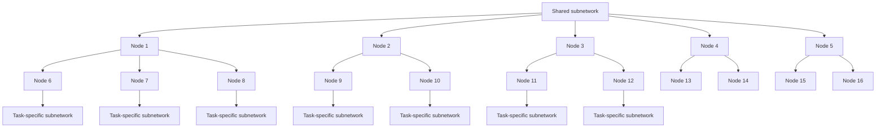
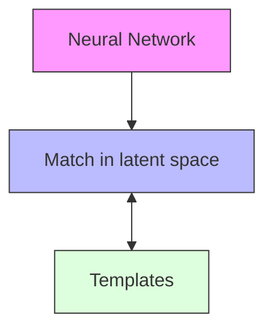

# Class Incremental Learning from First Principles: A Review

Neil Ashtekar

Artificial Intelligence Research Laboratory

Pennsylvania State University

nca5096@psu.edu

Jingxi Zhu

Artificial Intelligence Research Laboratory

Pennsylvania State University

jqz5678@psu.edu

Vasant G Honavar

Artificial Intelligence Research Laboratory

Pennsylvania State University

vhonavar@ist.psu.edu

Reviewed on OpenReview: https: // openreview. net/ forum? id= sZdtTJInUg

# Abstract

Continual learning systems attempt to efficiently learn over time without forgetting previously acquired knowledge. In recent years, there has been an explosion of work on continual learning, mainly focused on the class-incremental learning (CIL) setting. In this review, we take a step back and reconsider the CIL problem. We reexamine the problem definition and describe its unique challenges, contextualize existing solutions by analyzing non-continual approaches, and investigate the implications of various problem configurations. Our goal is to provide an alternative perspective to existing work on CIL and direct attention toward unexplored aspects of the problem.

# 1 Introduction

In the past decade, machine learning has made tremendous progress on wide range of applications including computer vision, natural language processing, recommender systems, robotics, and more. The dominant approach – deep learning – generally performs well given large datasets in the i.i.d. setting, in which many passes may be made over the same data during training. However, existing methods fail when new data arrives, as users must either (i) store the old data and retrain jointly on both the old and new data, thus incurring significant memory and computation costs, or (ii) choose between learning from the new data and retaining previously learned knowledge. The trade-off described in (ii) is commonly known as the stabilityplasticity dilemma (Carpenter & Grossberg, 1988). Recent work on continual learning has focused on ways to balance the stability-plasticity dilemma, with many solutions proposed to alleviate catastrophic forgetting, referring to the loss of old knowledge when learning anew (McCloskey & Cohen, 1989).

In this review, we consider supervised classification problems in the continual setting. Specifically, we focus on the class-incremental learning (CIL) problem setting, in which new classes of data are introduced over time (Van de Ven & Tolias, 2018). We seek to thoroughly understand both the problem statement and existing solutions, with a focus on unexplored directions.

Our work differs from recent continual learning review articles in several key ways, as summarized in Table 1. First, we specifically address the CIL setting, unlike De Lange et al. (2021); Mundt et al. (2023); Wang et al. (2024), and Verwimp et al. (2024). Second, we provide a novel categorization of existing approaches based on the shortcomings of non-continual methods, thus motivating and contextualizing recent work. Third, and perhaps most importantly, we focus on understanding and refining the CIL problem statement. This differs from Belouadah et al. (2021); Mai et al. (2022); Masana et al. (2022) and Zhou et al. (2024), which summarize and evaluate existing solutions. Instead, we investigate the challenging aspects of the problem and analyze the properties of a successful CIL system. Our main contributions are outlined below:

Table 1: Brief summary of review articles on continual learning (CL), class-incremental learning (CIL), and task-incremental learning (TIL). 

<table><tr><td>Review</td><td>Submission Year</td><td>Content</td></tr><tr><td>De Lange et al. (2021)</td><td>2019</td><td>Reviews and evaluates TIL approaches, focused on relatively early work</td></tr><tr><td>Belouadah et al. (2021)</td><td>2020</td><td>Summarizes work on CIL with empirical evaluations on image classification benchmarks</td></tr><tr><td>Mai et al. (2022)</td><td>2020</td><td>Focuses on empirical evaluations in the online CIL setting over various performance metrics</td></tr><tr><td>Masana et al. (2022)</td><td>2020</td><td>Reviews work on CIL in the context of image classification with evaluations across various task-splits and replay strategies</td></tr><tr><td>Mundt et al. (2023)</td><td>2020</td><td>Summarizes work on CL and establishes connections to open-set recognition and active learning</td></tr><tr><td>Zhou et al. (2024)</td><td>2023</td><td>Reviews deep learning approaches to CIL with memory-aligned evaluations on image classification benchmarks</td></tr><tr><td>Wang et al. (2024)</td><td>2023</td><td>Broad overview of work on CL covering computer vision, natural language processing, reinforcement learning, etc.</td></tr><tr><td>Tian et al. (2024)</td><td>2023</td><td>Summarizes and evaluates CIL methods specifically designed for the few-shot setting (FSCIL)</td></tr><tr><td>Verwimp et al. (2024)</td><td>2023</td><td>Outlines real-world CL applications in which “continual learning is not a choice” and describes general directions for future work</td></tr><tr><td>Ours</td><td>2024</td><td>Defines the CIL problem statement under resource constraints, describes properties of successful solutions</td></tr></table>

• In Section 2, we argue that the CIL problem should be redefined using constraints on memory and compute. We show that a commonly used problem statement is imprecise and admits extremely inefficient solutions.   
• In Section 3, we describe key challenges introduced by CIL. We show that addressing these challenges is both necessary and sufficient for solving the broader problem. In particular, we highlight the importance of across-task discrimination and provide a corresponding performance metric.   
• In Sections 4 and 5, we consider “naive” approaches which were not designed for continual learning. We analyze their strengths, weaknesses, and required modifications in the CIL setting, thus motivating existing work. Within this framing, we provide an overview of existing work.   
• In Section 6, we investigate the dimensions of the CIL problem. We characterize when the problem is easy versus hard, and describe how existing work addresses various problem configurations. Notably, we investigate class-to-task assignment and provide a surprising example illustrating its importance.   
• In Section 7, we conclude with suggestions for future work. Specifically, we argue that future solutions can and should make assumptions regarding the data generating process, as certain aspects of the world will remain fixed as new tasks are introduced.

# 2 Problem Statement

In this section, we formally define our problem statement. We focus our discussion on the class-incremental learning (CIL) setting as proposed in Van de Ven & Tolias (2018). We borrow notation and definitions from Zhou et al. (2024) and Kumar et al. (2023). First, we state the objective of CIL, then we provide two forms of restrictions imposed on potential solutions. These restrictions are crucial for ensuring that the problem is well defined and that solutions are non-trivial (i.e., CIL could be trivially solved by storing and repeatedly retraining on all of the data, though this is highly inefficient). We argue that restrictions in the form of resource constraints are more appropriate than restrictions on the availability of previously learned data.

# 2.1 Class-Incremental Learning

In CIL, we wish to sequentially learn a set of tasks $1 , \ldots , T$ . For each task $k \in \{ 1 , \ldots , T \}$ , we are given a corresponding dataset $\mathcal { D } _ { k } = \{ ( \boldsymbol { x } _ { i } ^ { k } , \boldsymbol { y } _ { i } ^ { k } ) _ { i = 1 } ^ { n _ { k } } \}$ sampled from an unknown, underlying distribution $\mathcal { D } _ { k } \sim \mathcal { T } _ { k }$ . Each task is a supervised classification problem with feature vectors $\pmb { x } _ { i } ^ { k } \in \mathbb { X }$ and categorical labels $y _ { i } ^ { k } \in { \mathbb Y } _ { k }$ . One or more classes are included in each task, and classes are disjoint across tasks $\left( \mathbb { Y } _ { k } \cap \mathbb { Y } _ { k ^ { \prime } } = \varnothing \right)$ , ∀k $\neq k ^ { \prime }$ and $\cup _ { k = 1 } ^ { T } \mathbb { Y } _ { k } = \mathbb { Y } )$ .

The overall goal is to learn a classifier $f : \mathbb { X } \to \mathbb { Y }$ with strong generalization performance across all classes. Task-identification information is not available to the model at inference. The classifier should perform well on all previously observed classes after learning each task: after learning task k, performance should be strong on all classes $\mathbb { Y } _ { 1 : k }$ . At task k, this goal can be expressed as learning $f _ { k } ^ { * }$ from the model’s hypothesis space H such that:

$$
f _ {k} ^ {*} = \underset {f _ {k} \in \mathcal {H}} {\operatorname{argmin}} \underset {(\boldsymbol {x}, y) \sim \mathcal {T} _ {1: k}} {\mathbb {E}} [ \mathbb {I} (f _ {k} (\boldsymbol {x}) \neq y) ] \tag {1}
$$

# 2.2 Restrictions while Learning

# 2.2.1 Old Restriction: Unavailability of Previous Data

Much of the existing work on CIL assumes that the data from previous tasks is not available when learning the current task. Formally, when learning task k, the model can only access $\mathcal { D } _ { k } .$ while $\mathcal { D } _ { 1 : k - 1 }$ are inaccessible. Many approaches to CIL (Kim et al., 2022; Van De Ven et al., 2021; Zhu et al., 2021a; Zhang et al., 2020a; Tao et al., 2020) as well as a recent survey on deep CIL (Zhou et al., 2024) explicitly include this restriction in the problem statement.

Completely restricting access to previous task data may appear reasonable. This restriction disallows trivial approaches which retrain on all of the data at every task. Also, security and/or privacy concerns are often cited as a reason to restrict access to old data. However, we argue that this restriction is both unnecessary and inadequate for building useful CIL systems. To understand why, consider the following critiques.

Critique #1: Inefficient solutions are allowed. First, if the unavailability of previous data is the only restriction (i.e., there are no other restrictions on memory and/or compute), then extremely inefficient solutions are allowed. In a recent analysis on the ImageNet-1K dataset, Harun et al. (2023a) finds that several highly-cited CIL algorithms actually use more compute1 than trivially retraining on all of the data at every task! In one respect, such algorithms defeat the purpose of using continual learning.

Critique #2: Security and privacy violations may persist. Second, note that deep neural networks have the capacity to essentially “memorize” training data (Zhang et al., 2021) and that decoding schemes can be used to reconstruct data from a trained network (Haim et al., 2022). As discussed in Verwimp et al. (2024), these observations lead us to question whether restricting access to old data truly addresses security or privacy concerns, as sensitive data could simply be recovered from trained models. This concern is not specific to deep neural networks – even simple generative or prototype-based classifiers may memorize data or be susceptible to data leakage.

Critique #3: Imprecise problem definition. Third, if previous task data cannot be stored but previously learned model(s) can be stored, then it becomes necessary to formally answer the question “What is a model?” or at least answer “What is the difference between a model and a dataset?” The existence of models such as K-nearest neighbors (which store the entire dataset) and prototype-based classifiers (which store representatives which may be very similar to the data) make these questions difficult to answer. Note that some early work has defined learning algorithms (models) with respect to data compression in the PAC learning framework (Blumer et al., 1987; Takimoto & Maruoka, 1993), though these definitions have not been referenced in the modern continual learning literature. For this reason, we argue that framing the CIL problem based on the unavailability of previous data results in an imprecise problem definition.

A note regarding relaxations of this restriction. We acknowledge that many approaches to CIL consider a relaxation of this restriction in which a relatively small subset of previous task data is available when learning the current task (see the discussion on replay-based approaches in Section 5). In this framing, solutions are typically allowed to store either a fixed number of samples per-class (Rolnick et al., 2019) or a fixed number of total samples (Wang et al., 2023). While we feel that this framing is a step in the right direction, we argue that it is still lacking. This is because (i) it does not include restrictions on compute, (ii) the number of stored samples is constrained but the size of the predictive model is not, and (iii) unnecessary assumptions are made regarding data storage. Drawback (i) allows computationally-inefficient solutions, which may be undesirable for CIL applications. Drawback (ii) implies that the total memory cost – stored samples and model parameters – may not be appropriately measured or constrained. Finally, drawback (iii) may introduce artificial constraints limiting solution performance. For example, it may be suboptimal to store the same number of samples for each class. Alternatively, storing task-specific model components can sometimes be a better use of a given memory budget as compared to storing data samples, as discussed in Zhou et al. (2023).

# 2.2.2 New Restriction: Resource Constraints

An alternative framing of the CIL problem restricts solutions using resource constraints instead of restricting access to previous task data. Recent work frames the continual learning problem as computationally constrained reinforcement learning (Kumar et al., 2023). In this framing, a continual learning agent attempts to maximize its average reward2 under restrictions on memory and compute. For example, memory constraints may limit the total size of a model, while computational constraints may limit the number of floating point operations performed when learning each task.

Resource constraints prevent trivial retraining using all of the data at every task, either because storing the entire dataset would require too much memory and/or because full retraining would be too computationally expensive. Because trivial retraining is infeasible, continual learning methods are necessary. We argue that framing the CIL problem in terms of resource constraints rather than data availability results in a more appropriate problem statement and will lead to the development of truly useful, real-world CIL systems.

Resource constraints can take many forms. For example, edge devices performing CIL may have strict latency or power constraints, permitting only a small number of learning updates (Yoshikiyo et al., 2022; Wang et al., 2022b). On the other hand, large GPU servers performing CIL may be relatively unconstrained with respect to memory, and are instead constrained by the monetary cost of compute (e.g., renting large instances on cloud computing platforms may be prohibitively expensive, see Prabhu et al. (2023b) for details). In this case, it may be desirable to develop CIL algorithms which jointly optimize for classification performance as well as computational efficiency. Here, resource constraints are not fixed, but rather become part of the optimization objective.

In summary, we emphasize the importance of including application-specific resource constraints as part of the CIL problem definition. Doing so avoids the issues caused by restricting the availability of previous task data: resource constraints formally define the space of potential solutions and disallow loopholes, there is no need to formally define “model” versus “data”, and the problem is not made artificially difficult by misconstrued privacy or security concerns. In the following sections, we will consider the resource-constrained version of the CIL problem statement.

# 2.3 Related Problem Statements

We briefly describe other continual classification problem statements below, based on the categorization given in Van de Ven & Tolias (2018). While the focus of this work is CIL, note that the arguments for the resource-constrained setting in Section 2.2 are applicable to CIL as well as TIL, DIL, and OCL, and extend to continual learning problem settings even beyond classification.

Few-Shot Class-Incremental Learning (FSCIL). FSCIL involves continually learning new classes of data given only a small number of samples per class. This setting is typically addressed using some form of pretraining: learning on a large, general-purpose dataset with many samples prior to continual learning. FSCIL inherits the challenges of CIL described in Section 3.1, with the added difficulty of unreliable empirical risk minimization, i.e., avoiding overfitting when learning from a small sample size (Wang et al., 2020).

Task-Incremental Learning (TIL). The TIL problem setting is very similar to that of CIL: new classes are introduced incrementally, and the classifier must efficiently adapt while maintaining previously learned knowledge. However, in TIL, task-identifiers are provided at inference. This removes the need for learning across-task discrimination, discussed in Section 3.1. TIL can be viewed as an “easier” version of CIL.

Domain-Incremental Learning (DIL). In DIL, the set of classes is fixed, but the distribution of features for each class changes over time. Similarly to CIL and TIL, the classifier must continually learn while mitigating forgetting. Unlike CIL and TIL, this challenge must be addressed at the level of feature distributions rather than at the class-level. Task-identifiers are unavailable at inference. Therefore, the key challenges described in Section 3.1 for CIL each have counterparts for DIL.

Online Continual Learning (OCL). OCL involves learning from small batches of data introduced incrementally (Mai et al., 2022). This differs from (non-online) CIL, in which all of the data from a given class is available when learning its corresponding task. In other words, samples from a single class may be split across multiple timesteps. In the extreme case, samples may be introduced one at a time. This introduces the additional challenge of aggregating knowledge across timesteps for samples within a given class. Note that OCL is a broad categorization which is not specific to classification. In addition, these problem settings can be combined. For example, CIL + DIL + OCL is sometimes referred to as Task-Free Continual Learning (TFCL) (Aljundi et al., 2019a).

# 2.4 Real-world CIL Example: Social Media Post Classification

To motivate our problem statement, we outline a potential real-world system which fits the resourceconstrained CIL setting. We discuss the problem of real-time, social media post classification, with new classes introduced incrementally. Classes could correspond to post content (text, images, or videos) with applications for fraud detection, content moderation, targeted advertising, and more. Note that this problem may not be trivially solvable using hashtags or interest tagging, as posts may be implicitly referring to a given topic and fraudulent content may be intentionally obfuscated. The problem may be framed as “traditional” CIL or online CIL depending on how the data is collected and training is scheduled.

Popular social media platforms receive an extremely high volume of posts – according to Twitter’s official blog, an average of 500 million tweets were shared every day in 2014 – and new classes may be introduced in a short time period corresponding to current events or newly developed types of fraud. Further, posts may need to be classified in near real-time in order to avoid the spread of misinformation or limit online scams. These concerns motivate the resource-constrained setting – the extremely high volume of posts necessitates computationally efficient learning, and the real-time nature of the application requires a low inference cost.

In such a setting, the entire sequence of training data is stored by default (i.e., posts from several years ago are available on a user’s profile and therefore must be stored on the platform’s server). This removes the “unavailability of previous data” restriction discussed in Section 2.2 and places on the focus instead on computational efficiency. Note that this shift in focus significantly changes the solution space. Solutions leveraging K-nearest neighbors or other forms of locally-weighted learning may be appropriate, and such techniques could be learned atop pretrained representations – see Prabhu et al. (2023b) for one such approach.

Such an approach may serve as a starting point, with modifications necessary to meet performance and efficiency goals. For example, the pretrained representation may need to be continually fine-tuned in order to improve classification accuracy, requiring some form of replay and/or knowledge distillation (see Section 5 for details). Further, even if all of the training data is stored, computational constraints may limit the amount of data used when learning continually, necessitating an intelligent sampling strategy. Finally, efficient inference techniques (e.g., forms of locality-sensitive hashing) may be required to meet near real-time classification constraints. Note that the example of social media post classification is not unique: applications ranging from cybersecurity to epidemiology involve similarly high volumes of data and may require fast inference. For further examples of real-world continual learning applications, see Verwimp et al. (2024).

# 3 Key Challenges

It is worth understanding what makes the CIL problem challenging as compared to learning in the noncontinual setting. We outline three main challenges: balancing stability and plasticity, learning across-task discrimination, and transferring knowledge across tasks. None of these challenges are present in the noncontinual setting, which can be thought of as a single task. We first describe these challenges then discuss why they are significant.

# 3.1 Challenges

Balancing stability and plasticity. The stability-plasticity dilemma refers to the ability to learn new tasks while maintaining previously learned knowledge (Carpenter & Grossberg, 1988). Loss of stability is typically referred to as forgetting – or catastrophic forgetting (McCloskey & Cohen, 1989), due to its empirically observed severity – and can be measured as the degradation of model performance on old tasks as new tasks are learned. Lack of plasticity can be defined using intransigence (Chaudhry et al., 2018a). Intransigence reflects a model’s inability to acquire new knowledge, measured as the difference in performance across the continual and non-continual settings.

To provide formal definitions, we introduce notation3 originally proposed in Lopez-Paz & Ranzato (2017). Let ${ \bf \bar { R } } \in \mathbb { R } ^ { T \times T }$ be the train-test performance matrix, with elements indicating some performance measure4 for a given classifier. Element $R _ { i , j }$ denotes the performance on the test set of task j immediately after learning the training set of task i. We assume that tasks are learned in the order in which they are presented: tasks $1 , \ldots i - 1$ are learned in order before task i is learned. For all of the following metrics with subscripts i and j, we assume that task i is learned before task j. Formally, $i \leq j$ in Eqs. 2, 4, 5, and 6.

The amount of forgetting on task i after learning tasks $i + 1 , \dots , j$ can be quantified as:

$$
\boldsymbol {F} _ {i, j} = \max _ {k \in \{i, \dots , j - 1 \}} \boldsymbol {R} _ {k, i} - \boldsymbol {R} _ {j, i} \tag {2}
$$

The max operation is included in order to account for backward knowledge transfer – see discussion following Eq. 6 for details. The intransigence on task i after learning tasks $1 , \ldots , i - 1$ can be quantified as:

$$
\boldsymbol {I} _ {i} = \boldsymbol {R} _ {i} ^ {*} - \boldsymbol {R} _ {i, i} \tag {3}
$$

Here, $\boldsymbol { R } _ { i } ^ { * }$ denotes the performance of a reference model on task i. This reference model is learned in the non-continual setting, i.e., jointly trained on all data $\cup _ { k = 1 } ^ { T } \mathcal { D } _ { k }$ . Performance in the non-continual setting is often used as an upper bound for performance in the continual setting, and the corresponding performance gap indicates an inability to continually learn new tasks. For fair evaluations, the reference model and continual learning model should have similar architectures.

Learning across-task discrimination.5 At inference, CIL methods must perform classification across all learned classes without the aid of task-identifiers. Namely, after learning task k, the model should be able to perform classification over all classes $\mathbb { Y } _ { 1 : k }$ . This requires the ability to discriminate between classes within each task and across all tasks. Note that the definitions of stability and plasticity defined above are insufficient for ensuring that across-task discrimination is learned. This is because these definitions only consider within-task performance. CIL solutions must include some mechanism to learn and maintain across-task discrimination.

To formally define across-task discrimination, consider the normalized confusion matrix $M ^ { j }$ populated after learning tasks $1 , \ldots , j$ . Matrix $M ^ { j }$ has dimensionality $| \mathbb { Y } _ { 1 : j } | \times | \mathbb { Y } _ { 1 : j } | , ^ { 6 }$ with element $M _ { m , n }$ indicating the proportion of instances of class m which are predicted as class n after evaluation on a test set. In other words, the rows of $M ^ { j }$ correspond to the actual classes, while the columns of $M ^ { j }$ correspond to the predicted classes. To simplify notation, let $\mathbb { C } _ { i }$ be the set of indices corresponding to the classes in task i. For example, $\mathbb { C } _ { 1 } = \{ 1 , \dots , | \mathbb { Y } _ { 1 } | \} , \mathbb { C } _ { 2 } = \{ | \mathbb { Y } _ { 1 } | + 1 , \dots , | \mathbb { Y } _ { 1 } | + | \mathbb { Y } _ { 2 } | \}$ , and so on. Within a task, the assignment of indices to classes is arbitrary. Consider a model which has learned tasks $1 , \ldots , j$ , and consider a task i such that $i \leq j$ . The model’s across-task discrimination performance with respect to task i can be defined as:

$$
\boldsymbol {A} \boldsymbol {T} \boldsymbol {D} _ {i, j} = \frac {1}{| \mathbb {C} _ {i} |} \sum_ {m \in \mathbb {C} _ {i}} \sum_ {n \in \mathbb {C} _ {i}} \boldsymbol {M} _ {m, n} ^ {j} \tag {4}
$$

This quantity simply measures how often the model predicts a class from the correct task at inference. Visually, it corresponds to the values within a square subset of the confusion matrix along the diagonal.

Transferring knowledge across tasks. It is reasonable to assume that there will be similarity across tasks in a given CIL application. Ideally, knowledge accumulated from old tasks should improve performance when learning new tasks, and learning new tasks should also improve performance on old tasks. In other words, both forward transfer and backward transfer are desirable. Consider two tasks, i and $j ,$ with $i < j$ . The forward transfer from earlier tasks $1 , \ldots , i$ to later task j can be measured as:

$$
\boldsymbol {F} \boldsymbol {W} \boldsymbol {T} _ {i, j} = \boldsymbol {R} _ {i, j} \tag {5}
$$

This definition of forward transfer is equivalent to the model’s zero-shot performance on task $j .$ The backward transfer from later tasks $i + 1 , \dots , j$ to earlier task i can be measured as:

$$
\boldsymbol {B} \boldsymbol {W} \boldsymbol {T} _ {i, j} = \max _ {k \in \{i, \dots , j - 1 \}} \boldsymbol {R} _ {j, i} - \boldsymbol {R} _ {k, i} \tag {6}
$$

This definition of backward transfer is similar to the negation of forgetting in Eq. 2. Forgetting measures how much performance on an earlier task decreases when learning later tasks, while backward transfer measures how much performance on an earlier task increases when learning later tasks. These metrics are typically reported only when their values are nonnegative: when backward transfer is positive, it is reported rather than “negative forgetting”, and vice versa. Note that Eqs. 2 and 6 both include the max operation – this is because both definitions are cumulative. For example, knowledge may be transferred backward and later forgotten, or knowledge may forgotten and later re-learned through backward transfer. Eqs. 2 and 6 account for such situations. Forgetting and backward transfer could alternatively be defined without the max operation (replacing the $\scriptstyle R _ { k , i }$ term with $R _ { i , i } )$ resulting in a non-cumulative definitions.

# 3.2 Why these challenges?

Successful within-task discrimination is a consequence of stability and plasticity. While withintask discrimination is a necessary component of successful CIL systems, we do not include it as a key challenge. Instead, we argue that achieving and maintaining strong within-task performance is a consequence of sufficient stability and plasticity. Recall that $R _ { i , j }$ denotes the performance on task $j$ after learning task i. Strong within-task performance can be formalized as follows: immediately after task i is learned, $R _ { i , j }$ should be sufficiently high for all previously learned tasks $j \leq i .$ . This should hold for all tasks $i \in \{ 1 , \ldots , T \}$ . Note that the terms “strong performance” and “sufficiently high” are subjective, and can be defined based on application-specific and/or task-specific criteria.

This formalization simply requires that performance be strong for the most recently learned task as well as for all of the other previously learned tasks. Strong performance on the most recently learned task is equivalent to low intransigence in Eq. 3. Maintaining performance on prior tasks is equivalent to low forgetting in $\operatorname { E q . }$ 2. Therefore, sufficient stability and plasticity results in successful within-task discrimination.

Learning across-task discrimination is necessary for CIL. As proved in Kim et al. (2022), strong within-task discrimination and strong across-task-discrimination are together necessary and sufficient conditions for strong CIL performance. In other words, a model will have strong overall performance if and only if it is can accurately distinguish between classes from the same task and across classes from different tasks. Learning and maintaining across-task discrimination is therefore a key challenge in CIL.

Strong across-task performance can be formalized as follows. Immediately after learning task j, $A T D _ { i , j }$ (Eq. 4) should be sufficiently high for all previously learned tasks $i \leq j$ . This condition should hold for each task $j \in \{ 1 , \dots , T \}$ . This formalization is very similar to the formalization of strong within-task performance, with $A T D _ { i , j }$ used instead of $R _ { i , j }$ . However, there is an important difference between the within-task and across-task discrimination problems: the across-task problem grows as new tasks are introduced, while each within-task problem has a fixed number of classes. It may be necessary to recalibrate performance expectations as the number of tasks grows and across-task discrimination increases in difficulty.7

In addition, we argue that across-task discrimination is a larger part of the overall CIL problem as compared to within-task discrimination. To provide evidence for this claim, we first discuss a commonly used CIL benchmark – the split CIFAR-100 dataset – then discuss the general case. The CIFAR-100 dataset contains 100 classes, and is often divided8 into 10 tasks, each containing 10 classes, to form the “split” version for CIL evaluations. Given a sample at inference after all tasks have been learned, the model should predict its corresponding class out of the 100 total classes. This requires distinguishing the correct class (i) versus 9 incorrect classes from the same task and (ii) versus 90 incorrect classes from other tasks. In this example, across-task discrimination dominates the CIL problem, as the model must predict across many more classes out-of-task versus within-task.

This observation extends beyond any specific dataset. Unless one task contains more than half of all of the learned classes, it will always be true that across-task discrimination is a larger part of the CIL problem as compared to within-task discrimination. While a couple of recent studies (Soutif-Cormerais et al., 2021; Guo et al., 2023) focus specifically on the across-task discrimination problem in CIL, we are not aware of any prior work which explicitly mentions this observation. This is noteworthy considering that many CIL approaches heavily emphasize the avoidance of within-task forgetting while placing relatively little emphasis on across-task discrimination – see Section 5 for details.

Knowledge transfer can improve both performance and resource efficiency. Exploiting knowledge transfer between similar tasks could improve a model’s predictive performance and decrease both memory and computational costs. For example, sharing parameters across tasks could decrease overall model size compared to learning isolated submodels for each task. A model could exploit forward transfer (Eq. 5) by initializing new, task-specific parameters to the values learned on a prior, similar task, thus reducing the number of iterations required for convergence. Such approaches may be necessary to achieve a desired level of predictive performance under resource constraints.

# 4 Naive Approaches

In this section, we discuss the application of traditional (i.e., non-continual) machine learning classifiers in the CIL setting. This is “naive” in the sense that these models would be expected to fail in the CIL setting, as they are not designed for continual learning. We discuss three types of classifiers: (1) a single discriminative model for all tasks, (2) task-specific discriminative models, and (3) class-specific generative models. These approaches are illustrated in Figure 1.

Some of the observations in this section may seem obvious or redundant in light of recent work on continual learning. However, we feel that this section is important as it provides a principled way of developing solutions to the CIL problem. This section also serves to contextualize existing work and provide insights for potential future work. Table 2 and Table 3 summarize the main takeaways. Table 2 outlines how each naive approach addresses the “Key Challenges” described in Section 3, while Table 3 outlines the memory and compute requirements for each approach, relevant to the resource-constrained problem statement defined in Section 2.

# 4.1 Background: Generative and Discriminative Classifiers

Discriminative Classifiers. Probabilistic discriminative classifiers directly model $P ( \boldsymbol { y } | \boldsymbol { x } )$ . Discriminatively trained models such as logistic regression and deep learning classifiers typically accomplish this by optimizing for cross-entropy loss:

$$
\mathcal {L} _ {\mathrm{CE}} = - \sum_ {i = 1} ^ {N} \sum_ {c = 1} ^ {C} \boldsymbol {y} _ {i, c} \log \hat {\boldsymbol {y}} _ {i, c} \tag {7}
$$

where $\mathcal { L } _ { \mathrm { C E } }$ is the cross-entropy loss on a training set with N samples and C classes. The true labels are represented as y and the predicted labels are represented as yˆ. For sample $i , \ y _ { i }$ and $\hat { y } _ { i }$ are C-dimensional vectors indexed by c. $\mathbf { \nabla } _ { \mathbf { \psi } _ { 3 } }$ is a one-hot vector and $\hat { y } _ { i }$ is a vector of predicted probabilities. A regularization term penalizing large weights is often included in the overall loss, though this term is not relevant to our discussion in this section.

Generative Classifiers. Probabilistic generative classifiers take an indirect approach to modelling $P ( y | \mathbf x )$ . Namely, generative classifiers model the joint distribution $P ( \pmb { x } , y )$ , factorized as $P ( \pmb { x } | y ) P ( y )$ , then use Bayes’ rule for classification:

$$
P (y | \boldsymbol {x}) = \frac {P (\boldsymbol {x} | y) P (y)}{P (\boldsymbol {x})} \tag {8}
$$

When classifying a single sample, the denominator $P ( { \pmb x } )$ is a constant and can be ignored. In the numerator, $P ( y )$ can be modelled by simply counting the number of instances in a given class. Therefore, the key challenge is modelling $P ( { \pmb x } | { \pmb y } )$ . This can be accomplished by creating a separate generative model for each class. These models can be very simple, such as Gaussian Naive Bayes, which represents each feature’s distribution for a given class as a univariate Gaussian. Alternatively, more complex models such as variational autoencoders could be used to learn each class conditional distribution.

# 4.2 Naive Approaches

Approach #1: Single Discriminative Model for All Tasks. We start by discussing the use of a single, discriminatively-trained model in the CIL setting. For example, consider a neural network classifier trained with cross-entropy loss. Before learning the first task, the network is instantiated with $\left| { \mathbb { Y } _ { 1 } } \right|$ neurons in its output layer, corresponding to the number of classes in the first task. The network is trained until convergence on the first task’s data $\mathcal { D } _ { 1 }$ . Next, $\left| \mathbb { Y } _ { 2 } \right|$ additional neurons with randomly-initialized weights are added to the network’s output layer prior to learning the second task. The network is trained to convergence on the second task’s data $\mathcal { D } _ { 2 }$ , and the process repeats for the remaining tasks.

  
Figure 1: Illustration of naive approaches to CIL. Two classification tasks are shown: dog versus cat and apple versus orange, shown in light red and light blue boxes respectively. Stylized neural network implementations for each approach are illustrated, with output node color corresponding to task. Discriminative approaches include one output node for each class, used to predict $P ( y | \pmb { x } )$ . The generative approach includes three output nodes for each class, illustrating a variational autoencoder which attempts to reconstruct the input. Importance sampling can then be used to predict $P ( { \pmb x } | { \pmb y } )$ – see the implementation described in Van De Ven et al. (2021) for details. Task sequence illustration inspired by Zhou et al. (2024). Best viewed in color.

This approach will almost certainly result in severe forgetting, as it does not include any mechanism to maintain knowledge learned on previous tasks. In other words, this approach highly favors plasticity over stability. In addition, it is unlikely that across-task discrimination will be learned, given that the model only performs discriminative learning within each task. Finally, partial knowledge transfer is realized. When learning task k + 1, the model is initialized with knowledge from task k, thereby allowing forward transfer between consecutive tasks.

The memory cost and inference compute required for a single discriminative model are both approximately constant. Here, we assume that the number of output layer weights is small relative to the model’s total number of weights. The required training compute scales linearly with the number of tasks.9

Approach #2: Task-Specific Discriminative Models. Instead of using a single discriminative model for all tasks, separate discriminative models could be used for each specific task. For example, a neural network with |Y1| output layer neurons could be trained on $\mathcal { D } _ { 1 }$ , then a separate, randomly-initialized network with |Y2| output layer neurons could be trained on $\mathcal { D } _ { 2 } .$ , and so on.

When using this approach, both stability and plasticity are achieved – an entirely new model is learned for each task (plasticity), and models do not interfere with one another (stability). However, it is still unlikely that across-task discrimination is learned – as previously discussed, learning within-task discrimination is typically inadequate for performing across-task discrimination. Lastly, knowledge transfer will not be realized, since task-specific models are completely separate and randomly-initialized.

The memory, training compute, and inference compute all scale linearly with the number of tasks in this context, as new models must be allocated and trained for each task. As task identification is not provided at inference, all models must be run when classifying test data.

Approach #3: Class-Specific Generative Models. Generative models serve as an alternative naive solution to CIL. For example, consider training a separate variational autoencoder (VAE) to model the conditional probability distribution P (x|yk) for each class k. When learning the first task, |Y1| VAEs are each trained in parallel on class-specific subsets of T1. When learning the second task, $\left| \mathbb { Y } _ { 2 } \right|$ additional VAEs are each trained in parallel on class-specific subsets of $T _ { 2 }$ . This process repeats for all tasks.

In this approach, stability and plasticity are both achieved as additional model(s) are allocated for each task. In addition, across-task discrimination is learned. This is because generative models are learned at the classlevel rather than at the task-level, therefore class-to-task assignment is irrelevant. Still, knowledge transfer remains unrealized since class-specific models are learned independently.

Given that class-specific models are trained, the required memory, training compute, and inference compute all scale linearly with the number of classes. At inference, all models are run and Bayes’ rule (more precisely, the numerator of Eq. 8) is used to make predictions.

Interestingly, note that learning a generative classifier in the CIL setting is essentially the same as learning a generative classifier in the non-continual setting, as discussed in Van De Ven et al. (2021). In other words, training a generative classifier on a set of classes in the CIL setting will result in the exact same model as training the classifier in the non-continual setting. This is because generative classifiers are trained at the class-level, and do not require simultaneous access to data from multiple classes in order to learn (unlike discriminative classifiers). As a result, the predictive performance of generative classifiers is unaffected by both class-to-task assignment and task order.

Table 2: Key challenges addressed by naive (i.e., non-continual) approaches to CIL. A red x-mark indicates that a given challenge is unaddressed, while a green check mark indicates that a given challenge is addressed. An asterisk indicates that a challenge is partially addressed. 

<table><tr><td></td><td>Stability</td><td>Plasticity</td><td>Across-Task Discrimination</td><td>Knowledge Transfer</td></tr><tr><td>Single Discriminative Model</td><td>✗</td><td>√</td><td>✗</td><td>√*</td></tr><tr><td>Task-Specific Discriminative Models</td><td>√</td><td>√</td><td>✗</td><td>✗</td></tr><tr><td>Class-Specific Generative Models</td><td>√</td><td>√</td><td>√</td><td>✗</td></tr></table>

Table 3: Memory and compute requirements for naive (i.e., non-continual) approaches to CIL. The total number of tasks to be learned is T , while the total number of classes to be learned is C. Note that $C = | \mathbb { Y } _ { 1 : T } |$ . 

<table><tr><td></td><td>Memory</td><td>Training Compute</td><td>InferenceCompute</td></tr><tr><td>SingleDiscriminative Model</td><td> $\mathcal{O}(1)$ </td><td> $\mathcal{O}(T)$ </td><td> $\mathcal{O}(1)$ </td></tr><tr><td>Task-SpecificDiscriminative Models</td><td> $\mathcal{O}(T)$ </td><td> $\mathcal{O}(T)$ </td><td> $\mathcal{O}(T)$ </td></tr><tr><td>Class-SpecificGenerative Models</td><td> $\mathcal{O}(C)$ </td><td> $\mathcal{O}(C)$ </td><td> $\mathcal{O}(C)$ </td></tr></table>

# 5 Existing Work

The observations in Section 4 suggest natural solutions to the CIL problem. Each of the three naive approaches serve as a starting point when developing CIL solutions, with modifications necessary to address the key challenges described in Section 3 under the resource constraints described in Section 2. In this section, we provide a high-level, non-comprehensive overview of existing work on CIL within this framing, covering the main ideas proposed in work published prior to September 2024. We describe the major categories of approaches and outline the key design choices for each category. An illustration these categories is shown in Figure 2.

# 5.1 Modifying a Single Discriminative Model: Replay and Regularization

To succeed in the CIL setting, a single discriminative model must be supplemented with mechanisms to avoid forgetting (i.e., maintain stability) and learn across-task discrimination. The majority of work on the CIL setting focuses on this direction (Zhou et al., 2024). Here, we discuss two categories of approaches – replay and regularization – used to supplement discriminative models in the CIL setting.

Replay. This set of approaches allows models to revisit previous task data when learning new tasks. A relatively small subset of previous task data is stored in a replay buffer. When new tasks arrive, the model is trained jointly on the new task data as well as the old replay data. Because the loss (Eq. 7) is optimized over samples from both the current task and previous tasks, forgetting is mitigated and across-task discrimination is learned. The data in the replay buffer is often referred to as class exemplars, and replay is sometimes called rehearsal.10

In general, replay-based methods are designed with the goal of limiting the size of the replay buffer while maintaining strong performance on previous tasks. The design of such methods requires answers to three key questions: (1) Which samples should be stored? (2) How should these samples be stored? (3) How should these samples be replayed during training?

To address question (1), previous work has proposed the use of herding algorithms (Welling, 2009) to select “prototypical” samples (Rebuffi et al., 2017), maximizing sample diversity with respect to model gradient updates (Aljundi et al., 2019b), and selecting difficult-to-classify samples based on prediction entropy (Chaudhry et al., 2018b).

Solutions proposed to address question (2) include storing learned representations (Iscen et al., 2020) or compressed features (Zhao et al., 2021) rather than raw features, or learning a generative model in order to create synthetic data for replay (Shin et al., 2017; Hu et al., 2018; Kemker & Kanan, 2018) (sometimes called generative replay or pseudo-rehearsal). While generative replay approaches require learning a generative model, this model is used to generate data for a downstream discriminative model, hence their grouping with other discriminative models.

To answer question (3), most approaches (Rebuffi et al., 2017; Chaudhry et al., 2018b; Aljundi et al., 2019b; Zhao et al., 2021; Iscen et al., 2020; Shin et al., 2017; Hu et al., 2018; Kemker & Kanan, 2018) use a straightforward application of replay – for each task, the model minimizes the loss over both the current task data and the previous task data from the replay buffer. Alternatively, some approaches (Lopez-Paz & Ranzato, 2017; Wang et al., 2021; Zeng et al., 2019; Tang et al., 2021) frame learning the current task as a constrained optimization problem in which model parameters may only be updated such that the loss on the replay data does not increase (or increases only by a small amount).

Replay-based approaches have been observed to be biased towards the recently learned classes. This bias is due to data imbalance, as there is typically much more data available in the current task as compared to the previous tasks. Several methods have been proposed to mitigate this bias. These methods include the addition of a simple rectification layer used to adjust predictions (Wu et al., 2019), making use of statistical information from previous classes for de-biasing (Belouadah & Popescu, 2019), and compensating for bias at the gradient level during optimization (Guo et al., 2023).

Regularization. This second set of techniques attempts to retain previously learned knowledge using a regularization term in the loss function. This regularization term penalizes changes in model behavior with respect to old tasks. Note that this penalty is used to mitigate forgetting, though it is typically insufficient for learning across-task discrimination (Lesort et al., 2019). Regularization approaches fall into two subcategories: parameter-based and data-based regularization (De Lange et al., 2021).

Parameter-based regularization approaches attempt to retain parameter values which are important for strong performance on previously-learned tasks. These parameters should not change when learning new tasks, otherwise forgetting may occur. Intuitively, only the unimportant parameters for tasks 1, . . . , k may be modified when learning task k + 1. Many approaches in this subcategory use Fisher Information as an importance measure (Kirkpatrick et al., 2017; Lee et al., 2017; Chaudhry et al., 2018a; Yang et al., 2019; 2023b). Some approaches compute parameter importance after tasks have been learned (Kirkpatrick et al., 2017) while others compute importance during learning (Zenke et al., 2017; Chaudhry et al., 2018a).

Data-based regularization methods typically leverage knowledge distillation to mitigate forgetting. Knowledge distillation is traditionally used to transfer knowledge from a larger teacher model to a smaller student model in an attempt to replicate the teacher’s performance using the student (Hinton et al., 2015). In continual learning, the model(s) trained on previous tasks serve as the teacher, and the model trained on the current task serves as the student. The student model attempts to learn the current task while replicating the performance of the teacher on previous tasks, accomplished via an additional distillation term in the loss function. Distillation may be performed at the level of the logits – the final layer of the neural network (Li & Hoiem, 2017; Rebuffi et al., 2017; Zhang et al., 2020b; Hou et al., 2018; Smith et al., 2021; Lee et al., 2019; Zhou et al., 2021) – or at the level of the learned representation – an intermediate layer of the network (Simon et al., 2021; Lu et al., 2022; Kang et al., 2022; Hu et al., 2021b). Some approaches (Rebuffi et al., 2017; Zhao et al., 2020; Lee et al., 2019) combine data-based regularization with replay to improve distillation performance using a set of exemplars from previous tasks.

Similar to replay, regularization-based approaches tend to be biased toward the current task data. In addition, regularization-based approaches attempt to maintain separability across classes within each previously learned task, but are typically unable to learn separability across tasks. A number of methods have been proposed in an effort to address these issues. (Zhao et al., 2020) and (Hou et al., 2019) ensure that weights have comparable magnitudes across both old and new classes to achieve fair classification, (Ahn et al., 2021) separates softmax activations in the output layer to avoid task-recency bias, and (Castro et al., 2018) uses balanced fine-tuning to stabilize predictions.

flowchart

(d) Parameter Isolation

flowchart

(e) Template-Based   
Figure 2: Illustration of existing work on CIL. Each subfigure depicts a stylized neural network, representing the high-level idea behind a given category of approaches. “Template-based” approaches include generative classifiers and hybrid models. These approaches match input samples to learned templates – class prototypes or class-conditional distributions – in order to perform classification. Best viewed in color.

# 5.2 Modifying Task-Specific Discriminative Models: Parameter Isolation

Both stability and plasticity can be achieved by allocating separate discriminative models for each task. However, this approach lacks mechanisms to learn across-task discrimination and exploit knowledge transfer. In addition, learning completely separate models for each task may be inefficient with respect to memory and compute. Parameter isolation methods address these challenges.

Parameter Isolation. This family of methods allocates sets of discriminatively-trained parameters (i.e., submodels) specific to each task that may not be modified when learning other tasks. Parameter isolation is a simple way to avoid forgetting – if previously learned knowledge is never modified, then it will never be overwritten when learning continually. However, parameter isolation methods introduce a new problem: at inference, they require an additional task-selector model – used to predict the task label – in order to choose the relevant task-specific submodel. In other words, most parameter isolation approaches decompose the CIL problem into task prediction (TP) and within-task prediction (WP) (Kim et al., 2022). Approaches to TP include using model prediction entropy to infer task label (Wortsman et al., 2020), creating a separate network as a dedicated task predictor (Abati et al., 2020), and utilizing out-of-distribution detection models (Kim et al., 2022).

Parameter isolation methods can be divided into two subcategories – fixed architecture and dynamic architecture – based on their approach to WP. Fixed architecture methods start with a fixed-size network and allocate task-specific subnetworks during training. Approaches to subnetwork allocation include the use of weight masks (Serra et al., 2018; Wortsman et al., 2020), genetic algorithms (Fernando et al., 2017), and pruning (Mallya & Lazebnik, 2018). Alternatively, dynamic architecture methods do not have a fixed size, and expand as necessary in order to learn new tasks. These approaches are concerned with efficiently expanding model size as new tasks arrive in order to minimize memory cost while maintaining strong performance. Various techniques have been proposed to accomplish this goal, including dynamically creating and deleting neurons (Yoon et al., 2018), framing the problem as reinforcement learning (Xu & Zhu, 2018) or neural architecture search (Li et al., 2019), using compression (Schwarz et al., 2018) or distillation (Wang et al., 2022a) to lower the model’s memory footprint, and focusing expansion on specific components to better transfer knowledge across tasks (Zhou et al., 2023). Interestingly, Kim & Han (2023) finds that many CIL methods heavily favor stability over plasticity, and proposes holding earlier layers stable while expanding later layers in order to strike a fairer balance between old and new tasks.

# 5.3 Modifying Class-Specific Generative Models: Generative Classifiers, Hybrids, and Pretraining

Recall that generative classifiers are a natural fit for CIL – they achieve both stability and plasticity, and learn across-task discrimination without requiring a task-prediction model. However, traditional generative classifiers suffer from poor memory and compute scaling and lack mechanisms to leverage knowledge transfer.

In addition, the predictive performance of generative classifiers is typically inferior to that of discriminative classifiers in the non-continual setting. This statement is supported by a wealth of theoretical and empirical evidence, see Vapnik (1998) and Ng & Jordan (2001). At a high level, this is because generative classifiers solve a more difficult problem – intermediately modelling $P ( { \pmb x } | { \pmb y } )$ – while discriminative classifiers solve an easier problem – directly modelling $P ( y | \pmb { x } )$ . Generative classifiers and hybrid generative-discriminative models designed for CIL attempt to remedy these issues through modifications which improve resource efficiency, leverage knowledge transfer, and boost predictive performance.

Generative Classifiers. In addition to the large body of work on discriminative classifiers for CIL, there exists a smaller body of work focused on generative classifiers. Van De Ven et al. (2021) proposes generative classifiers for the CIL setting and provides results with a class-specific variational autoencoders (VAEs) as a proof-of-concept. Other approaches also utilize VAEs (Ye & Bors, 2021a; 2023) as well as generative adversarial networks (GANs) (Ye & Bors, 2020; 2021b) but focus on ways to efficiently expand the architecture and exploit knowledge transfer between submodels.

Hybrid Models. Some approaches cannot be cleanly categorized as generative or discriminative. These approaches include prototype-based classifiers, one-class classifiers, and hybrid generative-discriminative classifiers. Many of these approaches retain the desirable properties of generative classifiers while avoiding the drawbacks of strictly discriminative classifiers.

Prototype-based classifiers (Zhu et al., 2021b; De Lange & Tuytelaars, 2021) learn prototypical representations for each class and use nearest neighbor matching for classification. Similar to Naive Bayes, prototypebased classifiers are natural continual learners, as new prototypes can be learned as new classes are introduced (Grossberg, 2020; Ashtekar & Honavar, 2023). One-class classifiers (Hu et al., 2021a; Sun et al., 2023) learn independent models for each class. These models are optimized to predict high values for in-class data – similar to conditional generative models – though one-class classifiers use different objective functions (Hu et al., 2020).

Hybrid generative-discriminative classifiers (Kirichenko et al., 2021), combine the lack-of-forgetting of generative models with the strong classification ability of discriminative models. Generative techniques can be used to model features “holistically” (Hu et al., 2021a), while discriminative techniques can be used to enhance separation between classes. More generally, prospective modeling (Tian et al., 2024) may be necessary to address the across-task discrimination challenge: when learning class i, it is unclear which features will be discriminative against a future class j. Generative of pseudo-generative techniques can be used to model both the features which are discriminative across the previously learned classes and the features which may be discriminative with respect to future classes. Other approaches in this direction include allocating “virtual” or “reserved” space in the learned representation as a proxy for future classes (Zhou et al., 2022a; Song et al., 2023; Zhou et al., 2022b).

Pretraining. Another category of approaches avoids continual representation learning through the use of pretrained models. Wang et al. (2022d) and Wang et al. (2022c) introduce the idea of learning to prompt for continual learning. These approaches learn to instruct pretrained transformers to perform tasks in the continual setting. Other approaches learn simple generative classifiers on features produced by fixed pretrained networks (Yang et al., 2023a; McDonnell et al., 2023). For example, Yang et al. (2023a) learns a Naive Bayes classifier atop features generated by a network trained on ImageNet in order to perform downstream image classification tasks.

Pretraining is particularly relevant in the few-shot setting (FSCIL), in which only a small amount of data is available when learning each class. Many approaches to FSCIL focus on learning in the later network layers with a fixed, pretrained representation. Shi et al. (2021) observes that FSCIL performance improves when starting from a pretrained network which has converged to a flat local minima in the loss landscape. In a flat local minima, small parameter changes will leave performance relatively unaffected, thus mitigating forgetting while learning new classes. Other approaches to FSCIL utilize meta-learning, or “learning how to learn”, typically accomplished through bi-level optimization. Chi et al. (2022) extends the classic modelagnostic meta-learning (MAML) algorithm first proposed in Finn et al. (2017) for the FSCIL setting.

# 6 Dimensions of the Problem

Given the abundance of work on CIL, it is natural to ask when each approach should be used. We argue that the appropriate choice of approach depends on the specific dimensions of a given CIL problem. In this section, we outline five such dimensions: resource constraints, task size, task similarity, task order, and class-to-task assignment. We explain each dimension, describe how it influences the difficulty of the CIL problem, and discuss how it is addressed by existing approaches.

Resource Constraints. Resource constraints are arguably the most important dimension of the CIL problem: constraints on available memory and compute define the set of potential solutions. Generally speaking, stricter resource constraints make the problem harder, while looser constraints make the problem easier. For example, given no resource constraints, CIL can be trivially solved by retraining on all learned data $\mathcal { D } _ { 1 : k }$ at every task k. This approach matches the predictive performance in the non-continual setting and renders continual learning methods unnecessary. On the other hand, if an application requires tight memory and/or compute budgets, then more care is required to design bespoke continual learning solutions. These solutions should be designed with the goal of approaching – and ideally, matching – the predictive performance of a model learned in the non-continual setting in which data from all the tasks is available.

Recent work indicates that replay may be the most promising deep learning solution to CIL under strict resource constraints. Specifically, replay-based approaches have been shown to outperform regularizationbased and parameter isolation-based approaches when given comparable budgets for memory (Zhou et al., 2024) and compute (Prabhu et al., 2023a). Notably, Harun et al. (2023b) proposes SIESTA – a wake-sleep algorithm utilizing replay – which matches the performance of a non-continual learner on the ImageNet-1K dataset under a tight compute budget. Other promising approaches for resource-efficient CIL with neural networks include pretraining (McDonnell et al., 2023), layer-specific plasticity (Zhou et al., 2023), dynamic weight/gradient-masking (Wang et al., 2022b), and sharpness-aware minimization (Ren & Honavar, 2024).

Task Size. Performing CIL with larger tasks (tasks containing more classes) is typically easier than performing CIL with smaller tasks. More precisely: for a chosen dataset, CIL methods tend to perform better given a few large tasks as compared to many small tasks – see Masana et al. (2020) and Zhou et al. (2024) for empirical evidence on the split CIFAR-100 and ImageNet-1K datasets. Consider the extreme cases: (i) there is only one task containing all classes and (ii) each task contains a single class. Case (i) is equivalent to the non-continual setting, so continual learning is unnecessary. Case (ii) is a version of CIL which does not include within-task discrimination, as there is only one class-per-task. In other words, the CIL problem in case (ii) is entirely across-task discrimination. For existing methods, learning across-task discrimination tends to be more challenging than learning within-task discrimination (Soutif-Cormerais et al., 2021; Guo et al., 2023), therefore case (ii) can be categorized as the “most difficult” version of CIL.

To understand why, consider the following. Recall that discriminative classifiers require simultaneous access to data from all classes in order to effectively learn, and that discriminative classifiers typically outperform generative classifiers. As described in Section 5, across-task discrimination can be addressed in one of two ways: with a discriminative classifier supplemented by replay, or with a generative/pseudo-generative classifier. Resource constraints restrict the amount of old data stored and/or the number of learning updates completed during replay, thus limiting the performance of discriminative approaches. On the other hand, generative/pseudo-generative techniques offer lower performance than their discriminative counterparts. Either way, we would expect the performance on across-task discrimination to be lower than the performance on within-task discrimination.

Task Similarity. There are various ways to define similarity between classification tasks. These definitions can be categorized as either model-dependent – based on a particularly model architecture or training process – or model-agnostic – independent of the type of model or training procedure used. Model-dependent similarity can be defined using knowledge transfer (see Eq. 5 and Eq. 6), learned parameter values (Lee et al., 2021), or the distance between pretrained task embeddings (Achille et al., 2019). Model-agnostic similarity can be defined using optimal transport (Alvarez-Melis & Fusi, 2020; Liu et al., 2025) and/or conditional entropy (Tran et al., 2019; Tan et al., 2021).

CIL approaches such as replay exploit task similarity through parameter initialization: when learning task k, the model is initialized with the knowledge from tasks 1, . . . , k − 1. This can help reduce the number of training iterations when learning task k, thus improving computational efficiency. Approaches such as replay, regularization, partial parameter isolation, and generative modelling exploit task similarity through parameter sharing. Sharing a subset of parameters across tasks can reduce computational and memory costs. In addition, both parameter initialization and parameter sharing have the potential to improve predictive performance, as evidenced by the large body of work on transfer learning (Zhuang et al., 2020).

While task similarity can be exploited to improve learning, attempting to learn similar tasks presents additional challenges. Ramasesh et al. (2021) and Nguyen et al. (2019) empirically show that increasing task similarity often increases the severity of catastrophic forgetting. Through theoretical analyses of continual linear regression, Evron et al. (2022) and Lin et al. (2023) find that forgetting is greatest when learning tasks with intermediate similarity. Namely, regression tasks with common features but misaligned weights11 are the most prone to forgetting. Designing CIL solutions which leverage task similarity without introducing across-task interference remains an interesting problem.

Task Order. The performance of most CIL methods depends on the order in which tasks are presented. For example, Masana et al. (2020) evaluate several popular CIL methods across various class (and therefore task) orderings of the CIFAR-100 dataset and report wide variations in performance. Further, the method which performs best also depends on the ordering! This indicates the importance of evaluating CIL methods over multiple task orderings and class-to-task assignments.

natural_image

Simple diagram with red and blue dots separated by a dashed vertical line (no text or symbols)

(a) Task 1: red/blue

natural_image

Four-panel diagram showing colored dot patterns (green, yellow, pink, blue) separated by a vertical dashed line and a vertical gray line (no text or symbols)

(b) Task 2: green/yellow

natural_image

Simple diagram with a diagonal dashed line and scattered red and yellow dots, no text or symbols present.

(c) Task 1: red/yellow

scatter

| Group | X     | Y     |
|-------|-------|-------|
| Green | 1.0   | 2.0   |
| Green | 1.5   | 1.8   |
| Green | 2.0   | 1.6   |
| Green | 2.5   | 1.4   |
| Green | 3.0   | 1.2   |
| Green | 3.5   | 1.0   |
| Green | 4.0   | 0.8   |
| Green | 4.5   | 0.6   |
| Green | 5.0   | 0.4   |
| Green | 5.5   | 0.2   |
| Green | 6.0   | 0.0   |
| Yellow| 1.0   | 2.5   |
| Yellow| 1.5   | 2.3   |
| Yellow| 2.0   | 2.1   |
| Yellow| 2.5   | 1.9   |
| Yellow| 3.0   | 1.7   |
| Yellow| 3.5   | 1.5   |
| Yellow| 4.0   | 1.3   |
| Yellow| 4.5   | 1.1   |
| Yellow| 5.0   | 0.9   |
| Yellow| 5.5   | 0.7   |
| Yellow| 6.0   | 0.5   |
| Blue  | 1.0   | 2.0   |
| Blue  | 1.5   | 1.8   |
| Blue  | 2.0   | 1.6   |
| Blue  | 2.5   | 1.4   |
| Blue  | 3.0   | 1.2   |
| Blue  | 3.5   | 1.0   |
| Blue  | 4.0   | 0.8   |
| Blue  | 4.5   | 0.6   |
| Blue  | 5.0   | 0.4   |
| Blue  | 5.5   | 0.2   |
| Blue  | 6.0   | 0.0   |

(d) Task 2: green/blue   
Figure 3: Example illustrating the importance of class-to-task assignment. For a given set of classes, (a) and (b) illustrate one class-to-task assignment, while (c) and (d) illustrate another. Data samples are represented as shaded circles, with color indicating class label. Learned decision boundaries are represented with black dotted lines. Figure inspired by Lesort et al. (2019). Best viewed in color.

Curriculum learning is a subfield of machine learning which attempts to build training schedules in order to improve learning efficiency and performance (Bengio et al., 2009). While continual learning is concerned with efficiently learning a set of sequential tasks, curriculum learning is instead concerned with designing a task sequence which can be efficiently learned. For a given dataset, a curriculum is an ordering12 of the dataset’s samples to be learned during training. Curricula include learning “easy” samples before “hard” samples, learning “hard” samples before “easy” samples (anti-curriculum), and emphasizing sample diversity early in training (Xin Wang, 2022). Note that curricula are typically designed at the sample-level, though Pentina et al. (2015) extends these ideas to the task-level.

Most work on CIL assumes that task order is fixed (i.e., not chosen by the model) and that models have no knowledge of future tasks prior to learning. Several papers (Ruvolo & Eaton, 2013; Yang & Li, 2021; Bell & Lawrence, 2022; Mantione-Holmes et al., 2023) relax this assumption and attempt to find the task/class order which maximizes overall classification performance. Bell & Lawrence (2022) propose ordering tasks such that the distance between optimal task-specific parameters is small. However, their results are counterintuitive: performance on computer vision benchmarks is strongest when learning tasks in an order which results in large parameter changes. Mantione-Holmes et al. (2023) report similar results. Inspired by psychology, they find that an interleaved task order (learning dissimilar tasks adjacently) improves performance on NLP classification problems. Lin et al. (2023) provide evidence supporting this observation through a theoretical analysis of linear models.

When tasks are interleaved, the model is exposed to a diverse set of classes all throughout training. This may better approximate the non-continual setting in which data from all classes is available, thus explaining the relatively strong performance on interleaved orderings. Interestingly, Yang & Li (2021) come to a different conclusion: learning similar tasks adjacently results in the strongest overall performance on image classification tasks. These findings may be application-specific, or the differences may be reconciled by considering the various experimental setups and definitions of task similarity used across studies.

Class-to-Task Assignment. The way in which classes are assigned to tasks affects the performance of most CIL methods. Klasson et al. (2023) provides empirical evidence of this phenomenon across various replaybased methods on the split MNIST series and CIFAR-10 datasets with randomized class-to-task assignments. As with task order, this dimension of the problem has been observed to affect CIL performance, though this effect is not well understood.

Figure 3 illustrates the importance of class-to-task assignment on a simple CIL problem with linear classifiers learned on each task. Here, we are given a set of four classes, and we consider two possible class-to-task assignments. The first assignment – shown in subfigures 3a and 3b – results in roughly the same withintask decision boundaries for both tasks, though across-task discrimination must be learned separately. The second assignment – shown in subfigures 3c and 3d – results in nearly orthogonal within-task decision boundaries, and across-task discrimination is implicitly learned. In other words, the CIL problem in the second assignment can be solved by task-specific discriminative models alone.13

We hypothesize that the performance of CIL models will be stronger when classes are assigned to tasks such that the similarity of classes within-task is greater than the similarity of classes across-task. Here, class similarity can be quantified using the performance of a given classifier – for a set of classes, if classifier performance is low, then the classes can be said to be similar, and if classifier performance is high, then the classes can be said to be dissimilar. In other words, we hypothesize that CIL performance will be higher if the across-task discrimination subproblem is easier relative to the within-task discrimination subproblem. We expect this hypothesis to be true given that across-task discrimination is a larger part of the overall CIL problem as compared to within-task discrimination, as described in Section 3. It may be reasonable to expect this condition to hold in real-world applications. This is because new tasks are likely to result from focused data collection and/or from temporally correlated changes in the world.

# 7 Conclusion and Future Work

At this point, we take a step back and reflect on our progress. We began by reexamining the CIL problem definition, arguing that common framings neglect important considerations such as computational cost. Next, we explored the factors which make CIL unique and decomposed the problem into three key challenges. With these challenges in mind, we analyzed non-continual approaches to the problem. The shortcomings of these approaches served to motivate and contextualize existing work on CIL. After summarizing existing work, we investigated various dimensions of the problem in order to better understand specific problem configurations and their corresponding solutions. Now, we look ahead and suggest potential directions for future work.

# 7.1 Future Work

Developing computationally efficient solutions. In Section 2, we discuss why the CIL problem should be defined based on resource constraints rather than data availability. Note that the arguments supporting the resource-constrained problem statement extend beyond the CIL setting. We argue that other continual learning settings such as task incremental learning (TIL), domain incremental learning (DIL), continual reinforcement learning, etc. should also be defined with respect to resource constraints.

As analyzed in Verwimp et al. (2024), the majority of continual learning papers at recent conferences14 highly constrain memory, but do not constrain computational cost. These constraints may be counterproductive, as “memory is cheap, but compute is expensive” nowadays given contemporary hardware and cloud computing platforms (Lomonaco & Carta, 2023). Instead, it may be more appropriate to constrain or optimize for low computational costs under large (or even unlimited) memory budgets.

The discussion in Section 2.4 on a potential real-world CIL system provides preliminary ideas in this direction: matching-based or other locally-weighted classifiers could be learned atop a continually evolving representation, updated via replay and/or knowledge distillation. While continual representation learning has been well-studied under the “unavailability of previous data” problem statement (Section 2.2.1), relatively little work has addressed this problem in the context of computational efficiency beyond Li et al. (2022); Harun et al. (2023b), and Prabhu et al. (2023a).

Making assumptions regarding the data-generating process. Most work on CIL assumes that models have no knowledge of future tasks prior to learning, as mentioned in Section 6. We argue that this assumption is unnecessarily restrictive and unlikely to hold in practice. To understand why, consider the manifold hypothesis, which states that real-world, high-dimensional datasets tend to be concentrated along lowdimensional manifolds (Narayanan & Mitter, 2010). For example, real-world images tend to be highly structured, and are unlikely to resemble a random collection of pixels. In an application of CIL for image classification, all classes are likely to share some common structure. If this structure is known apriori, learning may be made easier.15

As another example, consider a continual learning application leveraging physics-informed neural networks (Howard et al., 2024). The laws of physics remain constant as new tasks are presented (this fact is known before any tasks are learned). In this example, one aspect of the data-generating process is fixed, while other aspects may vary. For a given application, it may be possible to explicitly specify which aspects of the data-generating process are changing. Such specifications could be used to build better inductive biases, thus improving learning efficiency and performance. Doing so may also circumvent some of the negative results regarding the difficulty of continual learning (Knoblauch et al., 2020).

Science versus engineering in continual learning. Looking back at the past eight years of work on continual learning, we observe the following high-level trend. Early work (2016 - 2019) introduced new categories of approaches to the problem: Elastic Weight Consolidation (Kirkpatrick et al., 2017) introduced parameter regularization, Learning without Forgetting (Li & Hoiem, 2017) introduced knowledge distillation, Progressive Neural Networks (Rusu et al., 2016) introduced parameter isolation, and so on. More recent work has focused on refining the best-performing solutions and understanding why they work. This trend is analogous to the exploration-exploitation trade-off in reinforcement learning – early work explored the solution space, while recent work exploits the most successful solutions.

Work on continual learning can be very loosely divided into two categories: science and engineering. Scientific work includes proposing novel algorithms (often inspired by neuroscience), understanding why various techniques succeed or fail, and proving theoretical results regarding complexity, performance, convergence, etc. Engineering work is concerned with developing efficient and effective solutions for specific applications. While there is a great need for further engineering advances in continual learning, there is an equal, if not greater, need for elucidating the theoretical underpinnings of continual learning. Future engineering work will likely focus on specific, real-world applications, moving beyond the current general-purpose, somewhat contrived benchmarks such as the split versions of the MNIST, CIFAR-100, and ImageNet-1K datasets. We expect that improvements in practical continual learning applications will lead to an increased adoption of continual learning in industry, further driving progress.

# 7.2 Actionable Insights

We conclude with several high-level actionable insights for future CIL research.

1. Address the resource-constrained setting. As discussed in Section 2, framing CIL (and continual learning more generally) based on the unavailability of previous data may lead to undesirable outcomes. This framing is imprecise, may not adequately address security or privacy concerns, and permits inefficient solutions. We argue that the resource-constrained setting does not suffer from these drawbacks and is more appropriate for real-world applications, particularly with its inclusion of compute constraints.   
2. Ensure that plasticity is available for future tasks. Much of the work on continual learning focuses on avoiding catastrophic forgetting (i.e., maintaining stability). However, the focus on avoiding forgetting often neglects plasticity, limiting performance on future tasks.   
3. Across-task discrimination dominates the CIL problem – build solutions accordingly. At inference, the notion of separate tasks in CIL is somewhat artificial: the one “true” task is to accurately make predictions across all previously learned classes. Therefore, across-task discrimination is almost always a larger part of the problem as compared to within-task discrimination.   
4. Dimensions of the CIL problem are poorly understood and ripe for future work. Open questions remain concerning the impact of task similarity, class/task order, and class-to-task assignment on CIL performance. Answering these questions could lead to better CIL algorithms as well as a deeper understanding of the broader continual learning problem.   
5. Use (reasonable) assumptions about your data to make learning easier. It may be possible to make assumptions regarding the data generating process in specific continual learning applications (i.e., physics-informed learning). Doing so could improve learning efficiency and performance.

# Acknowledgments

This work was supported in part by grants from the National Science Foundation (2226025) and the National Center for Advancing Translational Sciences, and the National Institutes of Health (UL1 TR002014) and by the Center for Artificial Intelligence Foundations and Scientific Applications and the Institute for Computational and Data Sciences at Pennsylvania State University.

# References

Davide Abati, Jakub Tomczak, Tijmen Blankevoort, Simone Calderara, Rita Cucchiara, and Babak Ehteshami Bejnordi. Conditional channel gated networks for task-aware continual learning. In Proceedings of the IEEE/CVF conference on computer vision and pattern recognition, pp. 3931–3940, 2020.   
Alessandro Achille, Michael Lam, Rahul Tewari, Avinash Ravichandran, Subhransu Maji, Charless C Fowlkes, Stefano Soatto, and Pietro Perona. Task2vec: Task embedding for meta-learning. In Proceedings of the IEEE/CVF international conference on computer vision, pp. 6430–6439, 2019.   
Hongjoon Ahn, Jihwan Kwak, Subin Lim, Hyeonsu Bang, Hyojun Kim, and Taesup Moon. Ss-il: Separated softmax for incremental learning. In Proceedings of the IEEE/CVF International conference on computer vision, pp. 844–853, 2021.   
Rahaf Aljundi, Klaas Kelchtermans, and Tinne Tuytelaars. Task-free continual learning. In Proceedings of the IEEE/CVF Conference on Computer Vision and Pattern Recognition, pp. 11254–11263, 2019a.   
Rahaf Aljundi, Min Lin, Baptiste Goujaud, and Yoshua Bengio. Gradient based sample selection for online continual learning. In Advances in Neural Information Processing Systems, volume 32, 2019b. URL https://proceedings.neurips.cc/paper\_files/paper/2019/file/ e562cd9c0768d5464b64cf61da7fc6bb-Paper.pdf.   
David Alvarez-Melis and Nicolo Fusi. Geometric dataset distances via optimal transport. Advances in Neural Information Processing Systems, 33:21428–21439, 2020.   
Neil Ashtekar and Vasant G Honavar. A simple, fast algorithm for continual learning from high-dimensional data. In Eleventh International Conference on Learning Representations. Openreview. net, 2023. URL https://openreview.net/forum?id=TPTbHxeR6U.   
Benedikt Bagus and Alexander Gepperth. An investigation of replay-based approaches for continual learning. In 2021 International Joint Conference on Neural Networks (IJCNN), pp. 1–9, 2021. doi: 10.1109/ IJCNN52387.2021.9533862.   
Samuel J Bell and Neil D Lawrence. The effect of task ordering in continual learning. arXiv preprint arXiv:2205.13323, 2022. URL https://doi.org/10.48550/arXiv.2205.13323.   
Eden Belouadah and Adrian Popescu. Il2m: Class incremental learning with dual memory. In Proceedings of the IEEE/CVF international conference on computer vision, pp. 583–592, 2019.   
Eden Belouadah, Adrian Popescu, and Ioannis Kanellos. A comprehensive study of class incremental learning algorithms for visual tasks. Neural Networks, 135:38–54, 2021. ISSN 0893-6080. doi: https:// doi.org/10.1016/j.neunet.2020.12.003. URL https://www.sciencedirect.com/science/article/pii/ S0893608020304202.   
Yoshua Bengio, Jérôme Louradour, Ronan Collobert, and Jason Weston. Curriculum learning. In Proceedings of the 26th annual international conference on machine learning, pp. 41–48, 2009.   
Anselm Blumer, Andrzej Ehrenfeucht, David Haussler, and Manfred K Warmuth. Occam’s razor. Information processing letters, 24(6):377–380, 1987.   
Gail A. Carpenter and Stephen Grossberg. The art of adaptive pattern recognition by a self-organizing neural network. Computer, 21(3):77–88, 1988.

Francisco M Castro, Manuel J Marín-Jiménez, Nicolás Guil, Cordelia Schmid, and Karteek Alahari. Endto-end incremental learning. In Proceedings of the European conference on computer vision (ECCV), pp. 233–248, 2018.   
Arslan Chaudhry, Puneet K. Dokania, Thalaiyasingam Ajanthan, and Philip H. S. Torr. Riemannian walk for incremental learning: Understanding forgetting and intransigence. In Computer Vision – ECCV 2018, pp. 556–572. Springer International Publishing, 2018a. doi: 10.1007/978-3-030-01252-6\_33. URL https://doi.org/10.1007%2F978-3-030-01252-6\_33.   
Arslan Chaudhry, Puneet K Dokania, Thalaiyasingam Ajanthan, and Philip HS Torr. Riemannian walk for incremental learning: Understanding forgetting and intransigence. In Proceedings of the European conference on computer vision (ECCV), pp. 532–547, 2018b.   
Zhixiang Chi, Li Gu, Huan Liu, Yang Wang, Yuanhao Yu, and Jin Tang. Metafscil: A meta-learning approach for few-shot class incremental learning. In Proceedings of the IEEE/CVF conference on computer vision and pattern recognition, pp. 14166–14175, 2022.   
Matthias De Lange and Tinne Tuytelaars. Continual prototype evolution: Learning online from nonstationary data streams. In Proceedings of the IEEE/CVF international conference on computer vision, pp. 8250–8259, 2021.   
Matthias De Lange, Rahaf Aljundi, Marc Masana, Sarah Parisot, Xu Jia, Aleš Leonardis, Gregory Slabaugh, and Tinne Tuytelaars. A continual learning survey: Defying forgetting in classification tasks. IEEE transactions on pattern analysis and machine intelligence, 44(7):3366–3385, 2021.   
Natalia Díaz-Rodríguez, Vincenzo Lomonaco, David Filliat, and Davide Maltoni. Don’t forget, there is more than forgetting: new metrics for continual learning. In Workshop on Continual Learning, NeurIPS 2018 (Neural Information Processing Systems, 2018.   
Itay Evron, Edward Moroshko, Rachel Ward, Nathan Srebro, and Daniel Soudry. How catastrophic can catastrophic forgetting be in linear regression? In Po-Ling Loh and Maxim Raginsky (eds.), Proceedings of Thirty Fifth Conference on Learning Theory, volume 178 of Proceedings of Machine Learning Research, pp. 4028–4079. PMLR, 02–05 Jul 2022. URL https://proceedings.mlr.press/v178/evron22a.html.   
Chrisantha Fernando, Dylan Banarse, Charles Blundell, Yori Zwols, David Ha, Andrei A. Rusu, Alexander Pritzel, and Daan Wierstra. Pathnet: Evolution channels gradient descent in super neural networks, 2017.   
Chelsea Finn, Pieter Abbeel, and Sergey Levine. Model-agnostic meta-learning for fast adaptation of deep networks. In International conference on machine learning, pp. 1126–1135. PMLR, 2017.   
Stephen Grossberg. A path toward explainable ai and autonomous adaptive intelligence: Deep learning, adaptive resonance, and models of perception, emotion, and action. Frontiers in Neurorobotics, 14, 2020. ISSN 1662-5218. doi: 10.3389/fnbot.2020.00036. URL https://www.frontiersin.org/articles/10. 3389/fnbot.2020.00036.   
Yiduo Guo, Bing Liu, and Dongyan Zhao. Dealing with cross-task class discrimination in online continual learning. In Proceedings of the IEEE/CVF Conference on Computer Vision and Pattern Recognition, pp. 11878–11887, 2023.   
Niv Haim, Gal Vardi, Gilad Yehudai, Ohad Shamir, and Michal Irani. Reconstructing training data from trained neural networks. Advances in Neural Information Processing Systems, 35:22911–22924, 2022.   
Md Yousuf Harun, Jhair Gallardo, Tyler L Hayes, and Christopher Kanan. How efficient are today’s continual learning algorithms? In Proceedings of the IEEE/CVF Conference on Computer Vision and Pattern Recognition, pp. 2430–2435, 2023a.   
Md Yousuf Harun, Jhair Gallardo, Tyler L. Hayes, Ronald Kemker, and Christopher Kanan. SIESTA: Efficient online continual learning with sleep. Transactions on Machine Learning Research, 2023b. ISSN 2835-8856. URL https://openreview.net/forum?id=MqDVlBWRRV.

Geoffrey E. Hinton, Oriol Vinyals, and Jeffrey Dean. Distilling the knowledge in a neural network. ArXiv, abs/1503.02531, 2015. URL https://api.semanticscholar.org/CorpusID:7200347.   
Saihui Hou, Xinyu Pan, Chen Change Loy, Zilei Wang, and Dahua Lin. Lifelong learning via progressive distillation and retrospection. In Proceedings of the European Conference on Computer Vision (ECCV), pp. 437–452, 2018.   
Saihui Hou, Xinyu Pan, Chen Change Loy, Zilei Wang, and Dahua Lin. Learning a unified classifier incrementally via rebalancing. In Proceedings of the IEEE/CVF conference on computer vision and pattern recognition, pp. 831–839, 2019.   
Amanda Howard, Yucheng Fu, and Panos Stinis. A multifidelity approach to continual learning for physical systems. Machine Learning: Science and Technology, 5(2):025042, may 2024. doi: 10.1088/2632-2153/ ad45b2. URL https://dx.doi.org/10.1088/2632-2153/ad45b2.   
Wenpeng Hu, Zhou Lin, Bing Liu, Chongyang Tao, Zhengwei Tao, Jinwen Ma, Dongyan Zhao, and Rui Yan. Overcoming catastrophic forgetting for continual learning via model adaptation. In International conference on learning representations, 2018.   
Wenpeng Hu, Mengyu Wang, Qi Qin, Jinwen Ma, and Bing Liu. Hrn: A holistic approach to one class learning. Advances in neural information processing systems, 33:19111–19124, 2020.   
Wenpeng Hu, Qi Qin, Mengyu Wang, Jinwen Ma, and Bing Liu. Continual learning by using information of each class holistically. In Proceedings of the AAAI Conference on Artificial Intelligence, volume 35, pp. 7797–7805, 2021a.   
Xinting Hu, Kaihua Tang, Chunyan Miao, Xian-Sheng Hua, and Hanwang Zhang. Distilling causal effect of data in class-incremental learning. In Proceedings of the IEEE/CVF conference on Computer Vision and Pattern Recognition, pp. 3957–3966, 2021b.   
Bingchen Huang, Zhineng Chen, Peng Zhou, Jiayin Chen, and Zuxuan Wu. Resolving task confusion in dynamic expansion architectures for class incremental learning. Proceedings of the AAAI Conference on Artificial Intelligence, 37(1):908–916, Jun. 2023. doi: 10.1609/aaai.v37i1.25170. URL https://ojs.aaai. org/index.php/AAAI/article/view/25170.   
Ahmet Iscen, Jeffrey Zhang, Svetlana Lazebnik, and Cordelia Schmid. Memory-efficient incremental learning through feature adaptation. In Computer Vision–ECCV 2020: 16th European Conference, Glasgow, UK, August 23–28, 2020, Proceedings, Part XVI 16, pp. 699–715. Springer, 2020.   
Minsoo Kang, Jaeyoo Park, and Bohyung Han. Class-incremental learning by knowledge distillation with adaptive feature consolidation. In Proceedings of the IEEE/CVF conference on computer vision and pattern recognition, pp. 16071–16080, 2022.   
Ronald Kemker and Christopher Kanan. Fearnet: Brain-inspired model for incremental learning. In International Conference on Learning Representations, 2018. URL https://arxiv.org/abs/1711.10563.   
Dongwan Kim and Bohyung Han. On the stability-plasticity dilemma of class-incremental learning. In Proceedings of the IEEE/CVF Conference on Computer Vision and Pattern Recognition (CVPR), pp. 20196–20204, June 2023.   
Gyuhak Kim, Changnan Xiao, Tatsuya Konishi, Zixuan Ke, and Bing Liu. A theoretical study on solving continual learning. Advances in Neural Information Processing Systems, 35:5065–5079, 2022.   
Polina Kirichenko, Mehrdad Farajtabar, Dushyant Rao, Balaji Lakshminarayanan, Nir Levine, Ang Li, Huiyi Hu, Andrew Gordon Wilson, and Razvan Pascanu. Task-agnostic continual learning with hybrid probabilistic models. In ICML Workshop on Invertible Neural Networks, Normalizing Flows, and Explicit Likelihood Models, 2021. URL https://openreview.net/forum?id=ZbSeZKdqNkm.

James Kirkpatrick, Razvan Pascanu, Neil Rabinowitz, Joel Veness, Guillaume Desjardins, Andrei A. Rusu, Kieran Milan, John Quan, Tiago Ramalho, Agnieszka Grabska-Barwinska, Demis Hassabis, Claudia Clopath, Dharshan Kumaran, and Raia Hadsell. Overcoming catastrophic forgetting in neural networks. Proceedings of the National Academy of Sciences, 114(13):3521–3526, 2017. doi: 10.1073/pnas.1611835114. URL https://www.pnas.org/doi/abs/10.1073/pnas.1611835114.   
Marcus Klasson, Hedvig Kjellstrom, and Cheng Zhang. Learn the time to learn: Replay scheduling in continual learning. Transactions on Machine Learning Research, 2023. ISSN 2835-8856. URL https: //openreview.net/forum?id=Q4aAITDgdP.   
Jeremias Knoblauch, Hisham Husain, and Tom Diethe. Optimal continual learning has perfect memory and is np-hard. In International Conference on Machine Learning, pp. 5327–5337. PMLR, 2020.   
Saurabh Kumar, Henrik Marklund, Ashish Rao, Yifan Zhu, Hong Jun Jeon, Yueyang Liu, and Benjamin Van Roy. Continual Learning as Computationally Constrained Reinforcement Learning. arXiv e-prints, art. arXiv:2307.04345, July 2023. doi: 10.48550/arXiv.2307.04345.   
Kibok Lee, Kimin Lee, Jinwoo Shin, and Honglak Lee. Overcoming catastrophic forgetting with unlabeled data in the wild. In Proceedings of the IEEE/CVF International Conference on Computer Vision, pp. 312–321, 2019.   
Sang-Woo Lee, Jin-Hwa Kim, Jaehyun Jun, Jung-Woo Ha, and Byoung-Tak Zhang. Overcoming catastrophic forgetting by incremental moment matching. Advances in neural information processing systems, 30, 2017.   
Sebastian Lee, Sebastian Goldt, and Andrew Saxe. Continual learning in the teacher-student setup: Impact of task similarity. In International Conference on Machine Learning, pp. 6109–6119. PMLR, 2021.   
Timothée Lesort, Andrei Stoian, and David Filliat. Regularization shortcomings for continual learning. ArXiv, abs/1912.03049, 2019. URL https://api.semanticscholar.org/CorpusID:208857392.   
Xilai Li, Yingbo Zhou, Tianfu Wu, Richard Socher, and Caiming Xiong. Learn to grow: A continual structure learning framework for overcoming catastrophic forgetting. In International Conference on Machine Learning, pp. 3925–3934. PMLR, 2019.   
Yingcong Li, Mingchen Li, M. Salman Asif, and Samet Oymak. Provable and efficient continual representation learning. ArXiv, abs/2203.02026, 2022. URL https://api.semanticscholar.org/CorpusID: 247244826.   
Zhizhong Li and Derek Hoiem. Learning without forgetting. IEEE transactions on pattern analysis and machine intelligence, 40(12):2935–2947, 2017.   
Sen Lin, Peizhong Ju, Yingbin Liang, and Ness Shroff. Theory on forgetting and generalization of continual learning. In International Conference on Machine Learning, pp. 21078–21100. PMLR, 2023.   
Xinran Liu, Yikun Bai, Yuzhe Lu, Andrea Soltoggio, and Soheil Kolouri. Wasserstein task embedding for measuring task similarities. Neural Networks, 181:106796, 2025. ISSN 0893-6080. doi: https:// doi.org/10.1016/j.neunet.2024.106796. URL https://www.sciencedirect.com/science/article/pii/ S0893608024007202.   
Vincenzo Lomonaco and Antonio Carta. Continual learning beyond catastrophic forgetting in classincremental learning scenarios. Conference on Lifelong Learning Agents (CoLLAs), 2023. URL https: //www.slideshare.net/slideshow/20230822-collas-tutorial-beyond-cilpdf/260316675#59.   
David Lopez-Paz and Marc’Aurelio Ranzato. Gradient episodic memory for continual learning. Advances in neural information processing systems, 30, 2017. URL https://proceedings.neurips.cc/paper\_files/ paper/2017/file/f87522788a2be2d171666752f97ddebb-Paper.pdf.   
Yichen Lu, Mei Wang, and Weihong Deng. Augmented geometric distillation for data-free incremental person reid. In Proceedings of the IEEE/CVF Conference on Computer Vision and Pattern Recognition, pp. 7329–7338, 2022.

Zheda Mai, Ruiwen Li, Jihwan Jeong, David Quispe, Hyunwoo Kim, and Scott Sanner. Online continual learning in image classification: An empirical survey. Neurocomputing, 469:28–51, 2022. ISSN 0925-2312. doi: https://doi.org/10.1016/j.neucom.2021.10.021. URL https://www.sciencedirect.com/science/ article/pii/S0925231221014995.   
Arun Mallya and Svetlana Lazebnik. Packnet: Adding multiple tasks to a single network by iterative pruning. In Proceedings of the IEEE conference on Computer Vision and Pattern Recognition, pp. 7765–7773, 2018.   
Gabriel Mantione-Holmes, Justin Leo, and Jugal Kalita. Utilizing Priming to Identify Optimal Class Ordering to Alleviate Catastrophic Forgetting . In 2023 IEEE 17th International Conference on Semantic Computing (ICSC), pp. 57–64, Los Alamitos, CA, USA, February 2023. IEEE Computer Society. doi: 10.1109/ICSC56153.2023.00015. URL https://doi.ieeecomputersociety.org/10.1109/ICSC56153. 2023.00015.   
Marc Masana, Bartłomiej Twardowski, and Joost van de Weijer. On class orderings for incremental learning. ArXiv, abs/2007.02145, 2020. URL https://api.semanticscholar.org/CorpusID:220363521.   
Marc Masana, Xialei Liu, Bartłomiej Twardowski, Mikel Menta, Andrew D Bagdanov, and Joost Van De Weijer. Class-incremental learning: survey and performance evaluation on image classification. IEEE Transactions on Pattern Analysis and Machine Intelligence, 45(5):5513–5533, 2022.   
Michael McCloskey and Neal J Cohen. Catastrophic interference in connectionist networks: The sequential learning problem. In Psychology of learning and motivation, volume 24, pp. 109–165. Elsevier, 1989.   
Mark D. McDonnell, Dong Gong, Amin Parvaneh, Ehsan Abbasnejad, and Anton van den Hengel. Ranpac: Random projections and pre-trained models for continual learning. In A. Oh, T. Naumann, A. Globerson, K. Saenko, M. Hardt, and S. Levine (eds.), Advances in Neural Information Processing Systems, volume 36, pp. 12022–12053. Curran Associates, Inc., 2023. URL https://proceedings.neurips.cc/paper\_files/ paper/2023/file/2793dc35e14003dd367684d93d236847-Paper-Conference.pdf.   
Nicolas Michel, Giovanni Chierchia, Romain Negrel, Jean-François Bercher, and Toshihiko Yamasaki. New metrics for analyzing continual learners. MIRU2023 - Symposium on Image Recognition and Understanding, 2023. doi: 10.48550/ARXIV.2309.00462.   
Martin Mundt, Yongwon Hong, Iuliia Pliushch, and Visvanathan Ramesh. A wholistic view of continual learning with deep neural networks: Forgotten lessons and the bridge to active and open world learning, March 2023. ISSN 0893-6080. URL https://doi.org/10.1016/j.neunet.2023.01.014.   
Hariharan Narayanan and Sanjoy Mitter. Sample complexity of testing the manifold hypothesis. In Proceedings of the 23rd International Conference on Neural Information Processing Systems - Volume 2, NIPS’10, pp. 1786–1794, Red Hook, NY, USA, 2010. Curran Associates Inc.   
Andrew Ng and Michael Jordan. On discriminative vs. generative classifiers: A comparison of logistic regression and naive bayes. In T. Dietterich, S. Becker, and Z. Ghahramani (eds.), Advances in Neural Information Processing Systems, volume 14. MIT Press, 2001. URL https://proceedings.neurips.cc/ paper\_files/paper/2001/file/7b7a53e239400a13bd6be6c91c4f6c4e-Paper.pdf.   
Cuong V. Nguyen, Alessandro Achille, Michael Lam, Tal Hassner, Vijay Mahadevan, and Stefano Soatto. Toward understanding catastrophic forgetting in continual learning, 2019. URL https://doi.org/10. 48550/arXiv.1908.01091.   
Milad Khademi Nori and Il Min Kim. Task confusion and catastrophic forgetting in class-incremental learning: A mathematical framework for discriminative and generative modelings. In The Thirty-eighth Annual Conference on Neural Information Processing Systems, 2024. URL https://openreview.net/ forum?id=Tj5wJslj0R.   
Anastasia Pentina, Viktoriia Sharmanska, and Christoph H Lampert. Curriculum learning of multiple tasks. In Proceedings of the IEEE conference on computer vision and pattern recognition, pp. 5492–5500, 2015.

Ameya Prabhu, Hasan Abed Al Kader Hammoud, Puneet K Dokania, Philip HS Torr, Ser-Nam Lim, Bernard Ghanem, and Adel Bibi. Computationally budgeted continual learning: What does matter? In Proceedings of the IEEE/CVF Conference on Computer Vision and Pattern Recognition, pp. 3698–3707, 2023a.   
Ameya Prabhu, Zhipeng Cai, Puneet Dokania, Philip Torr, Vladlen Koltun, and Ozan Sener. Online continual learning without the storage constraint, 2023b. URL https://doi.org/10.48550/arXiv.2305.09253.   
Vinay Venkatesh Ramasesh, Ethan Dyer, and Maithra Raghu. Anatomy of catastrophic forgetting: Hidden representations and task semantics. In International Conference on Learning Representations, 2021. URL https://openreview.net/forum?id=LhY8QdUGSuw.   
Sylvestre-Alvise Rebuffi, Alexander Kolesnikov, Georg Sperl, and Christoph H Lampert. icarl: Incremental classifier and representation learning. In Proceedings of the IEEE conference on Computer Vision and Pattern Recognition, pp. 2001–2010, 2017.   
Weijieying Ren and Vasant G Honavar. Esacl: An efficient continual learning algorithm. In Proceedings of the 2024 SIAM International Conference on Data Mining (SDM), pp. 163–171, 2024. doi: 10.1137/1. 9781611978032.19. URL https://epubs.siam.org/doi/abs/10.1137/1.9781611978032.19.   
David Rolnick, Arun Ahuja, Jonathan Schwarz, Timothy Lillicrap, and Gregory Wayne. Experience replay for continual learning. In H. Wallach, H. Larochelle, A. Beygelzimer, F. d'Alché-Buc, E. Fox, and R. Garnett (eds.), Advances in Neural Information Processing Systems, volume 32. Curran Associates, Inc., 2019. URL https://proceedings.neurips.cc/paper\_files/paper/2019/file/ fa7cdfad1a5aaf8370ebeda47a1ff1c3-Paper.pdf.   
Andrei A. Rusu, Neil C. Rabinowitz, Guillaume Desjardins, Hubert Soyer, James Kirkpatrick, Koray Kavukcuoglu, Razvan Pascanu, and Raia Hadsell. Progressive neural networks. ArXiv, abs/1606.04671, 2016. URL https://api.semanticscholar.org/CorpusID:15350923.   
Paul Ruvolo and Eric Eaton. Active task selection for lifelong machine learning. In Proceedings of the AAAI Conference on Artificial Intelligence, volume 27, pp. 862–868, 2013.   
Jonathan Schwarz, Wojciech Czarnecki, Jelena Luketina, Agnieszka Grabska-Barwinska, Yee Whye Teh, Razvan Pascanu, and Raia Hadsell. Progress & compress: A scalable framework for continual learning. In International conference on machine learning, pp. 4528–4537. PMLR, 2018.   
Joan Serra, Didac Suris, Marius Miron, and Alexandros Karatzoglou. Overcoming catastrophic forgetting with hard attention to the task. In International conference on machine learning, pp. 4548–4557. PMLR, 2018.   
Guangyuan Shi, Jiaxin Chen, Wenlong Zhang, Li-Ming Zhan, and Xiao-Ming Wu. Overcoming catastrophic forgetting in incremental few-shot learning by finding flat minima. Advances in neural information processing systems, 34:6747–6761, 2021.   
Hanul Shin, Jung Kwon Lee, Jaehong Kim, and Jiwon Kim. Continual learning with deep generative replay. Advances in neural information processing systems, 30, 2017.   
Christian Simon, Piotr Koniusz, and Mehrtash Harandi. On learning the geodesic path for incremental learning. In Proceedings of the IEEE/CVF conference on Computer Vision and Pattern Recognition, pp. 1591–1600, 2021.   
James Smith, Yen-Chang Hsu, Jonathan Balloch, Yilin Shen, Hongxia Jin, and Zsolt Kira. Always be dreaming: A new approach for data-free class-incremental learning. In Proceedings of the IEEE/CVF International Conference on Computer Vision, pp. 9374–9384, 2021.   
Zeyin Song, Yifan Zhao, Yujun Shi, Peixi Peng, Li Yuan, and Yonghong Tian. Learning with fantasy: Semantic-aware virtual contrastive constraint for few-shot class-incremental learning. In Proceedings of the IEEE/CVF Conference on Computer Vision and Pattern Recognition, pp. 24183–24192, 2023.

A. Soutif-Cormerais, Marc Masana, J. van de Weijer, and B. Twardowski. On the importance of cross-task features for class-incremental learning, June 2021.   
Wenju Sun, Qingyong Li, Jing Zhang, Danyu Wang, Wen Wang, and YangLi-ao Geng. Exemplar-free class incremental learning via discriminative and comparable parallel one-class classifiers. Pattern Recognition, 140:109561, 2023.   
Eiji Takimoto and Akira Maruoka. Relationships between learning and information compression based on pac learning model. Systems and computers in Japan, 24(8):47–58, 1993.   
Yang Tan, Yang Li, and Shao-Lun Huang. Otce: A transferability metric for cross-domain cross-task representations. In Proceedings of the IEEE/CVF Conference on Computer Vision and Pattern Recognition (CVPR), pp. 15779–15788, June 2021.   
Shixiang Tang, Dapeng Chen, Jinguo Zhu, Shijie Yu, and Wanli Ouyang. Layerwise optimization by gradient decomposition for continual learning. In Proceedings of the IEEE/CVF conference on Computer Vision and Pattern Recognition, pp. 9634–9643, 2021.   
Xiaoyu Tao, Xinyuan Chang, Xiaopeng Hong, Xing Wei, and Yihong Gong. Topology-preserving classincremental learning. In Computer Vision–ECCV 2020: 16th European Conference, Glasgow, UK, August 23–28, 2020, Proceedings, Part XIX 16, pp. 254–270. Springer, 2020.   
Songsong Tian, Lusi Li, Weijun Li, Hang Ran, Xin Ning, and Prayag Tiwari. A survey on few-shot class-incremental learning. Neural Networks, 169:307–324, 2024. ISSN 0893-6080. doi: https:// doi.org/10.1016/j.neunet.2023.10.039. URL https://www.sciencedirect.com/science/article/pii/ S0893608023006019.   
Anh T Tran, Cuong V Nguyen, and Tal Hassner. Transferability and hardness of supervised classification tasks. In Proceedings of the IEEE/CVF International Conference on Computer Vision, pp. 1395–1405, 2019.   
Twitter’s official blog. The 2014 #yearontwitter, 2014. URL https://blog.x.com/official/en\_us/a/ 2014/the-2014-yearontwitter.html. Accessed: 2024-11-14.   
Gido M Van de Ven and Andreas S Tolias. Three continual learning scenarios. In NeurIPS Continual Learning Workshop, volume 1, 2018. URL https://doi.org/10.48550/arXiv.1904.07734.   
Gido M Van De Ven, Zhe Li, and Andreas S Tolias. Class-incremental learning with generative classifiers. In Proceedings of the IEEE/CVF Conference on Computer Vision and Pattern Recognition, pp. 3611–3620, 2021.   
Vladimir N. Vapnik. Statistical Learning Theory. Wiley-Interscience, 1998.   
Eli Verwimp, Rahaf Aljundi, Shai Ben-David, Matthias Bethge, Andrea Cossu, Alexander Gepperth, Tyler L. Hayes, Eyke Hüllermeier, Christopher Kanan, Dhireesha Kudithipudi, Christoph H. Lampert, Martin Mundt, Razvan Pascanu, Adrian Popescu, Andreas S. Tolias, Joost van de Weijer, Bing Liu, Vincenzo Lomonaco, Tinne Tuytelaars, and Gido M van de Ven. Continual learning: Applications and the road forward. Transactions on Machine Learning Research, 2024. ISSN 2835-8856. URL https://openreview. net/forum?id=axBIMcGZn9.   
Fu-Yun Wang, Da-Wei Zhou, Han-Jia Ye, and De-Chuan Zhan. Foster: Feature boosting and compression for class-incremental learning. In European conference on computer vision, pp. 398–414. Springer, 2022a.   
Liyuan Wang, Xingxing Zhang, Hang Su, and Jun Zhu. A comprehensive survey of continual learning: Theory, method and application. IEEE Transactions on Pattern Analysis and Machine Intelligence, 46 (8):5362–5383, 2024. doi: 10.1109/TPAMI.2024.3367329.   
Shipeng Wang, Xiaorong Li, Jian Sun, and Zongben Xu. Training networks in null space of feature covariance for continual learning. In Proceedings of the IEEE/CVF conference on Computer Vision and Pattern Recognition, pp. 184–193, 2021.

Yaqing Wang, Quanming Yao, James T. Kwok, and Lionel M. Ni. Generalizing from a few examples: A survey on few-shot learning. ACM Comput. Surv., 53(3), June 2020. ISSN 0360-0300. doi: 10.1145/3386252. URL https://doi.org/10.1145/3386252.   
Zifeng Wang, Zheng Zhan, Yifan Gong, Geng Yuan, Wei Niu, Tong Jian, Bin Ren, Stratis Ioannidis, Yanzhi Wang, and Jennifer Dy. Sparcl: Sparse continual learning on the edge. Advances in Neural Information Processing Systems, 35:20366–20380, 2022b.   
Zifeng Wang, Zizhao Zhang, Sayna Ebrahimi, Ruoxi Sun, Han Zhang, Chen-Yu Lee, Xiaoqi Ren, Guolong Su, Vincent Perot, Jennifer Dy, et al. Dualprompt: Complementary prompting for rehearsal-free continual learning. European Conference on Computer Vision, 2022c.   
Zifeng Wang, Zizhao Zhang, Chen-Yu Lee, Han Zhang, Ruoxi Sun, Xiaoqi Ren, Guolong Su, Vincent Perot, Jennifer Dy, and Tomas Pfister. Learning to prompt for continual learning. In Proceedings of the IEEE/CVF Conference on Computer Vision and Pattern Recognition, pp. 139–149, 2022d.   
Zifeng Wang, Zheng Zhan, Yifan Gong, Yucai Shao, Stratis Ioannidis, Yanzhi Wang, and Jennifer Dy. Dualhsic: Hsic-bottleneck and alignment for continual learning. In Proceedings of the 40th International Conference on Machine Learning, ICML’23. JMLR.org, 2023.   
Max Welling. Herding dynamical weights to learn. In Proceedings of the 26th Annual International Conference on Machine Learning, ICML ’09, pp. 1121–1128, New York, NY, USA, 2009. Association for Computing Machinery. ISBN 9781605585161. doi: 10.1145/1553374.1553517. URL https://doi.org/10.1145/ 1553374.1553517.   
Mitchell Wortsman, Vivek Ramanujan, Rosanne Liu, Aniruddha Kembhavi, Mohammad Rastegari, Jason Yosinski, and Ali Farhadi. Supermasks in superposition. Advances in Neural Information Processing Systems, 33:15173–15184, 2020.   
Yue Wu, Yinpeng Chen, Lijuan Wang, Yuancheng Ye, Zicheng Liu, Yandong Guo, and Yun Fu. Large scale incremental learning. In Proceedings of the IEEE/CVF conference on computer vision and pattern recognition, pp. 374–382, 2019.   
Wenwu Zhu Xin Wang, Yudong Chen. A survey on curriculum learning. IEEE Transactions on Pattern Analysis and Machine Intelligence, 44(09):4555–4576, sep 2022. ISSN 1939-3539. doi: 10.1109/TPAMI. 2021.3069908.   
Ju Xu and Zhanxing Zhu. Reinforced continual learning. In Proceedings of the 32nd International Conference on Neural Information Processing Systems, pp. 907–916, 2018.   
Yang Yang, Da-Wei Zhou, De-Chuan Zhan, Hui Xiong, and Yuan Jiang. Adaptive deep models for incremental learning: Considering capacity scalability and sustainability. In Proceedings of the 25th ACM SIGKDD International Conference on Knowledge Discovery & Data Mining, KDD ’19, pp. 74–82, New York, NY, USA, 2019. Association for Computing Machinery. ISBN 9781450362016. doi: 10.1145/3292500.3330865. URL https://doi.org/10.1145/3292500.3330865.   
Yang Yang, Zhiying Cui, Junjie Xu, Changhong Zhong, Wei-Shi Zheng, and Ruixuan Wang. Continual learning with bayesian model based on a fixed pre-trained feature extractor. Visual Intelligence, 1(1):5, 2023a.   
Yang Yang, Da-Wei Zhou, De-Chuan Zhan, Hui Xiong, Yuan Jiang, and Jian Yang. Cost-effective incremental deep model: Matching model capacity with the least sampling. IEEE Transactions on Knowledge and Data Engineering, 35(4):3575–3588, 2023b. doi: 10.1109/TKDE.2021.3132622.   
Zhaonan Yang and Huiyun Li. Task ordering matters for incremental learning. In 2021 International Symposium on Networks, Computers and Communications (ISNCC), pp. 1–6, 2021. doi: 10.1109/ISNCC52172. 2021.9615907.

Fei Ye and Adrian G Bors. Learning latent representations across multiple data domains using lifelong vaegan. In Computer Vision–ECCV 2020: 16th European Conference, Glasgow, UK, August 23–28, 2020, Proceedings, Part XX 16, pp. 777–795. Springer, 2020.   
Fei Ye and Adrian G Bors. Lifelong mixture of variational autoencoders. IEEE Transactions on Neural Networks and Learning Systems, 34(1):461–474, 2021a.   
Fei Ye and Adrian G Bors. Lifelong twin generative adversarial networks. In 2021 IEEE International Conference on Image Processing (ICIP), pp. 1289–1293. IEEE, 2021b.   
Fei Ye and Adrian G Bors. Wasserstein expansible variational autoencoder for discriminative and generative continual learning. In Proceedings of the IEEE/CVF International Conference on Computer Vision, pp. 18665–18675, 2023.   
Jaehong Yoon, Eunho Yang, Jeongtae Lee, and Sung Ju Hwang. Lifelong learning with dynamically expandable networks. In 6th International Conference on Learning Representations, ICLR 2018, 2018. URL https://openreview.net/forum?id=Sk7KsfW0-.   
Shinsei Yoshikiyo, Naoko Misawa, Chihiro Matsui, and Ken Takeuchi. Edge computation-in-memory for in-situ class-incremental learning with knowledge distillation. In 2022 IEEE International Symposium on Circuits and Systems (ISCAS), pp. 2953–2957, 2022. doi: 10.1109/ISCAS48785.2022.9937792.   
Guanxiong Zeng, Yang Chen, Bo Cui, and Shan Yu. Continual learning of context-dependent processing in neural networks. Nature Machine Intelligence, 1(8):364–372, 2019.   
Friedemann Zenke, Ben Poole, and Surya Ganguli. Continual learning through synaptic intelligence. In International conference on machine learning, pp. 3987–3995. PMLR, 2017.   
Chiyuan Zhang, Samy Bengio, Moritz Hardt, Benjamin Recht, and Oriol Vinyals. Understanding deep learning (still) requires rethinking generalization. Commun. ACM, 64(3):107–115, February 2021. ISSN 0001-0782. doi: 10.1145/3446776. URL https://doi.org/10.1145/3446776.   
Junting Zhang, Jie Zhang, Shalini Ghosh, Dawei Li, Serafettin Tasci, Larry Heck, Heming Zhang, and C-C Jay Kuo. Class-incremental learning via deep model consolidation. In Proceedings of the IEEE/CVF winter conference on applications of computer vision, pp. 1131–1140, 2020a.   
Junting Zhang, Jie Zhang, Shalini Ghosh, Dawei Li, Serafettin Tasci, Larry Heck, Heming Zhang, and C-C Jay Kuo. Class-incremental learning via deep model consolidation. In Proceedings of the IEEE/CVF Winter Conference on Applications of Computer Vision, pp. 1131–1140, 2020b.   
Bowen Zhao, Xi Xiao, Guojun Gan, Bin Zhang, and Shu-Tao Xia. Maintaining discrimination and fairness in class incremental learning. In Proceedings of the IEEE/CVF conference on computer vision and pattern recognition, pp. 13208–13217, 2020.   
Hanbin Zhao, Hui Wang, Yongjian Fu, Fei Wu, and Xi Li. Memory-efficient class-incremental learning for image classification. IEEE Transactions on Neural Networks and Learning Systems, 33(10):5966–5977, 2021.   
Da-Wei Zhou, Han-Jia Ye, and De-Chuan Zhan. Co-transport for class-incremental learning. In Proceedings of the 29th ACM International Conference on Multimedia, pp. 1645–1654, 2021.   
Da-Wei Zhou, Fu-Yun Wang, Han-Jia Ye, Liang Ma, Shiliang Pu, and De-Chuan Zhan. Forward compatible few-shot class-incremental learning. In Proceedings of the IEEE/CVF conference on computer vision and pattern recognition, pp. 9046–9056, 2022a.   
Da-Wei Zhou, Han-Jia Ye, Liang Ma, Di Xie, Shiliang Pu, and De-Chuan Zhan. Few-shot class-incremental learning by sampling multi-phase tasks. IEEE Transactions on Pattern Analysis and Machine Intelligence, 45(11):12816–12831, 2022b.

Da-Wei Zhou, Qi-Wei Wang, Han-Jia Ye, and De-Chuan Zhan. A model or 603 exemplars: Towards memoryefficient class-incremental learning. In The Eleventh International Conference on Learning Representations, 2023. URL https://doi.org/10.48550/arXiv.2205.13218.   
Da-Wei Zhou, Qi-Wei Wang, Zhi-Hong Qi, Han-Jia Ye, De-Chuan Zhan, and Ziwei Liu. Class-Incremental Learning: A Survey . IEEE Transactions on Pattern Analysis & Machine Intelligence, 46(12):9851– 9873, December 2024. ISSN 1939-3539. doi: 10.1109/TPAMI.2024.3429383. URL https://doi. ieeecomputersociety.org/10.1109/TPAMI.2024.3429383.   
Fei Zhu, Zhen Cheng, Xu-yao Zhang, and Cheng-lin Liu. Class-incremental learning via dual augmentation. In M. Ranzato, A. Beygelzimer, Y. Dauphin, P.S. Liang, and J. Wortman Vaughan (eds.), Advances in Neural Information Processing Systems, volume 34, pp. 14306–14318. Curran Associates, Inc., 2021a. URL https://proceedings.neurips.cc/paper\_files/paper/2021/file/ 77ee3bc58ce560b86c2b59363281e914-Paper.pdf.   
Fei Zhu, Xu-Yao Zhang, Chuang Wang, Fei Yin, and Cheng-Lin Liu. Prototype augmentation and selfsupervision for incremental learning. In Proceedings of the IEEE/CVF Conference on Computer Vision and Pattern Recognition, pp. 5871–5880, 2021b.   
Fuzhen Zhuang, Zhiyuan Qi, Keyu Duan, Dongbo Xi, Yongchun Zhu, Hengshu Zhu, Hui Xiong, and Qing He. A comprehensive survey on transfer learning. Proceedings of the IEEE, 109(1):43–76, 2020.