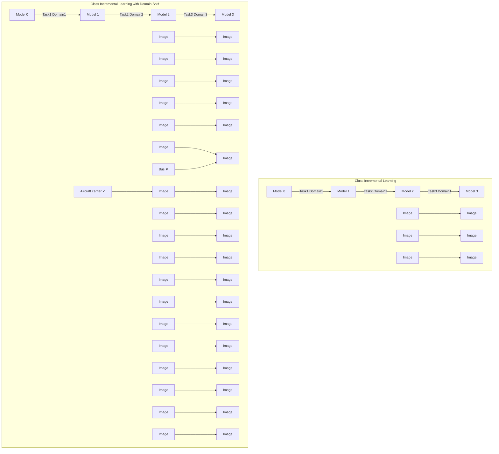
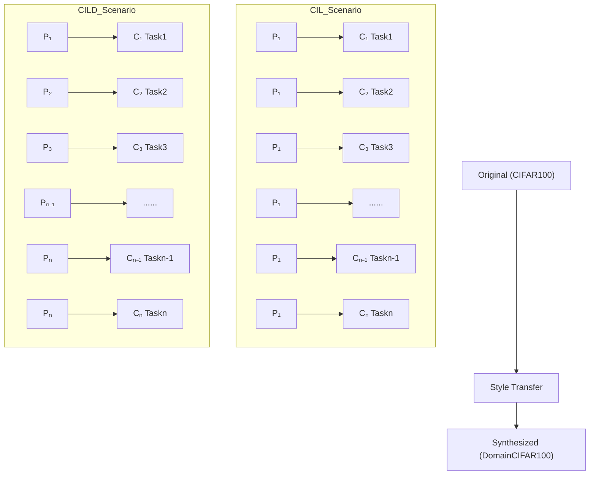

# Make Domain Shift a Catastrophic Forgetting Alleviator in Class-Incremental Learning

Wei Chen1,2, Yi Zhou1,2 \*

1School of Computer Science and Engineering, Southeast University, China

2Key Laboratory of New Generation Artifcial Intelligence Technology and Its Interdisciplinary Applications, Ministry of Education, China

weighchen@seu.edu.cn, yizhou.szcn@gmail.com

# Abstract

In the realm of class-incremental learning (CIL), alleviating the catastrophic forgetting problem is a pivotal challenge. This paper discovers a counter-intuitive observation: by incorporating domain shift into CIL tasks, the forgetting rate is signifcantly reduced. Our comprehensive studies demonstrate that incorporating domain shift leads to a clearer separation in the feature distribution across tasks and helps reduce parameter interference during the learning process. Inspired by this observation, we propose a simple yet effective method named DisCo to deal with CIL tasks. DisCo introduces a lightweight prototype pool that utilizes contrastive learning to promote distinct feature distributions for the current task relative to previous ones, effectively mitigating interference across tasks. DisCo can be easily integrated into existing state-of-the-art class-incremental learning methods. Experimental results show that incorporating our method into various CIL methods achieves substantial performance improvements, validating the benefts of our approach in enhancing class-incremental learning by separating feature representation and reducing interference. These fndings illustrate that DisCo can serve as a robust fashion for future research in class-incremental learning.

Code — https://github.com/PixelChen24/DisCo

# 1 Introduction

Deep neural networks excel in static environments but falter with the dynamic nature of real-world data. Designed to learn from static datasets, these models struggle to adapt to new data without complete retraining. This leads to performance degradation and catastrophic forgetting (McCloskey and Cohen 1989) in real-world applications with continuously updated data (Luo et al. 2024). Continual learning, also known as incremental or lifelong learning, addresses this by allowing models to learn incrementally, retaining knowledge over time, and adapting to evolving data.

Generally, continual learning can be mainly taxonomized as Class-Incremental Learning(CIL) and Domain-Incremental Learning(DIL). CIL (Zhou et al. 2022; Kirkpatrick et al. 2017; Rusu et al. 2016; Wang et al. 2022c) involves learning a sequence of tasks, with each task only introducing new classes that were not present in the previous tasks. The model should correctly classify new samples into all classes seen so far. Unlike CIL which focuses on expanding the model’s class knowledge, DIL (Tang et al. 2021; Tao et al. 2020; Volpi, Larlus, and Rogez 2021) requires the model to generalize effectively across varying data distributions (Lai et al. 2024; Liu and Zhou 2024) with the same label space and fght against forgetting at the same time. There is no doubt that combination of CIL and DIL can better simulate the real world where new knowledge and new data distribution are introduced gradually. Relatively a few studies have been conducted to provide solutions to this combination. Many works (Kundu et al. 2020; Simon et al. 2022; Xie, Yan, and He 2022) explore various problem settings of combining CIL with DIL, emphasizing adaptation and generalization across known and unknown domains. However, they did not really focus on the effect of domain shift on CIL. Thus, we are motivated by this question: “Does domain shift really hamper CIL methods?”

flowchart

Figure 1: The key fnding of our work: Incorporating domain shift in class incremental learning contributes to a clear separation of feature space and a better resistance to forgetting.

In this work, we frst discover that domain shift helps reduce the interference and forgetting across tasks in CIL, as illustrated in Fig. 1. Specifcally, we start with an empirical study where we simulate the combination of CIL and domain shift by splitting DomainNet (Peng et al. 2019) dataset, or manually add domain shift using a style transfer GAN to the original CIFAR-100 dataset (Krizhevsky and Hinton 2009) to construct DomainCIFAR-100. Qualitative results on DomainNet and DomainCIFAR-100 show that domain shift assists model in learning distinguishable representations across tasks. To further investigate the effects of domain shift, we design a quantitative metric to measure the interference across tasks, along with a metric to measure the knowledge learned by the model. We fnd that domain shift helps reduce the interference during parameter updating and improves the knowledge transfer, thus reducing forgetting rate. Then, we leverage this discovery to design a simple yet effective plug-and-play method named DisCo (Distinguishable feature for Continual Learning) to deal with CIL tasks. DisCo utilizes contrastive loss to impose task-level and class-level regularization on prototypes to foster distinguishable task representations. DisCo also includes a cross-task contrastive distillation loss to preserve prior knowledge effectively. DisCo can be easily integrated into existing state-of-the-art continual learning methods, especially rehearsal-based methods, to boost performance. We perform extensive experiments on popular CIL benchmarks and show that incorporating DisCo reduces forgetting signifcantly and improves their performance consistently.

Our contributions are highlighted as follows: 1) We observe the counter-intuitive phenomenon that when introducing domain shift to the standard CIL setting, the overall forgetting is signifcantly reduced. To the best of our knowledge, we’re the frst to discover this phenomenon. 2) Through analyzing the parameter updated during sequential tasks, we fnd that the task interference is small due to the variance caused by the domain shift of input, which consequently leads to a relatively lower forgetting rate. 3) Based on our observation, we introduce a simple yet effective plug-and-play method named DisCo, which can be easily integrated into existing class-incremental methods to hedge against forgetting.

# 2 Related Works

Class-Incremental Learning. In class-incremental learning, models are continuously updated with new class data, aiming to retain performance on previously learned classes without the original training data. Various strategies address forgetting (Wang et al. 2024), including rehearsalbased methods, which use a memory buffer to store exemplars (Rebuff, Kolesnikov, and Lampert 2016; Caccia et al. 2020; Zhou et al. 2022) or generate images of old classes using generative networks (Van de Ven, Siegelmann, and Tolias 2020; Liu et al. 2020). Regularizationbased approaches implement weight regularization on important parameters (Kirkpatrick et al. 2017; Lin, Chu, and Lai 2022) or knowledge distillation to preserve crucial outputs (Li and Hoiem 2017; Wang et al. 2022a). Architecturebased methods expand(Buzzega et al. 2020; Mallya and Lazebnik 2018; Rusu et al. 2016) or reallocate(Golkar, Kagan, and Cho 2019) the model’s structure to accommodate new tasks. Meanwhile, recently popular prompt-based methods (Smith et al. 2023; Wang et al. 2022b; Razdaibiedina et al. 2023), such as L2P (Wang et al. 2022c) guide pretrained Transformers with task-specifc prompts to balance shared and task-specifc knowledge. Mixed strategies, like DER(Buzzega et al. 2020), combine two or more strategies above to achieve a more robust continual learner.

Contrastive Learning in Continual Learning. Contrastive loss has been integrated into continual learning methods to combat catastrophic forgetting, with approaches like Co2L (Cha, Lee, and Shin 2021), which utilizes supervised contrastive loss for task learning paired with selfsupervised loss for knowledge distillation between models. DualNet (Pham, Liu, and Hoi 2021) employs both supervised and self-supervised losses in training its fast and slow learners respectively, enhancing generalizable representations. These methods operate on the assumption that contrastive loss yields more stable representations for future tasks compared to cross-entropy loss (Cha, Lee, and Shin 2021). Our research, however, focuses on the utility of contrastive loss in learning discriminative features across tasks.

Domain Shift in Class-Incremental Learning. The intersection of class-incremental and domain-incremental learning has been sparingly explored. Kundu’s work (Kundu et al. 2020) blends class-incremental learning with sourcetarget domain adaptation, specifcally designed for open-set environments. Meanwhile, Xie (Xie, Yan, and He 2022) has crafted a comprehensive framework that concurrently addresses the challenges posed by both class and domain continual learning. Building on this, Simon (Simon et al. 2022) introduces a method that not only addresses cross-domain continual learning but also ensures robust generalization to new, unseen domains. Despite these innovative approaches, the literature still lacks a detailed exploration of how domain shift specifcally affects class-incremental learning.

# 3 Empirical Study

# 3.1 Problem Setup

Here we frst introduce the formal defnition of standard Class-Incremental Learning (CIL). Let D = $\{ D _ { 1 } , D _ { 2 } , . . . , D _ { T } \}$ represent a sequence of datasets corresponding to tasks $\{ ( x _ { i } ^ { t } , y _ { i } ^ { t } ) \} _ { i = 1 } ^ { N _ { t } }$ 1 consists of $1 , 2 , . . . T$ $N _ { t }$ samples, where . Each dataset $\boldsymbol { x } _ { i } ^ { t }$ t is the i-th $\begin{array} { r l } { D _ { t } } & { { } = } \end{array}$ input and $y _ { i } ^ { t }$ is the corresponding label from the label set $\mathcal { C } _ { t }$ . For each task $T _ { t }$ , the label space $\mathcal { C } _ { t }$ introduces new classes, and $\mathcal { C } _ { t } \cap \mathcal { C } _ { t ^ { \prime } } = \emptyset$ for t $\neq t ^ { \prime } .$ . Thus, the cumulative label space up to task t is $\textstyle { \mathcal { C } } ^ { t } = \bigcup _ { k = 1 } ^ { t } { \mathcal { C } } _ { k }$ . Model at task t only has access to $D _ { t }$ , and the goal at task t is to train a model $f _ { \theta } ^ { \bar { t } }$ parameterized by $\theta _ { t }$ which can classify inputs x into the correct class among all classes ${ \mathcal { C } } ^ { t }$ seen so far. Formally, after training on $D _ { T }$ , the model $f _ { \theta } ^ { T }$ should minimize the loss:

$$
\mathcal {L} (\theta) = \sum_ {t = 1} ^ {T} \sum_ {(x _ {i} ^ {t}, y _ {i} ^ {t}) \in D _ {t}} L (f _ {\theta} ^ {T} (x _ {i} ^ {t}), y _ {i} ^ {t}), \tag {1}
$$

where L is a loss function appropriate for classifcation.

Most previous CIL works conduct experiments under the setting that all tasks share the same distribution, i.e. $\mathcal { P } _ { t } ~ =$ $\mathcal { P } _ { t ^ { \prime } }$ , for $t \neq t ^ { \prime }$ and overlook the effect of domain shift on CIL. We are interested in this question: What if the $\mathcal { P }$ is different from each other? i.e., $\mathcal { P } _ { t } \neq \mathcal { P } _ { t ^ { \prime } } , \forall t \neq t ^ { \prime }$ .

flowchart

(a) CIL and CILD scenario on CIFAR-100.

text_image

Images of 1domain
in DomainNet
CIL Scenario
P₁ P₁ P₁ P₁ P₁ P₁
C₁ C₂ C₃ C₄ C₅ C₆
Task1 Task2 Task3 Task4 Task5 Task6
Images of all
domains
in DomainNet
CILD Scenario
P₁ P₂ P₃ P₄ P₅ P₆
C₁ C₂ C₃ C₄ C₅ C₆
Task1 Task2 Task3 Task4 Task5 Task6

(b) CIL and CILD scenario on DomainNet.   
Figure 2: Illustration of two scenarios construction on two datasets respectively. In Fig. 2(a), we use AvatarNet (Sheng et al. 2018) to synthesize images of new domains on CIFAR-100. We use the original images as training/testing set for CIL scenario and synthesized images(termed DomainCIFAR-100) as training/testing set for CILD scenario. In Fig. 2(b), we split Domain-Net (Peng et al. 2019) to construct CIL and CILD scenario. Images of one domain make up the training/testing set for CIL scenario, and images of all domains make up the training/testing set for CILD scenario. In each dataset, the label space $\mathcal { C } _ { t }$ of each task t in CILD is consistent with that of CIL.

# 3.2 Observation of Domain Shift on CIL

To investigate the effect of domain shift in class-incremental learning methods, we frst illustrate some analytical experiments on CIFAR-100 (Krizhevsky and Hinton 2009) and DomainNet (Peng et al. 2019) under two scenarios.

Empirical Study Setup. We design two comparative scenarios: the classic CIL scenario and an extended version incorporating domain shift, which we term Class Incremental Learning with Domain shift (CILD).

• CIL: Tasks are introduced sequentially without any alteration to the domain, following standard CIL setting.   
• CILD: Based on CIL, each task t is modifed by introducing a unique variation in the domain while sharing the same label space $\mathcal { C } _ { t }$ with CIL. As shown in Fig. 2, we construct CILD in two ways: 1) Synthesizing. We use a pre-trained style transfer model to transfer the original image of CIFAR-100 to multiple domains and use the synthesized dataset DomainCIFAR-100 for training and inference. 2)Splitting. We split an existing dataset with domain variation (Peng et al. 2019) to form a task sequence. Appendix B.1 shows more details about the CILD scenario setup.

Evaluation Protocols. In general, we consider the performance of continual methods from two aspects (Wang et al. 2024): the overall Average Accuracy AA of the tasks learned so far, and the forgetting measure F M of old tasks. AA evaluates the ability to learn new classes while F M refects the performance drop of old classes. A lower F M means the model is more robust to fght against forgetting and a higher AA means the model performs well both in

learning new knowledge and preserving old knowledge. The detailed mathematical defnition of these two metrics can be found in the Appendix A.1.

Observation. For the baseline CIL methods, we select six representative methods: iCaRL (Rebuff, Kolesnikov, and Lampert 2016), BiC (Wu et al. 2019), MEMO (Zhou et al. 2022), LwF (Li and Hoiem 2017), DER (Buzzega et al. 2020), and L2P (Wang et al. 2022c), covering four different method categories as discussed in sec 2. Details of these methods’ implementation can be found in Appendix C.2.

As shown in Tab. 1, most CIL methods under CILD demonstrate signifcantly lower forgetting compared to CIL. This phenomenon is not restricted to a single model or method, and we observe consistent results across various methodologies, regardless of their backbone types or whether pretrained. Note that AA of CILD is generally lower than that of CIL because we use the synthesized images or images belonging to weird domains which may be hard to classify for task t ≥ 2 in CILD. This leads to a lower initial accuracy of these tasks and a lower AA consequently. If we take a close look at just the frst task performance during the whole process, we can observe that the model suffers from much less forgetting under CILD. Details of these observations above can be found in Appendix B.3.

Despite the fantastic low F M of most methods under the CILD scenario, prompt-based method like L2P seems to be the exception, which is more prone to forgetting. This can be attributed to the fact that the backbone remains frozen during the training of prompt-based methods and the keyprompt pairs are the only tunable parameters. These parameters have much less scalability compared to the pre-trained encoder. When faced with examples within the data distribution where the encoder is trained, prompts can adapt to them easily by introducing minor modifcations with minor forgetting. But when the input sample style is signifcantly different from previous ones, these prompts tend to overft these outlier samples and fail to preserve old knowledge.

<table><tr><td rowspan="2">Method</td><td rowspan="2">Scenario</td><td colspan="4">CIFAR-100</td><td colspan="4">DomainNet</td></tr><tr><td> $AA\uparrow$ </td><td> $FM\downarrow$ </td><td> $PIV\downarrow$ </td><td> $PFTS\uparrow$ </td><td> $AA\uparrow$ </td><td> $FM\downarrow$ </td><td> $PIV\downarrow$ </td><td> $PFTS\uparrow$ </td></tr><tr><td>iCaRL</td><td>CIL</td><td>58.94</td><td>59.42</td><td>73.50</td><td>23.87</td><td>57.41</td><td>41.27</td><td>74.00</td><td>27.85</td></tr><tr><td>iCaRL</td><td>CILD</td><td>61.19</td><td>25.98(-33.44)</td><td>56.00</td><td>29.54</td><td>63.32</td><td>22.88(-18.39)</td><td>57.00</td><td>36.11</td></tr><tr><td>BiC</td><td>CIL</td><td>70.53</td><td>42.80</td><td>69.00</td><td>56.21</td><td>62.54</td><td>36.20</td><td>76.50</td><td>54.39</td></tr><tr><td>BiC</td><td>CILD</td><td>72.16</td><td>16.04(-26.76)</td><td>53.00</td><td>77.25</td><td>61.82</td><td>13.12(-23.08)</td><td>64.00</td><td>56.03</td></tr><tr><td>MEMO</td><td>CIL</td><td>89.87</td><td>16.91</td><td>72.50</td><td>68.24</td><td>91.40</td><td>10.67</td><td>73.00</td><td>68.84</td></tr><tr><td>MEMO</td><td>CILD</td><td>86.38</td><td>7.56(-9.35)</td><td>62.50</td><td>95.30</td><td>86.67</td><td>8.31(-2.36)</td><td>72.00</td><td>95.30</td></tr><tr><td>LwF</td><td>CIL</td><td>50.49</td><td>49.35</td><td>32.00</td><td>35.80</td><td>48.62</td><td>46.58</td><td>36.50</td><td>39.65</td></tr><tr><td>LwF</td><td>CILD</td><td>48.02</td><td>23.48(-25.87)</td><td>28.50</td><td>46.59</td><td>45.00</td><td>27.30(-19.28)</td><td>26.00</td><td>43.08</td></tr><tr><td>DER</td><td>CIL</td><td>62.51</td><td>40.26</td><td>1.00</td><td>5.11</td><td>67.55</td><td>34.21</td><td>1.00</td><td>6.19</td></tr><tr><td>DER</td><td>CILD</td><td>72.02</td><td>0.50(-39.76)</td><td>1.00</td><td>6.33</td><td>69.73</td><td>9.56(-24.65)</td><td>1.00</td><td>10.57</td></tr><tr><td>L2P</td><td>CIL</td><td>91.36</td><td>4.42</td><td>100.00</td><td>30.16</td><td>91.35</td><td>3.81</td><td>100.00</td><td>28.55</td></tr><tr><td>L2P</td><td>CILD</td><td>61.37</td><td>13.46(+9.04)</td><td>100.00</td><td>59.75</td><td>83.51</td><td>5.04(+1.23)</td><td>100.00</td><td>52.70</td></tr></table>

Table 1: Comparative results on average accuracy (AA), forgetting (F M), interference (P IV ) and knowledge transfer (P F T S) of CIL methods with(in gray rows) and without(in white rows) domain shift on CIFAR-100 and DomainNet. P IV and P F T S will be introduced in section 3.3.

Moreover, we use t-SNE (Van der Maaten and Hinton 2008) to visualize the feature representations of each task on CIFAR-100 in Fig. 3. In CIL, there is notable overlap among features of different tasks, indicating a struggle to maintain distinct task-specifc features and leading to forgetting. In contrast, in CILD, features from different tasks are separated into well-defned clusters, demonstrating effective preservation of task uniqueness and reduced interference. This suggests that domain shifts help protect the knowledge of previous classes and reduce interference when learning new ones.

# 3.3 Quantitative Analysis

Inspired by the surprisingly low forgetting rate of CILD, one hypothesis is that just certain parts of the parameters are updated conditioned on the distinguishable input representations, thus reducing the interference between tasks. To quantify the interference among parameters that are heavily updated across different tasks, we design a metric named P IV (Parameter Interference Value) to capture how changes in one set of parameters affect the others across the sequence of tasks, and a metric named P F T S(Parameter Forward Transfer Score) to capture how much knowledge is relatively learned by model. For clarity, the mathematical definition of these two metrics is presented in Appendix A.2.

The last two columns in Tab. 1 demonstrate the P IV and P F T S of various continual methods under CIL and CILD. It is shown that 1) Methods under CILD demonstrate lower P IV compared to CIL, suggesting that domain shift helps reduce the interference across tasks. 2) Methods under CILD usually demonstrate higher P F T S, indicating that domain shift may be benefcial for the model to learn var-

  
Figure 3: t-SNE visualization of features on CIFAR-100. The top row denotes features extracted by different continual methods under CIL scenario and the bottom row denotes features under CILD scenario. Data points from the same task are marked using the same color.

ious distinguishable representations in an ordered way. For architecture-based method DER, P IV under two settings are relatively lower because DER introduces new layers responsible for learning each task respectively. For promptbased method L2P, P IV is 100% because a limited number of prompts are the only parameters that can be updated during training. At the same time, the P F T S is much higher than that under CIL, demonstrating the strong learning ability of the shared prompts. This leads to high interference across tasks in L2P and makes it perform worse under CILD.

# 4 Method

In section 3.2, we observed that domain shifts across tasks could signifcantly enhance the method’s resistance to forgetting in class-incremental learning. Integrating these domain shifts into existing CIL methods to boost performance is a natural idea. However, this raises a challenge: the model cannot determine which domain shift to apply to an input during inference. This resembles the paradigm of taskincremental learning (Wang et al. 2024), where the task ID (indicating the domain shift in our case) is needed at inference, which contradicts the CIL setting.

Instead, inspired by our observation, we propose to promote the differentiation of task-specifc features and aim to simulate the benefcial effects of domain shift within the feature space rather than the input. Consequently, we introduce DisCo (Distinguishable feature for Continual Learning), a simple yet effective rehearsal-based method employing contrastive learning to learn distinguishable representations for continual tasks. DisCo is built upon existing rehearsal-based baseline continual methods and can be easily incorporated into them. The core idea of DisCo is to enforce a margin between the feature distributions of the current categories and prototypes of previous categories, thereby preventing the interference of old knowledge. As shown in Fig. 4, DisCo comprises mainly two parts: task-level and class-level regularization and cross-task contrastive distillation.

```mermaid
graph TD
    A["Old model fθ⁻¹"] --> B["New model fθ"]
    B --> C["Text Encoder"]
    C --> D["Task & Class level Regularization"]
    D --> E["Cross-task Contrastive Distillation"]
    E --> F["Pull together"]
    E --> G["Push away"]
    E --> H["Previous task prototypes"]
    E --> I["Current task prototype"]
    E --> J["Previous task feature space region"]
    K["x1 x2 Old classes(Buffered)"] --> A
    L["x3 x4 x5 New classes"] --> M["a photo of bus or bird or hammer"]
    M --> N["Text Encoder"]
    N --> O["Text Encoder"]
    O --> P["p_i"]
    P --> Q["Text Encoder"]
    Q --> R["Text Encoder"]
    R --> S["Text Encoder"]
    S --> T["Text Encoder"]
    T --> U["p_i"]
    U --> V["Text Encoder"]
    V --> W["Text Encoder"]
    W --> X["Text Encoder"]
    X --> Y["p_i"]
    Y --> Z["Text Encoder"]
    Z --> AA["p_i"]
    AA --> AB["Text Encoder"]
    AB --> AC["p_i"]
    AC --> AD["Text Encoder"]
    AD --> AE["p_i"]
    AE --> AF["Text Encoder"]
    AF --> AG["p_i"]
    AG --> AH["Text Encoder"]
    AH --> AI["p_i"]
    AI --> AJ["Text Encoder"]
    AJ --> AK["p_i"]
    AK --> AL["Text Encoder"]
    AL --> AM["p_i"]
    AM --> AN["Text Encoder"]
    AN --> AO["p_i"]
    AO --> AP["Text Encoder"]
    AP --> AQ["p_i"]
    AQ --> AR["Text Encoder"]
    AR --> AS["p_i"]
    AS --> AT["Text Encoder"]
    AT --> AU["p_i"]
    AU --> AV["Text Encoder"]
    AV --> AW["p_i"]
    AW --> AX["Text Encoder"]
    AX --> AY["p_i"]
    AY --> AZ["Text Encoder"]
    AZ --> BA["p_i"]
    BA --> BB["Text Encoder"]
    BB --> BC["p_i"]
    BC --> BD["Text Encoder"]
    BD --> BE["p_i"]
    BE --> BF["Text Encoder"]
    BF --> BG["p_i"]
    BG --> BH["Text Encoder"]
    BH --> BI["p_i"]
    BI --> BJ["Text Encoder"]
    BJ --> BK["p_i"]
    BK --> BL["Text Encoder"]
    BL --> BM["p_i"]
    BM --> BN["Text Encoder"]
    BN --> BO["p_i"]
    BO --> BP["Text Encoder"]
    BP --> BQ["p_i"]
    BQ --> BR["Text Encoder"]
    BR --> BS["p_i"]
    BS --> BT["Text Encoder"]
    BT --> BU["p_i"]
    BU --> BV["Text Encoder"]
    BV --> BW["p_i"]
    BW --> BX["Text Encoder"]
    BX --> BY["p_i"]
    BY --> BZ["Text Encoder"]
    BZ --> CA["p_i"]
    CA --> CB["Text Encoder"]
    CB --> CC["p_i"]
    CC --> CD["Text Encoder"]
    CD --> CE["p_i"]
    CE --> CF["Text Encoder"]
    CF --> CG["p_i"]
    CG --> CH["Text Encoder"]
    CH --> CI["p_i"]
    CI --> CJ["Text Encoder"]
    CJ --> CK["p_i"]
    CK --> CL["Text Encoder"]
    CL --> CM["p_i"]
    CM --> CN["Text Encoder"]
    CN --> CO["p_i"]
    CO --> CP["Text Encoder"]
    CP --> CQ["p_i"]
    CQ --> CR["Text Encoder"]
    CR --> CS["p_i"]
    CS --> CT["Text Encoder"]
    CT --> CU["p_i"]
    CU --> CV["Text Encoder"]
    CV --> CW["p_i"]
    CW --> CX["Text Encoder"]
    CX --> CY["p_i"]
    CY --> CZ["Text Encoder"]
```

flowchart

Figure 4: The overview framework of DisCo. DisCo includes Task&Class -level Regularization and Cross-task Contrastive Distillation. In Task&Class -level Regularization, samples in the current task are pulled toward the current task prototype while pushed away from previous task prototypes, leading to a discriminative feature distribution away from other tasks. Cross-task Contrastive Distillation helps align current model with previous one and preserve the features of old classes.

Prototype construction: In our work, we try two types of prototype: text prototype and image feature prototype. For a class-incremental task at stagwith index i of N training samples $t ,$ $D _ { t } ^ { i } \ { = \ } ( x _ { j } , \ y _ { j } ) \} _ { j = 1 } ^ { N } ,$ where $x _ { i } \in \mathbb { R } ^ { 3 \times H \times W }$ and $y _ { j } \in \mathbb { R }$ denote the image and numerical class label of the j-th sample respectively. We feed $\{ x _ { j } \} _ { j = 1 } ^ { N }$ into feature extractor $\mathbf { F } _ { \theta } ^ { t }$ to get their features $\{ \hat { x _ { j } } \} _ { j = 1 } ^ { N } \in \mathbb { R } ^ { N \times D }$ , followed by a projector ψt to project into a lower dimension space $\{ \tilde { x _ { j } } \} _ { j = 1 } ^ { N } \in \mathbb { R } ^ { N \times d }$ . The batch-wise image feature prototype $p _ { i }$ is then calculated as $\begin{array} { r } { \frac { 1 } { N } \sum _ { j = 1 } ^ { N } \tilde { x _ { j } } } \end{array}$ .

For batch-wise text prototype, we collect all class names of this batch and feed the below text prompt to CLIP (Radford et al. 2021) text encoder to extract embedding $p _ { i }$ :

“a photo of {class 0} or {class 1} or ... or {class n}”

To let the batch-wise $p _ { i }$ approximate prototype $P _ { i }$ of the whole task, we calculate the momentum accumulation of $p _ { i }$ :

$$
p _ {i} = \frac {i - 1}{i} p _ {i - 1} + \frac {1}{i} p _ {i} \tag {2}
$$

After all $N _ { t }$ mini-batches of task $t , p _ { N _ { t } }$ is stored in the prototype pool P as the prototype $P _ { t }$ of task t.

# 4.1 Task-level and Class-level Regularization

In task-level regularization, we aim to keep features of the current task away from the prototypes of previous tasks.

We treat each sample $x _ { j }$ in the i-th mini-batch as the anchor and treat the prototype $p _ { i }$ of this batch as the only positive sample $x _ { p _ { i } }$ . Prototypes of all previous tasks $P _ { k } , \ \forall k < t$ are negative samples. As a result, $N \times ( t - 1 )$ pairs of triplets can be constructed in this mini-batch, and then task-level contrastive loss $\mathcal { L } _ { t c o n }$ is:

$$
\mathcal {L} _ {t c o n} = \frac {1}{N \times (t - 1)} \sum_ {j = 1} ^ {N} \sum_ {k = 1} ^ {t - 1} T r i p l e t (x _ {j}, p _ {i}, P _ {k}) \tag {3}
$$

$$
\text { Triplet } (a, p, n) = \log \left(1 + \exp (1 - S (a, p) + S (a, n))\right) \tag {4}
$$

where $S ( x , y )$ is the cosine similarity function. $\mathcal { L } _ { t c o n }$ ensures the feature space margin between the current task and previous ones, preventing task interference.

In class-level regularization, the goal is to learn discriminative features for each class in the current task. For each sample $x _ { j }$ , we randomly select a sample having the same label with $x _ { j }$ in this batch as the positive sample $x _ { p } .$ , and select a random negative sample $x _ { n }$ having a different label. Then the class-level contrastive loss $\mathcal { L } _ { c c o n }$ is:

$$
\mathcal {L} _ {c c o n} = \frac {1}{N} \sum_ {j = 1} ^ {N} T r i p l e t (x _ {j}, x _ {p}, x _ {n}) \tag {5}
$$

# 4.2 Cross-task Contrastive Distillation

Despite the satisfactory performance achieved through the combined use of the aforementioned regularization and the rehearsal mechanism in the baseline method, the incorporation of an explicit mechanism to preserve acquired knowledge could yield further benefts. Here we leverage a Crosstask Contrastive Distillation loss(CCD) to help align the current student model with the old teacher model. At task $t ,$ we copy the trained model of task t − 1 as the teacher model $f _ { \theta } ^ { t - 1 }$ which remains frozen during task $t ,$ and the current model $f _ { \theta } ^ { t }$ serves as the student model. The contrastive distillation aims to align the feature representation of the student model and teacher model for old classes, preventing the degradation of old classes’ features. Specifcally, for a sample $x _ { j }$ in the rehearsal sample set $\mathcal { R } \stackrel { \cdot } { = } \{ ( x _ { j } , \dot { y _ { j } } ) | y _ { j } \notin \mathcal { C } _ { t } \}$ , we use the teacher model $f _ { \theta } ^ { t - 1 }$ and student model $f _ { \theta } ^ { t }$ to extract their features, denoted as $\tilde { x _ { j } }$ and $\tilde { x _ { j } } ^ { \prime }$ . The contrastive distillation loss is written as:

$$
\mathcal {L} _ {c c d} = \sum_ {(x _ {j}, y _ {j}) \in \mathcal {R}} \sum_ {k \in \mathcal {R}, y _ {k} \neq y _ {j}} T r i p l e t (\tilde {x} _ {j} ^ {\prime}, \tilde {x} _ {j}, \tilde {x} _ {k} ^ {\prime}) \tag {6}
$$

$\mathcal { L } _ { c c d }$ places restrictions on current student model to distill knowledge of the same old class from teacher model and simultaneously keep away from other different old classes.

# 4.3 Generalize to Various Types of CIL Methods

DisCo not only works well on rehearsal-based continual methods but also can generalize to other categories, such as regularization-based and prompt-based methods. For regularization-based methods, DisCo can be directly incorporated discarding CCD with minor performance degradation. For prompt-based methods such as L2P (Wang et al. 2022c), we just need to impose regularization on selected prompt keys like Eq. 3 instead of image features. More details about incorporating DisCo into prompt-based methods can be found in Appendix C.3.

As a result, the total loss L of DisCo is:

$$
\mathcal {L} = \mathcal {L} _ {\text { baseline }} + \lambda_ {t c o n} \mathcal {L} _ {t c o n} + \lambda_ {c c o n} \mathcal {L} _ {c c o n} + \lambda_ {c c d} \mathcal {L} _ {c c d} \tag {7}
$$

where $\mathcal { L } _ { b a s e l i n e }$ refers to the vanilla loss of the baseline continual method, $\lambda _ { t c o n } , \lambda _ { c c o n }$ and $\lambda _ { c c d }$ are hyperparameter to balance these losses. In our experiments, $\lambda _ { t c o n }$ and $\lambda _ { c c o n }$ are set to 0.5 and $\lambda _ { c c d } = 1$ . Evaluations of other possible values are reported in Appendix C.5.

# 5 Experiments

# 5.1 Experiment Setup

Datasets and Implementation: We perform experiments on CIFAR100, Fashion-MNIST, and Tiny-ImageNet. Details of these datasets and continual task split are in Appendix C.1. Our code is implemented in PyTorch and based on LAMDA-PILOT(Sun et al. 2023), which is an opensource framework for easily designing continual methods. We select iCaRL(Rebuff, Kolesnikov, and Lampert 2016), BiC (Wu et al. 2019), LwF (Li and Hoiem 2017), DER(Buzzega et al. 2020), and L2P(Wang et al. 2022c) as baseline methods and integrate DisCo into them. We also compare our methods with the Co2L (Cha, Lee, and Shin 2021), which is a rehearsal-based method leveraging contrastive loss to learn stable representations. Appendix C.2 shows more details about these methods’ implementations. For both ResNet (He et al. 2016) and ViT (Dosovitskiy et al. 2020) -based models, we train all tasks for 100 epochs, 60- th and 80-th epochs being milestones. For models built on ResNet, we set weight decay $w = 5 e - 4$ and learning rate $l r = 0 . 1$ with ×0.1 at milestones. For ViT-based models, $w = 2 e - 4 , l r = 1 e - 3$ with ×0.1 at milestones.

<table><tr><td rowspan="2">Method</td><td colspan="2">CIFAR100</td><td colspan="2">FashionMNIST</td><td colspan="2">TinyImageNet</td></tr><tr><td> $AA \uparrow$ </td><td> $FM \downarrow$ </td><td> $AA \uparrow$ </td><td> $FM \downarrow$ </td><td> $AA \uparrow$ </td><td> $FM \downarrow$ </td></tr><tr><td>iCaRL</td><td>64.24</td><td>51.34</td><td>69.41</td><td>47.44</td><td>8.57</td><td>81.40</td></tr><tr><td>iCaRL + DisCo-I</td><td>70.11</td><td>33.96</td><td>72.57</td><td>34.45</td><td>10.87</td><td>70.19</td></tr><tr><td>iCaRL + DisCo-T</td><td>63.35</td><td>35.26</td><td>70.69</td><td>33.65</td><td>11.88</td><td>70.46</td></tr><tr><td>BiC</td><td>67.04</td><td>46.51</td><td>73.63</td><td>38.77</td><td>8.42</td><td>78.42</td></tr><tr><td>BiC + Disco-I</td><td>69.89</td><td>28.54</td><td>73.24</td><td>34.22</td><td>8.16</td><td>68.05</td></tr><tr><td>BiC + Disco-T</td><td>67.68</td><td>23.08</td><td>74.18</td><td>35.00</td><td>8.33</td><td>67.94</td></tr><tr><td> $\text{Co2L}^{\dagger}$ </td><td>71.25</td><td>32.17</td><td>68.54</td><td>34.66</td><td>14.02</td><td>74.55</td></tr><tr><td>LwF</td><td>51.30</td><td>55.98</td><td>53.15</td><td>51.27</td><td>5.06</td><td>85.50</td></tr><tr><td>LwF + DisCo-I</td><td>56.42</td><td>36.52</td><td>57.14</td><td>37.69</td><td>7.87</td><td>79.58</td></tr><tr><td>LwF + DisCo-T</td><td>56.87</td><td>33.89</td><td>52.87</td><td>44.11</td><td>6.22</td><td>77.15</td></tr><tr><td>DER</td><td>63.91</td><td>40.18</td><td>68.21</td><td>37.85</td><td>11.58</td><td>77.99</td></tr><tr><td>DER + Disco-I</td><td>64.87</td><td>36.41</td><td>72.41</td><td>29.86</td><td>12.08</td><td>72.11</td></tr><tr><td>DER + Disco-T</td><td>69.51</td><td>33.74</td><td>70.59</td><td>31.43</td><td>12.86</td><td>73.02</td></tr><tr><td>L2P</td><td>82.65</td><td>7.62</td><td>85.21</td><td>6.74</td><td>29.54</td><td>44.30</td></tr><tr><td>L2P + Disco-I</td><td>82.78</td><td>7.98</td><td>86.15</td><td>7.88</td><td>28.43</td><td>43.32</td></tr><tr><td>L2P + Disco-T</td><td>83.12</td><td>6.80</td><td>84.99</td><td>6.07</td><td>31.88</td><td>40.00</td></tr></table>

Table 2: Main result of incorporating DisCo into existing continual methods. We group the compared methods by their category(rehearsal-based, regularization-based, architecture-based, or prompt-based). Co2L† is a compared rehearsal-based method leveraging contrastive loss. Disco-I means image features as prototypes and Disco-T means text features as prototypes, as described in section 4. Each result is averaged over 3 runs.

# 5.2 Evaluation on Three Benchmarks

Tab. 2 shows the result of incorporating DisCo into existing continual methods. It can be observed that DisCo helps most methods alleviate forgetting (F M) and improves average accuracy (AA). Especially, DisCo can boost the performance of rehearsal-based methods signifcantly: increase AA by 5.87% and reduce F M by 17.38% for iCaRL on CIFAR-100, increase AA by 3.31% and reduce F M by 10.94% on Tiny-ImageNet. Moreover, plugging DisCo achieves comparable or even better performance compared to the contrastive-based related work Co2L (Cha, Lee, and

<table><tr><td rowspan="2">Method</td><td colspan="3">DisCo</td><td colspan="3">DisCo w/o Ccon</td><td colspan="3">DisCo w/o Tcon</td><td colspan="3">DisCo w/o CCD</td></tr><tr><td> $AA\uparrow$ </td><td> $FM\downarrow$ </td><td> $IA\uparrow$ </td><td> $AA\uparrow$ </td><td> $FM\downarrow$ </td><td> $IA\uparrow$ </td><td> $AA\uparrow$ </td><td> $FM\downarrow$ </td><td> $IA\uparrow$ </td><td> $AA\uparrow$ </td><td> $FM\downarrow$ </td><td> $IA\uparrow$ </td></tr><tr><td>iCaRL + DisCo-I</td><td>70.11</td><td>33.96</td><td>80.16</td><td>67.21</td><td>32.15</td><td>75.22</td><td>66.00</td><td>47.41</td><td>82.54</td><td>69.35</td><td>35.47</td><td>80.34</td></tr><tr><td>BiC + DisCo-I</td><td>69.89</td><td>28.54</td><td>75.21</td><td>63.32</td><td>28.16</td><td>72.52</td><td>65.15</td><td>44.25</td><td>74.67</td><td>67.33</td><td>26.68</td><td>76.10</td></tr><tr><td>LwF + DisCo-I</td><td>56.42</td><td>36.52</td><td>81.67</td><td>51.34</td><td>35.99</td><td>76.02</td><td>52.88</td><td>52.63</td><td>81.24</td><td>-</td><td>-</td><td>-</td></tr><tr><td>DER + DisCo-I</td><td>64.87</td><td>36.41</td><td>78.56</td><td>60.35</td><td>37.68</td><td>74.48</td><td>61.23</td><td>42.16</td><td>79.51</td><td>62.76</td><td>35.16</td><td>78.68</td></tr><tr><td>L2P + DisCo-T</td><td>83.12</td><td>6.80</td><td>85.43</td><td>81.16</td><td>6.75</td><td>84.36</td><td>83.16</td><td>7.87</td><td>86.49</td><td>-</td><td>-</td><td>-</td></tr></table>

Table 3: Ablation study on DisCo components on CIFAR-100. IA refers to the average Initial Accuracy of each task as in Appendix A.1. Tcon refers to task-level regularization, Ccon refers to class-level regularization and CCD refers to cross-task distillation. For each method row, we highlight the highest AA and lowest F M. For non-rehearsal-based methods, there is no ablation on CCD, which is marked as “-”.

Shin 2021). For regularization-based methods, DisCo works as well leveraging our task&class -level and their intrinsic regularization module, reducing F M by 22.09% for LwF on CIFAR-100 and 8.35% on Tiny-ImageNet.

Compared to image features as prototypes (DisCo-I), using task text features as prototypes (DisCo-T) performs better on prompt-based methods. There are several possible reasons: 1) L2P employs a prompt pool that serves as a bridge between the task’s data and the model, guiding the model’s focus toward the most relevant features for each task. Text features encapsulate high-level semantic information, and can effectively steer the model’s attention to conceptual similarities and distinctions between classes or tasks. 2)Promptbased methods are inherently more fexible in handling text features since they often originate from NLP backgrounds. Thus, they can more effectively utilize text prototypes to guide the learning process across different tasks.

The improvement of average accuracy is smaller than that of the forgetting rate, partly because task-level regularization imposes stricter restrictions on the feature distributions, making it a little more diffcult to classify new classes, i.e. low initial accuracy of each task. Ablation study of these regularization modules is shown in section 5.3. More additional results such as t-SNE visualization and performance on more fne-grained dataset are presented in Appendix C.4.

# 5.3 Ablation Study

Ablation study on components of DisCo We conduct an ablation study of task&class -level regularization and CCD on CIFAR-100 as shown in Tab. 3. Task level regularization (Tcon) plays the most important role in helping the model distinguish different tasks, greatly reducing the interference and forgetting rate F M. However, only using Tcon makes it diffcult for the model to learn new knowledge, leading to a lower IA and a lower AA consequently. Class level regularization (Ccon) helps the model learn discriminative features for different classes in the same task, thus making it easier to learn new tasks i.e., higher IA, contributing to a higher AA together with Tcon. Moreover, we fnd that CCD also greatly helps maintain old class features and prototype distributions, leading to lower F M and higher AA.

Ablation study on task length We conduct experiments on different increment strategies on CIFAR-100. We separate these 100 classes into several groups as most works do(Rebuff, Kolesnikov, and Lampert 2016; Wang et al. 2022c). Fig. 5 demonstrates that the forgetting trend is relatively milder as task length grows. This means DisCo can achieve good performance under different task length situations. Moreover, the forgetting trend of B50-5 is smaller than that of others, because DisCo relies on prototypes to guide the distribution of new tasks, the greater the sample number of each task is, the better performance DisCo achieves.

  
Figure 5: Ablation study on incremental task length. $B \{ X \}$ - $\{ \bar { Y } \}$ means there are X classes in task 0 and the rest are evenly distributed in Y tasks. The y-axis means the $A A _ { k }$ at task k.

# 6 Conclusion

This paper demonstrates a counter-intuitive phenomenon: incorporating domain shift into class-incremental tasks signifcantly reduces catastrophic forgetting. Inspired by this, we propose DisCo, a contrastive learning-based simple yet effective plug-and-play method that effectively promotes distinct feature distributions for each task, mitigating interference and enhancing performance. Experimental results on various datasets show that DisCo can be easily integrated into other continual methods to boost performance.

# Acknowledgements

This work is supported in part by the National Natural Science Foundation of China under Grant 62476054, and in part by the Fundamental Research Funds for the Central Universities of China. This research work is supported by the Big Data Computing Center of Southeast University.

# References

Buzzega, P.; Boschini, M.; Porrello, A.; Abati, D.; and Calderara, S. 2020. Dark experience for general continual learning: a strong, simple baseline. Advances in neural information processing systems, 33: 15920–15930.

Caccia, L.; Belilovsky, E.; Caccia, M.; and Pineau, J. 2020. Online learned continual compression with adaptive quantization modules. In International conference on machine learning, 1240–1250. PMLR.

Cha, H.; Lee, J.; and Shin, J. 2021. Co2l: Contrastive continual learning. In Proceedings of the IEEE/CVF International conference on computer vision, 9516–9525.

Dosovitskiy, A.; Beyer, L.; Kolesnikov, A.; Weissenborn, D.; Zhai, X.; Unterthiner, T.; Dehghani, M.; Minderer, M.; Heigold, G.; Gelly, S.; et al. 2020. An image is worth 16x16 words: Transformers for image recognition at scale. arXiv preprint arXiv:2010.11929.

Golkar, S.; Kagan, M.; and Cho, K. 2019. Continual learning via neural pruning. arXiv preprint arXiv:1903.04476.

He, K.; Zhang, X.; Ren, S.; and Sun, J. 2016. Deep residual learning for image recognition. In Proceedings of the IEEE conference on computer vision and pattern recognition, 770–778.

Kirkpatrick, J.; Pascanu, R.; Rabinowitz, N.; Veness, J.; Desjardins, G.; Rusu, A. A.; Milan, K.; Quan, J.; Ramalho, T.; Grabska-Barwinska, A.; et al. 2017. Overcoming catastrophic forgetting in neural networks. Proceedings of the national academy of sciences, 114(13): 3521–3526.

Krizhevsky, A.; and Hinton, G. 2009. Learning multiple layers of features from tiny images. Handbook of Systemic Autoimmune Diseases, 1(4).

Kundu, J. N.; Venkatesh, R. M.; Venkat, N.; Revanur, A.; and Babu, R. V. 2020. Class-incremental domain adaptation. In Computer Vision–ECCV 2020: 16th European Conference, Glasgow, UK, August 23–28, 2020, Proceedings, Part XIII 16, 53–69. Springer.

Lai, Y.; Zhou, Y.; Liu, X.; and Zhou, T. 2024. Memory-Assisted Sub-Prototype Mining for Universal Domain Adaptation. In The Twelfth International Conference on Learning Representations.

Li, Z.; and Hoiem, D. 2017. Learning without forgetting. IEEE transactions on pattern analysis and machine intelligence, 40(12): 2935–2947.

Lin, G.; Chu, H.; and Lai, H. 2022. Towards better plasticitystability trade-off in incremental learning: A simple linear connector. In Proceedings of the IEEE/CVF Conference on Computer Vision and Pattern Recognition, 89–98.

Liu, X.; Wu, C.; Menta, M.; Herranz, L.; Raducanu, B.; Bagdanov, A. D.; Jui, S.; and de Weijer, J. v. 2020. Generative feature replay for class-incremental learning. In Proceedings of the IEEE/CVF Conference on Computer Vision and Pattern Recognition Workshops, 226–227.

Liu, X.; and Zhou, Y. 2024. COCA: Classifer-Oriented Calibration via Textual Prototype for Source-Free Universal Domain Adaptation. In Proceedings of the Asian Conference on Computer Vision, 1671–1687.

Luo, S.; Chen, W.; Tian, W.; Liu, R.; Hou, L.; Zhang, X.; Shen, H.; Wu, R.; Geng, S.; Zhou, Y.; et al. 2024. Delving into Multi-modal Multi-task Foundation Models for Road Scene Understanding: From Learning Paradigm Perspectives. IEEE Transactions on Intelligent Vehicles.

Mallya, A.; and Lazebnik, S. 2018. Packnet: Adding multiple tasks to a single network by iterative pruning. In Proceedings of the IEEE conference on Computer Vision and Pattern Recognition, 7765–7773.

McCloskey, M.; and Cohen, N. J. 1989. Catastrophic interference in connectionist networks: The sequential learning problem. In Psychology of learning and motivation, volume 24, 109–165. Elsevier.

Peng, X.; Bai, Q.; Xia, X.; Huang, Z.; Saenko, K.; and Wang, B. 2019. Moment matching for multi-source domain adaptation. In Proceedings of the IEEE/CVF international conference on computer vision, 1406–1415.

Pham, Q.; Liu, C.; and Hoi, S. 2021. Dualnet: Continual learning, fast and slow. Advances in Neural Information Processing Systems, 34: 16131–16144.

Radford, A.; Kim, J. W.; Hallacy, C.; Ramesh, A.; Goh, G.; Agarwal, S.; Sastry, G.; Askell, A.; Mishkin, P.; Clark, J.; et al. 2021. Learning transferable visual models from natural language supervision. In International conference on machine learning, 8748–8763. PMLR.

Razdaibiedina, A.; Mao, Y.; Hou, R.; Khabsa, M.; Lewis, M.; and Almahairi, A. 2023. Progressive prompts: Continual learning for language models. arXiv preprint arXiv:2301.12314.

Rebuff, S.; Kolesnikov, A.; and Lampert, C. H. 2016. icarl: Incremental classifer and representation learning. CoRR abs/1611.07725 (2016). arXiv preprint arXiv:1611.07725.

Rusu, A. A.; Rabinowitz, N. C.; Desjardins, G.; Soyer, H.; Kirkpatrick, J.; Kavukcuoglu, K.; Pascanu, R.; and Hadsell, R. 2016. Progressive neural networks. arXiv preprint arXiv:1606.04671.

Sheng, L.; Lin, Z.; Shao, J.; and Wang, X. 2018. Avatar-net: Multi-scale zero-shot style transfer by feature decoration. In Proceedings of the IEEE conference on computer vision and pattern recognition, 8242–8250.

Simon, C.; Faraki, M.; Tsai, Y.-H.; Yu, X.; Schulter, S.; Suh, Y.; Harandi, M.; and Chandraker, M. 2022. On generalizing beyond domains in cross-domain continual learning. In Proceedings of the IEEE/CVF Conference on Computer Vision and Pattern Recognition, 9265–9274.

Smith, J. S.; Karlinsky, L.; Gutta, V.; Cascante-Bonilla, P.; Kim, D.; Arbelle, A.; Panda, R.; Feris, R.; and Kira, Z. 2023. Coda-prompt: Continual decomposed attention-based prompting for rehearsal-free continual learning. In Proceedings of the IEEE/CVF Conference on Computer Vision and Pattern Recognition, 11909–11919.

Sun, H.-L.; Zhou, D.-W.; Ye, H.-J.; and Zhan, D.-C. 2023. PILOT: A Pre-Trained Model-Based Continual Learning Toolbox. arXiv preprint arXiv:2309.07117.

Tang, S.; Su, P.; Chen, D.; and Ouyang, W. 2021. Gradient regularized contrastive learning for continual domain adaptation. In Proceedings of the AAAI Conference on Artifcial Intelligence, volume 35, 2665–2673.   
Tao, X.; Hong, X.; Chang, X.; and Gong, Y. 2020. Bi-Objective Continual Learning: Learning ‘New’ While Consolidating ‘Known’. Proceedings of the AAAI Conference on Artifcial Intelligence, 34(04): 5989–5996.   
Van de Ven, G. M.; Siegelmann, H. T.; and Tolias, A. S. 2020. Brain-inspired replay for continual learning with artifcial neural networks. Nature communications, 11(1): 4069.   
Van der Maaten, L.; and Hinton, G. 2008. Visualizing data using t-SNE. Journal of machine learning research, 9(11).   
Volpi, R.; Larlus, D.; and Rogez, G. 2021. Continual adaptation of visual representations via domain randomization and meta-learning. In Proceedings of the IEEE/CVF Conference on Computer Vision and Pattern Recognition, 4443–4453.   
Wang, L.; Zhang, X.; Su, H.; and Zhu, J. 2024. A comprehensive survey of continual learning: Theory, method and application. IEEE Transactions on Pattern Analysis and Machine Intelligence.   
Wang, Z.; Liu, L.; Duan, Y.; and Tao, D. 2022a. Continual learning through retrieval and imagination. In Proceedings of the AAAI Conference on Artifcial Intelligence, 8, 8594– 8602.   
Wang, Z.; Zhang, Z.; Ebrahimi, S.; Sun, R.; Zhang, H.; Lee, C.-Y.; Ren, X.; Su, G.; Perot, V.; Dy, J.; et al. 2022b. Dualprompt: Complementary prompting for rehearsal-free continual learning. In European Conference on Computer Vision, 631–648. Springer.   
Wang, Z.; Zhang, Z.; Lee, C.-Y.; Zhang, H.; Sun, R.; Ren, X.; Su, G.; Perot, V.; Dy, J.; and Pfster, T. 2022c. Learning to prompt for continual learning. In Proceedings of the IEEE/CVF Conference on Computer Vision and Pattern Recognition, 139–149.   
Wu, Y.; Chen, Y.; Wang, L.; Ye, Y.; Liu, Z.; Guo, Y.; and Fu, Y. 2019. Large scale incremental learning. In Proceedings of the IEEE/CVF conference on computer vision and pattern recognition, 374–382.   
Xie, J.; Yan, S.; and He, X. 2022. General incremental learning with domain-aware categorical representations. In Proceedings of the IEEE/CVF Conference on Computer Vision and Pattern Recognition, 14351–14360.   
Zhou, D.-W.; Wang, Q.-W.; Ye, H.-J.; and Zhan, D.-C. 2022. A model or 603 exemplars: Towards memory-effcient classincremental learning. arXiv preprint arXiv:2205.13218.