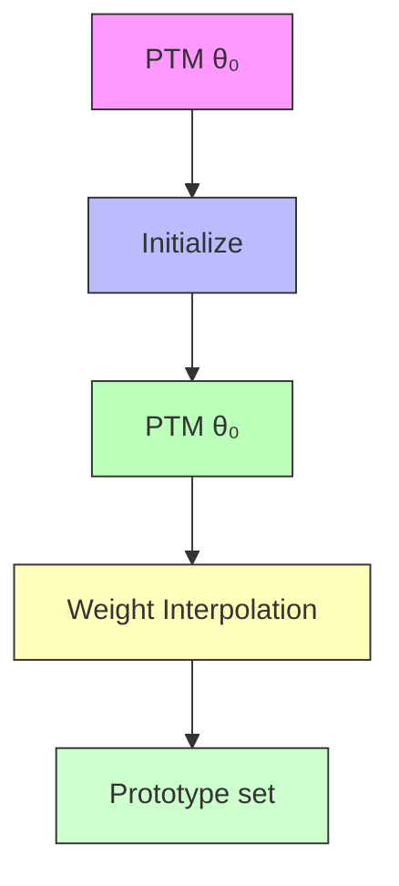
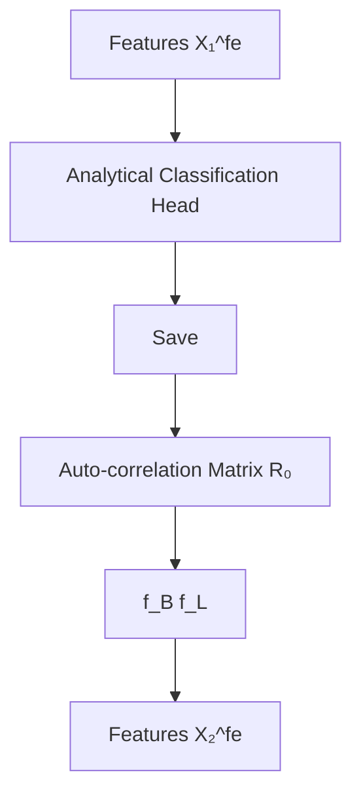
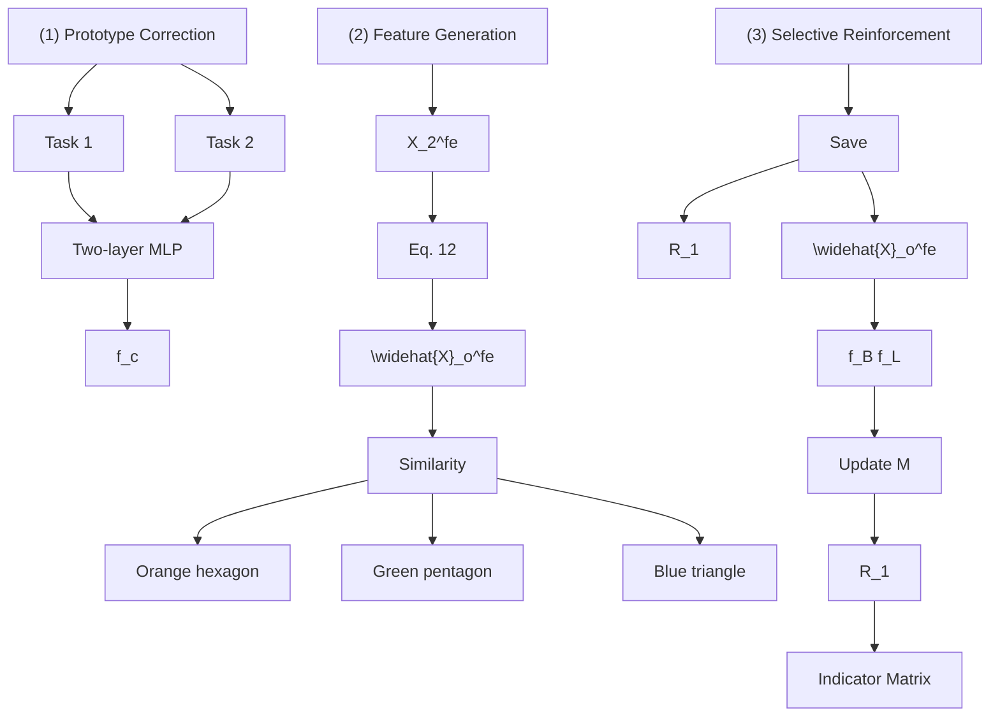

# Knowledge Memorization and Rumination for Pre-trained Model-based Class-Incremental Learning

Zijian Gao1,2†, Wangwang Jia1,2†, Xingxing Zhang3, Dulan Zhou1,2, Kele Xu1,2\*, Feng Dawei1,2, Yong Dou1, Xinjun Mao1,2, Huaimin Wang1,2 1College of Computer Science and Technology, National University of Defense Technology 2State Key Laboratory of Complex & Critical Software Environment 3School of Computer Science, Tsinghua University

{gaozijian19, wangwangjia, dulan zhou, xukelele, yongdou, xjmao, hmwang}@nudt.edu.cn, xxzhang1993@gmail.com, davyfeng.c@qq.com

# Abstract

Class-Incremental Learning (CIL) enables models to continuously learn new classes while mitigating catastrophic forgetting. Recently, Pre-Trained Models (PTMs) have greatly enhanced CIL performance, even when fine-tuning is limited to the first task. This advantage is particularly beneficial for CIL methods that freeze the feature extractor after first-task fine-tuning, such as analytic learning-based approaches using a least squares solution-based classification head to acquire knowledge recursively. In this work, we revisit the analytical learning approach combined with PTMs and identify its limitations in adapting to new classes, leading to sub-optimal performance. To address this, we propose the Momentum-based Analytical Learning (MoAL) approach. MoAL achieves robust knowledge memorization via an analytical classification head and improves adaptivity to new classes through momentum-based adapter weight interpolation, leading to forgetting outdated knowledge. Importantly, we introduce a knowledge rumination mechanism that leverages refined adaptivity, allowing the model to revisit and reinforce old knowledge, thereby improving performance on old classes. MoAL facilitates the acquisition of new knowledge and consolidates old knowledge, achieving a win-win outcome between plasticity and stability. Extensive experiments on various incremental settings show MoAL’s state-of-the-art performance1.

# 1. Introduction

In conventional deep learning, models are trained on a fixed dataset where all data is available upfront. In contrast, real-world scenarios often involve data arriving sequentially with new classes, necessitating a continual learning process—referred to as Class-Incremental Learning (CIL) [20]. The primary objective of CIL is to address catastrophic forgetting [9, 21, 22]—a sharp decline in performance on earlier tasks following sequential learning—thus preserving stability. CIL demands that models balance stability and plasticity to retain prior knowledge while continuously integrating new information [40].

Recently, Pre-Trained Models (PTMs) have shown stateof-the-art results across a broad range of applications [24]. Their strong generalization capability also has led to significant advancements in CIL, outperforming methods that do not leverage PTMs [6, 19, 34, 42, 43, 52, 53]. Empirical evidence from existing works [52, 54] suggests that PTMs’ inherent representations can remain fixed throughout incremental learning, with prototype-based classification heads often surpassing the performance of promptbased approaches [32, 34, 42, 43]. As a result, many methods either limit PTM fine-tuning to the first task [52] or design careful continual fine-tuning strategies [6, 53], balancing the pre-trained representations’ generalization with the adaptivity required for learning new classes.

Naturally, traditional CIL approaches, especially those leveraging frozen feature extractors [26, 59, 60, 62], can benefit significantly from the strong generalizability of PTMs. Among these, analytical learning-based methods stand out, utilizing a fixed feature extractor after first-task fine-tuning and relying on the classification head to recursively acquire knowledge of each sample [59]. While they effectively mitigate representation drift and accommodate new classes through updates of the classification head alone, we find that they often show inadequate adaptivity to novel classes (see Section 3.3.2), resulting in sub-optimal performance. Achieving a balance between stability and plasticity remains a fundamental challenge in CIL, driving renewed interest in developing mechanisms to improve PTM adaptivity while preserving stability.

To address this challenge, we propose a Momentumbased Analytic Learning (MoAL) approach that continually enhances adaptivity across incremental tasks while balancing stability and plasticity. MoAL achieves robust knowledge memorization through an analytical classification head, effectively capturing task-specific knowledge. To enhance adaptivity for new tasks, MoAL employs momentum-based adapter weight interpolation, which facilitates efficient adaptation and helps discard outdated information caused by the previous model’s limited adaptivity. Additionally, MoAL incorporates a knowledge rumination mechanism to revisit and reinforce old task knowledge in a more fine-grained manner.

In nature, ruminant animals rapidly consume forage with minimal chewing, followed by a period of soaking and softening in the rumen [44]. The forage is then regurgitated for thorough re-chewing, allowing efficient nutrient extraction. Inspired by this process, we conceptualize model adaptivity similarly: continuous adaptive learning refines representations incrementally, akin to the rumen’s soaking phase. Building on this analogy, our knowledge rumination mechanism leverages prototype-based fine-grained feature generation to systematically revisit and reinforce old knowledge, aligning retained information more precisely with the model’s evolving representations.

Building on continually adaptive training, MoAL incorporates two key mechanisms—Knowledge Memorization and Knowledge Rumination—to achieve a win-win outcome between plasticity and stability. Key contributions include: (1) Identifying the often-overlooked sub-optimality (i.e., limited adaptivity) in PTM-based analytical learning methods and addressing this limitation with MoAL; (2) Developing an adapter-based training paradigm paired with a knowledge memorization mechanism to effectively balance adaptivity and generalization while recursively capturing new task knowledge; (3) Introducing a knowledge rumination mechanism that revisits and reinforces old knowledge without relying on instances from previous tasks; (4) Demonstrating through extensive experiments that MoAL significantly outperforms existing methods across various settings and even surpasses replay-based approaches.

# 2. Related Work

# 2.1. Class-Incremental Learning

Class-Incremental Learning (CIL) aims to continuously learn new classes while retaining knowledge of previously learned ones [54]. Traditional CIL methods are generally classified into replay-based [27, 36, 47, 50, 51], replayfree [31, 55–57], regularization-based [1, 8, 15, 18, 29, 41, 48], and analytical learning-based approaches [59, 60, 62]. Replay-based methods selectively store or generate past samples for incorporation in current training, while replayfree methods avoid storing instances, instead retaining prototypes to overcome forgetting. Regularization-based approaches use techniques like knowledge distillation [13, 18] to maintain key model parameters. ACIL [59] is the first analytic continual learning method with a closed-form solution. It treats CIL as a recursive process to achieve absolute memory thereby avoiding forgetting caused by backpropagation. It inspires a new CIL branch, with new intakes such as GKEAL [60], GACL [61], RAIL [46].

# 2.2. Pre-Trained Model-Based CIL

Unlike the aforementioned CIL methods that typically train models from scratch, pre-trained model (PTM)-based CIL methods have gained considerable attention in recent years due to their strong generalizability. To minimize training costs, these methods often employ parameter-efficient tuning techniques, mainly including prompts [17] and adapters [4]. Prompt-based approaches [34, 38, 42, 43] focus on designing architectures that adaptively generate taskspecific prompts. In contrast, LAE [6] introduces a unified framework that integrates predictions from online and offline modules based on parameter-efficient tuning. Recently, EASE [53] proposed training task-specific adapters and ensembling them without conflicts, achieving state-ofthe-art performance. Additionally, Aper [52] demonstrates that a prototype-based classification head performs strongly even without model fine-tuning, motivating us to revisit analytical learning-based methods [59] using PTMs.

# 3. Preliminary Analysis

# 3.1. Problem Definition

We first introduce the background of CIL with pre-trained models. Consider a classification model $M _ { \theta } ( \cdot ) = h ( f ( \cdot ) )$ with trainable parameters $\theta = \{ \theta _ { \mathrm { f e } } , \theta _ { \mathrm { c l s } } \}$ , where $f ( \cdot )$ represents the feature extractor and $h ( \cdot )$ denotes the classification head. The feature extractor $f _ { \mathrm { f e } }$ is initialized with parameters $\theta _ { 0 }$ from a PTM and subsequently trained sequentially on a series of incremental tasks. We denote the training dataset at task $t ~ ( t ~ = ~ 1 , 2 , . . . , T )$ by $\mathcal { D } _ { t } ~ = ~ \{ X _ { t } , Y _ { t } \}$ . Here, $\boldsymbol { X } _ { t } ~ \in ~ \mathbb { R } ^ { N _ { t } \times c \times w \times h }$ represents $N _ { t }$ training samples, each with dimensions $c \times w \times h$ , and $\boldsymbol { Y } _ { t } \in \mathbb { R } ^ { N _ { t } \times d _ { \boldsymbol { y } _ { t } } }$ corresponds to $N _ { t }$ one-hot labels, where each label reflects one of the $d _ { y _ { t } }$ classes in task t . The tasks satisfy the non-overlapping class condition, such that $Y _ { t } \cap Y _ { t ^ { \prime } } = \emptyset { \mathrm { ~ f o r ~ } } t \neq t ^ { \prime }$ . In this paper, we adopt the replay-free setting [31, 55–57], where no instances from previous tasks are retained. The goal of $M _ { \theta }$ is to achieve performance comparable to joint learning after sequential training on a total of T tasks.

# 3.2. Adapter-Based Parameter-Efficient Tuning

In the era of PTMs, to preserve pre-trained knowledge and reduce training costs, existing studies [6, 34, 42, 43, 52, 53] commonly freeze the pre-trained weights and introduce an additional trainable module. The adapter [4, 14] is a bottleneck structure that can be incorporated into a pre-trained model to improve performance on downstream tasks. The adapter consists of a down-projection layer $W _ { \mathrm { d o w n } } \in \mathbb { R } ^ { d \times r }$ that reduces the feature dimensionality, followed by a nonlinear activation function \sigma , and an up-projection layer $W _ { \mathsf { u p } } \in \mathbb { R } ^ { r \times d }$ to restore the original dimensionality. Given an input x, the output of the adapter is formalized as:

$$
x + \sigma (x * W _ {\text { down }}) * W _ {\text { up }}, \tag {1}
$$

where \sigma represents the activation function (e.g., ReLU) and \* denotes matrix multiplication. In cases where the pre-trained weights are frozen, only the parameters of the adapter $( \theta _ { W _ { \mathrm { d o w n } } } \cup \theta _ { W _ { \mathrm { u p } } } \cup \theta _ { \mathrm { c l s } } )$ and the classification head are optimized, allowing for efficient adaptation with minimal parameter updates. Compared to prompt tuning, adapter tuning has shown greater effectiveness and superior antiforgetting capacity in CIL [6, 52, 53]. Thus, we adopt the adapter-based tuning used in Aper [52] and EASE [53].

# 3.3. Analytical Learning-Based Sub-Optimality

# 3.3.1. Analytical Learning-Based CIL

Here, we introduce the foundational principles of analytical learning, excluding considerations specific to CIL. Analytic learning [10], also called pseudoinverse learning, was developed to overcome limitations of backpropagation [45], such as gradient vanishing/exploding and the need for long training epochs. It first extracts sample features via a feature extractor and then applies a feature transformation in the initial buffer layer. Using the least squares solution, it subsequently learns the classifier parameters in the second layer with shallow networks [2] in only a single epoch [58].

Analytical learning operates through a two-layer analytic classification head, consisting of a random linear buffer layer $f _ { \mathrm { B } }$ that expands the feature space to $d _ { B }$ dimensions, followed by a linear layer $f _ { \mathrm { L } }$ that aligns features with labels. Using randomization techniques, analytical learning effectively captures valuable information [10, 58]. During learning, inputs $\boldsymbol { X }$ are passed through the feature extractor $f _ { \mathrm { f e } }$ to obtain features $X ^ { \mathrm { { \dot { f e } } } }$ , which are then projected by $f _ { \mathrm { B } }$ to produce the expanded features $X ^ { \mathrm { B } }$ , as formulated below:

$$
\boldsymbol {X} ^ {\mathrm{B}} = \sigma (f _ {\mathrm{B}} (f _ {\text { flat }} (\boldsymbol {X} ^ {\mathrm{fe}}))), \tag {2}
$$

where $f _ { \mathrm { f l a t } }$ denotes the flattening operator and \sigma represents the activation function, with ReLU applied as recommended in [59, 62]. The second layer, $f _ { \mathrm { L } }$ , with parameters $W ^ { \mathrm { L } }$ , aligns the expanded features $X ^ { \mathrm { B } }$ with labels \boldsymbol {Y} by solving the following minimization problem:

bar

Plasticity
| Temperature | Method | Accuracy (%) |
| :--- | :--- | :--- |
| T = 5 | ACIL w/ Dynamic PTM | 88.0 |
| T = 5 | ACIL w/ Frozen PTM | 82.0 |
| T = 5 | Ours (MoAL) | 85.0 |
| T = 10 | ACIL w/ Dynamic PTM | 88.0 |
| T = 10 | ACIL w/ Frozen PTM | 79.5 |
| T = 10 | Ours (MoAL) | 85.0 |

bar

Stability
| Temperature | Method | Stability (%) |
| :--- | :--- | :--- |
| T = 5 | ACIL w/ Dynamic PTM | 20 |
| T = 5 | ACIL w/ Frozen PTM | 80 |
| T = 5 | Ours (MoAL) | 82 |
| T = 10 | ACIL w/ Dynamic PTM | 10 |
| T = 10 | ACIL w/ Frozen PTM | 78 |
| T = 10 | Ours (MoAL) | 80 |

Figure 1. Plasticity and Stability Comparison.

$$
\underset {\boldsymbol {W} ^ {\mathrm{L}}} {\operatorname{argmin}} \left\| \boldsymbol {Y} - \boldsymbol {X} ^ {\mathrm{B}} \boldsymbol {W} ^ {\mathrm{L}} \right\| _ {F} ^ {2} + \gamma \left\| \boldsymbol {W} ^ {\mathrm{L}} \right\| _ {F} ^ {2}, \tag {3}
$$

where $\| \cdot \| _ { F }$ is the Frobenius norm and \gamma is a regularization hyperparameter. The optimal solution, obtained through least squares estimation, is given by:

$$
\hat {\boldsymbol {W}} ^ {\mathrm{L}} = \left(\boldsymbol {X} ^ {\mathrm{B} ^ {\mathrm{T}}} \boldsymbol {X} ^ {\mathrm{B}} + \gamma \boldsymbol {I}\right) ^ {- 1} \boldsymbol {X} ^ {\mathrm{B} ^ {\mathrm{T}}} \boldsymbol {Y}, \tag {4}
$$

in which \cdot ^\mathrm {T} denotes the matrix transpose. With the optimal parameters $\hat { \pmb { W } } ^ { \mathrm { L } }$ determined, the analytical learning framework is established, demonstrating that its upper performance bound depends on the quality of the feature extractor: the better the feature extractor, the higher the achievable performance [10, 58].

Building on this foundation, analytical learning-based CIL methods [59, 60, 62] use a frozen feature extractor $f _ { \mathrm { f e } }$ that undergoes supervised adaptation via backpropagation on the first task and then remains frozen for subsequent tasks, allowing the analytic classification head to be recursively updated and to consistently achieve robust performance across various settings. Due to their strong generalization capabilities, PTMs serve as ideal feature extractors for analytical learning-based methods. Thus, we revisit the analytical learning-based CIL method (ACIL [59]) utilizing PTMs to explore its potential.

# 3.3.2. Overlooked Sub-Optimality

To investigate the latent sub-optimality caused by a frozen feature extractor, we conducted comprehensive experiments using the challenging ImageNet-R [11] and ImageNet-A [12] datasets, with the ViT-B/16-IN21K [5] model pretrained on ImageNet-21K [30]. Adapter tuning was applied, and the model was incrementally trained on an equal number of new classes across a total of 5 tasks. Our evaluation compared the plasticity (average accuracy on new classes) and stability (average accuracy on old classes) of three approaches: ACIL with a frozen PTM after initial task finetuning, ACIL with a dynamic PTM (consisting of a frozen PTM and a trainable adapter) incrementally fine-tuned on new tasks, and our proposed MoAL.

(a) Momentum-based Adapter Weight Interpolation First Task   

flowchart

(b) Knowledge Memorization   

flowchart

(c) Knowledge Rumination   

flowchart

Figure 2. Illustration of MoAL. (a) In the first task, we train an adapter to memorize new knowledge using the analytical classification head and store prototypes post-training. For incremental tasks, momentum-based adapter weight interpolation is employed to enhance adaptability while preserving generalizability. (b) The knowledge memorization mechanism is executed by storing the auto-correlation matrix and recursively updating the weights. (c) Following knowledge memorization, the rumination mechanism corrects old prototypes and generates fine-grained features for old classes, selectively reinforcing old knowledge that has not been fully absorbed by the model.

As shown in Figure 1, ACIL with a frozen feature extractor demonstrates limited adaptability to new tasks, while both our method and the unrestricted fine-tuning approach significantly improve plasticity, underscoring the benefits of continuously enhancing PTM adaptivity. Notably, our method not only increase plasticity but also improve stability, thanks to our knowledge rumination mechanism. To conclude, freezing the feature extractor in ACIL trades adaptability for stability, leading to marked performance declines on datasets that diverge from the pre-training distribution. Conversely, unrestricted PTM fine-tuning increases plasticity but undermines the recursive manner and stability. Our approach, however, achieves a win-win outcome in learning and anti-forgetting.

# 4. Methodology

The success of MoAL can be attributed to three key components: a lightweight, momentum-based adapter weight interpolation mechanism that enhances model adaptability while preserving generalizability; a knowledge memorization mechanism that recursively memorizes new task knowledge; and a knowledge rumination mechanism that revisits and reinforces old task knowledge by leveraging improved model adaptability and refined representations. Figure 2 illustrates the overall framework of our method.

# 4.1. Momentum-based Adapter Weight Interpolation

In our work, we use the adapter [4] to fine-tune the PTM due to its parameter efficiency and performance superiority [52, 53]. Formally, we define the parameters of the PTM $f _ { \theta }$ as $\theta = \theta _ { 0 } + \theta _ { \mathrm { a d a p t e r } } ,$ , where $\theta _ { 0 }$ denotes the initialized parameters from a PTM, and $\theta _ { \mathrm { a d a p t e r } }$ represents the learnable parameters of the adapter, comprising down-projection lowrank parameters $\theta _ { W _ { \mathrm { d o w n } } }$ and up-projection low-rank parameters $\theta _ { W _ { \mathrm { u p } } }$ . Previous studies have shown that maintaining generalization while enhancing adaptivity is essential for PTM-based CIL [52] to learn new tasks effectively while retaining knowledge from previous tasks.

To facilitate continual adaptation to new tasks while preserving the PTM’s inherent generalizability, we introduce a momentum-based adapter weight interpolation mechanism (see Figure 2 (a)) that efficiently retains prior knowledge while integrating new information. Specifically, we assume the adapter parameters $\theta _ { \mathrm { a d a p t e r } }$ are initially updated with the fully-connected classification head $h ( \cdot )$ using cross-entropy loss $L _ { \mathrm { C E } }$ during the first task, where continual adaptation is not yet involved. During subsequent tasks, at the end of each epoch, we iteratively update the adapter’s weights through weight-space interpolation:

$$
\theta_ {\text { adapter }} = \alpha \theta_ {\text { adapter }} + (1 - \alpha) \hat {\theta} _ {\text { adapter }}, \tag {5}
$$

where the momentum hyperparameter $\alpha \in [ 0 , 1 ]$ controls the adapter updates, with sensitivity illustrated in Table 3. Here, ${ \hat { \theta } } _ { \mathrm { a d a p t e r } }$ is initialized with $\theta _ { \mathrm { a d a p t e r } }$ at the beginning of each task and optimized using the classification head $h ( \cdot )$ and cross-entropy loss via backpropagation.

Our method offers several advantages over existing approaches: (1) Parameter and Resource Efficiency: Training involves only a single adapter, greatly reducing the number of trainable parameters and the computational load than those use multiple adapters or models. (2) Inference Efficiency: In the inference stage, our method retains only a single adapter, minimizing storage requirements and enabling faster inference with a single forward pass. (3) Enhanced Performance: Unlike knowledge distillation-based methods [13, 18], which depend on regularization losses, our approach eliminates the need for additional regularization. This leads to superior learning capabilities, effectively consolidating old knowledge through our knowledge rumination mechanism (see Table 2 for comparisons).

# 4.2. Knowledge Memorization

After enhancing the adaptivity of PTM for each task, an effective mechanism is required to learn and memorize knowledge incrementally. To achieve this, our knowledge memorization mechanism (Figure 2 (b)) employs an efficient, one-pass learning approach that computes the analytical classification head weights and auto-correlation matrix through a straightforward recursive least squares solution, enabling task memorization during the incremental task without the resource demands of conventional backpropagation-based learning.

Specifically, following the classical analytical learning process and the notations in Section 3.3.1, we define the PTM $f _ { \theta }$ as the feature extractor $f _ { \mathrm { f e } }$ and the analytical classification head, which consists of a buffer layer $f _ { \mathrm { B } }$ and a second linear layer $f _ { \mathrm { L } }$ . After training on the first task without considering continual learning, we obtain the optimal parameters $\hat { \pmb { W } } _ { 1 } ^ { \mathrm { L } } \ : = \ : \left( \pmb { X } _ { 1 } ^ { \mathrm { B } ^ { \mathrm { T } } } \pmb { X } _ { 1 } ^ { \mathrm { B } } + \gamma \pmb { I } \right) ^ { - 1 } \pmb { X } _ { 1 } ^ { \mathrm { B } ^ { \mathrm { T } } } \pmb { Y } _ { 1 }$ for the linear layer $f _ { \mathrm { L } }$ based on Eq. 4. These parameters map the expanded features $X _ { 1 } ^ { \mathrm { B } }$ to the labels $\mathbf { Y } _ { 1 }$ and are calculated using the training samples $X _ { 1 }$ from the first task.

In incremental tasks, at task $t ,$ the goal of the knowledge memorization mechanism is to incorporate the existing mapping relationships for old task samples $X _ { 1 } , \dots , X _ { t - 1 }$ along with the new mapping relationship for the current task samples $X _ { t } .$ . Assuming that all task samples are available simultaneously, we can get an equivalent target to our recursive solution:

$$
\underset {\boldsymbol {W} _ {t} ^ {\mathrm{L}}} {\operatorname{argmin}} \left\| \boldsymbol {Y} _ {1: t} - \boldsymbol {X} _ {1: t} ^ {\mathrm{B}} \boldsymbol {W} _ {t} ^ {\mathrm{L}} \right\| _ {F} ^ {2} + \gamma \left\| \boldsymbol {W} _ {t} ^ {\mathrm{L}} \right\| _ {F} ^ {2}, \tag {6}
$$

where

$$
\boldsymbol {X} _ {1: t} ^ {\mathrm{B}} = \left[ \begin{array}{c} \boldsymbol {X} _ {1} ^ {\mathrm{B}} \\ \vdots \\ \boldsymbol {X} _ {t} ^ {\mathrm{B}} \end{array} \right] \boldsymbol {Y} _ {1: t} = \left[ \begin{array}{c c c c c} \boldsymbol {Y} _ {1} & 0 & 0 & \dots & 0 \\ 0 & \boldsymbol {Y} _ {2} & 0 & \dots & 0 \\ \vdots & \vdots & & \ddots & \\ 0 & 0 & 0 & \dots & \boldsymbol {Y} _ {t} \end{array} \right]. \tag {7}
$$

The sparse structure of $Y _ { 1 : t }$ results from the mutually exclusive classes across tasks. Thus, according to Eq. 4, we can get the least squares solution:

$$
\boldsymbol {W} _ {t} ^ {\mathrm{L}} = \left(\boldsymbol {X} _ {1: t} ^ {\mathrm{T}} \boldsymbol {X} _ {1: t} ^ {\mathrm{B}} + \gamma \boldsymbol {I}\right) ^ {- 1} \boldsymbol {X} _ {1: t} ^ {\mathrm{T}} \boldsymbol {Y} _ {1: t}. \tag {8}
$$

At the task t, we aim to get the identical recursive solution $\mathbf { \boldsymbol { W } } _ { t } ^ { \mathrm { L } }$ based on the last task solution $\boldsymbol { W } _ { t - 1 } ^ { \mathrm { L } }$ Lt−1, current task samples $X _ { t }$ and labels $\mathbf { \boldsymbol { Y } } _ { t }$ . The recursive solution can be summarized in the following theorem:

Theorem 1. Let $R _ { t } = \left( { X _ { 1 : t } ^ { B } } ^ { \mathrm { ~ T ~ } } X _ { 1 : t } ^ { B } + \gamma I \right) ^ { - 1 }$ be the autocorrelation matrix, the weights $\mathbf { \overline { { \mathbf { W } } } } _ { t } ^ { L }$ are recursively obtained by

$$
\boldsymbol {W} _ {t} ^ {L} = \boldsymbol {W} _ {t - 1} ^ {L} + \boldsymbol {R} _ {t} \boldsymbol {X} _ {t} ^ {B ^ {\mathrm{T}}} \left(\boldsymbol {Y} _ {t} - \boldsymbol {X} _ {t} ^ {B} \boldsymbol {W} _ {t - 1} ^ {L}\right) \tag {9}
$$

where

$$
\boldsymbol {R} _ {t} = \boldsymbol {R} _ {t - 1} - \boldsymbol {R} _ {t - 1} \boldsymbol {X} _ {t} ^ {B ^ {\mathrm{T}}} \left(\boldsymbol {I} + \boldsymbol {X} _ {t} ^ {B} \boldsymbol {R} _ {t - 1} \boldsymbol {X} _ {t} ^ {B ^ {\mathrm{T}}}\right) ^ {- 1} \boldsymbol {X} _ {t} ^ {B} \boldsymbol {R} _ {t - 1}. \tag {10}
$$

Proof. See the supplementary materials.

Based on Theorem 1, we derive a recursive solution that does not require samples $X _ { 1 } , \dots , X _ { t - 1 }$ from old tasks. However, as discussed in Section 3.3.2, this recursive solution depends on a frozen PTM, which limits adaptability and results in sub-optimal performance. To overcome this limitation, we enhance the adaptivity of the PTM $f _ { \theta }$ through momentum-based adapter weight interpolation, simultaneously enabling forgetting to discard out-dated feature-tolabel mappings (i.e., knowledge).

Forgetting has been shown to be essential in both biological systems [7, 28, 33] and continual learning [37, 39], as it enables selective removal of outdated information, aiding adaptation to new knowledge [3]. While this disrupts the recursive solution, it allows the model to discard obsolete knowledge, creating a solid foundation for our knowledge rumination mechanism to revisit and reinforce previous task knowledge with enhanced adaptivity, ultimately achieving better performance on old tasks.

# 4.3. Knowledge Rumination

The knowledge rumination mechanism (Figure 2 (c)) reproduces fine-grained knowledge of previous tasks with enhanced adaptivity without relying on old task data. To achieve this, we store prototypes (typically the class means in feature space) and implement a straightforward prototype correction network to adjust these prototypes over time. Additionally, we exploit the relationships between old and new class prototypes to generate refined features for old tasks. This selective process enables the model to revisit and reinforce knowledge that was inadequately learned, thus improving performance on previous tasks. This approach is inspired by biological rumination: after food is initially ingested and softened in the rumen, it is regurgitated for fine-grained re-chewing, allowing thorough nutrient breakdown and enhanced absorption.

Prototype correction: Prototypes are widely used in CIL to address forgetting, especially when previous task samples [55, 56] are unavailable. For each task t , we compute the prototype $p _ { k }$ for samples $X ^ { k }$ of a new class k using the PTM $f _ { \theta ^ { t } } \colon p _ { k } ^ { t } = \operatorname { m e a n } ( f _ { \theta ^ { t } } ( X ^ { k } ) )$ . However, prototypes obtained by the PTM $f _ { \theta ^ { t } }$ for task t will differ from those produced by its predecessor $f _ { \theta ^ { t - 1 } }$ in task $t - 1$ , leading to inferior reliability when generating features for old classes. To mitigate this, we transform the old prototype $p _ { k } ^ { t - 1 }$ from the previous feature space to the current one, obtaining the corrected prototype $p _ { k } ^ { t }$ . Specifically, we save the adapter $\theta _ { \mathrm { a d a p t e r } } ^ { t - 1 }$ before training oers for task t-1 as g the PTM pa-. Similarly, we $\theta ^ { t - 1 } = \theta _ { 0 } + \theta _ { \mathrm { a d a p t e r } } ^ { t - 1 }$ denote the PTM parameters for task t as $\begin{array} { r } { \dot { \theta } ^ { t } = \theta _ { 0 } + \theta _ { \mathrm { a d a p t e r } } ^ { t } . } \end{array}$ To align old and new feature spaces, we introduce a prototype correction network $f _ { \mathrm { C } } ,$ implemented as a two-layer MLP, which utilizes $f _ { \theta ^ { t - 1 } } , \ f _ { \theta ^ { t } }$ , and the current task samples $X _ { t }$ to minimize the Euclidean distance between features extracted by $f _ { \theta ^ { t - 1 } }$ and $f _ { \theta ^ { t } }$ :

$$
\mathcal {L} _ {\mathrm{PC}} = \left\| f _ {\theta^ {t}} (\boldsymbol {X} _ {t}) - f _ {\mathrm{C}} (f _ {\theta^ {t - 1}} (\boldsymbol {X} _ {t})) \right\| _ {2}. \tag {11}
$$

In this way, after each task, we use the correction network $f _ { \mathrm { C } }$ to obtain the corrected prototype $p _ { k } ^ { t } = f _ { \mathrm { C } } ( p _ { k } ^ { ( t - 1 ) } )$ . All previously learned prototypes are updated with each new task, resulting in an updated prototype set $\{ p _ { 1 } ^ { t } , p _ { 2 } ^ { t } , \ldots , p _ { k } ^ { t } \}$ across all classes.

Fine-grained feature generation for old classes: Using the prototype set, we calculate the cosine similarity between the prototypes of new and old classes to generate fine-grained features for old classes. In task t , let i be an old class most similar to a new class $j ;$ the features of old class i can then be generated as follows:

$$
\hat {\boldsymbol {X}} _ {i} ^ {\mathrm{fe}} = \boldsymbol {X} _ {j} ^ {\mathrm{fe}} + p _ {j} ^ {t} - p _ {i} ^ {t}. \tag {12}
$$

where $X _ { j } ^ { \mathrm { f e } } = f _ { \theta ^ { t } } ( X ^ { j } )$ . This equation translates the refined features of new classes into more precise representations of old classes, leveraging prototype distances. It provides a computationally efficient solution by relying solely on addition and subtraction operations, thus enabling the model to revisit knowledge from previous tasks.

Selective reinforcement of old task knowledge: For simplicity, we denote the fine-grained features of all old classes as $\hat { \boldsymbol X } _ { o } ^ { \mathrm { f e } }$ . These features are then passed through the buffer layer $f _ { \mathrm { B } }$ to produce expanded features $\hat { \boldsymbol X } _ { o } ^ { \mathrm { B } }$ (see Equation 2). To selectively reinforce the old task knowledge that the model has not fully learned, we introduce an indicator matrix \boldsymbol {M} , defined as follows:

$$
\boldsymbol {M} = \mathbb {I} \left(f _ {\mathrm{L}} (\hat {\boldsymbol {X}} _ {o} ^ {\mathrm{B}}) \neq \boldsymbol {Y} _ {o}\right), \tag {13}
$$

where $\boldsymbol { Y } _ { o }$ represents the corresponding labels and $\mathbb { I } ( \cdot )$ is the indicator function, which takes the value 1 if the condition is true and 0 otherwise. The reinforcement process is formulated in the following theorem:

Theorem 2. Given the weights $\mathbf { \overline { { \mathbf { W } } } } _ { t } ^ { L }$ of the linear layer $f _ { L }$ , the auto-correlation matrix $\scriptstyle { R _ { t } } ,$ , the expanded features $\hat { \boldsymbol X } _ { o } ^ { B } ,$ , the corresponding labels $\mathbf { \nabla } \mathbf { Y } _ { o } ,$ and the indicator matrix \boldsymbol {M} , the weights $\mathbf { \overline { { W } } } _ { t } ^ { L }$ are updated as follows:

$$
\boldsymbol {W} _ {t} ^ {L} = \boldsymbol {W} _ {t} ^ {L} + \boldsymbol {R} _ {t} \left(\boldsymbol {M} \odot \hat {\boldsymbol {X}} _ {o} ^ {B ^ {\mathrm{T}}}\right) \left(\boldsymbol {M} \odot \boldsymbol {Y} _ {o} - \boldsymbol {M} \odot \hat {\boldsymbol {X}} _ {o} ^ {B} \boldsymbol {W} _ {t} ^ {L}\right) \tag {14}
$$

where

$$
\boldsymbol {R} _ {t} = \boldsymbol {R} _ {t} - \boldsymbol {R} _ {t} \left(\boldsymbol {M} \odot \hat {\boldsymbol {X}} _ {o} ^ {B ^ {\mathrm{T}}}\right) \left(\boldsymbol {I} + \boldsymbol {M} \odot \hat {\boldsymbol {X}} _ {o} ^ {B} \boldsymbol {R} _ {t} \left(\boldsymbol {M} \odot \hat {\boldsymbol {X}} _ {o} ^ {B ^ {\mathrm{T}}}\right)\right) ^ {- 1} \left(\boldsymbol {M} \odot \hat {\boldsymbol {X}} _ {o} ^ {B}\right) \boldsymbol {R} _ {t}. \tag {15}
$$

By integrating enhanced adaptivity with the relational structure between old and new class feature spaces, our knowledge rumination mechanism effectively revisits and reinforces old knowledge. Although momentum-based adapter weight interpolation disrupts the strict recursion of analytical learning in CIL, the rumination mechanism mitigates forgetting and further enhances performance on old tasks by refining fine-grained knowledge. The pseudoalgorithm is included in the supplementary material.

# 5. Experiments

# 5.1. Experimental Setting

Datasets. To evaluate the performance of our method, we conduct experiments on four commonly used benchmarks: CIFAR-100 [16], ImageNet-A [12], ImageNet-R [11], and OmniBenchmark [49]. For CIFAR-100, ImageNet-A, and ImageNet-R, we use three incremental settings (5, 10, and 20 tasks), while for OmniBenchmark, we use settings with 5, 15, and 30 tasks. All classes are arranged in a fixed order and the model is trained on an equal number of classes in both the first task and each incremental task.

Implementation details. Our methods are implemented using PyTorch [25] and PILOT [35] on an NVIDIA 4090. For fair comparison, we utilize the widely adopted Vision Transformer (ViT) architecture, specifically ViT-B/16- IN21K [5], following the setups in [43, 52]. This architecture features a transformer block with an input dimension of 224 and an output dimension of 768. The momentum hyperparameter α is set to 0.999 and The dimension $d _ { B }$ of the buffer layer $f _ { \mathrm { B } }$ is set to 5k for CIFAR-100, 15k for ImageNet-A, 20k for ImageNet-R, and 10k for OmniBenchmark. We use the SGD optimizer with a momentum of 0.9, and the learning rate starts at 0.01, decaying with cosine annealing. The batch size is set to 48, and the model is trained for 80 epochs (20 epochs for OmniBenchmark). Meanwhile, we employ ridge regression [23] to compute regularization hyperparameter \gamma in a self-adaptive manner. Following [27], we shuffle the class order using a random seed of 1993 for all methods.

Comparison methods. To establish the effectiveness of our approach, we select state-of-the-art PTMbased CIL methods for comparative analysis, which include L2P [43], DualPrompt [42], ACIL [59], CODA-Prompt [34], LAE [6], DS-AL [62], SimpleCIL [52], Aper [52], and EASE [53]. Furthermore, we also benchmark our approach against typical CIL methods by equipping them with the same PTM, such as LwF [18], iCaRL [27], DER [47], FOSTER [36], and MEMO [51]. For Finetune, LwF [18] and Aper [52], we construct a fair comparison that includes a frozen PTM and a trainable adapter module, both serving as the backbone for training.

Table 1. Comparison of average incremental accuracy A¯(%), last-task accuracy $A _ { T } ( \% )$ and the average performance among EFCIL methods with different T tasks on different datasets. The best results of existing methods are highlighted in blue font. 

<table><tr><td rowspan="2">Metric</td><td rowspan="2">Methods</td><td colspan="4">CIFAR-100</td><td colspan="4">ImageNet-A</td><td colspan="4">ImageNet-R</td><td colspan="4">OmniBenchmark</td></tr><tr><td>T=20</td><td>10</td><td>5</td><td>avg.</td><td>T=20</td><td>10</td><td>5</td><td>avg.</td><td>T=20</td><td>10</td><td>5</td><td>avg.</td><td>T=30</td><td>15</td><td>10</td><td>avg.</td></tr><tr><td rowspan="13"> $\bar{A}$ </td><td>Finetune</td><td>84.40</td><td>87.52</td><td>90.51</td><td>87.48</td><td>46.06</td><td>50.45</td><td>57.23</td><td>51.25</td><td>71.14</td><td>74.94</td><td>78.15</td><td>74.74</td><td>67.70</td><td>72.05</td><td>73.30</td><td>71.02</td></tr><tr><td>LwF (TPAMI 2018) [18]</td><td>76.19</td><td>82.88</td><td>88.10</td><td>82.39</td><td>46.03</td><td>50.36</td><td>56.75</td><td>51.05</td><td>70.74</td><td>74.31</td><td>77.00</td><td>74.02</td><td>67.42</td><td>72.31</td><td>73.91</td><td>71.21</td></tr><tr><td>L2P (CVPR 2022) [43]</td><td>86.99</td><td>89.48</td><td>91.02</td><td>89.16</td><td>50.87</td><td>54.03</td><td>56.35</td><td>53.75</td><td>75.59</td><td>77.92</td><td>77.86</td><td>77.12</td><td>70.14</td><td>71.93</td><td>73.22</td><td>71.76</td></tr><tr><td>DualPrompt (ECCV 2022) [42]</td><td>86.88</td><td>88.86</td><td>89.78</td><td>88.51</td><td>54.59</td><td>58.60</td><td>59.59</td><td>57.59</td><td>73.61</td><td>75.06</td><td>75.12</td><td>74.60</td><td>72.81</td><td>73.66</td><td>75.13</td><td>73.87</td></tr><tr><td>ACIL (NeurIPS 2022) [59]</td><td>90.22</td><td>91.96</td><td>94.00</td><td>92.06</td><td>64.42</td><td>70.93</td><td>72.04</td><td>69.97</td><td>79.43</td><td>81.21</td><td>83.36</td><td>81.34</td><td>76.96</td><td>76.54</td><td>76.09</td><td>76.53</td></tr><tr><td>CODA-Prompt (CVPR 2023) [34]</td><td>86.06</td><td>91.19</td><td>92.20</td><td>89.82</td><td>57.19</td><td>61.86</td><td>65.97</td><td>61.67</td><td>71.63</td><td>76.69</td><td>80.17</td><td>76.16</td><td>68.64</td><td>70.78</td><td>72.19</td><td>70.54</td></tr><tr><td>LAE (ICCV 2023) [6]</td><td>80.96</td><td>86.97</td><td>88.50</td><td>85.47</td><td>50.30</td><td>58.56</td><td>59.09</td><td>55.98</td><td>72.85</td><td>75.42</td><td>75.48</td><td>74.58</td><td>71.00</td><td>73.82</td><td>73.65</td><td>72.82</td></tr><tr><td>DS-AL (AAAI 2024) [62]</td><td>86.11</td><td>83.50</td><td>88.82</td><td>86.14</td><td>63.38</td><td>63.47</td><td>61.82</td><td>63.22</td><td>75.90</td><td>78.37</td><td>80.39</td><td>78.22</td><td>79.73</td><td>80.20</td><td>76.91</td><td>78.95</td></tr><tr><td>SimpleCIL (IJCV 2024) [52]</td><td>82.79</td><td>82.31</td><td>81.12</td><td>82.07</td><td>60.05</td><td>59.33</td><td>58.09</td><td>59.16</td><td>67.60</td><td>67.09</td><td>65.89</td><td>66.86</td><td>79.46</td><td>79.23</td><td>78.51</td><td>79.07</td></tr><tr><td>Aper (IJCV 2024) [52]</td><td>88.48</td><td>90.91</td><td>91.56</td><td>90.32</td><td>61.36</td><td>65.74</td><td>68.90</td><td>65.33</td><td>76.28</td><td>79.01</td><td>80.48</td><td>78.59</td><td>79.72</td><td>79.79</td><td>79.82</td><td>79.78</td></tr><tr><td>EASE (CVPR 2024) [53]</td><td>90.62</td><td>92.01</td><td>92.81</td><td>91.81</td><td>60.62</td><td>62.93</td><td>67.93</td><td>63.83</td><td>78.15</td><td>81.33</td><td>82.25</td><td>80.58</td><td>73.09</td><td>75.32</td><td>81.11</td><td>76.51</td></tr><tr><td rowspan="2">MoAL (Ours)</td><td>93.27</td><td>94.22</td><td>94.03</td><td>93.84</td><td>67.26</td><td>74.29</td><td>75.22</td><td>72.26</td><td>82.94</td><td>84.45</td><td>85.39</td><td>84.26</td><td>84.04</td><td>85.68</td><td>84.45</td><td>84.72</td></tr><tr><td>+3.05</td><td>+2.26</td><td>+0.03</td><td>+1.78</td><td>+2.84</td><td>+3.36</td><td>+3.18</td><td>+2.29</td><td>+3.51</td><td>+3.24</td><td>+2.03</td><td>+2.92</td><td>+4.31</td><td>+5.48</td><td>+3.34</td><td>+5.77</td></tr><tr><td rowspan="13"> $A_T$ </td><td>Finetune</td><td>78.58</td><td>82.06</td><td>86.31</td><td>82.32</td><td>33.77</td><td>40.62</td><td>47.14</td><td>40.51</td><td>63.72</td><td>68.63</td><td>73.97</td><td>68.77</td><td>56.41</td><td>60.82</td><td>62.42</td><td>59.88</td></tr><tr><td>LwF (TPAMI 2018) [18]</td><td>67.36</td><td>77.57</td><td>84.28</td><td>76.40</td><td>33.77</td><td>40.22</td><td>45.89</td><td>39.96</td><td>64.45</td><td>69.55</td><td>73.27</td><td>69.09</td><td>56.52</td><td>61.40</td><td>64.59</td><td>60.84</td></tr><tr><td>L2P (CVPR 2022) [43]</td><td>81.22</td><td>84.47</td><td>86.27</td><td>83.99</td><td>42.40</td><td>45.49</td><td>48.52</td><td>45.47</td><td>68.73</td><td>72.25</td><td>73.73</td><td>71.57</td><td>59.85</td><td>62.32</td><td>63.84</td><td>62.00</td></tr><tr><td>DualPrompt (ECCV 2022) [42]</td><td>79.90</td><td>84.23</td><td>84.76</td><td>82.96</td><td>43.38</td><td>47.93</td><td>49.18</td><td>46.83</td><td>67.12</td><td>69.10</td><td>70.37</td><td>68.86</td><td>62.84</td><td>62.91</td><td>65.60</td><td>63.78</td></tr><tr><td>ACIL (NeurIPS 2022) [59]</td><td>88.79</td><td>90.33</td><td>90.73</td><td>89.95</td><td>51.02</td><td>60.90</td><td>62.54</td><td>59.65</td><td>75.55</td><td>77.38</td><td>78.90</td><td>77.28</td><td>73.28</td><td>66.52</td><td>77.06</td><td>72.29</td></tr><tr><td>CODA-Prompt (CVPR 2023) [34]</td><td>79.55</td><td>87.24</td><td>88.67</td><td>85.15</td><td>46.15</td><td>51.02</td><td>56.35</td><td>51.17</td><td>67.93</td><td>73.10</td><td>76.40</td><td>72.48</td><td>64.61</td><td>67.64</td><td>68.84</td><td>67.03</td></tr><tr><td>LAE (ICCV 2023) [6]</td><td>74.26</td><td>81.13</td><td>82.76</td><td>79.38</td><td>39.43</td><td>47.73</td><td>50.03</td><td>45.73</td><td>65.57</td><td>69.83</td><td>71.05</td><td>68.82</td><td>62.44</td><td>63.88</td><td>64.76</td><td>63.70</td></tr><tr><td>DS-AL (AAAI 2024) [62]</td><td>85.90</td><td>86.05</td><td>85.91</td><td>85.95</td><td>51.74</td><td>52.67</td><td>51.02</td><td>51.81</td><td>74.05</td><td>77.48</td><td>76.55</td><td>76.03</td><td>73.40</td><td>73.52</td><td>72.95</td><td>73.29</td></tr><tr><td>SimpleCIL (IJCV 2024) [52]</td><td>76.21</td><td>76.21</td><td>76.21</td><td>76.21</td><td>49.24</td><td>49.24</td><td>49.24</td><td>49.24</td><td>61.35</td><td>61.35</td><td>61.35</td><td>61.35</td><td>72.18</td><td>72.18</td><td>72.18</td><td>72.18</td></tr><tr><td>Aper (IJCV 2024) [52]</td><td>82.75</td><td>85.81</td><td>87.58</td><td>85.38</td><td>50.49</td><td>55.69</td><td>59.91</td><td>55.36</td><td>69.25</td><td>72.05</td><td>74.95</td><td>72.08</td><td>72.51</td><td>72.95</td><td>73.25</td><td>72.90</td></tr><tr><td>EASE (CVPR 2024) [53]</td><td>84.21</td><td>87.25</td><td>89.22</td><td>86.89</td><td>49.70</td><td>51.74</td><td>57.93</td><td>53.13</td><td>71.10</td><td>76.00</td><td>78.05</td><td>75.05</td><td>64.44</td><td>67.74</td><td>74.37</td><td>67.75</td></tr><tr><td rowspan="2">MoAL (Ours)</td><td>88.36</td><td>90.49</td><td>90.85</td><td>89.90</td><td>52.01</td><td>64.06</td><td>67.22</td><td>61.10</td><td>76.85</td><td>79.33</td><td>81.38</td><td>79.19</td><td>74.02</td><td>77.23</td><td>78.61</td><td>76.62</td></tr><tr><td>-0.43</td><td>+0.16</td><td>+0.12</td><td>-0.05</td><td>+0.27</td><td>+3.16</td><td>+4.68</td><td>+1.45</td><td>+1.30</td><td>+1.85</td><td>+2.48</td><td>+1.91</td><td>+0.62</td><td>+3.71</td><td>+1.55</td><td>+3.33</td></tr></table>

line

| num of classes | LwF   | DualPrompt | L2P   | CODA_Prompt | LAE   | Aper  | DSAL  | ACIL  | EASE  | MoAL  |
| -------------- | ----- | ---------- | ----- | ----------- | ----- | ----- | ----- | ----- | ----- | ----- |
| 20             | 97.0  | 96.0       | 95.0  | 94.0        | 96.0  | 97.0  | 96.0  | 95.0  | 96.0  | 97.0  |
| 40             | 95.0  | 93.0       | 93.0  | 92.0        | 93.0  | 95.0  | 93.0  | 92.0  | 93.0  | 94.0  |
| 60             | 93.0  | 91.0       | 91.0  | 89.0        | 88.0  | 93.0  | 91.0  | 89.0  | 91.0  | 92.0  |
| 80             | 91.0  | 88.0       | 88.0  | 86.0        | 85.0  | 91.0  | 88.0  | 86.0  | 88.0  | 90.0  |
| 100            | 89.0  | 85.0       | 85.0  | 83.0        | 82.0  | 89.0  | 85.0  | 83.0  | 85.0  | 88.0  |

line

| num of classes | LwF  | DualPrompt | L2P  | CODA_Prompt | LAE  | Aper | DSAL | ACIL | EASE | MoAL |
| -------------- | ---- | ---------- | ---- | ----------- | ---- | ---- | ---- | ---- | ---- | ---- |
| 50             | 80   | 80         | 80   | 80          | 80   | 80   | 80   | 80   | 80   | 80   |
| 100            | 60   | 65         | 70   | 75          | 70   | 75   | 75   | 75   | 75   | 75   |
| 150            | 45   | 55         | 65   | 70          | 60   | 65   | 65   | 65   | 65   | 65   |
| 200            | 40   | 50         | 60   | 65          | 55   | 60   | 60   | 60   | 60   | 60   |

line

| num of classes | LwF  | DualPrompt | L2P  | CODA_Prompt | LAE  | Aper | DSAL | ACIL | EASE | MoAL |
| -------------- | ---- | ---------- | ---- | ----------- | ---- | ---- | ---- | ---- | ---- | ---- |
| 50             | 88   | 82         | 87   | 86          | 81   | 89   | 86   | 85   | 84   | 89   |
| 100            | 84   | 78         | 83   | 82          | 76   | 85   | 82   | 81   | 80   | 86   |
| 150            | 80   | 74         | 79   | 78          | 72   | 82   | 79   | 78   | 77   | 83   |
| 200            | 76   | 70         | 75   | 74          | 68   | 79   | 76   | 75   | 74   | 80   |

line

| num of classes | LwF  | DualPrompt | L2P  | CODA_Prompt | LAE  | Aper | DSAL | ACIL | EASE | MoAL |
| -------------- | ---- | ---------- | ---- | ----------- | ---- | ---- | ---- | ---- | ---- | ---- |
| 50             | 98   | 97         | 96   | 95          | 94   | 93   | 92   | 91   | 90   | 98   |
| 100            | 95   | 94         | 93   | 92          | 91   | 90   | 89   | 88   | 87   | 95   |
| 150            | 92   | 91         | 90   | 89          | 88   | 87   | 86   | 85   | 84   | 92   |
| 200            | 89   | 88         | 87   | 86          | 85   | 84   | 83   | 82   | 81   | 89   |
| 250            | 86   | 85         | 84   | 83          | 82   | 81   | 80   | 79   | 78   | 86   |
| 300            | 83   | 82         | 81   | 79          | 78   | 77   | 76   | 75   | 74   | 83   |

Figure 3. The average incremental accuracy A¯(%) curves of various methods.

Evaluation Metrics. Following the widely used benchmarks [35, 54], two metrics are adopted for evaluation. The overall performance is evaluated by the average incremental accuracy $\begin{array} { r } { \bar { A } ( \% ) : \bar { A } = \frac { 1 } { T } \sum _ { t = 1 } ^ { T } A _ { t } } \end{array}$ where T and At respectively denote the number of incremental tasks and the test accuracy on all seen classes at task t. Another metric is the last-task accuracy $A _ { T } ( \% )$ , which denotes the final average accuracy on all classes.

# 5.2. State-of-the-art Comparison

In Table 1, we compare MoAL with several state-of-the-art (SOTA) methods. Notably, the non-PTM-based ACIL [59], benefiting from its recursive structure, achieves competitive results relative to the PTM-optimized EASE [53], highlighting the strong compatibility between analytical learningbased CIL methods and PTMs. However, MoAL outperforms all baselines in both \protect \hat {A} and $A _ { T }$ across nearly all datasets and settings. In particular, on datasets that differ from the pre-training data, such as ImageNet-A and ImageNet-R, MoAL surpasses the best baseline by an average of 2.29% and 2.92% in \protect \hat {A} , respectively. Furthermore, our method demonstrates minimal performance degradation as the number of tasks increases.

It’s worth note that ACIL’s final accuracy on CIFAR-100 is close to MoAL’s, due to the inherent generalization capabilities of PTMs on this dataset, even without continual adaptation. However, on more challenging datasets like ImageNet-A and ImageNet-R, MoAL significantly outperforms ACIL, thanks to its enhanced PTM adaptivity, which ensures superior stability and plasticity. These trends are also reflected in the accuracy curves shown in Figure 3. These comparisons highlight the value of our method, particularly when downstream datasets differ significantly from pre-trained data, showcasing its strong generalization across diverse domains. Please see the supplementary material for more results on different PTM backbones and datasets, and the comparison to replay-based methods.

Table 2. Ablation study comparing the impact of using different components in MoAL on the average incremental accuracy $\hat { A } ( \% )$ . 

<table><tr><td rowspan="2">Knowledge Distillation</td><td rowspan="2">Weight Interpolation</td><td rowspan="2">Knowledge Rumination</td><td colspan="2">Imagenet-A</td><td colspan="2">Imagenet-R</td><td colspan="2">OmniBenchmark</td></tr><tr><td>T=10</td><td>5</td><td>T=10</td><td>5</td><td>T=15</td><td>10</td></tr><tr><td></td><td></td><td></td><td>70.93</td><td>72.04</td><td>81.21</td><td>83.36</td><td>76.54</td><td>76.09</td></tr><tr><td>√</td><td></td><td></td><td>66.93</td><td>69.48</td><td>64.39</td><td>63.12</td><td>76.99</td><td>82.89</td></tr><tr><td></td><td>√</td><td></td><td>72.66</td><td>74.01</td><td>84.27</td><td>84.08</td><td>81.77</td><td>82.21</td></tr><tr><td>√</td><td></td><td>√</td><td>70.56</td><td>71.41</td><td>82.60</td><td>82.65</td><td>80.57</td><td>83.84</td></tr><tr><td></td><td>√</td><td>√</td><td>74.29</td><td>75.22</td><td>84.45</td><td>85.39</td><td>85.68</td><td>84.45</td></tr></table>

Table 3. Average incremental accuracy $\hat { A } ( \% )$ comparison of different values of α across various benchmarks and settings. 

<table><tr><td rowspan="2">α</td><td colspan="2">CIFAR-100</td><td colspan="2">Imagenet-A</td><td colspan="2">OmniBenchmark</td></tr><tr><td>T=10</td><td>5</td><td>T=10</td><td>5</td><td>T=15</td><td>10</td></tr><tr><td>0.99</td><td>93.16</td><td>93.73</td><td>72.96</td><td>74.50</td><td>77.63</td><td>79.96</td></tr><tr><td>0.995</td><td>93.64</td><td>93.84</td><td>74.20</td><td>75.01</td><td>84.67</td><td>82.10</td></tr><tr><td>0.999</td><td>94.11</td><td>94.03</td><td>74.29</td><td>75.22</td><td>85.68</td><td>84.45</td></tr><tr><td>0.9995</td><td>94.21</td><td>94.00</td><td>74.19</td><td>75.24</td><td>85.00</td><td>84.62</td></tr><tr><td>0.9999</td><td>94.22</td><td>93.91</td><td>73.98</td><td>75.15</td><td>85.57</td><td>84.68</td></tr></table>

# 5.3. Ablation Study

In Table 2, we present an ablation study to assess each component’s contribution in MoAL. Removing both weight interpolation and knowledge rumination reduces MoAL to the classical ACIL method [59]. For further insights, we replace our momentum-based weight interpolation with the widely-used feature-based knowledge distillation regularization. The results indicate that knowledge distillation alone results in a noticeable performance drop, while our weight interpolation improves performance even without the recursive principle, underscoring the importance of continual adaptation. Incorporating knowledge rumination alongside these techniques further boosts performance, particularly with an increasing number of tasks, demonstrating its effectiveness in reinforcing old knowledge. The complementary roles of weight interpolation and knowledge rumination are clear: interpolation enhances representation adaptability, allowing finer-grained feature generation for old classes. Together, these findings validate the effectiveness and mutual interplay of the two core components.

# 5.4. Sensitivity Analysis

There are two key hyperparameters in MoAL: the momentum parameter \alpha in Eq. 5 and the expanded dimension $d _ { B }$ of buffer layer $f _ { B }$ . Table 3 shows results from experiments conducted over a wide range of \alpha values across different datasets and incremental settings. As observed, when $\alpha > 0 . 9 9$ , MoAL exhibits strong robustness and close performance. However, setting $\alpha = 0 . 9 9$ leads to performance degradation across benchmarks. Higher values of \alpha better preserve the PTM’s inherent generalization. In comparison, lower values can disrupt the balance between adaptivity and generalizability, especially in challenging datasets that differ significantly from the pre-training data. For $d _ { B }$ , from Figure 4, we find that values exceeding 3k consistently yield performance surpassing the best results from other methods. These findings confirm the robustness of MoAL with respect to these parameters. Based on these results, we recommend setting \alpha to 0.999 and $d _ { B } > 1 0 k$ to achieve nearoptimal, reliable performance. As shown in Table 4, we implement the prototype correction network $f _ { \mathrm { C } }$ with three different architectures. The results demonstrate consistent performance across these variations, with the two-layer configuration offering both simplicity and strong performance. More analyses are provided in the supplementary file.

line

CIFAR-100 (5 tasks)
| Buffer Layer Dim | Accuracy (%) |
|---|---|
| 3k | 93.87 |
| 5k | 94.03 |
| 10k | 94.06 |
| 15k | 94.21 |
| 20k | 94.21 |

  
Figure 4. The impact of buffer layer dim d\_B on metric $\hat { A } ( \% )$ . The dotted black line denotes the best performance of other methods.

Table 4. Average incremental accuracy $\hat { A } ( \% )$ comparison among different architectures of prototype correction network $f _ { \mathrm { C } }$ . 

<table><tr><td rowspan="2">Correction Network $f_c$ </td><td colspan="2">CIFAR-100</td><td colspan="2">Imagenet-A</td><td colspan="2">OmniBenchmark</td></tr><tr><td> $T = 10$ </td><td> $T = 5$ </td><td> $T = 10$ </td><td> $T = 5$ </td><td> $T = 15$ </td><td> $T = 10$ </td></tr><tr><td>[768, 768]</td><td>94.22</td><td>94.03</td><td>74.29</td><td>75.22</td><td>85.68</td><td>84.45</td></tr><tr><td>[768, 768, 768]</td><td>94.01</td><td>93.97</td><td>73.56</td><td>75.08</td><td>85.67</td><td>84.63</td></tr><tr><td>[768, 1024, 768]</td><td>94.02</td><td>93.91</td><td>73.59</td><td>75.26</td><td>84.67</td><td>84.39</td></tr></table>

# 6. Conclusion

Incremental learning represents an essential capability for intelligent systems in dynamic environments. While effective, PTM-based analytical CIL methods rely on firsttask adaptivity, prioritizing stability over learning flexibility, which limits adaptability to new data distributions and restricts real-world applicability. In this paper, we propose MoAL to address these key challenges. By enhancing PTM adaptivity through momentum-based adapter weight interpolation, MoAL enables continual adaption without sacrificing generalizability. It integrates knowledge memorization and rumination mechanisms to effectively acquire new knowledge and selectively reinforce old knowledge, achieving a better balance between plasticity and stability. Extensive experiments validate MoAL’s effectiveness, marking a significant progress in analytical learning-based CIL by removing the constraint of a frozen feature extractor.

Acknowledgments. This work was supported by the National Science and Technology Major Project (2023ZD0121101), the National University of Defense Technology (ZZCX-ZZGC-01-04), and National Natural Science Foundation of China (No.62172426, 62106123).

# References

[1] Rahaf Aljundi, Francesca Babiloni, Mohamed Elhoseiny, Marcus Rohrbach, and Tinne Tuytelaars. Memory aware synapses: Learning what (not) to forget. In Proceedings of the European conference on computer vision (ECCV), pages 139–154, 2018. 2   
[2] Simon A. Barton. A Matrix Method for Optimizing a Neural Network. Neural Computation, 3(3):450–459, 1991. 3   
[3] Isaac Cervantes-Sandoval, Molee Chakraborty, Courtney MacMullen, and Ronald L Davis. Scribble scaffolds a signalosome for active forgetting. Neuron, 90(6):1230–1242, 2016. 5   
[4] Shoufa Chen, Chongjian GE, Zhan Tong, Jiangliu Wang, Yibing Song, Jue Wang, and Ping Luo. Adaptformer: Adapting vision transformers for scalable visual recognition. In Advances in Neural Information Processing Systems (NeurIPS), pages 16664–16678. Curran Associates, Inc., 2022. 2, 3, 4   
[5] Alexey Dosovitskiy, Lucas Beyer, Alexander Kolesnikov, Dirk Weissenborn, Xiaohua Zhai, Thomas Unterthiner, Mostafa Dehghani, Matthias Minderer, Georg Heigold, Sylvain Gelly, Jakob Uszkoreit, and Neil Houlsby. An image is worth 16x16 words: Transformers for image recognition at scale. arXiv preprint arXiv:2010.11929, 2020. 3, 6   
[6] Qiankun Gao, Chen Zhao, Yifan Sun, Teng Xi, Gang Zhang, Bernard Ghanem, and Jian Zhang. A unified continual learning framework with general parameter-efficient tuning. In Proceedings of the IEEE/CVF International Conference on Computer Vision (ICCV), pages 11483–11493, 2023. 1, 2, 3,   
[7] Yang Gao, Yichun Shuai, Xuchen Zhang, Yuwei Peng, Lianzhang Wang, Jing He, Yi Zhong, and Qian Li. Genetic dissection of active forgetting in labile and consolidated memories in drosophila. Proceedings of the National Academy of Sciences, 116(42):21191–21197, 2019. 5   
[8] Zijian Gao, Kele Xu, Huiping Zhuang, Li Liu, Xinjun Mao, Bo Ding, Dawei Feng, and Huaimin Wang. Less confidence, less forgetting: Learning with a humbler teacher in exemplar-free class-incremental learning. Neural Networks, 179:106513, 2024. 2   
[9] I. J. Goodfellow, M. Mirza, D. Xiao, A. Courville, and Y. Bengio. An empirical investigation of catastrophic forgetting in gradient-based neural networks. Computer Science, 84 (12):1387–91, 2013. 1   
[10] Ping Guo and Michael R Lyu. A pseudoinverse learning algorithm for feedforward neural networks with stacked generalization applications to software reliability growth data. Neurocomputing, 56:101–121, 2004. 3   
[11] Dan Hendrycks, Steven Basart, Norman Mu, Saurav Kadavath, Frank Wang, Evan Dorundo, Rahul Desai, Tyler Zhu,

Samyak Parajuli, Mike Guo, Dawn Song, Jacob Steinhardt, and Justin Gilmer. The many faces of robustness: A critical analysis of out-of-distribution generalization. In Proceedings of the IEEE/CVF International Conference on Computer Vision (ICCV), pages 8340–8349, 2021. 3, 6   
[12] Dan Hendrycks, Kevin Zhao, Steven Basart, Jacob Steinhardt, and Dawn Song. Natural adversarial examples. In Proceedings of the IEEE/CVF Conference on Computer Vision and Pattern Recognition (CVPR), pages 15262–15271, 2021. 3, 6   
[13] Geoffrey Hinton, Oriol Vinyals, Jeff Dean, et al. Distilling the knowledge in a neural network. arXiv preprint arXiv:1503.02531, 2(7), 2015. 2, 5   
[14] Neil Houlsby, Andrei Giurgiu, Stanislaw Jastrzebski, Bruna Morrone, Quentin De Laroussilhe, Andrea Gesmundo, Mona Attariyan, and Sylvain Gelly. Parameter-efficient transfer learning for NLP. In International Conference on Machine Learning (ICML), pages 2790–2799. PMLR, 2019. 3   
[15] James Kirkpatrick, Razvan Pascanu, Neil Rabinowitz, Joel Veness, Guillaume Desjardins, Andrei A. Rusu, Kieran Milan, John Quan, Tiago Ramalho, Agnieszka Grabska-Barwinska, Demis Hassabis, Claudia Clopath, Dharshan Kumaran, and Raia Hadsell. Overcoming catastrophic forgetting in neural networks. Proceedings of the National Academy of Sciences, 114(13):3521–3526, 2017. 2   
[16] A. Krizhevsky and G. Hinton. Learning multiple layers of features from tiny images. Handbook of Systemic Autoimmune Diseases, 1(4), 2009. 6   
[17] Brian Lester, Rami Al-Rfou, and Noah Constant. The power of scale for parameter-efficient prompt tuning. In Proceedings of the 2021 Conference on Empirical Methods in Natural Language Processing (EMNLP), pages 3045–3059. Association for Computational Linguistics, 2021. 2   
[18] Zhizhong Li and Derek Hoiem. Learning without forgetting. IEEE Transactions on Pattern Analysis and Machine Intelligence (TPAMI), 40(12):2935–2947, 2017. 2, 5, 7   
[19] Imad Eddine Marouf, Subhankar Roy, Enzo Tartaglione, and Stephane Lathuili ´ ere. Weighted ensemble models are strong \` continual learners. Proceedings of the European conference on computer vision (ECCV), 2024. 1   
[20] Marc Masana, Xialei Liu, Bartłomiej Twardowski, Mikel Menta, Andrew D. Bagdanov, and Joost van de Weijer. Class-incremental learning: Survey and performance evaluation on image classification. IEEE Transactions on Pattern Analysis and Machine Intelligence, 45(5):5513–5533, 2023.   
[21] James L McClelland, Bruce L McNaughton, and Randall C O’Reilly. Why there are complementary learning systems in the hippocampus and neocortex: insights from the successes and failures of connectionist models of learning and memory. Psychological review, 102(3):419, 1995. 1   
[22] Michael McCloskey and Neal J Cohen. Catastrophic interference in connectionist networks: The sequential learning problem. In Psychology of learning and motivation, pages 109–165. Elsevier, 1989. 1   
[23] Kevin P Murphy. Machine learning: a probabilistic perspective. MIT press, 2012. 6

[24] OpenAI. Gpt-4 technical report. arxiv 2303.08774, 2023. 1   
[25] Adam Paszke, Sam Gross, Francisco Massa, Adam Lerer, James Bradbury, Gregory Chanan, Trevor Killeen, Zeming Lin, Natalia Gimelshein, Luca Antiga, et al. Pytorch: An imperative style, high-performance deep learning library. Advances in neural information processing systems, 32, 2019. 6   
[26] Gregoire Petit, Adrian Popescu, Hugo Schindler, David Pi-´ card, and Bertrand Delezoide. Fetril: Feature translation for exemplar-free class-incremental learning. In Proceedings of the IEEE/CVF Winter Conference on Applications of Computer Vision (WACV), pages 3911–3920, 2023. 1   
[27] Sylvestre-Alvise Rebuffi, Alexander Kolesnikov, Georg Sperl, and Christoph H Lampert. icarl: Incremental classifier and representation learning. In Proceedings of the IEEE conference on Computer Vision and Pattern Recognition (CVPR), pages 2001–2010, 2017. 2, 6, 7   
[28] Blake A Richards and Paul W Frankland. The persistence and transience of memory. Neuron, 94(6):1071–1084, 2017. 5   
[29] Matthew Riemer, Ignacio Cases, Robert Ajemian, Miao Liu, Irina Rish, Yuhai Tu, and Gerald Tesauro. Learning to learn without forgetting by maximizing transfer and minimizing interference. arXiv preprint arXiv:1810.11910, 2018. 2   
[30] Olga Russakovsky, Jia Deng, Hao Su, Jonathan Krause, Sanjeev Satheesh, Sean Ma, Zhiheng Huang, Andrej Karpathy, Aditya Khosla, Michael Bernstein, et al. Imagenet large scale visual recognition challenge. International Journal of Computer Vision (IJCV), 115:211–252, 2015. 3   
[31] Wuxuan Shi and Mang Ye. Prototype reminiscence and augmented asymmetric knowledge aggregation for nonexemplar class-incremental learning. In Proceedings of the IEEE/CVF International Conference on Computer Vision (ICCV), pages 1772–1781, 2023. 2   
[32] Yanyan Shi, Dianxi Shi, Ziteng Qiao, Zhen Wang, Yi Zhang, Shaowu Yang, and Chunping Qiu. Multi-granularity knowledge distillation and prototype consistency regularization for class-incremental learning. Neural Networks, 164:617–630, 2023. 1   
[33] Yichun Shuai, Binyan Lu, Ying Hu, Lianzhang Wang, Kan Sun, and Yi Zhong. Forgetting is regulated through rac activity in drosophila. Cell, 140(4):579–589, 2010. 5   
[34] James Seale Smith, Leonid Karlinsky, Vyshnavi Gutta, Paola Cascante-Bonilla, Donghyun Kim, Assaf Arbelle, Rameswar Panda, Rogerio Feris, and Zsolt Kira. Coda-prompt: Continual decomposed attention-based prompting for rehearsal-free continual learning. In Proceedings of the IEEE/CVF conference on computer vision and pattern recognition (CVPR), pages 11909–11919, 2023. 1, 2, 3, 7   
[35] Hai-Long Sun, Da-Wei Zhou, Han-Jia Ye, and De-Chuan Zhan. Pilot: A pre-trained model-based continual learning toolbox. arXiv preprint arXiv:2309.07117, 2023. 6, 7   
[36] Fu-Yun Wang, Da-Wei Zhou, Han-Jia Ye, and De-Chuan Zhan. Foster: Feature boosting and compression for classincremental learning. In Proceedings of the European Conference on Computer Vision (ECCV), pages 398–414, 2022. 2, 7

[37] Liyuan Wang, Mingtian Zhang, Zhongfan Jia, Qian Li, Chenglong Bao, Kaisheng Ma, Jun Zhu, and Yi Zhong. Afec: Active forgetting of negative transfer in continual learning. In Advances in Neural Information Processing Systems, pages 22379–22391. Curran Associates, Inc., 2021. 5   
[38] Liyuan Wang, Jingyi Xie, Xingxing Zhang, Mingyi Huang, Hang Su, and Jun Zhu. Hierarchical decomposition of prompt-based continual learning: Rethinking obscured suboptimality. In Advances in Neural Information Processing Systems (NeurIPS), pages 69054–69076. Curran Associates, Inc., 2023. 2   
[39] Liyuan Wang, Xingxing Zhang, Qian Li, Mingtian Zhang, Hang Su, Jun Zhu, and Yi Zhong. Incorporating neuroinspired adaptability for continual learning in artificial intelligence. Nature Machine Intelligence, 5(12):1356–1368, 2023. 5   
[40] Liyuan Wang, Xingxing Zhang, Hang Su, and Jun Zhu. A comprehensive survey of continual learning: Theory, method and application. IEEE Transactions on Pattern Analysis and Machine Intelligence (TPAMI), 46(8):5362–5383, 2024. 1   
[41] Yueqing Wang, Yong Dou, Xinwang Liu, and Yuanwu Lei. Pr-elm: Parallel regularized extreme learning machine based on cluster. Neurocomputing, 173:1073–1081, 2016. 2   
[42] Zifeng Wang, Zizhao Zhang, Sayna Ebrahimi, Ruoxi Sun, Han Zhang, Chen-Yu Lee, Xiaoqi Ren, Guolong Su, Vincent Perot, Jennifer Dy, et al. Dualprompt: Complementary prompting for rehearsal-free continual learning. In Proceedings of the European Conference on Computer Vision (ECCV), pages 631–648. Springer, 2022. 1, 2, 3, 7   
[43] Zifeng Wang, Zizhao Zhang, Chen-Yu Lee, Han Zhang, Ruoxi Sun, Xiaoqi Ren, Guolong Su, Vincent Perot, Jennifer Dy, and Tomas Pfister. Learning to prompt for continual learning. In Proceedings of the IEEE/CVF conference on computer vision and pattern recognition (CVPR), pages 139–149, 2022. 1, 2, 3, 6, 7   
[44] JG Welch. Rumination, particle size and passage from the rumen. Journal of animal science, 54(4):885–894, 1982. 2   
[45] Paul Werbos. Beyond regression: New tools for prediction and analysis in the behavioral sciences. PhD thesis, Committee on Applied Mathematics, Harvard University, Cambridge, MA, 1974. 3   
[46] Yicheng Xu, Yuxin Chen, Jiahao Nie, Yusong Wang, Huiping Zhuang, and Manabu Okumura. Advancing crossdomain discriminability in continual learning of visionlanguage models. In The Thirty-eighth Annual Conference on Neural Information Processing Systems, 2024. 2   
[47] Shipeng Yan, Jiangwei Xie, and Xuming He. Der: Dynamically expandable representation for class incremental learning. In Proceedings of the IEEE/CVF Conference on Computer Vision and Pattern Recognition (CVPR), pages 3013– 3022, 2021. 2, 7   
[48] Friedemann Zenke, Ben Poole, and Surya Ganguli. Continual learning through synaptic intelligence. In International Conference on Machine Learning (ICML), pages 3987– 3995. PMLR, 2017. 2   
[49] Yuanhan Zhang, Zhenfei Yin, Jing Shao, and Ziwei Liu. Benchmarking omni-vision representation through the lens

of visual realms. In European Conference on Computer Vision (ECCV), pages 594–611. Springer, 2022. 6   
[50] Bowen Zhao, Xi Xiao, Guojun Gan, Bin Zhang, and Shu-Tao Xia. Maintaining discrimination and fairness in class incremental learning. In Proceedings of the IEEE/CVF Conference on Computer Vision and Pattern Recognition (CVPR), pages 13208–13217, 2020. 2   
[51] Da-Wei Zhou, Qi-Wei Wang, Han-Jia Ye, and De-Chuan Zhan. A model or 603 exemplars: Towards memory-efficient class-incremental learning. In International Conference on Learning Representations (ICLR), 2023. 2, 7   
[52] Da-Wei Zhou, Zi-Wen Cai, Han-Jia Ye, De-Chuan Zhan, and Ziwei Liu. Revisiting class-incremental learning with pre-trained models: Generalizability and adaptivity are all you need. International Journal of Computer Vision (IJCV), 2024. 1, 2, 3, 4, 6, 7   
[53] Da-Wei Zhou, Hai-Long Sun, Han-Jia Ye, and De-Chuan Zhan. Expandable subspace ensemble for pre-trained model-based class-incremental learning. In Proceedings of the IEEE/CVF conference on computer vision and pattern recognition (CVPR), pages 23554–23564, 2024. 1, 2, 3, 4, 7   
[54] Da-Wei Zhou, Qi-Wei Wang, Zhi-Hong Qi, Han-Jia Ye, De-Chuan Zhan, and Ziwei Liu. Class-incremental learning: A survey. IEEE Transactions on Pattern Analysis and Machine Intelligence (TPAMI), 46(12):9851–9873, 2024. 1, 2, 7   
[55] Fei Zhu, Zhen Cheng, Xu-yao Zhang, and Cheng-lin Liu. Class-incremental learning via dual augmentation. In Advances in Neural Information Processing Systems (NeurIPS), pages 14306–14318, 2021. 2, 6   
[56] Fei Zhu, Xu-Yao Zhang, Chuang Wang, Fei Yin, and Cheng-Lin Liu. Prototype augmentation and self-supervision for incremental learning. In Proceedings of the IEEE/CVF Conference on Computer Vision and Pattern Recognition (CVPR), pages 5871–5880, 2021. 6   
[57] Kai Zhu, Wei Zhai, Yang Cao, Jiebo Luo, and Zheng-Jun Zha. Self-sustaining representation expansion for nonexemplar class-incremental learning. In Proceedings of the IEEE/CVF Conference on Computer Vision and Pattern Recognition (CVPR), pages 9296–9305, 2022. 2   
[58] Huiping Zhuang, Zhiping Lin, and Kar-Ann Toh. Correlation projection for analytic learning of a classification network. Neural Processing Letters, 53:3893–3914, 2021. 3   
[59] Huiping Zhuang, Zhenyu Weng, Hongxin Wei, Renchunzi Xie, Kar-Ann Toh, and Zhiping Lin. Acil: Analytic classincremental learning with absolute memorization and privacy protection. In Advances in Neural Information Processing Systems (NeurIPS), pages 11602–11614, 2022. 1, 2, 3, 7, 8   
[60] Huiping Zhuang, Zhenyu Weng, Run He, Zhiping Lin, and Ziqian Zeng. Gkeal: Gaussian kernel embedded analytic learning for few-shot class incremental task. In Proceedings of the IEEE/CVF Conference on Computer Vision and Pattern Recognition (CVPR), pages 7746–7755, 2023. 1, 2, 3   
[61] Huiping Zhuang, Yizhu Chen, Di Fang, Run He, Kai Tong, Hongxin Wei, Ziqian Zeng, and Cen Chen. GACL: Exemplar-free generalized analytic continual learning. In

The Thirty-eighth Annual Conference on Neural Information Processing Systems, 2024. 2

[62] Huiping Zhuang, Run He, Kai Tong, Ziqian Zeng, Cen Chen, and Zhiping Lin. DS-AL: A dual-stream analytic learning for exemplar-free class-incremental learning. Proceedings of the AAAI Conference on Artificial Intelligence, 38(15):17237– 17244, 2024. 1, 2, 3, 7