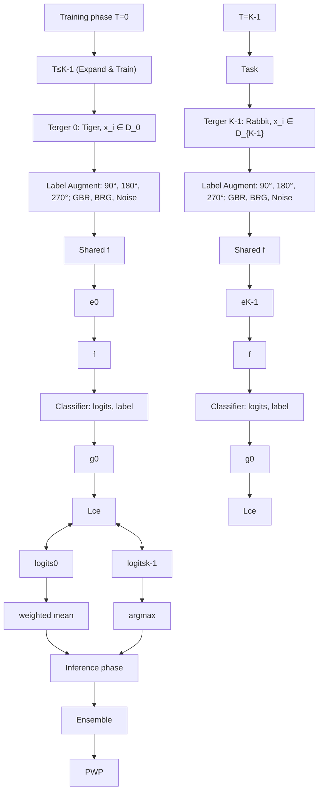

# Confusion-Driven Self-Supervised Progressively Weighted Ensemble Learning for Non-Exemplar Class Incremental Learning

Kai Hu

Xiangtan University

kaihu@xtu.edu.cn

Zhang Yu

Xiangtan University

202221633002@smail.xtu.edu.cn

Yuan Zhang∗

Xiangtan University

yuanz@xtu.edu.cn

Zhineng Chen

Fudan University

zhinchen@fudan.edu.cn

Xieping Gao

Hunan Normal University

xpgao@hunnu.edu.cn

# Abstract

Non-exemplar class incremental learning (NECIL) aims to continuously assimilate new knowledge while retaining previously acquired knowledge in scenarios where prior examples are unavailable. A prevalent strategy within NECIL mitigates knowledge forgetting by freezing the feature extractor after training on the initial task. However, this freezing mechanism does not provide explicit training to differentiate between new and old classes, resulting in overlapping feature representations. To address this challenge, we propose a Confusion-driven seLf-supervised prOgressiVely weighted Ensemble leaRning (CLOVER) framework for NECIL. Firstly, we introduce a confusion-driven self-supervised learning approach that enhances representation extraction by guiding the model to distinguish between highly confusable classes, thereby reducing class representation overlap. Secondly, we develop a progressively weighted ensemble learning method that gradually adjusts weights to integrate diverse knowledge more effectively, further minimizing representation overlap. Finally, extensive experiments demonstrate that our proposed method achieves state-of-the-art results on the CIFAR100, TinyImageNet, and ImageNet-Subset NECIL benchmarks. 2

# 1 Introduction

Over the past few decades, deep neural networks have exhibited remarkable performance in various domains [1, 2, 3, 4, 5]. Given that the real world is both open and dynamic, it is crucial for models to continuously acquire and integrate new knowledge. However, directly fine-tuning a model on new data often results in catastrophic forgetting [6], where the performance on previously encountered data deteriorates significantly. To address this challenge, several class incremental learning (CIL) methods [7, 8] store a subset of previous exemplars and replay them during the learning of new tasks to preserve prior knowledge. Nevertheless, due to privacy concerns and storage limitations, non-exemplar class incremental learning (NECIL) [9], which aims to continuously adapt to new classes while preventing forgetting previously learned ones without retaining earlier samples, has gained increasing attention from researchers.

Existing NECIL methods can be broadly classified into two categories: prototype-based methods and frozen feature extractor-based methods, based on their training paradigms. Prototype-based methods [9, 10, 11, 12] take advantage of the mean of class representations as prototypes to maintain decision boundaries during model fine-tuning for incremental tasks. These prototypes serve as substitutes for samples from previous classes, conveying distributional information that effectively mitigates catastrophic forgetting. However, as the model undergoes continuous updates, these approaches inevitably experience prototype degradation [12], wherein the preserved prototypes of old classes diverge from their true distributions. In contrast, frozen feature extractor-based methods [13, 14, 15] avoid degradation by freezing the feature extractor after training on the initial task, while maintaining the stability of representations and mitigating forgetting. Despite these advantages, a notable drawback of this method is its propensity to induce representation overlap between new and old classes. As the model is optimized solely for the initial class distribution, it lacks the necessary adaptability to incorporate new class data effectively. Consequently, representations of new classes often exhibit dispersed distributions or overlap with those of existing classes within a fixed representation space, particularly when similarities exist along certain dimensions. This phenomenon hinders the establishment of clear decision boundaries and significantly impairs classification performance in incremental learning tasks.

scatter

| Class       | Shape  | Count |
|-------------|--------|-------|
| Raw class   | Circle | 120   |
| Raw class   | Square | 120   |
| 90° class   | Diamond| 120   |
| 90° class   | Circle | 120   |
| 90° class   | Square | 120   |
| 180° class  | Square | 120   |
| 180° class  | Circle | 120   |
| 180° class  | Square | 120   |

(a) Representation distributions of raw and task-agnostic classes in SSL methods

scatter

| Class       | Shape  | Count |
|-------------|--------|-------|
| GBR class   | ▲      | ~100  |
| GBR class   | ◆      | ~80   |
| GBR class   | ◇      | ~60   |
| Noise class | ◆      | ~100  |
| Noise class | ◇      | ~80   |
| Noise class | ◊      | ~60   |
| Noise class | ◀      | ~40   |

(b) Representation distributions of raw and task-agnostic classes in CDSSL methods

line

| Incremental Phase | Ensemble(1 experts) | Ensemble(3 experts) | Ensemble(5 experts) | Ensemble(5 experts)+PWP |
| ----------------- | ------------------- | ------------------- | ------------------- | ----------------------- |
| 0                 | 80.0                | 80.0                | 80.0                | 80.0                    |
| 1                 | 77.5                | 77.0                | 76.0                | 77.5                    |
| 2                 | 76.5                | 75.5                | 74.0                | 76.0                    |
| 3                 | 75.0                | 74.0                | 72.5                | 74.5                    |
| 4                 | 73.5                | 72.5                | 71.0                | 72.5                    |
| 5                 | 72.0                | 71.0                | 70.0                | 71.0                    |
| 6                 | 70.5                | 69.5                | 69.0                | 69.5                    |
| 7                 | 69.0                | 68.0                | 68.5                | 68.5                    |
| 8                 | 67.5                | 66.5                | 67.0                | 67.0                    |
| 9                 | 66.0                | 65.0                | 66.5                | 66.5                    |
| 10                | 64.5                | 63.5                | 65.0                | 65.0                    |
| 11                | 63.0                | 62.0                | 63.5                | 63.5                    |
| 12                | 61.5                | 60.5                | 62.0                | 62.0                    |
| 13                | 60.0                | 59.0                | 60.5                | 60.5                    |
| 14                | 58.5                | 57.5                | 59.0                | 59.0                    |
| 15                | 57.0                | 56.0                | 57.5                | 57.5                    |
| 16                | 55.5                | 54.5                | 56.0                | 56.0                    |
| 17                | 54.0                | 53.0                | 54.5                | 54.5                    |
| 18                | 52.5                | 51.5                | 53.0                | 53.0                    |
| 19                | 51.0                | 50.0                | 51.5                | 51.5                    |
| 20                | 49.5                | 48.5                | 50.0                | 50.0                    |

(c) Accuracy variation of ensemble models with different numbers of experts   
Figure 1: (a) In self-supervised learning, substantial discrepancies exist in the representation distributions between raw classes and task-agnostic classes (sharing the same color but differing in shape). Training a model to differentiate between these classes does not effectively enhance its capability for representation extraction. (b) CDSSL introduces highly confusable task-agnostic classes, with GBR and noise classes generated through color channel swapping and noise injection, respectively. This approach aims to encourage the model to extract more discriminative representations. (c) The accuracy curves for the ensemble model with varying numbers of experts indicate that adding a new expert (during phases 1 and 3) consistently leads to performance degradation, which is effectively mitigated by the proposed PWP strategy.

There are currently two primary approaches to addressing representation overlap: self-supervised learning (SSL) and ensemble learning. SSL [9, 16, 17] is utilized in the initial task to train the feature extractor. SSL applies transformations to raw classes and assigns novel task-agnostic labels, thereby constructing task-agnostic classes. Subsequently, by encouraging the model to discriminate among these classes, SSL enhances the model’s generalization capability and effectively mitigates representation overlap and confusion [18]. However, most studies [9, 18, 19, 20, 21] integrate SSL with additional techniques aimed at improving representation extraction, thereby leaving much of SSL’s inherent potential largely untapped. As shown in Fig. 1(a), the rotation transformation employed in SSL significantly alters the representational distribution of raw classes, enabling the model to distinguish these classes more easily even without SSL. As a result, it fails to effectively enhance the model’s ability to extract discriminative representations. Conversely, ensemble learning [22, 23, 24] capitalizes on multiple expert models to extract discriminative representations for each class from diverse perspectives. This method effectively differentiates between new and old class representations while minimizing their overlap. Nonetheless, introducing a new expert can lead to performance degradation (see Fig. 1(c)). This issue stems from substantial heterogeneity in the predictive capabilities exhibited by the experts. The first expert, trained on the base task, exhibits stronger predictive capability and covers a broader range of classes than experts trained on incremental tasks. This makes the first expert more reliable in the early training stages, while later experts remain unreliable for a period after their introduction. Thus, a newly added expert, often with relatively limited predictive capability, can interfere with predictions made by more experienced experts.

To address the aforementioned challenges, we introduce a novel NECIL framework, named Confusiondriven seLf-supervised prOgressiVely weighted Ensemble leaRning (CLOVER). In this framework, we propose a Confusion-Driven Self-Supervised Learning (CDSSL) method that enhances the model’s capability for representation extraction by guiding it to differentiate between highly confusing classes generated through color channel swapping and noise inception transformations (see Fig. 1(b)). This approach effectively alleviates the issue of representation overlap between new and old classes. Furthermore, we introduce a Progressively Weighted Prediction (PWP) strategy aimed at mitigating the influence of unreliable experts within the ensemble model. Specifically, we assign an initially low weight to new experts and incrementally increase their weight task by task until it reaches a predetermined maximum value. The final prediction is then computed as a weighted sum of the predictions from all experts. In conclusion, our main contributions are summarized as follows:

• We propose a Confusion-driven seLf-supervised progressiVely weighted Ensemble leaRning framework named CLOVER for NECIL. This framework improves the model’s capability for representation extraction by learning task-agnostic classes and diverse ensemble predictions. These advancements strengthen the discriminative power for new classes, thereby mitigating the representation overlap with old classes.   
• We propose a confusion-driven self-supervised learning method that enhances the ability to extract discriminative representations by guiding it to differentiate between highly confusing task-agnostic classes generated through color channel swapping and noise injection. Furthermore, we introduce a progressively weighted prediction strategy that gradually increases the weight of new experts to mitigate performance degradation caused by unreliable new experts within the ensemble model.   
• Extensive experimental results on CIFAR100, TinyImageNet and ImageNet-Subset have demonstrated the superior performance of our proposed CLOVER over other NECIL approaches.

# 2 Related Work

# 2.1 Non-Exemplar Class Incremental Learning

In general, NECIL methods can be broadly categorized into prototype-based methods [9, 12] and frozen feature extractor-based methods [14, 15, 25].

Prototype-based methods investigate strategies for leveraging prototypes to deliver more accurate insights regarding prior tasks, thereby effectively mitigating the phenomenon of knowledge forgetting. For example, PASS [9] employed Gaussian noise to augment prototypes, providing distributional information of old classes within the representation space to maintain decision boundaries of previous tasks. SSRE [10] identified the primary challenge in NECIL as the overlap between the representations of new and old classes and addressed this issue through a prototype selection mechanism, which used prototypes to preserve prior knowledge while simultaneously facilitating the learning of new tasks. NAPA-VQ [11] learned the topological relationships of the feature space to identify confusable neighboring classes and used this information to generate representative prototypes for old classes, thereby facilitating the delineation of boundaries between new and old classes and reducing overlap. However, prototype-based methods inevitably suffer from representation shifts caused by the continual updates to the feature extractor. To address this issue, a variety of methods [12, 26, 27] have been proposed to alleviate representation shift by reconstructing the prototypes of previously learned classes, thereby enhancing the accuracy and effectiveness of the information they convey about the old class distributions. More recently, DCMI [28] proposed a novel generation method for synthesizing images with both semantic and domain consistency, which effectively facilitated knowledge retention.

On the other hand, frozen feature extractor-based methods keep the feature extractor fixed after training the initial task and continually update the classifier to incorporate new tasks. Prototypical networks [13] utilized frozen feature extractor to generate class prototypes, enabling classification by calculating the distances to the prototype representations of each class. FeTrIL [15] generated pseudo-features for old classes by applying a geometric shift to new class features based on the difference between new and old class prototypes, which enabled the joint training of the classification head with both new and old class features. FeCAM [14] emphasized the greater heterogeneity in the distribution of new classes compared to old ones and classified the features based on the anisotropic Mahalanobis distance to the prototypes after the first task. To bridge the significant distribution gap between the real and the recorded features, DiffFR [18] constructed diffusion models to generate features that closely resembled the real features and reconstructed them to enhance the robustness of the classifier.

# 2.2 Self-Supervised Learning

In recent years, self-supervised learning (SSL) has proven to be an effective approach for learning general representations from unlabeled data. This is accomplished through predefined proxy tasks, such as rotation prediction [16], patch permutation [29], image colorization [30], inpainting [31], and clustering [32]. These tasks help the model acquire task-agnostic features, enabling it to generalize across various downstream tasks like few-shot learning [33] and semi-supervised learning [34], to improve the model robustness [35], class imbalance [36], etc. Recently, SLA [17] demonstrated that SSL can enhance supervised classification performance by augmenting the original labels through input transformations.

In NECIL, PASS [9] employed rotation self-supervision to learn generalizable and transferable features for future tasks. SASS [19] introduced an auxiliary classifier after each ResNet block to perform self-supervised rotation classification, which facilitated the learning of more generalized representations and achieved a better stability-plasticity trade-off. HRFSN [20] used random positive samples to perform rotation prediction tasks, enabling the feature extractor to learn richer feature representations through complex rotation prediction tasks. DiffFR [18] integrated SSL with instance similarity constraints to train the feature extractor, reducing feature overlaps by applying class- and instance-level discrimination constraints. Our CDSSL is implemented in a manner similar to the SSL in PASS [9]. Building upon this, we guide the model to learn task-agnostic classes that are highly ambiguous, thereby facilitating the extraction of more discriminative representations.

# 2.3 Growing Architectures and Ensemble Leaning

Architecture-based methods [37, 38] design task-specific parameters to adapt to new tasks while maintaining performance on previous ones. Although these approaches substantially enhance performance, the linear increase in parameters as the number of tasks increases becomes unsustainable. Moreover, the effective integration of knowledge across tasks remains a significant challenge. To address these issues, CoSCL [23] proposed an ensemble composed of a limited number of experts and penalized the discrepancies in their feature representation predictions to promote cooperation. SEED [39] developed a selective training ensemble of experts to mitigate forgetting, while leveraging the diverse expertise of the specialists for joint prediction. However, the newly created experts in this method lead to a significant decline in performance, causing the combined predictive capability of the expert ensemble to be inferior to that of a single model. Therefore, this paper explores solutions to address this issue.

# 3 Method

In this section, we first define the Non-Exemplar Class Incremental Learning (NECIL) scenario. Then, we outline the training and inference process of the proposed CLOVER. Finally, we provide a detailed introduction of the proposed confusion-driven self-supervised learning (CDSSL) method and the progressively weighted prediction (PWP) strategy.

flowchart

Figure 2: Overview of our proposed CLOVER. For tasks $t \le K - 1$ , the classes of the current task are augmented to generate task-agnostic classes using transformations such as rotation, color channel swapping, and noise injection. A new expert $( f \circ e _ { t } )$ is subsequently introduced and trained on this combined set of classes to enhance representation extraction capabilities and mitigate representation overlap between new and old classes. During the inference phase, the input image is processed through the ensemble model to generate expert-specific logits. These logits are then combined using Eq. (2) to calculate the weighted mean logits, with the weights for each expert determined by the proposed $P W P$ strategy. Finally, the class prediction is obtained by performing the argmax operation on these logits.

# 3.1 Preliminaries

NECIL emphasizes the capability to sequentially acquire knowledge across a series of unrelated tasks without retaining or revisiting previously encountered examples. The training data for task $t \in \{ 0 , 1 , 2 , \ldots , T \}$ is defined as $D _ { t } = \{ X _ { t } , Y _ { t } \} = \{ x _ { t } ^ { i } , y _ { t } ^ { i } \} _ { i = 1 } ^ { N _ { t } }$ , where $N _ { t } , x _ { t } ^ { i }$ and $y _ { t } ^ { i } \in C _ { t }$ represent the number of training images, a training image and the corresponding label for task $t ,$ respectively. Here, $C _ { t }$ is the set of classes associated with task t, and the class sets for each task are disjoint, i.e., $C _ { 0 } \cap C _ { 1 } \cap \cdot \cdot \cdot \cap C _ { T } = \emptyset$ . The model is evaluated on the combined test sets $Z _ { 0 \sim t } = Z _ { 0 } \cup Z _ { 1 } \cup \cdot \cdot \cdot \cup Z _ { t }$ , with the objective of accurately predicting both the classes of a new task and those of previously learned tasks, where $C _ { 0 \sim t } = \dot { C _ { 0 } } \dot { \cup } C _ { 1 } \cup \cdots \cup C _ { t }$ .

# 3.2 Overall Framework

As illustrated in Fig. 2, CLOVER is an ensemble model comprising K experts, including a shared encoder f, K expert encoders $e _ { i }$ and their corresponding linear classifier $g _ { i } \ ( i = 0 , 1 , \ldots , K - 1 )$ Notably, f is frozen after training the first task. For task $t \le K - 1$ , CDSSL is employed to train the expert t corresponding to task. After training, we freeze $e _ { t }$ and discard $g _ { t }$ . Next, each existing expert $k \leq t$ computes the representation of class $c \in C _ { t }$ and models it using a distinct Gaussian distribution $G ( \mu _ { k } ^ { c } , \Sigma _ { k } ^ { c } )$ ), which is preserved and employed for classification in a manner similar to that of a prototype.

The inference process is similar to that of SEED [39]. The input x is passed through each expert to obtain the expert-specific representation $r _ { k } = e _ { k } ( f ( x ) )$ ). We then compute the log-likelihood of $r _ { k }$ with respect to the distribution of each class within that expert:

$$
l _ {k} ^ {c} (x) = - \frac {1}{2} [ \ln (| \sum_ {k} ^ {c} |) + S \ln (2 \pi) + (r _ {k} - \mu_ {k} ^ {c}) ^ {T} (\sum_ {k} ^ {c}) ^ {- 1} (r _ {k} - \mu_ {k} ^ {c}) ], \tag {1}
$$

where S is the representation dimension. It is worth noting that, since the new expert $h$ (where $h > 0 )$ does not have access to data from previous classes and cannot compute their representation distributions, we set $l _ { h } ^ { i } ( x ) = - \infty$ for $i \in C _ { 0 \sim h - 1 }$ to indicate that predictions for these previous classes asoftmax sequently, we apply the softmax function to these values  to obtain the predicted probabilities for each class w $\overline { { l _ { k } ^ { 1 } } } , \overline { { l _ { k } ^ { 2 } } } , \dots , \overline { { l _ { k } ^ { | C | } } } =$ l|C| $( l _ { k } ^ { 1 } , l _ { k } ^ { 2 } , \dots , l _ { k } ^ { | C | } ; \tau )$ where C is the set of all classes and τ represents the temperature. Finally, we calculate the weighted sum of the predicted probabilities from all experts by:

$$
\bar {l} (x) = \left\{\sum_ {k = 0} ^ {M _ {i} - 1} \tilde {w} _ {k} \times \overline {{l _ {k} ^ {i}}} \right\} _ {i = 1} ^ {| C |}, \tag {2}
$$

where w˜k = $\begin{array} { r } { \tilde { w } _ { k } \ = \ \frac { w _ { k } } { M _ { i } - 1 } } \\ { \ \sum _ { j = 0 } ^ { \infty } w _ { j } \ } \end{array}$ and $M _ { i } \ ( i = 1 , 2 , \ldots , | C | )$ represents the number of experts capable of

predicting class i (since each expert only retains the distributions of subsequent classes and performs predictions after completing its training). wk denotes the prediction weight calculated using the PWP method. Finally, class $c = a r g m a x ( \bar { l } ( x ) )$ ) with the highest probability is selected as the final prediction.

# 3.3 Confusion-Driven Self-Supervised Learning

Considering a single expert, the feature extractor remains fixed following the initial training phase, and the distributions of the newly introduced classes are directly derived from the mapping of the frozen feature extractor. However, the absence of discriminative training between new and old classes increases the likelihood of confusion, causing the model to forget previous knowledge. To reduce the overlap of representations, we investigate the training methodology of feature extractor and propose the CDSSL strategy. This strategy focuses on training the model to differentiate between highly confusable task-agnostic classes, thereby enhancing its representation learning capabilities and reducing the overlap between representations of new and old classes.

Specifically, as illustrated in Fig. 2, we apply several transformations to the given image $x _ { i } \in D _ { k }$ , including rotation, color channel swapping, and noise inception:

$$
\widetilde {x} _ {7 i + j} = \left\{ \begin{array}{c c} x _ {i}, & j = 0 \\ r a t a t e (x _ {i}, j \times 9 0 ^ {\circ}), & j \leq 3 \\ G B R (x _ {i}), & j = 4 \\ B R G (x _ {i}), & j = 5 \\ x _ {i} + s \times n o i s e (0, 1), & j = 6 \end{array} \right. \tag {3}
$$

and assign new label $\widetilde { y } _ { 7 i + j } ~ = ~ 7 y _ { i } + j$ , where $r a t a t e ( x _ { i } , )$ refers to rotate $x _ { i }$ by $9 0 °$ , $1 8 0 ^ { \circ }$ , $2 7 0 ^ { \circ } . ~ G { \bf \breve { B } } R ( \cdot )$ and $B R G ( \cdot )$ indicate swapping RGB channels to GBR and $B R G ,$ , respectively. $n o i s e ( 0 , 1 )$ represents a value randomly sampled from a standard normal distribution. s denotes the noise intensity, which is typically set to 0.5. It generalizes the original N-way classification problem to a 7N-way classification problem. Next, we use cross-entropy loss to train the model:

$$
L = L _ {c e} (g _ {i} (e _ {i} (f (\widetilde {x}))), \widetilde {y}). \tag {4}
$$

Comparing the widely used 4N-way self-supervised tasks, as demonstated in [9, 18], we generated new classes with higher levels of confusion by employing color channel swapping and noise inception. Thus, our proposed CDSSL encourages the model to learn more distinctive features, enabling it to more effectively differentiate between representations of new and old classes and thereby reducing their overlap. It is noteworthy that these task-agnostic classes are excluded during the inference phase and that their representation distributions across experts are neither computed nor stored.

# 3.4 Progressively Weighted Prediction

In NECIL, the base task typically constitutes half of the training data, with the remainder evenly distributed across incremental tasks. Consequently, due to the varying creation times of experts, the distributions of classes they cover differ significantly. Typically, newer experts encompass a narrower range of predictable classes. When such an expert encounters an old class outside its prediction scope, it often misclassifies it with high confidence. As shown in Fig. 1(c), such errors can mislead the equally weighted joint prediction system, ultimately resulting in inferior performance of the ensemble model compared to that of the individual models.

Therefore, considering that the number of predictable classes and the predictive ability vary across experts, we propose the progressively weighted prediction method. Specifically, we assign a low weight α to the new expert and progressively increase it by $\beta ,$ with the maximum weight being $\textstyle { \frac { 1 } { K } }$ .

Thus, the weight of each expert is defined as:

$$
w _ {i} = \left\{ \begin{array}{c l} 1 - \sum_ {j = 1} ^ {K - 1} w _ {j}, & i = 0 \\ \min \{\alpha + \beta \times (t - i), \frac {1}{K} \}, & i > 0 \end{array} \right. \tag {5}
$$

where t denotes the current task. As shown in Eq. (2), a weighted average of the predictions from each expert is then computed to derive the final outcome during joint prediction. In general, PWP accounts for the varying predictive capabilities of each expert by assigning distinct weights, thereby enhancing the joint prediction performance of the ensemble model in the early phase.

Table 1: Comparisons of the average accuracy and last accuracy (%) at different settings on CIFAR100, TinyImageNet, and ImageNet-Subset. CEAT [40] and FGKSR [41] are based on the ViT [42] structure, while all other methods are based on ResNet18 [43]. The result of SEED [39] is obtained using the author’s official codebase, denoted by the asterisk (\*). The best result is highlighted in bold, whereas the second-best method is indicated by underlining. 

<table><tr><td rowspan="3">Method</td><td colspan="6">CIFAR100</td><td colspan="6">TinyImageNet</td><td colspan="6">ImageNet-Subset</td></tr><tr><td colspan="2">5 tasks</td><td colspan="2">10 tasks</td><td colspan="2">20 tasks</td><td colspan="2">5 tasks</td><td colspan="2">10 tasks</td><td colspan="2">20 tasks</td><td colspan="2">5 tasks</td><td colspan="2">10 tasks</td><td colspan="2">20 tasks</td></tr><tr><td>Avg</td><td>Last</td><td>Avg</td><td>Last</td><td>Avg</td><td>Last</td><td>Avg</td><td>Last</td><td>Avg</td><td>Last</td><td>Avg</td><td>Last</td><td>Avg</td><td>Last</td><td>Avg</td><td>Last</td><td>Avg</td><td>Last</td></tr><tr><td>LwF_MC [44]</td><td>45.9</td><td>36.1</td><td>27.4</td><td>17.0</td><td>20.1</td><td>15.9</td><td>29.1</td><td>17.1</td><td>23.1</td><td>12.3</td><td>17.4</td><td>8.8</td><td>34.9</td><td>24.1</td><td>31.2</td><td>20.0</td><td>27.5</td><td>17.4</td></tr><tr><td>PASS [9]</td><td>63.5</td><td>55.7</td><td>61.8</td><td>49.0</td><td>58.1</td><td>48.5</td><td>49.6</td><td>41.6</td><td>47.3</td><td>39.9</td><td>42.1</td><td>32.8</td><td>63.1</td><td>52.6</td><td>61.8</td><td>50.4</td><td>55.2</td><td>46.1</td></tr><tr><td>SSRE [10]</td><td>65.9</td><td>56.3</td><td>65.0</td><td>55.0</td><td>61.7</td><td>50.5</td><td>50.4</td><td>41.7</td><td>48.9</td><td>39.9</td><td>48.2</td><td>39.8</td><td>69.5</td><td>58.5</td><td>67.7</td><td>57.5</td><td>61.2</td><td>50.1</td></tr><tr><td>FeTrIL [15]</td><td>66.3</td><td>-</td><td>65.2</td><td>56.3</td><td>61.5</td><td>-</td><td>54.8</td><td>-</td><td>53.1</td><td>-</td><td>52.2</td><td>-</td><td>72.2</td><td>-</td><td>71.2</td><td>-</td><td>67.1</td><td>-</td></tr><tr><td>PRAKA [12]</td><td>70.0</td><td>61.6</td><td>68.9</td><td>60.4</td><td>65.9</td><td>56.2</td><td>53.3</td><td>46.4</td><td>52.6</td><td>45.2</td><td>49.8</td><td>40.6</td><td>-</td><td>-</td><td>69.0</td><td>61.3</td><td>-</td><td>-</td></tr><tr><td>POLO [26]</td><td>69.0</td><td>-</td><td>68.0</td><td>-</td><td>65.7</td><td>-</td><td>54.9</td><td>47.0</td><td>53.4</td><td>45.3</td><td>49.9</td><td>40.4</td><td>70.8</td><td>59.5</td><td>69.1</td><td>57.9</td><td>-</td><td>-</td></tr><tr><td>TASS [45]</td><td>68.8</td><td>59.3</td><td>67.4</td><td>57.9</td><td>62.8</td><td>53.8</td><td>55.1</td><td>44.1</td><td>54.2</td><td>43.9</td><td>52.8</td><td>43.6</td><td>74.3</td><td>63.1</td><td>72.6</td><td>57.9</td><td>68.8</td><td>57.6</td></tr><tr><td>FGKSR [41]</td><td>68.2</td><td>59.0</td><td>70.1</td><td>57.9</td><td>66.9</td><td>54.3</td><td>54.9</td><td>45.0</td><td>52.7</td><td>43.4</td><td>51.7</td><td>41.9</td><td>-</td><td>-</td><td>70.2</td><td>61.4</td><td>-</td><td>-</td></tr><tr><td>CEAT [40]</td><td>71.1</td><td>-</td><td>70.0</td><td>-</td><td>66.1</td><td>-</td><td>58.3</td><td>50.4</td><td>57.4</td><td>49.4</td><td>56.8</td><td>48.0</td><td>76.9</td><td>67.4</td><td>75.9</td><td>66.3</td><td>71.5</td><td>60.1</td></tr><tr><td>SEED* [39]</td><td>71.1</td><td>66.3</td><td>69.9</td><td>65.0</td><td>68.2</td><td>61.4</td><td>54.7</td><td>50.6</td><td>54.5</td><td>50.0</td><td>53.9</td><td>48.9</td><td>75.0</td><td>70.3</td><td>73.6</td><td>68.4</td><td>71.1</td><td>63.8</td></tr><tr><td>FeCAM [14]</td><td>70.9</td><td>62.1</td><td>70.8</td><td>62.1</td><td>69.4</td><td>58.5</td><td>59.6</td><td>52.8</td><td>59.4</td><td>52.8</td><td>59.3</td><td>52.8</td><td>78.3</td><td>70.9</td><td>78.2</td><td>70.9</td><td>75.1</td><td>66.3</td></tr><tr><td>CLOVER (Ours)</td><td>72.7</td><td>68.0</td><td>72.3</td><td>67.5</td><td>71.0</td><td>64.9</td><td>60.2</td><td>56.0</td><td>59.9</td><td>54.1</td><td>58.5</td><td>52.8</td><td>77.8</td><td>73.2</td><td>77.1</td><td>71.5</td><td>74.5</td><td>67.5</td></tr></table>

  
Figure 3: Illustration of the classification accuracy changes as tasks are being learned on CIFAR100 and TinyImageNet, which contains the complete curves. Precise data of our method is presented in Appendix B.

# 4 Experiments

# 4.1 Experimental Setup

Datasets. We conduct extensive experiments on three benchmark NECIL datasets: CIFAR100 [46], TinyImageNet [47], and ImageNet-Subset [48]. The CIFAR100 dataset comprises 100 classes, each with 600 color images at a resolution of 32×32 pixels, including 500 images for training and 100 images for testing. TinyImageNet is a subset of the ImageNet [48] designed for image classification, consisting of 200 classes, with each class containing 500 training images, 50 validation images, and 50 test images, all sized at 64×64 pixels. The ImageNet-Subset dataset, comprising 100 classes selected from ImageNet, contains about 13,000 training images and 50 test images per class, all standardized to a resolution of 224×224 pixels. We follow the configuration from PASS [9] and divide each dataset into three incremental settings: 5, 10, and 20 tasks.

Table 2: Ablation study of each component of CLOVER on CIFAR100 and TinyImageNet. The reported metric is average accuracy (%). 

<table><tr><td colspan="3">Component</td><td colspan="3">CIFAR100</td><td colspan="3">TinyImageNet</td></tr><tr><td>Baseline</td><td>CDSSL</td><td>PWP</td><td>5</td><td>10</td><td>20</td><td>5</td><td>10</td><td>20</td></tr><tr><td>✓</td><td></td><td></td><td>69.9</td><td>69.7</td><td>67.7</td><td>56.3</td><td>55.3</td><td>54.5</td></tr><tr><td>✓</td><td>✓</td><td></td><td>72.1</td><td>71.7</td><td>70.5</td><td>59.9</td><td>59.4</td><td>58.1</td></tr><tr><td>✓</td><td></td><td>✓</td><td>70.5</td><td>70.2</td><td>68.2</td><td>56.5</td><td>55.8</td><td>54.9</td></tr><tr><td>✓</td><td>✓</td><td>✓</td><td>72.7</td><td>72.3</td><td>71.0</td><td>60.2</td><td>59.9</td><td>58.5</td></tr></table>

Evaluation Metrics. We report two common metrics for CIL: the average accuracy and last accuracy. The former evaluates overall performance during incremental learning by calculating the average accuracy across all incremental phases. The latter assesses comprehensive performance upon completion of all tasks, emphasizing its validity in mitigating forgetting and integrating knowledge.

Implementation Details and Reproducibility. We use ResNet18 [43] as the backbone (same as SEED [39]). During the training phase, a linear classification head is employed, while a Bayesian classifier is used in the inference phase. The number of experts K is set to 5. During training, the batch size is set to 128 and the model is optimized by the SGD optimizer with an initial learning rate 0.1 and weight decay 1e-4. The learning rate is multiplied by 0.1 at epochs 60, 120 and 160. All experiments are repeated three times and the average results are reported. The baseline is based on SEED [39], trained on the first 5 tasks, and shares the parameters of the first 5 layers across all expert models. Based on the aforementioned settings, all algorithms can be trained on a single NVIDIA A100 GPU.

# 4.2 Benchmark Comparison

Table 1 compares CLOVER with state-of-the-art NECIL methods on the CIFAR100, TinyImageNet, and ImageNet-Subset datasets. On CIFAR100, our CLOVER significantly outperforms the stateof-the-art methods across 5, 10, and 20 tasks, achieving higher average accuracy of 1.6%, 1.5%, and 1.6%, as well as improved last accuracy of 1.7%, 2.5%, and 3.5%, respectively. For 5 and 10 tasks on TinyImageNet, CLOVER exhibits superior average and last accuracy compared to the leading competing method. However, when the number of tasks increases to 20, FeCAM achieves better average accuracy. A similar trend is observed across all configurations on the ImageNet-Subset. Nonetheless, CLOVER achieves the highest last accuracy among all methods evaluated, underscoring its effectiveness in mitigating catastrophic forgetting while maintaining an optimal balance between plasticity and stability. Fig. 3 presents the accuracy variation curves on CIFAR100 and TinyImageNet. Although CLOVER shows comparatively lower performance in early tasks, it consistently outperforms other methods in last accuracy across all task settings on all three datasets. This demonstrates CLOVER’s superior ability to preserve knowledge during incremental training, establishing it as a highly competitive method even in long task settings.

# 4.3 Ablation Study

Ablation Study of Different Components. As presented in Table 2, we conduct ablation studies on CIFAR100 and TinyImageNet across the all settings (5, 10 and 20 tasks). The results indicate that CDSSL is a critical component, contributing to performance gains of 2.2%, 2.0% and 2.8% on CIFAR100, as well as 3.6%, 4.1%, 3.6% on the TinyImageNet. Furthermore, incorporating PWP yields an additional performance enhancement of approximately 0.5%. PWP complements CDSSL by improving the collaborative inference ability of the multi-expert model, thereby offsetting imbalances between experts and enhancing the model’s overall complementarity. Collectively, our method achieves overall improvements range from 2–3% on CIFAR100 and 3–5% on TinyImageNet compared to the baseline. Moreover, CDSSL exhibits significant performance advantages in longer task sequences, highlighting the effectiveness of our approach in mitigating catastrophic forgetting.

Ablation Study of CDSSL. To verify the effectiveness of each transformation in CDSSL, an ablation experiment is conducted on CIFAR100 and TinyImageNet in Table 3. The incorporation of rotation transformations yields average accuracy improvements of 0.8%, 1.1%, and 1.5% on CIFAR100, and 0.9%, 0.6%, and 0.4% on TinyImageNet, reflecting the performance gains achieved through rotationbased SSL methods commonly employed in existing studies. However, as illustrated in Fig. 1(a), the rotational transformation significantly alters the distribution of class representations, making it difficult for the model to learn highly discriminative features from such a simple task. To address this limitation, we propose an extension to the rotation-based SSL method by incorporating color channel swapping and noise inception transformations within our CDSSL. This strategy generates new classes that closely resemble their original counterparts, allowing the model to improve its representation learning by distinguishing between these highly similar classes. Specifically, the integration of color channel swapping resulted in additional average accuracy gains of 0.9%, 0.5%, and 0.9% on CIFAR100, alongside improvements of 2.0%, 2.4%, and 2.3% on TinyImageNet. Moreover, further incorporating noise inception transformations contributed an additional performance boost of at least 0.4%. Overall, we demonstrate both the effectiveness and necessity of each transformation employed in CDSSL while highlighting its substantial superiority over conventional SSL methods.

Table 3: Ablation study of each transformation in the CDSSL on the CIFAR100 and TinyImageNet. Each transformation is applied independently without combinations or overlaps. The reported metric is average accuracy (%). 

<table><tr><td colspan="4">Method</td><td colspan="3">CIFAR100</td><td colspan="3">TinyImageNet</td></tr><tr><td>Baseline</td><td>Rot</td><td>Color</td><td>Noise</td><td>5</td><td>10</td><td>20</td><td>5</td><td>10</td><td>20</td></tr><tr><td>√</td><td></td><td></td><td></td><td>69.9</td><td>69.7</td><td>67.7</td><td>56.3</td><td>55.3</td><td>54.5</td></tr><tr><td>√</td><td>√</td><td></td><td></td><td>70.7</td><td>70.8</td><td>69.2</td><td>57.2</td><td>55.9</td><td>54.9</td></tr><tr><td>√</td><td></td><td>√</td><td></td><td>70.5</td><td>70.0</td><td>68.3</td><td>56.4</td><td>55.3</td><td>54.6</td></tr><tr><td>√</td><td></td><td></td><td>√</td><td>70.3</td><td>69.9</td><td>68.1</td><td>56.4</td><td>55.4</td><td>54.6</td></tr><tr><td>√</td><td>√</td><td>√</td><td></td><td>71.6</td><td>71.3</td><td>70.1</td><td>59.2</td><td>58.3</td><td>57.2</td></tr><tr><td>√</td><td>√</td><td></td><td>√</td><td>71.8</td><td>71.3</td><td>70.1</td><td>59.3</td><td>58.0</td><td>57.0</td></tr><tr><td>√</td><td></td><td>√</td><td>√</td><td>71.1</td><td>70.3</td><td>68.5</td><td>56.7</td><td>55.6</td><td>55.0</td></tr><tr><td>√</td><td>√</td><td>√</td><td>√</td><td>72.1</td><td>71.7</td><td>70.5</td><td>59.9</td><td>59.4</td><td>58.1</td></tr></table>

  
Figure 4: Accuracy of first/new task at each phase. The first row illustrates the variation in classification accuracy for the first task throughout the training process. The second row presents the classification accuracy of new tasks at various stages of training. Our CDSSL method enables more effective learning of new tasks while minimizing the impact on existing knowledge.

# 4.4 Representation Quality and Generalization Performance Comparison with SSL

In Fig. 4, we compare the effects of CDSSL, SSL, and baseline on the accuracy of the first task and new tasks during incremental training. The results indicate that CDSSL outperforms the other methods, significantly improving the accuracy of the first task while maintaining high performance for new tasks. In contrast, although SSL also achieves comparable results, its performance is markedly inferior to that of CDSSL. These findings suggest that CDSSL offers superior representational capabilities in incremental learning tasks compared to SSL, facilitating more effective category differentiation and is more suitable for NECIL.

# 4.5 Visualization

Fig. 5 shows a t-SNE visualization [49] of the dynamic changes in the representation space of the first expert during the early stages of training on CIFAR100. Specifically, we visualize the feature representations of visible classes at two distinct time points: 1) after training on 50 classes and adding 2 new classes, and 2) after training on 50 classes and adding 4 new classes. The introduction of 2 new classes leads to a slight overlap between the representation distributions of new and old classes within the Baseline. As more new classes are introduced, SSL struggles to effectively reduce the overlap between new and old classes, whereas CDSSL maintains a clear separation. Furthermore, CDSSL enhances the cohesion within each class’s distribution, indicating that the model has acquired more representative and discriminative features. This improvement reflects an enhanced capability for feature extraction, which is essential for addressing inter-class overlap.

scatter

| Incremental phase | Baseline | Baseline+SSL | Baseline+CDSSL |
| ----------------- | -------- | ------------ | -------------- |
| 1                 | 2        | 3            | 51             |
| 1                 | 3        | 4            | 52             |
| 1                 | 4        | 5            | 53             |
| 1                 | 5        | 6            | 54             |

Figure 5: The visualization illustrates the distribution of class representations following the application of SSL and CDSSL, respectively. Initially, the model was trained on the first task containing 50 classes (denoted by circles). Subsequently, new classes (denoted by triangles) were incrementally introduced at each step, with the progression depicted from top to bottom.

# 5 Conclusion

In this paper, we develop CLOVER, an innovative framework for NECIL that aims to minimize the overlap between new and old classes within the representation space. Within this framework, we propose a CDSSL approach that not only employs rotation transformations commonly utilized in traditional self-supervised learning methods but also generates highly confusable task-agnostic classes through color channel swapping and noise injection. The model is subsequently trained to differentiate these classes, significantly enhancing its feature extraction capabilities and thereby mitigating the overlap between representations of new and old classes. Furthermore, we introduce an ensemble model to improve the discrimination of unknown classes and then present a progressively weighted prediction strategy to address interference caused by newly introduced experts within the ensemble model. The quantitative and qualitative results on three widely used datasets have demonstrated that our method achieves state-of-the-art performance, particularly excelling in improving last accuracy. It is worth noting that both plasticity and stability are crucial in NECIL, and thus, developing a method that can enhance both simultaneously is of substantial value. The proposed CDSSL introduces confusing classes to increase the training difficulty, thereby improving the model’s discriminative capability between representations of new and old classes. This enables the model to maintain strong performance across both unknown and previously learned classes. Such an approach by enhancing training difficulty through the introduction of confusing classes offers an effective and promising direction for advancing non-exemplar class-incremental learning, and it holds potential for further extension to more complex or large-scale incremental learning scenarios in future research.

# Acknowledgments

This work was supported in part by the National Natural Science Foundation of China under Grants 62372170, 62272404, and 62502419, in part by the Natural Science Foundation of Hunan Province of China under Grant 2023JJ40638, and in part by the Research Foundation of Education Department of Hunan Province of China under Grant 23A0146.

# References

[1] Kai Hu, Ye Xiao, Yuan Zhang, and Xieping Gao. Multi-view masked contrastive representation learning for endoscopic video analysis. Advances in Neural Information Processing Systems, 37:47987–48014, 2024.   
[2] Jianqing Xu, Shen Li, Jiaying Wu, Miao Xiong, Ailin Deng, Jiazhen Ji, Yuge Huang, Guodong Mu, Wenjie Feng, Shouhong Ding, et al. ID3: Identity-preserving-yet-diversified diffusion models for synthetic face recognition. Advances in Neural Information Processing Systems, 37:77777–77798, 2024.   
[3] Yuan He, Moy Yuan, Jiaoyan Chen, and Ian Horrocks. Language models as hierarchy encoders. Advances in Neural Information Processing Systems, 37:14690–14711, 2024.   
[4] Kai Hu, Jinhao Li, Yuan Zhang, Xiongjun Ye, and Xieping Gao. One-to-multiple: A progressive style transfer unsupervised domain-adaptive framework for kidney tumor segmentation. Advances in Neural Information Processing Systems, 37:24496–24522, 2024.   
[5] Yupeng Zhou, Daquan Zhou, Ming-Ming Cheng, Jiashi Feng, and Qibin Hou. Storydiffusion: Consistent self-attention for long-range image and video generation. Advances in Neural Information Processing Systems, 37:110315–110340, 2024.   
[6] Michael McCloskey and Neal J Cohen. Catastrophic interference in connectionist networks: The sequential learning problem. In Psychology of Learning and Motivation, volume 24, pages 109–165. Elsevier, 1989.   
[7] Sylvestre-Alvise Rebuffi, Alexander Kolesnikov, Georg Sperl, and Christoph H Lampert. icarl: Incremental classifier and representation learning. In Proceedings of the IEEE/CVF Conference on Computer Vision and Pattern Recognition, pages 2001–2010, 2017.   
[8] Pietro Buzzega, Matteo Boschini, Angelo Porrello, Davide Abati, and Simone Calderara. Dark experience for general continual learning: a strong, simple baseline. Advances in Neural Information Processing Systems, 33:15920–15930, 2020.   
[9] Fei Zhu, Xu-Yao Zhang, Chuang Wang, Fei Yin, and Cheng-Lin Liu. Prototype augmentation and self-supervision for incremental learning. In Proceedings of the IEEE/CVF Conference on Computer Vision and Pattern Recognition, pages 5871–5880, 2021.   
[10] Kai Zhu, Wei Zhai, Yang Cao, Jiebo Luo, and Zheng-Jun Zha. Self-sustaining representation expansion for non-exemplar class-incremental learning. In Proceedings of the IEEE/CVF Conference on Computer Vision and Pattern Recognition, pages 9296–9305, 2022.   
[11] Tamasha Malepathirana, Damith Senanayake, and Saman Halgamuge. Napa-vq: Neighborhoodaware prototype augmentation with vector quantization for continual learning. In Proceedings of the IEEE/CVF International Conference on Computer Vision, pages 11674–11684, 2023.   
[12] Wuxuan Shi and Mang Ye. Prototype reminiscence and augmented asymmetric knowledge aggregation for non-exemplar class-incremental learning. In Proceedings of the IEEE/CVF International Conference on Computer Vision, pages 1772–1781, 2023.   
[13] Jake Snell, Kevin Swersky, and Richard Zemel. Prototypical networks for few-shot learning. Advances in Neural Information Processing Systems, 30, 2017.   
[14] Dipam Goswami, Yuyang Liu, Bartłomiej Twardowski, and Joost Van De Weijer. Fecam: Exploiting the heterogeneity of class distributions in exemplar-free continual learning. Advances in Neural Information Processing Systems, 36:6582–6595, 2023.

[15] Grégoire Petit, Adrian Popescu, Hugo Schindler, David Picard, and Bertrand Delezoide. Fetril: Feature translation for exemplar-free class-incremental learning. In Proceedings of the IEEE/CVF Winter Conference on Applications of Computer Vision, pages 3911–3920, 2023.   
[16] Spyros Gidaris, Praveer Singh, and Nikos Komodakis. Unsupervised representation learning by predicting image rotations. International Conference on Learning Representations, 2018.   
[17] Hankook Lee, Sung Ju Hwang, and Jinwoo Shin. Self-supervised label augmentation via input transformations. In International Conference on Machine Learning, pages 5714–5724. PMLR, 2020.   
[18] Jichuan Zhang, Yali Li, Xin Liu, and Shengjin Wang. Diffusion model meets non-exemplar class-incremental learning and beyond. arXiv preprint arXiv:2408.02983, 2024.   
[19] Zhiling Fu, Zhe Wang, Xinlei Xu, Mengping Yang, Ziqiu Chi, and Weichao Ding. Semantic alignment with self-supervision for class incremental learning. Knowledge-Based Systems, 282:111114, 2023.   
[20] Wenyi Feng, Zhe Wang, Qian Zhang, Jiayi Gong, Xinlei Xu, and Zhilin Fu. Hybrid rotation self-supervision and feature space normalization for class incremental learning. Information Sciences, 691:121618, 2025.   
[21] Jayateja Kalla and Soma Biswas. S3c: Self-supervised stochastic classifiers for few-shot class-incremental learning. In European Conference on Computer Vision, pages 432–448, 2022.   
[22] Balaji Lakshminarayanan, Alexander Pritzel, and Charles Blundell. Simple and scalable predictive uncertainty estimation using deep ensembles. Advances in Neural Information Processing Systems, 30, 2017.   
[23] Liyuan Wang, Xingxing Zhang, Qian Li, Jun Zhu, and Yi Zhong. Coscl: Cooperation of small continual learners is stronger than a big one. In European Conference on Computer Vision, pages 254–271, 2022.   
[24] Da-Wei Zhou, Hai-Long Sun, Han-Jia Ye, and De-Chuan Zhan. Expandable subspace ensemble for pre-trained model-based class-incremental learning. In Proceedings of the IEEE/CVF Conference on Computer Vision and Pattern Recognition, pages 23554–23564, 2024.   
[25] Kai Hu, Yunjiang Wang, Yuan Zhang, and Xieping Gao. Progressive learning strategy for few-shot class-incremental learning. IEEE Transactions on Cybernetics, pages 1210–1223, 2025.   
[26] Shaokun Wang, Weiwei Shi, Yuhang He, Yifan Yu, and Yihong Gong. Non-exemplar classincremental learning via adaptive old class reconstruction. In ACM International Conference on Multimedia, pages 4524–4534, 2023.   
[27] Qiwei Li, Yuxin Peng, and Jiahuan Zhou. Fcs: Feature calibration and separation for nonexemplar class incremental learning. In Proceedings of the IEEE/CVF Conference on Computer Vision and Pattern Recognition, pages 28495–28504, 2024.   
[28] Zihuan Qiu, Yi Xu, Fanman Meng, Hongliang Li, Linfeng Xu, and Qingbo Wu. Dualconsistency model inversion for non-exemplar class incremental learning. In Proceedings of the IEEE/CVF Conference on Computer Vision and Pattern Recognition, pages 24025–24035, 2024.   
[29] Mehdi Noroozi and Paolo Favaro. Unsupervised learning of visual representations by solving jigsaw puzzles. In European Conference on Computer Vision, pages 69–84, 2016.   
[30] Gustav Larsson, Michael Maire, and Gregory Shakhnarovich. Learning representations for automatic colorization. In European Conference on Computer Vision, pages 577–593, 2016.   
[31] Deepak Pathak, Philipp Krahenbuhl, Jeff Donahue, Trevor Darrell, and Alexei A Efros. Context encoders: Feature learning by inpainting. In Proceedings of the IEEE/CVF Conference on Computer Vision and Pattern Recognition, pages 2536–2544, 2016.

[32] Mathilde Caron, Piotr Bojanowski, Armand Joulin, and Matthijs Douze. Deep clustering for unsupervised learning of visual features. In European Conference on Computer Vision, pages 132–149, 2018.   
[33] Spyros Gidaris, Andrei Bursuc, Nikos Komodakis, Patrick Pérez, and Matthieu Cord. Boosting few-shot visual learning with self-supervision. In Proceedings of the IEEE/CVF International Conference on Computer Vision, pages 8059–8068, 2019.   
[34] Xiaohua Zhai, Avital Oliver, Alexander Kolesnikov, and Lucas Beyer. S4l: Self-supervised semisupervised learning. In Proceedings of the IEEE/CVF International Conference on Computer Vision, pages 1476–1485, 2019.   
[35] Dan Hendrycks, Mantas Mazeika, Saurav Kadavath, and Dawn Song. Using self-supervised learning can improve model robustness and uncertainty. Advances in Neural Information Processing Systems, 32, 2019.   
[36] Yuzhe Yang and Zhi Xu. Rethinking the value of labels for improving class-imbalanced learning. Advances in Neural Information Processing Systems, 33:19290–19301, 2020.   
[37] Shipeng Yan, Jiangwei Xie, and Xuming He. Der: Dynamically expandable representation for class incremental learning. In Proceedings of the IEEE/CVF Conference on Computer Vision and Pattern Recognition, pages 3014–3023, 2021.   
[38] Arthur Douillard, Alexandre Ramé, Guillaume Couairon, and Matthieu Cord. Dytox: Transformers for continual learning with dynamic token expansion. In Proceedings of the IEEE/CVF Conference on Computer Vision and Pattern Recognition, pages 9285–9295, 2022.   
[39] Grzegorz Rypes´c, Sebastian Cygert, Valeriya Khan, Tomasz Trzci ´ nski, Bartosz Zieli ´ nski, and ´ Bartłomiej Twardowski. Divide and not forget: Ensemble of selectively trained experts in continual learning. International Conference on Learning Representations, 2024.   
[40] Songlin Dong, Xinyuan Gao, Yuhang He, Zhengdong Zhou, Alex C Kot, and Yihong Gong. Ceat: Continual expansion and absorption transformer for non-exemplar class-incremental learning. IEEE Transactions on Circuits and Systems for Video Technology, pages 3146–3159, 2024.   
[41] Jiang-Tian Zhai, Xialei Liu, Lu Yu, and Ming-Ming Cheng. Fine-grained knowledge selection and restoration for non-exemplar class incremental learning. In Proceedings of the AAAI Conference on Artificial Intelligence, volume 38, pages 6971–6978, 2024.   
[42] Alexey Dosovitskiy, Lucas Beyer, Alexander Kolesnikov, Dirk Weissenborn, Xiaohua Zhai, Thomas Unterthiner, Mostafa Dehghani, Matthias Minderer, Georg Heigold, Sylvain Gelly, Jakob Uszkoreit, and Neil Houlsby. An image is worth 16x16 words: Transformers for image recognition at scale. International Conference on Learning Representations, 2021.   
[43] Kaiming He, Xiangyu Zhang, Shaoqing Ren, and Jian Sun. Deep residual learning for image recognition. In Proceedings of the IEEE/CVF Conference on Computer Vision and Pattern Recognition, pages 770–778, 2016.   
[44] Prithviraj Dhar, Rajat Vikram Singh, Kuan-Chuan Peng, Ziyan Wu, and Rama Chellappa. Learning without memorizing. In Proceedings of the IEEE/CVF Conference on Computer Vision and Pattern Recognition, pages 5138–5146, 2019.   
[45] Xialei Liu, Jiang-Tian Zhai, Andrew D Bagdanov, Ke Li, and Ming-Ming Cheng. Task-adaptive saliency guidance for exemplar-free class incremental learning. In Proceedings of the IEEE/CVF Conference on Computer Vision and Pattern Recognition, pages 23954–23963, 2024.   
[46] Alex Krizhevsky, Geoffrey Hinton, et al. Learning multiple layers of features from tiny images. 2009.   
[47] Ya Le and Xuan Yang. Tiny imagenet visual recognition challenge. CS 231N, 7(7):3, 2015.   
[48] Jia Deng, Wei Dong, Richard Socher, Li-Jia Li, Kai Li, and Li Fei-Fei. Imagenet: A large-scale hierarchical image database. In Proceedings of the IEEE/CVF Conference on Computer Vision and Pattern Recognition, pages 248–255, 2009.

[49] Laurens Van der Maaten and Geoffrey Hinton. Visualizing data using t-sne. Journal of Machine Learning Research, 9(11), 2008.   
[50] Solomon Kullback and Richard A Leibler. On information and sufficiency. The Annals of Mathematical Statistics, 22(1):79–86, 1951.   
[51] Simone Magistri, Tomaso Trinci, Albin Soutif-Cormerais, Joost van de Weijer, and Andrew D Bagdanov. Elastic feature consolidation for cold start exemplar-free incremental learning. International Conference on Learning Representations, 2024.   
[52] Keinosuke Fukunaga. Introduction to statistical pattern recognition. Elsevier, 2013.   
[53] Anil Bhattacharyya. On a measure of divergence between two statistical populations defined by their probability distribution. Bulletin of the Calcutta Mathematical Society, 35:99–110, 1943.

# NeurIPS Paper Checklist

# 1. Claims

Question: Do the main claims made in the abstract and introduction accurately reflect the paper’s contributions and scope?

Answer: [Yes]

Justification: Our main claims stated in the abstract and introduction accurately reflect the contributions and scope of the paper.

Guidelines:

• The answer NA means that the abstract and introduction do not include the claims made in the paper.   
• The abstract and/or introduction should clearly state the claims made, including the contributions made in the paper and important assumptions and limitations. A No or NA answer to this question will not be perceived well by the reviewers.   
• The claims made should match theoretical and experimental results, and reflect how much the results can be expected to generalize to other settings.   
• It is fine to include aspirational goals as motivation as long as it is clear that these goals are not attained by the paper.

# 2. Limitations

Question: Does the paper discuss the limitations of the work performed by the authors?

Answer: [Yes]

Justification: We discuss the limitations of our work in Appendix F.

Guidelines:

• The answer NA means that the paper has no limitation while the answer No means that the paper has limitations, but those are not discussed in the paper.   
• The authors are encouraged to create a separate "Limitations" section in their paper.   
• The paper should point out any strong assumptions and how robust the results are to violations of these assumptions (e.g., independence assumptions, noiseless settings, model well-specification, asymptotic approximations only holding locally). The authors should reflect on how these assumptions might be violated in practice and what the implications would be.   
• The authors should reflect on the scope of the claims made, e.g., if the approach was only tested on a few datasets or with a few runs. In general, empirical results often depend on implicit assumptions, which should be articulated.   
• The authors should reflect on the factors that influence the performance of the approach. For example, a facial recognition algorithm may perform poorly when image resolution is low or images are taken in low lighting. Or a speech-to-text system might not be used reliably to provide closed captions for online lectures because it fails to handle technical jargon.   
• The authors should discuss the computational efficiency of the proposed algorithms and how they scale with dataset size.   
• If applicable, the authors should discuss possible limitations of their approach to address problems of privacy and fairness.   
• While the authors might fear that complete honesty about limitations might be used by reviewers as grounds for rejection, a worse outcome might be that reviewers discover limitations that aren’t acknowledged in the paper. The authors should use their best judgment and recognize that individual actions in favor of transparency play an important role in developing norms that preserve the integrity of the community. Reviewers will be specifically instructed to not penalize honesty concerning limitations.

# 3. Theory assumptions and proofs

Question: For each theoretical result, does the paper provide the full set of assumptions and a complete (and correct) proof?

Answer: [Yes]

Justification: We introduce our method in detail in Section 3.

# Guidelines:

• The answer NA means that the paper does not include theoretical results.   
• All the theorems, formulas, and proofs in the paper should be numbered and crossreferenced.   
• All assumptions should be clearly stated or referenced in the statement of any theorems.   
• The proofs can either appear in the main paper or the supplemental material, but if they appear in the supplemental material, the authors are encouraged to provide a short proof sketch to provide intuition.   
• Inversely, any informal proof provided in the core of the paper should be complemented by formal proofs provided in appendix or supplemental material.   
• Theorems and Lemmas that the proof relies upon should be properly referenced.

# 4. Experimental result reproducibility

Question: Does the paper fully disclose all the information needed to reproduce the main experimental results of the paper to the extent that it affects the main claims and/or conclusions of the paper (regardless of whether the code and data are provided or not)?

Answer: [Yes]

Justification: We disclose all the information needed to reproduce the main experimental results of the paper in Section 4.1.

# Guidelines:

• The answer NA means that the paper does not include experiments.   
• If the paper includes experiments, a No answer to this question will not be perceived well by the reviewers: Making the paper reproducible is important, regardless of whether the code and data are provided or not.   
• If the contribution is a dataset and/or model, the authors should describe the steps taken to make their results reproducible or verifiable.   
• Depending on the contribution, reproducibility can be accomplished in various ways. For example, if the contribution is a novel architecture, describing the architecture fully might suffice, or if the contribution is a specific model and empirical evaluation, it may be necessary to either make it possible for others to replicate the model with the same dataset, or provide access to the model. In general. releasing code and data is often one good way to accomplish this, but reproducibility can also be provided via detailed instructions for how to replicate the results, access to a hosted model (e.g., in the case of a large language model), releasing of a model checkpoint, or other means that are appropriate to the research performed.   
• While NeurIPS does not require releasing code, the conference does require all submissions to provide some reasonable avenue for reproducibility, which may depend on the nature of the contribution. For example   
(a) If the contribution is primarily a new algorithm, the paper should make it clear how to reproduce that algorithm.   
(b) If the contribution is primarily a new model architecture, the paper should describe the architecture clearly and fully.   
(c) If the contribution is a new model (e.g., a large language model), then there should either be a way to access this model for reproducing the results or a way to reproduce the model (e.g., with an open-source dataset or instructions for how to construct the dataset).   
(d) We recognize that reproducibility may be tricky in some cases, in which case authors are welcome to describe the particular way they provide for reproducibility. In the case of closed-source models, it may be that access to the model is limited in some way (e.g., to registered users), but it should be possible for other researchers to have some path to reproducing or verifying the results.

# 5. Open access to data and code

Question: Does the paper provide open access to the data and code, with sufficient instructions to faithfully reproduce the main experimental results, as described in supplemental material?

# Answer: [Yes]

Justification: We open-source the code. We do not need to release any data, as we use publicly available datasets.

# Guidelines:

• The answer NA means that paper does not include experiments requiring code.   
• Please see the NeurIPS code and data submission guidelines (https://nips.cc/ public/guides/CodeSubmissionPolicy) for more details.   
• While we encourage the release of code and data, we understand that this might not be possible, so “No” is an acceptable answer. Papers cannot be rejected simply for not including code, unless this is central to the contribution (e.g., for a new open-source benchmark).   
• The instructions should contain the exact command and environment needed to run to reproduce the results. See the NeurIPS code and data submission guidelines (https: //nips.cc/public/guides/CodeSubmissionPolicy) for more details.   
• The authors should provide instructions on data access and preparation, including how to access the raw data, preprocessed data, intermediate data, and generated data, etc.   
• The authors should provide scripts to reproduce all experimental results for the new proposed method and baselines. If only a subset of experiments are reproducible, they should state which ones are omitted from the script and why.   
• At submission time, to preserve anonymity, the authors should release anonymized versions (if applicable).   
• Providing as much information as possible in supplemental material (appended to the paper) is recommended, but including URLs to data and code is permitted.

# 6. Experimental setting/details

Question: Does the paper specify all the training and test details (e.g., data splits, hyperparameters, how they were chosen, type of optimizer, etc.) necessary to understand the results?

# Answer: [Yes]

Justification: We provide detailed information about the experimental setup in Section 4.1.

# Guidelines:

• The answer NA means that the paper does not include experiments.   
• The experimental setting should be presented in the core of the paper to a level of detail that is necessary to appreciate the results and make sense of them.   
• The full details can be provided either with the code, in appendix, or as supplemental material.

# 7. Experiment statistical significance

Question: Does the paper report error bars suitably and correctly defined or other appropriate information about the statistical significance of the experiments?

# Answer: [Yes]

Justification: All experiments are repeated three times and the average results are reported.

# Guidelines:

• The answer NA means that the paper does not include experiments.   
• The authors should answer "Yes" if the results are accompanied by error bars, confidence intervals, or statistical significance tests, at least for the experiments that support the main claims of the paper.   
• The factors of variability that the error bars are capturing should be clearly stated (for example, train/test split, initialization, random drawing of some parameter, or overall run with given experimental conditions).   
• The method for calculating the error bars should be explained (closed form formula, call to a library function, bootstrap, etc.)   
• The assumptions made should be given (e.g., Normally distributed errors).

• It should be clear whether the error bar is the standard deviation or the standard error of the mean.   
• It is OK to report 1-sigma error bars, but one should state it. The authors should preferably report a 2-sigma error bar than state that they have a 96% CI, if the hypothesis of Normality of errors is not verified.   
• For asymmetric distributions, the authors should be careful not to show in tables or figures symmetric error bars that would yield results that are out of range (e.g. negative error rates).   
• If error bars are reported in tables or plots, The authors should explain in the text how they were calculated and reference the corresponding figures or tables in the text.

# 8. Experiments compute resources

Question: For each experiment, does the paper provide sufficient information on the computer resources (type of compute workers, memory, time of execution) needed to reproduce the experiments?

Answer: [Yes]

Justification: We provide detailed information about the computing resources needed for the experiments in Section 4.1 and Appendix E.1.

Guidelines:

• The answer NA means that the paper does not include experiments.   
• The paper should indicate the type of compute workers CPU or GPU, internal cluster, or cloud provider, including relevant memory and storage.   
• The paper should provide the amount of compute required for each of the individual experimental runs as well as estimate the total compute.   
• The paper should disclose whether the full research project required more compute than the experiments reported in the paper (e.g., preliminary or failed experiments that didn’t make it into the paper).

# 9. Code of ethics

Question: Does the research conducted in the paper conform, in every respect, with the NeurIPS Code of Ethics https://neurips.cc/public/EthicsGuidelines?

Answer: [Yes]

Justification: The research conducted in our paper conforms, in every respect, with the NeurIPS Code of Ethics.

Guidelines:

• The answer NA means that the authors have not reviewed the NeurIPS Code of Ethics.   
• If the authors answer No, they should explain the special circumstances that require a deviation from the Code of Ethics.   
• The authors should make sure to preserve anonymity (e.g., if there is a special consideration due to laws or regulations in their jurisdiction).

# 10. Broader impacts

Question: Does the paper discuss both potential positive societal impacts and negative societal impacts of the work performed?

Answer: [Yes]

Justification: We discuss the potential broader impacts of our work in Appendix F.

Guidelines:

• The answer NA means that there is no societal impact of the work performed.   
• If the authors answer NA or No, they should explain why their work has no societal impact or why the paper does not address societal impact.   
• Examples of negative societal impacts include potential malicious or unintended uses (e.g., disinformation, generating fake profiles, surveillance), fairness considerations (e.g., deployment of technologies that could make decisions that unfairly impact specific groups), privacy considerations, and security considerations.

• The conference expects that many papers will be foundational research and not tied to particular applications, let alone deployments. However, if there is a direct path to any negative applications, the authors should point it out. For example, it is legitimate to point out that an improvement in the quality of generative models could be used to generate deepfakes for disinformation. On the other hand, it is not needed to point out that a generic algorithm for optimizing neural networks could enable people to train models that generate Deepfakes faster.   
• The authors should consider possible harms that could arise when the technology is being used as intended and functioning correctly, harms that could arise when the technology is being used as intended but gives incorrect results, and harms following from (intentional or unintentional) misuse of the technology.   
• If there are negative societal impacts, the authors could also discuss possible mitigation strategies (e.g., gated release of models, providing defenses in addition to attacks, mechanisms for monitoring misuse, mechanisms to monitor how a system learns from feedback over time, improving the efficiency and accessibility of ML).

# 11. Safeguards

Question: Does the paper describe safeguards that have been put in place for responsible release of data or models that have a high risk for misuse (e.g., pretrained language models, image generators, or scraped datasets)?

Answer: [NA]

Justification: Our work does not pose such risks.

Guidelines:

• The answer NA means that the paper poses no such risks.   
• Released models that have a high risk for misuse or dual-use should be released with necessary safeguards to allow for controlled use of the model, for example by requiring that users adhere to usage guidelines or restrictions to access the model or implementing safety filters.   
• Datasets that have been scraped from the Internet could pose safety risks. The authors should describe how they avoided releasing unsafe images.   
• We recognize that providing effective safeguards is challenging, and many papers do not require this, but we encourage authors to take this into account and make a best faith effort.

# 12. Licenses for existing assets

Question: Are the creators or original owners of assets (e.g., code, data, models), used in the paper, properly credited and are the license and terms of use explicitly mentioned and properly respected?

Answer: [Yes]

Justification: We have cited all the relevant assets used in our paper.

Guidelines:

• The answer NA means that the paper does not use existing assets.   
• The authors should cite the original paper that produced the code package or dataset.   
• The authors should state which version of the asset is used and, if possible, include a URL.   
• The name of the license (e.g., CC-BY 4.0) should be included for each asset.   
• For scraped data from a particular source (e.g., website), the copyright and terms of service of that source should be provided.   
• If assets are released, the license, copyright information, and terms of use in the package should be provided. For popular datasets, paperswithcode.com/datasets has curated licenses for some datasets. Their licensing guide can help determine the license of a dataset.   
• For existing datasets that are re-packaged, both the original license and the license of the derived asset (if it has changed) should be provided.

• If this information is not available online, the authors are encouraged to reach out to the asset’s creators.

# 13. New assets

Question: Are new assets introduced in the paper well documented and is the documentation provided alongside the assets?

Answer: [NA]

Justification: Our paper does not release new assets.

Guidelines:

• The answer NA means that the paper does not release new assets.   
• Researchers should communicate the details of the dataset/code/model as part of their submissions via structured templates. This includes details about training, license, limitations, etc.   
• The paper should discuss whether and how consent was obtained from people whose asset is used.   
• At submission time, remember to anonymize your assets (if applicable). You can either create an anonymized URL or include an anonymized zip file.

# 14. Crowdsourcing and research with human subjects

Question: For crowdsourcing experiments and research with human subjects, does the paper include the full text of instructions given to participants and screenshots, if applicable, as well as details about compensation (if any)?

Answer: [NA]

Justification: We use publicly available datasets, so this issue does not arise.

Guidelines:

• The answer NA means that the paper does not involve crowdsourcing nor research with human subjects.   
• Including this information in the supplemental material is fine, but if the main contribution of the paper involves human subjects, then as much detail as possible should be included in the main paper.   
• According to the NeurIPS Code of Ethics, workers involved in data collection, curation, or other labor should be paid at least the minimum wage in the country of the data collector.

# 15. Institutional review board (IRB) approvals or equivalent for research with human subjects

Question: Does the paper describe potential risks incurred by study participants, whether such risks were disclosed to the subjects, and whether Institutional Review Board (IRB) approvals (or an equivalent approval/review based on the requirements of your country or institution) were obtained?

Answer: [NA]

Justification: We use publicly available datasets, so this issue does not arise.

Guidelines:

• The answer NA means that the paper does not involve crowdsourcing nor research with human subjects.   
• Depending on the country in which research is conducted, IRB approval (or equivalent) may be required for any human subjects research. If you obtained IRB approval, you should clearly state this in the paper.   
• We recognize that the procedures for this may vary significantly between institutions and locations, and we expect authors to adhere to the NeurIPS Code of Ethics and the guidelines for their institution.   
• For initial submissions, do not include any information that would break anonymity (if applicable), such as the institution conducting the review.

# 16. Declaration of LLM usage

Question: Does the paper describe the usage of LLMs if it is an important, original, or non-standard component of the core methods in this research? Note that if the LLM is used only for writing, editing, or formatting purposes and does not impact the core methodology, scientific rigorousness, or originality of the research, declaration is not required.

# Answer: [NA]

Justification: The core method development in our research does not involve LLMs as any important, original, or non-standard components.

# Guidelines:

• The answer NA means that the core method development in this research does not involve LLMs as any important, original, or non-standard components.

• Please refer to our LLM policy (https://neurips.cc/Conferences/2025/LLM) for what should or should not be described.

# Appendix

In the appendix of this paper, Section A provides a detailed introduction to the evaluation metrics. Subsequently, Section B offers the detailed values of the accuracy curves on CIFAR100 and TinyImageNet datasets. Section C presents a more comprehensive and detailed ablation study. Section D comprehensively demonstrates the advantages of CDSSL over SSL from multiple perspectives, such as performance and visualization. Section E conducts an analysis of the model’s scalability and investigates the rationale behind CDSSL’s adoption of three specific transformations: rotation, color channel permutation, and noise injection. Finally, Section F discusses the potential limitations and the broad impacts of our method.

# A Evaluation Metrics

We utilize two evaluation metrics commonly applied in NECIL to assess the performance of different models under various settings. Each metric is defined formally below.

Average Accuracy. Avg is defined as the average accuracy across all incremental stages, providing a comprehensive metric for fairly evaluating the overall incremental performance of different methods. Letting $a _ { n , m }$ represents the accuracy of task n after the training of phase m. The average accuracy is expressed as follows:

$$
A v g = \frac {1}{T + 1} \sum_ {m = 0} ^ {T} \sum_ {n = 0} ^ {m} a _ {n, m}. \tag {6}
$$

Last Accuracy. Last evaluates the model’s final performance on the validation sets of all previously encountered tasks, serving as a key metric for assessing its ability to mitigate catastrophic forgetting, integrate knowledge across tasks, and maintain robust generalization. Last accuracy is defined as follows:

$$
L a s t = \sum_ {i = 0} ^ {T} a _ {i, T}. \tag {7}
$$

# B Detailed Values of the Accuracy Curves

To facilitate comparisons in future research, we present the detailed values of the accuracy curves (as depicted in Fig. 3 of the main text) in Tables 4, 5 and 6.

Table 4: Detailed values of classification accuracy under the setting of 5 tasks. 

<table><tr><td rowspan="2">Dataset</td><td colspan="6">Phase</td></tr><tr><td>0</td><td>1</td><td>2</td><td>3</td><td>4</td><td>5</td></tr><tr><td>CIFAR100</td><td>81.70</td><td>74.68</td><td>72.6</td><td>70.49</td><td>68.70</td><td>67.99</td></tr><tr><td>TinyImageNet</td><td>65.82</td><td>61.47</td><td>60.60</td><td>59.48</td><td>57.56</td><td>56.02</td></tr></table>

Table 5: Detailed values of classification accuracy under the setting of 10 tasks. 

<table><tr><td rowspan="2">Dataset</td><td colspan="11">Phase</td></tr><tr><td>0</td><td>1</td><td>2</td><td>3</td><td>4</td><td>5</td><td>6</td><td>7</td><td>8</td><td>9</td><td>10</td></tr><tr><td>CIFAR100</td><td>81.62</td><td>78.33</td><td>74.55</td><td>73.53</td><td>72.69</td><td>71.36</td><td>70.13</td><td>69.26</td><td>68.65</td><td>68.12</td><td>67.45</td></tr><tr><td>TinyImageNet</td><td>66.62</td><td>66.40</td><td>62.27</td><td>60.94</td><td>61.00</td><td>60.47</td><td>59.46</td><td>58.13</td><td>56.51</td><td>55.39</td><td>54.12</td></tr></table>

Table 6: Detailed values of classification accuracy under the setting of 20 tasks. 

<table><tr><td rowspan="2">Dataset</td><td colspan="11">Phase</td></tr><tr><td>0</td><td>1</td><td>2</td><td>3</td><td>4</td><td>5</td><td>6</td><td>7</td><td>8</td><td>9</td><td></td></tr><tr><td>CIFAR100</td><td>83.25</td><td>79.33</td><td>77.96</td><td>77.47</td><td>74.69</td><td>73.07</td><td>72.24</td><td>71.21</td><td>70.56</td><td>70.51</td><td></td></tr><tr><td>TinyImageNet</td><td>65.72</td><td>64.36</td><td>63.47</td><td>62.24</td><td>61.03</td><td>60.35</td><td>59.70</td><td>59.78</td><td>59.73</td><td>59.16</td><td></td></tr><tr><td rowspan="2">Dataset</td><td colspan="11">Phase</td></tr><tr><td>10</td><td>11</td><td>12</td><td>13</td><td>14</td><td>15</td><td>16</td><td>17</td><td>18</td><td>19</td><td>20</td></tr><tr><td>CIFAR100</td><td>70.37</td><td>69.89</td><td>69.42</td><td>68.57</td><td>67.76</td><td>67.39</td><td>66.78</td><td>65.91</td><td>65.51</td><td>65.23</td><td>64.90</td></tr><tr><td>TinyImageNet</td><td>58.64</td><td>58.21</td><td>57.74</td><td>57.30</td><td>56.65</td><td>55.84</td><td>55.17</td><td>54.71</td><td>54.05</td><td>53.25</td><td>52.80</td></tr></table>

# C More Ablation Study

# C.1 Components Ablation for ImageNet-Subset

To further verify the generalizability of CLOVER, we conduct components ablation on the ImageNet-Subset dataset, as illustrated in Table 7.

Table 7: Ablation study of each component of CLOVER on ImageNet-Subset. The reported metric is average accuracy (%). 

<table><tr><td colspan="3">Component</td><td colspan="3">ImageNet-Subset</td></tr><tr><td>Baseline</td><td>CDSSL</td><td>PWP</td><td>5</td><td>10</td><td>20</td></tr><tr><td>√</td><td></td><td></td><td>75.1</td><td>73.9</td><td>71.1</td></tr><tr><td>√</td><td>√</td><td></td><td>77.7</td><td>76.8</td><td>74.3</td></tr><tr><td>√</td><td>√</td><td>√</td><td>77.8</td><td>77.1</td><td>74.5</td></tr></table>

# C.2 Ablation Study of CDSSL for ImageNet-Subset

We conduct ablation studies on the various transformations of CDSSL on the ImageNet-Subset dataset. As presented in Table 8, the diverse transformations within CDSSL yield substantial performance improvements, confirming the effectiveness of our CDSSL approach on large-scale datasets.

Table 8: Ablation study of each transformation in the CDSSL on ImageNet-Subset. The reported metric is average accuracy (%). 

<table><tr><td colspan="4">Method</td><td colspan="3">ImageNet-Subset</td></tr><tr><td>Baseline</td><td>Rot</td><td>Color</td><td>Noise</td><td>5</td><td>10</td><td>20</td></tr><tr><td>✓</td><td></td><td></td><td></td><td>75.1</td><td>73.9</td><td>71.1</td></tr><tr><td>✓</td><td>✓</td><td></td><td></td><td>76.7</td><td>75.6</td><td>73.4</td></tr><tr><td>✓</td><td>✓</td><td>✓</td><td></td><td>77.4</td><td>76.5</td><td>73.9</td></tr><tr><td>✓</td><td>✓</td><td>✓</td><td>✓</td><td>77.7</td><td>76.8</td><td>74.3</td></tr></table>

# C.3 Number of Shared Layers

In Table 9, we compare the performance of CLOVER under different parameter configurations (adjusted by varying the number of shared layers f) with SEED [39], which is likewise an ensemblebased model. The first expert, extensively trained on the initial task with abundant data, demonstrates strong representation extraction capabilities. By sharing certain layers with the first expert, the representation extraction capabilities of the other experts are enhanced, leading to an overall improvement in CLOVER’s performance. Notably, the best results are achieved when 5 layers are shared. Furthermore, CLOVER maintains robust performance even with reduced parameter counts, consistently outperforming SEED. These results strongly validate the effectiveness of the proposed method.

Table 9: Comparisons of the average accuracy and last accuracy (%) with various shared layers on CIFAR100. 

<table><tr><td rowspan="3">Method</td><td rowspan="3">#Params</td><td colspan="6">CIFAR100</td></tr><tr><td colspan="2">5 tasks</td><td colspan="2">10 tasks</td><td colspan="2">20 tasks</td></tr><tr><td>Avg</td><td>Last</td><td>Avg</td><td>Last</td><td>Avg</td><td>Last</td></tr><tr><td>SEED* [39]</td><td>56.0M</td><td>71.1</td><td>66.3</td><td>69.9</td><td>65.0</td><td>68.2</td><td>61.4</td></tr><tr><td>CLOVER(0 shared)</td><td>56.0M</td><td>72.6</td><td>67.5</td><td>72.1</td><td>66.8</td><td>71.0</td><td>64.5</td></tr><tr><td>CLOVER(5 shared)</td><td>55.4M</td><td>72.7</td><td>68.0</td><td>72.3</td><td>67.5</td><td>71.0</td><td>64.9</td></tr><tr><td>CLOVER(9 shared)</td><td>53.3M</td><td>72.6</td><td>67.9</td><td>72.2</td><td>67.3</td><td>70.9</td><td>64.6</td></tr><tr><td>CLOVER(13 shared)</td><td>44.9M</td><td>72.4</td><td>67.5</td><td>72</td><td>66.9</td><td>70.4</td><td>64.1</td></tr></table>

line

| Number of experts | 5 tasks | 10 tasks | 20 tasks |
| ----------------- | ------- | -------- | -------- |
| 1                 | 70.2    | 70.0     | 68.5     |
| 2                 | 71.5    | 70.3     | 69.5     |
| 3                 | 72.2    | 71.5     | 70.1     |
| 4                 | 72.3    | 71.8     | 70.5     |
| 5                 | 72.2    | 71.7     | 70.5     |
| 6                 | 72.0    | 71.5     | 70.6     |
| 7                 | -       | 71.2     | 70.8     |
| 8                 | -       | 71.0     | 71.1     |
| 9                 | -       | 71.0     | 71.0     |
| 10                | -       | 71.0     | 71.0     |

line

| Number of experts | 5 tasks | 10 tasks | 20 tasks |
| ----------------- | ------- | -------- | -------- |
| 1                 | 62.5    | 62.0     | 59.5     |
| 2                 | 65.0    | 64.0     | 62.0     |
| 3                 | 66.5    | 66.0     | 63.5     |
| 4                 | 67.5    | 67.0     | 64.5     |
| 5                 | 68.0    | 67.5     | 65.0     |
| 6                 | 67.5    | 67.5     | 65.5     |
| 7                 | -       | 67.5     | 66.0     |
| 8                 | -       | 67.5     | 66.5     |
| 9                 | -       | 67.5     | 66.0     |
| 10                | -       | 67.0     | 66.5     |

Figure 6: The impact of the number of experts in CLOVER on both the average accuracy and last accuracy.

# C.4 Number of Experts

In Fig. 6, we investigate the impact of the number of experts on the average accuracy and the last accuracy attained by CLOVER. As the number of experts increases from 1 to 4, CLOVER exhibits consistent improvements in both average accuracy and last accuracy on 5, 10, and 20 task settings. However, as the number of experts continues to increase, the average accuracy of CLOVER in 5 and 10 tasks scenarios exhibits a declining trend, with no significant enhancement observed in the last accuracy. While additional performance improvements can be achieved in 20 tasks setting, these enhancements are not uniformly effective across all configurations and result in a substantial rise in parameter count. Consequently, we ultimately adopt CLOVER with five experts (i.e., K=5), following the methodology outlined by SEED [39], to ensure a fair and equitable comparison.

# C.5 The Sensitivity of Hyper-parameter α and β

In PWP, the parameters α and $\beta$ play a critical role in determining weight allocation. To investigate their impact, we conduct a sensitivity analysis on CIFAR100 and TinyImageNet, as presented in Table 10. Given that the maximum weight for a new expert is constrained to 0.2 (as K = 5), we vary α within the range 0.15, 0.10, 0.05 and allow the weight to reach its maximum either after one task or two tasks. Notably, a higher initial α yields better performance in short-task settings, while a lower initial α is advantageous in long-task scenarios. This distinction arises from the fact that, in long-task settings, newly introduced experts have access to less training data, leading to less reliable predictions that can be effectively mitigated by assigning them lower weights. Overall, PWP demonstrates robustness to variations in α and $\beta ,$ consistently achieving significant improvements.

# D Further Comparison with SSL

# D.1 Representation Quality and Generalization Performance Comparison

To assess the effectiveness of CDSSL, we conduct a comparative analysis of its impact on the accuracy of both the first task and the new tasks, in comparison with SSL and the baseline, across the CIFAR100 and ImageNet-Subset datasets during incremental training, as illustrated in Fig. 7. The proposed

CDSSL achieves higher accuracy on both the first task and new task across all evaluated datasets, highlighting the generalizability of its improved representation extraction capabilities.

Table 10: Robustness testing of hyper-parameters α and β on CIFAR100 and TinyImageNet. The first row, where α and β equal to −, represents the results obtained without PWP. The reported metric is average accuracy (%). 

<table><tr><td colspan="2">Parameters</td><td colspan="3">CIFAR100</td><td colspan="3">TinyImageNet</td></tr><tr><td> $\alpha$ </td><td> $\beta$ </td><td>5</td><td>10</td><td>20</td><td>5</td><td>10</td><td>20</td></tr><tr><td>-</td><td>-</td><td>72.1</td><td>71.7</td><td>70.5</td><td>59.9</td><td>59.4</td><td>58.1</td></tr><tr><td rowspan="2">0.15</td><td>0.05</td><td>72.7</td><td>72.0</td><td>70.9</td><td>60.2</td><td>59.9</td><td>58.5</td></tr><tr><td>0.025</td><td>72.7</td><td>72.1</td><td>70.9</td><td>60.1</td><td>59.9</td><td>58.5</td></tr><tr><td rowspan="2">0.10</td><td>0.10</td><td>72.7</td><td>72.1</td><td>70.9</td><td>60.1</td><td>59.9</td><td>58.5</td></tr><tr><td>0.05</td><td>72.7</td><td>72.3</td><td>71.0</td><td>59.9</td><td>59.9</td><td>58.6</td></tr><tr><td rowspan="2">0.05</td><td>0.15</td><td>72.7</td><td>72.2</td><td>71.0</td><td>59.8</td><td>59.9</td><td>58.6</td></tr><tr><td>0.075</td><td>72.6</td><td>72.2</td><td>71.1</td><td>59.7</td><td>59.9</td><td>58.6</td></tr></table>

  
Figure 7: Accuracy of first/new task at each phase on CIFAR100 and ImageNet-Subset.

# D.2 Quantitative Comparison

To more clearly demonstrate the advantages of CDSSL over traditional SSL, Table 11 compares the performance of the Baseline enhanced with CDSSL versus that enhanced with traditional SSL. The experimental results show that CDSSL achieves superior performance across all settings. This improvement arises from the introduction of highly confusable task-agnostic classes in CDSSL, which enable the model to extract the most discriminative features for various class. Consequently, CDSSL significantly minimizes the overlap in representation between new and old classes, thereby improving the model’s capacity for incremental learning.

# D.3 The Similarity Between Various Task-Agnostic Classes and the Raw Classes

In Fig. 8, we compare the KL divergence [50] between the raw classes and task-agnostic classes, generated through rotation, color channel swapping, and noise injection, on CIFAR100. A smaller

Table 11: Quantitative comparison between CDSSL and SSL. The reported metric is average accuracy (%). 

<table><tr><td rowspan="2">Method</td><td colspan="3">CIFAR100</td><td colspan="3">TinyImageNet</td><td colspan="3">ImageNet-Subset</td></tr><tr><td>5</td><td>10</td><td>20</td><td>5</td><td>10</td><td>20</td><td>5</td><td>10</td><td>20</td></tr><tr><td>Baseline</td><td>69.9</td><td>69.7</td><td>67.7</td><td>56.3</td><td>55.3</td><td>54.5</td><td>75.1</td><td>73.9</td><td>71.1</td></tr><tr><td>Baseline+SSL</td><td>70.7</td><td>70.8</td><td>69.2</td><td>57.2</td><td>55.9</td><td>54.9</td><td>76.7</td><td>75.6</td><td>73.4</td></tr><tr><td>Baseline+CDSSL</td><td>72.1</td><td>71.7</td><td>70.5</td><td>59.9</td><td>59.4</td><td>58.1</td><td>77.7</td><td>76.8</td><td>74.3</td></tr></table>

KL divergence between task-agnostic and raw classes   

bar

| Task-agnostic classes | KL divergence |
| :--- | :--- |
| 90° | 31.5 |
| 180° | 23.2 |
| 270° | 31.8 |
| GBR | 16.8 |
| BRG | 14.7 |
| Noise | 14.5 |

Figure 8: KL divergence between task-agnostic and raw classes on CIFAR100.

scatter

| Class       | Shape  | Color  |
|-------------|--------|--------|
| Raw class   | Circle | Red    |
| 90° class   | Square | Purple |
| 180° class  | Triangle | Green  |

(a) t-SNEon CIFAR100

  
(b) t-SNE on TinyImageNet   
Figure 9: t-SNE visualization of raw classes and task-agnostic classes on CIFAR-100 and TinyImageNet. Samples with similar colors correspond to the same raw class, while different marker shapes represent task-agnostic classes derived by applying distinct transformations.

KL divergence indicates greater similarity between the representation distributions, leading to a higher likelihood of confusion. Furthermore, Fig. 9 provides an intuitive visualization of the spatial relationships between the raw and task-agnostic classes. These results indicate that task-agnostic classes generated via color channel swapping and noise injection are more susceptible to confusion with the raw classes.

# E More Analysis

# E.1 Parameter Scalability Analysis

To better demonstrate scalability of CLOVER, Fig. 10 illustrates the variation in model parameters across incremental phases. Simply, throughout the training process from Task 0 to Task 4, the number of parameters increases by approximately 11.2M with each new task that arrives. Beyond this stage, no additional experts are incorporated, and the number of parameters remains stable at 55.4M.

# E.2 More Transformation Experiments

To validate the effectiveness and generalizability of the transformations employed in CDSSL, Table 12 presents a comparison of the performance improvements achieved by different transformations. The results indicate that not all transformations yield effective results, as some may perform well on CIFAR-100 while exhibiting poor performance on TinyImageNet. In contrast, the transformations in CDSSL (rotation, color channel swapping, and noise injection) consistently improve performance across datasets, demonstrating superior generalizability.

line

| Incremental Phase | Parameter (M) |
| ----------------- | ------------- |
| 0                 | 10            |
| 1                 | 22            |
| 2                 | 33            |
| 3                 | 44            |
| 4                 | 55.4          |
| 5                 | 55.4          |
| 6                 | 55.4          |
| 7                 | 55.4          |
| 8                 | 55.4          |
| 9                 | 55.4          |
| 10                | 55.4          |

Figure 10: Variation of model parameter count across incremental phases.

Table 12: Comparison of model performance on CIFAR100 and TinyImageNet datasets after applying various transformations. “Blurring” applys 5×5 Gaussian blur kernels with standard deviations of 1.0. “CenterCrop” crops a 224×224 image to 192×192 and then resizes it back to 224×224. The reported metric is average accuracy (%). 

<table><tr><td rowspan="2">Method</td><td colspan="3">CIFAR100</td><td colspan="3">TinyImageNet</td></tr><tr><td>5</td><td>10</td><td>20</td><td>5</td><td>10</td><td>20</td></tr><tr><td>Baseline</td><td>69.9</td><td>69.7</td><td>67.7</td><td>56.3</td><td>55.3</td><td>54.5</td></tr><tr><td>Baseline+Rot</td><td>70.7</td><td>70.8</td><td>69.2</td><td>57.2</td><td>55.9</td><td>54.9</td></tr><tr><td>Baseline+Color</td><td>70.5</td><td>70.0</td><td>68.3</td><td>56.4</td><td>55.3</td><td>54.6</td></tr><tr><td>Baseline+Noise</td><td>70.3</td><td>69.9</td><td>68.1</td><td>56.4</td><td>55.4</td><td>54.6</td></tr><tr><td>Baseline+Blurring</td><td>70.3</td><td>69.9</td><td>68.2</td><td>56.1</td><td>55.9</td><td>54.3</td></tr><tr><td>Baseline+CenterCrop</td><td>71.4</td><td>70.5</td><td>69.0</td><td>55.8</td><td>54.7</td><td>54.3</td></tr></table>

In addition, an excessive number of task-agnostic classes may lead to an overemphasis on taskagnostic knowledge, which can impede class recognition. To investigate this phenomenon, Table 13 demonstrates the results of CDSSL enhanced with blurring, cropping and more color channel swapping (i.e. swapping RGB channels to RBG, GRB and BGR) transformations and compares them with those produced by CDSSL alone. While these transformations improved performance on CIFAR-100, they adversely affected TinyImageNet due to its greater number of categories and finer details requiring more effective feature extraction.

Table 13: Comparison of model performance on the CIFAR-100 and TinyImageNet datasets after applying additional transformations beyond Baseline + CDSSL. “MoreColor” refers to the creation of new classes by swapping the RGB channels into RBG, GRB, and BGR. The reported metric is average accuracy (%). 

<table><tr><td rowspan="2">Method</td><td colspan="3">CIFAR100</td><td colspan="3">TinyImageNet</td></tr><tr><td>5</td><td>10</td><td>20</td><td>5</td><td>10</td><td>20</td></tr><tr><td>Baseline+CDSSL</td><td>72.1</td><td>71.7</td><td>70.5</td><td>59.9</td><td>59.4</td><td>58.1</td></tr><tr><td>Baseline+CDSSL+Blurring</td><td>72.3</td><td>71.7</td><td>70.9</td><td>59.8</td><td>58.7</td><td>57.6</td></tr><tr><td>Baseline+CDSSL+CenterCrop</td><td>73.1</td><td>72.6</td><td>70.9</td><td>60.1</td><td>58.6</td><td>57.7</td></tr><tr><td>Baseline+CDSSL+MoreColor</td><td>72.4</td><td>71.9</td><td>70.9</td><td>59.7</td><td>58.5</td><td>58.0</td></tr></table>

Table 14: Comparison of the average accuracy (%) of different methods under the class-balanced setting. 

<table><tr><td rowspan="2">Method</td><td colspan="3">CIFAR100</td></tr><tr><td>5</td><td>10</td><td>20</td></tr><tr><td>EFC [51]</td><td>-</td><td>60.87</td><td>55.78</td></tr><tr><td>SEED</td><td>70.9</td><td>69.3</td><td>62.9</td></tr><tr><td>Baseline</td><td>71.1</td><td>66.7</td><td>60.3</td></tr><tr><td>Baseline+CDSSL</td><td>73.2</td><td>71.0</td><td>66.7</td></tr></table>

Table 15: Evolution of average Bhattacharyya distance during training under the 5-task setting on CIFAR-100. 

<table><tr><td colspan="3">Method</td><td colspan="6">Task</td></tr><tr><td>Baseline</td><td>SSL</td><td>CDSSL</td><td>0</td><td>1</td><td>2</td><td>3</td><td>4</td><td>5</td></tr><tr><td>✓</td><td></td><td></td><td>7.62</td><td>6.75</td><td>6.19</td><td>5.76</td><td>5.38</td><td>5.05</td></tr><tr><td>✓</td><td>✓</td><td></td><td>10.17</td><td>9.34</td><td>8.85</td><td>8.41</td><td>8.06</td><td>7.74</td></tr><tr><td>✓</td><td></td><td>✓</td><td>12.12</td><td>11.02</td><td>10.34</td><td>9.77</td><td>9.31</td><td>8.89</td></tr></table>

# E.3 Performance under the class-balanced setting

To further evaluate the effectiveness of CDSSL across different incremental learning configurations, we conduct experiments under the class-balanced setting, where each task contains an equal number of classes. As presented in Table 14, CLOVER exhibits strong performance and generalizability, with CDSSL achieving a 6.4% improvement in average accuracy under the long-task setting and consistently surpassing existing methods across all settings. These results further attest to the robustness and adaptability of CDSSL in diverse incremental learning scenarios.

# E.4 Quantitative Analysis of Inter-Class Distribution Confusion

To intuitively demonstrate the effectiveness of our method in enhancing inter-class separability, the Bhattacharyya distance [52, 53] is employed as a metric to quantify the overlap between two probability distributions, where a greater overlap corresponds to a smaller distance, while a lesser overlap yields a larger one. This metric effectively captures the degree of separability and the clarity of class boundaries. The Bhattacharyya distance is calculated as follows:

$$
D _ {B} = \frac {1}{8} (\mu_ {1} - \mu_ {2}) ^ {T} \Sigma^ {- 1} (\mu_ {1} - \mu_ {2}) + \frac {1}{2} l n (\frac {| \Sigma |}{\sqrt {| \Sigma_ {1} | | \Sigma_ {2} |}}) \tag {8}
$$

where $\mu _ { 1 } , \mu _ { 2 }$ denote the mean vectors of the two class distributions, $\Sigma _ { 1 } , \Sigma _ { 2 }$ are the corresponding covariance matrices, $\Sigma = \textstyle { \frac { 1 } { 2 } } ( \Sigma _ { 1 } + \Sigma _ { 2 } )$ represents the average covariance matrix, and | · | denotes the determinant.

Based on this metric, we track the average class-boundary clarity throughout the training process under the 5-task setting of CIFAR-100, as summarized in Table 15. The results show that CDSSL effectively improves class separability by increasing the Bhattacharyya distance, thereby reducing confusion and overlap between class representation distributions.

# F Limitations and Broader Impacts

Limitations. In this study, we propose a method for non-exemplar class incremental learning. However, the approach relies on a base task with abundant training data and has not yet been validated in a setting where all tasks contain an equal amount of data. Moreover, the training cost of our method is relatively high. Specifically, we extend the original N-way classification task to a 7N-way classification task, thereby increasing the training time. In addition, compared to single-model approaches, our method employs an ensemble model, which results in a larger number of parameters. To address the high training cost, future work will focus on developing strategies that reduce both training time and parameter size, aiming to achieve a more favorable balance between performance and computational efficiency.

Broader Impacts. Non-exemplar class incremental learning, which enables the continuous accumulation of knowledge without retaining old samples, is of considerable significance in the current era of growing data privacy concerns. Our proposed CLOVER framework fully leverages the advantage that frozen models are inherently resistant to catastrophic forgetting during updates, focusing on mitigating representation overlap between old and new classes. CLOVER synergistically combines self-supervised learning and ensemble learning to effectively and non-conflictually address this challenge, offering a novel pathway for future researchers to combat forgetting. Moreover, the idea of enhancing the representation extraction capabilities of frozen models to further alleviate representation overlap, as explored in this work, presents a promising direction for continued investigation and may foster further advancements in the field. Overall, our study advances the development of machine learning and introduces an innovative solution to the domain of non-exemplar class incremental learning.