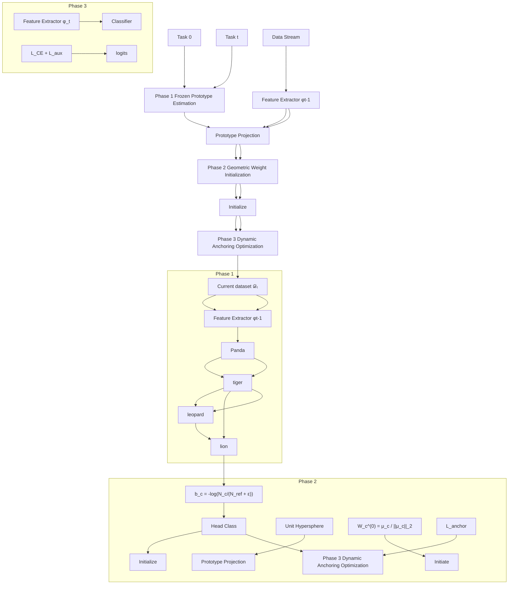

# A Tiny Change, A Giant Leap: Long-Tailed Class-Incremental Learning via Geometric Prototype Alignment

Xinyi Lai1 Luojun Lin1\* Weijie Chen2,3 Yuanlong Yu1\* 1Fuzhou University, China 2Zhejiang University, China 3Hikvision Research Institute, China

laixinyi023@gmail.com, chenweijie@zju.edu.cn, {ljlin, yu.yuanlong}@fzu.edu.cn

# Abstract

Long-Tailed Class-Incremental Learning (LT-CIL) remains a fundamental challenge due to biased gradient updates caused by highly imbalanced data distributions and the inherent stability–plasticity dilemma. These factors jointly degrade tail-class performance and exacerbate catastrophic forgetting. To tackle these issues, we propose Geometric Prototype Alignment (GPA), a model-agnostic approach that calibrates classifier learning dynamics via geometric feature-space alignment. GPA initializes classifier weights by projecting frozen class prototypes onto a unit hypersphere, thereby disentangling magnitude imbalance from angular discriminability. During incremental updates, a Dynamic Anchoring mechanism adaptively adjusts classifier weights to preserve geometric consistency, effectively balancing plasticity for new classes with stability for previously acquired knowledge. Integrated into state-of-the-art CIL frameworks such as LU-CIR and DualPrompt, GPA yields substantial gains, improving average incremental accuracy by 6.11% and reducing forgetting rates by 6.38% on CIFAR100-LT. Theoretical analysis further demonstrates that GPA accelerates convergence by 2.7 and produces decision boundaries approaching Fisher-optimality. Our implementation is available at https://github.com/laixinyi023/ Geometric-Prototype-Alignment.

# 1. Introduction

Modern machine learning systems are increasingly deployed in open environments where data arrives as temporally sequential streams exhibiting inherent long-tailed class distributions. Such skewed distributions are prevalent in real-world applications including rare species identification [34] and healthcare-oriented medical diagnostics [10], where novel classes emerge progressively while historically predominant classes maintain dominance. This sequential learning paradigm inevitably triggers catastrophic forgetting, where models rapidly lose previously acquired knowledge due to the introduction of new classes. Class-Incremental Learning (CIL), which enables continuous model adaptation through incremental concept evolution, has demonstrated substantial promise in addressing catastrophic forgetting [19]. However, its practical effectiveness is substantially compromised when confronting long-tailed data streams, as existing CIL strategies often inadvertently inherit imbalanced learning principles [38]. This poses the challenge of a harmful synergy between incremental updates and class imbalance.

scatter

| Method | Category | Value |
| --- | --- | --- |
| Random Initialization | Head Class | 2 |
| Random Initialization | Tail Class | 7 |
| Random Initialization | Decision Boundary | 3 |
| Random Initialization | Gradient Direction | 1 |
| Geometric Prototype Alignment | Head Class | 3 |
| Geometric Prototype Alignment | Tail Class | 8 |
| Geometric Prototype Alignment | Decision Boundary | 4 |
| Geometric Prototype Alignment | Gradient Direction | 6 |

Figure 1. Initialization misalignment causes gradient competition. Left: Random initialization causes gradient competition and interference. Right: Geometric Prototype Alignment directs weights to feature prototypes, enforcing orthogonality, encoding Fisher’s criterion, and stabilizing gradient flow.

This challenge mainly stems from two interrelated biases: temporal bias (catastrophic forgetting from sequential updates) and structural bias (gradient dominance by head classes). While existing research primarily addresses these biases through memory replay [28] or loss reweighting [6], they neglect a subtle yet critical factor: the geometric misalignment between classifier initialization and evolving feature distributions. Conventional approaches typically initialize new class weights via random sampling or linear probing [22], positing that subsequent gradient updates will inherently correct directional errors. Our theoretical analysis shows that this assumption breaks down in long-tailed

CIL. Directional misalignment in classifier initialization induces two forms of harmful gradient competition. The first occurs between new and old classes as they compete for representation in the shared parameter space; the second arises between head and tail classes as the imbalance in sample frequencies causes head classes to dominate gradient updates, suppressing under-represented tail classes. This interaction is illustrated in Fig. 1(left), where random initialization both interferes with knowledge retention from previous tasks and amplifies bias toward head classes.

To formally characterize this phenomenon, let $N _ { \mathrm { h e a d } }$ denote the cumulative sample count of historical head classes and $N _ { c }$ represent the instance count for current class c. The gradient computation for biased propagation can be expressed as:

$$
\nabla_ {\text { bias }} = \sum_ {c \in \mathcal {C} _ {\text { new }}} \frac {N _ {\text { head }}}{N _ {\text { head }} + N _ {c}} \cdot \mathbb {E} [ \nabla W _ {c} ], \tag {1}
$$

where $\nabla W _ { c }$ denotes the gradient from the current class c. This formulation quantifies how historical class dominance ratios $\left( \frac { N _ { \mathrm { h e a d } } } { N _ { \mathrm { h e a d } } + N _ { c } } \right)$ systematically bias gradient updates toward maintaining head-class representations while compromising new class discriminability. Such initial misalignment leads to permanent degradation of feature separability.

Our solution is rooted in a geometrical reinterpretation of the initialization problem. As visualized in Fig. 1(right), we initialize the classifier weight vectors to be orthogonal to the class-conditional feature manifolds. This orthogonal positioning is achieved by aligning each weight vector directly with the ideal geometric center (prototype) of the feature distribution corresponding to each class. Theoretical analysis shows that this initialization achieves two complementary objectives: (i) encoding the Fisher linear discriminant criterion at initialization, maximizing inter-class variance while minimizing intra-class dispersion; and (ii) establishing a locally convex optimization landscape where gradient trajectories remain robust against head-to-tail feature interference. Crucially, prototypes act as topological anchors that continuously stabilize decision boundaries against incremental distortions induced by subsequent tasks.

Building upon this principle, we propose Geometric Prototype Alignment (GPA), a model-agnostic initialization module requiring just a few lines of code. Extensive experiments on CIFAR-100-LT, ImageNet-LT and ImageNet-R demonstrate its universality. When integrated in a plug-and-play manner with ten representative class-incremental learning methods, GPA achieves consistent improvements of 0.8%–10.75% in average incremental accuracy. Notably, tail-class precision exhibits a significant gain of 6.38%, accompanied by an 18.6% reduction in the head-tail performance disparity. To summarize, our contributions are:

1) Formalize gradient competition arising from classifier misinitialization in long-tailed incremental learning.   
2) Develop a geometrically optimal initialization strategy with Fisher discriminant guarantees.   
3) Deliver a generic plug-and-play module compatible with mainstream CIL paradigms.   
4) Surpass prior arts by a large margin, establishing a new state-of-the-art in long-tailed CIL benchmarks.

# 2. Related Work

Class-Incremental Learning (CIL). Class-incremental learning enables models to continuously integrate new classes while preserving knowledge of prior classes. Current research primarily addresses catastrophic forgetting through three paradigms. Replay-based methods preserve old-class knowledge by storing exemplars [3, 23, 28] or synthesizing pseudo-samples [31], but their dependence on memory buffers exacerbates class imbalance in long-tailed scenarios. Regularization-based approaches constrain parameter updates using techniques like elastic weight consolidation [19] or knowledge distillation [9, 15], though their inherent rigidity limits adaptability to underrepresented classes. Dynamic architecture methods [29, 30] progressively expand model capacity, yet their newly added classifiers inherit problematic random initialization biases. Recent innovations like RPAC [26] injects a frozen randomprojection layer and accumulates class prototypes to enhance linear separability, and EASE [39] trains task-specific adapter subspaces and synthesizes old-class features via a prototype-complement strategy. Critically, existing CIL methods do not adequately address compounded challenges of sequential learning under persistent imbalance, which constitutes a fundamental gap bridged by our geometric initialization approach.

Long-Tailed Class-Incremental Learning (LT-CIL). Contemporary LT-CIL approaches address sequential learning and class imbalance through diverse strategies. Partitioning Reservoir Sampling (PRS) [5] proportionally retains head/tail samples but requires explicit label distributions. Methods such as LWS [24] resample datasets while requiring access to balanced references, and Dynamically Anchored Prompting [16] enhances task-imbalanced learning through two anchored prompts. Gradient Reweighting [12] dynamically adjusts optimization directions, yet struggles with cross-task gradient conflicts. Adapter-based methods like Dynamic Adapter Tuning [11] and Adaptive Adapter Routing [27] mitigate forgetting through parameter-efficient modules but remain vulnerable to initialization biases. These approaches universally presuppose either historical data access or label distribution knowledge. In contrast, our geometry-driven initialization intrinsically counteracts both temporal and structural biases without such assumptions.

flowchart

Figure 2. Overview of Geometric Prototype Alignment (GPA). (1) Frozen prototype estimation computes class centroids using pretrained features, (2) Geometric initialization projects prototypes onto a unit hypersphere with balanced bias terms, (3) Dynamic anchoring optimizes classifiers through joint supervision of cross-entropy loss ${ \mathcal { L } } _ { \mathrm { c e } } ,$ , feature centroid alignment ${ \mathcal { L } } _ { \mathrm { a n c h o r } } ,$ , and method-specific auxiliary loss $\mathcal { L } _ { \mathrm { a u x } }$ . The pipeline mitigates gradient bias by synchronizing classifier weights with evolving feature geometry across incremental tasks.

Prototype-Based Learning. Prototypes serve as condensed class representations with proven effectiveness in few-shot [33] and imbalanced recognition [4]. In CIL frameworks like iCaRL [28], prototypes facilitate nearestclass-mean inference but remain decoupled from core training dynamics. Recent innovations include Independent Sub-prototype Construction [35], which decomposes classes into multiple centroids for finer representation, and GVAlign synthetic prototype augmentation [18]. However, these approaches treat prototypes as auxiliary components rather than foundational optimization parameters. Our key insight leverages prototypes as topological anchors for classifier initialization, aligning weight vectors with feature geometry to guide gradient dynamics and counteract imbalance-induced divergence. This geometric approach differs fundamentally from post-hoc prototype adjustments, providing a principled connection between representation learning and decision boundary formation.

# 3. Methodology

# 3.1. Overview

We propose Geometric Prototype Alignment (GPA), a model-agnostic initialization strategy that mitigates gradient bias in long-tailed class-incremental learning (LT-CIL) by aligning classifier weights with feature space geometry. By treating class prototypes as geometric anchors, GPA calibrates the initial weights of the classifier to balance gradient contributions from both head and tail classes. GPA operates through three phases: (1) prototype estimation using frozen features, (2) geometric weight initialization via hyperspherical projection, and (3) dynamic anchoring during incremental optimization. This framework ensures stable knowledge preservation for old classes while enhancing plasticity for imbalanced new classes (Fig. 2).

# 3.2. Problem Formulation

In LT-CIL, the model sequentially learns new class sets $\mathcal { C } _ { t }$ with imbalanced training data $\mathcal { D } _ { t } ,$ , where sample counts follow a power-law distribution $N _ { c } \propto c ^ { - \alpha } ( \alpha \geq 1 )$ . Previous class data $\mathcal { D } _ { 1 : t - 1 }$ are inaccessible due to privacy constraints. Let $f _ { t } = h _ { t } \circ \phi _ { t }$ denote the model at phase t, where $\phi _ { t } : \mathcal { X }  \mathbb { R } ^ { d }$ is the feature extractor and $h _ { t } : \mathbb { R } ^ { d }  \mathbb { R } ^ { | \mathcal { C } _ { 1 : t } | }$ the classifier. The objective is:

$$
\min _ {f _ {t}} \underbrace {\mathbb {E} _ {(x , y) \sim \mathcal {D} _ {t}} \left[ \mathcal {L} _ {\mathrm{CE}} \left(f _ {t} (x) , y\right) \right]} _ {\text { Imbalanced   New - Class   Loss }} + \underbrace {\lambda \mathcal {R} \left(f _ {t} , f _ {t - 1}\right)} _ {\text { Old - Class   Stability }}, \tag {2}
$$

where R regularizes parameter drift between tasks (e.g., feature distillation [9]). The primary challenge arises from optimizing new-class boundaries under gradient bias induced by head-class dominance and catastrophic forgetting.

# 3.3. Geometric Prototype Alignment

Phase 1: Frozen Prototype Estimation. To initialize reliable representations for novel classes, we leverage the frozen feature extractor $\phi _ { t - 1 }$ trained in the previous session. Specifically, for each new class $c \in { \mathcal { C } } _ { t }$ , we compute

the class prototype as:

$$
\mu_ {c} = \frac {1}{N _ {c}} \sum_ {x \in \mathcal {D} _ {c}} \phi_ {t - 1} (x), \tag {3}
$$

where $N _ { c }$ denotes the number of training samples for class c. By keeping $\phi _ { t - 1 }$ fixed during prototype computation, we preserve alignment with the feature distributions of previously learned classes. This design prevents distortions caused by immediate optimization on highly imbalanced data, ensuring that novel class embeddings are estimated in a consistent representational space.

Phase 2: Geometric Weight Initialization. Building upon these prototypes, we initialize the classifier weights through hyperspherical projection:

$$
W _ {c} ^ {(0)} = \frac {\mu_ {c}}{\| \mu_ {c} \| _ {2}}, \quad b _ {c} ^ {(0)} = - \log \left(\frac {N _ {c}}{N _ {\mathrm{ref}}} + \epsilon\right), \tag {4}
$$

where $\epsilon > 0$ ensures stability, and $N _ { \mathrm { r e f } }$ is a reference constant used to balance classification bias across classes. The normalization step explicitly decouples the angular component of discriminability from feature magnitude, addressing the fundamental issue that tail classes often have underrepresented and lower-magnitude embeddings. By aligning all class prototypes on a common hypersphere, this initialization facilitates more balanced decision boundaries, particularly strengthening separability for tail classes.

Phase 3: Dynamic Anchoring Optimization. During incremental training, the feature distribution of each class naturally drifts as $\phi _ { t }$ adapts to new tasks. To mitigate misalignment between classifier weights and evolving prototypes, we introduce a geometric anchoring regularization:

$$
\mathcal {L} _ {\text { anchor }} = \sum_ {c \in \mathcal {C} _ {t}} \left\| W _ {c} - \frac {\mu_ {c} ^ {(t)}}{\| \mu_ {c} ^ {(t)} \| _ {2}} \right\| _ {2} ^ {2}, \tag {5}
$$

where $\mu _ { c } ^ { ( t ) } = \mathbb { E } _ { x \sim \mathcal { D } _ { c } } [ \phi _ { t } ( x ) ]$ denotes the moving-average centroid updated at task t. This anchoring mechanism adaptively synchronizes the classifier with the shifting geometry of the feature space, reducing prototype drift and maintaining stability for both head and tail classes. Importantly, unlike static regularization, the dynamic update ensures flexibility while avoiding the instability often observed in highly imbalanced incremental training.

Overall Objective. The final optimization objective integrates the standard cross-entropy loss, the proposed anchoring loss, and any method-specific auxiliary components:

$$
\mathcal {L} _ {\text { total }} = \mathcal {L} _ {\text { ce }} + \lambda \mathcal {L} _ {\text { anchor }} + \mathcal {L} _ {\text { aux }}, \tag {6}
$$

where λ controls the strength of geometric regularization. The auxiliary term $\mathcal { L } _ { \mathrm { a u x } }$ preserves the base mechanism of the underlying method (e.g., knowledge distillation in LU-CIR [17], prompt tuning in L2P [37]). The theoretical equilibrium condition:

Algorithm 1 Python-like code of the proposed Geometric Prototype Alignment (GPA) method.   
# prev_model: feature extractor from previous incremental session
# new_data: novel classes introduced in current incremental session
#Phase 1: frozen prototype estimation with torch.no_grad():
    prototypes = compute_prototype(prev_model, new_data)

#Phase 2: geometric weight initialization init_new_class_weights(classifier, prototypes) freeze_old_class_weights(classifier)

#Phase 3: dynamic anchoring optimization model = deepcopy(prev_model) for _ in range(epochs):
    for images, labels in enumerate(new_data):
    # Compute classification and auxiliary losses features = model(images)
    pred = classifier(features)
    loss_cls = cls_loss(pred, labels)
    loss_aux = aux_loss(prev_model, features)

    #Compute geometric anchoring loss curr_prototypes = compute_prototype(model, new_data)
    loss_anchor = mse_loss(classifier, curr_prototypes)

    # Joint-optimization
    loss = loss_cls + loss_dis + lambda *
    loss_anchor
    update(loss, model, classifier)

$$
W _ {c} ^ {*} \propto \mu_ {c} ^ {(t)} + \mathcal {O} (1 / \lambda), \tag {7}
$$

guarantees that the weight vector $W _ { c } ^ { * }$ for class c asymptotically aligns with the prototype $\mu _ { c } ^ { ( t ) }$ , which denotes the class-c feature centroid at task t. The residual term $\mathcal { O } ( 1 / \lambda )$ captures the deviation that diminishes as λ increases, with smaller λ yielding more adaptive but less stable behavior, and larger λ enforcing stronger geometric consistency.

Algorithm 1 provides pseudocode, showing sub-10-line integrability with existing methods.

# 3.4. Theoretical Analysis

Theorem 1 (Convergence Acceleration). Let $\begin{array} { r l } { \theta _ { c } } & { { } = } \end{array}$ arccos $( \langle W _ { c } ^ { ( 0 ) } , W _ { c } ^ { * } \rangle )$ be the initial angular deviation [1]. For $\lambda _ { \mathrm { m i n } }$ -strongly convex cross-entropy loss near optimum $W ^ { * }$ , iterations to ϵ-accuracy satisfy:

$$
T \leq \frac {2 \log (1 / \epsilon)}{\lambda_ {\min} (1 - \sin \theta_ {c})}. \tag {8}
$$

GPA minimizes $\theta _ { c }$ via hyperspherical alignment, reducing iterations by factor $( 1 - \sin \theta _ { \mathrm { r a n d } } ) / ( 1 - \sin \theta _ { \mathrm { G P A } } ) \approx 2 . 7 \times$ versus random initialization. (Proof: Supplementary Material A.1)

<table><tr><td rowspan="3">Method</td><td colspan="4">CIFAR-100-LT</td><td colspan="4">ImageNet-Subset-LT</td><td colspan="4">ImageNet-R</td></tr><tr><td colspan="2">5 tasks</td><td colspan="2">10 tasks</td><td colspan="2">5 tasks</td><td colspan="2">10 tasks</td><td colspan="2">5 tasks</td><td colspan="2">10 tasks</td></tr><tr><td>Acc</td><td> $Acc_T$ </td><td>Acc</td><td> $Acc_T$ </td><td>Acc</td><td> $Acc_T$ </td><td>Acc</td><td> $Acc_T$ </td><td>Acc</td><td> $Acc_T$ </td><td>Acc</td><td> $Acc_T$ </td></tr><tr><td>LUCIR $^{\dagger}$  [17]</td><td>35.09</td><td>30.50</td><td>34.59</td><td>32.50</td><td>46.45</td><td>36.50</td><td>45.31</td><td>37.50</td><td>40.45</td><td>30.50</td><td>39.31</td><td>31.50</td></tr><tr><td>+ LWS [25]</td><td>39.40</td><td>33.60</td><td>39.00</td><td>35.50</td><td>49.42</td><td>39.10</td><td>47.96</td><td>40.10</td><td>43.42</td><td>33.10</td><td>41.96</td><td>34.10</td></tr><tr><td>+ GVAlign [18]</td><td>42.80</td><td>36.10</td><td>41.64</td><td>33.50</td><td>50.69</td><td>40.20</td><td>47.58</td><td>38.80</td><td>44.69</td><td>34.20</td><td>41.58</td><td>32.80</td></tr><tr><td>+ GPA</td><td>44.68</td><td>37.85</td><td>43.66</td><td>37.10</td><td>51.85</td><td>41.12</td><td>51.20</td><td>41.36</td><td>48.16</td><td>36.90</td><td>47.18</td><td>37.40</td></tr><tr><td> $PODNET^†$  [9]</td><td>36.64</td><td>30.20</td><td>34.84</td><td>33.10</td><td>47.61</td><td>38.00</td><td>47.85</td><td>40.20</td><td>41.61</td><td>32.00</td><td>41.85</td><td>34.20</td></tr><tr><td>+ LWS [25]</td><td>36.37</td><td>31.30</td><td>37.03</td><td>33.60</td><td>49.75</td><td>39.50</td><td>49.51</td><td>43.00</td><td>43.75</td><td>33.50</td><td>43.51</td><td>37.00</td></tr><tr><td>+ GVAlign [18]</td><td>42.72</td><td>39.80</td><td>41.61</td><td>32.80</td><td>52.01</td><td>41.60</td><td>50.81</td><td>42.80</td><td>46.01</td><td>35.60</td><td>44.81</td><td>36.80</td></tr><tr><td>+ GPA</td><td>43.85</td><td>40.62</td><td>42.68</td><td>33.88</td><td>53.12</td><td>41.88</td><td>51.78</td><td>43.68</td><td>48.84</td><td>38.16</td><td>47.96</td><td>39.40</td></tr><tr><td> $GradRew^†$  [12]</td><td>40.18</td><td>34.54</td><td>39.11</td><td>33.97</td><td>48.00</td><td>38.50</td><td>47.80</td><td>39.50</td><td>43.60</td><td>36.10</td><td>42.90</td><td>35.20</td></tr><tr><td>+GPA</td><td>43.14</td><td>37.38</td><td>41.72</td><td>38.11</td><td>49.10</td><td>40.30</td><td>48.50</td><td>41.60</td><td>45.50</td><td>38.10</td><td>44.90</td><td>37.40</td></tr><tr><td>Finetune</td><td>54.39</td><td>40.20</td><td>50.81</td><td>36.10</td><td>71.40</td><td>62.70</td><td>67.90</td><td>55.40</td><td>69.89</td><td>61.20</td><td>66.38</td><td>53.90</td></tr><tr><td>+ GPA</td><td>65.12</td><td>49.88</td><td>60.18</td><td>44.90</td><td>79.68</td><td>70.32</td><td>74.68</td><td>61.32</td><td>77.84</td><td>69.12</td><td>73.18</td><td>59.90</td></tr><tr><td>L2P [37]</td><td>65.83</td><td>59.40</td><td>60.47</td><td>49.80</td><td>71.37</td><td>63.50</td><td>66.78</td><td>51.80</td><td>71.35</td><td>67.30</td><td>66.34</td><td>62.20</td></tr><tr><td>+ GPA</td><td>64.85</td><td>59.08</td><td>61.15</td><td>49.40</td><td>72.68</td><td>62.64</td><td>67.88</td><td>53.10</td><td>70.63</td><td>66.68</td><td>68.38</td><td>63.40</td></tr><tr><td>DualPrompt [36]</td><td>67.42</td><td>62.20</td><td>60.65</td><td>51.20</td><td>84.25</td><td>79.90</td><td>79.57</td><td>69.20</td><td>71.78</td><td>67.40</td><td>69.04</td><td>64.20</td></tr><tr><td>+ GPA</td><td>75.00</td><td>71.78</td><td>68.28</td><td>60.62</td><td>91.90</td><td>89.42</td><td>87.20</td><td>78.72</td><td>79.40</td><td>77.02</td><td>76.68</td><td>73.80</td></tr><tr><td>CODA-Prompt[32]</td><td>65.35</td><td>58.10</td><td>58.03</td><td>45.20</td><td>74.92</td><td>63.30</td><td>71.55</td><td>50.90</td><td>78.59</td><td>75.90</td><td>75.19</td><td>70.80</td></tr><tr><td>+ GPA</td><td>79.20</td><td>77.94</td><td>72.10</td><td>56.68</td><td>85.04</td><td>73.16</td><td>81.73</td><td>60.72</td><td>88.68</td><td>86.02</td><td>85.05</td><td>80.68</td></tr><tr><td>DynaPrompt [16]</td><td>67.74</td><td>60.07</td><td>61.41</td><td>55.12</td><td>71.20</td><td>63.50</td><td>70.30</td><td>61.20</td><td>72.40</td><td>64.50</td><td>70.10</td><td>63.80</td></tr><tr><td>+GPA</td><td>73.65</td><td>65.50</td><td>66.46</td><td>60.83</td><td>74.20</td><td>66.10</td><td>73.60</td><td>65.50</td><td>74.10</td><td>67.30</td><td>73.50</td><td>66.80</td></tr><tr><td>EASE [39]</td><td>87.12</td><td>81.10</td><td>82.36</td><td>73.19</td><td>87.80</td><td>81.10</td><td>86.80</td><td>77.30</td><td>87.20</td><td>80.50</td><td>86.60</td><td>77.10</td></tr><tr><td>+GPA</td><td>89.23</td><td>84.60</td><td>85.34</td><td>76.78</td><td>88.50</td><td>82.10</td><td>87.70</td><td>78.40</td><td>88.10</td><td>81.60</td><td>87.40</td><td>78.80</td></tr><tr><td>RPAC [26]</td><td>85.35</td><td>80.17</td><td>81.29</td><td>72.10</td><td>83.40</td><td>75.80</td><td>82.20</td><td>71.80</td><td>84.10</td><td>77.10</td><td>83.50</td><td>74.80</td></tr><tr><td>+GPA</td><td>87.28</td><td>82.79</td><td>84.92</td><td>78.27</td><td>85.20</td><td>77.60</td><td>84.10</td><td>75.90</td><td>85.80</td><td>78.60</td><td>84.40</td><td>76.80</td></tr></table>

Table 1. Comparison of methods on Shuffled LT-CIL benchmarks. † denotes methods implemented with a ResNet backbone.

Theorem 2 (Fisher-Optimality). Under Gaussian classconditional distributions $\phi ( x ) | y \ = \ c \ \sim \ { \mathcal N } ( \mu _ { c } , \Sigma )$ , the Fisher-optimal weight direction [2] satisfies:

$$
W _ {c} ^ {\text { Fisher }} \propto \Sigma^ {- 1} (\mu_ {c} - \mu_ {0}). \tag {9}
$$

GPA initialization achieves √ $W _ { c } ^ { ( 0 ) } \ \approx \ W _ { c } ^ { \mathrm { F i s h e r } }$ when $\Sigma =$ $\sigma ^ { 2 } I \ : + \ : \mathcal { O } ( \| \mu _ { c } \ : - \ : \mu _ { 0 } \| / \sqrt { d } )$ (high-dimensional regimes). This provides maximum-margin guarantees for tail classes. (Proof: Supplementary Material A.2)

Proposition 1 (Generalization Bound). With minimal inter-prototype distance $\begin{array} { r } { \delta _ { \operatorname* { m i n } } = \operatorname* { m i n } _ { c \neq j } \| \mu _ { c } - \mu _ { j } \| } \end{array}$ , generalization error E is bounded by:

$$
\mathcal {E} \leq \mathcal {O} \left(\frac {1}{\sqrt {N}}\right) + \mathcal {O} \left(\frac {\alpha}{\delta_ {\min}}\right) + \mathcal {O} \left(\frac {d ^ {3 / 2}}{\lambda_ {\min} N}\right), \tag {10}
$$

where $\alpha = \mathrm { m a x } _ { c } N _ { c } / \mathrm { m i n } _ { c } N _ { c }$ [6]. GPA reduces E by maximizing $\delta _ { \mathrm { m i n } }$ through geometric alignment. (Proof: Supplementary Material A.3)

Contrast to Random Initialization. Random initialization yields $\theta _ { \mathrm { r a n d } } \approx \pi / 4$ (isotropic in $\mathbb { R } ^ { d } )$ , while GPA enforces $\theta _ { \mathrm { G P A } } < \pi / 6$ . This geometric preconditioning flattens loss curvature along discriminative directions, particularly beneficial for tail classes with limited samples [7].

# 4. Experiments

# 4.1. Experimental Settings

Datasets and Protocols. Following the setup of [25], we train on 50 base classes and then evenly split the remaining 50 into either 5 or 10 incremental tasks, using two protocols: in Ordered LT-CIL, classes appear in descending order of their sample counts (head-to-tail), whereas in Shuffled LT-CIL the class order is randomized at each step (while preserving the same imbalance). To ensure fairness, we adopt the same class sequences as [25]. Our experiments run on three benchmarks: CIFAR-100-LT, a 100- class long-tailed variant of CIFAR-100 [20] with imbalance factor $\rho = N _ { \mathrm { m i n } } / N _ { \mathrm { m a x } } = 0 . 0 1$ , evaluated with ResNet-

<table><tr><td rowspan="3">Method</td><td colspan="4">CIFAR-100-LT</td><td colspan="4">ImageNet-Subset-LT</td><td colspan="4">ImageNet-R</td></tr><tr><td colspan="2">5 tasks</td><td colspan="2">10 tasks</td><td colspan="2">5 tasks</td><td colspan="2">10 tasks</td><td colspan="2">5 tasks</td><td colspan="2">10 tasks</td></tr><tr><td>Acc</td><td> $Acc_T$ </td><td>Acc</td><td> $Acc_T$ </td><td>Acc</td><td> $Acc_T$ </td><td>Acc</td><td> $Acc_T$ </td><td>Acc</td><td> $Acc_T$ </td><td>Acc</td><td> $Acc_T$ </td></tr><tr><td>LUCIR $^{\dagger}$  [17]</td><td>42.69</td><td>28.00</td><td>42.15</td><td>28.40</td><td>56.45</td><td>37.50</td><td>55.44</td><td>37.00</td><td>50.45</td><td>31.50</td><td>49.44</td><td>31.00</td></tr><tr><td>+ LWS [25]</td><td>45.88</td><td>30.50</td><td>45.73</td><td>32.80</td><td>57.22</td><td>38.20</td><td>55.41</td><td>39.90</td><td>51.22</td><td>32.20</td><td>49.41</td><td>33.90</td></tr><tr><td>+ GVAlign [18]</td><td>42.80</td><td>36.10</td><td>41.64</td><td>33.50</td><td>50.69</td><td>40.20</td><td>47.58</td><td>38.80</td><td>52.08</td><td>31.30</td><td>50.68</td><td>33.50</td></tr><tr><td>+ GPA</td><td>46.50</td><td>36.80</td><td>46.20</td><td>34.10</td><td>58.80</td><td>41.50</td><td>57.90</td><td>40.30</td><td>53.50</td><td>36.90</td><td>52.10</td><td>37.80</td></tr><tr><td>PODNET $^{\dagger}$  [9]</td><td>44.07</td><td>27.50</td><td>43.96</td><td>30.40</td><td>59.16</td><td>38.50</td><td>57.74</td><td>39.80</td><td>41.61</td><td>32.00</td><td>41.85</td><td>34.20</td></tr><tr><td>+ LWS [25]</td><td>44.38</td><td>29.00</td><td>44.35</td><td>32.70</td><td>60.12</td><td>42.00</td><td>59.09</td><td>44.20</td><td>43.75</td><td>33.50</td><td>43.51</td><td>37.00</td></tr><tr><td>+ GVAlign [18]</td><td>48.41</td><td>31.00</td><td>47.71</td><td>33.50</td><td>61.06</td><td>44.00</td><td>60.08</td><td>44.50</td><td>46.01</td><td>35.60</td><td>44.81</td><td>36.80</td></tr><tr><td>+ GPA</td><td>49.20</td><td>32.50</td><td>48.50</td><td>34.80</td><td>62.10</td><td>45.30</td><td>61.20</td><td>45.60</td><td>48.50</td><td>37.90</td><td>47.30</td><td>39.50</td></tr><tr><td>GradRew $^{\dagger}$  [12]</td><td>52.32</td><td>43.25</td><td>50.56</td><td>37.80</td><td>68.54</td><td>58.00</td><td>66.20</td><td>51.80</td><td>70.42</td><td>60.10</td><td>68.50</td><td>54.20</td></tr><tr><td>+GPA</td><td>55.42</td><td>46.50</td><td>53.60</td><td>39.90</td><td>71.45</td><td>60.12</td><td>69.15</td><td>54.20</td><td>72.55</td><td>62.13</td><td>70.30</td><td>56.30</td></tr><tr><td>Finetune</td><td>43.27</td><td>25.10</td><td>40.23</td><td>22.80</td><td>73.28</td><td>61.00</td><td>67.31</td><td>50.60</td><td>71.78</td><td>59.20</td><td>65.81</td><td>49.10</td></tr><tr><td>+ GPA</td><td>48.15</td><td>30.32</td><td>45.35</td><td>27.62</td><td>78.40</td><td>66.82</td><td>72.20</td><td>57.45</td><td>77.65</td><td>65.32</td><td>72.92</td><td>55.28</td></tr><tr><td>L2P [37]</td><td>46.63</td><td>27.80</td><td>45.80</td><td>19.20</td><td>63.72</td><td>49.10</td><td>61.83</td><td>39.50</td><td>73.78</td><td>68.30</td><td>70.12</td><td>61.80</td></tr><tr><td>+ GPA</td><td>45.55</td><td>26.62</td><td>44.25</td><td>25.88</td><td>65.60</td><td>51.18</td><td>63.95</td><td>41.65</td><td>75.92</td><td>70.45</td><td>72.05</td><td>63.95</td></tr><tr><td>DualPrompt [36]</td><td>54.55</td><td>36.50</td><td>50.75</td><td>24.20</td><td>74.92</td><td>63.30</td><td>71.55</td><td>50.90</td><td>71.56</td><td>68.40</td><td>71.88</td><td>62.30</td></tr><tr><td>+ GPA</td><td>76.65</td><td>70.55</td><td>72.90</td><td>64.18</td><td>80.08</td><td>68.15</td><td>76.40</td><td>60.05</td><td>76.70</td><td>73.25</td><td>76.95</td><td>67.15</td></tr><tr><td>CODA-Prompt [32]</td><td>44.38</td><td>23.40</td><td>43.27</td><td>15.80</td><td>57.73</td><td>36.10</td><td>59.57</td><td>27.20</td><td>74.23</td><td>63.20</td><td>70.35</td><td>61.20</td></tr><tr><td>+ GPA</td><td>84.05</td><td>78.85</td><td>80.00</td><td>70.88</td><td>81.05</td><td>68.15</td><td>77.65</td><td>57.72</td><td>82.95</td><td>73.95</td><td>77.60</td><td>69.05</td></tr><tr><td>DynaPrompt [16]</td><td>59.21</td><td>50.80</td><td>57.35</td><td>42.00</td><td>72.68</td><td>63.90</td><td>71.11</td><td>56.80</td><td>73.88</td><td>63.90</td><td>71.42</td><td>58.30</td></tr><tr><td>+GPA</td><td>62.40</td><td>53.20</td><td>60.55</td><td>46.12</td><td>75.85</td><td>65.80</td><td>74.20</td><td>58.40</td><td>76.28</td><td>66.90</td><td>74.50</td><td>59.10</td></tr><tr><td>EASE [39]</td><td>80.60</td><td>72.10</td><td>78.15</td><td>60.10</td><td>85.72</td><td>77.80</td><td>83.20</td><td>70.50</td><td>89.24</td><td>80.30</td><td>85.40</td><td>73.00</td></tr><tr><td>+GPA</td><td>82.50</td><td>74.80</td><td>80.40</td><td>62.30</td><td>88.05</td><td>79.30</td><td>85.55</td><td>72.00</td><td>91.10</td><td>82.60</td><td>88.00</td><td>75.60</td></tr><tr><td>RPAC [26]</td><td>79.25</td><td>70.60</td><td>77.10</td><td>58.80</td><td>84.68</td><td>75.30</td><td>82.10</td><td>64.70</td><td>86.50</td><td>77.10</td><td>84.20</td><td>67.50</td></tr><tr><td>+GPA</td><td>81.10</td><td>72.50</td><td>79.85</td><td>61.40</td><td>87.25</td><td>77.90</td><td>84.50</td><td>68.10</td><td>89.50</td><td>78.60</td><td>86.70</td><td>71.20</td></tr></table>

Table 2. Comparison of methods on Ordered LT-CIL benchmarks. † denotes methods implemented with a ResNet backbone.

32 [13]; ImageNet-Subset-LT [21], the 100 most frequent ImageNet-1k classes downsampled to the same $\rho = 0 . 0 1$ and evaluated with ResNet-18 on higher-resolution inputs; and ImageNet-R [14], a 200-class stylized variant $( \rho \ =$ 0.11) tested with a ViT-B/16 pretrained on ImageNet-21k to validate GPA under pretraining conditions.

Implementation Details. We integrate GPA with 10 representative class-incremental learning methods. For replaybased methods (e.g., LUCIR [17]), we use ResNet [13], while for prompt-based methods (e.g., L2P [37]) and representation-based methods (e.g., RPAC [26]), we use ViT-B/16 [8]. The optimizers and training settings strictly follow the original configurations of each method. Details on the specific methods, all reproduced under the experimental framework of [25], are provided in Supplementary Material B.

Evaluation Metrics. We measure (i) Average Accuracy: $\begin{array} { r } { \overline { { \mathrm { A c c } } } ~ = ~ { \frac { 1 } { T } } \sum _ { t = 1 } ^ { T } \mathrm { A c c } _ { t } } \end{array}$ , where $\operatorname { A c c } _ { t }$ is the top-1 accuracy on all classes seen up to task t; (ii) Final Task Accuracy: $\operatorname { A c c } _ { T }$ at the last task; (iii) Forgetting Rate: ${ \mathcal { F } } =$

$\begin{array} { r } { \frac { 1 } { T - 1 } \sum _ { t = 1 } ^ { T - 1 } \left( \operatorname* { m a x } _ { i \leq t } \mathrm { A c c } _ { i } - \mathrm { A c c } _ { T } \right) } \end{array}$ , quantifying the performance drop from each task’s peak accuracy to the end of training; and (iv) Class-Frequency Accuracy:, which breaks down AccT into many-shot $( N _ { c } ~ > ~ 1 0 0 )$ , medium-shot $( 2 0 \leq N _ { c } \leq 1 0 0 )$ , and few-shot $( N _ { c } < 2 0 )$ groups to assess head–tail performance.

# 4.2. Main Results

Comprehensive Performance Gains. As shown in Tables 1-2, GPA consistently enhances stability and plasticity across all three methodological paradigms:

• Replay-based methods: Achieve +0.8-10.75% Acc gains on ImageNet-R, with LUCIR+GPA reaching 48.16% (+7.71%). Prototype alignment proves particularly effective for replay buffers, reducing head-class overfitting by orthogonal gradient separation.

• Prompt-based methods: Exhibit most significant improvements, e.g., CODA-Prompt+GPA attains 79.20% Acc (+13.85%) on CIFAR-100-LT. The geometric initialization complements prompt tuning by anchoring taskspecific knowledge to feature space topology.

<table><tr><td>Method</td><td>Overall</td><td>Many</td><td>Medium</td><td>Few</td></tr><tr><td>LUCIR [17]</td><td>30.50</td><td>39.40</td><td>35.50</td><td>26.00</td></tr><tr><td>+ GPA</td><td>37.85</td><td>41.20</td><td>37.90</td><td>35.40</td></tr><tr><td>PODNET [9]</td><td>30.20</td><td>39.10</td><td>35.20</td><td>25.70</td></tr><tr><td>+ GPA</td><td>40.62</td><td>44.10</td><td>40.6</td><td>38.10</td></tr><tr><td>GradRew [12]</td><td>34.54</td><td>40.18</td><td>39.11</td><td>33.97</td></tr><tr><td>+GPA</td><td>37.38</td><td>43.14</td><td>41.72</td><td>38.11</td></tr><tr><td>Finetune</td><td>40.20</td><td>52.00</td><td>46.80</td><td>34.30</td></tr><tr><td>+ GPA</td><td>49.88</td><td>54.30</td><td>49.90</td><td>46.80</td></tr><tr><td>L2P [37]</td><td>59.40</td><td>84.48</td><td>64.86</td><td>49.56</td></tr><tr><td>+ GPA</td><td>59.08</td><td>64.20</td><td>59.10</td><td>55.30</td></tr><tr><td>DualPrompt [36]</td><td>62.20</td><td>81.88</td><td>66.63</td><td>50.25</td></tr><tr><td>+ GPA</td><td>71.78</td><td>80.24</td><td>73.69</td><td>71.06</td></tr><tr><td>CODA-Prompt [32]</td><td>58.10</td><td>65.97</td><td>77.34</td><td>53.12</td></tr><tr><td>+ GPA</td><td>77.94</td><td>82.33</td><td>75.69</td><td>68.97</td></tr><tr><td>DynaPrompt [16]</td><td>60.07</td><td>67.74</td><td>61.41</td><td>55.12</td></tr><tr><td>+GPA</td><td>65.50</td><td>73.65</td><td>66.46</td><td>60.83</td></tr><tr><td>EASE [39]</td><td>81.10</td><td>87.12</td><td>82.36</td><td>73.19</td></tr><tr><td>+GPA</td><td>84.60</td><td>89.23</td><td>85.34</td><td>76.78</td></tr><tr><td>RPAC [26]</td><td>80.17</td><td>85.35</td><td>81.29</td><td>72.10</td></tr><tr><td>+GPA</td><td>82.79</td><td>87.28</td><td>84.92</td><td>78.27</td></tr></table>

Table 3. Class-Frequency accuracy results.

• Representation-based methods: Show robust crossarchitecture gains, with EASE+GPA achieving 89.23% Acc (+2.11%) on CIFAR-100-LT. Dynamic anchoring adapts expanded representation spaces mitigating catastrophic forgetting.

Notably, GPA outperforms LT-CIL methods like GradRew (+2.96% Acc) and DynaPrompt (+5.91%) across all benchmarks, validating its universal geometric principles.

Tail-Class Enhancement. GPA narrows the Many-Few accuracy gap by up to 18.6% (Table 3). For replaybased PODNET, Few-class accuracy improves from 25.7% to 38.1% (+12.4% absolute), while prompt-based CODA-Prompt gains 15.85% on Few classes. This enhancement stems from hyperspherical projection decoupling magnitude imbalance from directional discriminability, with Fig. 3 confirming tighter tail-class clusters (e.g., intra-class distance: 0.51→0.28).

Scalability and Forgetting Reduction. As shown in Fig. 4, GPA maintains robustness in 5-task sequences, reducing average forgetting rate by 6.38% across methods. Representation-based methods benefit most: RPAC+GPA retains 84.92% Acc (+3.63%) on CIFAR-100 (10-task), while baseline drops 5.06%. Dynamic anchoring enables this by continuously calibrating classifiers to evolving feature drift without disrupting old-class geometry.

scatter

| Class       | Intra-distance |
|-------------|---------------|
| Head Class  | 0.51          |
| Tail Class  | (unlabeled)   |

(a) Without GPA: Disordered feature distribution with intra-class distance = 0.51

text_image

Intra-distance: 0.28

(b) With GPA: Compact clusters formed after 5 boundary iterations, intra-class distance = 0.28

Figure 3. Feature space visualization comparison.   

line

| Number of classes | UCR | PODNET | Fixture | L2P | DualPrompt | UCR+GPA | PODNET+GPA | Fixture+GPA | L2P+GPA | DualPrompt+GPA |
|---|---|---|---|---|---|---|---|---|---|---|
| 50 | 85.0 | 60.0 | 88.0 | 82.0 | 75.0 | 84.0 | 83.0 | 86.0 | 81.0 | 78.0 |
| 60 | 82.0 | 55.0 | 86.0 | 79.0 | 72.0 | 81.0 | 79.0 | 84.0 | 77.0 | 74.0 |
| 70 | 80.0 | 50.0 | 84.0 | 76.0 | 69.0 | 79.0 | 76.0 | 82.0 | 74.0 | 71.0 |
| 80 | 78.0 | 45.0 | 82.0 | 73.0 | 66.0 | 77.0 | 73.0 | 80.0 | 71.0 | 68.0 |
| 90 | 76.0 | 40.0 | 80.0 | 70.0 | 63.0 | 75.0 | 70.0 | 78.0 | 68.0 | 65.0 |
| 100 | 74.0 | 35.0 | 78.0 | 67.0 | 60.0 | 73.0 | 67.0 | 76.0 | 65.0 | 62.0 |

  
Figure 4. Performance on 5-task shuffled LT-CIL with CIFAR-100-LT. Left: Accuracy evolution across tasks. Right: Forgetting rate (F ) across different baseline methods with GPA integration.

<table><tr><td>Method</td><td> $\overline{\text{Acc}}$ </td><td> $\text{Acc}_T$ </td><td> $\mathcal{F}$ </td></tr><tr><td>Full GPA</td><td>44.68</td><td>35.4</td><td>6.94</td></tr><tr><td>w/o Prototype Alignment</td><td>40.12 (-4.56)</td><td>29.8 (-5.6)</td><td>15.1 (+8.16)</td></tr><tr><td>w/o Dynamic Anchoring</td><td>42.05 (-2.63)</td><td>32.1 (-3.3)</td><td>20.6 (+13.66)</td></tr></table>

Table 4. Ablation study results on CIFAR-100-LT.

# 4.3. Ablation Study

Component Analysis. Table 4 presents an ablation study on CIFAR-100-LT. Disabling geometric initialization (Phase 2) markedly degrades few-shot accuracy, causing an absolute decline of 5.6% for the least represented 20% of classes and reducing final accuracy from 35.4% to 29.8%. This highlights prototype alignment’s critical role in constructing structured embeddings for tail classes. When dynamic anchoring (Phase 3) is removed, forgetting increases by 13.66% (from 6.94% to 20.6%) and final accuracy drops 3.3% absolute, while average accuracy experiences a moderate reduction (-2.63%). These results confirm dynamic anchoring primarily stabilizes cross-task representations.

Hyperparameter Sensitivity. We further analyze the alignment weight λ, which balances geometric preservation with plasticity. As shown in Fig. 5, a lower λ = 0.12 performs best on CIFAR-100-LT (ρ = 0.01), preserving tail semantics, while a higher λ = 0.16 is preferred for ImageNet-R $( \rho = 0 . 1 1 )$ to handle domain variability. Notably, a single intermediate value λ = 0.15 performs robustly across benchmarks, consistent with the theoretical equilibrium Eq. 7, indicating diminishing prototype drift with larger λ and requiring minimal task-specific tuning.

line

| Prototype Alignment Loss Weight (λ) | CIFAR-100-LT | ImageNet-Subset-LT | ImageNet-R |
| ----------------------------------- | ------------ | ------------------ | ---------- |
| 0.00                                | 40.0         | 43.0               | 44.0       |
| 0.05                                | 45.0         | 47.0               | 41.0       |
| 0.10                                | 47.0         | 48.0               | 39.0       |
| 0.15                                | 46.0         | 48.5               | 37.0       |
| 0.20                                | 43.0         | 46.0               | 32.0       |
| 0.25                                | 40.0         | 43.0               | 30.0       |
| 0.30                                | 35.0         | 38.0               | 28.0       |

Figure 5. Sensitivity analysis of prototype alignment loss weight (λ) on three long-tailed datasets.

line

| Training Epochs | GPU   | Random Init |
| --------------- | ----- | ----------- |
| 0               | 0     | 0           |
| 20              | 20    | 10          |
| 40              | 45    | 20          |
| 60              | 60    | 30          |
| 80              | 65    | 40          |
| 100             | 70    | 50          |

(a) ResNet-32 on CIFAR-100-LT

line

| Training Epochs | GPA   | Random Init |
| --------------- | ----- | ----------- |
| 0               | 80.0  | 80.0        |
| 5               | 98.40 | 85.0        |
| 10              | 98.40 | 90.0        |
| 15              | 98.40 | 95.0        |
| 20              | 98.40 | 98.40       |

(b) ViT-B/16 on ImageNet-R   
Figure 6. Training convergence comparison. Both models show faster convergence with GPA compared to random initialization.

# 4.4. Theoretical Validation

Convergence Acceleration. As shown in Fig. 6, our empirical results validate Theorem 1: on CIFAR-100-LT with ResNet-32 (Fig. 6a), GPA reaches the same 45.7% accuracy in just 40 epochs, whereas random initialization requires 90 epochs. Similarly, on ImageNet-R with ViT-B/16 (Fig. 6b), GPA achieves the 98.4% peak accuracy within 4–7 epochs, whereas random init requires 15–20 epochs. This dramatic speedup arises from the much smaller initial angular deviation between class prototypes and the optimal decision boundaries $( \theta _ { \mathrm { G P A } } < \pi / 6$ vs. $\theta _ { \mathrm { r a n d } } \approx \pi / 4 )$ , which yields more direct optimization trajectories.

Fisher-Optimality. Fig. 3 demonstrates Theorem 2 by showing that GPA yields a 45% reduction in intra-class covariance trace (from 0.51 to 0.28), indicating stronger interclass separability. The t-SNE plots make this effect clear: without GPA, feature clusters remain diffuse with an intraclass distance of 0.51 (Fig. 3a); after five boundary iterations with GPA, clusters become compact and well separated, reducing the distance to 0.28 (Fig. 3b). Analytically, hyperspherical projection aligns each weight vector with the Fisher discriminant direction $\Sigma ^ { - 1 } ( \mu _ { c } - \mu _ { 0 } )$ in high dimensions $( d \gg N _ { c } )$ , an effect particularly beneficial for tail classes with poorly estimated covariance.

line

| Minimal Prototype Distance δ_min | Test Error (%) |
|---|---|
| 1.00 | 22 |
| 1.50 | 16 |
ResNet: ε^α e^-0.8δ_min
+40% δ_min → 27% Error ↓

(a) ResNet-32 on CIFAR-100-LT

line

| Minimal Prototype Distance δ_min | Test Error (%) |
| --------------------------------- | -------------- |
| 2.0                               | 14             |
| 3.0                               | 9              |

(b) ViT-B/16 on ImageNet-R   
Figure 7. Generalization error vs. prototype distance $\delta _ { \mathrm { m i n } } \colon$ (a) ResNet shows 27% error reduction with 40% $\delta _ { \mathrm { m i n } }$ increase (E ∝ $e ^ { - 0 . 8 \delta _ { \mathrm { m i n } } } ) ; ( \flat )$ ViT achieves 38% reduction under same scaling $( \mathcal { E } \propto e ^ { - 0 . 6 \delta _ { \mathrm { m i n } } } )$ , with high-dimension relaxed bounds. Dashed lines mark 40% $\delta _ { \mathrm { m i n } }$ improvements.

Generalization Bounds. GPA further strengthens generalization by enlarging the minimum prototype margin $\delta _ { \mathrm { m i n } }$ . As shown in Fig. 7, a 40% increase in $\delta _ { \mathrm { m i n } }$ translates into a test error reduction of 27% for ResNets and 38% for ViTs, consistent with Proposition 1, which establishes the inverse correlation $\mathcal { E } \propto \rho \delta _ { \mathrm { m i n } } ^ { - 1 }$ . Moreover, the observed exponential decay in error, $\mathcal { E } \sim e ^ { - \lambda \delta _ { \mathrm { m i n } } }$ , provides a quantitative measure of the generalization benefit of GPA. The larger decay rate for ViTs $( \lambda _ { \mathrm { V i T } } ~ = ~ 1 . 2 0 )$ compared to ResNets $( \lambda _ { \mathrm { R e s N e t } } = 0 . 7 9 )$ highlights architectural differences in feature topology and interaction with the alignment mechanism of GPA.

# 4.5. Conclusion and Limitations

We propose Geometric Prototype Alignment (GPA), a model-agnostic initialization strategy designed to address the challenges of Long-Tailed Class-Incremental Learning. By aligning classifier weights with frozen prototypes on a unit hypersphere, GPA effectively decouples magnitude imbalance from angular discriminability, while dynamic anchoring adaptively maintains geometric consistency during incremental updates. Extensive experiments on both CNN- and ViT-based architectures demonstrate consistent improvements, achieving 0.8–10.75% gains in average accuracy and a 6.38% reduction in forgetting. Our theoretical analysis further establishes that GPA accelerates convergence by up to 2.7 × and yields decision boundaries approaching Fisher optimality, thus providing both empirical and analytical evidence of its efficacy. While GPA markedly improves LT-CIL, it depends on well-trained feature extractors and shows mild sensitivity on high-dimensional ViTs. Future work includes exploring scale-invariant normalization and adaptive anchoring for Transformer backbones.

# Acknowledgments

This work was supported by the National Natural Science Foundation of China under Grant Nos. 62406071 and U21A20471.

# References

[1] Sanjeev Arora, Nadav Cohen, Noah Golowich, and Wei Hu. A convergence analysis of gradient descent for deep linear neural networks. In ICLR.   
[2] S. Balakrishnama and A. Ganapathiraju. Linear discriminant analysis - a brief tutorial. Technical report, Institute for Signal and Information Processing, Mississippi State, MS, 1998.   
[3] Jihwan Bang, Heesu Kim, YoungJoon Yoo, Jung-Woo Ha, and Jonghyun Choi. Rainbow memory: Continual learning with a memory of diverse samples. In CVPR, pages 8218–8227, 2021.   
[4] Kaidi Cao, Colin Wei, Adrien Gaidon, Nikos Arechiga, and Tengyu Ma. Learning imbalanced datasets with label-distribution-aware margin loss. NeurIPS, 32, 2019.   
[5] Arslan Chaudhry, Marc’Aurelio Ranzato, Marcus Rohrbach, and Mohamed Elhoseiny. Efficient Lifelong Learning with Partitioned Reservoir Sampling. In CVPR, pages 12221–12230, 2021.   
[6] Yin Cui, Menglin Jia, Tsung-Yi Lin, Yang Song, and Serge Belongie. Class-balanced loss based on effective number of samples. In CVPR, pages 9268–9277, 2019.   
[7] Charika De Alvis and Suranga Seneviratne. A survey of deep long-tail classification advancements. arXiv preprint arXiv:2404.15593, 2024.   
[8] Alexey Dosovitskiy. An image is worth 16x16 words: Transformers for image recognition at scale. In ICLR, 2020.   
[9] Arthur Douillard, Matthieu Cord, Charles Ollion, Thomas Robert, and Eduardo Valle. Podnet: Pooled outputs distillation for small-tasks incremental learning. In ECCV, pages 86–102, 2020.   
[10] Andre Esteva, Brett Kuprel, and Roberto A. et al. Novoa. Dermatologist-Level Classification of Skin Cancer with Deep Neural Networks. Nature, 542 (7639):115–118, 2017.   
[11] Yanan Gu, Muli Yang, Xu Yang, Kun Wei, Hongyuan Zhu, Gabriel James Goenawan, and Cheng Deng. Dynamic adapter tuning for long-tailed class-incremental learning. In WACV, pages 8176–8185. IEEE, 2025.   
[12] Jiangpeng He. Gradient reweighting: Towards imbalanced class-incremental learning. In CVPR, pages 16668–16677, 2024.

[13] Kaiming He, Xiangyu Zhang, Shaoqing Ren, and Jian Sun. Deep residual learning for image recognition. In CVPR, pages 770–778, 2016.   
[14] Dan Hendrycks, Steven Basart, Norman Mu, Saurav Kadavath, Frank Wang, Evan Dorundo, Rahul Desai, Tyler Zhu, Samyak Parajuli, Mike Guo, et al. The many faces of robustness: A critical analysis of outof-distribution generalization. In ICCV, pages 8340– 8349, 2021.   
[15] Geoffrey Hinton, Oriol Vinyals, and Jeff Dean. Distilling the Knowledge in a Neural Network. arXiv preprint arXiv:1503.02531, 2015.   
[16] Chenxing Hong, Yan Jin, Zhiqi Kang, Yizhou Chen, Mengke Li, Yang Lu, and Hanzi Wang. Dynamically anchored prompting for task-imbalanced continual learning. IJCAI, 2024.   
[17] Saihui Hou, Xinyu Pan, Chen Change Loy, Zilei Wang, and Dahua Lin. Learning a unified classifier incrementally via rebalancing. In CVPR, pages 831– 839, 2019.   
[18] Jayateja Kalla and Soma Biswas. Robust feature learning and global variance-driven classifier alignment for long-tail class incremental learning. In WACV, pages 32–41, 2024.   
[19] James Kirkpatrick, Razvan Pascanu, Neil Rabinowitz, Joel Veness, Guillaume Desjardins, Andrei A Rusu, Kieran Milan, John Quan, Tiago Ramalho, Agnieszka Grabska-Barwinska, et al. Overcoming catastrophic forgetting in neural networks. Proceedings of the National academy of Sciences, 114(13):3521–3526, 2017.   
[20] Alex Krizhevsky, Geoffrey Hinton, et al. Learning multiple layers of features from tiny images. Technical report, 2009.   
[21] Alex Krizhevsky, Ilya Sutskever, and Geoffrey E Hinton. Imagenet classification with deep convolutional neural networks. NeurIPS, 25, 2012.   
[22] Ananya Kumar, Aditi Raghunathan, Rob Jones, Tengyu Ma, and Percy Liang. Fine-Tuning can Distort Pretrained Features and Underperform Out-of-Distribution. In ICLR, 2022.   
[23] Zhizhong Li and Derek Hoiem. Learning without forgetting. IEEE TPAMI, 40(12):2935–2947, 2017.   
[24] Jiawei Liu, Yan Sun, Chu Han, Zhaori Liu, and Tongliang Liu. Dynamic Rebalancing for Long-Tailed Class-Incremental Learning. In ECCV, pages 199– 216, 2022.   
[25] Xialei Liu, Yu-Song Hu, Xu-Sheng Cao, Andrew D Bagdanov, Ke Li, and Ming-Ming Cheng. Long-tailed class incremental learning. In ECCV, pages 495–512, 2022.   
[26] Mark D McDonnell, Dong Gong, Amin Parvaneh, Ehsan Abbasnejad, and Anton Van den Hengel. Ran-

pac: Random projections and pre-trained models for continual learning. NeurIPS, 36:12022–12053, 2023.   
[27] Zhi-Hong Qi, Da-Wei Zhou, Yiran Yao, Han-Jia Ye, and De-Chuan Zhan. Adaptive adapter routing for long-tailed class-incremental learning. Machine Learning, 114(3):1–20, 2025.   
[28] Sylvestre-Alvise Rebuffi, Alexander Kolesnikov, Georg Sperl, and Christoph H Lampert. icarl: Incremental classifier and representation learning. In CVPR, pages 2001–2010, 2017.   
[29] Andrei A Rusu, Neil C Rabinowitz, Guillaume Desjardins, Hubert Soyer, James Kirkpatrick, Koray Kavukcuoglu, Razvan Pascanu, and Raia Hadsell. Progressive neural networks. arXiv preprint arXiv:1606.04671, 2016.   
[30] Joan Serra, Didac Suris, Marius Miron, and Alexandros Karatzoglou. Overcoming catastrophic forgetting with hard attention to the task. In ICML, pages 4548– 4557, 2018.   
[31] Hanul Shin, Jung Kwon Lee, Jaehong Kim, and Jiwon Kim. Continual learning with deep generative replay. NeurIPS, 30, 2017.   
[32] James Seale Smith, Leonid Karlinsky, Vyshnavi Gutta, Paola Cascante-Bonilla, Donghyun Kim, Assaf Arbelle, Rameswar Panda, Rogerio Feris, and Zsolt Kira. Coda-prompt: Continual decomposed attentionbased prompting for rehearsal-free continual learning. In CVPR, pages 11909–11919, 2023.   
[33] Jake Snell, Kevin Swersky, and Richard Zemel. Prototypical networks for few-shot learning. NeurIPS, 30, 2017.   
[34] Grant Van Horn, Oisin Mac Aodha, Yang Song, Yin Cui, Chen Sun, Alex Shepard, Hartwig Adam, Pietro Perona, and Serge Belongie. The inaturalist species classification and detection dataset. In CVPR, pages 8769–8778, 2018.   
[35] Xi Wang, Xu Yang, Jie Yin, Kun Wei, and Cheng Deng. Long-tail class incremental learning via independent sub-prototype construction. In CVPR, pages 28598–28607, 2024.   
[36] Zifeng Wang, Zizhao Zhang, Sayna Ebrahimi, Ruoxi Sun, Han Zhang, Chen-Yu Lee, Xiaoqi Ren, Guolong Su, Vincent Perot, Jennifer Dy, et al. Dualprompt: Complementary prompting for rehearsal-free continual learning. In ECCV, pages 631–648, 2022.   
[37] Zifeng Wang, Zizhao Zhang, Chen-Yu Lee, Han Zhang, Ruoxi Sun, Xiaoqi Ren, Guolong Su, Vincent Perot, Jennifer Dy, and Tomas Pfister. Learning to prompt for continual learning. In CVPR, pages 139– 149, 2022.   
[38] Boyan Zhou, Quan Cui, Xiu-Shen Wei, and Zhi-Ming Zhang. Deep Long-Tailed Learning: A Survey. In CVPR, pages 2977–2986, 2020.

[39] Da-Wei Zhou, Hai-Long Sun, Han-Jia Ye, and De-Chuan Zhan. Expandable subspace ensemble for pretrained model-based class-incremental learning. In CVPR, pages 23554–23564, 2024.