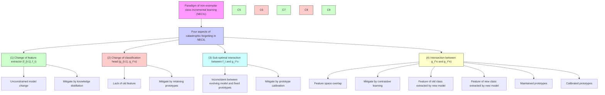
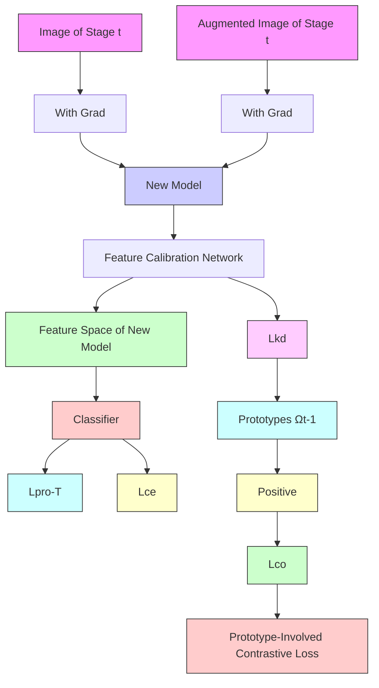

# FCS: Feature Calibration and Separation for Non-Exemplar Class Incremental Learning

Qiwei Li $^{1,2}$ , Yuxin Peng $^{1}$ , Jiahuan Zhou $^{1*}$

$^{1}$ Wangxuan Institute of Computer Technology, Peking University, Beijing 100871, China $^{2}$ School of Electronics Engineering and Computer Science, Peking University

{lqw, pengyuxin, jiahuanzhou}@pku.edu.cn

# Abstract

Non-Exemplar Class Incremental Learning (NECIL) involves learning a classification model on a sequence of data without access to exemplars from previously encountered old classes. Such a stringent constraint always leads to catastrophic forgetting of the learned knowledge. Currently, existing methods either employ knowledge distillation techniques or preserved class prototypes to sustain prior knowledge. However, two critical issues still persist. On the one hand, as the model is continually updated, the preserved prototypes of old classes will inevitably derive from the suitable location in the feature space of the new model. On the other hand, due to the lack of exemplars, the features of new classes will take the place of similar old classes which breaks the classification boundary. To address these challenges, we propose a Feature Calibration and Separation (FCS) method for NECIL. Our approach comprises a Feature Calibration Network (FCN) that adapts prototypes of old classes to the new model via optimal transport learning, approximating the drift of prototypes caused by model evolution. Additionally, we also propose a Prototype-Involved Contrastive Loss (PIC) that enhances feature separation among different classes. Specifically, to mitigate the boundary distortion arising from the interplay of classes from different learning stages, prototypes are involved in pushing the feature of new classes away from the old classes. Extensive experiments on three datasets with different settings have demonstrated the superiority of our FCS method against the state-of-the-art class incremental learning approaches. Code is available at https://github.com/zhoujiahuan1991/CVPR2024-FCS.

# 1. Introduction

As a milestone research task in computer vision, image classification has consistently attracted substantial attention


<details>
<summary>flowchart</summary>


</details>

Figure 1. Four main aspects of forgetting in NECIL. Existing methods mostly focus on retaining knowledge by knowledge distillation and prototypes. However, the sub-optimal interaction between the feature extractor and classification head as well as the intersection between classification heads may also cause catastrophic forgetting. So we propose a prototype calibration network and a prototype-involved contrastive loss to handle this issue.

over time [6, 7, 20]. Conventional deep learning-based models are designed to learn from static data [12, 18], assuming that the entire training data of all classes are available at once. When dealing with dynamic and evolving data streams, the performance of previously learned classes severely degrades, leading to a phenomenon known as catastrophic forgetting [8]. To handle this issue, inspired by the natural way that humans continually acquire knowledge throughout their lives, Incremental Learning (IL) [40] has been investigated recently. A popular solution to IL aims to retain historical exemplars to replay past knowledge when training on current data $[1, 3, 11]$ . However, they not only raise critical concerns about data privacy but also result in substantial storage and training consumption. Therefore, a more practical but challenging IL scenario where no previous exemplars can be accessed is considered in this paper, named as Non-Exemplar Class Incremental Learning (NECIL). In this setting, the issue of catastrophic forgetting becomes more severe due to the absence of explicit prior knowledge.

Existing NECIL methods $[21, 42, 43]$ predominantly rely on knowledge distillation to transfer the knowledge from old models to new ones (Fig. 1(1)) or memorize a set of prototypes of previously learned classes for knowledge preservation (Fig. 1(2)). Although the above efforts can mitigate catastrophic forgetting to some extent, the performance is limited by two crucial challenges. As illustrated in Fig. 1(3), with the incremental learning of new classes, the preserved prototypes of old classes will inevitably drift in the feature space of the new model and can no longer accurately represent the discriminative characteristics of those old classes. Though the few existing works $[38]$ propose to estimate the feature changes across different IL stages, they still omit the changes within one IL stage. Moreover, without the guidance of historical exemplars from old classes, the features of new classes will occupy and squeeze the space akin to old classes (Fig. 1(4)). Consequently, the overlap between old and new classes disrupts the classification boundary and results in knowledge forgetting. As shown in Fig. 2, there is a noticeable accuracy decline when simultaneously employing classification heads for both old and new classes, in comparison to using them individually.

To address the aforementioned challenges, we propose a novel NECIL method focusing on Feature Calibration and Separation (FCS) during IL stages. The designed FCS consists of a Feature Calibration Network (FCN) that adapts historical prototypes to the appropriate locations in the feature space of the new model, and a Prototype-Involved Contrastive loss (PIC) that separates the features of old and new classes to handle the deterioration caused by feature overlap. Specifically, motivated by the well-known Optimal Transport theory $[25]$ , our proposed FCN plays an important role in bridging the feature spaces of the old and new models. By treating the features of new data extracted by old and new models as source and target distributions, a transport plan is learned by minimizing the transport cost of aligning features from source to target distribution. Therefore, FCN leverages such a transport plan to calibrate the location of historical prototypes in the feature space of the new model, as well as alleviate the drift issue. Additionally, PIC is designed to tackle the distortion of classification boundaries caused by feature overlap. Different from existing methods $[41, 42]$ that prototypes are just used to train the classification heads, we treat the calibrated prototypes, via our FCN, as negative references to push new classes away from old ones. Moreover, the proposed PIC loss can also discriminatively separate features among new classes to further improve the IL performance of the new model.


<details>
<summary>line</summary>

| Number of tasks | Only g° Top-1 Acc(%) | g° and g^n Top-1 Acc(%) |
| --------------- | ------------------- | ---------------------- |
| 0               | 85                  | 85                     |
| 1               | 82                  | 75                     |
| 2               | 78                  | 70                     |
| 3               | 75                  | 68                     |
| 4               | 72                  | 65                     |
| 5               | 70                  | 62                     |
</details>

Figure 2. A verification experiment on CIFAR-100 shows the intersection of classification boundaries of classes from different stages leads to a serve decrease in performance. $g^{o}$ and $g^{n}$ are classification heads related to old and new classes.

In summary, the main contributions of this paper are three-fold: (1) A novel Feature Calibration Network is proposed to appropriately adapt historical prototypes to the feature space of the new model, mitigating catastrophic forgetting issues caused by feature drift. (2) A Prototype-Involved Contrastive loss is introduced to further alleviate the forgetting caused by the feature overlap across different IL stages. (3) Extensive experiments on various benchmarks have verified the superiority of our method against the state-of-the-art approaches in different settings.

# 2. Related Work

# 2.1. Class Incremental Learning

Existing CIL methods can be mainly categorized into three groups: rehearsal-based, regularization-based, and network architecture-based. Rehearsal-based methods $[22, 23, 26, 27]$ focused on retaining representative data from previous stages and adopting knowledge distillation to extract and transfer knowledge acquired from previous stages to the current model. Regularization-based approaches $[16, 30–32]$ were designed to stabilize model parameters by controlling feature adjustments, thus alleviating the tendency to forget. Network architecture-based models $[14, 33, 34, 39]$ dynamically adjusted the network structures or design specific parameters for different stages to adapt to the evolving data stream. Despite the substantial advancements achieved by the aforementioned methods, rehearsal-based methods and most of the regularization-based and network architecture-based methods require data storage, potentially raising concerns about data privacy.


<details>
<summary>flowchart</summary>


</details>


<details>
<summary>flowchart</summary>

```mermaid
graph TD
    A["Input Image"] --> B["New Model"]
    B --> C["Prototypes Ωt"]
    D["Prototype Ωt-1"] --> E["Output"]
    C --> F["Star-like cluster"]
    C --> GStar-like cluster
    C --> HStar-like cluster
    C --> IStar-like cluster
```
</details>

Figure 3. The overall pipeline of our proposed FCS model. (a) In the t-th IL stage, a feature calibration network is learned to transfer preserved prototypes $\Omega_{t-1}$ to the feature space of the new model, and a prototype-involved contrastive loss is introduced to separate features from different classes. (b) After the training stage, the calibrated prototypes of previous classes $\Omega_{t-1}$ , and calculated prototypes of new classes form the new prototypes set $\Omega_{t}$ .

# 2.2. Non-Exemplar Class Incremental Learning

Recently, Non-Exemplar Class Incremental Learning (NECIL) characterizes a particularly challenging scenario where exemplars from previous classes are unavailable. The absence of previous data further exacerbates the issue of catastrophic forgetting. Various NECIL methods have been proposed to address this issue. $[9, 10, 21]$ introduced a knowledge distillation loss between the outputs of models at different IL stages to resist forgetting. $[5, 37]$ aimed to train a generator to replay old knowledge by generating exemplars, but their performance highly relied on the high quality of generated data and the sequentially updated generator also faced the problem of catastrophic forgetting. From the perspective of model parameters, $[24, 43]$ tackled forgetting by freezing parts of the model parameters to reduce the impact of knowledge updating from different IL stages. Though these works mitigate forgetting effectively, their ability to acquire new knowledge is severely limited. Recent works $[35, 36]$ adopt only a small number of parameters to prompt the model but highly rely on large-scale pre-trained models. $[41, 42]$ propose label and prototype augmentation to effectively retain past knowledge, however, the preserved prototypes will inevitably drift in the feature space of the new model, leading to knowledge forgetting. Although $[38]$ tries to adapt the prototypes by interpolating the feature drift of new data extracted by old and new models after each IL stage, it simply omits the fact that the feature space of the new model is continuously changing within one IL stage. As a result, their ability to handle catastrophic forgetting is still limited. Moreover, the above approaches overlook the overlap between features of classes from different stages which also causes knowledge forgetting according to our observation.

# 3. Problem Formulation and Analysis

# 3.1. Problem Formulation

In the task of NECIL, a data stream consists of $T$ stages denoted as $\mathcal{D} = \{D_t\}_{t=1}^T$ come in sequence to incrementally train the model. Each dataset $D_t = \{X_t, Y_t\}$ consists of input data set $X_t = \{x_{t,j}\}_{j=1}^{n_t}$ and label set $Y_t = \{y_{t,j} \in \mathcal{C}_t\}_{j=1}^{n_t}$ , where $n_t$ is the number of data in stage $t$ , $x_{t,j}$ represents the $j$ -th image and $\mathcal{C}_t$ is the label set. To be noticed, labels of different stages are disjoint, that is $\mathcal{C}_i \cap \mathcal{C}_j = \emptyset (i \neq j)$ . In stage $t$ , the model consists of a feature extractor $f_t: \mathbb{R}^{h \times w \times 3} \to \mathbb{R}^d$ and a classification head $g_t: \mathbb{R}^d \to \mathbb{R}^{l_t}$ , where $d$ is the feature dimension and $l_t = \sum_{j=1}^t |\mathcal{C}_j|$ is the number of classes that have been learned. The predicted label of input image $x$ can be obtained by $\operatorname{argmax} g_t \circ f_t(x)$ .

# 3.2. Forgetting Analysis

In this section, we first analyze the potential reasons for forgetting in NECIL and clarify our motivation. The model of stage $t$ can be represented as $\theta_t = g_t \circ f_t = [g_t^n, g_t^o] \circ f_t$ , where $g_t^n: \mathbb{R}^d \to \mathbb{R}^{|\mathcal{C}_t|}$ and $g_t^o: \mathbb{R}^d \to \mathbb{R}^{c_{t-1}}$ are classification head of new and old classes respectively. Meanwhile, the learned model of stage $t-1$ is represented as $\theta_{t-1} = g_{t-1} \circ f_{t-1}$ . As shown in Fig. 1, during stage $t$ , we observed that the catastrophic forgetting could be caused by the following four aspects:

Change of Feature Extractor $(f_{t-1}, f_t)$ in Fig. 1(1): The feature extractor $f_t$ , acquired during the stage t will be inevitably different from its predecessor $f_{t-1}$ . Furthermore, the lack of historical data can exacerbate this phenomenon, possibly rendering $f_t$ unsuitable for data encountered in earlier stages. To tackle this problem, existing methods often employ various knowledge distillation losses to preserve knowledge from the previous model. For example, PASS [42] seeks to ameliorate this by minimizing the Euclidean distance between features extracted by the old and new model:

$$
\mathcal {L} _ {k d} = \| f _ {t} (x) - f _ {t - 1} (x) \| _ {2}. \tag {1}
$$

Change of Classification Head $(g_{t-1}, g_{t}^{o})$ in Fig. 1(2): Similar to the change of feature extractor, the classification head for old classes $g_{t-1}$ , will inevitably face disruptions due to the absence of data from preceding classes. To address this, recent methods propose to maintain a small number of prototypes of previous classes $\Omega_{t-1}$ during training. Specifically, the prototypes are augmented and then used to train the classification head to maintain old knowledge.

$$
\mathcal {L} _ {p r o} = L _ {c e} \big (g _ {t} (\mathrm{Aug} (\Omega_ {t - 1})), Y _ {t - 1} ^ {\prime} \big), \tag {2}
$$

where Aug denotes the prototype augmentation, $\Omega_{t-1}$ denotes the prototype of previous t-1 tasks, $Y'_{t-1}$ denotes the class labels of prototypes and $L_{ce}$ is cross-entropy loss.

While previous research has primarily concentrated on the first two aspects, we identify two additional factors with the potential to cause severe forgetting:

Sub-optimal Interaction between $f_{t}$ and $g_{t}^{o}$ in Fig. 1(3): Though various knowledge distillation losses are proposed to mitigate the change of feature extractor, the feature space of new model $f_{t}$ will inevitably diverge from the old one $f_{t-1}$ . Therefore, the prototypes of the old classes maintained by the new model will drift from those of the old model. This mismatch can disrupt the prototypes' ability to accurately represent the old classes, consequently impairing the capacity of classification head $g_{t}^{o}$ . To address this concern, we introduce a Feature Calibration Network (FCN) that transports prototypes to the feature space of the new model, which alleviates the feature drift that arises due to model transitions.

Intersection between $g_{t}^{o}$ and $g_{t}^{n}$ in Fig. 1(4): Since only $D_{t}$ can be accessed in stage t, the feature of current data in $D_{t}$ might take the place of similar historical data from $D_{1}$ to $D_{t-1}$ . This feature overlap across distinct training stages introduces a potential for classification boundary breaches, subsequently leading to performance deterioration. We offer a tangible demonstration of this issue in Fig. 2. We can observe a clear reduction in accuracy when employing classification heads for both old and new classes concurrently, as opposed to using them individually. This conspicuous decrease shows the pronounced impact of classification boundary intersection between classes from different stages. To effectively tackle this challenge, we introduce a Prototype-Involved Contrastive loss (PIC) which separates prototypes of old classes and features of new classes to reduce the mutual influence of classification boundaries.

# 4. The Proposed Method

# 4.1. Feature Calibration Network (FCN)

As mentioned above, we demonstrate that directly utilizing prototypes extracted by the old model in the feature space of the new model leads to sub-optimal performance. Denote the feature space of old and new model as $\mathcal{F}_{t-1}$ and $\mathcal{F}_t$ , and the probability distribution of the feature as $\mathbb{P} \in P(\mathcal{F}_{t-1})$ , $\mathbb{Q} \in P(\mathcal{F}_t)$ . Our goal is obtaining a transport plan, $\mathcal{T}$ , that maps the distribution $\mathbb{P}$ to $\mathbb{Q}$ with the lowest error, which is also called the problem of optimal transport [25]. The Monge's formulation of optimal transport can be formed as

$$
\operatorname{Cost} (\mathcal {F} _ {t - 1}, \mathcal {F} _ {t}) = \inf _ {\mathcal {T P} = \mathbb {Q}} \int_ {\mathcal {F} _ {t}} c (x, \mathcal {T} (x)) d \mathbb {P} (x), \tag {3}
$$

where $\mathcal{T}:\mathcal{F}_{t - 1}\to \mathcal{F}_t$ is the transport plan that transports the feature of source space to target space and $c(x,\mathcal{T}(x))$ is the cost of transporting $x$ to $\mathcal{T}(x)$ . During a training step of the IL stage $t$ , the model is fed with a batch of data $\{X_t,Y_t\} = \{x_j,y_j\}_{j = 1}^{n_b}$ sampled from $D_{t}$ with batch size $n_b$ . We can get the feature of $x_{j}$ , extracted by the old model and the new model as $f_{t - 1}(x_j)$ and $f_{t}(x_{j})$ . Then the Eq. (3) can be approximated in a discrete form:

$$
\operatorname{Cost} \left(\mathcal {F} _ {t - 1}, \mathcal {F} _ {t}\right) = \inf _ {\mathcal {T P} = \mathbb {Q}} \frac {1}{n _ {b}} \sum_ {j = 1} ^ {n _ {b}} c \left(f _ {t - 1} \left(x _ {j}\right), \mathcal {T} \left(f _ {t - 1} \left(x _ {j}\right)\right)\right). \tag {4}
$$

For the cost function c, the feature of a certain $x_{j}$ extracted by $f_{t-1}$ should be mapped to the related feature $f_{t}(x_{j})$ , so we set the cost function as follows:

$$
c \left(f _ {t - 1} \left(x _ {j}\right), \mathcal {T} \left(f _ {t - 1} \left(x _ {j}\right)\right)\right) = \| \mathcal {T} \left(f _ {t - 1} \left(x _ {j}\right)\right) - f _ {t} \left(x _ {j}\right) \| _ {2}. \tag {5}
$$

In contrast to previous methods that solve the optimal transport problem between two fixed sets of samples, our approach implements the transport plan using a neural network. This network is optimized through a loss function that minimizes the cost, $\text{Cost}(\mathcal{F}_{t-1}, \mathcal{F}_t)$ , during the training process.

$$
\mathcal {L} _ {\mathcal {T}} = \operatorname{Cost} (\mathcal {F} _ {t - 1}, \mathcal {F} _ {t}). \tag {6}
$$

Then the learned transport plan, T, serves as the feature calibration network that transfers prototypes to the feature space of the new model (Fig. 3).

During the incremental training stage t, we have the prototypes of previous classes $\Omega_{t-1}$ , these prototypes are transferred to the feature space of the new model before training the classification head. So compared to the previous classification loss of prototypes in Eq. (2), our loss function is:

$$
\mathcal {L} _ {p r o - \mathcal {T}} = L _ {c e} \Big (g _ {t} \big (\mathcal {T} (\mathrm{Aug} (\Omega_ {t - 1})) \big), Y _ {t - 1} ^ {\prime} \Big). \tag {7}
$$

After the training of IL stage $t$ , prototypes of new classes in stage $t, \omega_t$ , can be maintained as the mean of feature in each class. Then the prototypes of the previous t stages is $\Omega_{t} = \mathcal{T}(\Omega_{t-1}) \cup \omega_{t}$ , which is consist of calibrated prototypes, $\mathcal{T}(\Omega_{t-1})$ , and prototypes of new classes, $\omega_{t}$ .

# 4.2. Prototype-Involved Contrastive loss (PIC)

Another aspect of knowledge forgetting is the overlap of similar classes across distinct IL stages which will disrupt the established classification boundaries, leading to a decline in performance. To address this challenge, we introduce a PIC (Fig. 3) that mitigates the feature overlap from two aspects: separating new classes to leave more room for future updating and pushing new classes away from old classes. Firstly, inspired by contrastive learning [13] which is effective in clustering similar features, we adopt a supervised contrastive loss [15] to compress the features of each class, thus allowing for greater flexibility in accommodating future classes. To simplify notation, the training stage t is omitted in this section. Given a batch of data with index I, we augment each data x and get a query view $x^{q}$ and a key view $x^{k}$ , then the supervised contrastive loss can be expressed as :

$$
\mathcal {L} _ {c o} = \sum_ {i \in I} - \frac {1}{| S (i) |} \sum_ {p \in S (i)} \log \frac {\exp \left(z _ {i} ^ {q} \cdot z _ {p} ^ {k} / \tau\right)}{\sum_ {a \in I} \exp \left(z _ {i} ^ {q} \cdot z _ {a} ^ {k} / \tau\right)}, \tag {8}
$$

where $S(i)$ is the set of index that have the same class label as image $x_{i}$ , $z_{i}^{q} = f(x_{i}^{q})$ and $z_{i}^{k} = f(x_{i}^{k})$ mean the feature of the query view and key view of data $x_{i}$ extracted by feature extractor f, $\tau$ is a scalar temperature parameter.

Secondly, after the initial training stage, we have the maintained prototypes which partly represent the features of previous classes. To fully utilize the knowledge contained in prototypes, prototypes are treated as the feature with different classes from training samples, then the supervised contrastive loss is:

$$
\mathcal {L} _ {c o} = \sum_ {i \in I} - \frac {1}{| S (i) |} \sum_ {p \in S (i)} \log \frac {\exp \left(z _ {i} ^ {q} \cdot z _ {p} ^ {k} / \tau\right)}{\sum_ {a \in I \cup I _ {\Omega}} \exp \left(z _ {i} ^ {q} \cdot z _ {a} ^ {k} / \tau\right)}, \tag {9}
$$

where $I_{\Omega}$ is the index set of prototypes.

By leveraging prototype-involved contrastive loss, instances of the same classes are pulled closer together. Simultaneously, instances are pushed apart not only from dissimilar classes but also from prototypes of previous classes. This approach allows the model to leave more room for future classes and separate the features of different classes, mitigating the forgetting induced by the intersection of classification boundaries.

# 4.3. Overall Optimization

For the optimization of our method, a classical cross-entropy loss $L_{ce}$ is first used for backbone training. As discussed above, our analysis sheds light on four distinct facets of forgetting, leading to adopting different losses to address them individually. We explore the wildly recognized knowledge distillation loss $L_{kd}$ (Eq. (1)) and the prototype classification loss $L_{pro}$ (Eq. (2)) as existing methods do [42]. Then, the proposed calibration network learning loss $L_{T}$ (Eq. (6)) is used to learn the FCN that can transfer prototypes of old classes to the feature space of the new model. Building upon this transformation, we replace the prototype in $L_{pro}$ with the calibrated ones and get our prototype classification loss $L_{pro-T}$ (Eq. (7)). Finally, a prototype-involved contrastive loss $L_{co}$ (Eq. (9)) is adopted to mitigate the feature overlap issue. The overall optimization loss can be represented as:

$$
\mathcal {L} = \mathcal {L} _ {c e} + \alpha \mathcal {L} _ {k d} + \beta \mathcal {L} _ {p r o - \mathcal {T}} + \gamma \mathcal {L} _ {\mathcal {T}} + \lambda \mathcal {L} _ {c o}, \tag {10}
$$

where $\alpha$ , $\beta$ , $\gamma$ and $\lambda$ are the weighting parameters that balance different components.

# 5. Experiments

# 5.1. Experiment Settings

# 5.1.1 Datasets

We conduct evaluations of our proposed FCS model on three public datasets, CIFAR-100 $[17]$ , TinyImageNet $[19]$ , and ImageNet-Subset $[29]$ . CIFAR-100 comprises 100 classes, with 500 train images and 100 test images for each class. TinyImageNet comprises 200 classes, with 500 train images and 50 test images for each class. ImageNet-Subset is a subset of ImageNet containing 100 classes, with 1300 train images and 50 test images for each class. We follow the conventional NECIL setting $[42]$ to build incremental settings. Specifically, for CIFAR-100, the model is trained on 50, 50, and 40 classes and subsequently trained for 5, 10, and 20 IL stages. For TinyImageNet, the model is trained on 100 classes and subsequently trained for 5, 10, and 20 IL stages. For ImageNet-Subset, the model is trained on 50 classes and subsequently trained for 10 IL stages.

# 5.1.2 Comparison Methods

Our FCS method is compared with various state-of-the-art NECIL methods including LwF [21], PASS [42], IL2A [41], SSRE [43], R-DFCIL [9], EDG [10], and FeTrIL [24]. Furthermore, we also compare with two exemplar-based CIL methods, iCaRL [28] and EEIL [2], and the memorize size is set to 20 per class. Moreover, two special experimental settings, Joint-Train and Fine-Tune are also included. Joint-Train means all data are used for training at once serving as the upper bound result. Fine-Tune means directly fine-tuning the model without any anti-forgetting algorithms.

<table><tr><td rowspan="2">Methods</td><td colspan="3">CIFAR-100</td><td colspan="3">TinyImageNet</td><td>ImageNet-Subset</td></tr><tr><td>5 stages</td><td>10 stages</td><td>20 stages</td><td>5 stages</td><td>10 stages</td><td>20 stages</td><td>10 stages</td></tr><tr><td>Joint-Train</td><td>77.31</td><td>77.31</td><td>77.31</td><td>54.17</td><td>54.17</td><td>54.17</td><td>80.36</td></tr><tr><td>Fine-Tune</td><td>9.01</td><td>4.76</td><td>3.28</td><td>7.09</td><td>3.67</td><td>2.04</td><td>4.64</td></tr><tr><td>LwF [21]</td><td>24.01</td><td>16.52</td><td>14.66</td><td>14.73</td><td>7.60</td><td>3.11</td><td>13.70</td></tr><tr><td>iCaRL-CNN [28]</td><td>47.79</td><td>42.15</td><td>40.10</td><td>24.78</td><td>20.02</td><td>15.15</td><td>39.54</td></tr><tr><td>iCaRL-NME [28]</td><td>54.96</td><td>48.51</td><td>46.14</td><td>30.47</td><td>25.56</td><td>18.48</td><td>46.90</td></tr><tr><td>EEIL [2]</td><td>50.21</td><td>47.60</td><td>42.23</td><td>35.00</td><td>33.67</td><td>27.64</td><td>-</td></tr><tr><td>PASS [42]</td><td>56.40</td><td>50.69</td><td>46.93</td><td>42.52</td><td>40.27</td><td>34.80</td><td>54.50</td></tr><tr><td>IL2A [41]</td><td>53.93</td><td>45.76</td><td>44.24</td><td>39.53</td><td>36.55</td><td>30.02</td><td>-</td></tr><tr><td>R-DFCIL‡ [9]</td><td>54.79</td><td>50.00</td><td>37.02</td><td>40.78</td><td>37.89</td><td>31.99</td><td>52.92</td></tr><tr><td>SSRE‡ [43]</td><td>56.97</td><td>56.57</td><td>51.92</td><td>41.45</td><td>41.18</td><td>41.03</td><td>59.32</td></tr><tr><td>EDG‡ [10]</td><td>56.03</td><td>54.31</td><td>49.32</td><td>38.10</td><td>37.99</td><td>34.85</td><td>-</td></tr><tr><td>FeTrIL [24]</td><td>58.12</td><td>57.64</td><td>52.48</td><td>42.92</td><td>42.41</td><td>41.33</td><td>61.22</td></tr><tr><td>FCS (Ours)</td><td>62.13</td><td>60.39</td><td>58.36</td><td>46.04</td><td>44.95</td><td>42.57</td><td>61.76</td></tr></table>

Table 1. Comparison of top-1 accuracy with different incremental learning methods on various dataset settings. $\ddagger$ represents results reported by their original paper.

<table><tr><td rowspan="2">Methods</td><td colspan="3">CIFAR-100</td></tr><tr><td>5 stages</td><td>10 stages</td><td>20 stages</td></tr><tr><td>LwF [21]</td><td>50.80</td><td>55.00</td><td>57.95</td></tr><tr><td>iCaRL-CNN [28]</td><td>42.80</td><td>46.50</td><td>51.00</td></tr><tr><td>iCaRL-NME [28]</td><td>27.80</td><td>31.90</td><td>28.80</td></tr><tr><td>EEIL [2]</td><td>23.36</td><td>26.65</td><td>32.40</td></tr><tr><td>PASS [42]</td><td>19.64</td><td>26.61</td><td>27.80</td></tr><tr><td>IL2A [41]</td><td>28.54</td><td>39.29</td><td>41.27</td></tr><tr><td>SSRE [43]</td><td>18.37</td><td>19.48</td><td>19.00</td></tr><tr><td>EDG [10]</td><td>21.93</td><td>23.76</td><td>24.71</td></tr><tr><td>FeTrIL [24]</td><td>17.20</td><td>18.80</td><td>23.40</td></tr><tr><td>FCS (Ours)</td><td>12.20</td><td>16.70</td><td>15.90</td></tr></table>

Table 2. Results of average forgetting (lower is better).

# 5.1.3 Evaluation Metrics

Following previous works [42], we use Accuracy and Average Forgetting [4] for evaluation. Accuracy is the average accuracy of all the classes that have already been learned. Average forgetting calculates the average performance degradation of different tasks during incremental learning, which can estimate the forgetting of previous tasks.

# 5.1.4 Implementation Details

We use the widely adopted ResNet-18 as our backbone $[12]$ and train it from scratch. The parameters are optimized by an Adam optimizer with an initial learning rate of 1e-3 and weight decay of 2e-4. The model is trained for 100 epochs and the learning rate is decayed by 0.1 after every 45 epochs. We set the batch size to 64 and the input is augmented following $[41, 42]$ . The feature calibration network is implemented with a linear layer which is initialized with an identity matrix and zero bias. We set the weighting parameters of different losses as $\alpha = 10, \beta = 10, \gamma = 1$ and $\lambda = 0.1$ for the setting with 5,10 incremental stages, $\lambda = 0.03$ for 20 incremental learning stages and ImageNetSubset dataset. All experiments are implemented with PyTorch on a single NVIDIA 4090 GPU.

# 5.2. Comparison with SOTA

Main Results. Tab. 1 shows the results of final accuracy. Across various scenarios, our approach significantly outperforms both previous non-exemplar methods and classical exemplar-based methods. We achieve performance gains of 4.01%, 2.75%, 4.69% on CIFAR-100, 3.12%, 2.54%, 1.24% on TinyImageNet, and 0.54% on ImageNet-Subset. It is worth noting that methods using knowledge distillation prototypes (e.g., PASS, IL2A) experience substantial accuracy degradation, 9.47%, 9.69% on CIFAR-100 and 7.72%, 9.51% on TinyImageNet, as the number of stages increases from 5 to 20. In contrast, our results demonstrate a comparatively mild performance reduction of 4.96% and 3.47% respectively. This resilience is attributed to the adaptability of our calibrated prototypes to evolving models and the efficacy of our prototype-involved contrastive loss in mitigating feature overlap. Notably, on ImageNet-Subset, our method only outperforms the frozen backbone method (FeTrIL) by 0.54%. This is because the FeTrIL freezes the backbone, thereby effectively preserving the knowledge of feature extractors from forgetting when applied to large datasets. However, the knowledge acquisition capability of FeTrIL is highly restricted, leading to inferior results on CIFAR-100 and TinyImageNet. Additionally, we also provide the results of average forgetting on CIFAR-100 in Tab. 2. It can be observed that the average forgetting of


<details>
<summary>line</summary>

| Number of stages | Red Line | Orange Line | Green Line | Purple Line |
| ---------------- | -------- | ----------- | ---------- | ----------- |
| 0                | 85       | 83          | 82         | 80          |
| 1                | 75       | 72          | 70         | 65          |
| 2                | 70       | 68          | 65         | 60          |
| 3                | 65       | 63          | 60         | 55          |
| 4                | 60       | 58          | 55         | 50          |
| 5                | 55       | 53          | 50         | 45          |
</details>

Ours SSRE


<details>
<summary>line</summary>

| Number of stages | Red Line | Blue Line | Green Line | Orange Line | Purple Line |
| ---------------- | -------- | --------- | ---------- | ----------- | ----------- |
| 0                | 85       | 82        | 80         | 83          | 78          |
| 2                | 78       | 75        | 72         | 76          | 68          |
| 4                | 72       | 70        | 68         | 70          | 62          |
| 6                | 68       | 65        | 62         | 65          | 55          |
| 8                | 65       | 62        | 58         | 60          | 50          |
| 10               | 62       | 60        | 55         | 55          | 45          |
</details>

PASS IL2A iCaRL-CNN


<details>
<summary>line</summary>

| Number of stages | Red Line | Blue Line | Green Line | Orange Line | Black Line | Purple Line |
| ---------------- | -------- | --------- | ---------- | ----------- | ---------- | ----------- |
| 0                | 88.0     | 87.5      | 87.0       | 86.5        | 86.0       | 85.5        |
| 2                | 84.0     | 83.5      | 83.0       | 82.5        | 82.0       | 81.5        |
| 4                | 80.0     | 79.5      | 79.0       | 78.5        | 78.0       | 77.5        |
| 6                | 76.0     | 75.5      | 75.0       | 74.5        | 74.0       | 73.5        |
| 8                | 72.0     | 71.5      | 71.0       | 70.5        | 70.0       | 69.5        |
| 10               | 68.0     | 67.5      | 67.0       | 66.5        | 66.0       | 65.5        |
| 12               | 64.0     | 63.5      | 63.0       | 62.5        | 62.0       | 61.5        |
| 14               | 60.0     | 59.5      | 59.0       | 58.5        | 58.0       | 57.5        |
| 16               | 56.0     | 55.5      | 55.0       | 54.5        | 54.0       | 53.5        |
| 18               | 52.0     | 51.5      | 51.0       | 50.5        | 50.0       | 49.5        |
| 20               | 48.0     | 47.5      | 47.0       | 46.5        | 46.0       | 45.5        |
</details>

— iCaRL-NCM — FeTrIL

Figure 4. Complete classification accuracy of each stage on CIFAR-100.

our method is the lowest, demonstrating the superior anti-forgetting capability of our method.

Accuracy Curve. To present our results in detail, we show the accuracy of our method on the CIFAR-100 dataset in Fig. 4. Notably, with similar accuracy for the initial stage, our method achieves the best results across subsequent stages. This observation underscores that our method strikes a better balance between knowledge forgetting and acquisition.

Confusion Matrix. In Fig. 5, we present the confusion matrix of different method on CIFAR-100. Our method surpasses existing methods in correctly predicting classes from the early stages (the upper left of the matrix). This is because the prototypes calibrated by FCN can better represent the features of old classes in the feature space of the new model thus retaining more knowledge. Furthermore, the PIC serves to mitigate the interference between old and new classes, also contributing to this improvement.

# 5.3. Ablation Study

Results Analysis. To elucidate the effectiveness of FCS, we conduct extensive experiments on the CIFAR-100 dataset. Our method comprises two components: the feature calibration network and the prototype-involved contrastive loss. The results presented in Tab. 3 substantiate the following observations: (1) The baseline of our method achieves comparable results with the SOTA methods, showcasing the potential of augmenting model training with the techniques proposed by [41, 42]. This confluence of strategies enhances the learning of more generalized features, leading to an overall performance improvement. (2) The incorporation of the FCN improves the results of baseline with a margin of (1.26%, 2.40%, 3.83%). This gain can be attributed to the FCN which learns the transfer function between the feature spaces of the old and new model. The calibrated prototypes can better represent the feature of historical data in the feature space of the new model, thus maintaining more knowledge to resist forgetting. Notably, the improvement brought by the FCN increases as the stages increase from 5

<table><tr><td rowspan="2">Method</td><td colspan="3">CIFAR-100</td></tr><tr><td>5 stages</td><td>10 stages</td><td>20 stages</td></tr><tr><td>Base</td><td>60.51</td><td>57.33</td><td>54.48</td></tr><tr><td>Base+FCN</td><td>61.77</td><td>59.73</td><td>58.31</td></tr><tr><td>Base+FCN+PIC</td><td>62.13</td><td>60.39</td><td>58.36</td></tr></table>

Table 3. Ablation study of different components.

to 20. This phenomenon is attributed to the accumulation of model changes throughout the learning process, where our method can effectively mitigate this problem, achieving better results. (3) Remarkably, using the FCN and PIC together achieves the best results. This combined approach achieves an improvement of $(0.36\%, 0.66\%, 0.05\%)$ over the exclusive utilization of FCN. This gain can be attributed to PIC's ability to separate the features of similar classes from different stages and reduce damage to classification boundaries. Simultaneously, FCN also contributes by endowing the model with more appropriate and adaptable prototypes.

Ablation Study of FCN. In Tab. 4, we show the results of employing different architectures for the feature calibration network (FCN). We implement FCN with three different networks. Specifically, [512, 512] represents a linear layer with an input dimension of 512 and an output dimension of 512. [512, D, 512] represents two linear layers with the input dimension of 512, D and output dimension of D, 512 respectively.

Results show that a single linear layer achieves the best performance. This can be attributed to the linear layer's capability to effectively capture feature drift between models while being relatively easier to learn. The use of a single linear layer also ensures the preservation of linear separable properties, which facilitates the learning of linear classification. Consequently, we choose this single layer as the architecture for our FCN.

Effectiveness of FCN. To further clarify the efficacy of FCN, we visualize the average Euclidean distance between the maintained prototypes and the appropriate prototypes (extracted by the new model) at each stage in the setting of 20 stages on CIFAR-100 and TinyImageNet in Fig. 6. We can observe that the distance of our methods is lower than the baseline method. This phenomenon indicates that FCN can effectively transfer the prototypes from the feature space of the old model to the new model and alleviate the knowledge forgetting brought by the drift of feature space.


Figure 5. The confusion matrix of different methods on CIFAR-100.   


<details>
<summary>line</summary>

| Number of stages | Average Euclidean distance (Blue) | Average Euclidean distance (Red) |
| ---------------- | ---------------------------------- | --------------------------------- |
| 0                | 0.0                                | 0.0                               |
| 5                | 0.4                                | 0.3                               |
| 10               | 0.5                                | 0.4                               |
| 15               | 0.55                               | 0.45                              |
| 20               | 0.6                                | 0.5                               |
</details>


<details>
<summary>line</summary>

| Number of stages | Ours w/o FCN | Ours w/ FCN |
| ---------------- | ------------ | ----------- |
| 0                | 0.0          | 0.0         |
| 5                | 0.4          | 0.3         |
| 10               | 0.6          | 0.5         |
| 15               | 0.8          | 0.7         |
| 20               | 0.9          | 0.75        |
</details>

Figure 6. Average Euclidean distance between the maintained prototypes and the appropriate prototypes (extracted by new model) at each stage on CIFAR-100 and TinyImageNet datasets.

<table><tr><td rowspan="2">FCN</td><td colspan="3">CIFAR-100</td></tr><tr><td>5 stages</td><td>10 stages</td><td>20 stages</td></tr><tr><td>[512, 1024, 512]</td><td>61.97</td><td>60.06</td><td>56.06</td></tr><tr><td>[512, 512, 512]</td><td>60.77</td><td>59.12</td><td>56.57</td></tr><tr><td>[512, 512]</td><td>62.13</td><td>60.39</td><td>58.36</td></tr></table>

Table 4. Ablation study of FCN architecture.

Effectiveness of PIC. To show the efficacy of PIC, in Fig. 7, we present a visualization of the classification accuracy for both old classes (left) and new classes (middle). Notably, the adoption of PIC improves the accuracy of old and new classes across a spectrum of stages. This improvement can be attributed to PIC's capability to separate features from different classes, thereby reducing their intersection. To further analyze this ability, we show the average performance degradation caused by the intersection of classification boundaries between classes from different stages

  
Figure 7. Top-1 accuracy of the old classes (left), new classes (middle), and the accuracy degradation caused by the intersection of classification boundaries between classes from different stages (right).

(right). Average performance degradation is calculated as the degradation of using the classification head solely for old and new classes in contrast to their combined deployment (lower is better). The results show that PIC can mitigate such degradation, demonstrating its efficacy in minimizing the confluence of classification boundaries.

# 6. Conclusion

In this paper, we introduce a Feature Calibration and Separation (FCS) method to tackle the challenging non-exemplar class incremental learning (NECIL) task. Our proposed FCS is composed of a novel Feature Calibration Network (FCN) and a specific Prototype-Involved Contrastive Loss (PIC). In detail, motivated by the optimal transport theory, FCN learns a transfer function between the feature spaces of the old and new models to calibrate the drift of the preserved prototypes. Moreover, the PIC loss is designed to fully utilize the knowledge of prototypes by contrastive learning to separate classes from different IL stages away from each other, further enhancing the generalization capacity and discriminative ability of the proposed method. Extensive experiments on various datasets present the superiority of our FCS method.

Acknowledgment. This work was supported by the National Natural Science Foundation of China (62376011, 61925201, 62132001).

# References

[1] Rahaf Aljundi, Min Lin, Baptiste Goujaud, and Yoshua Bengio. Gradient based sample selection for online continual learning. Advances in neural information processing systems, 32, 2019. 2   
[2] Francisco M Castro, Manuel J Marín-Jiménez, Nicolás Guil, Cordelia Schmid, and Karteek Alahari. End-to-end incremental learning. In Proceedings of the European Conference on Computer Vision, 2018. 5, 6   
[3] Sungmin Cha, Sungjun Cho, Dasol Hwang, Sunwon Hong, Moontae Lee, and Taesup Moon. Rebalancing batch normalization for exemplar-based class-incremental learning. In Proceedings of the IEEE/CVF Conference on Computer Vision and Pattern Recognition, 2023. 2   
[4] Arslan Chaudhry, Puneet K Dokania, Thalaiyasingam Ajanthan, and Philip HS Torr. Riemannian walk for incremental learning: Understanding forgetting and intransigence. In Proceedings of the European Conference on Computer Vision, 2018. 6   
[5] Yulai Cong, Miaoyun Zhao, Jianqiao Li, Sijia Wang, and Lawrence Carin. Gan memory with no forgetting. Advances in neural information processing systems, 33, 2020. 3   
[6] Jia Deng, Wei Dong, Richard Socher, Li-Jia Li, Kai Li, and Li Fei-Fei. Imagenet: A large-scale hierarchical image database. In Proceedings of the European Conference on Computer Vision, 2009. 1   
[7] Alexey Dosovitskiy, Lucas Beyer, Alexander Kolesnikov, Dirk Weissenborn, Xiaohua Zhai, Thomas Unterthiner, Mostafa Dehghani, Matthias Minderer, Georg Heigold, Sylvain Gelly, et al. An image is worth 16x16 words: Transformers for image recognition at scale. arXiv preprint arXiv:2010.11929, 2020. 1   
[8] Robert M French. Catastrophic forgetting in connectionist networks. Trends in cognitive sciences, 3(4):128–135, 1999. 1   
[9] Qiankun Gao, Chen Zhao, Bernard Ghanem, and Jian Zhang. R-dfcil: Relation-guided representation learning for data-free class incremental learning. In Proceedings of the European Conference on Computer Vision, 2022. 3, 5, 6   
[10] Zhi Gao, Chen Xu, Feng Li, Yunde Jia, Mehrtash Harandi, and Yuwei Wu. Exploring data geometry for continual learning. In Proceedings of the IEEE/CVF Conference on Computer Vision and Pattern Recognition, 2023. 3, 5, 6   
[11] Bing Han, Feifei Zhao, Yi Zeng, Wenxuan Pan, and Guobin Shen. Enhancing efficient continual learning with dynamic structure development of spiking neural networks. In Proceedings of the Thirty-Second International Joint Conference on Artificial Intelligence, IJCAI-23, pages 2993–3001. International Joint Conferences on Artificial Intelligence Organization, 2023. Main Track. 2   
[12] Kaiming He, Xiangyu Zhang, Shaoqing Ren, and Jian Sun. Deep residual learning for image recognition. In Proceedings of the IEEE/CVF Conference on Computer Vision and Pattern Recognition, 2016. 1, 6   
[13] Kaiming He, Haoqi Fan, Yuxin Wu, Saining Xie, and Ross Girshick. Momentum contrast for unsupervised visual representation learning. In Proceedings of the IEEE/CVF Con-

ference on Computer Vision and Pattern Recognition, 2020.
5   
[14] Zhiyuan Hu, Yunsheng Li, Jiancheng Lyu, Dashan Gao, and Nuno Vasconcelos. Dense network expansion for class incremental learning. In Proceedings of the IEEE/CVF Conference on Computer Vision and Pattern Recognition, 2023. 2   
[15] Prannay Khosla, Piotr Teterwak, Chen Wang, Aaron Sarna, Yonglong Tian, Phillip Isola, Aaron Maschinot, Ce Liu, and Dilip Krishnan. Supervised contrastive learning. Advances in neural information processing systems, 33, 2020. 5   
[16] James Kirkpatrick, Razvan Pascanu, Neil Rabinowitz, Joel Veness, Guillaume Desjardins, Andrei A Rusu, Kieran Milan, John Quan, Tiago Ramalho, Agnieszka Grabska-Barwinska, et al. Overcoming catastrophic forgetting in neural networks. Proceedings of the national academy of sciences, 114, 2017. 2   
[17] Alex Krizhevsky, Geoffrey Hinton, et al. Learning multiple layers of features from tiny images. 2009. 5   
[18] Alex Krizhevsky, Ilya Sutskever, and Geoffrey E Hinton. Imagenet classification with deep convolutional neural networks. Advances in neural information processing systems, 25, 2012. 1   
[19] Ya Le and Xuan Yang. Tiny imagenet visual recognition challenge. CS 231N, 7(7):3, 2015. 5   
[20] Yann LeCun, Bernhard Boser, John Denker, Donnie Henderson, Richard Howard, Wayne Hubbard, and Lawrence Jackel. Handwritten digit recognition with a backpropagation network. Advances in neural information processing systems, 2, 1989. 1   
[21] Zhizhong Li and Derek Hoiem. Learning without forgetting. IEEE transactions on pattern analysis and machine intelligence, 40, 2017. 2, 3, 5, 6   
[22] Yaoyao Liu, Bernt Schiele, and Qianru Sun. Rmm: Reinforced memory management for class-incremental learning. Advances in neural information processing systems, 34, 2021. 2   
[23] Zilin Luo, Yaoyao Liu, Bernt Schiele, and Qianru Sun. Class-incremental exemplar compression for class-incremental learning. In Proceedings of the IEEE/CVF Conference on Computer Vision and Pattern Recognition, pages 11371-11380, 2023. 2   
[24] Grégoire Petit, Adrian Popescu, Hugo Schindler, David Picard, and Bertrand Delezoide. Fetril: Feature translation for exemplar-free class-incremental learning. In Proceedings of the IEEE/CVF Winter Conference on Applications of Computer Vision, 2023. 3, 5, 6   
[25] Gabriel Peyré, Marco Cuturi, et al. Computational optimal transport: With applications to data science. Foundations and Trends® in Machine Learning, 11, 2019. 2, 4   
[26] Ameya Prabhu, Philip HS Torr, and Puneet K Dokania. Gdumb: A simple approach that questions our progress in continual learning. In Proceedings of the European Conference on Computer Vision, 2020. 2   
[27] Daiqing Qi, Handong Zhao, and Sheng Li. Better generative replay for continual federated learning. arXiv preprint arXiv:2302.13001, 2023. 2

[28] Sylvestre-Alvise Rebuffi, Alexander Kolesnikov, Georg Sperl, and Christoph H Lampert. icarl: Incremental classifier and representation learning. In Proceedings of the IEEE/CVF Conference on Computer Vision and Pattern Recognition, 2017. 5, 6   
[29] Olga Russakovsky, Jia Deng, Hao Su, Jonathan Krause, Sanjeev Satheesh, Sean Ma, Zhiheng Huang, Andrej Karpathy, Aditya Khosla, Michael Bernstein, et al. Imagenet large scale visual recognition challenge. International journal of computer vision, 115:211–252, 2015. 5   
[30] James Smith, Yen-Chang Hsu, Jonathan Balloch, Yilin Shen, Hongxia Jin, and Zsolt Kira. Always be dreaming: A new approach for data-free class-incremental learning. In Proceedings of the IEEE/CVF International Conference on Computer Vision, 2021. 2   
[31] Zhicheng Sun, Yadong Mu, and Gang Hua. Regularizing second-order influences for continual learning. In Proceedings of the IEEE/CVF Conference on Computer Vision and Pattern Recognition, 2023.   
[32] Marco Toldo and Mete Ozay. Bring evanescent representations to life in lifelong class incremental learning. In Proceedings of the IEEE/CVF Conference on Computer Vision and Pattern Recognition, 2022. 2   
[33] Fu-Yun Wang, Da-Wei Zhou, Liu Liu, Han-Jia Ye, Yatao Bian, De-Chuan Zhan, and Peilin Zhao. Beef: Bi-compatible class-incremental learning via energy-based expansion and fusion. In The Eleventh International Conference on Learning Representations, 2022. 2   
[34] Fu-Yun Wang, Da-Wei Zhou, Han-Jia Ye, and De-Chuan Zhan. Foster: Feature boosting and compression for class-incremental learning. In Proceedings of the European Conference on Computer Vision, 2022. 2   
[35] Zifeng Wang, Zizhao Zhang, Sayna Ebrahimi, Ruoxi Sun, Han Zhang, Chen-Yu Lee, Xiaoqi Ren, Guolong Su, Vincent Perot, Jennifer Dy, et al. Dualprompt: Complementary prompting for rehearsal-free continual learning. In Proceedings of the European conference on Computer Vision, 2022. 3   
[36] Zifeng Wang, Zizhao Zhang, Chen-Yu Lee, Han Zhang, Ruoxi Sun, Xiaoqi Ren, Guolong Su, Vincent Perot, Jennifer Dy, and Tomas Pfister. Learning to prompt for continual learning. In Proceedings of the IEEE/CVF Conference on Computer Vision and Pattern Recognition, 2022. 3   
[37] Fei Ye and Adrian G Bors. Learning latent representations across multiple data domains using lifelong vaegan. In Proceedings of the European Conference on Computer Vision, 2020. 3   
[38] Lu Yu, Bartlomiej Twardowski, Xialei Liu, Luis Herranz, Kai Wang, Yongmei Cheng, Shangling Jui, and Joost van de Weijer. Semantic drift compensation for class-incremental learning. In Proceedings of the IEEE/CVF conference on computer vision and pattern recognition, 2020. 2, 3   
[39] Da-Wei Zhou, Qi-Wei Wang, Han-Jia Ye, and De-Chuan Zhan. A model or 603 exemplars: Towards memory-efficient class-incremental learning. arXiv preprint arXiv:2205.13218, 2022. 2

[40] Da-Wei Zhou, Qi-Wei Wang, Zhi-Hong Qi, Han-Jia Ye, De-Chuan Zhan, and Ziwei Liu. Deep class-incremental learning: A survey. arXiv preprint arXiv:2302.03648, 2023. 1   
[41] Fei Zhu, Zhen Cheng, Xu-yao Zhang, and Cheng-lin Liu. Class-incremental learning via dual augmentation. Advances in neural information processing systems, 34, 2021. 2, 3, 5, 6, 7   
[42] Fei Zhu, Xu-Yao Zhang, Chuang Wang, Fei Yin, and Cheng-Lin Liu. Prototype augmentation and self-supervision for incremental learning. In Proceedings of the IEEE/CVF Conference on Computer Vision and Pattern Recognition, 2021. 2, 3, 5, 6, 7   
[43] Kai Zhu, Wei Zhai, Yang Cao, Jiebo Luo, and Zheng-Jun Zha. Self-sustaining representation expansion for non-exemplar class-incremental learning. In Proceedings of the IEEE/CVF Conference on Computer Vision and Pattern Recognition, 2022. 2, 3, 5, 6