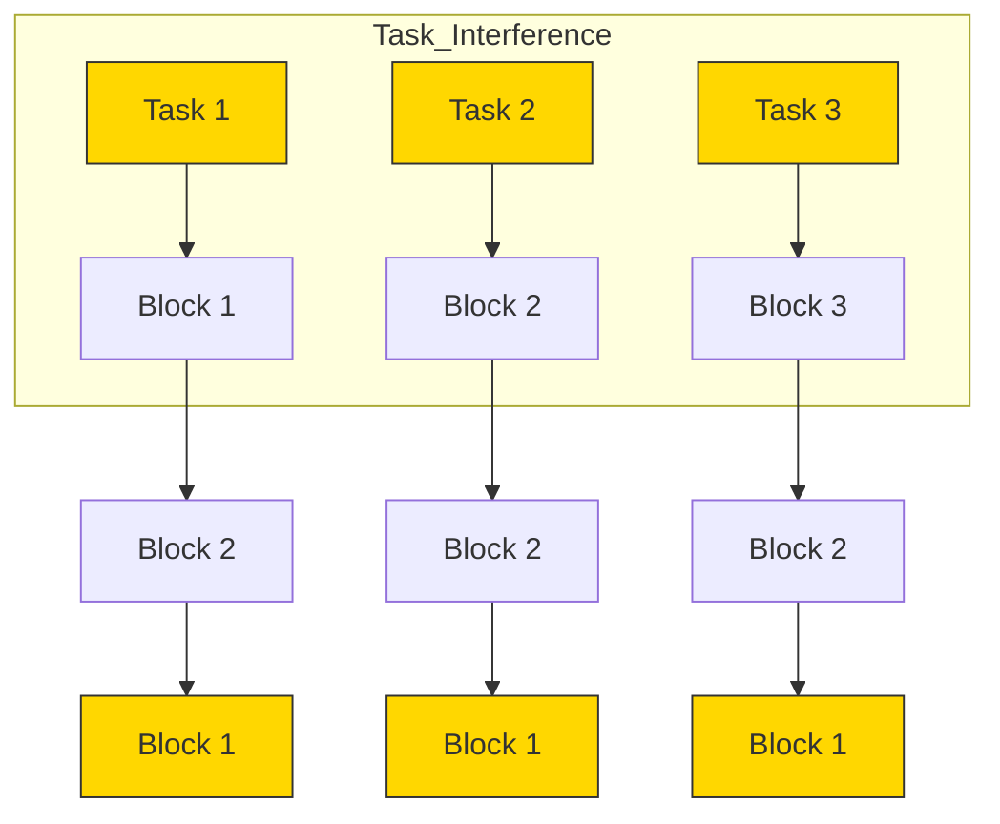
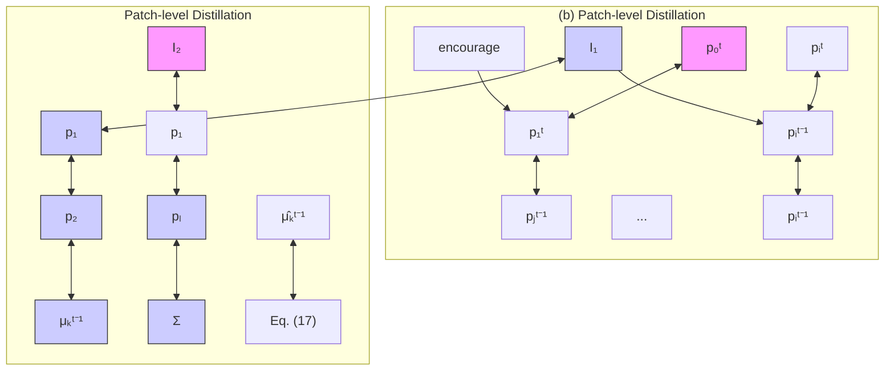
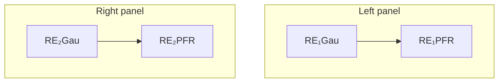

# Dynamic Integration of Task-Specific Adapters for Class Incremental Learning

Jiashuo Li1, Shaokun Wang1 \dagger  , Bo Qian1, Yuhang He2, Xing Wei1, Qiang Wang1, Yihong Gong1,2 \dagger

1 School of Software Engineering, Xi’an Jiaotong University   
2 College of Artificial Intelligence, Xi’an Jiaotong University

{xjtuljs,qb990531,qwang}@stu.xjtu.edu.cn; shaokunwang.xjtu@gmail.com;

heyuhang@xjtu.edu.cn; {weixing,ygong}@mail.xjtu.edu.cn

# Abstract

Non-exemplar Class Incremental Learning (NECIL) enables models to continuously acquire new classes without retraining from scratch and storing old task exemplars, addressing privacy and storage issues. However, the absence of data from earlier tasks exacerbates the challenge of catastrophic forgetting in NECIL. In this paper, we propose a novel framework called Dynamic Integration of task-specific Adapters (DIA), which comprises two key components: Task-Specific Adapter Integration (TSAI) and Patch-Level Model Alignment. TSAI boosts compositionality through a patch-level adapter integration strategy, aggregating richer task-specific information while maintaining low computation costs. Patch-Level Model Alignment maintains feature consistency and accurate decision boundaries via two specialized mechanisms: Patch-Level Distillation Loss (PDL) and Patch-Level Feature Reconstruction (PFR). Specifically, on the one hand, the PDL preserves feature-level consistency between successive models by implementing a distillation loss based on the contributions of patch tokens to new class learning. On the other hand, the PFR promotes classifier alignment by reconstructing old class features from previous tasks that adapt to new task knowledge, thereby preserving well-calibrated decision boundaries. Comprehensive experiments validate the effectiveness of our DIA, revealing significant improvements on NECIL benchmark datasets while maintaining an optimal balance between computational complexity and accuracy.

# 1. Introduction

Class Incremental Learning (CIL) has gained considerable attention within the expansive field of artificial intelligence research [1, 3, 15, 18, 20, 28, 29, 36, 39, 44, 51], offering the potential for models to continuously learn new knowledge while maintaining the knowledge of previously encountered old classes. Replay-based CIL approaches [24, 30, 35, 40, 46, 51] require the storage of exemplars from previous tasks, which presents challenges in terms of memory limitations and privacy concerns. Benefiting from the advances in Pre-Trained Models (PTMs) [4], Non-Exemplar Class Incremental Learning (NECIL) has emerged as a promising alternative, enabling the incremental acquisition of knowledge without the need to maintain a buffer of old class exemplars.


<details>
<summary>flowchart</summary>


</details>

(a) Task interference


<details>
<summary>scatter</summary>

| Model       | Average Accu |
|-------------|--------------|
| DIA         | 58           |
| CPrompt     | 50           |
| CADA-p      | 50           |
| Adam        | 50           |
| DualPrompt  | 80           |
| L2p         | 80           |
| EASE        | 90           |
</details>

(b) GFLOPS versus Accuracy


<details>
<summary>text_image</summary>

c₂
c₃
c₄
c₅
</details>

(c) Distribution Shift:


<details>
<summary>text_image</summary>

c2
c2
c4
c3
c3
c5
c5
c1
</details>

Figure 1. (a) Shared parameter space leads to task interference. (b) High computation costs characterize current PET-based methods. (c) Gaussian-based feature reconstruction may have a significant deviation from the actual feature distribution. c\_i indicates the actual feature distribution of old classes, \hat {c\_i} indicates the feature distribution generated by Gaussian Sampling.

Despite the inherent ability of PTMs to produce generalizable features, which has led to superior performance in the NECIL setting, NECIL remains challenging due to two primary factors. First, as shown in Fig.1 (a), studies [5, 45, 48] that tune a shared parameter space for all tasks are unable to segregate parameters for each task. The mixing of parameters leads to task interference, which in turn causes catastrophic forgetting. Particular PET-based methods [7, 18, 33, 38, 39] isolate task parameters by designing task-specific prompts. However, these methods establish a strong correlation between prompt selection and the class tokens. This tight coupling neglects the rich semantic information embedded in patch tokens and the taskspecific knowledge preserved in the intact old task parameters, thereby undermining the model’s capacity for effective knowledge retention and reproduction in NECIL scenarios. Moreover, these methods, requiring multiple forward propagations, increase computational costs, as shown in Fig.1 (b). We summarize the above issues as the compositionality deficiency.

Second, the absence of exemplars from previous tasks prevents the model from utilizing replay techniques, thereby posing significant challenges in maintaining feature consistency and preserving accurate decision boundaries. Current PET-based methods [7, 33, 38, 39] overlook the necessity of maintaining consistency across incrementally trained models. In incremental learning scenarios, the representations of old task samples will change due to the incorporation of new task knowledge, and this neglect ultimately leads to feature drift in the old task samples. Additionally, these approaches are unable to adapt classifiers to the decision boundary changes introduced by new tasks. Regularization-based approaches [22, 37, 43, 51, 52] that impose constraints on class tokens to maintain feature consistency often result in overly restrictive regularization, hindering the learning for new tasks. Prototype-based approaches [37, 45, 51] leverage Gaussian distributions to generate previous task features and then align classifiers. However, it can lead to inaccurate decision boundaries, as features generated by Gaussian sampling progressively diverge from the actual features as new tasks are introduced, as shown in Fig.1 (c). We attribute the above issues to the model alignment deficiency.

To mitigate the above two challenges, we introduce the Dynamic Integration of task-specific Adapters (DIA) framework, which comprises two components: Task-Specific Adapter Integration (TSAI) and Patch-Level Model Alignment. Specifically, the TSAI module is designed to boost compositionality through a patch-level adapter integration strategy, which provides a more flexible compositional solution while maintaining low computation costs. Moreover, we demonstrate the knowledge retention and reconstruction potential of TSAI on a parameter factorization basis. Building upon these capabilities, we propose a patchlevel model alignment strategy to preserve feature consistency and maintain accurate decision boundaries across tasks. This strategy integrates two fundamental parts: 1) The Patch-Level Distillation Loss (PDL) ensures featurelevel consistency between the old and new models by introducing a distillation loss that regulates the feature shift of patch tokens. PDL evaluates the contribution of patch tokens to the new task learning and then penalizes feature drift in non-contributory tokens to maintain feature consistency. 2) The Patch-Level Feature Reconstruction (PFR) retrieves patch tokens that encapsulate knowledge from prior tasks and combines them with prototypes to reconstruct old class features aligned with the newly learned tasks. These reconstructed features facilitate classifier alignment, ensuring the maintenance of an accurate decision boundary throughout the incremental process.

Comprehensive experiments on four NECIL benchmark datasets demonstrate that our DIA method achieves stateof-the-art (SOTA) performance. Moreover, as shown in Fig.1 (b), our DIA maintains up to a 90% decrease in computational complexity while maintaining SOTA performance. In summary, the main contributions include:

• We propose a novel framework entitled Dynamic Integration of task-specific Adapters (DIA) for the NECIL problem, addressing compositionality and model alignment deficiencies.   
• We introduce the Task-Specific Adapter Integration (TSAI) module to boost compositionality, which employs a patch-level adapter integration strategy. We also demonstrate its knowledge retention and reconstruction capability through parameter factorization analysis.   
• We present a patch-level model alignment strategy based on TSAI: PDL maintains feature-level consistency by regulating feature drift in non-contributory patch tokens. PFR improves classifier alignment by reconstructing old class features aligned with newly learned tasks.   
• Experimental results across four benchmarks demonstrate that our DIA achieves SOTA performance while maintaining an optimal balance between computational complexity and accuracy.

# 2. Related Work

Parameter-Efficient Tuning: As an efficient alternative to full fine-tuning, Adapter Tuning [11] was initially introduced to efficiently transfer large pre-trained models to downstream tasks in NLP tasks. Afterward, methods such as Prompt-Tuning [19, 21] adapt models by inserting learnable tokens explicitly tailored to the new tasks. Following the success of Vision Transformers [4, 26], PET methods have been adapted for visual transfer learning. Notable examples include Visual Prompt Tuning (VPT) [13] and AdapterFormer [2], which apply PET techniques to vision tasks. These methods achieve comparable or superior performance to full fine-tuning while maintaining efficiency. In this paper, we propose a patch-level task adapter integration strategy that enables patch tokens to aggregate richer task information with greater flexibility while maintaining low computational costs.


<details>
<summary>flowchart</summary>

```mermaid
graph TD
    A["Transformer Encoder Block b"] --> B["LayerNorm"]
    A --> C["MHSA"]
    A --> D["LayerNorm"]
    A --> E["X p0 p1 ... pJ ... pL"]
    A --> F["MLP"]
    F --> G["p̃p0"]
    G --> H["+"]
    H --> I["O^t p̃p0 ... p̃pJ ..."]
    I --> J["Σ"]
    J --> K["Eq. (4)"]
    K --> L["Σ"]
    L --> M["×"]
    M --> N["s0^1 s0^2 s0^t"]
    N --> O["×"]
    O --> P["sj^1 sj^2 sj^t"]
    P --> Q["×"]
    Q --> R["s0^1 s0^2 s0^t"]
    R --> S["×"]
    S --> T["sj^1 sj^2 sj^t"]
    T --> U["×"]
    U --> V["s0^1 s0^2 s0^t"]
    V --> W["×"]
    W --> X["sj^1 sj^2 sj^t"]
    X --> Y["×"]
    Y --> Z["s0^1 s0^2 s0^t"]
    Z --> AA["×"]
    AA --> AB["sj^1 sj^2 sj^t"]
    AB --> AC["×"]
    AC --> AD["s0^1 s0^2 s0^t"]
    AD --> AE["×"]
    AE --> AF["s0^1 s0^2 s0^t"]
    AF --> AG["×"]
    AG --> AH["s0^1 s0^2 s0^t"]
    AH --> AI["×"]
    AI --> AJ["s0^1 s0^2 s0^t"]
    AJ --> AK["×"]
    AK --> AL["s0^1 s0^2 s0^t"]
    AL --> AM["×"]
    AM --> AN["s0^1 s0^2 s0^t"]
    AN --> AO["×"]
    AO --> AP["s0^1 s0^2 s0^t"]
    AP --> AQ["×"]
    AQ --> AR["s0^1 s0^2 s0^t"]
    AR --> AS["×"]
    AS --> AT["s0^1 s0^2 s0^t"]
    AT --> AU["×"]
    AU --> AV["s0^1 s0^2 s0^t"]
    AV --> AW["×"]
    AW --> AX["s0^1 s0^2 s0^t"]
    AX --> AY["×"]
    AY --> AZ["s0^1 s0^2 s0^t"]
    AZ --> BA["×"]
    BA --> BB["s0^1 s0^2 s0^t"]
    BB --> BC["×"]
    BC --> BD["s0^1 s0^2 s0^t"]
    BD --> BE["×"]
    BE --> BF["s0^1 s0^2 s0^t"]
    BF --> BG["×"]
    BG --> BH["s0^1 s0^2 s0^t"]
    BH --> BI["×"]
    BI --> BJ["s0^1 s0^2 s0^t"]
    BJ --> BK["×"]
    BK --> BL["s0^1 s0^2 s0^t"]
    BL --> BM["×"]
    BM --> BN["s0^1 s0^2 s0^t"]
    BN --> BO["×"]
    BO --> BP["s0^1 s0^2 s0^t"]
    BP --> BQ["×"]
    BQ --> BR["s0^1 s0^2 s0^t"]
    BR --> BS["×"]
    BS --> BT["s0^1 s0^2 s0^t"]
    BT --> BU["×"]
    BU --> BV["s0^1 s0^2 s0^t"]
    BV --> BW["×"]
    BW --> BX["s0^1 s0^2 s0^t"]
    BX --> BY["×"]
    BY --> BZ["s0^1 s0^2 s0^t"]
    BZ --> CA["×"]
    CA --> CB["s0^1 s0^2 s0^t"]
    CB --> CC["×"]
    CC --> CD["s0^1 s0^2 s0^t"]
    CD --> CE["×"]
    CE --> CF["s0^1 s0^2 s0^t"]
    CF --> CG["×"]
    CG --> CH["s0^1 s0^2 s0^t"]
    CH --> CI["×"]
    CI --> CJ["s0^1 s0^2 s0^t"]
    CJ --> CK["×"]
    CK --> CL["s0^1 s0^2 s0^t"]
    CL --> CM["×"]
    CM --> CN["s0^1 s0^2 s0^t"]
    CN --> CO["×"]
    CO --> CP["s0^1 s0^2 s0^t"]
    CP --> CQ["×"]
    CQ --> CR["s0^1 s0^2 s0^t"]
    CR --> CS["×"]
    CS --> CT["s0^1 s0^2 s0^t"]
    CT --> CU["×"]
    CU --> CV["s0^1 s0^2 s0^t"]
    CV --> CW["×"]
    CW --> CX["s0^1 s0^2 s0^t"]
    CX --> CY["×"]
    CY --> CZ["s0^1 s0^2 s0^t"]
    CZ --> DA["×"]
    DA --> DB["s0^1 s0^2 s0^t"]
    DB --> DC["×"]
    DC --> DD["s0^1 s0^2 s0^t"]
    DD --> DP["×"]
    DP --> DPb[× p̃p₀ ... p̃pJ ... p̃p₀ ... p̃pⱼ ... p̃pⱼ ... p̃pⱼ ... p̃pⱼ ... p̃pⱼ ... p̃pⱼ ... p̃pⱼ ... p̃pⱼ ... p̃pⱼ ... p̃pⱼ ... p̃pⱼ ... p̃pⱼ ... p̃pⱼ ... p̃pⱼ ... p̃pⱼ ... q̃pⱼ ... q̃pⱼ ... q̃pⱼ ... q̃pⱼ ... q̃pⱼ ... q̃pⱼ ... q̃pⱼ ... q̃pⱼ ... q̃pⱼ ... q̃pⱼ ... q̃pⱼ ... q̃pⱼ ... q̃pⱼ ... q̃pⱼ ... q̄pⱼ ... q̄pⱼ ... q̄pⱼ ... q̄pⱼ ... q̄pⱼ ... q̄pⱼ ... q̄pⱼ ... q̄pⱼ ... q̄pⱼ ... q̄pⱼ ... q̄pⱼ ... q̄pⱼ ... q̄pⱼ ... q̄pⱼ ... q̄p_j ... q̄p_j ... q̄p_j ... q̄p_j ... q̄p_j ... q̄p_j ... q̄p_j ... q̄p_j ... q̄p_j ... q̄p_j ... q̄p_j ... q̄p_j ... q̄p_j ... q̄p_j ... q̄p_j ... q̄p_j ... q̄p_j ... q̆p_j ... q̆p_j ... q̆p_j ... q̆p_j ... q̆p_j ... q̆p_j ... q̆p_j ... q̆p_j ... q̆p_j ... q̆p_j ... q̆p_j ... q̆p_j ... q̆p_j ... q̆p_j ... q̆p_j ... q̆p_j ... q̆p_j ...q̆p_j ... q̆p_j ... q̆p_j ... q̆p_j ... q̆p_j...q̆p_j...q̆p_j...q̆p_j...q̆p_j...q̆p_j...q̆p_j...q̆p_j...q̆p_j...q̆p_j...q̆p_j...q̆p_j...q̆p_j...q̆p_j...q̆p_j...q̆p_j...q̆p_j...q̆p_i...q̆p_i...q̆p_i...q̆p_i...q̆p_i...q̆p_i...q̆p_i...q̆p_i...q̆p_i...q̆p_i...q̆p_i...q̆p_i...q̆p_i...q̆p_i...q̆p_i...q̆p_i...q \tilde{X} p_0 \dots p_{j} \dots p_{i} \dots p_{j} \dots p_{i} \dots p_{j} \dots p_{i} \dots p_{j} \dots p_{i} \dots p_{j} \dots p_{i} \dots p_{j} \dots p_{i} \dots p_{j} \dots p_{i} \dots p_{j} \dots p_{i} \dots p_{j} \dots p_{i} \dots p_n \dots p_n \dots p_n \dots p_n \dots p_n \dots p_n \dots p_n \dots p_n \dots p_n \dots p_n \dots p_n \dots p_n \dots p_n \dots p_n \dots p_n \dots p_n \dots p_n \dots p_n \dots p_n \dots p_n \dots p_n \dots p_n \dots p_n \dots p_n \dots p_n \dots p_k \dots p_k \dots p_k \dots p_k \dots p_k \dots p_k \dots p_k \dots p_k \dots p_k \dots p_k \dots p_k \dots p_k \dots p_k \dots p_k \dots p_k \dots p_k \dots p_k \dots p_k \dots p_k \dots p_k \dots p_k \dots p_k \dots p_k \dots p_k \dots p_k \dots p_l \dots p_l \dots p_l \dots p_l \dots p_l \dots p_l \dots p_l \dots p_l \dots p_l \dots p_l \dots p_l \dots p_l \dots p_l \dots p_l \dots p_l \dots p_l \dots p_l \dots p_l \dots p_l \dots p_l \dots p_l \dots p_l \dots p_l \dots p_l \dots p_l \dots p_m\)
```
</details>

(a) Task-Specific Adapter Integration


<details>
<summary>flowchart</summary>


</details>

(c) Patch-level Feature Reconstruction


<details>
<summary>text_image</summary>

p0 CLS token
p1 Patch token
Output of Adapters
Signature vector
Similarity metric
Feature drift
μk^t-1 Prototype
I Output feature
Trainable
Freeze
</details>

Figure 2. Illustration of DIA. (a) Task-Specific Adapter Integration. For incremental task t , we learn a task adapter $\mathcal { A } ^ { t , b }$ and a task signature vector $\tau ^ { t , b } \in \mathcal { R } ^ { d }$ at each transformer block b. Each token is routed to the relevant task adapters through the signature vectors, processed independently, and combined into an integrated, task-informed output. (b) Patch-level Distillation. We promote feature drift in patch tokens that contribute to new task learning while penalizing those that do not, thus regulating the feature shift associated with old tasks. (c) Patch-level Feature Reconstruction. We identify patch tokens that are related to old class knowledge and integrate them with the old class prototype $\mu _ { k } ^ { t - 1 }$ to reconstruct old class feature $\hat { \mu } _ { k } ^ { t - 1 }$ aligned with new tasks.

Non-exemplar Class Incremental Learning NECIL approaches address privacy and memory concerns by eliminating the need for old task exemplars and employing various techniques such as regularization [12, 23, 42], augmentation [14, 50, 51], and model-alignment strategies [8, 27, 37, 41, 51] to maintain model performance across tasks. Particularly, SDC [41] calculates class prototype shifts using feature gaps. LDC [8] uses a forward projector to learn mappings from old to new feature spaces. Currently, PTMbased methods that sequentially adjust the PTM to stream data with new classes are a promising approach for NECIL. Most methods [7, 31, 33, 38, 39] focus on the instance-level ([cls] token-based) prompt selection to segregate task parameters. LAE [5] and ADAM [48] propose unified frameworks for PET methods by model ensemble. C-ADA [6] leverages Continual Adapter Layers and a Scale and Shift Module to learn new tasks. SLCA [45] extends the Gaussian modeling [51] of old task features to rectify classifiers. EASE [49] utilizes adapters to extract task-specific features through multiple forward propagations. In this paper, the proposed DIA framework leverages TSAI to enhance compositionality and incorporates patch-level model alignment to mitigate feature shifts and decision boundary distortions.

# 3. Problem Setup

NECIL involves sequentially learning a set of T tasks, denoted as $\{ \mathcal { T } ^ { t } \} _ { t = 1 } ^ { T }$ , where each task $\mathcal { T } ^ { \bar { t } } = \{ D ^ { t } , C ^ { t } \}$ consists of a current training set $D ^ { t } = \{ ( I _ { i } ^ { t } , y _ { i } ^ { t } ) \} _ { i = 1 } ^ { N ^ { t } }$ 1 and a class label set $C ^ { t } = \{ c _ { k } ^ { t } \} _ { k = 1 } ^ { M ^ { t } }$ . In this context, $I _ { i } ^ { t }$ is the input image,

$y _ { i } ^ { t }$ is the class label for the i-th image belonging to $C ^ { t } , N ^ { t }$ represents the number of images, and $M ^ { t }$ denotes the number of classes in $C ^ { t }$ . There is no overlap between the classes of different tasks, meaning $\forall i , j , C ^ { i } \cap C ^ { j } = \emptyset$ . After training on a task $\mathcal { T } ^ { t }$ , the model is evaluated on all the classes encountered so far, $C ^ { 1 : t } = C ^ { 1 } \cup C ^ { 2 } \cup \cdot \cdot \cdot \cup C ^ { t }$ . Notably, NECIL prohibits storing exemplars from old tasks.

# 4. Methodology

# 4.1. Overview

Fig.2 shows an overview of our DIA framework. At incremental task t , we introduce a task-specific adapter $\mathcal { A } ^ { t , b }$ in parallel with the MLP layer, along with a task signature vector $\tau ^ { t , b }$ into each transformer block b . As shown in $\mathrm { F i g . } 2 \ ( \mathrm { a } )$ , each image token is routed by the signature vectors $[ \tau ^ { i , b } ] _ { i = 1 } ^ { t }$ to relevant adapters. These task-specific adapters independently process the input token, and their outputs are merged using scalars determined by the task signature vectors, yielding an integrated output. At the task t , only $\mathcal { A } ^ { t , b }$ and $\tau ^ { t , b }$ are trainable. Leveraging TSAI’s capacity for knowledge retention and reconstruction, along with the rich information embedded in patch tokens, we introduce a patch-level model alignment mechanism at both the feature and classifier levels. First, as shown in Fig.2 (b), we compute the Patch-Level Distillation Loss (PDL) based on the feature drift between the patch tokens $\mathbf { p } ^ { t }$ and $\mathbf { p } ^ { t - 1 }$ , which are obtained from the model trained on task t and task t-1 , respectively. PDL penalizes the feature drift in patch tokens that do not contribute to the new task learning, thereby preserving the old task knowledge. Second, we propose a Patch-level Feature Reconstruction (PFR) method to reconstruct old class features without exemplars, as shown in Fig.2 (c). We identify patch tokens related to old task knowledge and integrate them with the old task prototypes. The reconstructed features are then used to recalibrate the decision boundaries of the classifier, adapting to the changes in feature distribution.

# 4.2. Task-Specific Adapters Integration

Our TSAI aims to provide a more flexible compositional solution by employing a patch-level adapter integration strategy. To achieve this goal, we learn a task-specific adapter $\bar { \mathcal { A } } ^ { i , b }$ and a task signature vector $\tau ^ { t , b } \in R ^ { d }$ for each incremental task, where d indicates feature dimension, t represents the incremental task id, and b represents the block index. For convenience, we omit block index $b ,$ as the computation is identical across transformer blocks.

Specifically, the task-specific adapter $\mathcal { A } ^ { t }$ is a bottleneck module comprising a down-projection layer $\mathbf { W } _ { \mathrm { d o w n } } \in$ $\mathbb { R } ^ { d \times r }$ , an up-projection layer $\mathbf { W _ { u p } } \in \mathbb { R } ^ { r \times d }$ . This bottleneck module extends and adjusts the feature space by modifying the MLP output through the residual connection, utilizing a scaling vector $\mathrm { \mathbf { s } } ^ { t }$ derived from $\tau ^ { t }$ . For an input \mathbf {X} = {\left [{\mathbf {p}\_j}^\top \right ]}\_{j=0}^{L} \in R^{(L+1) \times d} $\mathbf { X } \ = \ \left[ \mathbf { p } _ { j } ^ { \top } \right] _ { i = 0 } ^ { L } \ \in \ R ^ { ( L + 1 ) \times d }$ , consisting of $L + 1$ image tokens, where $\mathbf { p } _ { 0 } \in \mathbb { R } ^ { d }$ indicates the class token and $\mathbf { p } _ { j } \in \mathbb { R } ^ { d } , j > 0$ denote the patch tokens. The task signature vector $\tau ^ { t }$ assigns scalar $\boldsymbol { s } _ { j } ^ { t }$ to each image token $\mathbf { p } _ { j }$ to evaluate its task relevance:

$$
\tilde {\mathbf {p}} _ {j} ^ {t} = s _ {j} ^ {t} \mathcal {A} ^ {t} (\mathbf {p} _ {j}) = s _ {j} ^ {t} \mathrm{ReLU} (\mathbf {p} _ {j} \mathbf {W} _ {\text { down }}) \mathbf {W} _ {\text { up }}, \tag {1}
$$

$$
s _ {j} ^ {t} = <   \bar {\mathbf {p}} _ {j}, \bar {\boldsymbol {\tau}} ^ {t} >, \mathbf {s} ^ {t} = \left[ s _ {j} ^ {t} \right] _ {j = 0} ^ {L}, \tag {2}
$$

where $\bar { \mathbf p } _ { j } , \bar { \tau } ^ { t }$ represent normalized tensors $\bar { \textbf { p } } = \mathbf { p } / \lVert \mathbf { p } \rVert _ { 2 }$ , $\bar { \pmb { \tau } } ^ { t } = \pmb { \tau } ^ { { \acute { t } } } / \| \pmb { \tau } ^ { t } \| _ { 2 }$ , respectively, and $< \cdot , \cdot >$ represents the dot product.

Subsequently, the output feature $\hat { \mathbf { p } } _ { j }$ for the token $\mathbf { p } _ { j }$ using the adapter $\mathcal { A } ^ { t }$ can be calculated as follows:

$$
\begin{array}{l} \hat {\mathbf {p}} _ {j} = \operatorname{MLP} (\mathbf {p} _ {j}) + \tilde {\mathbf {p}} _ {j} ^ {t} + \mathbf {p} _ {\mathbf {j}} \\ = \mathrm{MLP} (\mathbf {p} _ {j}) + s _ {j} ^ {t} \mathcal {A} ^ {t} (\mathbf {p} _ {j}) + \mathbf {p} _ {j}. \tag {3} \\ \end{array}
$$

For incremental task $t \_ \mathrm { ~ 1 ~ }$ , the output feature $\hat { \mathbf { p } } _ { j }$ of TSAI is integrated from multiple task-specific adapters $\{ \mathcal { A } ^ { i } \} _ { i = 1 } ^ { t }$ . We apply the softmax operation to normalize the scaling vector $[ s _ { j } ^ { i } ] _ { i = 1 } ^ { t }$ for the patch token $\mathbf { p } _ { j }$ , enabling the model to combine the contributions from different adapters while maintaining a balanced and stable output.

$$
\tilde {\mathbf {p}} _ {j} ^ {t} = \sum_ {i = 1} ^ {t} \hat {s} _ {j} ^ {i} \mathcal {A} ^ {i} (\mathbf {p} _ {j}), \tag {4}
$$

$$
\hat {\mathbf {p}} _ {j} = \mathrm{MLP} (\mathbf {p} _ {j}) + \tilde {\mathbf {p}} _ {j} ^ {t} + \mathbf {p} _ {j}, \tag {5}
$$

$$
\mathbf {O} ^ {t} = \left[ \hat {\mathbf {p}} _ {j} ^ {\top} \right] _ {j = 0} ^ {L}, \quad [ \hat {s} _ {j} ^ {i} ] _ {i = 1} ^ {t} = \operatorname{softmax} ([ s _ {j} ^ {i} ] _ {i = 1} ^ {t}), \tag {6}
$$

where $\mathbf { O } ^ { t }$ is the output of TSAI for input \mathbf {X} .

Knowledge Retention and Reconstruction Analysis: We conduct an in-depth analysis of the parameter space for each task-specific adapter, using matrix factorization to demonstrate that our TSAI module can effectively preserve and reproduce knowledge from previous tasks without needing exemplars. In particular, we start with no activation function to describe the knowledge retention mechanism under linear conditions and then extend to nonlinear conditions. We provide a detailed analysis in the supplementary.

To avoid confusion, we define the input token as $\mathbf { p } \in \mathbb { R } ^ { d }$ and the adapter weight as $\mathbf { W } = \mathbf { W } _ { \mathrm { d o w n } } \mathbf { W } _ { \mathrm { u p } } \in \mathbb { R } ^ { d \times d }$ , with a matrix rank of $^ { r } \cdot$ The weight matrix can be decomposed through SVD [16] without information loss:

$$
\mathbf {W} = \mathbf {U} \mathrm{diag} (\sigma) \mathbf {V}, \quad \mathbf {W} = \sum \mathbf {u} _ {i} \sigma_ {i} \mathbf {v} _ {i} ^ {\top}, \tag {7}
$$

$$
\mathbf {U} ^ {\top} = \left[ \mathbf {u} _ {i} ^ {\top} \right] _ {i = 1} ^ {r} \in \mathbb {R} ^ {r \times d}, \mathbf {V} = \left[ \mathbf {v} _ {i} ^ {\top} \right] _ {i = 1} ^ {r} \in \mathbb {R} ^ {r \times d ^ {\prime}}, \tag {8}
$$

where \text {diag}(\sigma ) is a diagonal matrix with singular values $\sigma _ { i }$ on the diagonal. \protect \mathbf {U} is an $d \times r$ orthogonal matrix, with the singular vectors $\mathbf { u } _ { i }$ as its columns. \protect \mathbf {V} is an $\boldsymbol { r } \times \boldsymbol { d } ^ { \prime }$ orthogonal matrix, with the singular vectors $\mathbf { v } _ { i } ^ { \top }$ as its rows.

The output \mathbf {o} can be formulated as:

$$
\begin{array}{l} \mathbf {o} = \mathcal {A} (\mathbf {p}) = \mathbf {W} ^ {\top} \mathbf {p} = \sum (\mathbf {u} _ {i} \sigma_ {i} \mathbf {v} _ {i} ^ {\top}) ^ {\top} \mathbf {p} \\ = \sum \mathbf {v} _ {i} (\sigma_ {i} \mathbf {u} _ {i} ^ {\top} \mathbf {p}) = \sum \rho_ {i} \mathbf {v} _ {i} = \mathbf {V} ^ {\top} g (\mathbf {p}), \tag {9} \\ \end{array}
$$

$$
g (\mathbf {p}) = \mathrm{diag} (\sigma) ^ {\top} \mathbf {U} ^ {\top} \mathbf {p} = [ \rho_ {i} ] _ {i = 1} ^ {r} \in \mathbb {R} ^ {r}. \tag {10}
$$

From the above derivation, it is evident that each task adapter enables the model to learn task-specific “keys” and “values” independently of the input features. The output \mathbf {o} for each input token \mathbf {p} is obtained by weighting the task parameter space basis vectors $\mathbf { v } _ { i }$ through a linear function $g \left( \cdot ; { \mathbf { U } } , \mathrm { d i a g } ( \sigma ) \right)$ , which becomes non-linear in the presence of a ReLU activation. TSAI guarantees that the output discriminative information \mathbf {o} remains within the task subspace, irrespective of the input. This property can be effectively utilized by designing appropriate loss functions to maintain feature consistency under the NECIL setting.

# 4.3. Patch-Level Model Alignment

Due to the limitations of not storing old class exemplars, mainstream NECIL methods either do not perform model alignment or only align the classifier [7, 45, 49]. Based on TSAI’s knowledge retention and reconstruction capabilities, as well as the rich information conveyed by patch tokens, we propose a patch-level distillation loss to maintain feature consistency and a patch-level old class feature reconstruction method to align the classifier.

Patch-Level Distillation Loss: To ensure that new tasks can share and reuse old task knowledge while maintaining consistent feature representations for old tasks, we propose patch-level distillation loss (PDL).

As shown in Fig.2 (b), during the training of task t , we obtain the output features $\mathbf { X } ^ { n }$ and $\mathbf { X } ^ { o }$ from both the current model and the model trained on the previous task t-1 , each consists of $L + 1$ image tokens.

$$
\mathbf {X} ^ {o} = \left[ \mathbf {p} _ {j} ^ {t - 1} ^ {\top} \right] _ {j = 0} ^ {L}, \mathbf {X} ^ {n} = \left[ \mathbf {p} _ {j} ^ {t} ^ {\top} \right] _ {j = 0} ^ {L} \in \mathbb {R} ^ {(L + 1) \times d}, (1 1)
$$

We first compute the contribution of each patch token to the learning of the new task based on the angular similarity:

$$
\alpha_ {\cos} = \frac {\mathbf {p} _ {0} ^ {t} \cdot \mathbf {p} _ {j} ^ {t}}{\| \mathbf {p} _ {0} ^ {t} \| _ {2} \| \mathbf {p} _ {j} ^ {t} \| _ {2}}, \alpha_ {\angle} = \frac {\pi - \arccos (- \alpha_ {\cos})}{\pi}, \tag {12}
$$

where $\alpha _ { \mathrm { c o s } }$ and $\alpha _ { \angle }$ represent the cosine similarity and angular similarity, respectively. We also conduct ablation experiments on different similarity metrics in Table 5.

Afterward, we map patch tokens onto a hypersphere using $L _ { 2 }$ normalization to ensure numerical stability. We measure the feature drifts \mathcal {D} by calculating the distances between the corresponding tokens on the hypersphere, as follows:

$$
\mathcal {D} (\mathbf {p} _ {j} ^ {t}, \mathbf {p} _ {j} ^ {t - 1}) = \| \bar {\mathbf {p}} _ {j} ^ {t} - \bar {\mathbf {p}} _ {j} ^ {t - 1} \| _ {2}. \tag {13}
$$

We allow greater flexibility for patch tokens that contribute significantly to new tasks. For patches that contribute less to new tasks, we align their tokens with the output of the old model to maintain feature consistency with previous tasks. Finally, the PDL loss is defined as:

$$
\mathcal {L} _ {p d l} = \frac {1}{L} \sum_ {j = 1} ^ {L} \alpha_ {\angle} (\mathbf {p} _ {0} ^ {t}, \mathbf {p} _ {j} ^ {t}) \mathcal {D} (\mathbf {p} _ {j} ^ {t}, \mathbf {p} _ {j} ^ {t - 1}). \tag {14}
$$

Patch-Level Feature Reconstruction: As new incremental tasks are learned, the decision boundaries established from old tasks may undergo significant changes [37, 51]. Towards this end, we propose a patch-level feature reconstruction method to generate old class features that adapt to the evolving model, providing better classifier alignment.

Specifically, at each incremental task t - 1 , we compute and st ore a cl ass pro toty p e \bm {\mu }\_{k}^{t-1} $\mu _ { k } ^ { t - 1 }$ for each class k . When learning new incremental tasks, we apply a relative similarity difference $\delta _ { ( k , i , j ) }$ to measure the relevance between patch token $p _ { ( i , j ) }$ and prototype $\mu _ { k } ^ { t - 1 }$ , where $p _ { ( i , j ) }$ indicates the j-th token of $X _ { i }$ within the training batch.

$$
\delta_ {(k, i, j)} = \frac {\alpha_ {\cos} (\boldsymbol {\mu} _ {k} ^ {t - 1} , \mathbf {p} _ {(i , j)}) - \alpha_ {\cos} (\mathbf {p} _ {(i , 0)} , \mathbf {p} _ {(i , j)})}{\alpha_ {\cos} (\boldsymbol {\mu} _ {k} ^ {t - 1} , \mathbf {p} _ {(i , j)}) + \alpha_ {\cos} (\mathbf {p} _ {(i , 0)} , \mathbf {p} _ {(i , j)})}, \tag {15}
$$

$$
\hat {\delta} _ {(k, i, j)} = \left\{ \begin{array}{l l} 0, & \text { if } \delta_ {(k, i, j)} \leq 0 \\ \delta_ {(k, i, j)}, & \text { if } \delta_ {(k, i, j)} > 0 \end{array} , \right. \tag {16}
$$

where $\alpha _ { c o s }$ represents the cosine similarity.

Afterward, we retrieve the patch tokens $\mathbf { p } _ { ( i , j ) }$ whose $\hat { \delta } _ { ( k , i , j ) } > 0$ and integrate them with prototype $\mu _ { k } ^ { t - 1 }$ using the convex combination to generate old task feature $\hat { \mu } _ { k } ^ { t - 1 }$ \hat {\bm {\mu }}\_{k}^{t-1} as follows:

$$
\hat {\boldsymbol {\mu}} _ {k} ^ {t - 1} = \beta \cdot \boldsymbol {\mu} _ {k} ^ {t - 1} + (1 - \beta) \sum_ {i, j} \omega_ {(i, j)} \cdot \mathbf {p} _ {(i, j)}, \tag {17}
$$

$$
\left[ \omega_ {(i, j)} \right] _ {i, j} = \text { softmax } (\left[ \hat {\delta} _ {(k, i, j)} \right] _ {i, j}), \tag {18}
$$

where $\beta$ is a hyperparameter.

In each training batch, we randomly generate old task features through our PFR and align the classifier through the cross-entropy loss $\mathcal { L } _ { C E }$ .

# 4.4. Optimization Objective

We structure the optimization process into two distinct stages: new task learning and classifier alignment. To ensure feature consistency, the objective function for new task learning is defined as follows:

$$
\mathcal {L} _ {o b j} = \mathcal {L} _ {C E} + \lambda \mathcal {L} _ {p d l}, \tag {19}
$$

where \lambda is a hyperparameter to balance the contributions of the two losses.

To further refine the classifier, classifier alignment is executed after new task learning, following the pipeline detailed in [45, 51]. Specifically, during the classifier alignment phase for task t , we randomly select N class prototypes (set to 32 in our implementation), denoted as $\{ \mu _ { k } \} _ { i = 1 } ^ { \bar { N } } , k \in C ^ { 1 : t }$ , within each training batch and generate pseudo-features $\{ \hat { \mu } _ { k } \} _ { i = 1 } ^ { N }$ via the PFR method. These pseudo-features, together with the training samples, are then used as inputs to the classifier, which is subsequently fine-tuned with the cross-entropy loss $\mathcal { L } _ { C E }$ . We provide a more detailed training pipeline in the supplementary material.

# 5. Experiments

In this section, we first provide implementation details, then present the experimental results with analyses, and finally show ablation studies and visualization results.

# 5.1. Implementation Details

Dataset: We conduct experiments on Cifar-100 [17], CUB-200 [34], ImageNet-R [9], and ImageNet-A [10]. These datasets contain typical CIL benchmarks and more challenging datasets with a significant domain gap with ImageNet (i.e., the pre-trained dataset). There are 100 classes in Cifar-100 and 200 classes in CUB-200, ImageNet-R, and ImageNet-A. For all datasets, we follow the class orders in [49].

<table><tr><td rowspan="2">Method</td><td rowspan="2">Params</td><td rowspan="2">Flops</td><td colspan="2">ImageNet-R</td><td colspan="2">ImageNet-A</td><td colspan="2">CUB-200</td><td colspan="2">Cifar-100</td></tr><tr><td> $\mathcal{A}^{10}\uparrow$ </td><td> $\bar{\mathcal{A}}^{10}\uparrow$ </td><td> $\mathcal{A}^{10}\uparrow$ </td><td> $\bar{\mathcal{A}}^{10}\uparrow$ </td><td> $\mathcal{A}^{10}\uparrow$ </td><td> $\bar{\mathcal{A}}^{10}\uparrow$ </td><td> $\mathcal{A}^{10}\uparrow$ </td><td> $\bar{\mathcal{A}}^{10}\upharpoonright$ </td></tr><tr><td>FT</td><td>86M</td><td>17.58B</td><td>20.93</td><td>40.35</td><td>6.03</td><td>16.57</td><td>22.05</td><td>45.67</td><td>22.17</td><td>41.83</td></tr><tr><td>Adam-Ft</td><td>86M</td><td>33.72B</td><td>54.33</td><td>61.11</td><td>48.52</td><td>59.79</td><td>86.09</td><td>90.97</td><td>81.29</td><td>87.15</td></tr><tr><td>SLCA</td><td>86M</td><td>17.58B</td><td>77.42</td><td>82.17</td><td>60.63</td><td>70.04</td><td>84.71</td><td>90.94</td><td>91.26</td><td>94.09</td></tr><tr><td>Adam-Prompt-shallow</td><td>0.04M</td><td>36.28B</td><td>65.79</td><td>72.97</td><td>29.29</td><td>39.14</td><td>85.28</td><td>90.89</td><td>85.04</td><td>89.49</td></tr><tr><td>Adam-Prompt-deep</td><td>0.28M</td><td>36.28B</td><td>72.30</td><td>78.75</td><td>53.46</td><td>64.75</td><td>86.6</td><td>91.42</td><td>83.43</td><td>89.47</td></tr><tr><td>L2P</td><td>0.04M</td><td>35.85B</td><td>72.34</td><td>77.36</td><td>44.04</td><td>51.24</td><td>79.62</td><td>85.76</td><td>82.84</td><td>87.31</td></tr><tr><td>DualPrompt</td><td>0.13M</td><td>33.72B</td><td>69.10</td><td>74.28</td><td>53.19</td><td>61.47</td><td>81.10</td><td>88.23</td><td>83.44</td><td>88.76</td></tr><tr><td>CODA-Prompt</td><td>0.38M</td><td>33.72B</td><td>73.30</td><td>78.47</td><td>52.08</td><td>63.92</td><td>77.23</td><td>81.90</td><td>87.13</td><td>91.75</td></tr><tr><td>ConvPrompt</td><td>0.17M</td><td>17.98B</td><td>77.86</td><td>81.55</td><td>—</td><td>—</td><td>82.44</td><td>85.59</td><td>88.10</td><td>92.39</td></tr><tr><td>CPrompt</td><td>0.25M</td><td>23.62B</td><td>77.15</td><td>82.92</td><td>55.23</td><td>65.42</td><td>80.35</td><td>87.66</td><td>88.82</td><td>92.53</td></tr><tr><td>C-ADA</td><td>0.06M</td><td>17.62B</td><td>73.76</td><td>79.57</td><td>54.10</td><td>65.43</td><td>76.13</td><td>85.74</td><td>88.25</td><td>91.85</td></tr><tr><td>LAE</td><td>0.19M</td><td>35.24B</td><td>72.39</td><td>79.07</td><td>47.18</td><td>58.15</td><td>80.97</td><td>87.22</td><td>85.33</td><td>89.96</td></tr><tr><td>Adam-Adapter</td><td>1.19M</td><td>36.47B</td><td>65.29</td><td>72.42</td><td>48.81</td><td>58.84</td><td>85.84</td><td>91.33</td><td>87.29</td><td>91.21</td></tr><tr><td>EASE</td><td>1.19M</td><td>177.11B</td><td>76.17</td><td>81.73</td><td>55.04</td><td>65.34</td><td>84.65</td><td>90.51</td><td>87.76</td><td>92.35</td></tr><tr><td>InfLoRA</td><td>0.19M</td><td>21.79B</td><td>76.78</td><td>81.42</td><td>52.16</td><td>61.27</td><td>80.78</td><td>89.21</td><td>88.31</td><td>92.57</td></tr><tr><td>DIA (Ours)</td><td>0.17M</td><td>17.91B</td><td>79.03</td><td>85.61</td><td>61.69</td><td>71.58</td><td>86.73</td><td>93.21</td><td>90.80</td><td>94.29</td></tr></table>

Table 1. Experimental results on four CIL benchmarks with 10 incremental tasks. The best results are marked in bold, and the second-best are underlined. We report the accuracy of compared methods with their source code. Params indicates the average trainable parameters in each incremental task. Flops represents the number of floating-point operations required to perform inference on a single image.

Comparison methods: We compare our method with benchmark PTM-based CIL methods in Table 1 and Table 2. These methods are categorized into three groups: (1) Prompt-based methods: L2P [39], DualPrompt [38], CODA-Prompt [33], CPrompt [7], ConvPrompt [31], and Adam-Prompt [47] (2) Adapter-based methods: Adam-Adapter [47], EASE [49], LAE [5], InfLoRA [25], and C-ADA [6]. (3) Finetuning-based methods: SLCA [45] and Adam-Ft [47].

Training details: We adopt ViT-B/16 [4] as the pre-trained model, which is pre-trained on ImageNet-21K [32]. The initial learning rate is set to 0.015 and decays with cosine annealing. We train each task for 20 epochs with a batch size of 32 using Nvidia 3090 GPUs with 24GB of RAM. The down projection of adapters is set to 8 in our main experiments. The hyperparameter $\beta$ and \lambda are set to 0.7 and 0.1, respectively.

Evaluation metric: Following previous papers [5, 49], we denote the model’s accuracy after the t -th incremental task as $A ^ { t }$ and use $\textstyle { \bar { A } } ^ { t } \ = \ { \frac { 1 } { t } } \sum _ { i = 1 } ^ { \bar { t } } A ^ { i }$ t to represent the average accuracy over t incremental tasks. For our evaluation, we specifically focus on two key measurements: $A ^ { T }$ (the accuracy after the final (T -th) incremental task) and $\bar { A } ^ { T }$ (the average accuracy across all T incremental tasks).

# 5.2. Comparison with SOTA Methods

In this section, we evaluate our proposed DIA method on the ImageNet-R, ImageNet-A, CUB-200, and Cifar-100 datasets, equally dividing the classes into 10 incremental tasks. As shown in Table 1, our method achieves SOTA average accuracies of 85.61%, 71.58%, 93.21%, and 94.29% on four benchmark datasets, respectively.

Prompt-based Methods: In comparison to prompt-based approaches, the proposed DIA demonstrates comprehensive improvements. When compared with the current SOTA method CPrompt [7], our DIA exhibits accuracy enhancements ranging from 1.76% to 4.99% across all datasets. Moreover, the DIA requires fewer training parameters (merely 0.17M) and reduces the floating-point operations (FLOPS) per image by 24.17%. ConvPrompt [31] improves inference efficiency by introducing large language models. Our approach, however, offers advantages in both computational efficiency and accuracy across all datasets, notably achieving 4.06% higher average accuracy on ImageNet-R.

Adapter-based Methods: In comparison to adapter-based methods, our DIA still performs exceptionally well. Utilizing only 14.28% of the trainable parameters needed per incremental task, DIA outperforms EASE [49] and Adam [47] across all benchmark datasets. Moreover, DIA only needs 17.91B Flops to infer an image, reducing inference consumption by 90% compared to EASE [49] while improving accuracy. Specifically, DIA surpasses EASE [49] by 3.88%, 6.24%, 1.62%, and 1.94% on ImageNet-R, ImageNet-A, CUB-200, and Cifar-100, respectively. Our notable improvements on ImageNet-R and ImageNet-A underscore that incorporating compositionality and leveraging knowledge from old tasks can significantly enhance the learning of new classes that have a domain gap with the pre-trained data.

Ft-based Methods: Compared to finetuning-based methods, our DIA not only achieves SOTA average accuracy across four datasets but also saves 99.80% of the training parameters required per task compared to SLCA and Adam-Ft. This demonstrates that our proposed DIA strikes an excellent balance between computational efficiency and performance.

<table><tr><td rowspan="2">Method</td><td colspan="2">ImageNet-R</td><td colspan="2">Cifar-100</td></tr><tr><td> $\mathcal{A}^{20} \uparrow$ </td><td> $\bar{\mathcal{A}}^{20} \uparrow$ </td><td> $\mathcal{A}^{20} \uparrow$ </td><td> $\bar{\mathcal{A}}^{20} \uparrow$ </td></tr><tr><td>Adam-Ft</td><td>52.36</td><td>61.72</td><td>81.27</td><td>87.67</td></tr><tr><td>SLCA</td><td>74.63</td><td>79.92</td><td>90.08</td><td>93.85</td></tr><tr><td>Adam-Prompt-shallow</td><td>59.90</td><td>68.02</td><td>84.57</td><td>90.43</td></tr><tr><td>Adam-Prompt-deep</td><td>70.13</td><td>76.91</td><td>82.17</td><td>88.46</td></tr><tr><td>L2P</td><td>69.64</td><td>75.28</td><td>79.93</td><td>85.94</td></tr><tr><td>DualPrompt</td><td>66.61</td><td>72.45</td><td>81.15</td><td>87.87</td></tr><tr><td>CODA-Prompt</td><td>69.96</td><td>75.34</td><td>81.96</td><td>89.11</td></tr><tr><td>ConvPrompt</td><td>74.3</td><td>79.66</td><td>87.25</td><td>91.46</td></tr><tr><td>CPrompt</td><td>74.79</td><td>81.46</td><td>84.57</td><td>90.51</td></tr><tr><td>LAE</td><td>69.86</td><td>77.38</td><td>83.69</td><td>87.86</td></tr><tr><td>Adam-Adapter</td><td>57.42</td><td>64.75</td><td>85.15</td><td>90.65</td></tr><tr><td>EASE</td><td>65.23</td><td>77.45</td><td>85.80</td><td>91.51</td></tr><tr><td>InfLoRA</td><td>71.01</td><td>77.28</td><td>85.80</td><td>91.51</td></tr><tr><td>DIA (Ours)</td><td>76.32</td><td>83.51</td><td>88.74</td><td>93.41</td></tr></table>

Table 2. Experimental results with 20 incremental tasks. The best results are marked in bold, and the second-best are underlined.

<table><tr><td rowspan="2">DIA</td><td rowspan="2">PDL</td><td rowspan="2">PFR</td><td colspan="2">ImageNet-R</td><td colspan="2">Cifar-100</td></tr><tr><td> $\mathcal{A}^{10} \uparrow$ </td><td> $\bar{\mathcal{A}}^{10} \uparrow$ </td><td> $\mathcal{A}^{10} \uparrow$ </td><td> $\bar{\mathcal{A}}^{10} \uparrow$ </td></tr><tr><td></td><td></td><td></td><td>20.93</td><td>40.35</td><td>22.17</td><td>41.83</td></tr><tr><td>√</td><td></td><td></td><td>77.13</td><td>83.87</td><td>88.37</td><td>92.31</td></tr><tr><td>√</td><td>√</td><td></td><td>78.18</td><td>84.55</td><td>89.32</td><td>93.48</td></tr><tr><td>√</td><td></td><td>√</td><td>78.22</td><td>84.25</td><td>89.81</td><td>93.78</td></tr><tr><td>√</td><td>√</td><td>√</td><td>79.03</td><td>85.61</td><td>90.80</td><td>94.29</td></tr></table>

Table 3. Ablation Study on Different Components of the DIA Framework.

# 5.3. Ablation Study

Long Sequence Incremental Analysis: We evaluate the performance of each method under the long sequence setting where datasets are equally divided into 20 tasks with 10 classes/tasks in ImageNet-R and 5 classes/tasks in Cifar-100. As shown in Table 2, our method still maintains excellent performance in terms of $A ^ { 2 0 }$ and $\bar { A } ^ { 2 0 }$ . Our DIA achieves SOTA average accuracies of 83.51% on the ImageNet-R dataset, outperforming the second by 2.05%. Our DIA also achieve comparable results with SLCA on Cifar-100, using only 0.17M/86M parameters.

Component Analysis: Our DIA comprises three main components: 1) Task-Specific Adapter Integration (TSAI), 2) Patch-Level Distillation Loss (PDL), and 3) Patch-Level Feature Reconstruction (PFR). To assess the impact of each component, we perform ablation studies on Cifar-100 and

<table><tr><td rowspan="2">Method</td><td colspan="2">ImageNet-R</td><td colspan="2">Cifar-100</td></tr><tr><td> $\mathcal{A}^{10} \uparrow$ </td><td> $\bar{\mathcal{A}}^{10} \uparrow$ </td><td> $\mathcal{A}^{10} \uparrow$ </td><td> $\bar{\mathcal{A}}^{10} \uparrow$ </td></tr><tr><td>DIA-Gau</td><td>76.07</td><td>83.72</td><td>89.04</td><td>93.51</td></tr><tr><td>DIA-SLCA</td><td>78.37</td><td>84.48</td><td>89.47</td><td>93.79</td></tr><tr><td>DIA-PFR</td><td>79.03</td><td>85.61</td><td>90.80</td><td>94.29</td></tr></table>

Table 4. Performance comparison with different feature reconstruction (FR) methods.

<table><tr><td rowspan="2">Distillation Loss</td><td colspan="2">ImageNet-R</td><td colspan="2">Cifar-100</td></tr><tr><td> $\mathcal{A}^{10} \uparrow$ </td><td> $\bar{\mathcal{A}}^{10} \uparrow$ </td><td> $\mathcal{A}^{10} \uparrow$ </td><td> $\bar{\mathcal{A}}^{10} \uparrow$ </td></tr><tr><td> $\mathcal{L}_{pdl}$  w/  $\alpha_{eu}$ </td><td>76.38</td><td>81.73</td><td>87.42</td><td>92.91</td></tr><tr><td> $\mathcal{L}_{pdl}$  w/  $\alpha_{\cos}$ </td><td>78.28</td><td>85.16</td><td>89.67</td><td>93.88</td></tr><tr><td> $\mathcal{L}_{pdl}$  w/  $\alpha_{\angle}$  (ours)</td><td>79.03</td><td>85.61</td><td>90.80</td><td>94.29</td></tr><tr><td> $\mathcal{L}_{fd}$ </td><td>76.67</td><td>83.82</td><td>88.31</td><td>92.97</td></tr><tr><td> $\mathcal{L}_{pdl}$  w/ cls</td><td>77.01</td><td>83.87</td><td>88.87</td><td>93.02</td></tr><tr><td> $\mathcal{L}_{pdl}$  w/o cls (ours)</td><td>79.03</td><td>85.61</td><td>90.80</td><td>94.29</td></tr></table>

Table 5. Ablation Study on Similarity Metrics in $\mathcal { L } _ { p d l }$ and other distillation methods.

# ImageNet-R.

The first row in Table 3 reports the average and final accuracy of the pre-trained image encoder with a learnable classifier. Adding the TSAI module achieves performance comparable to SOTA on both datasets, showing that patch-level integration reduces task interference and improves new task learning. The third and fourth rows further demonstrate the importance of patch-level model alignment in NECIL, with nearly 1% gains from PDL or PFR integration. Finally, the fifth row confirms that combining compositionality and model alignment yields SOTA results, validating our framework’s effectiveness.

Feature Reconstruction Analysis: We investigate the impact of different pseudo-feature reconstruction methods on classifier alignment. As shown in Table 4, constructing old class features using a Gaussian distribution results in accuracies of 83.72% and 93.51% on ImageNet-R and CIFAR-100, respectively. In contrast, our proposed PFR method leverages rich semantics from patch tokens to achieve average accuracies of 85.61% and 94.29%, outperforming other approaches. This demonstrates the effectiveness of PFR in aligning the classifier with old-class features, leading to more accurate decision boundaries.

We also visualize the pseudo-feature distributions generated by Gaussian sampling and compare them to the actual old class features on new tasks, as shown in Fig.3. After learning the last incremental task, we visualize the feature distribution of the first 20 classes. Fig.3 (a) shows pseudo features generated using a Gaussian distribution, forming two distinct clusters with actual features, highlighting a noticeable disparity. In contrast, Fig.3 (b) displays pseudo features generated by PFR, which closely align with actual features, forming a single cohesive cluster. This further results in a more clearly distinguishable decision boundary, as depicted in Fig.3 (b) and (c), thereby confirming the effectiveness of our proposed feature reconstruction method.


<details>
<summary>scatter</summary>

| Cluster | Label     |
|---------|-----------|
| 1       | RE₁Gau    |
| 2       | RE₂Gau    |
</details>

(a) FR by Gaussian Sampling


<details>
<summary>scatter</summary>

| Cluster | Count |
|---------|-------|
| RE₁^PFR | 120   |
| RE₂^PFR | 80    |
</details>

(b) FR by PFR


<details>
<summary>flowchart</summary>


</details>

(c) Optimize decision boundaries

Figure 3. Visualization of different feature reconstruction methods. Dark-colored triangles represent actual features, while light-colored circles denote pseudo features generated by feature reconstruction (FR) methods. The decision boundaries formed by these pseudo features are also visualized through the background color. $R E ^ { G a u }$ and $R E ^ { P F R }$ indicate regions with inaccurate decision boundaries. The features reconstructed by PFR closely align with the actual features of old classes, resulting in more accurate decision boundaries.   


<details>
<summary>bar</summary>

| β    | Avg  | Last |
| ---- | ---- | ---- |
| 0.30 | 92   | 86   |
| 0.50 | 94   | 89   |
| 0.70 | 95   | 91   |
| 0.90 | 94   | 91   |
</details>

(a) Ablation on hyperparameter


<details>
<summary>line</summary>

| cls | 0.1  | 0.3  | 0.5  | 0.7  | 0.9  |
| --- | ---- | ---- | ---- | ---- | ---- |
| 10  | 99.0 | 99.0 | 99.0 | 99.0 | 99.0 |
| 20  | 98.5 | 98.5 | 98.5 | 98.5 | 98.5 |
| 30  | 97.5 | 97.5 | 97.5 | 97.5 | 97.5 |
| 40  | 96.5 | 96.5 | 96.5 | 96.5 | 96.5 |
| 50  | 95.5 | 95.5 | 95.5 | 95.5 | 95.5 |
| 60  | 94.5 | 94.5 | 94.5 | 94.5 | 94.5 |
| 70  | 93.5 | 93.5 | 93.5 | 93.5 | 93.5 |
| 80  | 92.5 | 92.5 | 92.5 | 92.5 | 92.5 |
| 90  | 91.5 | 91.5 | 91.5 | 91.5 | 91.5 |
| 100 | 91.0 | 91.0 | 91.0 | 91.0 | 91.0 |
</details>

(b) Ablation on hyperparameter   
Figure 4. Ablation experiments on hyperparameters $\beta$ and \lambda conducted on the CIFAR-100 dataset.

PDL Ablation: We explore different similarity metrics to evaluate patch token contributions to new task learning and their impacts on PDL. Specifically, we investigate Euclidean distance $( \alpha _ { \mathrm { e u } } )$ [43], cosine similarity $( \alpha _ { \mathrm { c o s } } )$ , and angular similarity $( \alpha _ { \angle } )$ as shown in Table 5. The experimental results indicate angular similarity outperforms others, achieving SOTA results on both datasets. In contrast, Euclidean distance performs the worst, with a significant accuracy drop. We attribute this poor performance to the numerical instability of the Euclidean distance, which is more sensitive to variations in the numerical range and more prone to outliers.

Additionally, ablation experiments on traditional distillation loss are presented. In Table 5 $; , \mathcal { L } _ { f d } [ 3 7 , 5 1 , 5 2 ]$ refers

to applying L1 constraints on all image tokens, while $\mathcal { L } _ { p d l }$ w/ cls [43] applies the PDL constraint to both the class and patch tokens. The results show that our proposed PDL offers a better trade-off between stability (regularization of feature shift) and plasticity (ability to learn new tasks).

Hyperparameter Ablation We conduct ablation studies for the hyperparameters \beta and \lambda in Fig.4. As depicted in the figure, larger \lambda which results in greater regularization hinders the learning process. Small \beta may lead to inaccurate classifier alignment. Therefore, we suggest the optimal hyperparameter combination of $\beta = 0 . 7$ and \lambda = 0.1 .

# 6. Conclusion

In this paper, we propose a novel framework called Dynamic Integration of task-specific Adapters (DIA), which consists of Task-Specific Adapter Integration (TSAI) and Patch-Level Model Alignment. First, the TSAI module enhances compositionality through a patch-level adapter integration mechanism, minimizing task interference while preserving old task knowledge. Afterward, the Patch-level Model Alignment maintains feature consistency and accurate decision boundaries via a patch-level distillation loss and a patch-level feature reconstruction method, respectively. 1) Our PDL preserves feature-level consistency between successive models by implementing a distillation loss based on the contribution of patch tokens to new class learning. 2) Our PFR facilitates accurate classifier alignment by reconstructing features from previous tasks that adapt to new task knowledge. We evaluate our DIA on benchmark datasets, in terms of performance comparisons, ablation, and visualization, demonstrating its effectiveness.

# 7. Acknowledgment

This work was supported by the National Key Research and Development Project of China (Grant 2020AAA0105600), the National Natural Science Foundation of China (Grant No. U21B2048), Shenzhen Key Technical Projects (Grant CJGJZD2022051714160501) and Natural Science Foundation of Shaanxi Province 2024JC-YBQN-0637.

# References

[1] Jacopo Bonato, Francesco Pelosin, Luigi Sabetta, and Alessandro Nicolosi. Mind: Multi-task incremental network distillation. In Proceedings of the AAAI Conference on Artificial Intelligence, pages 11105–11113, 2024. 1   
[2] Shoufa Chen, Chongjian Ge, Zhan Tong, Jiangliu Wang, Yibing Song, Jue Wang, and Ping Luo. Adaptformer: Adapting vision transformers for scalable visual recognition. In Advances in Neural Information Processing Systems, pages 16664–16678, 2022. 2   
[3] Thomas De Min and et al. On the effectiveness of layernorm tuning for continual learning in vision transformers. In Proc. ICCVW, 2023. 1   
[4] Alexey Dosovitskiy, Lucas Beyer, Alexander Kolesnikov, Dirk Weissenborn, Xiaohua Zhai, Thomas Unterthiner, Mostafa Dehghani, Matthias Minderer, Georg Heigold, Sylvain Gelly, Jakob Uszkoreit, and Neil Houlsby. An image is worth 16x16 words: Transformers for image recognition at scale. In International Conference on Learning Representations, 2020. 1, 2, 6   
[5] Qiankun Gao, Chen Zhao, Yifan Sun, Teng Xi, Gang Zhang, Bernard Ghanem, and Jian Zhang. A unified continual learning framework with general parameter-efficient tuning. In Proceedings of the IEEE/CVF International Conference on Computer Vision (ICCV), pages 11449–11459, 2023. 1, 3, 6   
[6] Xinyuan Gao, Songlin Dong, Yuhang He, Qiang Wang, and Yihong Gong. Beyond prompt learning: Continual adapter for efficient rehearsal-free continual learning, 2024. 3, 6   
[7] Zhanxin Gao, Jun Cen, and Xiaobin Chang. Consistent prompting for rehearsal-free continual learning. In Proceedings of the IEEE/CVF Conference on Computer Vision and Pattern Recognition (CVPR), pages 28463–28473, 2024. 2, 3, 4, 6   
[8] Alex Gomez-Villa and et al. Exemplar-free continual representation learning via learnable drift compensation. In Proc. ECCV, 2025. 3   
[9] Dan Hendrycks, Steven Basart, Norman Mu, Saurav Kadavath, Frank Wang, Evan Dorundo, Rahul Desai, Tyler Zhu, Samyak Parajuli, Mike Guo, Dawn Song, Jacob Steinhardt, and Justin Gilmer. The many faces of robustness: A critical analysis of out-of-distribution generalization. In IEEE/CVF International Conference on Computer Vision, pages 8320– 8329, 2021. 5   
[10] Dan Hendrycks, Kevin Zhao, Steven Basart, Jacob Steinhardt, and Dawn Song. Natural adversarial examples. In 2021 IEEE/CVF Conference on Computer Vision and Pattern Recognition, pages 15257–15266, 2021. 5

[11] Neil Houlsby, Andrei Giurgiu, Stanislaw Jastrzebski, Bruna Morrone, Quentin De Laroussilhe, Andrea Gesmundo, Mona Attariyan, and Sylvain Gelly. Parameter-efficient transfer learning for nlp. In Proceedings of the International Conference on Machine Learning, pages 2790–2799, 2019. 2   
[12] Libo Huang, Yan Zeng, Chuanguang Yang, Zhulin An, Boyu Diao, and Yongjun Xu. etag: Class-incremental learning via embedding distillation and task-oriented generation. In Proceedings of the AAAI Conference on Artificial Intelligence, pages 12591–12599, 2024. 3   
[13] Menglin Jia, Luming Tang, Bor-Chun Chen, Claire Cardie, Serge Belongie, Bharath Hariharan, and Ser-Nam Lim. Visual prompt tuning. In Computer Vision – ECCV, pages 709– 727, 2022. 2   
[14] Taehoon Kim, Jaeyoo Park, and Bohyung Han. Cross-class feature augmentation for class incremental learning. In Proceedings of the AAAI Conference on Artificial Intelligence, pages 13168–13176, 2024. 3   
[15] Youngeun Kim and et al. One-stage prompt-based continual learning. In Proc. ECCV, 2024. 1   
[16] V. Klema and A. Laub. The singular value decomposition: Its computation and some applications. IEEE Transactions on Automatic Control, 25(2):164–176, 1980. 4   
[17] Alex Krizhevsky and Geoffrey Hinton. Learning multiple layers of features from tiny images. Technical Report 0, Technical report, University of Toronto / University of Toronto, 2009. 5   
[18] Muhammad Rifki Kurniawan, Xiang Song, Zhiheng Ma, Yuhang He, Yihong Gong, Yang Qi, and Xing Wei. Evolving parameterized prompt memory for continual learning. In Proceedings of the AAAI Conference on Artificial Intelligence, pages 13301–13309, 2024. 1, 2   
[19] Brian Lester, Rami Al-Rfou, and Noah Constant. The power of scale for parameter-efficient prompt tuning. In Proceedings of the Conference on Empirical Methods in Natural Language Processing, pages 3045–3059, 2021. 2   
[20] Depeng Li, Tianqi Wang, Junwei Chen, Qining Ren, Kenji Kawaguchi, and Zhigang Zeng. Towards continual learning desiderata via hsic-bottleneck orthogonalization and equiangular embedding. In Proceedings of the AAAI Conference on Artificial Intelligence, pages 13464–13473, 2024. 1   
[21] Xiang Lisa Li and Percy Liang. Prefix-tuning: Optimizing continuous prompts for generation. In Proceedings of the Annual Meeting of the Association for Computational Linguistics and the International Joint Conference on Natural Language Processing (Volume 1: Long Papers), pages 4582– 4597, 2021. 2   
[22] Zhizhong Li and Derek Hoiem. Learning without forgetting. IEEE Transactions on Pattern Analysis and Machine Intelligence, 40(12):2935–2947, 2018. 2   
[23] Zhizhong Li and Derek Hoiem. Learning without forgetting. IEEE Transactions on Pattern Analysis and Machine Intelligence, 40(12):2935–2947, 2018. 3   
[24] Zhizhong Li and Derek Hoiem. Learning without forgetting. IEEE Transactions on Pattern Analysis and Machine Intelligence, 40(12):2935–2947, 2018. 1   
[25] Yan-Shuo Liang and Wu-Jun Li. Inflora: Interference-free low-rank adaptation for continual learning. In IEEE/CVF

Conference on Computer Vision and Pattern Recognition, CVPR 2024, Seattle, WA, USA, June 16-22, 2024, pages 23638–23647. IEEE, 2024. 6   
[26] Ze Liu, Yutong Lin, Yue Cao, Han Hu, Yixuan Wei, Zheng Zhang, Stephen Lin, and Baining Guo. Swin transformer: Hierarchical vision transformer using shifted windows. In IEEE/CVF International Conference on Computer Vision (ICCV), pages 9992–10002, 2021. 2   
[27] Fan Lyu and et al. Overcoming domain drift in online continual learning. arXiv:2405.09133, 2024. 3   
[28] Bo Qian, Zhenhuan Wei, Jiashuo Li, and Xing Wei. Reliaavatar: A robust real-time avatar animator with integrated motion prediction. In Proceedings of the Thirty-Third International Joint Conference on Artificial Intelligence, IJCAI-24, pages 3124–3132. International Joint Conferences on Artificial Intelligence Organization, 2024. Main Track. 1   
[29] Zhongzheng Qiao, Quang Pham, Zhen Cao, Hoang H Le, Ponnuthurai N Suganthan, Xudong Jiang, and Savitha Ramasamy. Class-incremental learning for time series: Benchmark and evaluation. In Proceedings of the 30th ACM SIGKDD Conference on Knowledge Discovery and Data Mining, pages 5613–5624, 2024. 1   
[30] Sylvestre-Alvise Rebuffi, Alexander Kolesnikov, Georg Sperl, and Christoph H. Lampert. icarl: Incremental classifier and representation learning. In Proceedings of the IEEE/CVF Conference on Computer Vision and Pattern Recognition (CVPR), pages 5533–5542, 2017. 1   
[31] Anurag Roy, Riddhiman Moulick, Vinay K. Verma, Saptarshi Ghosh, and Abir Das. Convolutional prompting meets language models for continual learning. In Proceedings of the IEEE/CVF Conference on Computer Vision and Pattern Recognition, pages 23616–23626, 2024. 3, 6   
[32] Olga Russakovsky, Jia Deng, Hao Su, Jonathan Krause, Sanjeev Satheesh, Sean Ma, Zhiheng Huang, Andrej Karpathy, Aditya Khosla, Michael Bernstein, Alexander C. Berg, and Li Fei-Fei. Imagenet large scale visual recognition challenge. International Journal of Computer Vision, 115(3):211–252, 2015. 6   
[33] James Seale Smith, Leonid Karlinsky, Vyshnavi Gutta, Paola Cascante-Bonilla, Donghyun Kim, Assaf Arbelle, Rameswar Panda, Rogerio Feris, and Zsolt Kira. Coda-prompt: Continual decomposed attention-based prompting for rehearsal-free continual learning. In Proceedings of the IEEE/CVF Conference on Computer Vision and Pattern Recognition (CVPR), pages 11909–11919, 2023. 2, 3, 6   
[34] Catherine Wah, Steve Branson, Peter Welinder, Pietro Perona, and Serge Belongie. The Caltech-UCSD Birds-200- 2011 Dataset. California Institute of Technology, 2011. 5   
[35] Fu-Yun Wang, Da-Wei Zhou, Han-Jia Ye, and De-Chuan Zhan. Foster: Feature boosting and compression for classincremental learning. In Computer Vision – ECCV, pages 398–414. Springer Nature Switzerland, 2022. 1   
[36] Shaokun Wang, Weiwei Shi, Songlin Dong, Xinyuan Gao, Xiang Song, and Yihong Gong. Semantic knowledge guided class-incremental learning. IEEE Transactions on Circuits and Systems for Video Technology, 33(10):5921–5931, 2023. 1

[37] Shaokun Wang, Weiwei Shi, Yuhang He, Yifan Yu, and Yihong Gong. Non-exemplar class-incremental learning via adaptive old class reconstruction. In Proceedings of the ACM International Conference on Multimedia, page 4524–4534, New York, NY, USA, 2023. Association for Computing Machinery. 2, 3, 5, 8   
[38] Zifeng Wang, Zizhao Zhang, Sayna Ebrahimi, Ruoxi Sun, Han Zhang, Chen-Yu Lee, Xiaoqi Ren, Guolong Su, Vincent Perot, Jennifer Dy, and Tomas Pfister. Dualprompt: Complementary prompting for rehearsal-free continual learning. In Computer Vision – ECCV, pages 631–648, 2022. 2, 3, 6   
[39] Zifeng Wang, Zizhao Zhang, Chen-Yu Lee, Han Zhang, Ruoxi Sun, Xiaoqi Ren, Guolong Su, Vincent Perot, Jennifer Dy, and Tomas Pfister. Learning to prompt for continual learning. In Proceedings of the IEEE/CVF Conference on Computer Vision and Pattern Recognition (CVPR), pages 139–149, 2022. 1, 2, 3, 6   
[40] Shipeng Yan, Jiangwei Xie, and Xuming He. Der: Dynamically expandable representation for class incremental learning. In Proceedings of the IEEE/CVF Conference on Computer Vision and Pattern Recognition (CVPR), pages 3013– 3022, 2021. 1   
[41] Lu Yu and et al. Semantic drift compensation for classincremental learning. In Proc. CVPR, 2020. 3   
[42] Lu Yu, Bartłomiej Twardowski, Xialei Liu, Luis Herranz, Kai Wang, Yongmei Cheng, Shangling Jui, and Joost van de Weijer. Semantic drift compensation for class-incremental learning. In Proceedings of the IEEE/CVF Conference on Computer Vision and Pattern Recognition (CVPR), pages 6980–6989, 2020. 3   
[43] Jiang-Tian Zhai, Xialei Liu, Lu Yu, and Ming-Ming Cheng. Fine-grained knowledge selection and restoration for nonexemplar class incremental learning. Proceedings of the AAAI Conference on Artificial Intelligence, 38(7):6971– 6978, 2024. 2, 8   
[44] Jiang-Tian Zhai, Xialei Liu, Lu Yu, and Ming-Ming Cheng. Fine-grained knowledge selection and restoration for nonexemplar class incremental learning. Proceedings of the AAAI Conference on Artificial Intelligence, 38(7):6971– 6978, 2024. 1   
[45] Gengwei Zhang, Liyuan Wang, Guoliang Kang, Ling Chen, and Yunchao Wei. Slca: Slow learner with classifier alignment for continual learning on a pre-trained model. In Proceedings of the IEEE/CVF International Conference on Computer Vision (ICCV), pages 19091–19101, 2023. 1, 2, 3, 4, 5, 6   
[46] Da-Wei Zhou, Qi-Wei Wang, Han-Jia Ye, and De-Chuan Zhan. A model or 603 exemplars: Towards memory-efficient class-incremental learning, 2023. 1   
[47] Da-Wei Zhou, Zi-Wen Cai, Han-Jia Ye, De-Chuan Zhan, and Ziwei Liu. Revisiting class-incremental learning with pretrained models: Generalizability and adaptivity are all you need. International Journal of Computer Vision, 2024. 6   
[48] Da-Wei Zhou, Hai-Long Sun, Jingyi Ning, Han-Jia Ye, and De-Chuan Zhan. Continual learning with pre-trained models: A survey. In IJCAI, 2024. 1, 3   
[49] Da-Wei Zhou, Hai-Long Sun, Han-Jia Ye, and De-Chuan Zhan. Expandable subspace ensemble for pre-trained model-

based class-incremental learning. In Proceedings of the IEEE/CVF Conference on Computer Vision and Pattern Recognition (CVPR), pages 23554–23564, 2024. 3, 4, 5, 6   
[50] Fei Zhu, Zhen Cheng, Xu-yao Zhang, and Cheng-lin Liu. Class-incremental learning via dual augmentation. In Advances in Neural Information Processing Systems, pages 14306–14318, 2021. 3   
[51] Fei Zhu, Xu-Yao Zhang, Chuang Wang, Fei Yin, and Cheng-Lin Liu. Prototype augmentation and self-supervision for incremental learning. In Proceedings of the IEEE/CVF Conference on Computer Vision and Pattern Recognition (CVPR), pages 5871–5880, 2021. 1, 2, 3, 5, 8   
[52] Kai Zhu, Wei Zhai, Yang Cao, Jiebo Luo, and Zheng-Jun Zha. Self-sustaining representation expansion for nonexemplar class-incremental learning. In 2022 IEEE/CVF Conference on Computer Vision and Pattern Recognition (CVPR), pages 9286–9295, 2022. 2, 8