# Lark: Low-Rank updates after knowledge localization for Few-shot Class-Incremental Learning

Jinxin Shi1, Jiabao Zhao2\*, Yifan Yang3, Xingjiao Wu1, Jiawen Li1, Liang He1\* 1East China Normal University 2Donghua University 3Transwarp Technology (Shanghai) Co., Ltd jinxinshi@stu.ecnu.edu.cn, jbzhao@dhu.edu.cn, yifan.yang@transwarp.io xjwu@pharm.ecnu.edu.cn, jwli@stu.ecnu.edu.cn, lhe@cs.ecnu.edu.cn

# Abstract

For Few-Shot Class-Incremental Learning (FSCIL), direct fine-tuning causes significant parameter shifts, resulting in catastrophic forgetting and increased resource consumption. While, freezing the pre-trained backbone exacerbates the inconsistency between the backbone and the evolving classifier. To overcome these challenges, we introduce a method called Low-Rank updates after knowledge localization (Lark). In the knowledge localization phase, the Fisher Information Matrix is calculated to measure the sensitivity of parameters in different layers to previously acquired knowledge. This phase ultimately identifies the parameters within the model that are most suitable for learning new knowledge. In the subsequent incremental editing phase, a low-rank incremental update strategy is applied. This strategy ensures that the model parameter updates adhere to a Rank-One matrix structure. By doing so, it minimizes alterations to the original parameters, thereby enabling the model to integrate new knowledge while retaining as much of the previous knowledge as possible. Extensive experimental results demonstrate that the Lark method achieves significant performance improvements on the CIFAR100, mini-ImageNet, and CUB200 datasets, surpassing current state-of-the-art methods.

# 1. Introduction

Few-Shot Class-Incremental Learning (FSCIL) aims to enable models to continuously acquire new knowledge in dynamic environments. In this scenario, the model faces challenges related to empirical risk minimization [51], where insufficient data hinder the model’s ability to learn compre-

scatter

| Panel | Description                          | X-Axis Label                     | Y-Axis Label                     |
|-------|--------------------------------------|----------------------------------|----------------------------------|
| Left   | M_ori(x; W_ori): x → y_old              | x→y_old                          | x→y_all                          |
| Left   | M_reg(x; W_reg): x → y_all             | ΔW_reg = W_reg - W_orl           | ΔW_reg = W_reg - W_reg          |
| Right  | M_ori(x; W_orl): x → y_old              | x→y_old                          | x→y_all                          |
| Right  | M_ow(x; W_ow): x → y_all             | ΔW_low = W_low - W_orl         | ΔW_low = W_low - W_orl         |

Figure 1. Conceptual illustration. The left panel depicts the space under regular training, whereas the right panel displays the space following Rank-One matrix updates. Notably, the Rank-One matrix updates $( \Delta W _ { l o w } )$ exhibit higher precision compared to those produced by regular training $( \Delta W _ { r e g } )$ .

hensive knowledge representations. Moreover, there exists the stability-plasticity dilemma [16, 36]. Specifically, when the model learns new knowledge (plasticity), it may result in forgetting previously acquired knowledge. Conversely, overemphasizing the retention of old knowledge (stability) can limit the model’s ability to learn new knowledge.

To address these challenges, existing FSCIL methods have explored various directions, such as meta-learning [7, 38], replaying old samples [22, 29], and enhancing feature representations [1, 37, 56]. However, the vast majority of these works are based on small-scale models such as convolutional neural networks. When Transformer models (e.g., ViTs) are introduced into FSCIL scenarios, the aforementioned challenges become even more severe.

On one hand, in ViTs, classification predictions rely on global attention interaction between the CLS token and all patch tokens, which results in classifier-only optimization methods disrupting the cognitive consistency between the backbone and the classifier [53, 61]. On the other hand, due to the massive number of parameters in ViT models and the lack of the inherent inductive bias of convolutional networks, directly fine-tuning with only a few incremental samples is more prone to overfitting and representation drift [5]. These suggest that effective adaptation in few-shot scenarios demands not only accurately identifying the subset of parameters best suited for acquiring new knowledge, but also making minimal adjustments to the parameter distribution to preserve the essential pre-trained knowledge. Therefore, we propose Lark, a method that first identifies parameters suitable for fine-tuning and then makes subtle adjustments to those selected parameters.

Our approach is divided into two main stages: Knowledge Localization and Incremental Editing. During the Knowledge Localization stage, our goal is to identify the model components most suitable for incremental learning. We achieve this by leveraging the Fisher Information Matrix [17, 18] to measure the impact of each component on the model’s output. Analyzing the Fisher Matrix enables us to pinpoint parameters that have a minimal contribution to the retention of learned knowledge. However, given the vast number of parameters in large-scale vision models, directly analyzing all parameters would incur prohibitive computational and memory costs [30, 44]. To address this issue, we introduce an equivalent substitution of hidden states as an indirect metric, reducing computational complexity and improving the efficiency of the localization process.

After identifying the parameters suitable for editing, we employ an incremental editing method based on Rank-One [4, 21] matrix to optimize these parameters. Specifically, given a parameter matrix W , we update it by adding an outer product matrix of rank one. This low-rank update introduces new knowledge while minimally perturbing the parameter space (as shown in Figure 1.), thereby preserving the model’s overall structure [11, 15]. We summarize the contributions of this work as follows:

• We propose Lark, a method that locates the model parameters most suitable for learning new knowledge and updates them using a low-rank matrix. It can be used for FSCIL in large visual models.   
To mitigate the high computational cost of gradient calculations over numerous parameters, we use the information contained in hidden states to reflect and assess the importance of parameters across different layers.   
• We analyze the information encoding process within the MLP and MHSA modules, clarifying the significance of updating different weight matrices in these modules.   
Our method demonstrates superior performance compared to previous state-of-the-art methods across three datasets. Additionally, we analyze and validate the proposed method’s effectiveness on other visual tasks.

# 2. Related Work

Few-Shot Class-Incremental Learning. FSCIL aims to enable models to continually learn in few-shot scenarios, and numerous studies have explored this from various perspectives [40, 46, 55]. MetaFSCIL [7] addresses data imbalance between base and incremental sessions by constructing multi-stage pseudo-incremental tasks during the base session. Meta-learning methods like FSLL [33] resist overfitting by selectively updating parameters, while Pseudo-Frequency Refinement (PFR) [38] introduces an architecture enhancing ability for fine-grained object recognition. However, these methods primarily focus on adaptability and often neglect improving representation capacity.

To address this limitation, some works train robust pretrained models [52] during the base session and integrate them with prototype classifiers for incremental learning. CLOSER [37] ensures good inter-class separability through extensive contrastive learning on base class data, using mean vectors as classification prototypes. OrCo [1] adjusts class prototype distributions via orthogonal constraints, enabling incremental classes to align with the original feature space. However, a static pre-trained model cannot consistently align with a classifier that continuously evolves during incremental sessions [27, 53]. Thus, we argue that further optimization of the pre-trained model is necessary to maintain alignment with the evolving classifier.

Global optimization of pre-trained models is undesirable, as it cause forgetting of prior knowledge and overfitting to new classes [39]. EWC [18] proposes evaluating parameter importance through gradient, noting that different parameters vary in importance for task cognition. Building on this, WaRP [17] dynamically adjusts parameter weights using rotation in weight space, effectively adapting to new knowledge while preserving old knowledge. However, computing gradients for all parameters in large models is inefficient [2, 12]. Therefore, we assess parameter importance using the hidden states of each layer.

Model Editing. ME aims to modify pre-trained models to retain existing knowledge while integrating new information. Mainstream approaches typically employ low-rank matrix update strategies. For instance, ROME [35] identifies parameter regions associated with specific knowledge via causal mediation analysis and applies precise low-rank updates. Similarly, PEMT [25] highlights the importance of Multi-Head Self-Attention (MHSA), introducing low-rank updates into MHSA modules to improve the integration of new knowledge. We further analyzed the roles of Multi-Layer Perceptrons (MLP) and MHSA in visual tasks and refined model editing methods accordingly. Other studies [43, 49] utilize low-rank properties for continual learning by performing gradient updates orthogonal to the subspace of previous tasks, thereby mitigating catastrophic forgetting. WaRP [17] preserves existing knowledge within a smaller low-rank matrix, allowing the model to primarily accommodate new information. However, large-scale pre-trained models generally store substantial old knowledge. Thus, we argue for preserving existing knowledge to the greatest extent possible and representing new knowledge through a low-rank matrix.

# 3. Method

# 3.1. Preliminaries

FSCIL Setting. Following the mainstream FSCIL setting [46], in which the training process is divided into $T + 1$ sessions $\{ D _ { b a s e } , D _ { 1 } , . . . , D _ { T } \}$ with corresponding disjoint label sets $\{ C _ { b a s e } , C _ { 1 } , . . . , C _ { T } \}$ . The first session $D _ { b a s e }$ contains a large training dataset. The goal of FSCIL is to recognize the incremental dataset $D _ { t }$ during the incremental step t while maintaining a good discriminative ability for the already learned classes, which can be represented as follows:

$$
\mathcal {F} _ {t} (x) = \left\{ \begin{array}{l l} y & \text { if } x \in D _ {t} \\ \mathcal {F} _ {t - 1} (x) & \text { if } x \notin D _ {t} \end{array} , \right. \tag {1}
$$

where $\mathcal { F } _ { t }$ is the model after incremental editing at stage t.

Specifically, the model $\mathcal { F }$ is composed of a feature extractor $f _ { \theta } ( \cdot )$ , and a classifier $g _ { \phi } ( \cdot )$ . The feature extractor $f _ { \theta } ( \cdot ) : X \to Z$ maps an input x to a feature vector $z =$ $f _ { \boldsymbol { \theta } } ( \boldsymbol { x } )$ in the feature space Z. The classifier $g _ { \phi } ( \cdot ) : Z \to Y$ then produces the class prediction. Notably, in this work, $g _ { \phi } ( \cdot )$ is a Nearest Neighbor Classifier (See Section 6.1 of the supplement) that remains unaffected by updates to $f _ { \theta } ( \cdot )$ . Hidden State. How can we identify the differences in the perception of learned knowledge by different parameters? A straightforward and effective method is to compute the gradients of the objective function with respect to different parameters [17, 18]. However, for models with numerous parameters, calculating gradients directly is computationally inefficient [12, 23]. Instead, the hidden states generated dynamically during inference reflect each layer’s contribution to the current task more effectively [34, 45].

The hidden states of the sample in the l-th layer of the encoder include the output of the Multi-Head Self-Attention mechanism (MHSA), denoted as $h _ { a } ^ { ( l ) }$ , and the output of the Multi-Layer Perceptron (MLP), denoted as $h _ { m } ^ { ( l ) }$ :

$$
\begin{array}{l} h _ {a} ^ {(l)} = [ z _ {a} ^ {(l)}; p _ {a, 1} ^ {(l)}; p _ {a, 2} ^ {(l)}; \dots ; p _ {a, N} ^ {(l)} ] = M H S A (h _ {m} ^ {(l - 1)}) + h _ {m} ^ {(l - 1)}, \\ h _ {m} ^ {(l)} = \left[ z _ {m} ^ {(l)}; p _ {m, 1} ^ {(l)}; p _ {m, 2} ^ {(l)}; \dots ; p _ {m, N} ^ {(l)} \right] = M L P \left(h _ {a} ^ {(l)}\right) + h _ {a} ^ {(l)}, \tag {2} \\ \end{array}
$$

where $l = 1 , \ldots , L ,$ , with L denoting the total number of encoder blocks in $f _ { \theta } ( \cdot )$ . And p is the different patches, N represents the number of patches for the image.

# 3.2. Knowledge Localization

Localization aims to identify the model components most effective at assimilating new knowledge. Although some approaches compute the Fisher information matrix for each parameter [18, 31], this process becomes computationally prohibitive for large-scale models because of the extensive gradient calculations required. To address this limitation, we instead use hidden states. By applying our method, we can determine how various layers respond to previously learned information. As shown in Figure 2, layers 8, 9, and 10 exhibit heightened sensitivity to category 1, whereas layers 5 and 6 minimally influence its recognition.

  
Figure 2. Sensitivity of categories 1 and 95 in the CUB200 dataset across different hidden layers. The blue boxes denote nonsensitive regions, whereas the red boxes signify sensitive regions.

Calculation of the Fisher Information Matrix. To quantify the layer-wise influence on model decisions, we use a perturbation-driven analysis. Taking the MHSA module in layer l as an example, we introduce Gaussian perturbation $\epsilon \sim \mathcal { N } ( 0 , \sigma ^ { 2 } )$ into the hidden state $h _ { a } ^ { ( l ) }$ / (Details in the supplement section 6.2). We then measure the resulting change in the final class token $z _ { m } ^ { ( L ) }$ to assess the sensitivity of the output to the current layer. Formally, the contribution of token a at layer l is quantified by $\boldsymbol { \tau } _ { a } ^ { l }$ as defined in:

$$
\tau_ {a} ^ {l} = \frac {\left\| \frac {\partial \mathcal {L} (z _ {m} ^ {(L)} , \tilde {z} _ {m} ^ {(L)})}{\partial \tilde {z} _ {a} ^ {(l)}} \right\| ^ {2} + \sum_ {n = 1} ^ {N} \left\| \frac {\partial \mathcal {L} (z _ {m} ^ {(L)} , \tilde {z} _ {m} ^ {(L)})}{\partial \tilde {p} _ {a , n} ^ {(l)}} \right\| ^ {2}}{N + 1}, \tag {3}
$$

where the objective function $\begin{array} { r l r } { \mathcal { L } ( z _ { m } ^ { ( L ) } , \widetilde { z } _ { m } ^ { ( L ) } ) } & { { } = } & { 1 - } \end{array}$ $\frac { z _ { m } ^ { ( L ) } \cdot \widetilde { z } _ { m } ^ { ( L ) } } { | | z _ { m } ^ { ( L ) } | | | | \widetilde { z } _ { m } ^ { ( L ) } | | }$ \$captures the directional change of the class token before $( z _ { m } ^ { ( L ) } )$ and after $( \widetilde { z } _ { m } ^ { ( L ) } )$ perturbation via cosine similarity. In particular, this objective aligns naturally with the nearest-neighbor classifier $g _ { \phi } ( \cdot )$ , ensuring consistency between the backbone and the classifier.

Subsequently, to assess the parameter sensitivity for each category (for example, the k-th category), we randomly selected J samples from the k-th category to estimate the Fisher Information Matrix $\mathbb { F } _ { k } \in \mathbb { R } ^ { J * 2 L }$ .

$$
\mathbb {F} _ {k} \approx \left[ \begin{array}{c c c c c c} \tau_ {a} ^ {(1, 1)}, & \dots , & \tau_ {m} ^ {(l, 1)}, & \dots , & \tau_ {a} ^ {(L, 1)}, & \tau_ {m} ^ {(L, 1)} \\ \tau_ {a} ^ {(1, 2)}, & \dots , & \tau_ {m} ^ {(l, 2)}, & \dots , & \tau_ {a} ^ {(L, 2)}, & \tau_ {m} ^ {(L, 2)} \\ \vdots & \vdots & \vdots & \ddots & \vdots & \vdots \\ \tau_ {a} ^ {(1, J)}, & \dots , & \tau_ {m} ^ {(l, J)}, & \dots , & \tau_ {a} ^ {(L, J)}, & \tau_ {m} ^ {(L, J)} \end{array} \right]. \tag {4}
$$

The sum of each column in $\mathbb { F } _ { k }$ reflects the influence of a specific layer’s parameters on the designated category. Consequently, the sensitivity of parameters from different layers to the given category can be approximate as:

$$
\{\sum_ {j = 1} ^ {J} \tau_ {a} ^ {(1, j)},..., \sum_ {j = 1} ^ {J} \tau_ {m} ^ {(l, j)},..., \sum_ {j = 1} ^ {J} \tau_ {a} ^ {(L, j)}, \sum_ {j = 1} ^ {J} \tau_ {m} ^ {(L, j)} \}, \tag {5}
$$

flowchart

```mermaid
graph TD
    A["Embedding"] --> B["MBSA"]
    B --> C["MLP"]
    C --> D["MBSA"]
    D --> E["MLP"]
    E --> F["MBSA"]
    F --> G["..."]
    G --> H["MBSA"]
    H --> I["MLP"]
    I --> J["Nearest Neighbor Classifier"]
    K["Knowledge Localization"] --> L["MBSA"]
    L --> M["MLP"]
    M --> N["MBSA"]
    N --> O["MLP"]
    O --> P["MBSA"]
    P --> Q["..."]
    Q --> R["MBSA"]
    R --> S["MLP"]
    S --> T["MBSA"]
    T --> U["..."]
    U --> V["MBSA"]
    V --> W["MLP"]
    W --> X["MBSA"]
    X --> Y["..."]
    Y --> Z["MBSA"]
    Z --> AA["MLP"]
    AA --> AB["MBSA"]
    AB --> AC["..."]
    AC --> AD["MBSA"]
    AD --> AE["MLP"]
    AE --> AF["MBSA"]
    AF --> AG["..."]
    AG --> AH["MBSA"]
    AH --> AI["MLP"]
    AI --> AJ["MBSA"]
    AJ --> AK["..."]
    AK --> AL["MBSA"]
    AL --> AM["MLP"]
    AM --> AN["MBSA"]
    AN --> AO["..."]
    AO --> AP["MBSA"]
    AP --> AQ["MLP"]
    AQ --> AR["MBSA"]
    AR --> AS["..."]
    AS --> AT["MBSA"]
    AT --> AU["MLP"]
    AU --> AV["MBSA"]
    AV --> AW["..."]
    AW --> AX["MBSA"]
    AX --> AY["MLP"]
    AY --> AZ["MBSA"]
    AZ --> BA["..."]
    BA --> BB["MBSA"]
    BB --> BC["MLP"]
    BC --> BD["MBSA"]
    BD --> BE["..."]
    BE --> BF["MBSA"]
    BF --> BG["MLP"]
    BG --> BH["MBSA"]
    BH --> BI["..."]
    BI --> BJ["MBSA"]
    BJ --> BK["MLP"]
    BK --> BL["MBSA"]
    BL --> BM["..."]
    BM --> BN["MBSA"]
    BN --> BO["MLP"]
```

Figure 3. Overview of the Lark Method. (a) illustrates the Knowledge Localization process, in which gradients of the noise-augmented hidden state are sequentially computed to obtain the Fisher Information Matrix. (b) and (c) represent the incremental editing processes for MHSA and MLP, respectively.

where $\textstyle \sum _ { j = 1 } ^ { J } \tau _ { a } ^ { ( 1 , j ) }$ represents the impact of the first layer’s MHSA on a specific category.

Ultimately, we aggregated the Fisher information matrices for each layer’s parameters across all categories and employed the Lowest-K criterion to identify parameters exhibiting minimal interference with old knowledge for incremental editing (refer to Supplementary Section 6.3).

# 3.3. Incremental Editing

After locating parameters suitable for editing, we edit them to incorporate new knowledge. To preserve previously learned knowledge, we aim to introduce minimal-norm perturbations to the original parameters. Therefore, the rankone update method is adopted to minimize parameter adjustments during editing. In contrast to previous approaches that focus solely on MLP modules [25, 35], our work conducts a rigorous structural analysis of the multi-head selfattention (MHSA) module. Our analysis reveals that modifications to the Query and Key matrices exert a limited influence, whereas changes to the Value matrix directly affect information weighting. Building on these insights, we propose a more detailed method for incremental editing.

Editing in MHSA. MHSA demonstrates a high capacity for information integration during the model’s knowledge extraction process [13] while encompassing general knowledge extraction patterns associated with specific facts [25]. In visual pre-trained models like ViT, the class token can only represent sample class information after continuously aggregating the patch tokens representing the image itself. Consequently, it is considered necessary to modify MHSA to maintain its information extraction capabilities in line with updates in knowledge.

Specifically, $W _ { Q u e r y }$ and $W _ { K e y }$ govern the relationships between tokens and the attention distribution, while $W _ { V a l u e }$ predominantly determines the final output. As illustrated in Figure 3(b), the hidden state $h _ { m } ^ { ( l - 1 ) }$ passes through MHSA to produce the original output $h _ { a } ^ { ( l ) }$ :

$$
\begin{array}{l} h _ {a} ^ {(l)} = \text { softmax } (\frac {A}{\sqrt {d _ {k}}}) h _ {m} ^ {(l - 1)} W _ {\text { Value }} ^ {(l)} \tag {6} \\ = A ^ {\sigma} h _ {m} ^ {(l - 1)} W _ {V a l u e} ^ {(l)}, \\ \end{array}
$$

where A = h(l→m $A = h _ { m } ^ { ( l - 1 ) } W _ { O u e r y } ^ { ( l ) } \cdot ( h _ { m } ^ { ( l - 1 ) } W _ { K e y } ^ { ( l ) } ) ^ { T }$ 1) W (l) )T represents the attention matrix, which is subsequently transformed nonlinearly and denoted as $A ^ { \sigma }$ . From the perspective of the $\bar { A } ^ { \sigma } h _ { m } ^ { ( l - 1 ) }$ can be viewed as an adjacency matrican be considered as input, relative t $W _ { V a l u e } ^ { ( l ) } .$ And,.

Therefore, we argue that directly modifying $W _ { V a l u e }$ to adjust the output of MHSA does not impact the attention distribution among tokens. To ensure that the edited parameters effectively capture new categorical information while preserving the model’s existing knowledge. The key issue is how to construct a matrix !W (l)Value $\bar { \Delta } W _ { V a l u e } ^ { ( l ) }$ with the NN-matrix norm that is applicable to all token vectors:

$$
\min _ {\Delta W _ {\text {Value}} ^ {(l)}} \left\| \Delta W _ {\text {Value}} ^ {(l)} \right\| _ {*} \quad \text {s.t.} \quad \nu = \left(W _ {\text {Value}} ^ {(l)} + \Delta W _ {\text {Value}} ^ {(l)}\right) \mu , \tag {7}
$$

where $\mu$ is the input vector of one token from $A ^ { \sigma } h _ { m } ^ { ( l - 1 ) }$ . ϖ is the target output of this token, which is contained in the hidden state .h(l)a o $\widehat { h } _ { a } ^ { ( l ) }$ f the new knowledge and can be obtained through a regular training process (See Section 7.1 in supplementary). Based on the Rank-One principle, !W (l)Value $\Delta W _ { V a l u \epsilon } ^ { ( l ) }$ can be expressed as:

$$
\Delta W _ {\text {Value}} ^ {(l)} = \frac {\nu_ {z} \otimes \mu_ {z} ^ {T}}{\| \mu_ {z} \| ^ {2}} \cup \left\{\frac {\nu_ {i} \otimes \mu_ {i} ^ {T}}{\| \mu_ {i} \| ^ {2}} \mid i = 1, 2, \dots , N \right\}, \tag {8}
$$

where, $\frac { \nu _ { z } \otimes \mu _ { z } ^ { T } } { | | \mu _ { z } | | ^ { 2 } }$ 2 and $\frac { \nu _ { i } \otimes \mu _ { i } ^ { T } } { | | \mu _ { i } | | ^ { 2 } }$ denote the outer product matrices derived from the class token and patch tokens, respectively.

Additionally, to investigate the necessity of modifying $W _ { Q u e r y }$ and $W _ { K e y }$ , we conducted two experiments. As shown in Figure $^ { 4 , }$ the attention distribution of the class token over various image patches shows only minor differences between the trained model and the original model.

other

Original Model v.s. Trained Model
| Category | Value |
|---|---|
| ... | ... |
| 0.0016 | 0.0012 |
| 0.9615 | 0.9793 |
| ... | ... |
| 0.0037 | 0.0041 |
| 0.0019 | 0.0012 |
| 0.0011 | 0.0018 |
| ... | ... |

Figure 4. Comparison of the attention distribution of the class token when aggregating patch information before and after training.

And, in Table 1, we calculated the similarity of the attention matrices for the second layer of the model before and after training. As shown in the table, the similarity values are relatively high, with the lowest value being 0.7617 (Details in Section 7.2 in supplementary). Based on these findings, we consider that editing $W _ { V a l u e }$ is sufficient.

<table><tr><td></td><td>No.1</td><td>No.2</td><td>No.3</td><td>No.4</td><td>No.5</td></tr><tr><td>Sample 1</td><td>0.8321</td><td>0.8136</td><td>0.7884</td><td>0.7741</td><td>0.8072</td></tr><tr><td>Sample 2</td><td>0.8217</td><td>0.8429</td><td>0.8720</td><td>0.8817</td><td>0.9093</td></tr><tr><td>Sample 3</td><td>0.7958</td><td>0.8173</td><td>0.8325</td><td>0.8575</td><td>0.8627</td></tr><tr><td>Sample 4</td><td>0.8305</td><td>0.8581</td><td>0.8622</td><td>0.8823</td><td>0.8829</td></tr><tr><td>Sample 5</td><td>0.8052</td><td>0.7617</td><td>0.8438</td><td>0.8612</td><td>0.8087</td></tr></table>

Table 1. Similarity of attention matrices between the models before and after training on CIFAR100 Session 1. We consider a similarity greater than 0.75 to be similar.

Editing in MLP. In Transformer models, the MLP module plays a crucial role in knowledge storage [14]. The first layer of the MLP module generates a key that encodes the semantic properties of the input, While the second layer serves as an associative memory, retrieving the corresponding factual association [10]. In line with approaches like MEMIT [34] and ROME [35], we edit the second linear layer of the MLP module. As shown in Figure 3(c), we use the MLP module of the l-th layer as an example. Following Equation 7 and 8, we obtain the following inference:

$$
\Delta W _ {(m l p, 2)} ^ {(l)} = \frac {\nu_ {z} \otimes \mu_ {z} ^ {T}}{\| \mu_ {z} \| ^ {2}} \cup \left\{\frac {\nu_ {i} \otimes \mu_ {i} ^ {T}}{\| \mu_ {i} \| ^ {2}} \mid i = 1, 2, \dots , N \right\}, \tag {9}
$$

here, $\mu _ { z }$ and $\mu _ { i }$ are the input vector of one token from $h _ { a } ^ { ( l ) } { W } _ { ( m l p , 1 ) } ^ { ( l ) } ,$ W (l)(mlp,1), and ϖz and ϖi come from .hm(l) . $\nu _ { z }$ $\nu _ { i }$ $\widehat { h } m ^ { ( l ) }$

It can be observed that, each hidden state is a sequence of tokens, and each token can be derived as a Rank-One matrix in the form of an outer product. The $\Delta W$ in Equation 8 and 9 is a sequence composed of $N + 1$ Rank-One matrices. Thus, a new problem arises: how can we obtain a Rank-One matrix that can be added to the original parameter matrix?

Considering that the model’s output aggregates other patch information, we believe that each token contributes to the final output. However, due to the subadditivity property of matrices, the rank of !W obtained in the form of summation or averaging cannot be guaranteed to be 1 (Details in Section $6 . 4$ in supplementary). Hence, we further employ the Singular Value Decomposition (SVD) to decompose !W into orthogonal matrices $U$ and $V ^ { \dot { T } }$ , and a diagonal matrix ”. By retaining only the largest singular value, we preserve the most crucial information in $\Delta W$ and achieve an optimal low-rank approximation:

$$
\Delta W \approx \lambda_ {m a x} u _ {m a x} v _ {m a x} ^ {T}, \tag {10}
$$

where $\lambda _ { m a x }$ is the largest singular value, and $u _ { m a x }$ and $v _ { m a x }$ are the corresponding left and right singular vectors.

# 4. Experiments

# 4.1. Datasets and Experimental Details

Datasets. We evaluate the performance on CIFAR100 [20], mini-ImageNet [42], and CUB200 [48]. Following [46], for CIFAR100 and mini-ImageNet, we use 60 classes as base classes and reserve the remaining 40 classes for new class introduction. These classes are divided into 8 incremental sessions, each consisting of a 5-way 5-shot incremental task. For CUB200, 100 classes are base classes, with the remaining 100 classes organized into 10 sessions, each comprising a 10-way 5-shot incremental task.

Evaluation Metrics. We primarily evaluate the performance using the accuracy of each session, the average accuracy across all sessions, and the performance drop rate (PD). PD measures the absolute drop in accuracy in the last session relative to the accuracy in the base session.

Baseline and Implementation Details. To comprehensively validate Lark’s versatility, we integrated it into two methods, OrCo [1] and CLOSER [37], which served as our baselines. Subsequently, we replaced their backbone with ViT-B/16 [9], referring to the revised implementations as OrCo-ViT and CLOSER-ViT. During knowledge localization, we select five samples per class to calculate perceptual differences and edit three parameter matrices to learn new knowledge. In the incremental editing stage, we use cosine scheduling with a maximum learning rate of 0.1 and set the number of epochs to 50. These configurations are consistently applied across all datasets. All experiments are conducted on two A100 GPUs, and the results are reported as the average of three runs.

<table><tr><td rowspan="2">Dataset</td><td rowspan="2">Method</td><td colspan="11">Acc. in each session (%) ↑</td><td rowspan="2">Avg ↑</td><td rowspan="2">PD ↓</td></tr><tr><td>Base</td><td>1</td><td>2</td><td>3</td><td>4</td><td>5</td><td>6</td><td>7</td><td>8</td><td>9</td><td>10</td></tr><tr><td rowspan="11">CIFAR100</td><td>[CVPR&#x27;21] CEC [55]</td><td>73.07</td><td>68.88</td><td>65.26</td><td>61.19</td><td>58.09</td><td>55.57</td><td>53.22</td><td>51.34</td><td>49.14</td><td>/</td><td>/</td><td>59.53</td><td>23.93</td></tr><tr><td>[TPAMI&#x27;22] LIMIT [60]</td><td>73.81</td><td>72.09</td><td>67.87</td><td>63.89</td><td>60.70</td><td>57.77</td><td>55.67</td><td>53.52</td><td>51.23</td><td>/</td><td>/</td><td>61.84</td><td>22.58</td></tr><tr><td>[ICLR&#x27;23] WaRP [17]</td><td>80.31</td><td>75.86</td><td>71.87</td><td>67.58</td><td>64.39</td><td>61.34</td><td>59.15</td><td>57.10</td><td>54.74</td><td>/</td><td>/</td><td>65.82</td><td>25.57</td></tr><tr><td>[ICCV&#x27;23] SV-T ‡ [41]</td><td>86.77</td><td>82.82</td><td>80.36</td><td>77.20</td><td>76.06</td><td>74.00</td><td>72.92</td><td>71.68</td><td>69.75</td><td>/</td><td>/</td><td>76.84</td><td>17.02</td></tr><tr><td>[ICME&#x27;23] CPE-CLIP ‡ [8]</td><td>87.83</td><td>85.86</td><td>84.93</td><td>82.85</td><td>82.64</td><td>82.42</td><td>82.27</td><td>81.44</td><td>80.52</td><td>/</td><td>/</td><td>83.42</td><td>7.31</td></tr><tr><td>[TIP&#x27;24] MTE-FSCIL [50]</td><td>80.71</td><td>76.17</td><td>73.11</td><td>69.28</td><td>65.57</td><td>62.65</td><td>60.44</td><td>58.06</td><td>57.62</td><td>/</td><td>/</td><td>67.07</td><td>23.09</td></tr><tr><td>[ECCV&#x27;24] CLOSER-ViT † [37]</td><td>90.38</td><td>87.31</td><td>85.94</td><td>84.31</td><td>83.55</td><td>82.24</td><td>80.19</td><td>78.54</td><td>76.28</td><td>/</td><td>/</td><td>83.19</td><td>14.10</td></tr><tr><td>[CVPR&#x27;24] OrCo-ViT † [1]</td><td>93.78</td><td>87.26</td><td>86.26</td><td>84.28</td><td>82.24</td><td>79.86</td><td>76.53</td><td>74.72</td><td>73.79</td><td>/</td><td>/</td><td>82.08</td><td>19.99</td></tr><tr><td>[TPAMI&#x27;24] LRT ‡ [57]</td><td>87.02</td><td>82.40</td><td>77.84</td><td>73.31</td><td>70.18</td><td>66.74</td><td>64.50</td><td>61.99</td><td>59.49</td><td>/</td><td>/</td><td>71.50</td><td>27.53</td></tr><tr><td>[Ours]Lark in CLOSER-ViT †</td><td>90.38</td><td>88.79</td><td>87.29</td><td>86.84</td><td>86.26</td><td>84.51</td><td>84.13</td><td>83.47</td><td>82.64</td><td>/</td><td>/</td><td>86.03</td><td>7.74</td></tr><tr><td>[Ours]Lark in OrCo-ViT †</td><td>93.78</td><td>90.45</td><td>88.89</td><td>87.31</td><td>85.55</td><td>84.24</td><td>84.19</td><td>82.54</td><td>80.28</td><td>/</td><td>/</td><td>86.36</td><td>13.50</td></tr><tr><td rowspan="11">mini-ImageNet</td><td>[CVPR&#x27;21] CEC [55]</td><td>72.00</td><td>66.83</td><td>62.97</td><td>59.43</td><td>56.70</td><td>53.73</td><td>51.19</td><td>49.24</td><td>47.63</td><td>/</td><td>/</td><td>57.75</td><td>24.37</td></tr><tr><td>[TPAMI&#x27;22] LIMIT [60]</td><td>72.32</td><td>68.47</td><td>64.30</td><td>60.78</td><td>57.95</td><td>55.07</td><td>52.70</td><td>50.72</td><td>49.14</td><td>/</td><td>/</td><td>59.05</td><td>23.18</td></tr><tr><td>[ICLR&#x27;23] WaRP [17]</td><td>72.99</td><td>68.10</td><td>64.31</td><td>61.30</td><td>58.64</td><td>56.08</td><td>53.40</td><td>51.72</td><td>50.65</td><td>/</td><td>/</td><td>59.69</td><td>22.34</td></tr><tr><td>[ICCV&#x27;23] SV-T ‡ [41]</td><td>90.55</td><td>89.20</td><td>86.80</td><td>85.44</td><td>84.78</td><td>83.38</td><td>81.91</td><td>81.90</td><td>81.65</td><td>/</td><td>/</td><td>85.07</td><td>8.90</td></tr><tr><td>[ICME&#x27;23] CPE-CLIP ‡ [8]</td><td>90.23</td><td>89.56</td><td>87.42</td><td>86.80</td><td>86.51</td><td>85.08</td><td>83.43</td><td>83.38</td><td>82.77</td><td>/</td><td>/</td><td>86.13</td><td>7.46</td></tr><tr><td>[TIP&#x27;24] MTE-FSCIL [50]</td><td>78.86</td><td>75.40</td><td>72.15</td><td>68.38</td><td>65.02</td><td>61.78</td><td>58.90</td><td>56.68</td><td>56.31</td><td>/</td><td>/</td><td>65.94</td><td>22.55</td></tr><tr><td>[ECCV&#x27;24] CLOSER-ViT † [37]</td><td>93.12</td><td>91.18</td><td>88.54</td><td>85.39</td><td>82.76</td><td>80.94</td><td>78.23</td><td>79.52</td><td>77.33</td><td>/</td><td>/</td><td>84.11</td><td>15.79</td></tr><tr><td>[CVPR&#x27;24] OrCo-ViT † [1]</td><td>93.58</td><td>86.26</td><td>83.17</td><td>81.51</td><td>78.53</td><td>77.59</td><td>76.11</td><td>75.56</td><td>75.03</td><td>/</td><td>/</td><td>80.82</td><td>18.55</td></tr><tr><td>[TPAMI&#x27;24] LRT ‡ [57]</td><td>90.17</td><td>85.82</td><td>81.70</td><td>78.12</td><td>75.04</td><td>71.71</td><td>68.88</td><td>66.74</td><td>65.34</td><td>/</td><td>/</td><td>75.94</td><td>24.83</td></tr><tr><td>[Ours]Lark in CLOSER-ViT †</td><td>93.12</td><td>92.14</td><td>90.56</td><td>89.73</td><td>87.77</td><td>86.47</td><td>85.30</td><td>84.61</td><td>83.69</td><td>/</td><td>/</td><td>88.15</td><td>9.43</td></tr><tr><td>[Ours]Lark in OrCo-ViT †</td><td>93.58</td><td>90.12</td><td>88.46</td><td>87.19</td><td>86.94</td><td>84.55</td><td>83.54</td><td>81.85</td><td>79.12</td><td>/</td><td>/</td><td>86.15</td><td>14.46</td></tr><tr><td rowspan="10">CUB200</td><td>[CVPR&#x27;21] CEC [55]</td><td>75.85</td><td>71.94</td><td>68.50</td><td>63.50</td><td>62.43</td><td>58.27</td><td>57.73</td><td>55.81</td><td>54.83</td><td>53.52</td><td>52.28</td><td>61.33</td><td>23.57</td></tr><tr><td>[TPAMI&#x27;22] LIMIT [60]</td><td>75.89</td><td>73.55</td><td>71.99</td><td>68.14</td><td>67.42</td><td>63.61</td><td>62.40</td><td>61.35</td><td>59.91</td><td>58.66</td><td>57.41</td><td>65.48</td><td>18.48</td></tr><tr><td>[ICLR&#x27;23] WaRP [17]</td><td>77.74</td><td>74.15</td><td>70.82</td><td>66.90</td><td>65.01</td><td>62.64</td><td>61.40</td><td>59.86</td><td>57.95</td><td>57.77</td><td>57.01</td><td>64.66</td><td>20.73</td></tr><tr><td>[ICCV&#x27;23] SV-T ‡ [41]</td><td>84.19</td><td>82.63</td><td>81.21</td><td>78.97</td><td>79.38</td><td>77.64</td><td>77.55</td><td>75.71</td><td>75.91</td><td>75.77</td><td>76.17</td><td>78.65</td><td>8.02</td></tr><tr><td>[ICME&#x27;23] CPE-CLIP ‡ [8]</td><td>81.58</td><td>78.52</td><td>76.68</td><td>71.86</td><td>71.52</td><td>70.23</td><td>67.66</td><td>66.52</td><td>65.09</td><td>64.47</td><td>64.60</td><td>70.79</td><td>16.98</td></tr><tr><td>[TIP&#x27;24] MTE-FSCIL [50]</td><td>78.94</td><td>75.72</td><td>72.46</td><td>68.25</td><td>67.86</td><td>64.82</td><td>63.70</td><td>62.89</td><td>61.25</td><td>60.47</td><td>60.36</td><td>66.97</td><td>18.58</td></tr><tr><td>[ECCV&#x27;24] CLOSER-ViT † [37]</td><td>87.08</td><td>85.92</td><td>83.50</td><td>81.47</td><td>79.24</td><td>78.34</td><td>77.14</td><td>74.68</td><td>73.10</td><td>73.22</td><td>73.03</td><td>78.79</td><td>14.05</td></tr><tr><td>[CVPR&#x27;24] OrCo-ViT † [1]</td><td>87.22</td><td>83.49</td><td>82.90</td><td>81.93</td><td>80.16</td><td>78.34</td><td>76.41</td><td>76.25</td><td>73.03</td><td>72.17</td><td>72.43</td><td>78.58</td><td>14.79</td></tr><tr><td>[Ours]Lark in CLOSER-ViT †</td><td>87.08</td><td>86.21</td><td>85.08</td><td>84.21</td><td>83.69</td><td>82.21</td><td>81.46</td><td>78.58</td><td>78.04</td><td>78.16</td><td>77.31</td><td>82.00</td><td>9.77</td></tr><tr><td>[Ours]Lark in OrCo-ViT †</td><td>87.22</td><td>84.48</td><td>83.46</td><td>82.77</td><td>81.54</td><td>80.69</td><td>79.43</td><td>77.61</td><td>75.62</td><td>75.45</td><td>74.78</td><td>80.28</td><td>12.44</td></tr></table>

Table 2. Sota comparison on CIFAR100, mini-ImageNet and CUB200. The best results are bolded and the second-best results are underlined. Avg is the average accuracy across all sessions, and PD is the performance drop rate. Methods marked with † use the ViT model for their backbone, while those marked with ‡ are prompt-based methods integrated with CLIP.

# 4.2. Comparison to state-of-the-art

In this section, we conducted a comparative analysis of the proposed Lark with the latest state-of-the-art methods (as shown in Table 2). Among the compared methods, CLOSER [37] and OrCo [1] both employed a pretraining strategy. Specifically, they first trained the backbone on the base session and then fine-tuned the classification head during the subsequent incremental learning stages to accommodate new classes. This aligns with the usage scenarios of pre-trained visual models. Therefore, we replaced their backbone with ViT-B/16 [9] and reproduced their results.

Lark demonstrates outstanding performance across all three datasets, surpassing most methods in terms of accuracy and forgetting rate. Although its PD is marginally below that of some prompt-based approaches—primarily because they utilize learnable prompt vectors and ancillary semantic information from CLIP—Lark still achieves substantial improvements across diverse backbone architectures (e.g., CLOSER-ViT and OrCo-ViT), indicating its wide applicability and robust stability.

# 4.3. Ablation Study

In this section, we conduct ablation experiments and visual analyses on the CIFAR100 dataset to verify the effectiveness and characteristics of each component.

<table><tr><td>Frozen</td><td>Localization</td><td>Rank-All</td><td>Rank-One</td><td>Avg ↑</td><td>PD ↓</td></tr><tr><td>√</td><td>✗</td><td>✗</td><td>✗</td><td>82.08</td><td>19.99</td></tr><tr><td>✗</td><td>✗</td><td>✗</td><td>✗</td><td>77.33</td><td>29.81</td></tr><tr><td>✗</td><td>√</td><td>✗</td><td>✗</td><td>81.07</td><td>22.32</td></tr><tr><td>✗</td><td>√</td><td>√</td><td>✗</td><td>84.38</td><td>16.59</td></tr><tr><td>✗</td><td>√</td><td>✗</td><td>√</td><td>86.36</td><td>13.50</td></tr></table>

Table 3. Ablation study of different modules on CIFAR100 in this work. The best results are bolded. Avg is the average accuracy across all sessions, and PD is the performance drop rate.

Effectiveness of Localization and Editing. Table 3 presents the performance of each component. Here, Frozen indicates whether the backbone is frozen, where a frozen backbone corresponds to the OrCo-ViT result. Localization means that during incremental learning, only the located parameter matrices are fine-tuned. Rank-All sums all the update matrices corresponding to each token and then averages them to obtain the final update. Rank-One performs singular value decomposition on the sum of all these token-related update matrices, as shown in Equation 10.

It can be observed that when the backbone is unfrozen, the performance is inferior to that of OrCo-ViT. Even when we locate the parameters suitable for learning new knowledge, the model’s performance still does not match that of OrCo-ViT. We believe this is mainly because the distribution of the updated parameter matrices has shifted, causing the backbone’s ability to recognize old classes to decline. After determining the desired low-rank matrix !W , both mean processing and singular value decomposition result in a performance that exceeds that of OrCo-ViT. This demonstrates that updating low-rank matrices has the potential to overcome the stability-plasticity dilemma.

  
Figure 5. Cluster Distribution on the test set of session 1 of CI-FAR100, generated using t-SNE [47]. The top row corresponds to OrCo-ViT, while the bottom row represents Lark in OrCo-ViT. Red circles indicate boundaries that are relatively blurred, while red solid lines indicate boundaries that are relatively clear.

Intermediate Layer Adapted New Knowledge. In Figure 5 we present a comparison of the feature distributions of Class Tokens and hidden states at two different layers in OrCo-ViT and Lark. We observe that in OrCo-ViT (top row), the decision boundaries between certain classes are relatively blurred. For example, in the hidden state $h _ { m } ^ { ( 1 0 ) }$ , the red, green, and purple classes overlap. In contrast, Lark (bottom row) effectively draws clear boundaries among all classes. These clustering plots suggest that although the pre-trained base model possesses some clustering capability when facing new samples, it outperforms the model after localization and editing. Based on the distribution of the class token, we hold that editing identified parameters allows for better adaptation to all samples in the new classes.

  
Figure 6. Parameter distribution of the second linear layer in the MLP module of the 10th encoder. The parameter changes under Localization are significantly excessive than those under Lark.

Smaller perturbations from Rank-One. The purpose of low-rank matrix updates is to minimize perturbations to the original parameters while learning new knowledge. Therefore, we conducted the visual analyses shown in Figure 6. First, we performed histogram statistics on the frequency of parameter occurrences, where the horizontal axis represents the weight values and the vertical axis represents the frequency of different values. It can be observed that in Lark, the distribution of edited weights is very close to that of original weights. However, in the Localization plot, the distribution of Edited Weights changes significantly, especially in the frequencies of peak and extreme values.

Second, we conducted scatter plot analyses where each point’s horizontal coordinate is the original parameter value and the vertical coordinate is the edited value. Points closer to the reference line indicate smaller degrees of perturbation. It is clearly observed that, compared to the noticeable deviations from the reference line in Localization, most points in Lark are densely distributed near the reference line, forming a relatively narrow band. In summary, the contrasts in the histograms and scatter plots demonstrate that Lark causes minimal perturbation to the original parameter distribution while learning new knowledge.

# 4.4. Analysis of Low-Rank Matrix Update

We further analyze the effectiveness of low-rank matrix updates from two complementary perspectives: selective finetuning and the determination of an optimal rank. First, we investigate the impact of selectively fine-tuning individual matrices Query (Q), Key (K) and Value (V ) within the MHSA. As shown in the right side of Table 4, fine-tuning only the V matrix consistently yields the highest performance. This advantage arises because updates to Q and K significantly alter attention distributions, causing interference with previously learned classes. Conversely, the V matrix simply transforms features, effectively balancing model stability and plasticity. Jointly fine-tuning all three matrices leads to notable performance degradation, highlighting the critical role of selective tuning.

<table><tr><td>Datasets</td><td>Metrics</td><td>Q</td><td>K</td><td>V</td><td>Q, K, V</td><td>1</td><td>4</td><td>16</td><td>64</td></tr><tr><td rowspan="2">CIFAR100</td><td>Avg</td><td>84.45</td><td>84.40</td><td>86.03</td><td>84.93</td><td>86.03</td><td>85.99</td><td>85.99</td><td>85.85</td></tr><tr><td>PD</td><td>10.43</td><td>10.51</td><td>7.74</td><td>11.27</td><td>7.74</td><td>7.60</td><td>7.91</td><td>7.95</td></tr><tr><td rowspan="2">CUB200</td><td>Avg</td><td>80.31</td><td>79.93</td><td>82.00</td><td>80.09</td><td>82.00</td><td>81.91</td><td>81.83</td><td>81.72</td></tr><tr><td>PD</td><td>12.76</td><td>13.37</td><td>9.77</td><td>13.81</td><td>9.77</td><td>9.63</td><td>9.57</td><td>9.49</td></tr><tr><td rowspan="2">mini-ImageNet</td><td>Avg</td><td>85.19</td><td>84.72</td><td>88.15</td><td>84.30</td><td>88.15</td><td>88.09</td><td>87.86</td><td>87.63</td></tr><tr><td>PD</td><td>12.83</td><td>13.33</td><td>9.43</td><td>14.49</td><td>9.43</td><td>9.40</td><td>9.51</td><td>9.57</td></tr></table>

Table 4. The left side of the table shows results obtained by editing different matrices in MHSA, while the right side shows results obtained using different ranks.

Second, inspired by the Eckart-Young-Mirsky theorem, we validate the choice of rank-1 for low-rank approximations. Theoretically, rank-1 outer products minimize interference with prior knowledge by providing the optimal low-rank representation of weight updates (!W ) under the Frobenius norm. Practically, higher ranks increase parameter count and memory usage, conflicting with FSCIL’s lightweight learning objectives. Results on the left side of Table 4 support rank-1 as the optimal choice, achieving consistently superior or competitive average accuracy and performance deterioration across all datasets.

# 4.5. Lark in other task

The main challenge faced by hand keypoint detection tasks is that obtaining sufficient labeled real-world data is both labor-intensive and time-consuming, leading many studies to rely on synthetic datasets. These works [24, 62] pretrain models on synthetic datasets and then transfer the pre-trained models to real-world scenarios, effectively overcoming the challenges posed by data scarcity. Based on this, in this section, we construct a few-shot incremental learning scenario for hand keypoint detection tasks to validate the effectiveness of the proposed method. Specifically, we use RenderedHandPose [62] (RHD) as the base session, with Hand3DStudio [58] (H3D) and FreiHand [63] (FHD) serving as incremental sessions. Similar to FSCIL tasks, the training data for the incremental sessions consist of only a small number of samples, while the test samples include the entire test set data (Details in Section 7.5 in supplementary).

We conducted comparative experiments in Table 5, where Global denotes allowing all parameters to be updated in incremental sessions, and Frozen refers to freezing the backbone, only allowing updates to the output head. It is evident that, Lark achieves significant advantages in both Avg and PD metrics. Specifically, for Avg, Lark shows an improvement of 1.94% over the second-best result, while for PD, it reduces the value by 3.11% (more experiments are in Section 7.6 of the supplement.).

Additionally, we visualized the keypoint detection capabilities of Global, Frozen, and Lark in Figure 7. Overall, the advantages clearly demonstrate that the proposed method of first locating parameters and then performing low-rank matrix updates can effectively learn new knowledge while retaining memory of the old knowledge.

<table><tr><td rowspan="2">Method</td><td colspan="3">Acc. in each session (%) ↑</td><td rowspan="2">Avg ↑</td><td rowspan="2">PD ↓</td></tr><tr><td>Base</td><td>1</td><td>2</td></tr><tr><td>Global</td><td>65.64</td><td>52.73</td><td>53.65</td><td>57.34</td><td>11.99</td></tr><tr><td>Frozen</td><td>65.64</td><td>52.34</td><td>54.21</td><td>57.39</td><td>11.43</td></tr><tr><td>Lark (Ours)</td><td>65.64</td><td>55.04</td><td>57.32</td><td>59.33</td><td>8.32</td></tr></table>

Table 5. Performance comparison on keypoint detection tasks. The best results are bolded. Avg is the average accuracy across all sessions, and PD is the performance drop rate.

other

| Method | Base | Session 1 | Session 2 | Session 2 | Session 3 |
|---|---|---|---|---|---|
| GT |  |  |  |  |  |
| Global |  |  |  |  |  |
| Frozen |  |  |  |  |  |
| Lark |  |  |  |  |  |

Figure 7. Keypoint detection results under different methods. The yellow horizontal lines measure the shift degree of the same keypoint across different incremental sessions. The green vertical lines measure the shift of new knowledge relative to the ground truth across various methods.

# 5. Conclusion

In this paper, we propose Lark, a method that performs low-rank matrix updates after knowledge localization. By locating knowledge, the method identifies parameters suitable for learning new knowledge, which can prevent misalignment between the backbone and the classifier. Moreover, under the constraint of the Rank-One matrix, concerns about excessive updates to parameter weights are alleviated. Experimental results on three datasets demonstrate that our proposed method achieves clear advantages over state-ofthe-art approaches. Additionally, experiments conducted on hand keypoint detection tasks further illustrate that Lark is a generalizable approach, suitable for incremental learning tasks in various few-shot scenarios.

In future work, we will investigate a generalized fewshot incremental learning method applicable to more visual tasks, including segmentation and detection. Furthermore, time and space efficiency should be evaluated to ensure the method’s suitability for large-scale visual models.

# References

[1] Noor Ahmed, Anna Kukleva, and Bernt Schiele. Orco: Towards better generalization via orthogonality and contrast for few-shot class-incremental learning. In Proceedings of the IEEE/CVF Conference on Computer Vision and Pattern Recognition, pages 28762–28771, 2024. 1, 2, 5, 6   
[2] Yoshua Bengio, Patrice Simard, and Paolo Frasconi. Learning long-term dependencies with gradient descent is difficult. IEEE Transactions on Neural Networks, 5(2):157–166, 1994. 2   
[3] James R Bunch and Christopher P Nielsen. Updating the singular value decomposition. Numerische Mathematik, 31 (2):111–129, 1978. 2   
[4] James R Bunch, Christopher P Nielsen, and Danny C Sorensen. Rank-one modification of the symmetric eigenproblem. Numerische Mathematik, 31(1):31–48, 1978. 2   
[5] Lucas Caccia, Rahaf Aljundi, Tinne Tuytelaars, Joelle Pineau, and Eugene Belilovsky. Reducing representation drift in online continual learning. arXiv preprint arXiv:2104.05025, 1(3), 2021. 1   
[6] Yujun Cai, Liuhao Ge, Jianfei Cai, and Junsong Yuan. Weakly-supervised 3d hand pose estimation from monocular rgb images. In Proceedings of the European conference on computer vision (ECCV), pages 666–682, 2018. 4   
[7] Zhixiang Chi, Li Gu, Huan Liu, Yang Wang, Yuanhao Yu, and Jin Tang. Metafscil: A meta-learning approach for few-shot class incremental learning. In Proceedings of the IEEE/CVF Conference on Computer Vision and Pattern Recognition, pages 14166–14175, 2022. 1, 2   
[8] Marco D’Alessandro, Alberto Alonso, Enrique Calabres, ´ and Mikel Galar. Multimodal parameter-efficient few-shot class incremental learning. In Proceedings of the IEEE/CVF International Conference on Computer Vision, pages 3393– 3403, 2023. 6   
[9] Alexey Dosovitskiy, Lucas Beyer, Alexander Kolesnikov, Dirk Weissenborn, Xiaohua Zhai, Thomas Unterthiner, Mostafa Dehghani, Matthias Minderer, Georg Heigold, Sylvain Gelly, Jakob Uszkoreit, and Neil Houlsby. An image is worth 16x16 words: Transformers for image recognition at scale. International Conference on Learning Representations, 2021. 5, 6   
[10] Mor Geva, Roei Schuster, Jonathan Berant, and Omer Levy. Transformer feed-forward layers are key-value memories. In Proceedings of the 2021 Conference on Empirical Methods in Natural Language Processing, pages 5484–5495, 2021. 5   
[11] Yangyang Guo, Guangzhi Wang, and Mohan Kankanhalli. Pela: Learning parameter-efficient models with low-rank approximation. In Proceedings of the IEEE/CVF Conference on Computer Vision and Pattern Recognition, pages 15699– 15709, 2024. 2   
[12] Xu Han, Zhengyan Zhang, Ning Ding, Yuxian Gu, Xiao Liu, Yuqi Huo, Jiezhong Qiu, Yuan Yao, Ao Zhang, Liang Zhang, et al. Pre-trained models: Past, present and future. AI Open, 2:225–250, 2021. 2, 3   
[13] Yaru Hao, Li Dong, Furu Wei, and Ke Xu. Self-attention attribution: Interpreting information interactions inside trans-

former. In Proceedings of the AAAI Conference on Artificial Intelligence, pages 12963–12971, 2021. 4   
[14] Benjamin Heinzerling and Kentaro Inui. Language models as knowledge bases: On entity representations, storage capacity, and paraphrased queries. In Proceedings of the 16th Conference of the European Chapter of the Association for Computational Linguistics: Main Volume, pages 1772–1791, 2021. 5   
[15] Edward J Hu, Phillip Wallis, Zeyuan Allen-Zhu, Yuanzhi Li, Shean Wang, Lu Wang, Weizhu Chen, et al. LoRA: Lowrank adaptation of large language models. In International Conference on Learning Representations. 2, 3   
[16] Dongwan Kim and Bohyung Han. On the stability-plasticity dilemma of class-incremental learning. In Proceedings of the IEEE/CVF Conference on Computer Vision and Pattern Recognition, pages 20196–20204, 2023. 1   
[17] Do-Yeon Kim, Dong-Jun Han, Jun Seo, and Jaekyun Moon. Warping the space: Weight space rotation for classincremental few-shot learning. In International Conference on Learning Representations, 2023. 2, 3, 6   
[18] James Kirkpatrick, Razvan Pascanu, Neil Rabinowitz, Joel Veness, Guillaume Desjardins, Andrei A Rusu, Kieran Milan, John Quan, Tiago Ramalho, Agnieszka Grabska-Barwinska, et al. Overcoming catastrophic forgetting in neural networks. Proceedings of the National Academy of Sciences, 114(13):3521–3526, 2017. 2, 3   
[19] Frank Kleibergen and Richard Paap. Generalized reduced rank tests using the singular value decomposition. Journal of econometrics, 133(1):97–126, 2006. 2   
[20] Alex Krizhevsky, Geoffrey Hinton, et al. Learning multiple layers of features from tiny images. 2009. 5   
[21] Richard Kueng, Holger Rauhut, and Ulrich Terstiege. Low rank matrix recovery from rank one measurements. Applied and Computational Harmonic Analysis, 42(1):88–116, 2017. 2   
[22] Anna Kukleva, Hilde Kuehne, and Bernt Schiele. Generalized and incremental few-shot learning by explicit learning and calibration without forgetting. In Proceedings of the IEEE/CVF International Conference on Computer Vision, pages 9020–9029, 2021. 1   
[23] Yann LeCun, John Denker, and Sara Solla. Optimal brain damage. Advances in Neural Information Processing Systems, 2, 1989. 3   
[24] Lijun Li, Linrui Tian, Xindi Zhang, Qi Wang, Bang Zhang, Liefeng Bo, Mengyuan Liu, and Chen Chen. Renderih: A large-scale synthetic dataset for 3d interacting hand pose estimation. In Proceedings of the IEEE/CVF International Conference on Computer Vision, pages 20395–20405, 2023. 8, 4   
[25] Xiaopeng Li, Shasha Li, Shezheng Song, Jing Yang, Jun Ma, and Jie Yu. Pmet: Precise model editing in a transformer. In Proceedings of the AAAI Conference on Artificial Intelligence, pages 18564–18572, 2024. 2, 4   
[26] Xiaojie Li, Yibo Yang, Jianlong Wu, Jie Liu, Yue Yu, Liqiang Nie, and Min Zhang. Continuous knowledge-preserving decomposition for few-shot continual learning. arXiv preprint arXiv:2501.05017, 2025. 3

[27] Zexi Li, Xinyi Shang, Rui He, Tao Lin, and Chao Wu. No fear of classifier biases: Neural collapse inspired federated learning with synthetic and fixed classifier. In Proceedings of the IEEE/CVF International Conference on Computer Vision, pages 5319–5329, 2023. 2   
[28] Chenxi Liu, Zhenyi Wang, Tianyi Xiong, Ruibo Chen, Yihan Wu, Junfeng Guo, and Heng Huang. Few-shot class incremental learning with attention-aware self-adaptive prompt. In European Conference on Computer Vision, pages 1–18. Springer, 2024. 3   
[29] Huan Liu, Li Gu, Zhixiang Chi, Yang Wang, Yuanhao Yu, Jun Chen, and Jin Tang. Few-shot class-incremental learning via entropy-regularized data-free replay. In Proceedings of the European Conference on Computer Vision, pages 146– 162. Springer, 2022. 1   
[30] Haotian Liu, Chunyuan Li, Yuheng Li, and Yong Jae Lee. Improved baselines with visual instruction tuning. In Proceedings of the IEEE/CVF Conference on Computer Vision and Pattern Recognition, pages 26296–26306, 2024. 2   
[31] Xialei Liu, Marc Masana, Luis Herranz, Joost Van de Weijer, Antonio M Lopez, and Andrew D Bagdanov. Rotate your networks: Better weight consolidation and less catastrophic forgetting. In International Conference on Pattern Recognition, pages 2262–2268, 2018. 3   
[32] Ivan Markovsky. Structured low-rank approximation and its applications. Automatica, 44(4):891–909, 2008. 3   
[33] Pratik Mazumder, Pravendra Singh, and Piyush Rai. Fewshot lifelong learning. In Proceedings of the AAAI Conference on Artificial Intelligence, pages 2337–2345, 2021. 2   
[34] Kevin Meng, Arnab Sen Sharma, Alex J Andonian, Yonatan Belinkov, and David Bau. Mass-editing memory in a transformer. In International Conference on Learning Representations. 3, 5   
[35] Kevin Meng, David Bau, Alex Andonian, and Yonatan Belinkov. Locating and editing factual associations in gpt. Advances in Neural Information Processing Systems, 35: 17359–17372, 2022. 2, 4, 5   
[36] Martial Mermillod, Aurelia Bugaiska, and Patrick Bonin. ´ The stability-plasticity dilemma: Investigating the continuum from catastrophic forgetting to age-limited learning effects, 2013. 1   
[37] Junghun Oh, Sungyong Baik, and Kyoung Mu Lee. Closer: Towards better representation learning for few-shot classincremental learning. In Proceedings of the European Conference on Computer Vision, 2024. 1, 2, 5, 6   
[38] Zicheng Pan, Weichuan Zhang, Xiaohan Yu, Miaohua Zhang, and Yongsheng Gao. Pseudo-set frequency refinement architecture for fine-grained few-shot classincremental learning. Pattern Recognition, page 110686, 2024. 1, 2   
[39] Keon-Hee Park, Kyungwoo Song, and Gyeong-Moon Park. Pre-trained vision and language transformers are few-shot incremental learners. In Proceedings of the IEEE/CVF Conference on Computer Vision and Pattern Recognition, pages 23881–23890, 2024. 2, 3   
[40] Can Peng, Kun Zhao, Tianren Wang, Meng Li, and Brian C Lovell. Few-shot class-incremental learning from an open-

set perspective. In Proceedings of the European Conference on Computer Vision, pages 382–397, 2022. 2   
[41] Wenhao Qiu, Sichao Fu, Jingyi Zhang, Chengxiang Lei, and Qinmu Peng. Semantic-visual guided transformer for fewshot class-incremental learning. In 2023 IEEE International Conference on Multimedia and Expo (ICME), pages 2885– 2890. IEEE, 2023. 6   
[42] Olga Russakovsky, Jia Deng, Hao Su, Jonathan Krause, Sanjeev Satheesh, Sean Ma, Zhiheng Huang, Andrej Karpathy, Aditya Khosla, Michael Bernstein, et al. Imagenet large scale visual recognition challenge. International Journal of Computer Vision, 115:211–252, 2015. 5   
[43] Gobinda Saha, Isha Garg, and Kaushik Roy. Gradient projection memory for continual learning. In International Conference on Learning Representations. 2   
[44] Jinxin Shi, Jiabao Zhao, Xingjiao Wu, Ruyi Xu, Yuan-Hao Jiang, and Liang He. Mitigating reasoning hallucination through multi-agent collaborative filtering. Expert Systems with Applications, 263:125723, 2025. 2   
[45] Avanti Shrikumar, Peyton Greenside, and Anshul Kundaje. Learning important features through propagating activation differences. In International Conference on Machine Learning, pages 3145–3153, 2017. 3   
[46] Xiaoyu Tao, Xiaopeng Hong, Xinyuan Chang, Songlin Dong, Xing Wei, and Yihong Gong. Few-shot classincremental learning. In Proceedings of the IEEE/CVF Conference on Computer Vision and Pattern Recognition, pages 12183–12192, 2020. 2, 3, 5   
[47] Laurens Van der Maaten and Geoffrey Hinton. Visualizing data using t-sne. Journal of Machine Learning Research, 9 (11), 2008. 7   
[48] Catherine Wah, Steve Branson, Peter Welinder, Pietro Perona, and Serge Belongie. The caltech-ucsd birds-200-2011 dataset. 2011. 5   
[49] Shipeng Wang, Xiaorong Li, Jian Sun, and Zongben Xu. Training networks in null space of feature covariance for continual learning. In Proceedings of the IEEE/CVF Conference on Computer Vision and Pattern Recognition, pages 184–193, 2021. 2   
[50] Xuan Wang, Zhong Ji, Yunlong Yu, Yanwei Pang, and Jungong Han. Model attention expansion for few-shot classincremental learning. IEEE Transactions on Image Processing, 2024. 6   
[51] Yaqing Wang, Quanming Yao, James T Kwok, and Lionel M Ni. Generalizing from a few examples: A survey on few-shot learning. ACM Computing Surveys, 53(3):1–34, 2020. 1   
[52] Zhihang Wei, Jinxin Shi, Jing Yang, and Jiabao Zhao. Vipfscil: A more robust approach for fscil. In 2024 IEEE International Conference on Multimedia and Expo (ICME), pages 1–6. IEEE, 2024. 2   
[53] Yibo Yang, Shixiang Chen, Xiangtai Li, Liang Xie, Zhouchen Lin, and Dacheng Tao. Inducing neural collapse in imbalanced learning: Do we really need a learnable classifier at the end of deep neural network? Advances in Neural Information Processing Systems, 35:37991–38002, 2022. 1, 2

[54] Seongjun Yun, Minbyul Jeong, Raehyun Kim, Jaewoo Kang, and Hyunwoo J Kim. Graph transformer networks. Advances in Neural Information Processing Systems, 32, 2019. 4   
[55] Chi Zhang, Nan Song, Guosheng Lin, Yun Zheng, Pan Pan, and Yinghui Xu. Few-shot incremental learning with continually evolved classifiers. In Proceedings of the IEEE/CVF Conference on Computer Vision and Pattern Recognition, pages 12455–12464, 2021. 2, 6   
[56] Jiabao Zhao, Yifan Yang, Xin Lin, Jing Yang, and Liang He. Looking wider for better adaptive representation in few-shot learning. In Proceedings of the AAAI conference on artificial intelligence, pages 10981–10989, 2021. 1   
[57] Yifan Zhao, Jia Li, Zeyin Song, and Yonghong Tian. Language-inspired relation transfer for few-shot classincremental learning. IEEE Transactions on Pattern Analysis and Machine Intelligence, 2024. 6   
[58] Zhengyi Zhao, Tianyao Wang, Siyu Xia, and Yangang Wang. Hand-3d-studio: A new multi-view system for 3d hand reconstruction. In IEEE International Conference on Acoustics, Speech and Signal Processing, pages 2478–2482, 2020. 8, 4   
[59] Yinqiang Zheng, Guangcan Liu, Shigeki Sugimoto, Shuicheng Yan, and Masatoshi Okutomi. Practical low-rank matrix approximation under robust l 1-norm. In 2012 IEEE Conference on Computer Vision and Pattern Recognition, pages 1410–1417. IEEE, 2012. 3   
[60] Da-Wei Zhou, Han-Jia Ye, Liang Ma, Di Xie, Shiliang Pu, and De-Chuan Zhan. Few-shot class-incremental learning by sampling multi-phase tasks. IEEE Transactions on Pattern Analysis and Machine Intelligence, 45(11):12816– 12831, 2022. 6   
[61] Jiancai Zhu, Jiabao Zhao, Jiayi Zhou, Liang He, Jing Yang, and Zhi Zhang. Uncertainty-aware few-shot classincremental learning. In ICASSP 2023-2023 IEEE International Conference on Acoustics, Speech and Signal Processing (ICASSP), pages 1–5. IEEE, 2023. 1   
[62] Christian Zimmermann and Thomas Brox. Learning to estimate 3d hand pose from single rgb images. In Proceedings of the IEEE/CVF International Conference on Computer Vision, pages 4903–4911, 2017. 8, 4   
[63] Christian Zimmermann, Duygu Ceylan, Jimei Yang, Bryan Russell, Max Argus, and Thomas Brox. Freihand: A dataset for markerless capture of hand pose and shape from single rgb images. In Proceedings of the IEEE/CVF Conference on Computer Vision and Pattern Recognition, pages 813–822, 2019. 8, 4