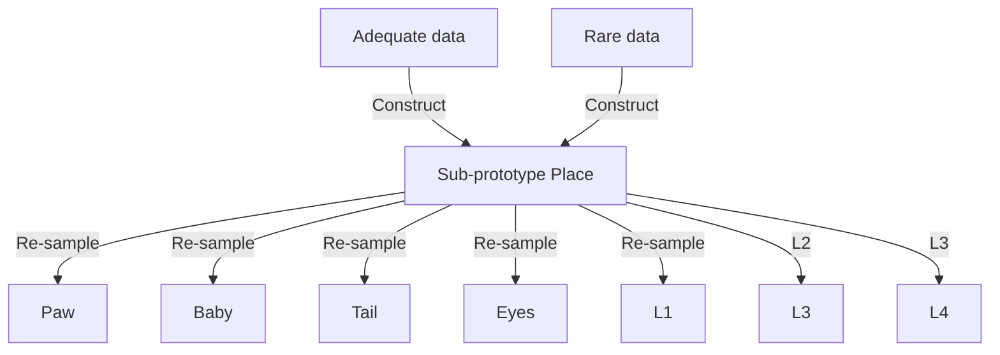
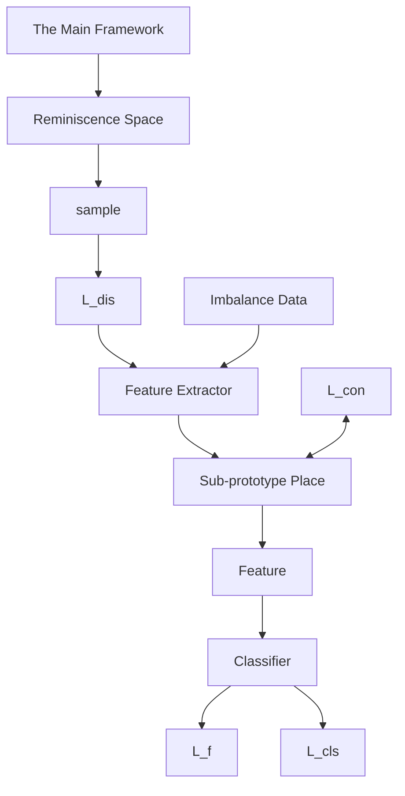

# Long-Tail Class Incremental Learning via Independent Sub-prototype Construction

Xi Wang, Xu Yang, Jie Yin, Kun Wei, Cheng Deng\* School of Electronic Engineering, Xidian University, Xi’an 710071, China {wangxi6317, xuyang.xd, jieyin.xd, weikunsk, chdeng.xd}@gmail.com

# Abstract

Long-tail class incremental learning (LT-CIL) is designed to perpetually acquire novel knowledge from an imbalanced and perpetually evolving data stream while ensuring the retention of previously acquired knowledge. The existing method only re-balances data distribution and ignores exploring the potential relationship between different samples, causing non-robust representations and even severe forgetting in classes with few samples. In this paper, we constructed two parallel spaces simultaneously: 1) Subprototype space and 2) Reminiscence space to learn robust representations while alleviating forgetfulness. Concretely, we advance the concept of the sub-prototype space, which amalgamates insights from diverse classes. This integration facilitates the mutual complementarity of varied knowledge, thereby augmenting the attainment of more robust representations. Furthermore, we introduce the reminiscence space, which encapsulates each class distribution, aiming to constraint model optimization and mitigate the phenomenon of forgetting. The tandem utilization of the two parallel spaces effectively alleviates the adverse consequences associated with imbalanced data distribution, preventing forgetting without needing replay examples. Extensive experiments demonstrate that our method achieves state-of-theart performance on various benchmarks.

# 1. Introduction

Most deep learning literature focuses on learning a model on a fixed data stream [41, 42]. However, data in the real world is not static and even changes its distribution over time. Consider a scenario where a model trained on old data needs to be fine-tuned on new data, but the old data are unavailable due to privacy concerns; such fine-tuning will significantly degrade the model’s performance in older data, known as catastrophic forgetting.

Continual learning endeavors to alleviate catastrophic


<details>
<summary>flowchart</summary>


</details>

Figure 1. The sub-prototype space integration knowledge from different classes, and when the space is constructed, the features re-sampled from the space less affected by imbalanced data.

forgetting by maintaining a balance between the plasticity and stability of the model, which ensures that old knowledge remains preserved (stability to changes), while also accommodating the acquisition of new incoming data (plasticity to adapt) [24]. In the real world, most deep learning models need to tackle the forgetfulness caused by a continuous data stream. For this purpose, several works have been proposed to address catastrophic forgetting in many scenarios, including image classification [7], object detection [36], instance segmentation [10], and even domain adaptation [40]. Unfortunately, those continual learning methods assume the data distribution is balanced in different tasks. However, real-world data is often imbalanced, usually in a long-tailed distribution.

The deep learning on long-tailed data is often dominated by the majority classes (classes with amount samples), resulting in poor performance of the minority classes (classes with few samples) [46]. To tackle this problem, existing work attempts to expand data or change the network structure [35] and so on, both achieved good results. Surprisingly, continual learning on imbalanced data has yet to receive widespread attention. Due to the prevalence of imbalanced data distributions in the real-world, deep learning models can continually learn without catastrophically forgetting that imbalanced data is more relevant to real-world needs. The paper [22] proposes long-tail class incremental learning and adds the balance training loss to the existed CL methods to tackle the LT-CIL. However, it ignores exploring the potential relationship between different classes, and there is still severe forgetting in classes with few samples. To tackle this problem, we first point out that imbalanced data distribution increases the difficulty of continual learning. Toward this end, our work aims to overcome two inevitable obstacles of LT-CIL: 1) catastrophic forgetting: forgetting the knowledge of old classes while learning the new, due to the data in different tasks always being different. In this work, we nickname it inter-task imbalance, and 2) long-tailed data distribution: in the same task, different classes have different sample sizes, and the distribution shows the imbalance, calling intra-task imbalance.


<details>
<summary>bar</summary>

| Task   | Ordered Long-tailed CIL |
| ------ | ------------------------ |
| Task0  | 500                      |
| Task1  | 200                      |
| Task2  | 100                      |
| Task3  | 50                       |
| Task4  | 20                       |
</details>


<details>
<summary>bar</summary>

| Task   | Value |
|--------|-------|
| Task0  | 130   |
| Task0  | 400   |
| Task0  | 280   |
| Task0  | 260   |
| Task0  | 290   |
| Task0  | 430   |
| Task1  | 150   |
| Task1  | 400   |
| Task1  | 330   |
| Task1  | 110   |
| Task1  | 100   |
| Task2  | 220   |
| Task2  | 480   |
| Task2  | 330   |
| Task2  | 320   |
| Task2  | 340   |
| Task2  | 450   |
| Task3  | 260   |
| Task3  | 470   |
| Task3  | 360   |
| Task3  | 310   |
| Task3  | 320   |
| Task4  | 110   |
| Task4  | 310   |
| Task4  | 220   |
| Task4  | 480   |
| Task4  | 490   |
| Task4  | 500   |
</details>

Figure 2. Illustration of long-tail class incremental learning (LT-CIL) scenarios. a) is Ordered LT-CIL and b) is Shuffled one.

The existing method captures the hidden properties between different classes in the mini-batch to alleviate intratask imbalance. Thus, although there is still a large gap between different classes, there are still shared sub-prototypes (For example, most mammals have shared characteristics such as claws, eyes, and noses). Our work considers learning different sub-prototypes as basis vectors to construct a sub-prototype space shared by different classes, as shown in Figure 1. With the constructed sub-prototype space, we can amalgamate insights from diverse classes. This integration facilitates the mutual complementarity of varied knowledge, thereby augmenting the attainment of more robust representations and mitigating the intra-task imbalance. At the same time, we propose a reminiscence space to store the data distribution when the number of tasks is increasing, expand the sub-prototype space to accommodate new knowledge while trying to keep the original space unchanged, and the newly constructed sub-prototype space has aggregated knowledge from different tasks at the same time, which alleviates the forgetfulness of previously learned thus alleviates the inter-task imbalance. In this way, the proposed method overcomes intra- and inter-task imbalance simultaneously. Our main contributions can be summarized as follows:

• We propose a novel and effective learnable sub-prototype

space that simultaneously mitigates intra-task and intertask imbalances in long-tail class incremental learning.

• We propose a reminiscence space to store data distribution, which prevents the model from collapsing under the influence of new knowledge and forgetting the learned old knowledge during training.   
• We perform extensive experiments to demonstrate the effectiveness of our method, all achieving state-of-the-art in diverse settings.

# 2. Related Work

# 2.1. Long-tailed representation learning

The long-tailed data distribution is an enduring and pervasive problem in machine learning [12]. Long-tailed distribution is where a few categories (also called majority classes) contain many samples, while most categories (also called minority classes) have only a tiny number of samples. Such datasets make the deep learning network perform well in the majority classes and inefficiently in the minority classes, with a significant drop in overall recognition accuracy [26]. The current long-tailed representation methods mainly consist of Class Re-balancing [16, 37], Information Augmentation [5, 38] and Module Improvement [15]. Class Re-balancing methods seek to balance the samples of different classes during model training, but even if we balance them along one dimension, they can become unbalanced in another dimension [19]. Information-Augmentation-based methods seek to introduce additional information into model training so that the model performance can be improved in minority classes [8]. Besides Class Re-Balancing and Information Augmentation, existing methods also try to expand the network, such as changing the feature extractor, enhancing the model classifier, and proposing a new structure, but this will increase the number of parameters of the model [35].

# 2.2. Continual learning

Continual learning aims to continuously learn new knowledge from a never-ending data stream. The main challenge of continual learning is to learn without catastrophic forgetting: with the incoming new data, the model performance should not significantly degrade on the past learned tasks [27]. Current solutions for continual learning can be divided into three main categories: regularization-based methods [2, 20, 30, 45], replay-based methods [11, 33], and architecture-based methods [9, 25].

Regularization-based methods focus on weight regularization by estimating and preventing the important network weights from changing. Some methods add well-designed regularization terms into the loss function to constrain the update of the model parameters [30]. Some methods constrain model changes by the gradient [13, 23]. The most popular method is knowledge distillation which constrains the new model as similar as possible to the old [39]. The difference between Regularization-based methods is the way to compute the importance of the parameters and constraints on the model can be applied directly to the weights, predicted probabilities, or gradients.


<details>
<summary>flowchart</summary>


</details>


<details>
<summary>flowchart</summary>

```mermaid
graph LR
    subgraph "Sub-prototype Place"
        direction TB
        A["in"] --> B["query"]
        B --> C["α₁"]
        C --> D["α₂"]
        D --> E["..."]
        E --> F["αₜ₋₁"]
        F --> G["αₜ"]
        G --> H["Add new"]
        H --> I["out"]
    end

    subgraph "Reminiscence Space"
        subgraph "Reminiscence Space"
            J["covariance matrix"]
            K["distribution"]
            L["λ(t-1) = [a_{t-1}^1 ..., a_{t-1}^p"]]
    end
```
</details>

Figure 3. The overall framework of our method is composed of the sub-prototype place and reminiscence space. Specifically, sub-prototype space consists of independent sub-prototype basis vectors, which integrate of different classes and mitigate the data imbalanced distribution. The reminiscence space regularizes the whole model with the feature distribution of each class.

The replay-based method attempts to store old data for replay. Most of these methods save the raw data directly and adopt it alongside the current data in the learning of new tasks [33]. The difference between saving-raw-data methods is how to choose the samples, and there is random probability method [17] and meta-learning methods [14, 28]. In addition to storing real data, some works try to generate samples by generating models by saving the distribution of old data, which takes data privacy into account [6].

Architecture-based methods tend to continually extend the network structure for different tasks of incremental learning [25, 32, 43]. Existing methods have tried to make the model have multiple classifiers. However, as the incremental learning task continues to increase and the demands on the model become higher, it is clear that continually extending the model structure is highly impractical.

However, these methods barely consider imbalanced data distribution, which can cause a drop in overall accuracy by not paying attention to the performance degradation of the minority classes during continuous learning. Our proposed method explores relationships between different classes, concerns the more severe forgetting in the minority classes, and takes advantage of the rich knowledge of the majority classes to assist in the minority classes learning, solving inter-class forgetting and intra-class data imbalance, enabling continual learning on imbalanced data.

# 3. Method

Our goal is to enable the network to learn multiple tasks sequentially with imbalanced data streams. In this section, we present the problem definition of long-tail class incremental learning. After that, we detail the proposed method.

# 3.1. Preliminary

Typically, we consider a supervised class incremental learning setting where a model needs to learn T different tasks in turn. Each task contains different classes, and the classes between tasks are disjoint: $\mathcal { C } ^ { 0 } \cap \mathcal { C } ^ { 1 } \cap . . . \cap \mathcal { C } ^ { \mathcal { T } } = \emptyset$ and $\mathcal { C } ^ { t }$ is the class set of task t. At each task $t \in \{ 1 , \ldots , T \}$ , $( x , y ) \in \mathcal { D } ^ { t }$ denotes the training sample, where x is a sample in the input space X , y is its corresponding label and D is sample space. Different from the previous class incremental learning where the samples per class are equal, longtail class incremental learning has imbalanced data distribution in each task, which means samples per class are unequal. The imbalanced distribution is parameterized by $\rho ,$ which is the ratio between the most and least sample size. For example, when $\rho = 0 . 0 1$ , the most class sample size is

100 times to the least. Meanwhile, when $\rho = 1$ , the most class sample size equals the least, which means the balanced data distribution. Given a random imbalance ratio $\rho ,$ after subjecting the training data to an imbalanced distribution, we follow the existing work [22] to propose two different LT-CIL scenarios:

• Ordered LT-CIL. The dataset is sequentially divided into different tasks, as shown in Figure 2 a). There is an imbalanced distribution over the complete dataset, and the total number of samples within the tasks is decreasing.   
• Shuffled LT-CIL. The majority and minority classes randomly belong to any task. While there is still an imbalanced distribution in each task, the total number of samples from different tasks shows a random trend as shown in Figure 2 b).

To facilitate analysis, we divide the network into two parts: a feature extractor and a unified classifier. Specifically, the feature extractor $f _ { \theta } : \mathcal { X }  \mathcal { Z }$ , parameterized by $\theta ,$ maps the input x into a feature vector $z = f _ { \theta } ( x ) \in \mathbb { R } ^ { d }$ in the deep feature space $\mathcal { Z } ;$ the unified classifier $g _ { \varphi } : \mathcal { Z } \to$ RC1:t $\mathbb { R } ^ { \mathcal { C } ^ { 1 : t } }$ parameterized by $\varphi ,$ produces a probability distribution $g _ { \varphi } ( z )$ as the prediction for x. The model has to classify all seen classes at any point in training.

Our proposed method comprises two parallel spaces: the sub-prototype space and the reminiscence space. In the next, we present the specific definitions of these two spaces.

# 3.2. Sub-prototype space

The proposed sub-prototype space comprises two primary processes: space construction and feature re-sampling.

# 3.2.1 Space construction

We propose a sub-prototype space (SS) with independent sub-prototype basis vectors, which are obtained by learning from the training data, thus constructing the different semantic information of the subspace to alleviate both intra- and inter-task imbalance. The main framework is shown in Figure 3. Assume the feature extractor output is $z ^ { t } = f _ { \theta } ( x ^ { t } ) \in \mathbb { R } ^ { B \times D }$ , where x is the input images, B is the batch size and D is the feature dimension and t is the task index. The SS takes the intermediate features $z ^ { t }$ as input and then re-samples the features in sub-prototype space using sub-prototype basis vectors:

$$
\widetilde {z} ^ {t} = \mathrm{SS} \left(z ^ {t}\right) \in \mathbb {R} ^ {B \times D}. \tag {1}
$$

Specifically, sub-prototype space consists of $M ^ { t }$ different basis vectors in task t. The number of basis vectors increases by n when a new class is to be learned. Thus $M ^ { 0 } = n \times { } ^ { \circ } N ^ { 0 }$ and $M ^ { t } = M ^ { t - 1 } + n \times N ^ { t } ( t \geq 1 )$ , where $N ^ { t }$ denote the number of new classes in task t. When it comes to learning the new task t, the basis vectors can be represented as:

$$
L _ {t} = \left[ L _ {t - 1}; l _ {1}, \dots , l _ {n} \right], \tag {2}
$$

where $l _ { n } \in \mathbb { R } ^ { D }$ . When learning a newly arriving task t, the dimension of the sub-prototype space is $L _ { t } \in \breve { \mathbb { R } } ^ { M ^ { t } \times D }$ . To construct the sub-prototype space, independent basis vectors must be learned from the training data. When a new set of learned features $z ^ { t }$ is input, sub-prototype space first projects the features into the existing basis vectors, queries the correlation between the input features and the basis vectors using the query function Q and then obtains correlation matrix $A _ { t }$ between the sub-prototype basis vectors and the input features.

$$
A _ {t} = Q (z ^ {t}, L _ {t}) = [ a _ {i j} ] _ {i \in B, j \in M ^ {t}}, \tag {3}
$$

where At ∈ RB×Mt , $A _ { t } \ \in \ \mathbb { R } ^ { B \times M ^ { t } } , \ a _ { i j }$ indicates the correlation factor between the ith feature and the jth sub-prototype basis vector, we regard the correlation factor as the component of the feature projection to this basis vector. According to the correlation matrix $A _ { t } ,$ , the input features can be projected into the space. Note that since the number of basis vectors in the space is larger than the number of classes, to prevent the projection of features from spreading out too much to get the better sub-prototype, we only select the most relevant k basis vectors with correlation factor in the actual projection process. At the same time, due to the imbalanced data distribution within the task, the selection based on the correlation factor may lead to a part of the basis vectors being selected frequently while others are selected too infrequently or never selected, resulting in the space being skewed towards a certain dimension, so we add the controlling factor $\mathcal { H } = [ \eta _ { i } ] _ { i \in M ^ { t } }$ . During the training process of each task, the number of selected times of vector i is counted as $n _ { i } ,$ , and the controlling factor $\eta _ { i } = e ^ { - n _ { i } }$ . Thus, the actual correlation matrix $A _ { t }$ is:

$$
A _ {t} = Q (z ^ {t}, L _ {t}) = [ a _ {i j} ] _ {i \in B, j \in M ^ {t}}
$$

$$
a _ {i j} = \left\{ \begin{array}{c c c} a _ {i j} & \text { if } & a _ {i j} \in [ \mathcal {H} \cdot A [ i: ] ] _ {t o p _ {k}} \\ 0 & & \text { else } \end{array} \right. \tag {4}
$$

After obtaining the correlation matrix, the projection of the input features in the sub-prototype space can be expressed as:

$$
\widetilde {\mathcal {Z}} = A _ {t} L _ {t} ^ {\top} = \left[ \begin{array}{l l l} \widetilde {z _ {1}}, & \dots , \widetilde {z _ {B}} \end{array} \right] ^ {\top}, \tag {5}
$$

Note that the sub-prototype basis vectors in the space are trainable, and in order to keep the semantic information before and after the feature projection consistent, we use the L2 Norm to constrain the updating of the basis vectors:

$$
\mathcal {L} _ {c o n} = \| \widetilde {\mathcal {Z}} - \mathcal {Z} \| _ {2}, \tag {6}
$$

Therefore, the loss in the construction phase consists of two parts: the classification loss based on supervised information $\mathcal { L } _ { c l s } ( \phi ; x , y ) = \mathcal { L } _ { c e } ( \phi ( x ) , y )$ , where $\mathcal { L } _ { c e }$ is the crossentropy loss and the construction loss $L _ { c o n }$ . Thus the entire training loss is:

$$
\mathcal {L} _ {1} = \mathcal {L} _ {c l s} + \lambda_ {1} \mathcal {L} _ {c o n}. \tag {7}
$$

In the construction phase, we use cosine similarity as the query function. When the training is over, we simultaneously construct a sub-prototype space of different classes and a learned model corresponding to the task. In the resampling phase, we use the constructed sub-prototype space to fine-tune the model and mitigate the impact of imbalanced data on the model.

# 3.2.2 Feature re-sampling

In the feature re-sampling phase, the sub-prototype space is fixed, and only the feature extractor $f _ { \theta }$ and the classifier $g _ { \varphi }$ are trained. When the training data stream re-pass through the model and get the corresponding features $z ^ { t }$ , firstly, we re-calculate the correlation factor between the features and the basis vectors in the sub-prototype space. For a random feature, based on the magnitude of the correlation factor, we select the top two most correlated directions: $l _ { t o p _ { 1 } } , l _ { t o p _ { 2 } }$ and regard it as the re-sampling base direction. Then, combined with the remaining h basis vectors randomly selected to generate the augmentation features in the sub-prototype space. Since the imbalanced distribution within the task, the number of re-sampled features is considered to be dynamically adjusted according to the frequency of sample occurrences, the number of $\bar { \mathbf { \chi } } _ { i ^ { t h } }$ class in task t correspondingly re-sampled features $N _ { r e , i } ^ { t } = N _ { \operatorname* { m a x } } ^ { t } - N _ { i } ^ { t } + 1 0$ = N tm , where $N _ { \operatorname* { m a x } } ^ { t }$ indicates the max sample size in task t and $N _ { i } ^ { t }$ is the sample size of $i ^ { t h }$ class in task t.

$$
\hat {z} = l _ {t o p _ {1}} + l _ {t o p _ {2}} + \mathbb {I} \left[ \mathrm{C} _ {M ^ {t} - 2} ^ {h} \sum_ {i = 1} ^ {h} l _ {i} \right], \tag {8}
$$

where $\left\lceil \mathbf { C } _ { M - 2 } ^ { h } \sum _ { i = 1 } ^ { h } l _ { i } \right\rceil$ denotes all the combinations of any $h$ permutations of the remaining $M ^ { t } - 2$ basis vectors, excluding the dimensions of the top two correlation factors, C is combination and I is indicator matrix consists of 0 and 1 with the same dimension of combinations. Thus, the features through the classifier become $\mathcal { Z } _ { n e w } \ : = \ : \left\lceil \mathcal { Z } , \hat { \mathcal { Z } } \right\rceil$ and the re-sampling features have the same label as the original feature. Thus, the loss in the re-sampling phase is the classification loss based on supervised information with a cross-entropy loss: $\mathcal { L } _ { f } ( \phi ; x , y ) = \mathcal { L } _ { c e } ( \mathcal { Z } _ { n e w } , Y _ { n e w } )$ .

# 3.3. Not to forget: Reminiscence space

The number of sub-prototype basis vectors in the subprototype space increases with the number of tasks, but in the construction phase, whether existing or new, all the basis vectors need to be trained at the same time, if there are no constraints, the existing basis vectors will undoubtedly forget what has been learned before. To prevent the previously constructed space from being corrupted by the new knowledge without storing any data, we propose the reminiscence space to alleviate forgetfulness.

Specifically, when each task is trained over, we calculated the class feature centroid $\begin{array} { r } { \mu _ { k } = \frac { 1 } { n _ { k } } \sum _ { i = 1 } ^ { n _ { k } } f _ { \theta } ( x _ { i } ) } \end{array}$ P i=1 fθ(xi) and nk nk the corresponding covariance matrix Σk, where each element is the covariance between the two features in the same class. We use the class-specific statistics to form a multivariate normal distribution $\mathcal { N } _ { k } ~ = ~ \mathcal { N } \left( \mu _ { k } , \Sigma _ { k } \right)$ for each class. Meanwhile, we calculated the mean of the correlation matrix in sub-prototype space for each class:

$$
\mathcal {A} ^ {k} = \frac {1}{n} \sum_ {\{\triangle_ {k} | y \in \text { class } k \}} \triangle_ {k}, \tag {9}
$$

where $\triangle _ { k } = A _ { t } \left[ a _ { k : } \right]$ indicates the correlation matrix between class k and all basis vectors in space. Thus, we form the reminiscence space for class k as $\boldsymbol { S } _ { k } = \left( \boldsymbol { \mathcal { N } } _ { k } , \boldsymbol { \mathcal { A } } ^ { k } \right)$ . To prevent the previously constructed sub-prototype space from being corrupted by the new knowledge while training a new task, we perform the distillation loss on the subprototype basis vectors using $\mathcal { A } ^ { k }$ . Since the number of basis vectors in the sub-prototype space corresponding to different tasks is different, the dimensions of the correlation matrix stored in the reminiscence space are different, so we need to mask the dimension of redundancy when distillation:

$$
\mathcal {L} _ {d i s 1} = \sum_ {i = 1} ^ {N _ {t}} \left\| \mathcal {A} ^ {i} - Q \left(\mu_ {i}, L _ {t}\right) [: I _ {i} ] \right\| _ {2}, \tag {10}
$$

where $I _ { i }$ indicates the dimension of $\mathcal { A } ^ { i }$ .

To maximize the effectiveness of our proposed method, we sample features from the reminiscence space $\widetilde { v } ^ { k } \sim { \cal S } _ { k }$ and compute the cross-entropy loss of the model: $\mathcal { L } _ { d i s 2 } =$ $\mathcal { L } _ { c e } ( \widetilde { v } ^ { k } , k )$ . Thus, the two phases can be briefly described:

eSpace construction: The sub-prototype space is constructed while training the model. The training loss is:

$$
\mathcal {L} _ {1} = \mathcal {L} _ {c l s} + \lambda_ {1} \mathcal {L} _ {c o n} + \lambda_ {2} \mathcal {L} _ {d i s 1}. \tag {11}
$$

Feature re-sampling: The feature extractor and classifier are fine-tuned, and the total training loss is:

$$
\mathcal {L} _ {2} = \mathcal {L} _ {f} + \lambda_ {3} \mathcal {L} _ {\text { dis2 }}. \tag {12}
$$

# 4. Experiments

# 4.1. Experiments Setttings

Datasets. Following previous work [22], we perform our experiments on CIFAR100 and ImageNet-Subset datasets with 100 classes. For both datasets, we split them into different settings: $5 0 + 5 \times 1 0 , 5 0 + 1 0 \times 5$ . For example, $5 0 + 5 \times 1 0$ means the first task has 50 classes and has 5 incremental phases, each incremental phase has 10 classes. At the same time, we divide the dataset into Ordered LT-CIL and Shuffled LT-CIL according to different imbalanced rate.

Table 1. Results on Shuffled LT-CIL. We compare our method with Baselines and previous methods. 

<table><tr><td rowspan="4">Methods</td><td rowspan="4">Memory Size</td><td colspan="12">Shuffled LT-CIL</td></tr><tr><td colspan="6">CIFAR100</td><td colspan="6">ImageNet-Subset</td></tr><tr><td colspan="2"> $\rho = 0.01$ </td><td colspan="2"> $\rho = 0.05$ </td><td colspan="2"> $\rho = 0.1$ </td><td colspan="2"> $\rho = 0.01$ </td><td colspan="2"> $\rho = 0.05$ </td><td colspan="2"> $\rho = 0.1$ </td></tr><tr><td>5 tasks</td><td>10 tasks</td><td>5 tasks</td><td>10 tasks</td><td>5 tasks</td><td>10 tasks</td><td>5 tasks</td><td>10 tasks</td><td>5 tasks</td><td>10 tasks</td><td>5 tasks</td><td>10 tasks</td></tr><tr><td>Baseline</td><td>0</td><td>11.3</td><td>7.3</td><td>13.6</td><td>8.1</td><td>13.9</td><td>8.2</td><td>12.9</td><td>11.2</td><td>15.3</td><td>13.1</td><td>16.7</td><td>12.7</td></tr><tr><td>LDAM[4]</td><td rowspan="3">0</td><td>11.5</td><td>11.4</td><td>15.2</td><td>14.3</td><td>19.8</td><td>18.2</td><td>15.4</td><td>15.2</td><td>19.4</td><td>19.0</td><td>22.6</td><td>22.1</td></tr><tr><td>BalPoE[1]</td><td>18.9</td><td>17.6</td><td>20.5</td><td>20.0</td><td>26.1</td><td>25.4</td><td>17.8</td><td>17.3</td><td>22.6</td><td>21.4</td><td>25.3</td><td>24.3</td></tr><tr><td>MDCS[47]</td><td>18.2</td><td>16.3</td><td>19.5</td><td>19.1</td><td>24.3</td><td>23.7</td><td>16.9</td><td>16.2</td><td>22.4</td><td>21.4</td><td>25.6</td><td>24.1</td></tr><tr><td>EWC[18]</td><td rowspan="6">0</td><td>28.7</td><td>25.3</td><td>33.1</td><td>31.9</td><td>40.6</td><td>39.7</td><td>30.8</td><td>30.4</td><td>35.6</td><td>34.7</td><td>43.8</td><td>43.6</td></tr><tr><td>LwF[21]</td><td>29.3</td><td>25.1</td><td>34.3</td><td>33.5</td><td>41.2</td><td>41.0</td><td>31.6</td><td>31.0</td><td>36.1</td><td>35.4</td><td>44.4</td><td>43.9</td></tr><tr><td>SDC[44]</td><td>32.7</td><td>29.6</td><td>35.2</td><td>34.1</td><td>42.9</td><td>42.3</td><td>33.9</td><td>33.4</td><td>39.4</td><td>38.1</td><td>45.9</td><td>45.1</td></tr><tr><td>PASS[49]</td><td>33.6</td><td>31.8</td><td>37.9</td><td>35.5</td><td>43.2</td><td>42.1</td><td>34.2</td><td>33.8</td><td>39.9</td><td>38.5</td><td>46.2</td><td>45.7</td></tr><tr><td>IL2A[48]</td><td>35.1</td><td>36.2</td><td>43.9</td><td>39.4</td><td>50.2</td><td>49.3</td><td>40.5</td><td>39.2</td><td>44.2</td><td>43.7</td><td>53.4</td><td>52.7</td></tr><tr><td>SAVC[34]</td><td>34.4</td><td>32.3</td><td>38.3</td><td>35.9</td><td>43.1</td><td>42.0</td><td>35.3</td><td>34.9</td><td>40.1</td><td>39.6</td><td>48.3</td><td>47.6</td></tr><tr><td>iCaRL[29]</td><td rowspan="4">1000</td><td>31.5</td><td>30.5</td><td>40.2</td><td>39.1</td><td>46.5</td><td>45.9</td><td>35.4</td><td>34.6</td><td>42</td><td>41.3</td><td>48.2</td><td>47.4</td></tr><tr><td>TwF[3]</td><td>34.2</td><td>33.8</td><td>42.3</td><td>42.1</td><td>49.3</td><td>48.7</td><td>38.6</td><td>38.1</td><td>43.6</td><td>43.3</td><td>52.2</td><td>51.7</td></tr><tr><td>SCoMMER[31]</td><td>35</td><td>35.2</td><td>43.4</td><td>42.3</td><td>49.9</td><td>49.1</td><td>39.3</td><td>38.9</td><td>44.9</td><td>44.1</td><td>52.9</td><td>52.6</td></tr><tr><td>LUCIR+LWS[22]</td><td>37.2</td><td>36.9</td><td>45.2</td><td>45.0</td><td>51.9</td><td>51.2</td><td>43.1</td><td>42.3</td><td>47.3</td><td>47.1</td><td>54.7</td><td>54.1</td></tr><tr><td>Ours</td><td>0</td><td>40.2</td><td>39.4</td><td>47.3</td><td>47.0</td><td>53.6</td><td>53.1</td><td>45.3</td><td>44.8</td><td>49.2</td><td>48.9</td><td>56.2</td><td>55.4</td></tr></table>

Table 2. Results on Orderd LT-CIL. We compare our method with Baselines and previous methods. 

<table><tr><td rowspan="4">Methods</td><td rowspan="4">Memory Size</td><td colspan="12">Ordered IL-CIL</td></tr><tr><td colspan="6">CIFAR100</td><td colspan="6">ImageNet-Subset</td></tr><tr><td colspan="2"> $\rho = 0.01$ </td><td colspan="2"> $\rho = 0.05$ </td><td colspan="2"> $\rho = 0.1$ </td><td colspan="2"> $\rho = 0.01$ </td><td colspan="2"> $\rho = 0.05$ </td><td colspan="2"> $\rho = 0.1$ </td></tr><tr><td>5 tasks</td><td>10 tasks</td><td>5 tasks</td><td>10 tasks</td><td>5 tasks</td><td>10 tasks</td><td>5 tasks</td><td>10 tasks</td><td>5 tasks</td><td>10 tasks</td><td>5 tasks</td><td>10 tasks</td></tr><tr><td>Baseline</td><td>0</td><td>16.5</td><td>15.4</td><td>18.9</td><td>15.3</td><td>20.1</td><td>15.1</td><td>20.3</td><td>18.3</td><td>21.7</td><td>18.9</td><td>23.5</td><td>21.1</td></tr><tr><td>LDAM[4]</td><td rowspan="3">0</td><td>20.1</td><td>19.4</td><td>24.8</td><td>23.1</td><td>33.8</td><td>33.0</td><td>19.7</td><td>18.6</td><td>27.3</td><td>26.4</td><td>35.7</td><td>34.6</td></tr><tr><td>BalPoE[1]</td><td>24.9</td><td>24.0</td><td>28.3</td><td>27.5</td><td>37.3</td><td>36.1</td><td>23.5</td><td>23.0</td><td>30.4</td><td>28.5</td><td>36.2</td><td>35.6</td></tr><tr><td>MDCS[47]</td><td>24.3</td><td>23.7</td><td>27.9</td><td>27.1</td><td>37.0</td><td>35.4</td><td>23.1</td><td>22.8</td><td>30.1</td><td>28.3</td><td>35.9</td><td>35.5</td></tr><tr><td>EWC[18]</td><td rowspan="6">0</td><td>32.1</td><td>31.6</td><td>36.7</td><td>36.1</td><td>43</td><td>42.1</td><td>35.7</td><td>31.2</td><td>36.4</td><td>36.1</td><td>46.7</td><td>46.1</td></tr><tr><td>LwF[21]</td><td>32.8</td><td>31.9</td><td>36.4</td><td>35.8</td><td>43.5</td><td>42.7</td><td>36.1</td><td>33.4</td><td>36.7</td><td>35.7</td><td>47.1</td><td>46.5</td></tr><tr><td>SDC[44]</td><td>34.9</td><td>34.5</td><td>39.2</td><td>38.8</td><td>45.7</td><td>45.0</td><td>43.2</td><td>42.0</td><td>44.5</td><td>44.1</td><td>48.1</td><td>47.2</td></tr><tr><td>PASS[49]</td><td>35.8</td><td>35.2</td><td>39.8</td><td>39.3</td><td>46.1</td><td>45.5</td><td>43.9</td><td>42.6</td><td>45.0</td><td>44.7</td><td>48.9</td><td>47.3</td></tr><tr><td>IL2A[48]</td><td>40.6</td><td>40.9</td><td>43.2</td><td>42.9</td><td>52.3</td><td>52.0</td><td>47.2</td><td>46.9</td><td>50.6</td><td>50.4</td><td>53.7</td><td>53.4</td></tr><tr><td>SAVC[34]</td><td>36.1</td><td>35.8</td><td>40.0</td><td>39.6</td><td>46.7</td><td>46.2</td><td>45.5</td><td>45.0</td><td>46.8</td><td>46.3</td><td>50.6</td><td>49.9</td></tr><tr><td>iCaRL[29]</td><td rowspan="4">1000</td><td>36.4</td><td>36.2</td><td>40.2</td><td>39.4</td><td>48.7</td><td>48.5</td><td>43.6</td><td>42.7</td><td>47.9</td><td>47.5</td><td>51.6</td><td>51.3</td></tr><tr><td>TwF[3]</td><td>40.1</td><td>39.8</td><td>42.7</td><td>42.1</td><td>51.1</td><td>51.0</td><td>46.1</td><td>45.4</td><td>49.4</td><td>48.9</td><td>52.8</td><td>52.3</td></tr><tr><td>SCoMMER[31]</td><td>41.2</td><td>41.0</td><td>43.8</td><td>42.5</td><td>52.9</td><td>52.4</td><td>47.0</td><td>46.5</td><td>51.1</td><td>50.6</td><td>54.3</td><td>53.6</td></tr><tr><td>LUCIR+LWS[22]</td><td>42.3</td><td>42.1</td><td>45.7</td><td>45.3</td><td>54.2</td><td>53.4</td><td>50.3</td><td>49.6</td><td>53.1</td><td>52.7</td><td>56.2</td><td>56.0</td></tr><tr><td>Ours</td><td>0</td><td>44.8</td><td>44.3</td><td>47.8</td><td>47.4</td><td>54.6</td><td>54.3</td><td>52.7</td><td>52.6</td><td>55.7</td><td>55.2</td><td>57.4</td><td>57.2</td></tr></table>

Implementation Details. For both datasets, our baseline feature extractor is ResNet18. The training batch size is 64 with 121 epochs in the construction phase and 81 epochs in the re-sampling phase. The learning rate is 0.001 and will be reduced by a factor 10 at every 40 epoch. In our experiments, $n = 2 , k = 1 0$ and h = 4. The values of the hyperparameters are as follows: $\lambda _ { 1 } = 6 \times 1 0 ^ { - 4 } , \lambda _ { 2 } = 1 0$ and $\lambda _ { 3 } = 1 0$ . For CIFAR100, the class sample size less than 100 is the minority class, while for ImageNet-Subset,

class sample size less than 200 is the minority class. For page limitation, we have placed the sensitivity analysis of the parameters, and the analysis of the values that need to be considered in the supplementary material.

Metrics. We use the standard metrics in the continual learning methods to measure performance: Average Accuracy, which calculates all seen classes’ accuracy. Let $a _ { i , j }$ be the accuracy of the model on the testing set of task j after the model is trained from task 1 to task i, Average Accuracy can be calculated:

$$
\text { Average   Accuracy } (A _ {T}) = \frac {1}{T} \sum_ {j = 1} ^ {T} a _ {T, j}. \tag {13}
$$

Comparison Methods. We compare our method with the existing methods including both class incremental methods without replay data: EWC [18], LwF [21], IL2A [48], class incremental methods with replay data: iCaRL [29], LUCIR+LWS [22], TwF [3], SCoMMER [31], and class incremental method based on prototype: SDC [44], PASS [49] as well as the long-tail methods: LDAM [4], BalPoE [1], MDCS [47] and method for few-shot incremental learning: SAVC [34]. All comparison experiments use the same ResNet18 as backbone and for the methods that needs to store data, the memory size is fixed to 1000.

Table 3. Ablation study. The experiment setting is CIFAR100 with 5 incremental tasks and $\rho = 0 . 0 1$ . 

<table><tr><td rowspan="2"></td><td colspan="5">Components</td><td rowspan="2">Accuracy</td></tr><tr><td> $\mathcal{L}_{cls}$ </td><td> $\mathcal{L}_{con}$ </td><td> $\mathcal{L}_{f}$ </td><td> $\mathcal{L}_{dis1}$ </td><td> $\mathcal{L}_{dis2}$ </td></tr><tr><td>a)</td><td>√</td><td></td><td></td><td></td><td></td><td>11.3</td></tr><tr><td>b)</td><td>√</td><td>√</td><td></td><td></td><td></td><td>10.4</td></tr><tr><td>c)</td><td>√</td><td>√</td><td>√</td><td></td><td></td><td>34.7</td></tr><tr><td>d)</td><td>√</td><td>√</td><td>√</td><td></td><td>√</td><td>36.3</td></tr><tr><td>e)</td><td>√</td><td>√</td><td>√</td><td>√</td><td></td><td>38.9</td></tr><tr><td>f)</td><td>√</td><td>√</td><td>√</td><td>√</td><td>√</td><td>40.2</td></tr></table>

# 4.2. Experimental Results

It is noted that the Baseline refers to distillation only, and the long-tail method is applied directly to the Baseline. We calculated the average accuracy of all tasks and comparative results are presented in Table 1 and Table 2.

Shuffled LT-CIL results. The experimental results are shown in Table 1. When the benchmark is CIFAR100, imbalance rate 0.01, and 5 incremental tasks, our method obtained an improvement of 3% over the LUCIR+LWS, even without any replay data. and when increasing the number of tasks to 10, our method has 2.5% improvement to the best before. After adjusting the learning rate to 0.05 to make the training data more, our method also achieves optimal performance, with 2.1% and 2.0% improvements on the 5 and 10 tasks, respectively. Meanwhile, on the ImageNet-Subset benchmark, we experimented with the same settings, and our method achieved the same stunning results, with a higher accuracy of 2.1% than the previous best method when the imbalance rate was 0.01 for a total of 5 incremental tasks. In all other settings, our method achieved the best performance.

Orderd LT-CIL results. The experiment results are shown in Table 2. When the benchmark is CIFAR100, the imbalance rate is set to 0.01 and there are 5 incremental tasks, our method achieves accuracy 44.8%, 2.5% improvement over the LUCIR+LWS, and when the tasks are extended to 10, 2.2% improvement over the previous method, and the improvement also exists under the other settings. When switching the benchmark to ImageNet-Subset, the same stunning performance was achieved.

# 4.3. Ablation Study

In this section, we discuss the effectiveness of each part in our method. The experiment setting is in Shuffled LT-CIL, CIFAR100, 5 incremental tasks, and the imbalance rate of 0.01. The results are shown in Table 3. As Table 3 shows, we can observe that only constructing the sub-prototype space makes the performance of the original model drop slightly to 10.4%, but when re-train the model with the re-sampling features, the performance improves to 34.7%, which proves what we emphasized in the introduction, that there exist shared sub-prototypes between different classes, and with the help of the knowledge integrating, the model can learn more robust representation. Meanwhile, in order to prevent the inter-task imbalance from leading to catastrophic forgetting, we propose a reminiscence space to store the feature distribution of each class, and after performing the constraints on the sub-prototype space and the classifier respectively, the performance of the model improves to 38.9% and 36.3% from 34.7%, which is a good proof of our effectiveness of the reminiscence space. Finally, by adding constraints on both the sub-prototype space and the classifier, the performance improves to 40.2% and obtains the best results in this setting, which proves that the two-parallel space is effective to the LT-CIL.

# 4.4. Further analysis


<details>
<summary>heatmap</summary>

| | Taks0 | Taks1 | Taks2 | Taks3 | Taks4 | Taks5 |
|---|---|---|---|---|---|---|
| Taks0 | 1 | 0.7 | 1 | 0.52 | 0.46 | 0.38 |
| Taks1 | 0.7 | 1 | 0.76 | 0.69 | 0.61 | 0.46 |
| Taks2 | 1 | 0.67 | 1 | 0.66 | 0.79 | 0.55 |
| Taks3 | 0.67 | 1 | 0.79 | 0.75 | 0.78 | 1 |
| Taks4 | 1 | 0.78 | 1 | 0.75 | 0.78 | 1 |
| Taks5 | 1 | 0.78 | 1 | 0.75 | 0.78 | 1 |
</details>


<details>
<summary>heatmap</summary>

| | Taks0 | Taks1 | Taks2 | Taks3 | Taks4 | Task5 |
|---|---|---|---|---|---|---|
| Taks0 | 1 | 0.83 | 0.65 | 0.57 | 0.47 | 0.41 |
| Taks1 | 1 | 0.9 | 0.74 | 0.64 | 0.58 | 0.62 |
| Taks2 | 1 | 0.85 | 0.73 | 0.99 | 0.98 | 1 |
| Taks3 | 1 | 0.74 | 0.85 | 1 | 1 | 1 |
| Taks4 | 1 | 0.64 | 0.73 | 1 | 1 | 1 |
| Taks5 | 1 | 0.58 | 0.62 | 1 | 1 | 1 |
</details>

Figure 4. Similarity matrix between models. Experiments were performed in CIFAR100, Shuffled LT-CIL, $\mathcal { T } = 5 , \rho = 0 . 0 1$ . Compare the similarity between the models obtained at the end of each task. a) is the Baseline and b) is our method.

Similarity analysis. In order to better visualize the results of our method, we calculated the similarity of the models obtained after different tasks and presented them in the form of heat maps in Figure 4, a) is the Baseline result, and b) is our proposed method and experiments were performed in CIFAR100, Shuffled LT-CIL, $\mathcal { T } = 5 , \rho = 0 . 0 1$ . Since task 0 is the initial learning task, the model obtained after task 0 will theoretically have the maximum forgetting rate, so in the case of distillation only, the similarity with the model obtained after task 5 is only 0.34, meanwhile, after adding our proposed two-parallel space, the similarity improves to 0.41, and the improvement also exists in the other models which are evident that our method makes the model retain more knowledge learned before. This accumulation of similarity eventually leads to a qualitative leap in the performance of our method compared to the baseline.


<details>
<summary>line</summary>

| Task | IL2A  | LUCIR+LWS | Ours  | BalPoE |
|------|-------|-----------|-------|--------|
| 0    | 31.5  | 34.5      | 33.0  | 35.0   |
| 1    | 27.0  | 31.5      | 33.5  | 20.5   |
| 2    | 30.5  | 31.0      | 33.0  | 14.5   |
| 3    | 28.5  | 29.5      | 31.5  | 11.0   |
| 4    | 28.0  | 29.0      | 30.5  | 8.5    |
| 5    | 29.0  | 31.5      | 34.0  | 6.0    |
</details>

Figure 5. Accuracy on minority classes. The setting is the same as the similarity matrix, and in order to make the results more convincing, we chose methods that require replay data (LU-CIR+LWS), do not require replay data (IL2A), and method for long-tail distribution (BalPoE).

Minority classes accuracy. The main issue to overcome in LT-CIL is the forgetting of the minority classes, it is necessary to focus on the classification performance of the minority classes separately. We present the minority classes’ experimental results in graphs in Figure 5. Specifically, we compare the method with replay data (LUCIR+LWS), without replay data (IL2A), and the long-tail method (BalPoE), and the experiment setting are same as similarity analysis. Our method is lower than BalPoE and LUCIR+LWS in Task 0 but significantly higher than IL2A. When incremental tasks are to be learned, the performance degrades because BalPoE cannot alleviate the catastrophic forgetting. Meanwhile, LUCIR+LWS and IL2A can be stabilized within a certain accuracy range, but all of them are declining. At the same time, our method consistently maintains high classification performance on the minority classes due to the construction of the sub-prototype space to eliminate the effects of imbalanced data distribution.

Basis vectors selection frequency ablation study. The features are reconstructed using basis vectors in subprototype space, and since all majority and minority classes share these vectors, the rich knowledge of the majority classes can assist the minority classes in learning a more robust representation. During the reconstruction, to prevent some basis vectors from being chosen too frequent, which would result in tilting of the sub-prototype space in certain directions, we use a controlling factor to regulate dynamically. We add all basis vectors selection frequency in task 0


<details>
<summary>bar</summary>

| Label | Frequency |
|-------|---------|
| 0     | 0.05    |
| 1     | 0.75    |
| 2     | 0.35    |
| 3     | 0.05    |
| 4     | 0.15    |
| 5     | 0.90    |
| 6     | 0.70    |
| 7     | 0.30    |
| 8     | 0.15    |
| 9     | 0.20    |
| 10    | 0.10    |
| 11    | 0.95    |
| 12    | 0.45    |
| 13    | 0.30    |
| 14    | 0.25    |
| 15    | 0.15    |
| 16    | 0.10    |
| 17    | 0.20    |
| 18    | 0.15    |
| 19    | 0.25    |
| 20    | 0.10    |
| 21    | 0.20    |
| 22    | 0.15    |
| 23    | 0.25    |
| 24    | 0.10    |
| 25    | 0.15    |
| 26    | 0.20    |
| 27    | 0.15    |
| 28    | 0.25    |
| 29    | 0.10    |
| 30    | 0.15    |
| 31    | 0.20    |
| 32    | 0.15    |
| 33    | 0.25    |
| 34    | 0.10    |
| 35    | 0.15    |
| 36    | 0.20    |
| 37    | 0.15    |
| 38    | 0.25    |
| 39    | 0.10    |
| 40    | 0.15    |
| 41    | 0.20    |
| 42    | 0.15    |
| 43    | 0.25    |
| 44    | 0.10    |
| 45    | 0.15    |
| 46    | 0.20    |
| 47    | 0.15    |
| 48    | 0.25    |
| 49    | 0.10    |
| 50    | 0.15    |
</details>


<details>
<summary>bar</summary>

| Index | Frequency |
| ----- | --------- |
| 0     | 0.35      |
| 5     | 0.38      |
| 10    | 0.42      |
| 15    | 0.70      |
| 20    | 0.38      |
| 25    | 0.35      |
| 30    | 0.55      |
| 35    | 0.38      |
| 40    | 0.65      |
| 45    | 0.75      |
| 50    | 0.38      |
| 55    | 0.60      |
| 60    | 0.38      |
| 65    | 0.35      |
| 70    | 0.38      |
| 75    | 0.35      |
| 80    | 0.38      |
| 85    | 0.45      |
| 90    | 0.90      |
| 95    | 0.85      |
| 100   | 0.40      |
</details>

Figure 6. Basis vectors selection frequency ablation study. The setting is the same as the similarity matrix, and a) is the frequency of all class occurrences in task 0, b) is the selection frequency of all basis vectors in task 0.

to prove that. Figure 6 a) shows the frequency of all class occurrences in task 0 and b) is the selection frequency of all basis vectors in task 0 (both are normalized); It is obvious that the basis vector selection has been much more balanced. Due to the approximate balance within the subprototype space, it can be used to solve the problem caused by imbalanced data distribution.

# 5. Conclusion

In this work, we address two fundamental challenges in long-tail class incremental learning: intra-task imbalance due to data imbalanced distribution and inter-task imbalance due to forgetting what was learned before during incremental learning. We propose two parallel spaces: sub-prototype space, where the sub-prototypes of distinct classes serve as its basis vectors, and reminiscence space, comprised of the feature distribution of each class. The subprototype space amalgamates insights from diverse classes. It facilitates the mutual complementarity of varied knowledge, thereby augmenting the attainment of more robust representations and mitigating the impact caused by the imbalanced data distribution. Meanwhile, reminiscence space adds constraints to the learning process to prevent the model from catastrophic forgetting. Through the collaborative operation of these two spaces, we significantly alleviate the adverse effects associated with data imbalance and forgetting. Extensive experiments on different benchmark datasets demonstrate the effectiveness of our method.

# 6. Acknowledgement

This work was supported in part by the National Key Research and Development Program of China (No. 2023YFC3305600), Joint Fund of Ministry of Education of China (8091B022149, 8091B02072404), National Natural Science Foundation of China (62132016, 62171343, and 62201436), and Fundamental Research Funds for the Central Universities (ZDRC2102).

# References

[1] Emanuel Sanchez Aimar, Arvi Jonnarth, Michael Felsberg, and Marco Kuhlmann. Balanced product of calibrated experts for long-tailed recognition. In CVPR, pages 19967– 19977, 2023. 6, 7   
[2] Rahaf Aljundi, Francesca Babiloni, Mohamed Elhoseiny, Marcus Rohrbach, and Tinne Tuytelaars. Memory aware synapses: Learning what (not) to forget. In ECCV, pages 139–154, 2018. 2   
[3] Matteo Boschini, Lorenzo Bonicelli, Angelo Porrello, Giovanni Bellitto, Matteo Pennisi, Simone Palazzo, Concetto Spampinato, and Simone Calderara. Transfer without forgetting. In ECCV, pages 692–709, 2022. 6, 7   
[4] Kaidi Cao, Colin Wei, Adrien Gaidon, Nikos Arechiga, and Tengyu Ma. Learning imbalanced datasets with labeldistribution-aware margin loss. In NeurIPS, 2019. 6, 7   
[5] Peng Chu, Xiao Bian, Shaopeng Liu, and Haibin Ling. Feature space augmentation for long-tailed data. In ECCV, pages 694–710, 2020. 2   
[6] Yulai Cong, Miaoyun Zhao, Jianqiao Li, Sijia Wang, and Lawrence Carin. Gan memory with no forgetting. In NeurIPS, 2020. 3   
[7] Cyprien de Masson D’Autume, Sebastian Ruder, Lingpeng Kong, and Dani Yogatama. Episodic memory in lifelong language learning. In NeurIPS, 2019. 1   
[8] Qi Dong, Shaogang Gong, and Xiatian Zhu. Class rectification hard mining for imbalanced deep learning. In ICCV, pages 1851–1860, 2017. 2   
[9] Arthur Douillard, Alexandre Rame, Guillaume Couairon, ´ and Matthieu Cord. Dytox: Transformers for continual learning with dynamic token expansion. In CVPR, pages 9285– 9295, 2022. 2   
[10] Yanan Gu, Cheng Deng, and Kun Wei. Class-incremental instance segmentation via multi-teacher networks. In AAAI, pages 1478–1486, 2021. 1   
[11] Yanan Gu, Xu Yang, Kun Wei, and Cheng Deng. Not just selection, but exploration: Online class-incremental continual learning via dual view consistency. In CVPR, pages 7442– 7451, 2022. 2   
[12] Haibo He and Edwardo A Garcia. Learning from imbalanced data. IEEE Trans. Knowl. Data Eng., 21(9):1263– 1284, 2009. 2   
[13] Xu He and Herbert Jaeger. Overcoming catastrophic interference using conceptor-aided backpropagation. In ICLR, 2018. 2   
[14] Christian Henning, Maria Cervera, Francesco D’Angelo, Johannes Von Oswald, Regina Traber, Benjamin Ehret, Seijin Kobayashi, Benjamin F Grewe, and Joao Sacramento. Pos- ˜ terior meta-replay for continual learning. In NeurIPS, 2021. 3   
[15] Chen Huang, Yining Li, Chen Change Loy, and Xiaoou Tang. Learning deep representation for imbalanced classification. In CVPR, pages 5375–5384, 2016. 2   
[16] Bingyi Kang, Saining Xie, Marcus Rohrbach, Zhicheng Yan, Albert Gordo, Jiashi Feng, and Yannis Kalantidis. Decoupling representation and classifier for long-tailed recognition. arXiv preprint arXiv:1910.09217, 2019. 2

[17] Chris Dongjoo Kim, Jinseo Jeong, and Gunhee Kim. Imbalanced continual learning with partitioning reservoir sampling. In ECCV, pages 411–428, 2020. 3   
[18] James Kirkpatrick, Razvan Pascanu, Neil Rabinowitz, Joel Veness, Guillaume Desjardins, Andrei A Rusu, Kieran Milan, John Quan, Tiago Ramalho, Agnieszka Grabska-Barwinska, et al. Overcoming catastrophic forgetting in neural networks. Proceedings of the national academy of sciences, 114(13):3521–3526, 2017. 6   
[19] Xuan Kou, Chenghao Xu, Xu Yang, and Cheng Deng. Attention-guided contrastive hashing for long-tailed image retrieval. In IJCAI, pages 1017–1023, 2022. 2   
[20] Sang-Woo Lee, Jin-Hwa Kim, Jaehyun Jun, Jung-Woo Ha, and Byoung-Tak Zhang. Overcoming catastrophic forgetting by incremental moment matching. In NeurIPS, 2017. 2   
[21] Zhizhong Li and Derek Hoiem. Learning without forgetting. IEEE Trans. Pattern Anal. Mach. Intell., 40(12):2935–2947, 2017. 6   
[22] Xialei Liu, Yu-Song Hu, Xu-Sheng Cao, Andrew D Bagdanov, Ke Li, and Ming-Ming Cheng. Long-tailed class incremental learning. In ECCV, pages 495–512, 2022. 2, 4, 5, 6, 7   
[23] David Lopez-Paz and Marc’Aurelio Ranzato. Gradient episodic memory for continual learning. In NeurIPS, 2017. 2   
[24] Zheda Mai, Ruiwen Li, Jihwan Jeong, David Quispe, Hyunwoo Kim, and Scott Sanner. Online continual learning in image classification: An empirical survey. Neurocomputing, 469:28–51, 2022. 1   
[25] Arun Mallya and Svetlana Lazebnik. Packnet: Adding multiple tasks to a single network by iterative pruning. In CVPR, pages 7765–7773, 2018. 2, 3   
[26] Wanli Ouyang, Xiaogang Wang, Cong Zhang, and Xiaokang Yang. Factors in finetuning deep model for object detection with long-tail distribution. In CVPR, pages 864–873, 2016. 2   
[27] German I Parisi, Ronald Kemker, Jose L Part, Christopher Kanan, and Stefan Wermter. Continual lifelong learning with neural networks: A review. Neural Networks, 113:54–71, 2019. 2   
[28] Jathushan Rajasegaran, Salman Khan, Munawar Hayat, Fahad Shahbaz Khan, and Mubarak Shah. itaml: An incremental task-agnostic meta-learning approach. In CVPR, pages 13588–13597, 2020. 3   
[29] Sylvestre Alvise Rebuffi, Alexander Kolesnikov, Georg Sperl, and Christoph H Lampert. icarl: Incremental classifier and representation learning. IEEE Computer Society, 2016. 6, 7   
[30] Hippolyt Ritter, Aleksandar Botev, and David Barber. Online structured laplace approximations for overcoming catastrophic forgetting. In NeurIPS, 2018. 2   
[31] Fahad Sarfraz, Elahe Arani, and Bahram Zonooz. Sparse coding in a dual memory system for lifelong learning. In AAAI, pages 9714–9722, 2023. 6, 7   
[32] Joan Serra, Didac Suris, Marius Miron, and Alexandros Karatzoglou. Overcoming catastrophic forgetting with hard attention to the task. In ICML, pages 4548–4557, 2018. 3

[33] Dongsub Shim, Zheda Mai, Jihwan Jeong, Scott Sanner, Hyunwoo Kim, and Jongseong Jang. Online classincremental continual learning with adversarial shapley value. In AAAI, pages 9630–9638, 2021. 2, 3   
[34] Zeyin Song, Yifan Zhao, Yujun Shi, Peixi Peng, Li Yuan, and Yonghong Tian. Learning with fantasy: Semantic-aware virtual contrastive constraint for few-shot class-incremental learning. In CVPR, pages 24183–24192, 2023. 6, 7   
[35] Jianfeng Wang, Thomas Lukasiewicz, Xiaolin Hu, Jianfei Cai, and Zhenghua Xu. Rsg: A simple but effective module for learning imbalanced datasets. In CVPR, pages 3784– 3793, 2021. 1, 2   
[36] Jianren Wang, Xin Wang, Yue Shang-Guan, and Abhinav Gupta. Wanderlust: Online continual object detection in the real world. In ICCV, pages 10829–10838, 2021. 1   
[37] Tao Wang, Yu Li, Bingyi Kang, Junnan Li, Junhao Liew, Sheng Tang, Steven Hoi, and Jiashi Feng. The devil is in classification: A simple framework for long-tail instance segmentation. In ECCV, pages 728–744, 2020. 2   
[38] Yu-Xiong Wang, Deva Ramanan, and Martial Hebert. Learning to model the tail. In NeurIPS, 2017. 2   
[39] Kun Wei, Cheng Deng, Xu Yang, and Maosen Li. Incremental embedding learning via zero-shot translation. In AAAI, pages 10254–10262, 2021. 3   
[40] Kun Wei, Xu Yang, Zhe Xu, and Cheng Deng. Classincremental unsupervised domain adaptation via pseudolabel distillation. IEEE Trans. Image Process., 2024. 1   
[41] Jiexi Yan, Lei Luo, Cheng Deng, and Heng Huang. Adaptive hierarchical similarity metric learning with noisy labels. IEEE Trans. Image Process., 32:1245–1256, 2023. 1   
[42] Jiexi Yan, Zhihui Yin, Erkun Yang, Yanhua Yang, and Heng Huang. Learning with diversity: Self-expanded equalization for better generalized deep metric learning. In ICCV, pages 19365–19374, 2023. 1   
[43] Jaehong Yoon, Eunho Yang, Jeongtae Lee, and Sung Ju Hwang. Lifelong learning with dynamically expandable networks. arXiv preprint arXiv:1708.01547, 2017. 3   
[44] Lu Yu, Bartlomiej Twardowski, Xialei Liu, Luis Herranz, Kai Wang, Yongmei Cheng, Shangling Jui, and Joost van de Weijer. Semantic drift compensation for class-incremental learning. In CVPR, pages 6982–6991, 2020. 6, 7   
[45] Friedemann Zenke, Ben Poole, and Surya Ganguli. Continual learning through synaptic intelligence. In ICML, pages 3987–3995, 2017. 2   
[46] Yifan Zhang, Bingyi Kang, Bryan Hooi, Shuicheng Yan, and Jiashi Feng. Deep long-tailed learning: A survey. arXiv preprint arXiv:2110.04596, 2021. 1   
[47] Qihao Zhao, Chen Jiang, Wei Hu, Fan Zhang, and Jun Liu. Mdcs: More diverse experts with consistency self-distillation for long-tailed recognition. In ICCV, pages 11597–11608, 2023. 6, 7   
[48] Fei Zhu, Zhen Cheng, Xu-Yao Zhang, and Cheng-lin Liu. Class-incremental learning via dual augmentation. In NeurIPS, 2021. 6   
[49] Fei Zhu, Xu-Yao Zhang, Chuang Wang, Fei Yin, and Cheng-Lin Liu. Prototype augmentation and self-supervision for incremental learning. In CVPR, pages 5871–5880, 2021. 6, 7