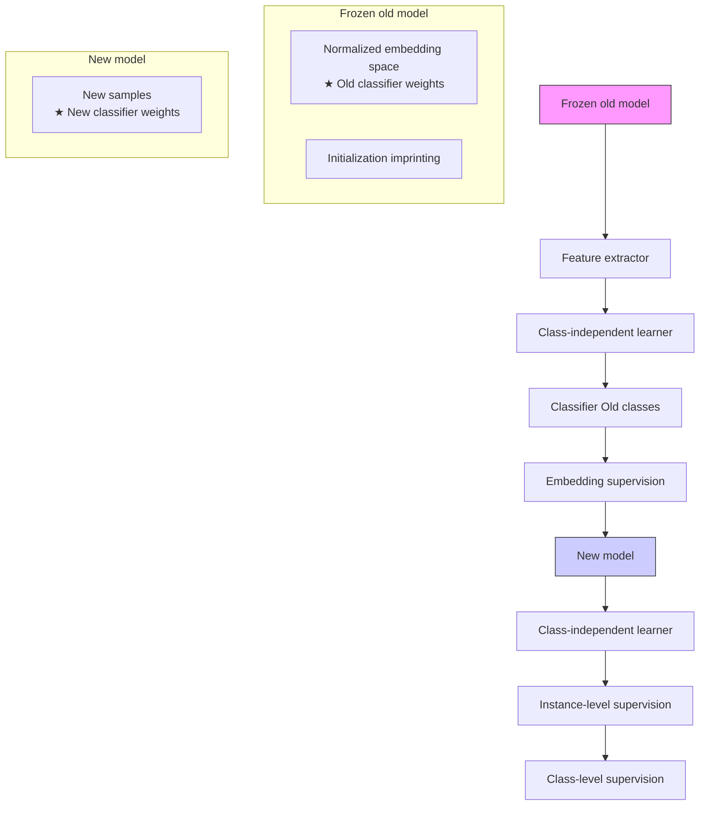
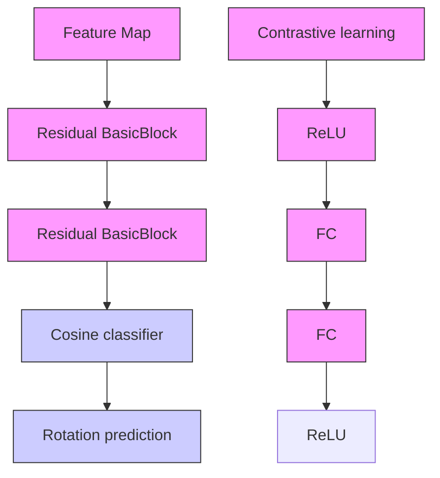

# Striking a Balance between Stability and Plasticity for Class-Incremental Learning

Guile Wu, Shaogang Gong, and Pan Li Queen Mary University of London

{guile.wu, s.gong, pan.li}@qmul.ac.uk

# Abstract

Class-incremental learning (CIL) aims at continuously updating a trained model with new classes (plasticity) without forgetting previously learned old ones (stability). Contemporary studies resort to storing representative exemplars for rehearsal or preventing consolidated model parameters from drifting, but the former requires an additional space for storing exemplars at every incremental phase while the latter usually shows poor model generalization. In this paper, we focus on resolving the stabilityplasticity dilemma in class-incremental learning where no exemplars from old classes are stored. To make a tradeoff between learning new information and maintaining old knowledge, we reformulate a simple yet effective baseline method based on a cosine classifier framework and reciprocal adaptive weights. With the reformulated baseline, we present two new approaches to CIL by learning classindependent knowledge and multi-perspective knowledge, respectively. The former exploits class-independent knowledge to bridge learning new and old classes, while the latter learns knowledge from different perspectives to facilitate CIL. Extensive experiments on several widely used CIL benchmark datasets show the superiority of our approaches over the state-of-the-art methods.

# 1. Introduction

Humans have the ability to incrementally learn unseen new categories without forgetting already learned old categories to realize lifelong learning. Class-Incremental Learning (CIL) resembles this capability and aims at continuously updating a trained model with samples from new classes without forgetting old ones [42, 44, 32], where samples from old classes are not available or only partially available. However, this is not a trivial task for the machine. If we directly fine-tune a trained model with samples from new classes, it will overfit to new classes and forget old ones (see Fig. 1(a)); If we fix the feature embedding space of

scatter

| Category | Count |
|---|---|
| P1 | 1 |
| P2 | 14 |

(a) Fine-Tuning

bar

| Category | Top 1 (%) |
|---|---|
| P1 | 70 |
| P2 | 30 |

(b) Embedding-Fix

scatter

| Group | Top-1 (%) |
|---|---|
| P1 | 75 |
| P2 | 55 |

(c) Ours (SPB-I)

scatter

| Group | Top1 (%) |
|---|---|
| P1 | 80 |
| P2 | 65 |

(d) Ours (SPB-M)   
Figure 1. The stability-plasticity dilemma in class-incremental learning, illustrated by top-1 accuracy and t-SNE [35] visualization of embeddings. On CIFAR-100, we randomly use 50 classes for training at the 1-st phase (P1), and then add 5 classes for incremental training at the 2-nd phase (P2). (a) Directly fine-tuning a trained model leads to overfitting to new classes; (b) Fix a trained model cannot properly incorporate knowledge of new classes into the model; (c) and (d) Our methods strike a balance between stability and plasticity, resulting in better performance.

a trained model without further training on new classes, it cannot incorporate knowledge of new classes to improve its generalization capability (see Fig. 1(b)). This is a stabilityplasticity dilemma [3, 14] – on the one hand, our model should learn more new knowledge for the sake of plasticity, while on the other hand, our model needs to maintain more old knowledge for the sake of stability (without catastrophic forgetting [27, 31]).

To resolve this problem, many CIL studies [32, 26, 2] resort to storing some representative exemplars for rehearsalbased model learning and using a distillation loss [15, 40] for knowledge transfer. However, this approach is impractical in many resource-limited scenarios because it requires to store exemplars of old classes. Besides, training a model with a tiny number of old exemplars would lead to a classimbalanced learning problem [41, 18]. Instead of storing old exemplars, some works [20, 1, 25] propose to analyze the importance of model parameters for preventing consolidated parameters from drifting. But this approach usually suffers from poor model generalization in long-sequence incremental learning due to the constraint of model parameters. Recently, some studies turn to using better distillation strategies (e.g., attention distillation [7]) or compensating semantic drift in the embedding space [42], but they still fail to make a better trade-off between learning new information and maintaining old knowledge.

In this paper, we focus on resolving the stabilityplasticity dilemma in CIL where no samples from old classes are stored. To this end, we reformulate a simple yet effective baseline method (called SPB) to make a trade-off between learning new information and maintaining old knowledge. SPB is built on a cosine classifier framework [30] and reciprocal adaptive weights for incrementally incorporating knowledge of new classes into a model and effectively aligning feature embedding spaces. Previous studies [30, 38, 18] have shown the effectiveness of cosine classifier based models for simultaneously optimizing an embedding space and class prototypes (i.e., weights of cosine classifiers), but they still cannot well resolve the stability-plasticity dilemma in CIL, especially when without storing exemplars. In this work, the reformulated SPB baseline addresses the problem by modulating the balance between knowledge from old and new classes in model optimization, resulting in a trade-off between improving plasticity and maintaining stability.

With the reformulated SPB baseline method, we introduce two new approaches to further striking a balance between stability and plasticity for CIL. Firstly, conventional CIL studies mostly focus on learning knowledge of new and old classes but ignore the fact that new and old classes are typically not overlapping, resulting in suboptimal performance. Thus, to build a bridge between new and old classes, we propose a SPB-I method that incorporates a class-independent learner into SPB for learning class-independent knowledge. This class-independent learner provides additional instance-level supervision, so SPB-I exploits more discriminative information as a bridge for learning new and old classes independent from class labels, resulting in better performance (see Fig. 1(c)). Secondly, since samples from old classes are not stored, retaining richer knowledge of samples from different perspectives can help to improve the understanding of both old and new classes. Thus, we propose a SPB-M method to exploit knowledge of samples from multiple perspectives1 by transforming each sample multiple times to generate multiperspective information and using multiple cosine classifiers for aggregating knowledge, resulting in better performance for CIL (see Fig. 1(d)).

Contributions. With the reformulated baseline method (SPB) for resolving the stability-plasticity dilemma in CIL, we introduce two new approaches (SPB-I and SPB-M) to further striking a balance between stability and plasticity. In SPB-I, we incorporate a class-independent learner into SPB for learning class-independent knowledge to build a bridge between new and old classes. In SPB-M, we exploit richer knowledge of samples from different perspectives to improve the understanding of both old and new classes. Our experiments show that our approaches (SPB, SPB-I and SPB-M) outperform the state-of-the-art methods on different CIL tasks.

# 2. Related Work

Task-Incremental Learning. Incremental learning is a capability of a model to continually learn from new data presented in a sequential fashion [24, 32, 2]. Traditional studies [24, 17, 1] prevailingly adopt a task-incremental learning fashion, which assumes the availability of task labels during evaluation and optimizes different specific heads (classifiers) for different tasks. Li et al. [24] propose a learning without forgetting framework by distilling knowledge between classifiers for new and old tasks. Aljundi et al. [1] introduce an unsupervised manner to prevent important model parameters from being overwritten during incremental learning. However, task labels are not always available in practice, which makes it difficult to select a specific classifier for deployment.

Class-Incremental Learning. Recent works [32, 42, 18] tend to resolve incremental learning in a class-incremental learning fashion where task labels are not available during evaluation. To address catastrophic forgetting during class incremental learning, one of the most popular approaches [44, 41, 4] is storing representative exemplars for rehearsal and using a distillation loss to transfer knowledge from an old model to a new one. However, maintaining exemplars may be impractical and expensive in some scenarios (e.g., some storage-limited devices). Besides, optimizing a model with large-scale new data and a tiny number of old data will cause a class-imbalanced learning problem [41, 18], resulting in performance degradation. As an alternative method for storing exemplars, GAN [11] can be used to synthesize exemplars for old classes on-the-fly [12], but it usually results in poor performance due to the low quality of generated exemplars.

On the other hand, some studies [7, 42] propose to continually update a model with new data without storing old samples. In [42], Yu et al. modify some parameter-based incremental learning methods [20, 1] for class-incremental learning via optimizing embedding spaces for classification. These parameter-based methods estimate the importance of model parameters and adapt a trained model to new classes by preventing parameters from drifting. Although they do not need to store old exemplars, they usually fail to improve model generalization due to the constraint of model parameters. In [42], Yu et al. propose to compensate the semantic drift of prototypes of old classes using samples from new classes, but they still fail to make a good balance between learning new and old knowledge.

Our work belongs to class-incremental learning without storing any samples from old classes. Different from existing methods, we focus on resolving the stability-plasticity dilemma in CIL by making a trade-off between learning new information and maintaining old knowledge. To this end, with a reformulated simple yet effective baseline method, we introduce two novel approaches to further striking a balance between stability and plasticity by learning class-independent knowledge and learning multiperspective knowledge.

# 3. Methodology

Problem Statement. In this work, we consider classincremental learning (CIL) where no samples from old classes are stored and no task labels are available during evaluation. We call each multi-class sequential learning process as a $^ { \bullet } p h a s e ^ { \cdot \cdot }$ . At the 1-st phase, there are no old classes, so a model is trained with samples from base classes $X _ { 1 } { = } \{ ( x _ { j } , y _ { j } ) , j { = } \{ 1 , { \ldots } , M _ { 1 } ^ { n } \} , y _ { j } { \in } C _ { 1 } \}$ , where $x _ { j }$ is a sample from class $y _ { j } , \ C _ { 1 }$ is the base classes, $M _ { 1 } ^ { n }$ is the number of samples. Then, at the i-th phase $( i > 1 )$ , we only have samples from new classes $X _ { i } { = } \{ ( x _ { j } , y _ { j } ) , j { = } \{ 1 , { \ldots } , M _ { i } ^ { n } \} , y _ { j } { \in } C _ { i } \}$ , while samples from old classes $\{ X _ { 1 } , . . . , X _ { i - 1 } \}$ are not available. Here, $C _ { 1 } \cap \dots \cap C _ { i } { = } \emptyset$ , i.e., new and old classes are not overlapping. Our task is to continuously update a trained model with new classes $( C _ { i } )$ without forgetting previously learned old ones $( \{ C _ { 1 } , . . . , C _ { i - 1 } \} )$ . Evaluation at each phase is performed with all observed classes $( \{ C _ { 1 } , . . . , C _ { i - 1 } , C _ { i } \} )$ ).

# 3.1. SPB: A Simple yet Effective Baseline for Resolving Stability-Plasticity Dilemma in CIL

As aforementioned, previous studies [30, 38, 9, 18] have shown the effectiveness of cosine classifier based models for dynamically recognizing new classes. In [30], Qi et al. employ cosine normalization in the last layer and use normalized embeddings to imprint weights of a cosine classifier for few-shot recognition. In [18], Hou et al. introduce this idea to incremental learning with rehearsal exemplars to alleviate bias for new and old classes. But these methods still cannot well resolve the stability-plasticity dilemma in CIL without storing exemplars. Thus, to make a trade-off between learning new and old information, we reformulate a simple yet effective baseline method built on a cosine classifier framework and reciprocal adaptive weights.

line

| epoch | Old Test Accuracy | New Test Accuracy | Lem Training Loss | Lce Training Loss |
|-------|-------------------|-------------------|-------------------|-------------------|
| 0     | 80                | 90                | 0                 | 2                 |
| 10    | 40                | 85                | 0                 | 1                 |
| 20    | 20                | 80                | 0                 | 0.5               |
| 30    | 10                | 75                | 0                 | 0.3               |
| 40    | 5                 | 70                | 0                 | 0.2               |
| 50    | 2                 | 65                | 0                 | 0.1               |
| 60    | 1                 | 60                | 0                 | 0                 |

line

(b) SPB w/ RAW.
| Phase | Old Test Accuracy (top1%) | New Test Accuracy (top1%) | Training Loss (P2) - Old | Training Loss (P2) - New |
|---|---|---|---|---|
| 1 | 75 | 40 | 0.5 | 0.3 |
| 2 | 78 | 38 | 0.6 | 0.3 |
| 3 | 76 | 39 | 0.5 | 0.3 |
| 4 | 74 | 37 | 0.4 | 0.2 |
| 5 | 72 | 36 | 0.4 | 0.2 |
| 6 | 70 | 35 | 0.4 | 0.2 |
(b) SPB w/ RAW.

Figure 2. An illustration of the effect of reciprocal adaptive weights (RAW) for SPB (on CIFAR-100 (6 phases), see details from the experiments in § 4). With RAW, training losses $\mathcal { L } _ { c e }$ and $\mathcal { L } _ { e m }$ are modulated, resulting in a better trade-off.

Baseline Method. At the i-th phase, given a model trained with samples from old classes $( \{ X _ { 1 } , . . . , X _ { i - 1 } \} )$ , we use it to extract normalized embeddings of samples from new classes $( X _ { i } )$ . Then, for each new class, we generate a prototype by computing the mean of normalized embeddings belonging to this class and use this prototype to initialize the classification weight vector in the dynamically extended cosine classifier. After initializing weights of the cosine classifier, we train the model with $X _ { i }$ and compute classification scores by performing cosine normalization on embeddings from the feature extractor $\phi ( \cdot )$ and weight vectors of the classifier $w _ { c } ,$ , which is formulated as:

$$
\begin{array}{l} p (x) = \frac {\exp (\eta \cdot \cos (\phi (x) , w _ {c}))}{\sum_ {c \in C _ {i}} \exp (\eta \cdot \cos (\phi (x) , w _ {c}))} \\ = \frac {\exp (\eta \cdot \overline {{\phi (x)}} ^ {\top} \overline {{w _ {c}}})}{\sum_ {c \in C _ {i}} \exp (\eta \cdot \overline {{\phi (x)}} ^ {\top} \overline {{w _ {c}}})}, \tag {1} \\ \end{array}
$$

where ${ \overline { { \phi ( x ) } } } { = } { \frac { \phi ( x ) } { \| \phi ( x ) \| } }$ and $\overline { { w _ { c } } } = \frac { w _ { c } } { \| w _ { c } \| }$ are $l _ { 2 } .$ -normalized vectors for the embedding vector $\phi ( x )$ of a sample x and the classification weight $w _ { c }$ of a class c respectively, η is a learnable scalar parameter to control peak values of the probability distribution since the range of cosine similarity is restricted to [-1,1] [9]. To learn new classification information and optimize the learnable prototype, we use $p ( x )$ to compute a cross-entropy loss $\mathcal { L } _ { c e }$ . To transfer knowledge from an old model to a new model, we constrain the distance between normalized embeddings [19, 39] from the new model $( { \overline { { \phi ( x ) ^ { n } } } } )$ and the old model $( \phi ( x ) ^ { o } )$ as the embedding supervision loss $\mathcal { L } _ { e m } , i . e . , \mathcal { L } _ { e m } { = } { \| \overline { { \phi ( x ) ^ { n } } } - \overline { { \phi ( x ) ^ { o } } } \| ^ { 2 } }$ .

Therefore, the overall training objective L can be defined as $\mathcal { L } { = } \mathcal { L } _ { c e } + \mathcal { L } _ { e m }$ . However, this objective cannot well accommodate class-incremental learning, because it does not consider the amount of old knowledge and new information. It easily results in overfitting to new classes (see Fig. 2(a)), especially when there are lots of old classes and only a few new classes. To alleviate this problem, we use reciprocal adaptive weights to modulate $\mathcal { L } _ { c e }$ and $\mathcal { L } _ { e m }$ based on the number of new classes $N ^ { n c }$ and old classes $N ^ { o c }$ :

$$
\mathcal {L} = \frac {N ^ {n c}}{N ^ {o c}} \mathcal {L} _ {c e} + \frac {N ^ {o c}}{N ^ {n c}} \mathcal {L} _ {e m}. \tag {2}
$$

flowchart

(a) Framework of the proposed SPB-I method.

flowchart

(c) Class-independent learner for self-supervised rotation prediction.   
Figure 3. An overview of the proposed SPB-I for learning class-independent knowledge. (a) SPB-I is jointly optimized with class-level supervision, embedding supervision and instance-level supervision. (b) and (c) are architecture designs of the class-independent learner.

In this formulation, when the number of new classes is dominant, our model tends to learn more information from new classes to improve “plasticity”, while the number of old classes is dominant, our model tends to learn more knowledge from old classes to maintain “stability”, resulting in a better trade-off (see Fig. 2(b)). Note that, this formulation is different from [18] in that we use reciprocal adaptive weights to modulate $\mathcal { L } _ { c e }$ and $\mathcal { L } _ { e m }$ for resolving the stability-plasticity dilemma, instead of using a comprehensive learning objective with rehearsal exemplars for addressing the imbalanced learning problem. Experiments in § 4.3 verify that the reformulated SPB baseline performs significantly better than LUCIR [18] w/o stored exemplars and is on par with LUCIR w/ stored exemplars.

# 3.2. Learning Class-Independent Knowledge

Although the reformulated SPB baseline can cope with the stability-plasticity dilemma, it does not build a bridge between learning new and old classes which are usually not overlapping. Intuitively, we can maintain some knowledge independent from classes, so that samples from new classes possess inherent characteristics related to samples from old classes. To this end, we propose a SPB-I method by incorporating a class-independent learner into SPB to provide instance-level supervision $( \mathcal { L } _ { i n } )$ for exploiting richer class-independent knowledge. This differs from [43] which learns prior information to aid CIL with simple rotation prediction layers. As shown in Fig. 3(a), SPB-I is jointly optimized with class-level supervision $( \mathcal { L } _ { c e } )$ , embedding supervision $( \mathcal { L } _ { e m } )$ and instance-level supervision $( \mathcal { L } _ { i n } )$ . Since $\mathcal { L } _ { i n }$ is inherently learning class-independent information to improve stability and plasticity, the optimization objective (Eq. (2)) is formulated as $\begin{array} { r } { \mathcal { L } { = } \frac { N ^ { n c } } { N ^ { o c } } \mathcal { L } _ { c e } ^ { \mathrm { ~ . ~ } } + \frac { N ^ { o c } } { N ^ { n c } } \mathcal { L } _ { e m } \mathcal { + L } _ { i n } . } \end{array}$ Nnc Note that $\mathcal { L } _ { i n }$ is also employed in the 1-st phase and $\mathcal { L } _ { e m }$ is applied on all transformed samples. Next, we discuss two designs for the class-independent learner $\delta ( \cdot )$ .

Contrastive Learning in the Normalized Space. Since embedding vectors of samples in the normalized embedding space lie on a unit hypersphere, a straightforward approach to exploiting more instance-level knowledge is to pull each instance closer to its positive variants and push away other (negative) instances. This can be accomplished with a contrastive learning loss [6, 28]. While the conventional selfsupervised contrastive loss is used as a pretext task for unsupervised representation learning, we employ it to provide instance-level supervision $( \mathcal { L } _ { i n } )$ for encouraging a model to learn class-independent knowledge and jointly optimize it with other losses. As shown in Fig. 3(b), we use two fully connected layers [6] as the class-independent learner to map normalized embeddings to a latent space (e.g., a 128- D latent space in the experiments). To generate positive variants of each sample x, we perform additional strong input transformations [6] on x and generate the positive pair $( x , x ^ { \prime } )$ , while the other instances and their transformations are treated as negatives (X ng). Thus, $\mathcal { L } _ { i n }$ is formulated as:

$$
\mathcal {L} _ {i n} = - \log \frac {\exp \left(\overline {{\delta (\phi (x))}} ^ {\top} \overline {{\delta (\phi (x ^ {\prime}))}} / \tau\right)}{\sum_ {x _ {t} \in \{\mathcal {X} ^ {n g} , x ^ {\prime} \}} \exp \left(\overline {{\delta (\phi (x))}} ^ {\top} \overline {{\delta (\phi (x _ {t}))}} / \tau\right)}, \tag {3}
$$

where τ is a temperature parameter (we use 0.1 here). In practice, we perform additional strong input transformations β-1 times (we set $\beta { = } 4 )$ on each sample to generate their positives and compute $\mathcal { L } _ { i n }$ across all samples.

Self-Supervised Rotation Prediction in the Normalized Space. In contrastive learning, additional strong input transformations [6] may hurt the inherent semantic information of x for classification $( \mathcal { L } _ { c e } ) .$ . Since our instance-level supervision is jointly optimized with class-level supervision and embedding supervision, class-independent knowledge should be compatible with the inherent semantic information. Geometric transformation is a natural solution to this problem. Thus, we construct the class-independent learner based on self-supervision rotation prediction [10]. As shown in Fig. 3(c), we use two residual BasicBlocks [13, 8] and a cosine classifier to map embeddings to a latent space for rotation prediction. We apply four 2D rotation transformations $R ( \cdot ) ( \mathbb R { = } \{ 0 ^ { \circ } , 9 0 ^ { \circ } , 1 8 0 ^ { \circ } , 2 7 0 ^ { \circ } \} )$ on x and compute rotation prediction scores as:

$$
q (R (x)) = \frac {\exp (\eta \cdot \overline {{\delta (\phi (R (x)))}} ^ {\top} \overline {{w _ {r}}})}{\sum_ {r \in \mathbb {R}} \exp (\eta \cdot \overline {{\delta (\phi (R (x)))}} ^ {\top} \overline {{w _ {r}}})}, \tag {4}
$$

where $\overline { { w _ { r } } }$ is $l _ { 2 }$ -normalized weights of a rotation classifier. We use $q ( R ( x ) )$ to compute a cross-entropy loss as the instance-level supervision $\mathcal { L } _ { i n }$ . By default, SPB-I uses this design, yielding better performance.

Remarks. Note that our goal is not to enlarge datasets by using additional data augmentations [6, 10], but to learn class-independent knowledge to build a bridge between learning new and old classes, so we do not compute class-level classification loss $( L _ { c e } )$ on those additionally transformed samples. As shown in the experiments $\ S \ 4 . 3$ , computing $L _ { c e }$ on those additionally transformed samples deteriorates the performance. Besides, conventional selfsupervised learning is a separate pretext task for representation learning [6, 10], while in SPB-I, the contrastive loss or the rotation prediction loss is jointly optimized with other losses for CIL. See § 4.3 for experimental comparison.

# 3.3. Learning Multi-Perspective Knowledge

Contemporary CIL studies mostly focus on “observing” classes from a single “perspective”, $e . g .$ ., after applying standard data augmentation, a sample is directly used for learning new and old knowledge. This hinders a model from understanding old and new classes from multiple perspectives, resulting in sub-optimal performance. To address this problem, we propose a SPB-M method by learning multi-perspective knowledge in SPB, which shares the merit of [23] but we do not use self-distillation here. Specifically, as shown in Fig. 4, we apply $\gamma$ times fixed input transformations $F _ { b } ( \cdot )$ (e.g., rotations R and $\gamma { = } 4 )$ to generate different perspectives of a sample and extract embeddings with a feature extractor $\phi ( \cdot )$ . Next, instead of using a single classifier for classifying all transformed samples, we construct $\gamma$ cosine classifiers for learning each perspective knowledge. In other words, a sample with a specific transformation (e.g., rotation 90◦) is learned in a specific perspective classifier. Then, we use a cross-entropy loss to compute the multi-perspective supervision $\mathcal { L } _ { m p } .$ , defined as:

$$
\mathcal {L} _ {m p} = \frac {1}{\gamma} \sum_ {b = 1} ^ {\gamma} \mathcal {L} _ {c e} ^ {b}, \tag {5}
$$

where $\mathcal { L } _ { c e } ^ { b }$ is the cross-entropy loss for a transformed sample $F _ { b } ( x )$ . Here, $\mathcal { L } _ { c e } ^ { 1 }$ (rotation 0◦) is the same as $\mathcal { L } _ { c e }$ , so we

```mermaid
graph TD
    A["Samples"] --> B["Feature extractor"]
    B --> C["Feature"]
    C --> D["Classifier"]
    D --> E["Perspective 1"]
    E --> F["..."]
    F --> G["Perspective γ"]
    G --> H["New model"]
    I["Transformations"] --> J["Feature extractor"]
    J --> K["Feature"]
    K --> L["Classifier"]
    L --> M["Perspective 1"]
    M --> N["..."]
    N --> O["Perspective γ"]
    O --> P["New model"]
    Q["Learning from multi-perspective knowledge"] --> R["Classifier"]
    R --> S["Perspective 1"]
    T["Knowledge transfer"] --> U["Feature extractor"]
    U --> V["Feature"]
    V --> W["Classifier"]
    W --> X["Perspective 1"]
    X --> Y["..."]
    Y --> Z["Perspective γ"]
    AA["Old classes"] --> AB["Perspective 1"]
    AC["Old classes"] --> AD["Perspective 1"]
    AE["Old classes"] --> AF["Perspective 1"]
    AG["Old classes"] --> AH["Perspective 1"]
    AI["Old classes"] --> AJ["Perspective 1"]
    AK["Old classes"] --> AL["Perspective 1"]
    AM["Old classes"] --> AN["Perspective 1"]
    AO["Old classes"] --> AP["Perspective 1"]
    AQ["Old classes"] --> AR["Perspective 1"]
    AS["Old classes"] --> AT["Perspective 1"]
    AU["Old classes"] --> AV["Perspective 1"]
    AW["Old classes"] --> AX["Perspective 1"]
    AY["Feature extractor"] --> AZ["Feature"]
    AZ --> BA["Classifier"]
    BA --> BB["Perspective 1"]
    BC["Feature extractor"] --> BD["Feature"]
    BD --> BE["Classifier"]
    BE --> BF["Perspective 1"]
    BG["Feature extractor"] --> BH["Feature"]
    BH --> BI["Classifier"]
    BI --> BJ["Perspective 1"]
    BK["Feature extractor"] --> BL["Feature"]
    BL --> BM["Classifier"]
    BM --> BN["Perspective 1"]
    BO["Feature extractor"] --> BP["Feature"]
    BP --> BQ["Classifier"]
    BQ --> BR["Perspective 1"]
    BS["Feature extractor"] --> BT["Feature"]
    BT --> BU["Classifier"]
    BU --> BV["Perspective 1"]
    BW["Feature extractor"] --> BX["Feature"]
    BX --> BY["Classifier"]
    BY --> BZ["Perspective 1"]
    CA["Feature extractor"] --> CB["Feature"]
    CB --> CC["Classifier"]
    CC --> CD["Perspective 1"]
    DD["Feature extractor"] --> DE["Feature"]
    DE --> DF["Classifier"]
    DF --> DG["Perspective 1"]
    DH["Feature extractor"] --> DI["Feature"]
    DI --> DJ["Classifier"]
    DJ --> DK["Perspective 1"]
    DL["Feature extractor"] --> DJ
    DJ --> DK
    EE["Feature extractor"] --> FF["Feature"]
    FF --> DG
    DG --> FF
```

flowchart

Figure 4. An overview of the proposed SPB-M for learning multiperspective knowledge with multiple perspective classifiers.

use $\mathcal { L } _ { m p }$ to replace $\mathcal { L } _ { c e }$ in all phases, $i . e . ,$ the optimization objective (Eq. (2)) is formulated as $\begin{array} { r } { \mathcal { L } { = } \frac { N ^ { n c } } { N ^ { o c } } \mathcal { L } _ { m p } \dot { + } \frac { N ^ { o c } } { N ^ { n c } } \mathcal { L } _ { e m } . } \end{array}$ Nnc Noc Lmp Noc Here, $\mathcal { L } _ { e m }$ is applied on all transformed samples. During evaluation, we use fixed $F _ { b } ( \cdot )$ to generate γ-perspective knowledge of each sample and sum predictions of each sample from perspective classifiers, which differs from [22] that uses max-pooling to generate one invariant feature with multiple transformed features.

# 4. Experiments

To evaluate our approaches, we conduct extensive experiments on several widely used CIL benchmark datasets.

Evaluation Metric. To measure the incremental performance, we employ the common average incremental accuracy [32], which evaluates a model on all observed classes in each phase. We report the average cumulative incremental accuracy over all phases and plot the incremental accuracy of each phase. All results are averaged over three runs.

Competitors. FT is an intuitive approach to CIL by directly fine-tuning a model with samples from new classes. Joint is to assemble samples from both new and old classes at each phase for training, which can be considered as an upper bound. LwF-E, EWC-E and MAS-E are the embedding network based versions of LwF [24], EWC [20] and MAS [1] for CIL, respectively. As reported in [42], these embedding based versions perform significantly better than their original versions, so we compare with the embedding versions here. SDC [42] is a state-of-the-art CIL method for semantic drift compensation in embedding network based methods. We use MAS-E as the backbone for SDC.

# 4.1. Incremental Image Classification

Datasets. CIFAR-100 [21] contains 100 classes and 60,000 images, in which each class contains 500 training images and 100 test images. ImageNet-Subset [33, 32] contains 100 classes randomly sampled from ImageNet (random seed 1993) and around 0.13M images. Following [42, 18], we use a random seed (1993) to select the first 50 classes as the 1-st phase and evenly split the remaining 50 classes for K-1 phases. Training images are with size 32×32 on CIFAR-100 and resized to 256×256 on ImageNet-Subset.

Implementation Details. Following [42], we use ResNet-32 and ResNet-18 [13] as the backbone for CIFAR-100 and ImageNet-Subset, respectively2. Module architectures of the class-independent learner follow [6, 8]. We evaluate our models with K=6 and 11 phases on both datasets, i.e., after the 1-st phase, we incrementally add 10 or 5 new classes at each phase. We apply random crop and horizontal flip as the standard augmentation and use strong transformations (random color jitter and gray scale [6]) or rotations [10] as the additional transformation. We use SGD as the optimizer with momentum 0.9 (weight decay 5e-4 for CIFAR-100 and 1e-4 for ImageNet-Subset). On CIFAR-100, at the 1-st phase, we train our models 160 epochs (batch size 128) and set the learning rate to 0.1 which is decayed by 0.1 at {80, 120} epochs, while at the subsequent phases, we train 50 epochs and set the learning rate to 1e-3 for the feature extractor and 1e-2 for the classifier (decayed by 0.1 at 30 epochs). On ImageNet-Subset, at the 1-st phase, we train our models 90 epochs (batch size 128) and set the learning rate to 0.1 which decayed by 0.1 at {30, 60} epochs, while at the subsequent phase, we train 50 epochs (batch size 64) and set the learning rate to 1e-3 for the feature extractor and 1e-2 for the classifier (decayed by 0.1 at 30 epochs).

Comparison with the State-of-the-Arts. Table 1 shows average cumulative incremental accuracies over all phases on CIFAR-100 and ImageNet-Subset. Overall, SPB, SPB-I and SPB-M achieve compelling performance. on CIFAR-100, the reformulated SPB baseline improves the state-ofthe-arts by approximately 3%, while SPB-I and SPB-M further improve SPB by about 2% and 5%, respectively. On ImageNet-Subset, SPB, SPB-I and SPB-M significantly outperform the state-of-the-arts, among which SPB-M performs the best. Fig. 5 shows incremental accuracies plots across all phases on CIFAR-100 and ImageNet-Subset. We can see that overall SPB (green line), SPB-I (red line) and SPB-M (blue line) achieve better performance at each phase and are closer to the joint-training method.

# 4.2. Incremental Fine-Grained Classification

Datasets. CUB-200-2011 [37] is a fine-grained recognition dataset of 200 bird categories with 11,788 images. Flower-102 [29] is another popular fine-grained recognition dataset consists of 102 flower categories. Training images on these datasets are resized to 256×256. On CUB-200- 2011/Flower-102, we use a random seed (1993) to select the first 100/50 classes as the 1-st phase and evenly split the remaining 100/50 classes for K-1 phases,

<table><tr><td rowspan="2">Methods</td><td colspan="2">CIFAR100</td><td colspan="2">ImageNet-Sub</td></tr><tr><td>K=6</td><td>K=11</td><td>K=6</td><td>K=11</td></tr><tr><td>FT</td><td>22.3</td><td>12.6</td><td>23.6</td><td>13.2</td></tr><tr><td>Joint</td><td>73.4</td><td>73.2</td><td>82.0</td><td>82.7</td></tr><tr><td>LwF-E [24, 42]</td><td>57.0</td><td>56.8</td><td>65.5</td><td>65.6</td></tr><tr><td>EWC-E [20, 42]</td><td>56.3</td><td>55.4</td><td>65.2</td><td>64.1</td></tr><tr><td>MAS-E [1, 42]</td><td>56.9</td><td>56.6</td><td>65.8</td><td>65.8</td></tr><tr><td>SDC [42]</td><td>57.1</td><td>56.8</td><td>65.6</td><td>65.7</td></tr><tr><td>SPB (ours)</td><td>60.9</td><td>60.4</td><td>68.7</td><td>67.2</td></tr><tr><td>SPB-I (ours)</td><td>62.6</td><td>62.7</td><td>70.1</td><td>69.8</td></tr><tr><td>SPB-M (ours)</td><td>65.5</td><td>65.2</td><td>71.7</td><td>70.6</td></tr></table>

Table 1. Comparisons with the state-of-the-art methods on CIFAR-100 and ImageNet-Subset. Average cumulative incremental accuracies (top-1, %) over all phases are reported.

line

| phase | top1% (black) | top1% (blue) | top1% (red) | top1% (purple) | top1% (orange) |
|-------|---------------|--------------|-------------|----------------|----------------|
| 1     | 80            | 75           | 70          | 70             | 75             |
| 2     | 75            | 70           | 65          | 65             | 15             |
| 3     | 70            | 65           | 60          | 60             | 10             |
| 4     | 65            | 60           | 55          | 55             | 8              |
| 5     | 60            | 55           | 50          | 50             | 7              |
| 6     | 55            | 50           | 45          | 45             | 5              |

line

| phase | FT   | Joint | LwF-E | EWC-E | MAS-E | SDC  | SPB  | SPB-I | SPB-M |
|-------|------|-------|-------|-------|-------|------|------|-------|-------|
| 1     | 80   | 80    | 80    | 80    | 80    | 80   | 80   | 80    | 80    |
| 2     | 10   | 75    | 75    | 75    | 75    | 75   | 75   | 75    | 75    |
| 3     | 5    | 70    | 70    | 70    | 70    | 70   | 70   | 70    | 70    |
| 4     | 5    | 65    | 65    | 65    | 65    | 65   | 65   | 65    | 65    |
| 5     | 5    | 60    | 60    | 60    | 60    | 60   | 60   | 60    | 60    |
| 6     | 5    | 55    | 55    | 55    | 55    | 55   | 55   | 55    | 55    |
| 7     | 5    | 50    | 50    | 50    | 50    | 50   | 50   | 50    | 50    |
| 8     | 5    | 45    | 45    | 45    | 45    | 45   | 45   | 45    | 45    |
| 9     | 5    | 40    | 40    | 40    | 40    | 40   | 40   | 40    | 40    |
| 10    | 5    | 35    | 35    | 35    | 35    | 35   | 35   | 35    | 35    |
| 11    | 5    | 30    | 30    | 30    | 30    | 30   | 30   | 30    | 30    |

line

| (phase) | (top1/%) |
| ------- | -------- |
| 1       | 85       |
| 2       | 75       |
| 3       | 70       |
| 4       | 65       |
| 5       | 60       |
| 6       | 55       |

line

| (phase) | Top1% |
| -------- | ----- |
| 1        | 80    |
| 2        | 75    |
| 3        | 70    |
| 4        | 65    |
| 5        | 60    |
| 6        | 55    |
| 7        | 50    |
| 8        | 45    |
| 9        | 40    |
| 10       | 35    |
| 11       | 30    |

Figure 5. Incremental accuracy plots across all phases on CIFAR-100 and ImageNet-Subset.

Implementation Details. Following [42], we use ResNet-18 pretrained on ImageNet as the backbone and add a triplet loss [16] to the optimization objective which results in better performance for fine-grained recognition. We evaluate models with K=6 and 11 phases. Data augmentation is the same as that for ImageNet-Sub. We use SGD as the optimizer with momentum 0.9 and weight decay 1e-4. On CUB-200-2011, at the 1-st phase, we train our models 200 epochs (batch size 128) with the learning rate 1e-2 (decayed by 0.1 at {80, 160} epochs), while at the subsequent phase, we train 30 epochs (batch size 32) with the learning rate 1e-4 for the feature extractor and 1e-2 for the classifiers (decayed by 0.1 at 20 epochs). On Flower-102, at the 1- st phase, we train our models 100 epochs (batch size 128) with the learning rate to 1e-2 (decayed by 0.1 at {60, 80} epochs), while at the subsequent phase, we train 50 epochs (batch size 32) and set the learning rate to 1e-4 for the feature extractor (3e-4 in SPB-M) and 1e-2 for the classifier (3e-2 in SPB-M), which decayed by 0.1 at 30 epochs.

Comparison with the State-of-the-Arts. From Table 2, we can see that overall, SPB, SPB-I and SPB-M perform better than the state-of-the-art competitors. On CUB-200- 2011, the performance of SPB is on par with the state-ofthe-arts. SPB-M slightly improves SPB, while SPB-I significantly improves SPB by approximately 2%. On Flower-102, our approaches significantly outperform the state-ofthe-arts, among which SPB-M performs the best on K=6 while SPB-I performs the best on K=11. Here, SPB-I and SPB-M learn more generalized knowledge which may not be so helpful for distinguishing fine-grained details of birds and flowers, but they still achieve good performance. Fig. 6 shows that SPB, SPB-I and SPB-M achieve compelling performance compared with the state-of-the-arts across all phases and are closer to the joint-training method.

<table><tr><td rowspan="2">Methods</td><td colspan="2">CUB200</td><td colspan="2">Flower</td></tr><tr><td>K=6</td><td>K=11</td><td>K=6</td><td>K=11</td></tr><tr><td>FT</td><td>27.8</td><td>18.2</td><td>33.6</td><td>16.9</td></tr><tr><td>Joint</td><td>75.7</td><td>75.1</td><td>96.2</td><td>95.8</td></tr><tr><td>LwF-E [24, 42]</td><td>69.8</td><td>67.8</td><td>87.2</td><td>83.4</td></tr><tr><td>EWC-E [20, 42]</td><td>69.7</td><td>66.1</td><td>85.9</td><td>81.8</td></tr><tr><td>MAS-E [1, 42]</td><td>68.5</td><td>65.5</td><td>84.7</td><td>80.1</td></tr><tr><td>SDC [42]</td><td>70.0</td><td>65.8</td><td>86.8</td><td>80.4</td></tr><tr><td>SPB (ours)</td><td>70.7</td><td>68.9</td><td>92.0</td><td>88.0</td></tr><tr><td>SPB-I (ours)</td><td>72.7</td><td>71.4</td><td>92.2</td><td>89.2</td></tr><tr><td>SPB-M (ours)</td><td>71.0</td><td>69.1</td><td>92.7</td><td>87.8</td></tr></table>

Table 2. Comparisons with the state-of-the-art methods on CUB-200-2011 and Flower-102. Average cumulative incremental accuracies (top-1, %) over all phases are reported.

line

| phase | top1% |
| ----- | ----- |
| 1     | 85    |
| 2     | 75    |
| 3     | 70    |
| 4     | 65    |
| 5     | 60    |
| 6     | 55    |

line

| phase | FT   | Joint | LwF-E | EWC-E | MAS-E | SDC  | SPB  | SPB-I | SPB-M |
|-------|------|-------|-------|-------|-------|------|------|-------|-------|
| 1     | 80   | 80    | 80    | 80    | 80    | 80   | 80   | 80    | 80    |
| 2     | 30   | 75    | 75    | 75    | 75    | 75   | 75   | 75    | 75    |
| 3     | 15   | 70    | 70    | 70    | 70    | 70   | 70   | 70    | 70    |
| 4     | 10   | 65    | 65    | 65    | 65    | 65   | 65   | 65    | 65    |
| 5     | 8    | 60    | 60    | 60    | 60    | 60   | 60   | 60    | 60    |
| 6     | 6    | 55    | 55    | 55    | 55    | 55   | 55   | 55    | 55    |
| 7     | 5    | 50    | 50    | 50    | 50    | 50   | 50   | 50    | 50    |
| 8     | 4    | 45    | 45    | 45    | 45    | 45   | 45   | 45    | 45    |
| 9     | 3    | 40    | 40    | 40    | 40    | 40   | 40   | 40    | 40    |
| 10    | 2    | 35    | 35    | 35    | 35    | 35   | 35   | 35    | 35    |
| 11    | 1    | 30    | 30    | 30    | 30    | 30   | 30   | 30    | 30    |

line

| (phase) | (top1/%) |
| ------- | -------- |
| 1       | 100      |
| 2       | 95       |
| 3       | 90       |
| 4       | 85       |
| 5       | 80       |
| 6       | 75       |

line

| phase | top1% |
| ----- | ----- |
| 1     | 100   |
| 2     | 95    |
| 3     | 90    |
| 4     | 85    |
| 5     | 80    |
| 6     | 75    |
| 7     | 70    |
| 8     | 65    |
| 9     | 60    |
| 10    | 55    |
| 11    | 50    |

Figure 6. Incremental accuracy plots across all phases on CUB-200-2011 and Flower-102.

# 4.3. Further Analysis and Discussion

Accurate for both New and Old Classes or Biased towards Ones? As shown in Fig. 7, we also plot accuracies of new and old classes at the last phase, which to some extent indicates the balance for learning stability (old classes) and plasticity (new classes). From Fig. 7, we can see that overall, SPB, SPB-I and SPB-M achieve better and more balanced accuracies of new and old classes compared with the state-of-the-art SDC [42]. This further verifies the superiority of our methods, especially for striking a balance between stability and plasticity. In addition, as shown in Fig. 8(a), we plot the forgetting ratio [5] across all phases on CIFAR-100. From Fig. 8(a), we can see that forgetting of our method is moderate without catastrophic forgetting.

scatter

| Method | Acc New Class (%) | Acc Old Class (%) |
|--------|-------------------|-------------------|
| SPB    | 40                | 50                |
| SPB-I  | 40                | 50                |
| SPB-M  | 40                | 50                |
| SDC    | 30                | 50                |
| Joint  | 60                | 70                |

(a) CIFAR100(K=6)

  
(b) CIFAR100(K=11)

scatter

| Method  | Acc New Class (%) | Acc Old Class (%) |
|---------|-------------------|-------------------|
| SPB     | 60                | 50                |
| SPB-I   | 60                | 50                |
| SPB-M   | 60                | 50                |
| SDC     | 40                | 60                |
| Joint   | 80                | 90                |

scatter

(d) ImageNet-Sub(K=11)
| Method | Acc New Class (%) | Acc Old Class (%) |
| :--- | :--- | :--- |
| SPB | 40 | 55 |
| SPB-I | 35 | 60 |
| SPB-M | 60 | 60 |
| SDC | 60 | 60 |
| Joint | 80 | 85 |

Figure 7. Accuracies (%) of new and old classes at the last phase on CIFAR-100 and ImageNet-Subset.

line

| phase | SPB  | SPB-I | SPB-M | SDC  | Joint |
|-------|------|-------|-------|------|-------|
| 1     | 0    | 0     | 0     | 0    | 0     |
| 2     | 2    | 2     | 2     | 2    | 1     |
| 3     | 3    | 3     | 3     | 3    | 2     |
| 4     | 4    | 4     | 4     | 4    | 3     |
| 5     | 5    | 5     | 5     | 5    | 4     |
| 6     | 6    | 6     | 6     | 6    | 5     |
| 7     | 7    | 7     | 7     | 7    | 6     |
| 8     | 8    | 8     | 8     | 8    | 7     |
| 9     | 9    | 9     | 9     | 9    | 8     |
| 10    | 10   | 10    | 10    | 10   | 9     |
| 11    | 11   | 11    | 11    | 11   | 10    |

(a) Forgetting ratio.

line

| Model   | Value |
|---------|-------|
| FT      | 21.2  |
| Joint   | 53.4  |
| iCaRL*  | 33.3  |
| EEIL*   | 35.0  |
| TOPIC*  | 39.6  |
| SPB     | 51.2  |
| SPB-I   | 51.7  |
| SPB-M   | 52.7  |

(b) Few-shot CIL.   
Figure 8. Evaluating (a) forgetting ratio across all phases on CIFAR-100 (K=11) and (b) few-shot CIL on mini-ImageNet (5- way 5-shot). In (b), average cumulative incremental accuracies are shown in the legend. ?: Results reported in [34].

Evaluation on Few-Shot Class-Incremental Learning. Few-shot CIL is a more challenging task where only a few samples per class are available in the incremental phases. We evaluate on mini-ImageNet [36] and use ResNet-18 as the backbone following [34]. We adopt a 5-way 5-shot setting by randomly selecting 60 classes as base classes (1-st phase) and evenly split the remaining 100 classes (5 training images per class) for 8 phases. As shown in Fig. 8(b), due to the scarcity of samples in few-shot incremental phases, the accuracies of all compared methods decrease dramatically. Our methods still achieve significantly better performance than some CIL methods (TOPIC [34], iCaRL [32], EEIL [4]), which shows the advantage of our models.

Component Effectiveness Analysis. From Table 3, we can see that: (1) Without reciprocal adaptive weights for modulating $\mathcal { L } _ { c e }$ and $\mathcal { L } _ { e m }$ , the performance of SPB decreases significantly; (2) SPB performs better than LUCIR [18] w/o stored exemplars and is on par with LUCIR [18] w/ stored exemplars; (3) Learning class-independent knowledge $( \mathrm { { S P B } } + { \mathcal { L } } _ { i n } )$ and multi-perspective knowledge (SPB $+ \mathcal { L } _ { m p } )$ help to further improve SPB.

<table><tr><td>Components</td><td>Avg top-1(%)</td></tr><tr><td>SPB</td><td>60.9</td></tr><tr><td>SPB w/o reciprocal adaptive weights</td><td>36.4</td></tr><tr><td>SPB w/ LUCIR adaptive weight [18]</td><td>57.7</td></tr><tr><td> $\text{SPB} + \mathcal{L}_{in}$  (Contrastive, SPB-I)</td><td>61.4</td></tr><tr><td> $\text{SPB} + \mathcal{L}_{in}$  (Rotation, SPB-I)</td><td>62.6</td></tr><tr><td> $\text{SPB} + \mathcal{L}_{mp}$  (SPB-M)</td><td>65.5</td></tr><tr><td>LUCIR [18] w/o stored exemplars</td><td>52.2</td></tr><tr><td>LUCIR [18] w/ stored exemplars</td><td>63.6</td></tr><tr><td>iCaRL-CNN [32] (w/ stored exemplars)</td><td>49.9</td></tr><tr><td>iCaRL-NME [32] (w/ stored exemplars)</td><td>57.2</td></tr></table>

Table 3. Component effectiveness analysis on CIFAR100 (K=6). Note that online transformed images in SPB-I and SPB-M require more computational cost, but model sizes of SPB and SPB-M are close while SPB-I slightly increases the model size.

<table><tr><td>Methods</td><td>Avg top-1(%)</td></tr><tr><td>SPB</td><td>60.9</td></tr><tr><td>SPB + more augmented samples (strong†)</td><td>60.7</td></tr><tr><td>SPB + more augmented samples (rotation)</td><td>58.2</td></tr><tr><td>SPB-I (Contrastive)</td><td>61.4</td></tr><tr><td>SPB-I (Contrastive) +  $\mathcal{L}_{ce}$  for all samples*</td><td>60.2</td></tr><tr><td>SPB-I (Rotation)</td><td>62.6</td></tr><tr><td>SPB-I (Rotation) +  $\mathcal{L}_{ce}$  for all samples*</td><td>59.6</td></tr><tr><td>SPB-M (Multi-perspective classifiers)</td><td>65.5</td></tr><tr><td>SPB-M (Single classifier)</td><td>58.2</td></tr></table>

Table 4. Comparison with straightforward dataset augmentation on CIFAR100(K=6). ?: original samples and the additionally transformed samples. ‡: augmented with color jitter and gray scale.

Comparison with Straightforward Dataset Augmentation. Although we use additional input transformations in SPB-I and SPB-M, our goal is to learn auxiliary classindependent knowledge or multi-perspective knowledge, instead of enlarging training datasets with data augmentation. From Table 4, we can see that: (1) Directly using rotation augmentation or strong augmentation to enlarge training datasets deteriorates the performance of SPB; (2) Computing classification losses for all augmented samples also deteriorates the performance of SPB-I; (3) SPB-M with multi-perspective classifiers performs better than SPB-M with a single classifier for all augmented samples.

Comparison with Self-Supervised Pre-Training. In our formulations, class-independent knowledge and multiperspective knowledge are jointly optimized in a comprehensive training objective rather than a self-supervised pretext task. As shown in Fig. 9(a), using self-supervised pretraining as a separate pretext stage cannot bring distinct improvements to SPB, while jointly optimizing $\mathcal { L } _ { i n }$ with $\mathcal { L } _ { c e }$ and $\mathcal { L } _ { e m }$ in our formulations yields better results.

Impact of the Number of Transformations. As shown in Fig. 9(b): (1) With more class-independent knowledge (β) from different transformations, SPB-I (rotation) achieves better performance; (2) Learning knowledge from more perspectives $( \gamma )$ in SPB-M also helps to improve performance.

bar

| Category | Value (%) |
|---|---|
| SPB | 60.9 |
| SPB+SSPT(contrastive) | 58.6 |
| SPB-I(contrastive, joint) | 61.4 |
| SPB+SSPT(rotation) | 61.1 |
| SPB-I(rotation, joint) | 62.6 |

(a) Comparison with SSPT.

  
(b) Transform number.   
Figure 9. Comparison with (a) self-supervised pre-training (SSPT, a separate stage for model pre-training) and (b) different numbers of transformations on CIFAR100 (K=6). Top-1(%) is reported.

line

| Model       | Value |
|-------------|-------|
| iCaRL-CNN   | 49.9  |
| iCaRL-NME   | 57.2  |
| LUCIR       | 63.6  |
| WA+iCaRL*   | 61.6  |
| SPB-I       | 60.9  |
| SPB-M       | 62.6  |
| SPB-M       | 65.5  |

(a) CIFAR100 (K=6)

line

| Model       | Value  |
|-------------|--------|
| iCaRL-CNN*  | 46.1   |
| iCaRL-NME*  | 53.4   |
| LUCIR*      | 61.4   |
| WA+iCaRL*   | 55.0   |
| SPB         | 57.8   |
| SPB-I       | 58.0   |
| SPB-M       | 59.7   |

(b) ImageNet (K=6)   
Figure 10. Comparison with exemplar-based methods on CI-FAR100(K=6) and ImageNet(K=6). Average cumulative incremental accuracies are in the legend. ∗: Hyper-parameters (e.g., 20 exemplars per class and learning rates) follow LUCIR [18].

Comparison with Exemplar-Based Methods. Although our methods do not aim at surpassing exemplar-based CIL methods, it would be interesting to compare with exemplarbased CIL methods to examine the efficacy. As shown in Fig. 10, on CIFAR-100(K=6) [21] and ImageNet(ILSVRC 2012) (K=6) [33], our methods (SPB, SPB-I and SPB-M) achieve comparable performance against exemplar-based CIL methods (iCaRL [32], LUCIR [18], WA [44]+iCaRL), showing the effectiveness of our methods for CIL.

# 5. Conclusion

In this work, we reformulate a simple yet effective baseline method for CIL, which makes a trade-off between learning new information and maintaining old knowledge. With the reformulated baseline, we introduce two new approaches to CIL by learning class-independent knowledge and multi-perspective knowledge, respectively. These approaches help to further improve model performance for CIL. Extensive experiments on several widely used CIL datasets show the superiority of our approaches over the state-of-the-art methods. In-depth ablation analyses further examine the efficacy of each component in our approaches.

Acknowledgements. This work is supported by Vision Semantics Limited, Alan Turing Institute Turing Fellowship, and Innovate UK Industrial Challenge Project on Developing and Commercialising Intelligent Video Analytics Solutions for Public Safety (98111-571149), Queen Mary University of London Principal’s Scholarship.

# References

[1] Rahaf Aljundi, Francesca Babiloni, Mohamed Elhoseiny, Marcus Rohrbach, and Tinne Tuytelaars. Memory aware synapses: Learning what (not) to forget. In ECCV, pages 139–154, 2018.   
[2] Eden Belouadah and Adrian Popescu. Il2m: Class incremental learning with dual memory. In ICCV, pages 583–592, 2019.   
[3] Gail A Carpenter and Stephen Grossberg. Art 2: Selforganization of stable category recognition codes for analog input patterns. Applied optics, 26(23):4919–4930, 1987.   
[4] Francisco M Castro, Manuel J Mar´ın-Jimenez, Nicol ´ as Guil, ´ Cordelia Schmid, and Karteek Alahari. End-to-end incremental learning. In ECCV, pages 233–248, 2018.   
[5] Arslan Chaudhry, Puneet K Dokania, Thalaiyasingam Ajanthan, and Philip HS Torr. Riemannian walk for incremental learning: Understanding forgetting and intransigence. In ECCV, pages 532–547, 2018.   
[6] Ting Chen, Simon Kornblith, Mohammad Norouzi, and Geoffrey Hinton. A simple framework for contrastive learning of visual representations. In ICML, 2020.   
[7] Prithviraj Dhar, Rajat Vikram Singh, Kuan-Chuan Peng, Ziyan Wu, and Rama Chellappa. Learning without memorizing. In CVPR, pages 5138–5146, 2019.   
[8] Spyros Gidaris, Andrei Bursuc, Nikos Komodakis, Patrick Perez, and Matthieu Cord. Boosting few-shot visual learning ´ with self-supervision. In ICCV, pages 8059–8068, 2019.   
[9] Spyros Gidaris and Nikos Komodakis. Dynamic few-shot visual learning without forgetting. In CVPR, pages 4367– 4375, 2018.   
[10] Spyros Gidaris, Praveer Singh, and Nikos Komodakis. Unsupervised representation learning by predicting image rotations. In ICLR, 2018.   
[11] Ian Goodfellow, Jean Pouget-Abadie, Mehdi Mirza, Bing Xu, David Warde-Farley, Sherjil Ozair, Aaron Courville, and Yoshua Bengio. Generative adversarial nets. In NeurIPS, pages 2672–2680, 2014.   
[12] Chen He, Ruiping Wang, Shiguang Shan, and Xilin Chen. Exemplar-supported generative reproduction for class incremental learning. In BMVC, page 98, 2018.   
[13] Kaiming He, Xiangyu Zhang, Shaoqing Ren, and Jian Sun. Deep residual learning for image recognition. In CVPR, pages 770–778, 2016.   
[14] Donald Olding Hebb. The organization of behavior: a neuropsychological theory. J. Wiley; Chapman & Hall, 1949.   
[15] Geoffrey Hinton, Oriol Vinyals, and Jeff Dean. Distilling the knowledge in a neural network. arXiv preprint arXiv:1503.02531, 2015.   
[16] Elad Hoffer and Nir Ailon. Deep metric learning using triplet network. In SIMBAD, pages 84–92, 2015.   
[17] Saihui Hou, Xinyu Pan, Chen Change Loy, Zilei Wang, and Dahua Lin. Lifelong learning via progressive distillation and retrospection. In ECCV, pages 437–452, 2018.   
[18] Saihui Hou, Xinyu Pan, Chen Change Loy, Zilei Wang, and Dahua Lin. Learning a unified classifier incrementally via rebalancing. In CVPR, pages 831–839, 2019.

[19] Heechul Jung, Jeongwoo Ju, Minju Jung, and Junmo Kim. Less-forgetful learning for domain expansion in deep neural networks. In AAAI, pages 3358–3365, 2018.   
[20] James Kirkpatrick, Razvan Pascanu, Neil Rabinowitz, Joel Veness, Guillaume Desjardins, Andrei A Rusu, Kieran Milan, John Quan, Tiago Ramalho, Agnieszka Grabska-Barwinska, et al. Overcoming catastrophic forgetting in neural networks. Proceedings of the National Academy of Sciences, 114(13):3521–3526, 2017.   
[21] Alex Krizhevsky and Geoffrey Hinton. Learning multiple layers of features from tiny images. Technical report, 2009.   
[22] Dmitry Laptev, Nikolay Savinov, Joachim M Buhmann, and Marc Pollefeys. Ti-pooling: transformation-invariant pooling for feature learning in convolutional neural networks. In CVPR, pages 289–297, 2016.   
[23] Hankook Lee, Sung Ju Hwang, and Jinwoo Shin. Selfsupervised label augmentation via input transformations. In ICML, pages 5714–5724, 2020.   
[24] Zhizhong Li and Derek Hoiem. Learning without forgetting. IEEE Transactions on Pattern Analysis and Machine Intelligence, 40(12):2935–2947, 2017.   
[25] Xialei Liu, Marc Masana, Luis Herranz, Joost Van de Weijer, Antonio M Lopez, and Andrew D Bagdanov. Rotate your networks: Better weight consolidation and less catastrophic forgetting. In ICPR, pages 2262–2268, 2018.   
[26] Yaoyao Liu, Yuting Su, An-An Liu, Bernt Schiele, and Qianru Sun. Mnemonics training: Multi-class incremental learning without forgetting. In CVPR, pages 12245–12254, 2020.   
[27] Michael McCloskey and Neal J Cohen. Catastrophic interference in connectionist networks: The sequential learning problem. In Psychology of learning and motivation, volume 24, pages 109–165. 1989.   
[28] Ishan Misra and Laurens van der Maaten. Self-supervised learning of pretext-invariant representations. In CVPR, pages 6707–6717, 2020.   
[29] Maria-Elena Nilsback and Andrew Zisserman. Automated flower classification over a large number of classes. In ICVGIP, pages 722–729, 2008.   
[30] Hang Qi, Matthew Brown, and David G Lowe. Low-shot learning with imprinted weights. In CVPR, pages 5822– 5830, 2018.   
[31] Roger Ratcliff. Connectionist models of recognition memory: constraints imposed by learning and forgetting functions. Psychological review, 97(2):285, 1990.   
[32] Sylvestre-Alvise Rebuffi, Alexander Kolesnikov, Georg Sperl, and Christoph H Lampert. iCaRL: Incremental classifier and representation learning. In CVPR, pages 2001–2010, 2017.   
[33] Olga Russakovsky, Jia Deng, Hao Su, Jonathan Krause, Sanjeev Satheesh, Sean Ma, Zhiheng Huang, Andrej Karpathy, Aditya Khosla, Michael Bernstein, et al. ImageNet large scale visual recognition challenge. International Journal of Computer Vision, 115(3):211–252, 2015.   
[34] Xiaoyu Tao, Xiaopeng Hong, Xinyuan Chang, Songlin Dong, Xing Wei, and Yihong Gong. Few-shot classincremental learning. In CVPR, pages 12183–12192, 2020.

[35] Laurens Van der Maaten and Geoffrey Hinton. Visualizing data using t-sne. Journal of machine learning research, 9(11), 2008.   
[36] Oriol Vinyals, Charles Blundell, Timothy Lillicrap, Daan Wierstra, et al. Matching networks for one shot learning. In NeurIPS, pages 3630–3638, 2016.   
[37] Catherine Wah, Steve Branson, Peter Welinder, Pietro Perona, and Serge Belongie. The caltech-ucsd birds-200-2011 dataset. Technical report, 2011.   
[38] Hao Wang, Yitong Wang, Zheng Zhou, Xing Ji, Dihong Gong, Jingchao Zhou, Zhifeng Li, and Wei Liu. Cosface: Large margin cosine loss for deep face recognition. In CVPR, pages 5265–5274, 2018.   
[39] Guile Wu and Shaogang Gong. Generalising without forgetting for lifelong person re-identification. In AAAI, pages 2889–2897, 2021.   
[40] Guile Wu and Shaogang Gong. Peer collaborative learning for online knowledge distillation. In AAAI, pages 10302– 10310, 2021.   
[41] Yue Wu, Yinpeng Chen, Lijuan Wang, Yuancheng Ye, Zicheng Liu, Yandong Guo, and Yun Fu. Large scale incremental learning. In CVPR, pages 374–382, 2019.   
[42] Lu Yu, Bartlomiej Twardowski, Xialei Liu, Luis Herranz, Kai Wang, Yongmei Cheng, Shangling Jui, and Joost van de Weijer. Semantic drift compensation for class-incremental learning. In CVPR, pages 6982–6991, 2020.   
[43] Song Zhang, Gehui Shen, and Zhi-Hong Deng. Selfsupervised learning aided class-incremental lifelong learning. arXiv preprint arXiv:2006.05882, 2020.   
[44] Bowen Zhao, Xi Xiao, Guojun Gan, Bin Zhang, and Shu-Tao Xia. Maintaining discrimination and fairness in class incremental learning. In CVPR, pages 13208–13217, 2020.