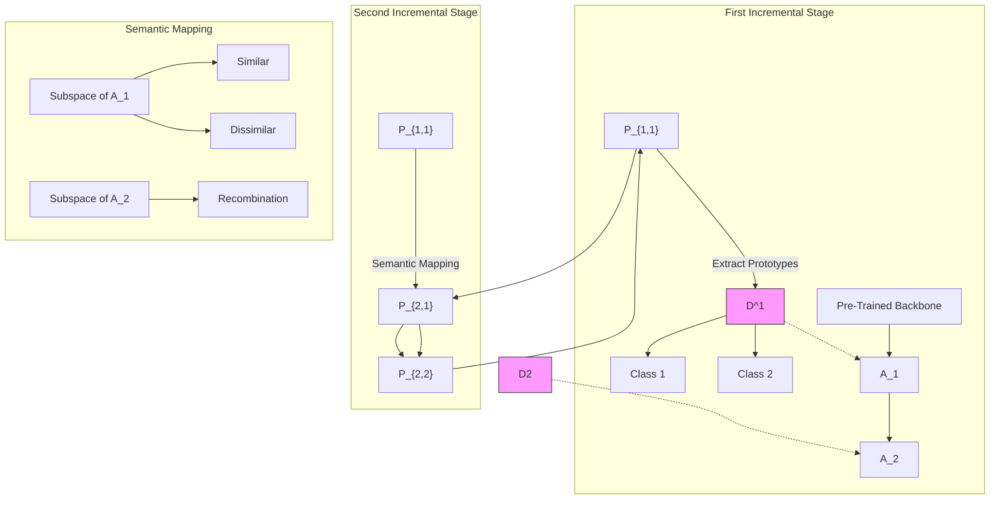

# Expandable Subspace Ensemble for Pre-Trained Model-Based Class-Incremental Learning

Da-Wei Zhou, Hai-Long Sun, Han-Jia Ye(), De-Chuan Zhan National Key Laboratory for Novel Software Technology, Nanjing University, China School of Artificial Intelligence, Nanjing University, China

{zhoudw,sunhl,yehj,zhandc}@lamda.nju.edu.cn

# Abstract

Class-Incremental Learning (CIL) requires a learning system to continually learn new classes without forgetting. Despite the strong performance of Pre-Trained Models (PTMs) in CIL, a critical issue persists: learning new classes often results in the overwriting of old ones. Excessive modification of the network causes forgetting, while minimal adjustments lead to an inadequate fit for new classes. As a result, it is desired to figure out a way of efficient model updating without harming former knowledge. In this paper, we propose ExpAndable Subspace Ensemble (EASE) for PTM-based CIL. To enable model updating without conflict, we train a distinct lightweight adapter module for each new task, aiming to create task-specific subspaces. These adapters span a high-dimensional feature space, enabling joint decision-making across multiple subspaces. As data evolves, the expanding subspaces render the old class classifiers incompatible with new-stage spaces. Correspondingly, we design a semantic-guided prototype complement strategy that synthesizes old classes’ new features without using any old class instance. Extensive experiments on seven benchmark datasets verify EASE’s stateof-the-art performance. Code is available at: https: //github.com/sun-hailong/CVPR24-Ease

# 1. Introduction

The advent of deep learning leads to the remarkable performance of deep neural networks in real-world applications [7, 9, 11, 41, 66]. While in the open world, data often come in the stream format, requiring a learning system to incrementally absorb new class knowledge, denoted as Class-Incremental Learning (CIL) [46]. CIL faces a major hurdle: learning new classes tends to overwrite previously acquired knowledge, leading to catastrophic forgetting of existing features [18, 19]. Correspondingly, recent advances in pre-training [24] inspire the community to utilize pre-trained models (PTMs) to alleviate forgetting [61, 62]. PTMs, pre-trained with vast datasets and substantial resources, inherently produce generalizable features. Consequently, PTM-based CIL has shown superior performance, opening avenues for practical applications [44, 49, 54, 60].

scatter

| Method | Trainable Parameters (%) | Average Accuracy (%) |
| --- | --- | --- |
| Ours | 1 | 78.5 |
| L2P [CVPR'22] | 0.5 | 74.8 |
| DualPrompt [ECCV'22] | 0.5 | 72.0 |
| CODA-Prompt [CVPR'23] | 5 | 76.8 |
| FOSTER [ECCV'22] | 100 | 77.0 |
| DER [CVPR'21] | 100 | 76.5 |
| MEMO [ICLR'23] | 50 | 75.0 |
| Using Exemplars | 100 | 76.5 |

Figure 1. Parameter-performance comparison of different methods on ImageNet-R B100 Inc50. All methods utilize the same PTM as initialization. EASE requires the same scale parameters as other prompt-based methods [49, 61, 62] while performing best among all competitors without using exemplars.

With a generalizable PTM as initialization, algorithms tend to freeze the pre-trained weight and append minimal additional parameters (e.g., prompts [31]) to accommodate incremental tasks [49, 60–62]. Since pre-trained weights are frozen, the network’s generalizability will be preserved along the learning process. Nevertheless, to capture new tasks’ features, selecting and optimizing instance-specific prompts from the prompt pool inevitably rewrites prompts of former tasks. Hence, it results in the conflict between old and new tasks, triggering catastrophic forgetting [32].

In CIL, the conflict between learning new knowledge and retaining old information is known as the stability-plasticity dilemma [23]. Hence, learning new classes should not disrupt existing ones. Several non-PTM-based methods, i.e., expandable networks [10, 17, 56, 64], address this by learning a distinct backbone for each new task, thereby creating a task-specific subspace. It ensures that optimizing a new backbone does not impact other tasks, and when concatenated, these backbones facilitate comprehensive decisionmaking across a high-dimensional space incorporating all task-specific features. To map the concatenated features to corresponding classes, a large classifier is optimized using exemplars i.e., instances of former classes.

Expandable networks resist the cross-task feature conflict, while they demand high resource allocation for backbone storage and necessitate the use of exemplars for unified classifier learning. In contrast, prompt learning enables CIL without exemplars but struggles with the forgetting of former prompts. This motivates us to question if it is possible to construct low-cost task-specific subspaces to overcome cross-task conflict without the reliance on exemplars.

There are two main challenges to achieving this goal. 1) Constructing low-cost, task-specific subspaces. Since tuning PTMs requires countless resources, we need to create and save task-specific subspaces with lightweight modules instead of the entire backbone. 2) Developing a classifier that can map continuously expanding features to corresponding classes. Since exemplars from former stages are unavailable, the former stages’ classifiers are incompatible with continual-expanding features. Hence, we need to utilize the class-wise relationship as semantic guidance to synthesize the classifiers of formerly learned classes.

In this paper, we propose ExpAndable Subspace Ensemble (EASE) to tackle the above challenges. To alleviate cross-task conflict, we learn task-specific subspace for each incremental task, making learning new classes not harm former ones. These subspaces are learned by adding lightweight adapters based on the frozen PTM, so the training and memory costs are negligible. Hence, we can concatenate the features of PTM with every adapter to aggregate information from multiple subspaces for a holistic decision. Moreover, to compensate for the dimensional mismatch between existing classifiers and expanding features, we utilize class-wise similarities in the co-occurrence space to guide the classifier mapping in the target space. Thus, we can synthesize classifiers of former stages without using exemplars. During inference, we reweight the prediction result via the compatibility between features and prototypes and build a robust ensemble considering the alignment of all subspaces. As shown in Figure 1, EASE shows state-ofthe-art performance with limited memory cost.

# 2. Related Work

Class-Incremental Learning (CIL): requires a learning system to continually absorb new class knowledge without forgetting existing ones [13, 14, 20, 22, 38, 57, 59, 74, 80, 81], which can be roughly divided into several categories. Data rehearsal-based methods [3, 6, 37, 45, 75] select and replay exemplars from former classes when learning new ones to recover former knowledge. Knowledge distillation-based methods [12, 16, 36, 46, 48, 52, 71] build the mapping between the former stage model and the current model via knowledge distillation [27]. The mapped logits/features help the incremental model to reflect former characteristics during updating. Parameter regularizationbased methods [1, 2, 34, 68] exert regularization terms on the drift of important parameters during model updating to maintain former knowledge. Model rectification-based methods [5, 43, 47, 63, 67, 73] correct the inductive bias of incremental models for unbiased prediction. Recently, expandable networks [10, 17, 29, 30, 56, 64] show strong performance among other competitors. Facing a new incremental task, they keep the previous backbone in the memory and initialize a new backbone to capture these new features. As for prediction, they concatenate all the backbones for a large feature map and learn a corresponding classifier with extra exemplars to calibrate among all classes. There are two main reasons that hinder the deployment of model expansion-based methods in pre-trained model-based CIL, $i . e . ,$ , the huge memory cost for large pre-trained models and the requirement of exemplars.

Pre-Trained Model-Based CIL: is now a hot topic in today’s CIL field [39, 58, 78]. With the prosperity of pretraining techniques, it is intuitive to introduce PTMs into CIL for better performance. Correspondingly, most methods [49, 60–62] learn a prompt pool to adaptively select the instance-specific prompt [31] for model updating. With the pre-trained weights frozen, these methods can encode new features into the prompt pool. DAP [32] further extends the prompt selection process with a prompt generation module. Apart from prompt tuning, LAE [21] proposes EMA-based model updating with online and offline models. SLCA [70] extends the Gaussian modeling of previous classes in [79] to rectify classifiers during model updating. Furthermore, ADAM [77] shows that prototypical classifier [50] is a strong baseline, and RanPAC [40] explores the application of random projection in this setting.

# 3. Preliminaries

In this section, we introduce the background of classincremental learning and pre-trained model, baselines, and their limitations.

# 3.1. Class-Incremental Learning

CIL is the learning scenario where a model continually learns to classify new classes to build a unified classifier [46]. Given a sequence of B training sets, denoted as $\{ \mathcal { D } ^ { 1 } , \bar { \mathcal { D } ^ { 2 } } , \cdot \cdot \cdot , \mathcal { D } ^ { B } \}$ , where $\mathcal { D } ^ { b } = \{ ( \mathbf { x } _ { i } , \mathbf { \bar { y } } _ { i } ) \} _ { i = 1 } ^ { n _ { b } }$ 1 is the b-th training set with $n _ { b }$ instances. An instance $\mathbf { x } _ { i } ~ \in ~ \mathbb { R } ^ { D }$ is from class $y _ { i } \in Y _ { b } . Y _ { b }$ is the label space of task $b ,$ and $Y _ { b } \cap Y _ { b ^ { \prime } } = \emptyset$ for $b \ne b ^ { \prime } ,$ , i.e., non-overlapping classes for different tasks. We follow the exemplar-free setting in [49, 61, 62], where we save no exemplars from old classes. Hence, during the b-th incremental stage, we can only access data from $\mathcal { D } ^ { b }$ for training. In CIL, we aim to build a unified classifier for all seen classes $\mathcal { V } _ { b } = Y _ { 1 } \cup \cdot \cdot \cdot Y _ { b }$ as data evolves. Specifically, we hope to find a model $f ( \mathbf { x } ) : X \to \mathcal { V } _ { b }$ that minimizes the expected risk:

$$
f ^ {*} = \underset {f \in \mathcal {H}} {\operatorname{argmin}} \mathbb {E} _ {(\mathbf {x}, y) \sim \mathcal {D} _ {t} ^ {1} \cup \dots \mathcal {D} _ {t} ^ {b}} \mathbb {I} (y \neq f (\mathbf {x})) . \tag {1}
$$

H is the hypothesis space and I(·) denotes the indicator function. $\mathcal { D } _ { t } ^ { b }$ represents the data distribution of task $b .$ Following typical PTM-based CIL works [49, 61, 62], we assume that a pre-trained model (e.g., Vision Transformer [15]) is available as the initialization for $f ( \mathbf { x } )$ . We decouple the PTM into the feature embedding $\phi ( \cdot ) : \mathbb { R } ^ { D } \to$ $\mathbb { R } ^ { d }$ and a linear classifier $W \in \mathbb { R } ^ { d \times | \mathcal { V } _ { b } | }$ . The embedding function $\phi ( \cdot )$ refers to the final [CLS] token in ViT, and the model output is denoted as $f ( \mathbf { x } ) = W ^ { \top } \phi ( \mathbf { x } )$ . For clarity, we decouple the classifier into $W = [ { \bf w } _ { 1 } , { \bf w } _ { 2 } , \cdot \cdot \cdot , { \bf w } _ { | \mathcal { V } _ { b } | } ]$ , and the classifier weight for class j is ${ \bf w } _ { j }$ .

# 3.2. Baselines in Class-Incremental Learning

Learning with PTMs: In the era of PTMs, many works [32, 49, 60–62] seek to modify the PTM slightly, in order to maintain the pre-trained knowledge. The general idea is to freeze the pre-trained weights and train the learnable prompt pool (denoted as Pool) to influence the selfattention process and encode task information. Prompts are learnable tokens with the same dimension as image patch embedding [15, 31]. The target is formulated as:

$$
\min _ {\mathbf {P o o l} \cup W} \sum_ {(\mathbf {x}, y) \in D ^ {b}} \ell \left(W ^ {\top} \bar {\phi} (\mathbf {x}; \mathbf {P o o l}), y\right) + \mathcal {L} _ {\mathbf {P o o l}}, \tag {2}
$$

where $\ell ( \cdot , \cdot )$ is the cross-entropy loss that measures the discrepancy between prediction and ground truth. $\mathcal { L } _ { \bf P o o l }$ denotes the prompt selection [62] or regularization [49] term for prompt training. Optimizing Eq. 2 encodes the task information into these prompts, enabling the PTM to capture more class-specific information as data evolves.

Learning with expandable backbones: Eq. 2 enables the continual learning of a pre-trained model, while training prompts for new classes will conflict with old ones and lead to forgetting. Before introducing PTMs to CIL, methods consider model expansion [56, 64] to tackle cross-task conflict. Specifically, when facing an incoming task, the model freezes the previous backbone $\bar { \phi } _ { o l d }$ and keeps it in memory, and initializes a new backbone $\phi _ { n e w }$ . Then it aggregates the embedding functions $[ \bar { \phi } _ { o l d } ( \cdot ) , \phi _ { n e w } ( \cdot ) ]$ and initializes a larger fully-connected layer $W _ { E } \in \mathbb { R } ^ { 2 d \times | y _ { b } | }$ . During updating, it optimizes the cross-entropy loss to train the new embedding and classifier:

$$
\min _ {\phi_ {n e w} \cup W _ {E}} \sum_ {(\mathbf {x}, y) \in D ^ {b} \cup \mathcal {E}} \ell (W _ {E} ^ {\top} [ \bar {\phi} _ {o l d} (\mathbf {x}), \phi_ {n e w} (\mathbf {x}) ], y), \tag {3}
$$

where E is the exemplar set containing instances of former classes (which is unavailable in the current setting). Eq. 3 depicts a way to learn new features for new classes. Assuming the first task contains ‘cats,’ the old embedding will be tailored for extracting features like beards and stripes due to limited model capacity. If the incoming task contains ‘birds,’ instead of erasing the former features in $\phi _ { o l d }$ , Eq. 3 resorts to a new backbone $\phi _ { n e w }$ to capture features like beaks and feathers. The concatenated features enable the model to learn new features without harming old ones, and the model calibrates among all seen classes by tuning a classifier with the exemplar set.

Learning expandable subspaces for PTM: Eq. 2 encodes the task information into the prompts while optimizing prompts for new tasks will result in conflict with old ones. By contrast, expanding backbones reveal a promising way to alleviate cross-task overwriting while the model scale and computational cost of PTMs hinder the application of Eq. 3 in PTM-based CIL. Additionally, since we do not have any exemplars E, optimizing Eq. 3 also fails to achieve a wellcalibrated classifier for all seen classes. Hence, this inspires us to explore whether it is possible to achieve low-cost subspace expansion without using exemplars.

# 4. EASE: Expandable Subspace Ensemble

Observing that subspace expansion can potentially mitigate cross-task conflict in CIL, we aim to achieve this goal without exemplars. Hence, we first create lightweight subspaces for sequential tasks to control the total budget and computational cost. The adaptation modules should reflect the task information to provide task-specific features so that learning new tasks will not harm former knowledge. On the other hand, since we do not have exemplars, we are unable to train a classifier for the ever-expanding features. Hence, we need to synthesize and complete the expanding classifier and calibrate the predictions among different tasks without using historical instances. Correspondingly, we attempt to utilize semantic-guided mapping to complete former classes in the latter subspace. Afterward, the model can enjoy the strong generalization ability of the pre-trained model and various task-specific features in a unified high-dimensional decision space and make the predictions holistically without forgetting existing ones.

We first introduce the subspace expansion process and then discuss how to complete the classifiers. We summarize the inference function with pseudo-code in the last part.

# 4.1. Subspace Expansion with Adapters

In Eq. 3, new embedding functions are obtained through fully finetuning the previous model. However, it requires a large computational cost and memory budget to finetune and save all these backbones. By contrast, we suggest achieving this goal through lightweight adapter tuning [8, 28]. Denote there are L transformer blocks in the pre-trained model, each containing a self-attention module and an MLP layer. Following [8], we learn an adapter module as a side branch for the MLP. Specifically, an adapter is a bottleneck module that contains a down-projection layer $W _ { d o w n } \in \mathbb { R } ^ { d \times r }$ , a non-linear activation function σ, and an up-projection layer $W _ { u p } \in \mathbb { R } ^ { r \times d }$ . It adjusts the output of the MLP as:

flowchart

Figure 2. Illustration of EASE. Left: In the first task, we learn an adapter A1 to encode task specific features, and extract class prototypes $\mathbf { P } _ { 1 , 1 }$ . Middle: In the second task, we initialize a new adapter A2 to encode new features, and extract prototypes $\mathbf { P } _ { 2 , 1 }$ and $\mathbf { P } _ { 2 , 2 }$ . Without exemplars, we need to synthesize $\mathbf { P } _ { 1 , 2 }$ (old class prototypes in the new subspace) for prediction. Right: Semantic mapping process. We extract class-wise similarity in the co-occurrence subspace and utilize it to synthesize old class prototypes in the target space.

$$
\mathbf {x} _ {o} = \sigma (\mathbf {x} _ {i} W _ {\text {down}}) W _ {u p} + \mathrm{MLP} (\mathbf {x} _ {i}), \tag {4}
$$

where $\mathbf { x } _ { i }$ and $\mathbf { x } _ { o }$ represent the input and output of MLP, respectively. Eq. 4 reflects the task information by adding the residual term to the original output. We denote the set of adapters among all L transformer blocks as A and the adapted embedding function with adapter A as $\phi ( \mathbf { x } ; A )$ . Hence, facing a new incremental task, we can freeze the pre-trained weights and only optimize the adapter by:

$$
\min _ {\mathcal {A} \cup W} \sum_ {(\mathbf {x}, y) \in \mathcal {D} ^ {b}} \ell \left(W ^ {\top} \bar {\phi} (\mathbf {x}; \mathcal {A}), y\right). \tag {5}
$$

Optimizing Eq. 5 enables us to encode task-specific information in these lightweight adapters and create taskspecific subspaces. Correspondingly, we share the frozen pre-trained backbone and learn expandable adapters for each new task. During the learning process of task b, we initialize a new adapter $\mathcal { A } _ { b }$ and optimize Eq. 5 to learn task-specific subspaces. This results in a list of b adapters: $\{ \mathcal { A } _ { 1 } , \mathcal { A } _ { 2 } , \cdot \cdot \cdot , \mathcal { A } _ { b } \}$ . Hence, we can easily get the concatenated features in all subspaces by concatenating the pretrained backbone with every adapter:

$$
\Phi (\mathbf {x}) = [ \phi (\mathbf {x}; \mathcal {A} _ {1}), \dots , \phi (\mathbf {x}; \mathcal {A} _ {b}) ] \in \mathbb {R} ^ {b d}. \tag {6}
$$

Effect of expandable adapters: Figure 2 (left and middle) illustrates the adapter expansion process. Since we only tune the task-specific adapter with the corresponding task, training the new task will not harm the old knowledge (i.e., former adapters). Moreover, in Eq. 6, we combine the pretrained embedding with various task-specific adapters to get the final presentation. The embedding contains all taskspecific information in various subspaces that can be further integrated for a holistic prediction. Furthermore, since adapters are only lightweight branches, they require much fewer parameters than fully finetuning the backbone. The parameter cost for saving these adapters is $( B \times L \times 2 d r )$ , where B is the number of tasks, L is the number of transformer blocks, and 2dr denotes the parameter number of each adapter (i.e., linear projections).

After getting the holistic embedding, we discuss how to build the mapping from bd dimensional features to classes. We utilize a prototype-based classifier [50] for prediction. Specifically, after the training process of each incremental stage, we extract the class prototype of the i-th class in adapter $\mathcal { A } _ { b } { \ } _ { \mathrm { s } }$ subspace:

$$
\boldsymbol {p} _ {i, b} = \frac {1}{N} \sum_ {j = 1} ^ {| \mathcal {D} ^ {b} |} \mathbb {I} (y _ {j} = i) \phi (\mathbf {x} _ {j}; \mathcal {A} _ {b}), \tag {7}
$$

where N is the instance number of class i. Eq. 7 denotes the most representative pattern of the corresponding class in the corresponding embedding space, and we can utilize the concatenation of prototypes in all adapters’ embedding spaces $\mathcal { P } _ { i } = [ \pmb { p } _ { i , 1 } , \pmb { p } _ { i , 2 } , \cdots , \pmb { p } _ { i , b } ] \in \mathbb { R } ^ { b d }$ to serve as class i’s classifier. Hence, the classification is based on the similarity of a corresponding embedding Φ(x) and the concatenated prototype, $i . e . , p ( y | \mathbf { x } ) \propto \sin \langle \mathcal { P } _ { y } , \Phi ( \mathbf { x } ) \rangle$ . We utilize a cosine classifier for prediction.

# 4.2. Semantic Guided Prototype Complement

Eq. 7 builds classifiers with representative prototypes. However, when a new task arrives, we need to learn a new subspace with a new adapter. It requires recalculating all class prototypes in the latest subspace to align the prototypes with the increasing embeddings, while we do not have any exemplars to estimate that of old classes. For example, we train $\boldsymbol { A } _ { 1 }$ with the first dataset $\mathcal { D } ^ { 1 }$ in the first stage and extract prototypes for classes in $\mathcal { D } ^ { 1 }$ , denoted as $\mathbf { P } _ { 1 , 1 } ^ { \mathsf { - } } = \mathbf { C o n c a t } [ \bar { p _ { 1 , 1 } } ; \cdots p _ { | \mathcal { V } _ { 1 } | , 1 } ] \in \mathbb { R } ^ { | \mathcal { V } _ { 1 } | \times d }$ . The former subscript in $\mathbf { P } _ { 1 , 1 }$ stands for the task index, and the latter for the subspace. In the following task, we expand an adapter $\boldsymbol { A } _ { 2 }$ with $\mathcal { D } ^ { 2 }$ . Since we only have $\mathcal { D } ^ { 2 }$ , we can only calculate prototypes of $\mathcal { D } ^ { 2 }$ in $\boldsymbol { A } _ { 1 }$ and $\mathbf { \mathcal { A } } _ { 2 } \mathbf { \dot { s } }$ subspaces, $i . e . , \mathbf { P } _ { 2 , 1 } ,$ , $\mathbf { P } _ { 2 , 2 }$ . In other words, we cannot calculate the prototypes of old classes in the new embedding space, $i . e . , \mathbf { P } _ { 1 , 2 } $ . This results in the inconsistent dimension between prototypes and embeddings, and we need to find a way to complete and synthesize prototypes of old classes in the latest subspace.

Without loss of generality, we formulate the above problem as: given two subspaces (old and new) and two class sets (old and new), the target is to estimate old class prototypes in the new subspace $\hat { \mathbf { P } } _ { o , n }$ using $\mathbf { P } _ { o , o } , \mathbf { P } _ { n , o } , \mathbf { P } _ { n , n } .$ . Among them, $\mathbf { P } _ { o , o }$ and $\mathbf { P } _ { n , o }$ represent prototypes of old and new classes in the old subspace (which we call cooccurrence space), and $\mathbf { P } _ { n , n }$ represents new classes prototypes in the new subspace.

Since related classes rely on similar features to determine the label, it is intuitive to reuse similar classes’ prototypes to synthesize a prototype of a related class. For example, essential features representing a ‘lion’ can also help define a ‘cat.’ We consider such semantic similarity can be shared among different embedding spaces, i.e., the similarity between ‘cat’ and ‘lion’ should be shared across different adapters’ subspaces. Hence, we can extract such semantic information in the co-occurrence space and restore the prototypes by recombining related prototypes. Specifically, we measure the similarity between old and new classes in the old subspace (where all classes co-occur) and utilize it to reconstruct prototypes in the new embedding space. The class-wise similarity among classes is calculated via prototypes in the co-occurrence subspace:

$$
\operatorname{Sim} _ {i, j} = \frac {\mathbf {P} _ {o , o} [ i ]}{\| \mathbf {P} _ {o , o} [ i ] \| _ {2}} \frac {\mathbf {P} _ {n , o} [ j ] ^ {\top}}{\| \mathbf {P} _ {n , o} [ j ] \| _ {2}}, \tag {8}
$$

where the index i denotes the i-th class’s prototype. In Eq. 8, we measure the semantic similarity of an old class prototype to a new class prototype in the same subspace and get the similarity matrix. We further normalize the similarities via softmax: Simi,j = $\begin{array} { r } { \mathrm { S i m } _ { i , j } = \frac { \exp ^ { \mathrm { S i m } _ { i , j } } } { \sum _ { i } \exp ^ { \mathrm { S i m } _ { i , j } } } } \end{array}$ pSimi,j . The normalized similarity denotes the local relative relationship of an old class to new classes in the co-occurrence space, which is supposed to be shared across different subspaces.

After getting the similarity matrix, we further utilize the relative similarity to reconstruct old class prototypes in the new subspace. Since the relationship between classes can be shared among different subspaces, the value of old class prototypes can be measured by the weighted combination of new class prototypes:

$$
\hat {\mathbf {P}} _ {o, n} [ i ] = \sum_ {j} \operatorname{Sim} _ {i, j} \times \mathbf {P} _ {n, n} [ j ]. \tag {9}
$$

Effect of prototype complement: Figure 2 (right) depicts the prototype synthesis process. With Eq. 9, we can restore the old class prototypes in the latest subspace without any former exemplars. After learning each new adapter, we utilize Eq. 9 to reconstruct all old class prototypes in the latest subspace. The complement process is training-free, making the learning process efficient.

# 4.3. Subspace Ensemble via Subspace Reweight

So far, we have introduced subspace expansion with new adapters and prototype complement to restore old class prototypes. After adapter expansion and prototype complement, we can get a full classifier (prototype matrix) as:

$$
\left[ \begin{array}{c c c c} \mathbf {P} _ {1, 1} & \hat {\mathbf {P}} _ {1, 2} & \dots & \hat {\mathbf {P}} _ {1, B} \\ \mathbf {P} _ {2, 1} & \mathbf {P} _ {2, 2} & \dots & \hat {\mathbf {P}} _ {2, B} \\ \vdots & \vdots & \ddots & \vdots \\ \mathbf {P} _ {B, 1} & \mathbf {P} _ {B, 1} & \dots & \mathbf {P} _ {B, B} \end{array} \right]. \tag {10}
$$

Note that items above the main diagonal are estimated via Eq. 9. During inference, the logit of task b is calculated by:

$$
\left[ \mathbf {P} _ {b, 1}, \mathbf {P} _ {b, 2}, \dots , \mathbf {P} _ {b, B} \right] ^ {\top} \Phi (\mathbf {x}) = \sum_ {i} \mathbf {P} _ {b, i} ^ {\top} \phi (\mathbf {x}; \mathcal {A} _ {i}), \tag {11}
$$

which equals the ensemble of multiple (prototypeembedding) matching logit in different subspaces. Among the items in Eq. 11, only adapter $\mathcal { A } _ { b }$ is especially learned to extract task-specific features for the b-th task. Hence, we think these prototypes are more suitable for classifying the corresponding task and should take a greater part in the final inference. Hence, we transform Eq. 11 by assigning higher weights to the matching subspace:

$$
\mathbf {P} _ {b, b} ^ {\top} \phi (\mathbf {x}; \mathcal {A} _ {b}) + \alpha \sum_ {i \neq b} \mathbf {P} _ {b, i} ^ {\top} \phi (\mathbf {x}; \mathcal {A} _ {i}), \tag {12}
$$

where α is the trade-off parameter, which is set to 0.1 in our experiments. Reweighting the logits enables us to highlight the contributions of core features in the decision.

Summary of EASE: We summarize the training pipeline of EASE in the supplementary. We initialize and train an adapter for each incoming task to encode the task-specific information. Afterward, we extract the prototypes of the current dataset for all adapters and synthesize the prototypes of former classes. Finally, we construct the full classifier and reweight the logit for prediction. Since we are using the prototype-based classifier for inference, the classifier W in Eq. 5 will be dropped after each learning stage.

Table 1. Average and last performance comparison on seven datasets with ViT-B/16-IN21K as the backbone. ‘IN-R/A’ stands for ‘ImageNet-R/A,’ ‘ObjNet’ stands for ‘ObjectNet,’ and ‘OmniBench’ stands for ‘OmniBenchmark.’ We report all compared methods with their source code. The best performance is shown in bold. All methods are implemented without using exemplars. 

<table><tr><td rowspan="2">Method</td><td colspan="2">CIFAR B0 Inc5</td><td colspan="2">CUB B0 Inc10</td><td colspan="2">IN-R B0 Inc5</td><td colspan="2">IN-A B0 Inc20</td><td colspan="2">ObjNet B0 Inc10</td><td colspan="2">OmniBench B0 Inc30</td><td colspan="2">VTAB B0 Inc10</td></tr><tr><td> $\bar{A}$ </td><td> $A_B$ </td><td> $\bar{A}$ </td><td> $A_B$ </td><td> $\bar{A}$ </td><td> $A_B$ </td><td> $\bar{A}$ </td><td> $A_B$ </td><td> $\bar{A}$ </td><td> $A_B$ </td><td> $\bar{A}$ </td><td> $A_B$ </td><td> $\bar{A}$ </td><td> $A_B$ </td></tr><tr><td>Finetune</td><td>38.90</td><td>20.17</td><td>26.08</td><td>13.96</td><td>21.61</td><td>10.79</td><td>24.28</td><td>14.51</td><td>19.14</td><td>8.73</td><td>23.61</td><td>10.57</td><td>34.95</td><td>21.25</td></tr><tr><td>Finetune Adapter [8]</td><td>60.51</td><td>49.32</td><td>66.84</td><td>52.99</td><td>47.59</td><td>40.28</td><td>45.41</td><td>41.10</td><td>50.22</td><td>35.95</td><td>62.32</td><td>50.53</td><td>48.91</td><td>45.12</td></tr><tr><td>LwF [36]</td><td>46.29</td><td>41.07</td><td>48.97</td><td>32.03</td><td>39.93</td><td>26.47</td><td>37.75</td><td>26.84</td><td>33.01</td><td>20.65</td><td>47.14</td><td>33.95</td><td>40.48</td><td>27.54</td></tr><tr><td>SDC [67]</td><td>68.21</td><td>63.05</td><td>70.62</td><td>66.37</td><td>52.17</td><td>49.20</td><td>29.11</td><td>26.63</td><td>39.04</td><td>29.06</td><td>60.94</td><td>50.28</td><td>45.06</td><td>22.50</td></tr><tr><td>L2P [62]</td><td>85.94</td><td>79.93</td><td>67.05</td><td>56.25</td><td>66.53</td><td>59.22</td><td>49.39</td><td>41.71</td><td>63.78</td><td>52.19</td><td>73.36</td><td>64.69</td><td>77.11</td><td>77.10</td></tr><tr><td>DualPrompt [61]</td><td>87.87</td><td>81.15</td><td>77.47</td><td>66.54</td><td>63.31</td><td>55.22</td><td>53.71</td><td>41.67</td><td>59.27</td><td>49.33</td><td>73.92</td><td>65.52</td><td>83.36</td><td>81.23</td></tr><tr><td>CODA-Prompt [49]</td><td>89.11</td><td>81.96</td><td>84.00</td><td>73.37</td><td>64.42</td><td>55.08</td><td>53.54</td><td>42.73</td><td>66.07</td><td>53.29</td><td>77.03</td><td>68.09</td><td>83.90</td><td>83.02</td></tr><tr><td>SimpleCIL [77]</td><td>87.57</td><td>81.26</td><td>92.20</td><td>86.73</td><td>62.58</td><td>54.55</td><td>59.77</td><td>48.91</td><td>65.45</td><td>53.59</td><td>79.34</td><td>73.15</td><td>85.99</td><td>84.38</td></tr><tr><td>ADAM + Finetune [77]</td><td>87.67</td><td>81.27</td><td>91.82</td><td>86.39</td><td>70.51</td><td>62.42</td><td>61.01</td><td>49.57</td><td>61.41</td><td>48.34</td><td>73.02</td><td>65.03</td><td>87.47</td><td>80.44</td></tr><tr><td>ADAM + VPT-S [77]</td><td>90.43</td><td>84.57</td><td>92.02</td><td>86.51</td><td>66.63</td><td>58.32</td><td>58.39</td><td>47.20</td><td>64.54</td><td>52.53</td><td>79.63</td><td>73.68</td><td>87.15</td><td>85.36</td></tr><tr><td>ADAM + VPT-D [77]</td><td>88.46</td><td>82.17</td><td>91.02</td><td>84.99</td><td>68.79</td><td>60.48</td><td>58.48</td><td>48.52</td><td>67.83</td><td>54.65</td><td>81.05</td><td>74.47</td><td>86.59</td><td>83.06</td></tr><tr><td>ADAM + SSF [77]</td><td>87.78</td><td>81.98</td><td>91.72</td><td>86.13</td><td>68.94</td><td>60.60</td><td>61.30</td><td>50.03</td><td>69.15</td><td>56.64</td><td>80.53</td><td>74.00</td><td>85.66</td><td>81.92</td></tr><tr><td>ADAM + Adapter [77]</td><td>90.65</td><td>85.15</td><td>92.21</td><td>86.73</td><td>72.35</td><td>64.33</td><td>60.47</td><td>49.37</td><td>67.18</td><td>55.24</td><td>80.75</td><td>74.37</td><td>85.95</td><td>84.35</td></tr><tr><td>EASE</td><td>91.51</td><td>85.80</td><td>92.23</td><td>86.81</td><td>78.31</td><td>70.58</td><td>65.34</td><td>55.04</td><td>70.84</td><td>57.86</td><td>81.11</td><td>74.85</td><td>93.61</td><td>93.55</td></tr></table>

line

| Number of Classes | L2P   | DualPrompt | SimpleCIL | ADAM+Finetune | ADAM+VPT-S | ADAM+VPT-D | ADAM+SSF | ADAM+Adapter | CODA-Prompt | EASE  |
| ----------------- | ----- | ---------- | --------- | ------------- | ---------- | ---------- | -------- | ------------ | ----------- | ----- |
| 20                | 95.0  | 94.5       | 88.0      | 93.0          | 93.5       | 94.0       | 93.8     | 94.2         | 93.7        | 95.5  |
| 40                | 92.0  | 91.5       | 84.0      | 88.0          | 89.0       | 90.0       | 89.5     | 90.5         | 89.8        | 93.0  |
| 60                | 89.0  | 88.5       | 80.0      | 84.0          | 86.0       | 87.0       | 86.5     | 87.5         | 86.8        | 91.0  |
| 80                | 86.0  | 85.5       | 76.0      | 80.0          | 83.0       | 84.0       | 83.5     | 84.5         | 83.8        | 89.0  |
| 100               | 83.0  | 82.5       | 74.0      | 77.0          | 80.0       | 81.0       | 80.5     | 81.5         | 80.8        | 87.0  |

(a) CIFAR B0 Inc20

line

| Number of Classes | L2P   | DualPrompt | SimpleCIL | ADAM+Finetune | ADAM+VPT-S | ADAM+VPT-D | ADAM+SSF | ADAM+Adapter | CODA-Prompt | EASE  |
| ----------------- | ----- | ---------- | --------- | ------------- | ---------- | ---------- | -------- | ------------ | ----------- | ----- |
| 0                 | 65.0  | 70.0       | 75.0      | 80.0          | 85.0       | 85.0       | 85.0     | 85.0         | 85.0        | 85.0  |
| 50                | 55.0  | 65.0       | 70.0      | 75.0          | 75.0       | 75.0       | 75.0     | 75.0         | 75.0        | 75.0  |
| 100               | 45.0  | 60.0       | 65.0      | 70.0          | 70.0       | 70.0       | 70.0     | 70.0         | 70.0        | 70.0  |
| 150               | 42.0  | 55.0       | 60.0      | 65.0          | 65.0       | 65.0       | 65.0     | 65.0         | 65.0        | 65.0  |
| 200               | 40.0  | 50.0       | 55.0      | 60.0          | 60.0       | 60.0       | 60.0     | 60.0         | 60.0        | 60.0  |

(b) ImageNet-A B0 Inc20

line

| Number of Classes | L2P   | DualPrompt | SimpleCIL | ADAM+Finetune | ADAM+VPT-S | ADAM+VPT-D | ADAM+SSF | ADAM+Adapter | CODA-Prompt | EASE  |
| ----------------- | ----- | ---------- | --------- | ------------- | ---------- | ---------- | -------- | ------------ | ----------- | ----- |
| 0                 | 88.0  | 85.0       | 83.0      | 87.0          | 86.0       | 90.0       | 89.0     | 88.0         | 87.0        | 94.0  |
| 50                | 78.0  | 75.0       | 72.0      | 79.0          | 77.0       | 82.0       | 81.0     | 80.0         | 79.0        | 88.0  |
| 100               | 72.0  | 70.0       | 68.0      | 75.0          | 73.0       | 78.0       | 77.0     | 76.0         | 75.0        | 84.0  |
| 150               | 68.0  | 66.0       | 64.0      | 71.0          | 69.0       | 74.0       | 73.0     | 72.0         | 71.0        | 81.0  |
| 200               | 65.0  | 63.0       | 61.0      | 68.0          | 66.0       | 71.0       | 70.0     | 69.0         | 68.0        | 78.0  |

(c) ImageNet-R B0 Inc10

line

| Number of Classes | L2P   | DualPrompt | SimpleCIL | ADAM+Finetune | ADAM+VPT-S | ADAM+VPT-D | ADAM+SSF | ADAM+Adapter | CODA-Prompt | EASE  |
| ----------------- | ----- | ---------- | --------- | ------------- | ---------- | ---------- | -------- | ------------ | ----------- | ----- |
| 0                 | 80.0  | 68.0       | 82.0      | 78.0          | 85.0       | 83.0       | 81.0     | 84.0         | 86.0        | 90.0  |
| 50                | 75.0  | 65.0       | 78.0      | 72.0          | 80.0       | 78.0       | 76.0     | 79.0         | 81.0        | 85.0  |
| 100               | 70.0  | 62.0       | 72.0      | 68.0          | 75.0       | 73.0       | 71.0     | 74.0         | 76.0        | 80.0  |
| 150               | 65.0  | 58.0       | 65.0      | 62.0          | 70.0       | 68.0       | 66.0     | 69.0         | 71.0        | 75.0  |
| 200               | 60.0  | 55.0       | 60.0      | 58.0          | 65.0       | 63.0       | 61.0     | 64.0         | 66.0        | 70.0  |

(d) ObjectNet B0 Inc20

line

| Number of Classes | L2P   | DualPrompt | SimpleCIL | ADAM+Finetune | ADAM+VPT-S | ADAM+VPT-D | ADAM+SSF | ADAM+Adapter | CODA-Prompt | EASE  |
| ----------------- | ----- | ---------- | --------- | ------------- | ---------- | ---------- | -------- | ------------ | ----------- | ----- |
| 50                | 90.0  | 88.0       | 87.0      | 86.0          | 89.0       | 88.0       | 87.0     | 86.0         | 85.0        | 89.0  |
| 100               | 85.0  | 82.0       | 81.0      | 80.0          | 84.0       | 83.0       | 82.0     | 81.0         | 80.0        | 85.0  |
| 150               | 80.0  | 78.0       | 77.0      | 76.0          | 81.0       | 80.0       | 79.0     | 78.0         | 77.0        | 82.0  |
| 200               | 75.0  | 74.0       | 73.0      | 72.0          | 78.0       | 77.0       | 76.0     | 75.0         | 74.0        | 79.0  |
| 250               | 72.0  | 71.0       | 70.0      | 69.0          | 75.0       | 74.0       | 73.0     | 72.0         | 71.0        | 76.0  |
| 300               | 68.0  | 67.0       | 66.0      | 65.0          | 72.0       | 71.0       | 70.0     | 69.0         | 68.0        | 73.0  |

(e) Omnibenchmark B0 Inc30

line

| Number of Classes | L2P   | DualPrompt | SimpleCIL | ADAM+Finetune | ADAM+VPT-S | ADAM+VPT-D | ADAM+SSF | ADAM+Adapter | CODA-Prompt | EASE  |
| ----------------- | ----- | ---------- | --------- | ------------- | ---------- | ---------- | -------- | ------------ | ----------- | ----- |
| 10                | 88.0  | 85.0       | 89.0      | 87.0          | 90.0       | 93.0       | 94.0     | 95.0         | 91.0        | 96.0  |
| 20                | 81.0  | 76.0       | 86.0      | 82.0          | 88.0       | 91.0       | 92.0     | 93.0         | 89.0        | 92.0  |
| 30                | 84.0  | 81.0       | 88.0      | 85.0          | 90.0       | 92.0       | 93.0     | 94.0         | 91.0        | 93.0  |
| 40                | 73.0  | 75.0       | 85.0      | 83.0          | 87.0       | 89.0       | 91.0     | 92.0         | 88.0        | 92.0  |
| 50                | 78.0  | 80.0       | 86.0      | 84.0          | 88.0       | 87.0       | 89.0     | 88.0         | 86.0        | 92.0  |

(f) VTAB B0 Inc10   
Figure 3. Performance curve of different methods under different settings. All methods are initialized with ViT-B/16-IN1K. We annotate the relative improvement of EASE above the runner-up method with numerical numbers at the last incremental stage.

# 5. Experiments

In this section, we conduct experiments on seven benchmark datasets and compare EASE to other state-of-the-art algorithms to show the incremental learning ability. Additionally, we provide an ablation study and parameter analysis to investigate the robustness of our proposed method. We also analyze the effect of prototype synthesis and provide visualization to show EASE’s effectiveness. More experimental results can be found in the supplementary.

# 5.1. Implementation Details

Dataset: Since pre-trained models may possess extensive knowledge of upstream tasks, we follow [62, 77] to evaluate the performance on CIFAR100 [35], CUB200 [55], ImageNet-R [25], ImageNet-A [26], ObjectNet [4], Omnibenchmark [72] and VTAB [69]. These datasets contain typical CIL benchmarks and out-of-distribution datasets that have large domain gap with ImageNet (i.e., the pretrained dataset). There are 50 classes in VTAB, 100 classes in CIFAR100, 200 classes in CUB, ImageNet-R, ImageNet-A, ObjectNet, and 300 classes in OmniBenchmark. More details are reported in the supplementary.

Table 2. Comparison to traditional exemplar-based CIL methods. EASE does not use any exemplars. All methods are based on the same pre-trained model (ViT-B/16-IN21K). 

<table><tr><td rowspan="2">Method</td><td rowspan="2">Exemplars</td><td colspan="2">ImageNet-R B0 Inc20</td><td colspan="2">CIFAR B0 Inc10</td></tr><tr><td> $\bar{A}$ </td><td> $A_B$ </td><td> $\bar{A}$ </td><td> $A_B$ </td></tr><tr><td>iCaRL [46]</td><td>20 / class</td><td>72.42</td><td>60.67</td><td>82.46</td><td>73.87</td></tr><tr><td>DER [64]</td><td>20 / class</td><td>80.48</td><td>74.32</td><td>86.04</td><td>77.93</td></tr><tr><td>FOSTER [56]</td><td>20 / class</td><td>81.34</td><td>74.48</td><td>89.87</td><td>84.91</td></tr><tr><td>MEMO [76]</td><td>20 / class</td><td>74.80</td><td>66.62</td><td>84.08</td><td>75.79</td></tr><tr><td>EASE</td><td>0</td><td>81.73</td><td>76.17</td><td>92.35</td><td>87.76</td></tr></table>

line

| Number of Classes | L2P   | ADAM+VPT-D | DualPrompt | ADAM+SSF | SimpleCIL | ADAM+Adapter | ADAM+Finetune | CODA-Prompt | EASE   |
| ----------------- | ----- | ---------- | ---------- | -------- | --------- | ------------ | ------------- | ----------- | ------ |
| 100               | 85.0  | 80.0       | 75.0       | 80.0     | 60.0      | 80.0         | 85.0          | 80.0        | 80.0   |
| 120               | 80.0  | 75.0       | 70.0       | 75.0     | 55.0      | 75.0         | 80.0          | 75.0        | 75.0   |
| 140               | 75.0  | 70.0       | 65.0       | 70.0     | 50.0      | 70.0         | 75.0          | 70.0        | 70.0   |
| 160               | 70.0  | 65.0       | 60.0       | 65.0     | 45.0      | 65.0         | 70.0          | 65.0        | 65.0   |
| 180               | 65.0  | 60.0       | 55.0       | 60.0     | 40.0      | 60.0         | 65.0          | 60.0        | 60.0   |
| 200               | 60.0  | 55.0       | 50.0       | 55.0     | 35.0      | 55.0         | 60.0          | 55.0        | 55.0   |

(a) ImageNet-R B100 Inc50

line

| Number of Classes | L2P   | DualPrompt | SimpleCIL | ADAM+Finetune | ADAM+VPT-S | ADAM+VPT-D | ADAM+SSF | ADAM+Adapter | CODA-Prompt | EASE  |
| ----------------- | ----- | ---------- | --------- | ------------- | ---------- | ---------- | -------- | ------------ | ----------- | ----- |
| 100               | 60.0  | 60.0       | 60.0      | 60.0          | 60.0       | 60.0       | 60.0     | 60.0         | 60.0        | 70.0  |
| 120               | 55.0  | 55.0       | 55.0      | 55.0          | 55.0       | 55.0       | 55.0     | 55.0         | 55.0        | 65.0  |
| 140               | 50.0  | 50.0       | 50.0      | 50.0          | 50.0       | 50.0       | 50.0     | 50.0         | 50.0        | 60.0  |
| 160               | 45.0  | 45.0       | 45.0      | 45.0          | 45.0       | 45.0       | 45.0     | 45.0         | 45.0        | 55.0  |
| 180               | 40.0  | 40.0       | 40.0      | 40.0          | 40.0       | 40.0       | 40.0     | 40.0         | 40.0        | 50.0  |
| 200               | 35.0  | 35.0       | 35.0      | 35.0          | 35.0       | 35.0       | 35.0     | 35.0         | 35.0        | 45.0  |

(b) ImageNet-A B100 Inc50   
Figure 4. Experimental results with large base classes. All methods are based on the same pre-trained model (ViT-B/16-IN21K)

Dataset split: Following the benchmark setting [46, 62], we use ‘B-m Inc-n’ to denote the class split. m indicates the number of classes in the first stage, and n represents that of every incremental stage. For all compared methods, we follow [46] to randomly shuffle class orders with random seed 1993 before data split. We keep the training and testing set the same as [77] for all methods for a fair comparison.

Comparison methods: We choose state-of-the-art PTMbased CIL methods for comparison, i.e., L2P [62], DualPrompt [61], CODA-Prompt [49], SimpleCIL [77] and ADAM [77]. Additionally, we also compare our method to typical CIL methods by equipping them with the same PTM, e.g., LwF [36], SDC [67], iCaRL [46], DER [64], FOSTER [56] and MEMO [76]. We report the baseline method, which sequentially finetunes the PTM as Finetune. We implement all methods with the same PTM.

Training details: We run experiments on NVIDIA 4090 and reproduce other compared methods with PyTorch [42] and Pilot [51]. Following [62, 77], we consider two representative models, i.e., ViT-B/16-IN21K and ViT-B/16- IN1K as the pre-trained model. They are obtained by pretraining on ImageNet21K, while the latter is further finetuned with ImageNet1K. In EASE, we train the model using SGD optimizer, with a batch size of 48 for 20 epochs. The learning rate decays from 0.01 with cosine annealing. We set the projection dim r in the adapter to 16 and the trade-off parameter α to 0.1.

Evaluation metric: Following the benchmark protocol [46], we use $\mathcal { A } _ { b }$ to represent the model’s accuracy after

line

| Number of Classes | Vanilla PTM | w/ Task-Specific Adapters | w/ Prototype Complement | w/ Subspace Reweight |
| ----------------- | ----------- | ------------------------- | ----------------------- | -------------------- |
| 0                 | 79.0        | 93.0                      | 93.0                    | 93.0                 |
| 50                | 72.0        | 86.0                      | 87.0                    | 88.0                 |
| 100               | 66.0        | 80.0                      | 81.0                    | 82.0                 |
| 150               | 64.0        | 76.0                      | 78.0                    | 80.0                 |
| 200               | 61.0        | 73.0                      | 75.0                    | 77.0                 |

Figure 5. Ablation Study of different components in EASE. We find every component in EASE can improve the performance.

the b-th stage. Specifically, we adopt $\mathcal { A } _ { B }$ (the performance after the last stage) and $\begin{array} { r } { \dot { \bar { \mathcal { A } } } = \frac { 1 } { B } \sum _ { b = 1 } ^ { \mathbf { \dot { B } } } \mathcal { A } _ { b } } \end{array}$ (average performance along incremental stages) as measurements.

# 5.2. Benchmark Comparison

In this section, we compare EASE to other state-of-the-art methods on seven benchmark datasets and different backbone weights. Table 1 reports the comparison of different methods with ViT-B/16-IN21K. We can infer that EASE achieves the best performance among all seven benchmarks, substantially outperforming the current SOTA methods, i.e., CODA-Prompt, and ADAM. We also report the incremental performance trend of different methods in Figure 3 with ViT-B/16-IN1K. As annotated at the end of each image, we find EASE outperforms the runner-up method by 4%∼7.5% on ImageNet-R/A, ObjectNet, and VTAB.

Apart from the B0 settings in Table 1 and Figure 3, we also conduct experiments with vase base classes. As shown in Figure 4, EASE still works competitively given various data split settings. Additionally, we also compare EASE to traditional CIL methods by implementing them based on the same pre-trained model in Table 2. It must be noted that traditional CIL methods require saving exemplars to recover former knowledge, while ours do not. We follow [46] to set the exemplar number to 20 per class for these methods. Surprisingly, we find EASE still works competitively in comparison to these exemplar-based methods.

Finally, we investigate the parameter number of different methods and report the parameter-performance comparison on ImageNet-R B100 Inc50 in Figure 1. As shown in the figure, EASE uses the same scale of parameters as other prompt-based methods, e.g., L2P and DualPrompt, while achieving the best performance among all competitors. Extensive experiments validate the effectiveness of EASE.

# 5.3. Ablation Study

In this section, we conduct an ablation study to investigate the effectiveness of each component in EASE. Specifically, we report the incremental performance of different variations on ImageNet-R B0 Inc20 in Figure 5. In the figure, ‘Vanilla PTM’ denotes classifying with prototype classifier of the pre-trained image encoder, which stands for the baseline. To enhance feature diversity, we aim to equip the PTM with expandable adapters (Eq. 6). Since we do not have exemplars, we report the performance of ‘w/ Task-Specific Adapters’ by only using the diagonal components in Eq. 10. When comparing it to ‘Vanilla PTM,’ we find although a pre-trained model possesses generalizable features, the adaptation to downstream tasks to extract taskspecific features is also an essential step in CIL. Furthermore, we can complete the classifier by semantic mapping (Eq. 9) and use a full classifier instead of diagonal components for classification. We denote such format as ‘w/ Prototype Complement.’ As shown in the figure, prototype complement further improves the performance, indicating that cross-task semantic information from other tasks can help the inference. Finally, we adjust the logit with Eq. 12 by reweighting the importance of different components (denoted as ‘w/ Subspace Reweight’), which further improves the performance. Ablations verify that every component in EASE boosts the CIL performance.

scatter

| Group | X Coordinate | Y Coordinate |
|-------|--------------|--------------|
| Red   | 0.1          | 0.8          |
| Red   | 0.2          | 0.75         |
| Red   | 0.3          | 0.7          |
| Red   | 0.4          | 0.65         |
| Red   | 0.5          | 0.6          |
| Red   | 0.6          | 0.55         |
| Red   | 0.7          | 0.5          |
| Red   | 0.8          | 0.45         |
| Red   | 0.9          | 0.4          |
| Red   | 1.0          | 0.35         |
| Green | 0.1          | 0.9          |
| Green | 0.2          | 0.85         |
| Green | 0.3          | 0.8          |
| Green | 0.4          | 0.75         |
| Green | 0.5          | 0.7          |
| Green | 0.6          | 0.65         |
| Green | 0.7          | 0.6          |
| Green | 0.8          | 0.55         |
| Green | 0.9          | 0.5          |
| Green | 1.0          | 0.45         |
| Purple| 0.1          | 0.85         |
| Purple| 0.2          | 0.8          |
| Purple| 0.3          | 0.75         |
| Purple| 0.4          | 0.7          |
| Purple| 0.5          | 0.65         |
| Purple| 0.6          | 0.6          |
| Purple| 0.7          | 0.55         |
| Purple| 0.8          | 0.5          |
| Purple| 0.9          | 0.45         |
| Purple| 1.0          | 0.4          |
| Yellow| 0.1          | 0.9          |
| Yellow| 0.2          | 0.85         |
| Yellow| 0.3          | 0.8          |
| Yellow| 0.4          | 0.75         |
| Yellow| 0.5          | 0.7          |
| Yellow| 0.6          | 0.65         |
| Yellow| 0.7          | 0.6          |
| Yellow| 0.8          | 0.55         |
| Yellow| 0.9          | 0.5          |
| Yellow| 1.0          | 0.45         |
| Grey   | 0.1          | 0.85         |
| Grey   | 0.2          | 0.8          |
| Grey   | 0.3          | 0.75         |
| Grey   | 0.4          | 0.7          |
| Grey   | 0.5          | 0.65         |
| Grey   | 0.6          | 0.6          |
| Grey   | 0.7          | 0.55         |
| Grey   | 0.8          | 0.5          |
| Grey   | 0.9          | 0.45         |
| Grey   | 1.0          | 0.4          |

(a) Subspace of A1

  
(b) Subspace of A2   
Figure 6. t-SNE [53] visualizations of different adapters’ subspaces, which are learned to discriminate the corresponding task.

# 5.4. Further Analysis

Visualizations: In this paper, we expect different adapters to learn task-specific features. To verify this hypothesis, we conduct experiments with ImageNet-R B0 Inc5 and visualize the embeddings in different adapter spaces in Figure 6 using t-SNE [53]. We consider two incremental stages (each containing five classes) and learn two adapters A1, A2 for these tasks. We represent classes of the first task with dots and classes of the second task with triangles. As shown in Figure 6a, in adapter A1’s embedding space, classes of the first task (dots) are clearly separated, while classes of the second task (triangles) are not. We can observe a similar phenomenon in Figure 6b, where adapter $\boldsymbol { A } _ { 2 }$ can discriminate classes in the second task. Hence, we should mainly resort to the adapter to classify classes of the corresponding task, as formulated in Eq. 12.

Parameter robustness: There are two hyperparameters in EASE, i.e., the projection dim r in the adapter and the trade-off parameter α in Eq. 12. We conduct experiments on ImageNet-R B0 Inc20 to investigate the robustness by changing these parameters. Specifically, we choose r among {8, 16, 32, 64, 128}, and α among {0.01, 0.05, 0.1, 0.3, 0.5}. We report the average performance in Figure 7a. As shown in the figure, the performance is robust with the change of these parameters, and we suggest r = 16, α = 0.1 as default for other datasets.

heatmap

| Trade-off Parameter α | 0.5 | 0.3 | 0.1 | 5e-2 | 1e-2 |
|---|---|---|---|---|---|
| 0.5 | 81.6 | 82.2 | 82.5 | 82.5 | 82.4 |
| 0.3 | 81.5 | 82.2 | 82.5 | 82.5 | 82.4 |
| 0.1 | 81.5 | 82.2 | 82.5 | 82.5 | 82.4 |
| 5e-2 | 81.7 | 82.4 | 82.9 | 82.5 | 82.4 |
| 1e-2 | 81.7 | 82.1 | 82.5 | 82.5 | 82.4 |
| Projection dimension r | 128 | 64 | 32 | 16 | 8 |
The values in the heatmap represent the magnitude of the parameter α at each projection dimension r, ranging from approximately 8 to 128. The color intensity reflects the value of α, with darker shades indicating higher α values. The chart is a standard matrix visualization.

(a) Robustness of hyperparameters

bar

| Dataset     | Similarity | OT   | LR   |
| ----------- | ---------- | ---- | ---- |
| ImageNet-R  | 77.3       | 76.0 | 76.1 |
| ImageNet-A  | 58.5       | 57.3 | 56.5 |
| ObjectNet   | 61.4       | 60.9 | 58.3 |

(b) Variations of Eq. 9   
Figure 7. Further analysis on parameter robustness and prototype complement strategy.

Prototype complement: Apart from similarity-based mapping in Eq. 9, there are other ways to learn the mapping and complete the prototype matrix, e.g., Linear Regression (LR) and Optimal Transport (OT) [33, 65]. Hence, we also compare the similarity-based complement to these variations in Figure 7b. With other settings the same, we find the current complement strategy the best among these variations.

# 6. Conclusion

Incremental learning is a desired ability of real-world learning systems. This paper proposes expandable subspace ensemble (EASE) for class-incremental learning with a pretrained model. Specifically, we equip a PTM with diverse subspaces through lightweight adapters. Aggregating historical features enables the model to extract holistic embeddings without forgetting. Besides, we utilize semantic information to synthesize the prototypes of former classes in latter subspaces without the help of exemplars. Extensive experiments verify EASE’s effectiveness.

Limitations and future works: Although adapters are lightweight modules that only consume limited parameters (0.3% of the total backbone), possible limitations include the extra model size for saving these adapters. Future works include designing algorithms to compress adapters.

# Acknowledgments

This work is partially supported by National Science and Technology Major Project (2022ZD0114805), NSFC (62376118, 62006112, 62250069, 61921006), Collaborative Innovation Center of Novel Software Technology and Industrialization.

# References

[1] Rahaf Aljundi, Francesca Babiloni, Mohamed Elhoseiny, Marcus Rohrbach, and Tinne Tuytelaars. Memory aware synapses: Learning what (not) to forget. In ECCV, pages 139–154, 2018. 2   
[2] Rahaf Aljundi, Klaas Kelchtermans, and Tinne Tuytelaars. Task-free continual learning. In CVPR, pages 11254–11263, 2019. 2   
[3] Rahaf Aljundi, Min Lin, Baptiste Goujaud, and Yoshua Bengio. Gradient based sample selection for online continual learning. In NeurIPS, pages 11816–11825, 2019. 2   
[4] Andrei Barbu, David Mayo, Julian Alverio, William Luo, Christopher Wang, Dan Gutfreund, Josh Tenenbaum, and Boris Katz. Objectnet: A large-scale bias-controlled dataset for pushing the limits of object recognition models. NeurIPS, 32, 2019. 6   
[5] Eden Belouadah and Adrian Popescu. Il2m: Class incremental learning with dual memory. In ICCV, pages 583–592, 2019. 2   
[6] Arslan Chaudhry, Marc’Aurelio Ranzato, Marcus Rohrbach, and Mohamed Elhoseiny. Efficient lifelong learning with agem. In ICLR, 2018. 2   
[7] Shuo Chen, Gang Niu, Chen Gong, Jun Li, Jian Yang, and Masashi Sugiyama. Large-margin contrastive learning with distance polarization regularizer. In ICML, pages 1673– 1683, 2021. 1   
[8] Shoufa Chen, GE Chongjian, Zhan Tong, Jiangliu Wang, Yibing Song, Jue Wang, and Ping Luo. Adaptformer: Adapting vision transformers for scalable visual recognition. In NeurIPS, 2022. 4, 6   
[9] Shuo Chen, Chen Gong, Jun Li, Jian Yang, Gang Niu, and Masashi Sugiyama. Learning contrastive embedding in lowdimensional space. NeurIPS, 35:6345–6357, 2022. 1   
[10] Xiuwei Chen and Xiaobin Chang. Dynamic residual classifier for class incremental learning. In ICCV, pages 18743– 18752, 2023. 1, 2   
[11] Jia Deng, Wei Dong, Richard Socher, Li-Jia Li, Kai Li, and Li Fei-Fei. Imagenet: A large-scale hierarchical image database. In CVPR, pages 248–255, 2009. 1   
[12] Prithviraj Dhar, Rajat Vikram Singh, Kuan-Chuan Peng, Ziyan Wu, and Rama Chellappa. Learning without memorizing. In CVPR, pages 5138–5146, 2019. 2   
[13] Jiahua Dong, Lixu Wang, Zhen Fang, Gan Sun, Shichao Xu, Xiao Wang, and Qi Zhu. Federated class-incremental learning. In CVPR, pages 10164–10173, 2022. 2   
[14] Jiahua Dong, Duzhen Zhang, Yang Cong, Wei Cong, Henghui Ding, and Dengxin Dai. Federated incremental semantic segmentation. In CVPR, pages 3934–3943, 2023. 2   
[15] Alexey Dosovitskiy, Lucas Beyer, Alexander Kolesnikov, Dirk Weissenborn, Xiaohua Zhai, Thomas Unterthiner, Mostafa Dehghani, Matthias Minderer, Georg Heigold, Sylvain Gelly, et al. An image is worth 16x16 words: Transformers for image recognition at scale. In ICLR, 2020. 3   
[16] Arthur Douillard, Matthieu Cord, Charles Ollion, Thomas Robert, and Eduardo Valle. Podnet: Pooled outputs distillation for small-tasks incremental learning. In ECCV, pages 86–102, 2020. 2

[17] Arthur Douillard, Alexandre Rame, Guillaume Couairon, ´ and Matthieu Cord. Dytox: Transformers for continual learning with dynamic token expansion. In CVPR, pages 9285– 9295, 2022. 1, 2   
[18] Robert M French. Catastrophic forgetting in connectionist networks. Trends in cognitive sciences, 3(4):128–135, 1999.   
[19] Robert M French and Andre Ferrara. Modeling time percep-´ tion in rats: Evidence for catastrophic interference in animal learning. In Proceedings of the 21st Annual Conference of the Cognitive Science Conference, pages 173–178. Citeseer, 1999. 1   
[20] Qiankun Gao, Chen Zhao, Bernard Ghanem, and Jian Zhang. R-DFCIL: relation-guided representation learning for datafree class incremental learning. In ECCV, pages 423–439, 2022. 2   
[21] Qiankun Gao, Chen Zhao, Yifan Sun, Teng Xi, Gang Zhang, Bernard Ghanem, and Jian Zhang. A unified continual learning framework with general parameter-efficient tuning. In ICCV, pages 11483–11493, 2023. 2   
[22] Dipam Goswami, Yuyang Liu, Bartłomiej Twardowski, and Joost van de Weijer. Fecam: Exploiting the heterogeneity of class distributions in exemplar-free continual learning. NeurIPS, 36, 2023. 2   
[23] Stephen T Grossberg. Studies of mind and brain: Neural principles of learning, perception, development, cognition, and motor control. Springer Science & Business Media, 2012. 1   
[24] Xu Han, Zhengyan Zhang, Ning Ding, Yuxian Gu, Xiao Liu, Yuqi Huo, Jiezhong Qiu, Yuan Yao, Ao Zhang, Liang Zhang, et al. Pre-trained models: Past, present and future. AI Open, 2:225–250, 2021. 1   
[25] Dan Hendrycks, Steven Basart, Norman Mu, Saurav Kadavath, Frank Wang, Evan Dorundo, Rahul Desai, Tyler Zhu, Samyak Parajuli, Mike Guo, et al. The many faces of robustness: A critical analysis of out-of-distribution generalization. In ICCV, pages 8340–8349, 2021. 6   
[26] Dan Hendrycks, Kevin Zhao, Steven Basart, Jacob Steinhardt, and Dawn Song. Natural adversarial examples. In CVPR, pages 15262–15271, 2021. 6   
[27] Geoffrey Hinton, Oriol Vinyals, and Jeff Dean. Distilling the knowledge in a neural network. arXiv preprint arXiv:1503.02531, 2015. 2   
[28] Neil Houlsby, Andrei Giurgiu, Stanislaw Jastrzebski, Bruna Morrone, Quentin De Laroussilhe, Andrea Gesmundo, Mona Attariyan, and Sylvain Gelly. Parameter-efficient transfer learning for nlp. In ICML, pages 2790–2799, 2019. 4   
[29] Zhiyuan Hu, Yunsheng Li, Jiancheng Lyu, Dashan Gao, and Nuno Vasconcelos. Dense network expansion for class incremental learning. In CVPR, pages 11858–11867, 2023. 2   
[30] Bingchen Huang, Zhineng Chen, Peng Zhou, Jiayin Chen, and Zuxuan Wu. Resolving task confusion in dynamic expansion architectures for class incremental learning. In AAAI, pages 908–916, 2023. 2   
[31] Menglin Jia, Luming Tang, Bor-Chun Chen, Claire Cardie, Serge J. Belongie, Bharath Hariharan, and Ser-Nam Lim. Visual prompt tuning. In ECCV, pages 709–727, 2022. 1, 2, 3

[32] Dahuin Jung, Dongyoon Han, Jihwan Bang, and Hwanjun Song. Generating instance-level prompts for rehearsal-free continual learning. In ICCV, pages 11847–11857, 2023. 1, 2, 3   
[33] Leonid V Kantorovich. Mathematical methods of organizing and planning production. Management science, 6(4):366– 422, 1960. 8   
[34] James Kirkpatrick, Razvan Pascanu, Neil Rabinowitz, Joel Veness, Guillaume Desjardins, Andrei A Rusu, Kieran Milan, John Quan, Tiago Ramalho, Agnieszka Grabska-Barwinska, et al. Overcoming catastrophic forgetting in neural networks. PNAS, 114(13):3521–3526, 2017. 2   
[35] Alex Krizhevsky, Geoffrey Hinton, et al. Learning multiple layers of features from tiny images. Technical report, 2009. 6   
[36] Zhizhong Li and Derek Hoiem. Learning without forgetting. TPAMI, 40(12):2935–2947, 2017. 2, 6, 7   
[37] Yaoyao Liu, Yuting Su, An-An Liu, Bernt Schiele, and Qianru Sun. Mnemonics training: Multi-class incremental learning without forgetting. In CVPR, pages 12245–12254, 2020. 2   
[38] Yaoyao Liu, Bernt Schiele, and Qianru Sun. Rmm: Reinforced memory management for class-incremental learning. NeurIPS, 34:3478–3490, 2021. 2   
[39] Mark D. McDonnell, Dong Gong, Ehsan Abbasnejad, and Anton van den Hengel. Premonition: Using generative models to preempt future data changes in continual learning. arXiv preprint arXiv:2403.07356, 2024. 2   
[40] Mark D McDonnell, Dong Gong, Amin Parvaneh, Ehsan Abbasnejad, and Anton van den Hengel. Ranpac: Random projections and pre-trained models for continual learning. NeurIPS, 36, 2024. 2   
[41] Jingyi Ning, Lei Xie, Chuyu Wang, Yanling Bu, Fengyuan Xu, Da-Wei Zhou, Sanglu Lu, and Baoliu Ye. Rf-badge: Vital sign-based authentication via rfid tag array on badges. IEEE Transactions on Mobile Computing, 22(02):1170– 1184, 2023. 1   
[42] Adam Paszke, Sam Gross, Francisco Massa, Adam Lerer, James Bradbury, Gregory Chanan, Trevor Killeen, Zeming Lin, Natalia Gimelshein, Luca Antiga, et al. Pytorch: An imperative style, high-performance deep learning library. In NeurIPS, pages 8026–8037, 2019. 7   
[43] Quang Pham, Chenghao Liu, and HOI Steven. Continual normalization: Rethinking batch normalization for online continual learning. In ICLR, 2022. 2   
[44] Weiguo Pian, Shentong Mo, Yunhui Guo, and Yapeng Tian. Audio-visual class-incremental learning. In ICCV, pages 7799–7811, 2023. 1   
[45] Roger Ratcliff. Connectionist models of recognition memory: constraints imposed by learning and forgetting functions. Psychological review, 97(2):285, 1990. 2   
[46] Sylvestre-Alvise Rebuffi, Alexander Kolesnikov, Georg Sperl, and Christoph H Lampert. icarl: Incremental classifier and representation learning. In CVPR, pages 2001–2010, 2017. 1, 2, 7   
[47] Yujun Shi, Kuangqi Zhou, Jian Liang, Zihang Jiang, Jiashi Feng, Philip HS Torr, Song Bai, and Vincent YF Tan. Mimicking the oracle: An initial phase decorrelation approach for

class incremental learning. In CVPR, pages 16722–16731, 2022. 2   
[48] Christian Simon, Piotr Koniusz, and Mehrtash Harandi. On learning the geodesic path for incremental learning. In CVPR, pages 1591–1600, 2021. 2   
[49] James Seale Smith, Leonid Karlinsky, Vyshnavi Gutta, Paola Cascante-Bonilla, Donghyun Kim, Assaf Arbelle, Rameswar Panda, Rogerio Feris, and Zsolt Kira. Coda-prompt: Continual decomposed attention-based prompting for rehearsal-free continual learning. In CVPR, pages 11909–11919, 2023. 1, 2, 3, 6, 7   
[50] Jake Snell, Kevin Swersky, and Richard Zemel. Prototypical networks for few-shot learning. In NIPS, pages 4080–4090, 2017. 2, 4   
[51] Hai-Long Sun, Da-Wei Zhou, Han-Jia Ye, and De-Chuan Zhan. Pilot: A pre-trained model-based continual learning toolbox. arXiv preprint arXiv:2309.07117, 2023. 7   
[52] Xiaoyu Tao, Xinyuan Chang, Xiaopeng Hong, Xing Wei, and Yihong Gong. Topology-preserving class-incremental learning. In ECCV, pages 254–270, 2020. 2   
[53] Laurens Van der Maaten and Geoffrey Hinton. Visualizing data using t-sne. JMLR, 9(11), 2008. 8   
[54] Andres Villa, Juan Le ´ on Alc ´ azar, Motasem Alfarra, Kumail ´ Alhamoud, Julio Hurtado, Fabian Caba Heilbron, Alvaro Soto, and Bernard Ghanem. Pivot: Prompting for video continual learning. In CVPR, pages 24214–24223, 2023. 1   
[55] C. Wah, S. Branson, P. Welinder, P. Perona, and S. Belongie. The Caltech-UCSD Birds-200-2011 Dataset. Technical Report CNS-TR-2011-001, California Institute of Technology, 2011. 6   
[56] Fu-Yun Wang, Da-Wei Zhou, Han-Jia Ye, and De-Chuan Zhan. Foster: Feature boosting and compression for classincremental learning. In ECCV, pages 398–414, 2022. 1, 2, 3, 7   
[57] Fu-Yun Wang, Da-Wei Zhou, Liu Liu, Han-Jia Ye, Yatao Bian, De-Chuan Zhan, and Peilin Zhao. BEEF: Bicompatible class-incremental learning via energy-based expansion and fusion. In ICLR, 2023. 2   
[58] Liyuan Wang, Jingyi Xie, Xingxing Zhang, Mingyi Huang, Hang Su, and Jun Zhu. Hierarchical decomposition of prompt-based continual learning: Rethinking obscured suboptimality. NeurIPS, 36, 2023. 2   
[59] Qi-Wei Wang, Da-Wei Zhou, Yi-Kai Zhang, De-Chuan Zhan, and Han-Jia Ye. Few-shot class-incremental learning via training-free prototype calibration. NeurIPS, 36, 2023. 2   
[60] Yabin Wang, Zhiwu Huang, and Xiaopeng Hong. S-prompts learning with pre-trained transformers: An occam’s razor for domain incremental learning. NeurIPS, 35:5682–5695, 2022. 1, 2, 3   
[61] Zifeng Wang, Zizhao Zhang, Sayna Ebrahimi, Ruoxi Sun, Han Zhang, Chen-Yu Lee, Xiaoqi Ren, Guolong Su, Vincent Perot, Jennifer Dy, et al. Dualprompt: Complementary prompting for rehearsal-free continual learning. In ECCV, pages 631–648, 2022. 1, 3, 6, 7   
[62] Zifeng Wang, Zizhao Zhang, Chen-Yu Lee, Han Zhang, Ruoxi Sun, Xiaoqi Ren, Guolong Su, Vincent Perot, Jennifer Dy, and Tomas Pfister. Learning to prompt for continual learning. In CVPR, pages 139–149, 2022. 1, 2, 3, 6, 7

[63] Yue Wu, Yinpeng Chen, Lijuan Wang, Yuancheng Ye, Zicheng Liu, Yandong Guo, and Yun Fu. Large scale incremental learning. In CVPR, pages 374–382, 2019. 2   
[64] Shipeng Yan, Jiangwei Xie, and Xuming He. Der: Dynamically expandable representation for class incremental learning. In CVPR, pages 3014–3023, 2021. 1, 2, 3, 7   
[65] Han-Jia Ye, De-Chuan Zhan, Yuan Jiang, and Zhi-Hua Zhou. Rectify heterogeneous models with semantic mapping. In ICML, pages 5630–5639, 2018. 8   
[66] Han-Jia Ye, De-Chuan Zhan, Nan Li, and Yuan Jiang. Learning multiple local metrics: Global consideration helps. IEEE transactions on pattern analysis and machine intelligence, 42(7):1698–1712, 2019. 1   
[67] Lu Yu, Bartlomiej Twardowski, Xialei Liu, Luis Herranz, Kai Wang, Yongmei Cheng, Shangling Jui, and Joost van de Weijer. Semantic drift compensation for class-incremental learning. In CVPR, pages 6982–6991, 2020. 2, 6, 7   
[68] Friedemann Zenke, Ben Poole, and Surya Ganguli. Continual learning through synaptic intelligence. In ICML, pages 3987–3995, 2017. 2   
[69] Xiaohua Zhai, Joan Puigcerver, Alexander Kolesnikov, Pierre Ruyssen, Carlos Riquelme, Mario Lucic, Josip Djolonga, Andre Susano Pinto, Maxim Neumann, Alexey Dosovitskiy, et al. A large-scale study of representation learning with the visual task adaptation benchmark. arXiv preprint arXiv:1910.04867, 2019. 6   
[70] Gengwei Zhang, Liyuan Wang, Guoliang Kang, Ling Chen, and Yunchao Wei. Slca: Slow learner with classifier alignment for continual learning on a pre-trained model. In ICCV, pages 19148–19158, 2023. 2   
[71] Junting Zhang, Jie Zhang, Shalini Ghosh, Dawei Li, Serafettin Tasci, Larry Heck, Heming Zhang, and C-C Jay Kuo. Class-incremental learning via deep model consolidation. In WACV, pages 1131–1140, 2020. 2   
[72] Yuanhan Zhang, Zhenfei Yin, Jing Shao, and Ziwei Liu. Benchmarking omni-vision representation through the lens of visual realms. In ECCV, pages 594–611, 2022. 6   
[73] Bowen Zhao, Xi Xiao, Guojun Gan, Bin Zhang, and Shu-Tao Xia. Maintaining discrimination and fairness in class incremental learning. In CVPR, pages 13208–13217, 2020. 2   
[74] Hanbin Zhao, Yongjian Fu, Mintong Kang, Qi Tian, Fei Wu, and Xi Li. Mgsvf: Multi-grained slow versus fast framework for few-shot class-incremental learning. IEEE Transactions on Pattern Analysis and Machine Intelligence, 46(3):1576– 1588, 2021. 2   
[75] Hanbin Zhao, Hui Wang, Yongjian Fu, Fei Wu, and Xi Li. Memory-efficient class-incremental learning for image classification. IEEE Transactions on Neural Networks and Learning Systems, 33(10):5966–5977, 2021. 2   
[76] Da-Wei Zhou, Qi-Wei Wang, Han-Jia Ye, and De-Chuan Zhan. A model or 603 exemplars: Towards memory-efficient class-incremental learning. In ICLR, 2023. 7   
[77] Da-Wei Zhou, Han-Jia Ye, De-Chuan Zhan, and Ziwei Liu. Revisiting class-incremental learning with pre-trained models: Generalizability and adaptivity are all you need. arXiv preprint arXiv:2303.07338, 2023. 2, 6, 7

[78] Da-Wei Zhou, Hai-Long Sun, Jingyi Ning, Han-Jia Ye, and De-Chuan Zhan. Continual learning with pre-trained models: A survey. arXiv preprint arXiv:2401.16386, 2024. 2   
[79] Fei Zhu, Xu-Yao Zhang, Chuang Wang, Fei Yin, and Cheng-Lin Liu. Prototype augmentation and self-supervision for incremental learning. In CVPR, pages 5871–5880, 2021. 2   
[80] Huiping Zhuang, Zhenyu Weng, Hongxin Wei, Renchunzi Xie, Kar-Ann Toh, and Zhiping Lin. Acil: Analytic classincremental learning with absolute memorization and privacy protection. NeurIPS, 35:11602–11614, 2022. 2   
[81] Huiping Zhuang, Zhenyu Weng, Run He, Zhiping Lin, and Ziqian Zeng. Gkeal: Gaussian kernel embedded analytic learning for few-shot class incremental task. In CVPR, pages 7746–7755, 2023. 2