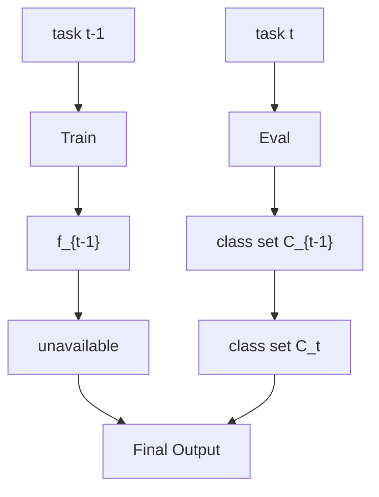
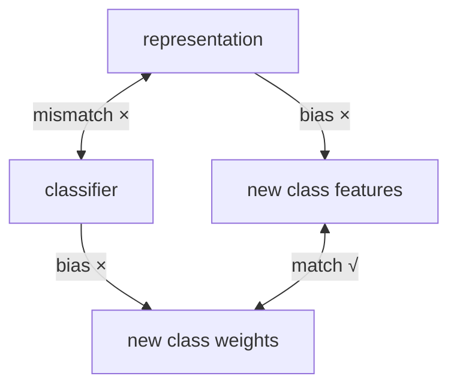
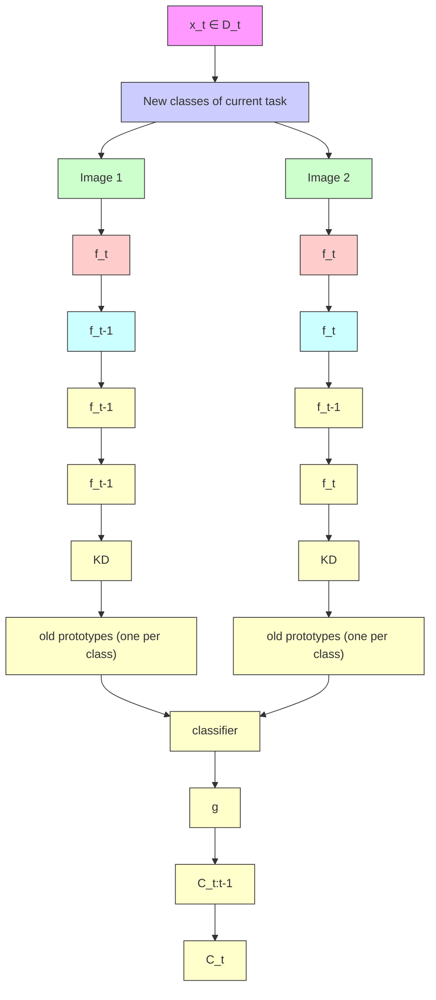
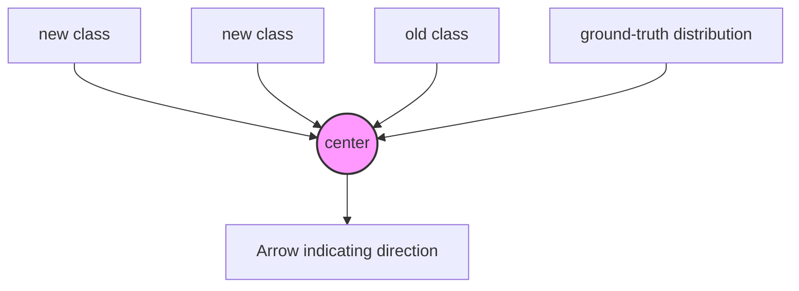
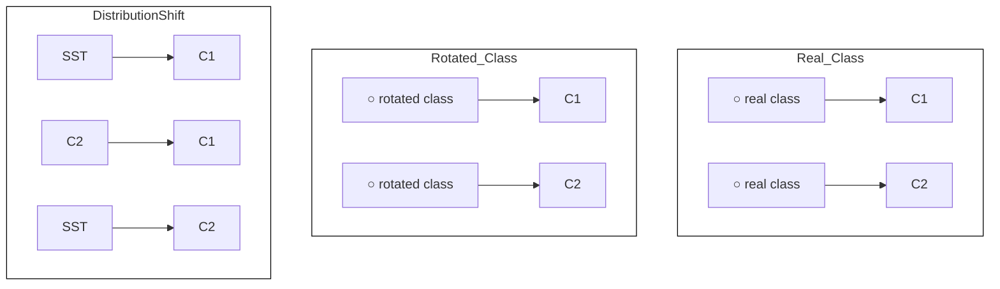

# PASS++: A Dual Bias Reduction Framework for Non-Exemplar Class-Incremental Learning

Fei Zhu , Xu-Yao Zhang , Senior Member, IEEE, Zhen Cheng , and Cheng-Lin Liu , Fellow, IEEE

Abstract—Class-incremental learning (CIL) aims to continually recognize new classes while preserving the discriminability of previously learned ones. Most existing CIL methods are exemplar-based, relying on the storage and replay of a subset of old data during training. Without access to such data, these methods typically suffer from catastrophic forgetting. In this paper, we identify two fundamental causes of forgetting in CIL: representation bias and classifier bias. To address these challenges, we propose a simple yet effective dual-bias reduction framework, which leverages selfsupervised transformation (SST) in the input space and prototype augmentation (protoAug) in the feature space. On one hand, SST mitigates representation bias by encouraging the model to learn generic, diverse representations that generalize across tasks. On the other hand, protoAug tackles classifier bias by explicitly or implicitly augmenting the prototypes of old classes in the feature space, thereby imposing stronger constraints to preserve decision boundaries. We further enhance the framework with hardnessaware prototype augmentation and multi-view ensemble strategies, yielding significant performance gains. The proposed framework can be easily integrated with pre-trained models. Without storing any samples of old classes, our method performs comparably to state-of-the-art exemplar-based approaches that rely on extensive data storage. We hope to draw the attention of researchers back to non-exemplar CIL by rethinking the necessity of storing old samples.

Index Terms—Class-incremental learning (CIL), continual learning, catastrophic forgetting, self-supervision, prototype augmentation.

# I. INTRODUCTION

H UMANS and large primates possess an inherent and dis-tinctive ability to continually acquire new experiences and

Received 19 July 2024; revised 20 April 2025; accepted 29 April 2025. Date of publication 12 May 2025; date of current version 3 July 2025. This work was supported in part by the National Science and Technology Major Project under Grant 2022ZD0116500, in part by the National Natural Science Foundation of China under Grant 62222609 and Grant 62320106010, in part by CAS Project for Young Scientists in Basic Research under Grant YSBR-083, in part by the Key Research Program of Frontier Sciences of CAS under Grant ZDBS-LY-7004, and in part by InnoHK program. Recommended for acceptance by J. Denzler. (Corresponding author: Cheng-Lin Liu.)

Fei Zhu is with the Centre for Artificial Intelligence and Robotics, Hong Kong Institute of Science and Innovation, Chinese Academy of Sciences, Hong Kong 999077, China (e-mail: fei.zhu@cair-cas.org.hk).

Xu-Yao Zhang, Zhen Cheng, and Cheng-Lin Liu are with the State Key Laboratory of Multimodal Artificial Intelligence Systems, Institute of Automation of Chinese Academy of Sciences, Beijing 100190, China, and also with the School of Artificial Intelligence, University of Chinese Academy of Sciences, Beijing 100049, China (e-mail: chengzhen2019@ia.ac.cn; xyz@nlpr.ia.ac.cn; liucl@nlpr.ia.ac.cn).

This article has supplementary downloadable material available at https://doi.org/10.1109/TPAMI.2025.3568886, provided by the authors.

Digital Object Identifier 10.1109/TPAMI.2025.3568886

accumulate knowledge throughout their lifespan. This capability, known as incremental learning [1], [2], is essential for artificial intelligence, as real-world training data typically arrives in a sequential manner. For example, a robot equipped with default object recognition capabilities may encounter unfamiliar objects that need to be identified in dynamic, open-world environments. However, deep neural networks (DNNs) are primarily effective when trained on homogenized, balanced, and randomly shuffled data [3]. When exposed to new information, they often exhibit drastic performance degradation on previously learned tasks, which is a well-documented phenomenon known as catastrophic forgetting [4], [5]. Therefore, developing models capable of learning and accumulating knowledge from sequential experience is a fundamental yet challenging step toward achieving human-level intelligence.

In recent years, a multitude of works has been proposed to enable deep neural networks to continually preserve and extend knowledge. Early studies [6], [7], [8] primarily focus on taskincremental learning (TIL), where a model learns a sequence of distinct tasks with the task identity provided during inference. This paper considers the more realistic and challenging classincremental learning (CIL) [9], [10], [11], [12], [13], where each task contains a set of classes that are disjoint from those seen previously, and the model must learn a unified classifier capable of recognizing all seen classes.

We first demonstrate the challenge of CIL by comparing it with the traditional supervised learning paradigm. For a common supervised classification task, the training data is presented interleaved and used to train a model in an end-to-end manner. Therefore, both the feature extractor and classifier are balanced. Nevertheless, without accessing old data, the learning paradigm of CIL will lead to two inherent problems: representation bias and classifier bias, as shown in Fig. 1. First, for representation learning, if the feature extractor is fixed after learning old classes, the model could maintain previously learned representations, but lacks plasticity for new classes; on the contrary, if we update the feature extractor on new classes, the old representations could be easily forgotten. We denote this as representation bias. Second, without accessing old training data, the decision boundaries between old and new classes are hard to establish and the classifier will be severely biased toward new classes. We denote this as classifier bias. Consequently, inputs from old classes can be easily predicted as new classes.

To address both the representation and classifier bias in CIL, exemplar-based [13], [14], [15], [16], [17], [18], [19], [20], [21], [22] methods store a fraction of old data to jointly train the model with current data. With retraining stored data, the representation bias and classifier bias can be largely alleviated. However, storing data is undesirable for a number of reasons. First, it is inefficient to retrain the old data and also hard to scale up for large-scale CIL due to the limited memory resource [23]. Second, storing data may be not allowed in some situations because of privacy and safety concerns [24]. Moreover, it is less human-like to directly store raw data for memory from a biological perspective [25]. An alternative way is to learn deep generative models to generate pseudo-samples of old classes [26], [27], [28]. Nevertheless, generative models are inefficient to train and also suffer from catastrophic forgetting [27]. Without data replaying, regularization based methods [6], [29], [30], [31], [32] address the catastrophic forgetting by penalizing future changes to important parameters. However, they show poor performance in CIL scenario [33]. From those works, it seems that storing old samples is a must for CIL. Therefore, a natural question arises: can we achieve acceptable CIL performance in a simple and efficient way without storing any old samples? In this work, we propose a simple and effective dual bias reduction framework for non-exemplar (i.e., without storing training data of old classes) CIL by overcoming representation and classifier bias.

flowchart

text_image

feature space after
learning task t
new C4
old C1 old C2
new C3

flowchart

Fig. 1. Left: In non-exemplar CIL, the model is updated continuously on new classes without accessing old data. Middle: after learning new classes, previous learned decision boundaries are distorted and the representation confusion is severe. Right: illustration of representation and classifier bias between old and new classes.

For representation learning, we hypothesize that diverse and transferable representations is an important requirement in incremental learning. Considering a simple example of binary classification between sofa and chair, A model might distinguish these classes by focusing on specific discriminative features such as “legs”. However, such features will no longer be useful and eventually get forgotten when the future task involves distinguishing between chair and desk; In contrast, if the model learns more general and transferable features like shape or texture, these can be re-used for future tasks and remain unforgotten. Inspired by the natural connection between incremental learning and self-supervised learning, we propose to leverage the rotation based self-supervised transformation (SST) to mitigate representation bias, revealing surprising yet intriguing findings that SST can boost the performance of CIL significantly.

For classifier learning, we propose to memorize one classrepresentative prototype for each old class. These pseudofeatures are then used alongside new class features to train a unified classifier, preserving both inter-class discrimination balance. Notably, the explicit prototype augmentation can also be formulated in an implicit manner, theoretically enabling the efficient and elegant generation of an unlimited number of pseudo-features. Furthermore, we present a hardness-aware prototype augmentation strategy to enhance the performance. Compared with the commonly used data replay strategy, protoAug is more memory-efficient and privacy-friendly.

In summary, we identify representation bias and classifier bias as two key factors contributing to catastrophic forgetting, and propose a simple and effective dual bias reduction framework for non-exemplar CIL. Importantly, if either form of bias remains unaddressed, the learned representations will be misaligned with the classifier, as illustrated in Fig. 1 (Right). Without storing any old training data, our method achieves performance comparable to state-of-the-art (SoTA) exemplar-based approaches. Parts of this work were initially presented in our CVPR oral paper [12]. This paper extends our earlier works in several important aspects:

Hardness-aware protoAug. We thoroughly analyze the limitations of the original protoAug, and propose a new strategy to synthesize hardness-aware old feature instances by ranking and mixing the feature instances of new classes and old prototypes.   
- Multi-view ensemble. Given that the classes generated via SST represent meaningful multi-view information, we fuse predictions from both the original and transformed classes to enhance performance. The newly introduced hardness-aware protoAug and multi-view ensemble lead to significant performance improvements over our conference version [12].   
We extend our proposed framework to pre-trained backbones based on low-rank adaptation [34], and demonstrate that our method can yield SoTA results among non-exemplar methods and being comparable to the latest exemplar-based approach [21].   
- We conduct experimental comparison with many recent approaches such as dynamic architecture-based and generative exemplar-based methods. Additionally, we perform large-scale experiments on ImageNet-Full to demonstrate the scalability of our method.   
- To reflect the robustness of incremental learners, we further propose to evaluate incremental model under distribution

shift (e.g., noise, blur, and weather), and provide improved strategy. Additional results, analysis and discussion are presented in Section VI-C.

# II. RELATED WORK

# A. Exemplar-Based Class-Incremental Learning

Although a basic assumption in CIL is the inaccessibility of old training data, exemplar-based methods relax this constraint by saving and retraining a portion of data of old classes. Existing exemplar-based methods can be categorized into three main groups: imbalance calibration, structured distillation, and dynamic architecture.

Imbalance calibration methods were introduced to address the imbalance between new and old classes. Some approaches [35], [36], [37], [38], [39], [40], [41], [42] focus on learning a balanced classifier during training, while others [14], [43], [44], [45], [46], [47] apply post-hoc methods to calibrate the classifier. ITO [48] addresses the imbalance problem through both weight and feature calibration. RMM [49] employs a reinforcement learning-based strategy to learn an optimal memory management policy. Additionally, generative exemplar-based methods [26], [28], [50], [51], [52] use generative models to create pseudo-examples of old classes, thus avoiding the need to store real data and mitigating the imbalance problem.

Structured distillation methods explore how to effectively distill knowledge to maintain the performance on old classes? While traditional unstructured distillation [14], [15], [35], [36], [53] remains widely used, recent works [54], [55], [56], [57], [58] focus on structured distillation. For instance, TP-CIL [54] enforces constraints on neighborhood relationships, while GeoDL [55] distills features output by both old and current models in continuous and infinite intermediate subspaces.

Architecture based methods [13], [16], [17], [18], [59], [60], [61], [62], [63] focus on adapting the network structure throughout incremental learning. To prevent the forgetting of old tasks, these methods freeze the parameters of old networks while allocating new branches to accommodate new tasks. Early works [59], [60] require task identity at inference time to select the appropriate sub-network, which is impractical in CIL. More recent approaches, including DER [17], FOSTER [18], Dytox [13], DKT [63], and DNE [64], design novel architectures to preserve old knowledge while learning new concepts, achieving strong performance in CIL.

# B. Non-Exemplar Class-Incremental Learning

Regularization based methods can be divided into two categories, explicit and implicit regularization. Explicit regularization methods [6], [8] focus on identifying and penalizing changes to important parameters of the original network when learning new classes. Another line of work [29], [30], [31], [32], [65] avoids interfering with previously learned knowledge by projecting and updating parameters in the null space of earlier tasks. Yu et al. [66] found that metric learning-based embedding networks suffer less from forgetting in CIL compared to softmax-based networks. Rather than directly constraining network parameters, implicit regularization approaches [6], [7], [67], [68], [69] focus on maintaining the input-output behavior of the network by utilizing knowledge distillation based on the current training data.

Pre-trained model methods [70], [71], [72], [73], [74], [75], [76] leverage pre-trained frozen models and learn a set of parameters that dynamically guide the model to solve tasks sequentially. For instance, L2P [70] frames learning new tasks as training small prompt parameters attached to a pre-trained frozen model. However, prompt-based methods are largely based on pre-trained models, and the information leak both in terms of features and class labels can seriously affect the results of those pre-trained model based methods [22], [77].

# C. Other Studies of Class-Incremental Learning

There have been some empirical studies [78], [79], [80], [81], [82] on incremental learning. Verwimp et al. [83] revealed the limits of exemplar-based methods. Kim et al. [22] studied the learnability of CIL and explored the connection [84] between CIL and out-of-distribution [85]. Besides, some works focus on new settings such as long-tailed [86], forgettable [87], selfsupervised [88], [89], federated [90] and few-shot [91], [92] CIL. For example, DSN [91] freezes the backbone and tentatively expands network nodes to enlarge feature representation capacity for incremental classes.

# III. PROBLEM FORMULATION AND ANALYSIS

A CIL problem involves the sequential learning of tasks that consist of disjoint class sets, and the model must learn a unified classifier that can classify all seen classes. Formally, at incremental step t, a dataset $\mathcal { D } ^ { t } \overset { \cdot } { = } \{ x _ { i } ^ { t } , y _ { i } ^ { t } \} _ { i = 1 } ^ { n _ { t } }$ 1 is given, where x is a sample in the input space $\mathcal { X }$ =and $y \in \mathcal { C } _ { t }$ is its corresponding label. $\mathcal { C } _ { t }$ is the class set of task t and $\mathcal { C } _ { i } \bigcap \mathcal { C } _ { j } = \emptyset \mathrm { ~ i f ~ } i \neq j$ . To = =facilitate analysis, we represent the DNN based model with two components: a feature extractor and a unified classifier. Specifically, the feature extractor $f _ { \theta } : \mathcal { X }  \mathcal { Z }$ , parameterized by θ, maps the input x into a feature vector $z = f _ { \pmb \theta } ( \pmb x ) \in \mathbb R ^ { d }$ in the feature space $\mathcal { Z } ;$ the classifier $g _ { \varphi } : \mathcal { Z } \to \mathbb { R } ^ { | \mathcal { C } _ { 1 : t } | }$ ( ), parameterized by $\varphi ,$ :, produces a probability distribution $g _ { \varphi } ( z )$ as the prediction for x.

At incremental step t, the general objective is to minimize a predefined loss function - (e.g., cross-entropy loss) on new dataset $\mathcal { D } ^ { t }$ without interfering and with possibly improving on those that were learned previously [93]:

$$
\min _ {\theta , \varphi , \epsilon} \mathbb {E} _ {(x, y) \smile \mathcal {D} ^ {t}} [ \ell (g _ {\varphi} (f _ {\theta} (x)), y) ] + \sum \epsilon_ {i}
$$

$\begin{array} { r } { \mathrm { s . t . ~ } \ \mathbb { E } _ { ( x , y ) \sim \mathcal { D } ^ { i } } [ \ell ( g _ { \varphi } ( f _ { \theta } ( x ) ) , y ) - \ell ( g _ { \varphi ^ { t - 1 } } ( f _ { \theta ^ { t - 1 } } ( x ) ) , y ) ] \leqslant \epsilon _ { i } , } \end{array}$

$$
\epsilon_ {i} \geqslant 0; \forall i \in \{1, 2, \dots , t - 1 \}. \tag {1}
$$

The last term $\epsilon = \{ \epsilon _ { i } \}$ is a slack variable that tolerates a small =increase in the loss on datasets of old tasks.

The central challenge of CIL lies in the assumption that data from old classes is unavailable. This means that the model must seek the best configuration for all seen classes by minimizing

flowchart

Fig. 2. Illustration of the proposed dual bias reduction framework. Classes of the current task are augmented by rotation based transformation. In the deep feature space, we augment the memorized prototypes explicitly (directly generate augmented feature instances) or implicitly (transforming the original sampling process to a regularization term). A hardness-aware (informative) protoAug strategy is further proposed to compensate for the original protoAug.

$\mathcal { L } _ { t }$ on the current data $\mathcal { D } ^ { t }$ :

$$
\mathcal {L} _ {t} \triangleq \mathbb {E} _ {(\boldsymbol {x}, y) \sim \mathcal {D} ^ {t}} [ \ell (g _ {\varphi} (f _ {\boldsymbol {\theta}} (\boldsymbol {x})), y) ]. \tag {2}
$$

However, as demonstrated in Section I, this would lead to representation and classifier biases. On the one hand, learning generic representations that can generalize to both previous and future tasks is challenging. As a result, when the model is updated on $\mathcal { D } ^ { t }$ , it not only forgets the representations learned on old tasks, but it also becomes a poor initialization for future tasks. On the other hand, the decision boundaries learned previously can be significantly distorted, leading to a biased classifier. Therefore, addressing the dual bias problem is crucial for CIL.

# IV. THE DUAL BIAS REDUCTION FRAMEWORK

Overview of Framework: The framework of our method is shown in Fig. 2. For representation learning, we leverage rotation based self-supervised transformation to learn diverse and transferable representations for classes in different incremental stages. For classifier learning, we memorize a classrepresentative prototype for each old class in the deep feature space. When learning a new task, each old prototype is augmented explicitly (directly generating augmented feature instances) or implicitly (transforming the original sampling process to a regularization term) and fed to the unified classifier. In addition, we also use knowledge distillation [36], [94]. Note that the conference version PASS (Prototype Augmentation and Self-Supervision) [12] consists of the original protoAug (Section IV-B1) and SST (Section IV-A), and PASS++ denotes the current version which further integrates the newly proposed hardness-aware protoAug (Section IV-B3) and multi-view ensemble (Section IV-D).

# A. Self-Supervised Transformation

As we focus on non-exemplar CIL, we intentionally avoid storing old data. Existing methods typically restrain the feature extractor from changing [6], [7], [8], [95]. However, this would lead to a trade-off between plasticity and stability [23] making it difficult to perform long-step incremental learning. Our highlevel idea is to prepare the close-set training for other (previous and future) classes at each incremental stage. To this end, we propose to learn representations that can be reused for future tasks while remaining unforgotten at each stage, facilitating the identification of a model that performs well across all tasks.

Technically, inspired by [96], [97], we simply learn a unified model by augmenting the current class based on self-supervised transformation (SST). Specifically, for each class, we rotate its training data 90, 180, and 270 degrees to generate 3 additional novel classes, extending the original k-class problem to a 4kclass problem:

$$
\boldsymbol {x} ^ {\prime} = \operatorname{rotate} (\boldsymbol {x}, \delta), \delta \in \{0, 9 0, 1 8 0, 2 7 0 \}, \tag {3}
$$

and the augmented sample is assigned a new label $y ^ { \prime } .$ We denote the new dataset after the above SST at incremental step t as $\mathcal { D } _ { \mathrm { a u g } } ^ { t } = \{ ( \boldsymbol { x } ^ { \prime } , y _ { i } ^ { \prime } ) \} _ { i = 1 } ^ { n _ { t } ^ { \prime } }$ . Intuitively, SST introduces fine-grained = ( )multi-view information into training process, which is beneficial for learning generic and transferable representations. Besides, it only increases the number of labels, thus the number of additional parameters is negligible compared to that of the original network. In Section IV-D, we will present a multi-view ensemble strategy which is largely based on the above SST.

# B. Prototype Augmentation

As shown in Fig. 1 and demonstrated in Section I, classifier bias is another problem in CIL. To preserve the decision boundaries among old classes, we propose prototype augmentation. Concretely, after learning each task, we compute and memorize one prototype (class mean) for each class:

$$
\boldsymbol {\mu} _ {k} = \frac {1}{n _ {k}} \sum_ {j = 1} ^ {n _ {k}} f _ {\boldsymbol {\theta}} (\boldsymbol {x} _ {j}), \tag {4}
$$

where $n _ { k }$ is the number of training samples in class k. When learning new classes, we augment the prototype of each old class to generate pseudo-feature instances, allowing the classifier to maintain discriminative boundaries for previously seen classes. In this work, we design both explicit and implicit augmentation strategies.

1) Explicit Prototype Augmentation: For each old class $k \in$ $\mathcal { C } _ { \mathrm { o l d } }$ , pseudo feature instances are generated explicitly by augmenting the corresponding prototype as follows:

$$
\widetilde {\boldsymbol {z}} _ {k} = \boldsymbol {\mu} _ {k} + r \cdot \boldsymbol {e}, \tag {5}
$$

where e $\sim \mathcal { N } ( \mathbf { 0 } , 1 )$ is Gaussian noise with the same dimension-( 1)ality as the prototype. r is a scaling factor that controls the level of uncertainty in the augmented features. In practice, the scale r can either be a fixed hyperparameter or computed dynamically as the average variance of the class representations:

$$
r _ {t} ^ {2} = \frac {1}{| \mathcal {C} _ {\mathrm{old}} | + | \mathcal {C} _ {t} |} \left(| \mathcal {C} _ {\mathrm{old}} | \cdot r _ {t - 1} ^ {2} + \frac {1}{d} \sum_ {k = 1} ^ {| \mathcal {C} _ {\mathrm{new}} |} t r (\boldsymbol {\Sigma} _ {k})\right), \tag {6}
$$

where $| { \mathcal { C } } _ { \mathrm { o l d } } |$ and $| \mathcal { C } _ { \mathrm { n e w } } |$ represent the number of old and new classes at stage t, respectively. d is the dimensionality of the deep feature space. $\Sigma _ { k }$ is the covariance matrix of the features from class k at stage t, and the tr operation computes the trace of a matrix. We observe that the $r _ { t }$ changes slightly across different incremental stages. Therefore, we simplify the computation by fixing r based on the average feature variance estimated from the first task:

$$
r ^ {2} = r _ {1} ^ {2} = \frac {1}{| \mathcal {C} _ {t = 1} | \cdot d} \sum_ {k = 1} ^ {| \mathcal {C} _ {t = 1} |} t r (\boldsymbol {\Sigma} _ {k}). \tag {7}
$$

Afterward, the deep feature instances of new classes and the pseudo feature instances of old classes are jointly used to train the unified classifier, helping to preserve class discrimination and balance across tasks. Assuming M feature instances are generated per old class and the standard cross-entropy loss is adopted, the overall learning objective can be detailed as follows:

$$
\begin{array}{l} \mathcal {L} _ {t} = \underbrace {\frac {1}{n _ {t} ^ {\prime}} \sum_ {i = 1} ^ {n _ {t} ^ {\prime}} - \log \left(\frac {e ^ {\varphi_ {y _ {i}} ^ {\top} z _ {i} + b _ {y _ {i}}}}{\sum_ {c = 1} ^ {| \mathcal {C} _ {\mathrm{all}} |} e ^ {\varphi_ {c} ^ {\top} z _ {i} + b _ {c}}}\right)} \\ + \underbrace {\frac {1}{| \mathcal {C} _ {\text { old }} |} \sum_ {k = 1} ^ {| \mathcal {C} _ {\text { old }} |} \frac {1}{M} \sum_ {m = 1} ^ {M} - \log \left(\frac {e ^ {\boldsymbol {\varphi} _ {k} ^ {\top} \widetilde {\boldsymbol {z}} _ {k , m} + b _ {k}}}{\sum_ {c = 1} ^ {| \mathcal {C} _ {\text { all }} |} e ^ {\boldsymbol {\varphi} _ {c} ^ {\top} \widetilde {\boldsymbol {z}} _ {k , m} + b _ {c}}}\right)} \tag {8} \\ \end{array}
$$

where $\widetilde { z } _ { k }$ denotes the pseudo feature instances augmented for each old class $k \in \mathcal { C } _ { \mathrm { o l d } } , ~ n _ { t } ^ { \prime }$ is the number of training samples in the current task, and $| { \mathcal C } _ { \mathrm { a l l } } | = | { \mathcal C } _ { \mathrm { o l d } } | + | { \mathcal C } _ { t } |$ is the = +total number of seen classes up to stage t. The parameters $\varphi = [ \varphi _ { 1 } , . . . , \varphi _ { | \mathcal C _ { \mathrm { a l l } } | } ] ^ { \top } \in \mathcal R ^ { | \mathcal C _ { \mathrm { a l l } } | \times d }$ and $\bar { b = [ } b _ { 1 } , . . . , \bar { b _ { | \mathcal { C } _ { \mathrm { a l l } } | } } ] ^ { \top } \in$ $\mathcal { R } ^ { \vert \mathcal { C } _ { \mathrm { a l l } } \vert }$ = [ ] = [ ]correspond to the weight matrix and bias vector of the final fully connected layer, respectively.

2) Implicit Prototype Augmentation: In CIL, the second term in $( 8 ) , \mathcal { L } _ { t , \mathrm { o l d } }$ , can become computationally expensive when the number of generated pseudo features M or the number of old classes $| { \mathcal { C } } _ { \mathrm { o l d } } |$ is large. Inspired by [98], [99], we consider the case that M grows to infinity and find a more efficient alternative to implicitly generate infinite feature instances for old classes.

Upper bound of $\mathcal { L } _ { t , o l d } \mathrm { : }$ Formally, for each old class $k \in \mathcal { C } _ { \mathrm { o l d } }$ we can generate M instances in the deep feature space from its distribution, i.e., $\widetilde { \boldsymbol { z } } _ { k } \backsim \mathcal { N } ( \mu _ { k } , \gamma \Sigma _ { k } )$ , in which $\gamma$ is a non- (negative coefficient. In the case of $M \to \infty$ , the second term in (8) can be derived as below:-

$$
\begin{array}{l} \mathcal {L} _ {t, o l d} = \frac {1}{| \mathcal {C} _ {\mathrm{old}} |} \sum_ {k = 1} ^ {| \mathcal {C} _ {\mathrm{old}} |} \mathbb {E} _ {\widetilde {\boldsymbol {z}} _ {k}} \left[ - \log \left(\frac {e ^ {\boldsymbol {\varphi} _ {k} ^ {\top} \widetilde {\boldsymbol {z}} _ {k} + b _ {k}}}{\sum_ {c = 1} ^ {| \mathcal {C} _ {\mathrm{all}} |} e ^ {\boldsymbol {\varphi} _ {c} ^ {\top} \widetilde {\boldsymbol {z}} _ {k} + b _ {c}}}\right) \right] \\ = \frac {1}{| \mathcal {C} _ {\text {old}} |} \sum_ {k = 1} ^ {| \mathcal {C} _ {\text {old}} |} \mathbb {E} _ {\widetilde {\boldsymbol {z}} _ {k}} \left[ \log \left(\sum_ {c = 1} ^ {| \mathcal {C} _ {\text {all}} |} e ^ {(\varphi_ {c} ^ {\top} - \varphi_ {k} ^ {\top}) \widetilde {\boldsymbol {z}} _ {k} + (b _ {c} - b _ {k})}\right) \right] \\ \leqslant \frac {1}{| \mathcal {C} _ {\text {old}} |} \sum_ {k = 1} ^ {| \mathcal {C} _ {\text {old}} |} \log \left(\mathbb {E} _ {\widetilde {\boldsymbol {z}} _ {k}} \left[ \sum_ {c = 1} ^ {| \mathcal {C} _ {\text {all}} |} e ^ {(\boldsymbol {\varphi} _ {c} ^ {\top} - \boldsymbol {\varphi} _ {k} ^ {\top}) \widetilde {\boldsymbol {z}} _ {k} + (b _ {c} - b _ {k})} \right]\right) \\ = \frac {1}{| \mathcal {C} _ {\text { old }} |} \sum_ {k = 1} ^ {| \mathcal {C} _ {\text { old }} |} \log \left(\sum_ {c = 1} ^ {| \mathcal {C} _ {\text { all }} |} e ^ {\boldsymbol {v} _ {c, k} ^ {\top} \boldsymbol {\mu} _ {k} + (b _ {c} - b _ {k}) + \frac {\gamma}{2} \boldsymbol {v} _ {c, k} ^ {\top} \boldsymbol {\Sigma} _ {k} v _ {c, k}}\right). \tag {9} \\ \end{array}
$$

In above equation, ${ \pmb v } _ { c , k } = { \pmb \varphi } _ { c } - { \pmb \varphi } _ { k }$ . The inequality is based on Jensen’s inequality $\mathbb { E } [ \log ( X ) ] \leqslant \log \mathbb { E } [ X ]$ , and the last equality [log( )] log [ ]is obtained by using the moment-generating function $\mathbb { E } [ e ^ { { \bar { t } } X } ] { \stackrel { . } { = } }$ [ ] =etμ+ 12 σ2t2 , X  N μ, σ2 . As can be seen, (9) is an upper $e ^ { t \mu + \frac { 1 } { 2 } \sigma ^ { 2 } t ^ { 2 } } , \dot { X } \backsim \dot { \mathcal { N } } ( \mu , \sigma ^ { 2 } )$ bound of original $\mathcal { L } _ { t , \mathrm { o l d } }$ ), which provides an elegant and much more efficient way to implicitly (without directly generating augmented feature instances) generate infinite instances in the deep feature space for old classes. The $\mathcal { L } _ { t , \mathrm { o l d } }$ in (8) can be write in the cross-entropy loss form:

$$
\mathcal {L} _ {t, \text { old }} = \frac {1}{| \mathcal {C} _ {\text { old }} |} \sum_ {k = 1} ^ {| \mathcal {C} _ {\text { old }} |} - \log \left(\frac {e ^ {\boldsymbol {\varphi} _ {k} ^ {\top} \boldsymbol {\mu} _ {k} + b _ {k}}}{\sum_ {c = 1} ^ {| \mathcal {C} _ {\text { all }} |} e ^ {\boldsymbol {\varphi} _ {c} ^ {\top} \boldsymbol {\mu} _ {k} + b _ {c} + \frac {\gamma}{2} \boldsymbol {v} _ {c , k} ^ {\top} \boldsymbol {\Sigma} _ {k} v _ {c , k}}}\right). \tag {10}
$$

Intuitively, $\mathcal { L } _ { t , \mathrm { o l d } }$ implicitly performs augmentation for $\mu _ { k }$ based on $\Sigma _ { k }$ . However, we do not need to save the original covariance matrix for each class. Actually, as shown in our experiments, using stored radius of the Gaussian distribution under the identity covariance matrix assumption for implicit augmentation also performs well.

3) Hardness-Aware Prototype Augmentation: The protoAug generates feature instances of old classes by augmenting the prototypes based on the average variance r. However, there are still some limitations in the way protoAug maintains the decision boundary:

- Although Gaussian distributions are commonly used to approximate feature distributions, they may fail to accurately capture the underlying geometry of class-wise feature distributions in deep feature space.   
- Based on Gaussian sampling, the generated feature instances of old classes are mostly around the prototype, therefore some of them may lack direct information for maintaining decision boundary.

Those two issues limit the effectiveness of protoAug for maintaining previously learned knowledge in CIL. In light of this, we further propose an adaptive hardness-aware protoAug strategy, which generates informative and hard feature instances near the decision boundary to enhance and compensate for the original protoAug, as illustrated in Fig. 3.

flowchart

Fig. 3. Illustration of hardness-aware prototype augmentation. The constructed hard feature instances provide compensable information to refine the estimated distribution.

Formally, for each learned old class $k \in \mathcal { C } _ { \mathrm { o l d } } .$ , we sort the cosine distance $d ( \cdot )$ between feature instances of new classes $\{ z _ { i } \} _ { i = 1 } ^ { n _ { t } }$ ( )1 and old prototype $\mu _ { k }$ , and get the nearest new sample $\begin{array} { r } { z _ { \mathrm { n e w } } ^ { * } = \operatorname * { a r g m i n } _ { z _ { i } , i = 1 , \dots , n _ { t } } \{ d ( \pmb { \mu } _ { k } , z _ { 1 } ) , \dots , d ( \pmb { \mu } _ { k } , z _ { n _ { t } } ) \} } \end{array}$ . Then, = argmin ( ) ( )hardness-aware feature instance can be generated via mixing prototype and the nearest new instance in each minibatch:

$$
\widetilde {\boldsymbol {z}} _ {k, \text { hard }} = \lambda \cdot \boldsymbol {\mu} _ {k} + (1 - \lambda) \cdot \boldsymbol {z} _ {\text { new }} ^ {*}, \tag {11}
$$

where λ is a hyper-parameter which is simply set to be 0.7in our experiments. A reduction in the distance between prototypesample pairs will create a rise in the hard level and vice versa. Finally, $\widetilde { z } _ { k , \mathrm { h a r d } }$ is assigned the same label as $\mu _ { k }$ and fed to the classifier along with $\widetilde { z } _ { k }$ generated by (5). The final feature instance set for old class $k \in \mathcal { C } _ { \mathrm { o l d } }$ is $\widetilde { z } _ { k } \cup \widetilde { z } _ { k , \mathrm { h a r d } }$ . Similar to  the original protoAug, we apply hardness-aware protoAug in minibatch (Algorithm 1), which is simple and easy to implement. By learning those hard feature instances, the decision boundary can be better maintained.

# C. Overall Learning Objective

With SST for representation bias and protoAug for classifier bias, Fig. 2 describes the learning process of the dual bias reduction framework. We also used knowledge distillation (KD) [36], [94] for two reasons. First, SST and KD are complementary and focus on different aspects of representation learning. Second, KD can reduce the change of feature extractor, which is crucial for protoAug because it implicitly generates features from old distribution. The total learning objective at each stage t is as follows:

$$
\mathcal {L} _ {t} = \mathcal {L} _ {t, \text { new }} + \alpha \cdot \mathcal {L} _ {t, \text { old }} + \beta \cdot \mathcal {L} _ {t, \text { kd }}, \tag {12}
$$

where α and $\beta$ are two hyper-parameters. $\mathcal { L } _ { t , \mathrm { n e w } }$ and $\mathcal { L } _ { t , \mathrm { o l d } }$ are shown in (8) and (10), respectively. Lt,kd  1nt $\begin{array} { r } { \mathcal { L } _ { t , \mathrm { k d } } = \frac { 1 } { n _ { t } ^ { \prime } } \sum _ { i = 1 } ^ { n _ { t } ^ { \prime } } } \end{array}$ $\| f _ { \pmb { \theta } _ { t - 1 } } ( \pmb { x } _ { i } ^ { \prime } ) - f _ { \pmb { \theta } _ { t } } ( \pmb { x } _ { i } ^ { \prime } ) \|$ . In summary, Algorithm 1 outlines how ( ) ( )the proposed PASS++ trains a given neural network for each incremental task. Note that the protoAug in Algorithm 1 is the explicit one which is based on the $\mathcal { L } _ { t , \mathrm { o l d } }$ in (8). Alternatively, one can perform implicit protoAug by using the $\mathcal { L } _ { t , \mathrm { o l d } }$ in (10).

Algorithm 1: Dual Bias Reduction Algorithm for CIL.   
$\Theta^0 = \{\theta^0, \varphi^0\} \leftarrow$ a randomly initialized DNN; $\mathcal{P}^0 = \emptyset, r = 0$ ;  
foreach incremental stage $t$ do  
Input: model $\Theta^{t-1}$ , new data $\mathcal{D}^t = \{(x_i^t, y_i^t)\}_{i=1}^{n_t}$ ;  
Output: model $\Theta^t$ ; $\Theta^t \leftarrow \Theta^{t-1}$ ;  
# perform rotation based SST in input space $\mathcal{D}_{\text{aug}}^t = \{(x_i', y_i')\}_{i=1}^{n_t'}$ by Eq. (3);  
if $t = 1$ then  
train $\Theta^t$ by minimizing $\mathcal{L}^t(g_\varphi(f_\theta(x'))y')$ ; $p \leftarrow$ compute class mean for classes in $\mathcal{D}_{\text{aug}}^t$ ; $r \leftarrow$ compute radial scale using Eq. (7);  
else  
# perform protoAug in deep feature space $\widetilde{z}_k \cup \widetilde{z}_{k,\text{hard}} \leftarrow$ protoAug for old classes by Eq. (5) and Eq. (11);  
train $\Theta^t$ by minimizing Eq. (12); $p \leftarrow$ compute class mean for classes in $\mathcal{D}_{\text{aug}}^t$ ; $\mathcal{P}^t \leftarrow \mathcal{P}^{t-1} \cup p$ ;  
Prediction ensemble for inference using Eq. (13);

# D. Multi-View Ensemble for Inference

As described in Section IV-A, we augment the current class via rotation based SST, extending the original k classes to 4k classes. However, the additional 3k classes are only used to learn better representation, not yet involved in classification at inference time. Actually, those classes provide useful information about different views of a given input. Therefore, we propose multi-view ensemble to leverage them properly. Specifically, at inference time, a given test sample x is rotated to get three other views following (3). Then, the logits output on the corresponding k classes of each view are aggregated for the final prediction as follows:

$$
P (\boldsymbol {x}) = \frac {1}{4} \sum_ {\delta} g _ {\varphi , \delta} (f _ {\boldsymbol {\theta}} (\boldsymbol {x} _ {\delta})), \delta \in \{0, 9 0, 1 8 0, 2 7 0 \}, \tag {13}
$$

where $g _ { \varphi , \delta }$ denotes classifier weights of the corresponding k classes for each view δ. Then $\hat { y } = : \arg \operatorname* { m a x } _ { y \in \mathcal { C } _ { t } } P ( \pmb { x } )$ can ˆ =: arg max ( )be returned as the predicted class. With ensemble, multi-view information of a given sample is aggregated for more robust prediction, yielding remarkably better accuracy. In this strategy, the backbone is unified and only the classification weights are involved in the ensemble, which is lightweight and different from the traditional model ensemble [100]. Besides, our strategy is also different from the vanilla ensemble, which feeds each view of an image into the classifier $g _ { \varphi }$ with the same k class nodes. More discussion and experimental comparison can be found in Section VI-C.

# E. Integrate With Pre-Trained Model

Recently, some works use pre-trained models for CIL [21], [22], [70], [77]. Here we discuss how the proposed method can be easily integrated with pre-trained models like ViT [103]. To leverage the pre-trained model while adapting to new knowledge, we insert a low-rank adapter (LoRA) [34] at each transformer layer. Specifically, LoRA composes of two rank decomposition matrices $\mathbf { B } \in \mathbb { R } ^ { u \times r }$ and $\mathbf { A } \in \mathbb { R } ^ { r \times v }$ where $r \in$ N is the rank and $r \ll \operatorname* { m i n } ( u , v )$ . v and u are the dimensionality of the input x $\mathbf { \Psi } \in \mathbb { R } ^ { v }$ min( )for current layer and hidden features, respectively. The modified forward pass with LoRA becomes:

  
Fig. 4. TSNE [101] visualization of class representations in the feature space when learning MNIST [102] incrementally. The outputted features are 2-dimensional which is suitable for visualization. Best viewed in color.

$$
\mathbf {z} = (\mathbf {W} + \mathbf {B A}) \hat {\mathbf {x}} = \mathbf {W} \hat {\mathbf {x}} + \mathbf {B A} \hat {\mathbf {x}}, \tag {14}
$$

where $\mathbf { z } \in \mathbb { R } ^ { u }$ is the output, which will be the input of the next layer after passing non-linear activation. During the training stage, the original parameters W remain frozen, while only A and B are trainable, which is low-cost and parameter efficient. For CIL, we just train the LoRA modules using the overall learning objective described in Section IV-C.

# V. PRELIMINARY EXPERIMENTS

In this section, we present visualization and proof-of-concept experiments to intuitively demonstrate the effectiveness of protoAug and SST for CIL.

2D Visualization of protoAug: To illustrate the effect of protoAug, we conduct experiments on MNIST [102] in a 2- dimensional feature space. SST is not applied here to focus on the effect of protoAug. Starting with a ResNet-18 model [104] trained on 4 classes, we progressively add the remaining 6 classes in 3 phases. We compare our method with fine-tuning, LwF [7] and LwF-MC [14]. As shown in Fig. 4, fine-tuning causes significant distortion in the old class distributions, leading to catastrophic forgetting. LwF and LwF-MC reduce such distortion to a certain degree. However, there are still obvious overlaps of distribution from different classes. In contrast, our method preserves the distribution of old classes and restrains the decision boundary through protoAug, effectively reducing forgetting.

A closer look at SST for CIL: We train ResNet-18 [104] for classifying CIFAR-10 and CIFAR-100 [105]. Following the zero-cost CIL paradigm [106], [107], we first train a classification model on some (4 for CIFAR-10 and 40 for CIFAR-100) base classes. Then a nearest-class-mean (NCM) classifier is built on the pre-trained feature extractor to classify both base

TABLE I RESULTS OF ZERO-COST CIL. THE MODEL IS TESTED USING NCM 

<table><tr><td>Dataset</td><td>Method</td><td>Old-All</td><td>Old-Old</td><td>New-All</td><td>New-New</td><td>All</td></tr><tr><td rowspan="2">CIFAR-10</td><td>Baseline</td><td>86.75</td><td>96.20</td><td>24.86</td><td>36.43</td><td>49.62</td></tr><tr><td>w/ SST</td><td>89.25</td><td>96.85</td><td>38.40</td><td>44.38</td><td>58.74</td></tr><tr><td rowspan="2">CIFAR-100</td><td>Baseline</td><td>66.40</td><td>76.60</td><td>31.00</td><td>40.57</td><td>45.16</td></tr><tr><td>w/ SST</td><td>65.64</td><td>80.55</td><td>46.93</td><td>52.11</td><td>54.42</td></tr></table>

The model is tested using NCM.Best results are highlighted in bold.

and new classes incrementally. We train all the models for 100 epochs with batch size 64 and Adam [108] optimizer with 0.001 initial learning rate. The learning rate is multiplied by 0.1 after 45 and 90 epochs. Table I presents five types of accuracies: Old-All (average accuracy of old/base classes across all classes), Old-Old (average accuracy of old/base classes within old/base classes), New-All (average accuracy of new classes across all classes), New-New (average accuracy of new classes within new classes), and All (average accuracy of all classes in the dataset). The results show that SST helps maintain the performance of old classes, while significantly improving the accuracy of new classes. This highlights the effectiveness of SST in CIL. The improvement in novel class generalization can be intuitively explained by SST’s ability to enhance the separation of novel classes, as illustrated in Fig. 5.

# VI. MAIN EXPERIMENTS

# A. Setup

Dataset and networks: We perform our experiments on benchmark datasets including CIFAR-100 [105], TinyImageNet [111], ImageNet-Subset and the larger and more difficult ImageNet-Full (ImageNet-1 k) [112]. ResNet-18 [104] is adopted as feature extractor following [12], [17], [53].

Comparison methods: The compared approaches include: (1) Non-exemplar methods such as LwF-MC [7], [14], LwM [67], CCIL [68], NCM [107], IL2A [109], SSRE [110] as well as PASS [12]; (2) Exemplar-based approaches include iCaRL [14], BiC [43], UCIR [36], GeoDL [55], PODnet [15], Mnemonics [113], AANets [16], CwD [40], SSIL [37], DualNet [62], DMIL [41], AFC [42], BiMeCo [19], EOPC [20], DER [17],

  
Fig. 5. TSNE [101] visualization shows that SST improves the separation of novel classes, reducing the overlap between base and novel classes.

FOSTER [18], Dytox [13] and DNE [64]; (3) Generative exemplar-replay methods includes ABD [50] and R-DFCIL [28]. Besides, we conduct another set of experiments using a pre-trained DeiT-S/16 [114] backbone, and compare with more non-exemplar and exemplar-based method baselines such as OWM [65], ADAM [74], HATCIL [81], SLDA [115], L2P [70], A-GEM [116], EEIL [35], GD [38], DER++ [117], HAL [118], FOSTER [18], BEEF [119], MORE [77], ROW [22] and TPL [21].

Evaluation protocol and metrics: The following metrics are used to evaluate the performance: (1) Last accuracy $a _ { \mathrm { l a s t } }$ is defined as the top-1 accuracy of all learned classes at the final incremental stage in the CIL process. (2) Average accuracy is computed as $\textstyle A _ { t } = { \frac { 1 } { t } } \sum _ { i = 1 } ^ { t } a _ { i }$ t , in which $a _ { i }$ is the top-1 accuracy =of all the classes that have already been learned at stage i. (3) Forgetting at step $k \left( k > 1 \right)$ is calculated as $\begin{array} { r } { F _ { k } = \frac { 1 } { k - 1 } \dot { \sum _ { i = 1 } ^ { k - 1 } } f _ { k } ^ { i } } \end{array}$ where $\begin{array} { r } { f _ { k } ^ { i } = \operatorname* { m a x } _ { t \in 1 , \ldots , k - 1 } ( a _ { t , i } - a _ { k , i } ) } \end{array}$ , $\forall i < k .$ , and $a _ { m , n }$ is the = max ( )accuracy of task n after training task m.

Implementation details: We mainly train the model on half of the classes for the first task, and equal classes in the rest phases (denote as T ) following [12], [15], [36]. Three different incremental settings, i.e., 5, 10 and 20 phases are mainly conducted to evaluate CIL performance in both short and long incremental phases. Besides, to directly compare with results in [17], [28], we also report other incremental settings like 2 and 25 phases. For our method, explicit protoAug is used for main experiments. We train all the models for 100 epochs with batch size 64. Adam [108] optimizer is used with 0.001 initial learning rate, which is multiplied by 0.1 after 45 and 90 epochs. The reported results are the average performance of repeating experiments three times. For exemplar-based approaches, herd selection [14], [120] is used to select and store R old training samples. In per-trained model based experiments, we set 5 or 10 tasks with an equal number of classes for each dataset. We fine-tune all the models for 10 epochs with batch size 64 and Adam optimizer. The initial learning rate is 0.005, and multiplied by 0.1 after 6 epochs.

# B. Main Results

Comparison with other non-exemplar methods: In Table II, Figs. 6 and 7, we observe that the accuracy of non-exemplar approaches such as LwF-MC [14], LwM [67] and CCIL [68] significantly decreases as the number of incremental phases increases. This aligns with findings from [117], [121], [122] and indicates that simply constraining old parameters is insufficient to mitigate forgetting in CIL. A major limitation of these methods is their inability to address the overlap between old and new classes in the feature space, leaving both representation bias and classifier bias unaddressed. Our previous work, PASS [12], serves as a strong baseline, achieving reasonable performance. However, the limitations discussed in Section IV-B3 and Section IV-D still impact performance. By addressing these issues, the proposed PASS++ achieves much higher accuracy, outperforming other non-exemplar methods across different settings.

Comparison with exemplar-based methods: In Table II, Figs. 6, and 7, our method outperforms exemplar-based methods, including iCaRL [14], UCIR [36], and PODnet [15]. Additionally, in Table III, we compare with recent methods under the R  setting, where the results are primarily taken from their = 20original papers. Our method shows comparable performance to these exemplar-based approaches. These results are particularly promising, as previous studies [117] have highlighted the importance of data replay for strong CIL performance. Our method, however, demonstrates that it is possible for a class-incremental learner to perform well without needing to store any old examples.

Comparison with generative exemplar-based methods: In Table IV, we observe that our method significantly outperforms generative exemplar-based approaches such as ABD [50] and R-DFCIL [28], which use generative models or model inversion to generate pseudo-examples.

Experiments on ImageNet-Full: To verify the effectiveness of our method on large-scale dataset, we conduct experiments on ImageNet-Full [112] dataset which includes 1000 classes. The employed backbone is ResNet18 [104]. The results in Table V demonstrate that our method outperforms popular exemplarbased methods, such as iCaRL, UCIR, and PODnet, in both 10 and 25 incremental phases. Notably, our method performs comparably to DER (w/o pruning) in many cases, indicating the proposed dual bias reduction framework is ready for realistic and challenging CIL settings.

Experiments with pre-trained model: Recent works have explored building incremental learners based on pre-trained models. To evaluate the effectiveness of PASS++, we combine it with a pre-trained model using low-rank adaptation (LoRA) [34], as detailed in Section IV-E. Specifically, to prevent information leak [22] in incremental learning, following [21], [22], we adopt DeiT-S/16 model [114] pre-trained using 611 classes of ImageNet after removing 389 classes that overlap with classes in CIFAR and TinyImageNet. Then, the pre-trained network is fixed and LoRA [34] modules (we set rank r =) are inserted at each transformer layer and optimized with 4the overall learning objective in Section IV-C. The results in Table VI show that PASS++ outperforms prompt-based L2P [70] and adapter-based ADAM [74], achieving best performance among non-exemplar methods. Furthermore, PASS++ surpasses recent strong exemplar-based methods, including FOSTER [18], BEEF [18], MORE [18], and ROW [18]. The only method that outperforms PASS++ is the latest exemplar-based method, TPL [21]. These results further confirm the superiority of our method.

TABLE II COMPARISONS OF AVERAGE AND LAST INCREMENTAL ACCURACIES (%) 

<table><tr><td rowspan="3">Method</td><td colspan="6">CIFAR-100</td><td colspan="6">TinyImageNet</td><td colspan="6">ImageNet-Subset</td></tr><tr><td colspan="2">T=5</td><td colspan="2">T=10</td><td colspan="2">T=20</td><td colspan="2">T=5</td><td colspan="2">T=10</td><td colspan="2">T=20</td><td colspan="2">T=5</td><td colspan="2">T=10</td><td colspan="2">T=20</td></tr><tr><td>Avg</td><td>Last</td><td>Avg</td><td>Last</td><td>Avg</td><td>Last</td><td>Avg</td><td>Last</td><td>Avg</td><td>Last</td><td>Avg</td><td>Last</td><td>Avg</td><td>Last</td><td>Avg</td><td>Last</td><td>Avg</td><td>Last</td></tr><tr><td>iCaRL-cnn [14]</td><td>49.42</td><td>37.24</td><td>43.95</td><td>34.72</td><td>42.70</td><td>35.20</td><td>31.94</td><td>19.07</td><td>25.04</td><td>15.98</td><td>21.87</td><td>16.89</td><td>39.52</td><td>21.92</td><td>31.40</td><td>18.04</td><td>24.00</td><td>14.24</td></tr><tr><td>iCaRL-ncm [14]</td><td>59.25</td><td>48.11</td><td>53.50</td><td>44.43</td><td>51.69</td><td>41.08</td><td>44.24</td><td>31.94</td><td>38.24</td><td>27.85</td><td>33.63</td><td>25.36</td><td>60.21</td><td>44.14</td><td>52.79</td><td>36.84</td><td>40.33</td><td>28.76</td></tr><tr><td>BiC [43]</td><td>61.48</td><td>47.75</td><td>55.20</td><td>41.81</td><td>51.32</td><td>37.69</td><td>46.37</td><td>30.55</td><td>39.02</td><td>24.56</td><td>34.43</td><td>21.18</td><td>63.35</td><td>47.94</td><td>56.60</td><td>35.76</td><td>50.97</td><td>29.54</td></tr><tr><td>UCIR [36]</td><td>67.06</td><td>57.02</td><td>64.39</td><td>54.29</td><td>59.07</td><td>47.97</td><td>52.39</td><td>41.46</td><td>49.42</td><td>38.39</td><td>43.21</td><td>33.14</td><td>65.23</td><td>50.94</td><td>60.08</td><td>43.96</td><td>48.87</td><td>31.74</td></tr><tr><td>PODnet [15]</td><td>67.08</td><td>55.78</td><td>61.39</td><td>49.45</td><td>57.73</td><td>47.31</td><td>54.32</td><td>45.01</td><td>52.45</td><td>41.17</td><td>48.08</td><td>35.97</td><td>70.12</td><td>57.08</td><td>65.32</td><td>49.76</td><td>53.99</td><td>36.08</td></tr><tr><td>DER [17]</td><td>68.99</td><td>61.11</td><td>66.73</td><td>57.38</td><td>63.53</td><td>51.64</td><td>50.69</td><td>43.67</td><td>46.54</td><td>38.65</td><td>43.82</td><td>36.17</td><td>67.29</td><td>62.18</td><td>63.36</td><td>54.74</td><td>61.91</td><td>53.16</td></tr><tr><td>LwF-MC [7]</td><td>33.38</td><td>17.39</td><td>26.01</td><td>12.15</td><td>19.70</td><td>9.40</td><td>34.91</td><td>18.86</td><td>21.38</td><td>10.31</td><td>13.68</td><td>5.72</td><td>51.41</td><td>32.98</td><td>35.79</td><td>18.46</td><td>19.61</td><td>9.14</td></tr><tr><td>LwM [67]</td><td>39.60</td><td>15.71</td><td>30.24</td><td>8.59</td><td>20.54</td><td>3.70</td><td>37.32</td><td>15.29</td><td>20.47</td><td>7.77</td><td>12.55</td><td>2.82</td><td>48.39</td><td>21.34</td><td>32.57</td><td>10.22</td><td>18.86</td><td>3.84</td></tr><tr><td>CCIL [68]</td><td>60.65</td><td>45.57</td><td>43.58</td><td>24.37</td><td>38.05</td><td>16.91</td><td>36.72</td><td>26.18</td><td>27.64</td><td>17.37</td><td>16.28</td><td>10.93</td><td>53.39</td><td>33.44</td><td>41.11</td><td>22.22</td><td>28.96</td><td>8.63</td></tr><tr><td>DSN [91]</td><td>50.43</td><td>36.19</td><td>57.19</td><td>45.80</td><td>54.26</td><td>43.16</td><td>45.26</td><td>33.41</td><td>42.69</td><td>31.87</td><td>38.93</td><td>31.04</td><td>66.27</td><td>53.15</td><td>59.37</td><td>42.03</td><td>47.29</td><td>30.58</td></tr><tr><td>IL2A [109]</td><td>66.17</td><td>54.98</td><td>58.20</td><td>45.07</td><td>58.01</td><td>50.90</td><td>47.21</td><td>36.58</td><td>44.69</td><td>34.28</td><td>40.00</td><td>33.62</td><td>68.11</td><td>55.72</td><td>62.30</td><td>45.87</td><td>50.95</td><td>32.28</td></tr><tr><td>SSRE [110]</td><td>65.21</td><td>56.73</td><td>64.94</td><td>55.10</td><td>61.36</td><td>51.17</td><td>50.39</td><td>42.06</td><td>48.93</td><td>40.72</td><td>48.17</td><td>38.05</td><td>70.15</td><td>60.26</td><td>66.42</td><td>57.83</td><td>60.12</td><td>44.68</td></tr><tr><td>PASS [12]</td><td>63.84</td><td>55.67</td><td>59.87</td><td>49.03</td><td>58.06</td><td>48.48</td><td>49.53</td><td>41.58</td><td>47.15</td><td>39.28</td><td>41.99</td><td>32.78</td><td>69.12</td><td>56.02</td><td>63.02</td><td>47.68</td><td>51.40</td><td>30.30</td></tr><tr><td>PASS++</td><td>69.12</td><td>59.87</td><td>66.50</td><td>57.69</td><td>64.32</td><td>53.43</td><td>54.13</td><td>46.93</td><td>53.14</td><td>46.66</td><td>49.70</td><td>40.53</td><td>73.87</td><td>63.66</td><td>71.86</td><td>60.90</td><td>65.79</td><td>49.38</td></tr></table>

Freepl exemplar-based methods,and the second group contains non-exemplar methods.Best results are highlighted in bold.

line

| number of classes | accuracy (%) |
| ----------------- | ------------ |
| 50                | 85           |
| 60                | 75           |
| 70                | 65           |
| 80                | 60           |
| 90                | 55           |
| 100               | 50           |

line

| number of classes | accuracy (%) |
| ----------------- | ------------ |
| 50                | 85           |
| 60                | 70           |
| 70                | 60           |
| 80                | 55           |
| 90                | 50           |
| 100               | 45           |

line

| number of classes | LwF-MC | LwM | CCIL | iCaRL-cnn | iCaRL-nme | BiC | UCIR | PODnet | DER | PASS | PASS++ |
| ----------------- | ------ | --- | ---- | --------- | --------- | --- | ---- | ------ | --- | ---- | ------ |
| 40                | 85     | 85  | 85   | 85        | 85        | 85  | 85   | 85     | 85  | 85   | 85     |
| 52                | 30     | 60  | 70   | 75        | 75        | 70  | 65   | 70     | 70  | 70   | 75     |
| 64                | 15     | 40  | 60   | 70        | 70        | 65  | 55   | 65     | 65  | 65   | 70     |
| 76                | 10     | 30  | 50   | 65        | 65        | 60  | 45   | 60     | 60  | 60   | 65     |
| 88                | 5      | 20  | 40   | 60        | 60        | 55  | 35   | 55     | 55  | 55   | 60     |
| 100               | 2      | 10  | 30   | 55        | 55        | 50  | 25   | 50     | 50  | 50   | 55     |

Fig. 6. Results of classification accuracy on CIFAR-100, which contains 5, 10 and 20 sequential tasks. Dashed lines represent non-exemplar methods, solid lines denote exemplar-based methods.

line

| number of classes | accuracy (%) |
| ----------------- | ------------ |
| 50                | 85           |
| 60                | 75           |
| 70                | 65           |
| 80                | 55           |
| 90                | 45           |
| 100               | 35           |

line

| number of classes | accuracy (%) |
| ----------------- | ------------ |
| 50                | 85           |
| 60                | 70           |
| 70                | 60           |
| 80                | 55           |
| 90                | 50           |
| 100               | 45           |

line

| number of classes | LwF-MC | LwM | CCIL | iCaRL-cnn | iCaRL-nme | BiC | UCIR | PODnet | DER | PASS | PASS++ |
| ----------------- | ------ | --- | ---- | --------- | --------- | --- | ---- | ------ | --- | ---- | ------ |
| 40                | 85     | 85  | 85   | 85        | 85        | 85  | 85   | 85     | 85  | 85   | 85     |
| 52                | 70     | 70  | 70   | 70        | 70        | 70  | 70   | 70     | 70  | 70   | 70     |
| 64                | 60     | 60  | 60   | 60        | 60        | 60  | 60   | 60     | 60  | 60   | 60     |
| 76                | 50     | 50  | 50   | 50        | 50        | 50  | 50   | 50     | 50  | 50   | 50     |
| 88                | 40     | 40  | 40   | 40        | 40        | 40  | 40   | 40     | 40  | 40   | 40     |
| 100               | 30     | 30  | 30   | 30        | 30        | 30  | 30   | 30     | 30  | 30   | 30     |

Fig. 7. Results of classification accuracy on ImageNet-Subset, which contains 5, 10 and 20 sequential tasks.

# C. Further Analysis and Discussion

1) Ablation Study and More Results: Each component in PASS++: We perform ablation studies to investigate the contribution of individual components in PASS++. As shown in Table VII, the results reveal that: (1) The baseline that uses only KD fails in the CIL setting without protoAug. However, as shown in Fig. 8, removing KD also leads to significant performance degradation, confirming its importance as discussed in Section IV-C. (2) Introducing protoAug effectively mitigates the imbalance issue and substantially improves performance over the baseline, e.g, boosting accuracy by 31.34% on CIFAR-100 (10 phases). (3) The addition of SST further enhances protoAug, suggesting mutual benefits between self-supervised learning and protoAug. (4) Finally, the hardness-aware protoAug and prediction ensemble provide additional gains by focusing on challenging instances near the decision boundary and integrating complementary multi-view predictions, respectively.

TABLE III AVERAGE ACCUACIES (%) ON CIFAR-100 AND IMAGENET-SUBSET 

<table><tr><td rowspan="2">Method</td><td colspan="3">CIFAR-100</td><td colspan="3">ImageNet-Subset</td></tr><tr><td>T=5</td><td>T=10</td><td>T=25</td><td>T=5</td><td>T=10</td><td>T=25</td></tr><tr><td>iCaRL [14]</td><td>57.12</td><td>52.66</td><td>48.22</td><td>65.44</td><td>59.88</td><td>52.97</td></tr><tr><td>LUCIR [14]</td><td>63.17</td><td>60.14</td><td>57.54</td><td>70.84</td><td>68.32</td><td>61.44</td></tr><tr><td>PODNet [15]</td><td>64.83</td><td>63.19</td><td>60.72</td><td>75.54</td><td>74.33</td><td>68.31</td></tr><tr><td>GeoDL [55]</td><td>65.14</td><td>65.03</td><td>63.12</td><td>73.87</td><td>73.55</td><td>71.72</td></tr><tr><td>Mnemonics [113]</td><td>63.34</td><td>62.28</td><td>60.96</td><td>72.58</td><td>71.37</td><td>69.74</td></tr><tr><td>AANets [16]</td><td>66.31</td><td>64.31</td><td>62.31</td><td>76.96</td><td>75.58</td><td>71.78</td></tr><tr><td>CwD [40]</td><td>67.44</td><td>64.64</td><td>62.24</td><td>76.91</td><td>74.34</td><td>67.42</td></tr><tr><td>SSIL [37]</td><td>63.02</td><td>61.52</td><td>58.02</td><td>-</td><td>-</td><td>-</td></tr><tr><td>DMIL [41]</td><td>68.01</td><td>66.47</td><td>-</td><td>77.20</td><td>76.76</td><td>-</td></tr><tr><td>AFC [42]</td><td>66.49</td><td>64.98</td><td>63.89</td><td>76.87</td><td>75.75</td><td>73.34</td></tr><tr><td>DualNet [62]</td><td>68.01</td><td>63.42</td><td>63.22</td><td>71.36</td><td>67.21</td><td>66.35</td></tr><tr><td>BiMeCo [19]</td><td>69.87</td><td>66.82</td><td>64.16</td><td>72.87</td><td>69.91</td><td>67.85</td></tr><tr><td>EOPC [20]</td><td>67.55</td><td>65.54</td><td>61.82</td><td>78.95</td><td>74.99</td><td>70.10</td></tr><tr><td>DER [17]</td><td>71.69</td><td>70.42</td><td>-</td><td>76.90</td><td>-</td><td>-</td></tr><tr><td>FOSTER [18]</td><td>72.90</td><td>67.95</td><td>63.83</td><td>75.85</td><td>-</td><td>-</td></tr><tr><td>Dytox [13]</td><td>71.55</td><td>-</td><td>68.31</td><td>75.54</td><td>-</td><td>-</td></tr><tr><td>DNE [64]</td><td>74.86</td><td>74.20</td><td>-</td><td>78.56</td><td>-</td><td>-</td></tr><tr><td>PASS++</td><td>69.12</td><td>66.50</td><td>60.63</td><td>73.83</td><td>71.86</td><td>64.13</td></tr></table>

Exemplar-based methods save 20/class samples.

TABLE IV COMPARISONS WITH GENERATIVE EXEMPLAR-BASED METHODS 

<table><tr><td rowspan="2">Method</td><td colspan="2">T=5</td><td colspan="2">T=10</td><td colspan="2">T=25</td></tr><tr><td>Avg</td><td>Last</td><td>Avg</td><td>Last</td><td>Avg</td><td>Last</td></tr><tr><td colspan="7">CIFAR-100</td></tr><tr><td>UCIR-DF [36]</td><td>57.82</td><td>39.49</td><td>48.69</td><td>25.54</td><td>33.33</td><td>9.62</td></tr><tr><td>PODNet-DF [15]</td><td>56.85</td><td>40.54</td><td>52.61</td><td>33.57</td><td>43.23</td><td>20.18</td></tr><tr><td>ABD [50]</td><td>62.40</td><td>50.55</td><td>58.97</td><td>43.65</td><td>48.91</td><td>25.27</td></tr><tr><td>R-DFCIL [28]</td><td>64.78</td><td>54.76</td><td>61.71</td><td>49.70</td><td>49.95</td><td>30.01</td></tr><tr><td>PASS++</td><td>69.12</td><td>59.87</td><td>66.50</td><td>57.69</td><td>60.63</td><td>48.70</td></tr><tr><td colspan="7">TinyImageNet</td></tr><tr><td>ABD [50]</td><td>44.55</td><td>33.18</td><td>41.64</td><td>27.34</td><td>34.47</td><td>16.46</td></tr><tr><td>R-DFCIL [28]</td><td>48.91</td><td>40.44</td><td>47.60</td><td>38.19</td><td>40.85</td><td>27.29</td></tr><tr><td>PASS++</td><td>54.13</td><td>46.93</td><td>53.14</td><td>46.66</td><td>47.81</td><td>37.86</td></tr></table>

Baselines results are come from [28].

Hyperparameter: Fig. 8 illustrates the impact of protoAug and KD strength on final accuracy and forgetting. As expected, increasing their strength generally improves overall accuracy and reduces forgetting, due to stronger regularization and better stability. However, overly large values can degrade new task accuracy, indicating reduced plasticity. To balance stability and plasticity, we set the weights of protoAug and KD to 10 in our experiments.

TABLE V COMPARE OUR METHOD WITH EXEMPLAR-BASED METHODS ON IMAGENET-FULL UNDER 10 AND 25 PHASES 

<table><tr><td rowspan="2">Exemplar</td><td rowspan="2">Method</td><td colspan="2">T=10</td><td colspan="2">T=25</td></tr><tr><td>Avg</td><td>Last</td><td>Avg</td><td>Last</td></tr><tr><td rowspan="7">10k</td><td>iCaRL-cnn [14]</td><td>31.14</td><td>21.32</td><td>25.61</td><td>17.43</td></tr><tr><td>iCaRL-ncm [14]</td><td>42.53</td><td>32.25</td><td>34.83</td><td>27.08</td></tr><tr><td>UCIR [36]</td><td>60.47</td><td>52.25</td><td>56.95</td><td>48.12</td></tr><tr><td>UCIR-ITO [48]</td><td>62.61</td><td>55.71</td><td>59.92</td><td>51.87</td></tr><tr><td>PODnet [15]</td><td>63.87</td><td>54.41</td><td>59.19</td><td>48.82</td></tr><tr><td>PODnet-ITO [48]</td><td>63.65</td><td>55.45</td><td>61.43</td><td>52.55</td></tr><tr><td>DER [17]</td><td>64.11</td><td>57.54</td><td>61.95</td><td>54.09</td></tr><tr><td rowspan="6">20k</td><td>iCaRL-ncm [14]</td><td>46.89</td><td>39.34</td><td>43.14</td><td>37.25</td></tr><tr><td>UCIR [36]</td><td>61.57</td><td>52.14</td><td>56.56</td><td>46.39</td></tr><tr><td>PODnet [15]</td><td>64.13</td><td>55.21</td><td>59.17</td><td>50.00</td></tr><tr><td>GeoDL [55]</td><td>64.46</td><td>56.70</td><td>62.20</td><td>-</td></tr><tr><td>Mnemonics [48]</td><td>63.01</td><td>54.97</td><td>61.00</td><td>51.26</td></tr><tr><td>AANets [48]</td><td>64.85</td><td>57.14</td><td>61.78</td><td>52.36</td></tr><tr><td>0</td><td>PASS++</td><td>64.13</td><td>56.37</td><td>60.96</td><td>49.64</td></tr></table>

TABLE VI CIL PERFORMANCE WITH PRE-TRAINED DEIT-S/16-611 MODEL [22], [114] MODEL 

<table><tr><td rowspan="2">Dataset</td><td colspan="2">CIFAR100 (T=10)</td><td colspan="2">TinyImageNet (T=5)</td><td colspan="2">TinyImageNet (T=10)</td></tr><tr><td>Last</td><td>Avg</td><td>Last</td><td>Avg</td><td>Last</td><td>Avg</td></tr><tr><td>Upper</td><td>82.76</td><td>87.20</td><td>72.52</td><td>77.03</td><td>72.52</td><td>77.03</td></tr><tr><td>OWM [65]</td><td>21.39</td><td>40.10</td><td>24.55</td><td>45.18</td><td>17.52</td><td>35.75</td></tr><tr><td>ADAM [74]</td><td>61.21</td><td>72.55</td><td>50.11</td><td>61.85</td><td>49.68</td><td>61.44</td></tr><tr><td>PASS [12]</td><td>68.90</td><td>77.01</td><td>61.03</td><td>67.12</td><td>58.34</td><td>67.33</td></tr><tr><td>HATCIL [81]</td><td>62.91</td><td>73.99</td><td>59.22</td><td>69.38</td><td>54.03</td><td>65.63</td></tr><tr><td>SLDA [115]</td><td>67.82</td><td>77.72</td><td>57.93</td><td>66.03</td><td>57.93</td><td>67.39</td></tr><tr><td>L2P [70]</td><td>61.72</td><td>72.88</td><td>59.12</td><td>67.81</td><td>54.09</td><td>64.59</td></tr><tr><td>PASS++</td><td>72.12</td><td>82.14</td><td>66.72</td><td>75.61</td><td>64.44</td><td>74.84</td></tr><tr><td>iCaRL [14]</td><td>68.90</td><td>76.50</td><td>53.13</td><td>61.36</td><td>51.88</td><td>63.56</td></tr><tr><td>A-GEM [116]</td><td>25.21</td><td>43.83</td><td>30.53</td><td>49.26</td><td>21.90</td><td>39.58</td></tr><tr><td>EEIL [35]</td><td>68.08</td><td>81.10</td><td>53.34</td><td>66.63</td><td>50.38</td><td>66.54</td></tr><tr><td>GD [38]</td><td>64.36</td><td>80.51</td><td>53.01</td><td>67.51</td><td>42.48</td><td>63.91</td></tr><tr><td>DER++ [117]</td><td>69.73</td><td>80.64</td><td>55.84</td><td>66.55</td><td>54.20</td><td>67.14</td></tr><tr><td>HAL [118]</td><td>67.17</td><td>77.42</td><td>52.80</td><td>65.31</td><td>55.25</td><td>64.48</td></tr><tr><td>DER [17]</td><td>73.30</td><td>82.89</td><td>59.57</td><td>70.32</td><td>57.18</td><td>70.21</td></tr><tr><td>FOSTER [18]</td><td>71.69</td><td>81.16</td><td>54.44</td><td>69.95</td><td>55.70</td><td>70.00</td></tr><tr><td>BEEF [119]</td><td>72.09</td><td>81.91</td><td>61.41</td><td>71.21</td><td>58.16</td><td>71.16</td></tr><tr><td>MORE [77]</td><td>70.23</td><td>81.24</td><td>64.97</td><td>74.03</td><td>63.06</td><td>72.74</td></tr><tr><td>ROW [22]</td><td>74.72</td><td>82.87</td><td>65.11</td><td>74.16</td><td>63.21</td><td>72.91</td></tr><tr><td>TPL [21]</td><td>76.53</td><td>84.10</td><td>68.64</td><td>76.77</td><td>67.20</td><td>75.72</td></tr></table>

Baselines results are come from [21].

bar

| value | protoAug | KD   |
|-------|----------|------|
| 0.01  | 30       | 30   |
| 0.1   | 45       | 55   |
| 1     | 55       | 60   |
| 5     | 60       | 60   |
| 10    | 60       | 60   |
| 20    | 60       | 60   |

bar

| value | protoAug | KD   |
|-------|----------|------|
| 0.01  | 75       | 60   |
| 0.1   | 55       | 35   |
| 1     | 35       | 20   |
| 5     | 25       | 20   |
| 10    | 25       | 25   |
| 20    | 15       | 20   |

Fig. 8. Last accuracy and forgetting with different values of hyper-parameters α (protoAug) and β (KD) in (12).

line

| number of classes | implicit | explicit |
| ----------------- | -------- | -------- |
| 50                | 83.0     | 84.0     |
| 60                | 72.0     | 73.0     |
| 70                | 68.0     | 69.0     |
| 80                | 65.0     | 66.0     |
| 90                | 62.0     | 63.0     |
| 100               | 60.0     | 61.0     |

line

| number of classes | implicit | explicit |
| ----------------- | -------- | -------- |
| 50                | 0        | 0        |
| 60                | 12       | 12       |
| 70                | 13       | 18       |
| 80                | 14       | 20       |
| 90                | 15       | 21       |
| 100               | 15       | 23       |

line

| number of classes | implicit | explicit |
| ----------------- | -------- | -------- |
| 50                | 85       | 85       |
| 60                | 70       | 75       |
| 70                | 80       | 90       |
| 80                | 65       | 75       |
| 90                | 70       | 75       |
| 100               | 75       | 80       |

Fig. 9. Comparison of explicit and implicit protoAug on CIFAR-100 (T = 10).   
TABLE VIITHE EFFECTIVENESS OF EACH COMPONENT IN OUR METHOD

<table><tr><td rowspan="2">Metric</td><td rowspan="2">Method</td><td colspan="3">CIFAR-100</td><td colspan="3">TinyImageNet</td></tr><tr><td>T=5</td><td>T=10</td><td>T=20</td><td>T=5</td><td>T=10</td><td>T=20</td></tr><tr><td rowspan="5">Last ACC</td><td>Baseline</td><td>17.15</td><td>8.46</td><td>8.57</td><td>9.71</td><td>6.53</td><td>6.60</td></tr><tr><td>+ protoAug</td><td>50.19</td><td>39.80</td><td>38.61</td><td>33.11</td><td>26.52</td><td>20.97</td></tr><tr><td>+ SST</td><td>55.67</td><td>49.03</td><td>48.48</td><td>41.58</td><td>39.28</td><td>32.78</td></tr><tr><td>+ Hardness</td><td>56.61</td><td>55.26</td><td>51.30</td><td>42.40</td><td>43.20</td><td>37.68</td></tr><tr><td>+ Ensemble</td><td>59.87</td><td>57.69</td><td>53.43</td><td>46.93</td><td>46.66</td><td>40.53</td></tr><tr><td rowspan="4">Forgetting</td><td>+ protoAug</td><td>28.72</td><td>35.70</td><td>40.59</td><td>20.96</td><td>35.33</td><td>43.91</td></tr><tr><td>+ SST</td><td>25.20</td><td>30.25</td><td>30.61</td><td>18.04</td><td>23.12</td><td>30.55</td></tr><tr><td>+ Hardness</td><td>22.98</td><td>21.94</td><td>23.54</td><td>19.76</td><td>18.62</td><td>11.89</td></tr><tr><td>+ Ensemble</td><td>23.98</td><td>23.00</td><td>25.42</td><td>21.24</td><td>21.02</td><td>16.61</td></tr></table>

The last accuracy(%) and forgeting (%) are reported.

TABLE VIII CIL WITH EQUALLY DIVIDED CLASSES IN ALL TASKS 

<table><tr><td rowspan="2">Dataset</td><td colspan="2">CIFAR-100</td><td colspan="2">TinyImageNet</td><td colspan="2">ImageNet-Subset</td></tr><tr><td>Last</td><td>Avg</td><td>Last</td><td>Avg</td><td>Last</td><td>Avg</td></tr><tr><td>PODnet [15]</td><td>45.58</td><td>58.31</td><td>36.36</td><td>47.04</td><td>49.76</td><td>64.72</td></tr><tr><td>DER [17]</td><td>54.83</td><td>63.58</td><td>42.58</td><td>52.36</td><td>65.88</td><td>74.54</td></tr><tr><td>PASS++</td><td>52.21</td><td>65.15</td><td>37.19</td><td>49.32</td><td>48.75</td><td>63.95</td></tr></table>

Experiments with equally divided classes in all tasks: In Tables II–V, the first task in each experiment comprises roughly half of the classes. Table VI reports the results of tasks with equal classes with pre-trained model, while Table VIII shows the same configuration without pre-training. In these experiments, each dataset is split into five tasks of equal size. Our method matches or exceeds the performance of PODNet [15]. Since DER [17] is a strong data replay method with continually expandable feature extractor backbones, it could outperform our exemplar-free approach in this CIL setting.

Explicit protoAug versus implicit protoAug: As discussed in Section IV-B, explicit protoAug directly synthesizes pseudoinstances for old classes, while implicit protoAug incorporates a regularization term by optimizing an upper bound of the loss. In Fig. 9, we compare these two strategies on CIFAR-100, with hardness-aware protoAug applied to both. The results show comparable incremental accuracy. However, implicit protoAug imposes stronger regularization because it generates infinite feature instances, leading to reduced forgetting but slightly lower accuracy on new tasks. In this case, the hyperparameter γ in (10) controls the variance of the synthesized features. Notably, when $\gamma = 0$ , only the prototypes are used for knowledge retention. = 0Fig. 10 presents how different values of γ affect performance, showing that it should be set to a moderate value for optimal results.

line

| γ    | accuracy (%) |
| ---- | ------------ |
| 0    | 58.2         |
| 0.5  | 58.1         |
| 1    | 58.3         |
| 1.5  | 58.4         |
| 2    | 58.5         |
| 2.5  | 58.7         |
| 3    | 58.6         |
| 3.5  | 58.8         |
| 4    | 59.0         |
| 4.5  | 59.2         |

line

| γ   | forgetting (%) |
| --- | -------------- |
| 0   | 16             |
| 0.5 | 17             |
| 1   | 16             |
| 1.5 | 15             |
| 2   | 14             |
| 2.5 | 13             |
| 3   | 12             |
| 3.5 | 12             |
| 4   | 11             |
| 4.5 | 11             |

Fig. 10. Influence of the hyper-parameter (γ in (10)) in implicit protoAug. CIFAR-100 $( T = 1 0 )$ .

line

| number of classes | ESDB  | ours  |
| ----------------- | ----- | ----- |
| 50                | 82.0  | 83.0  |
| 60                | 60.0  | 75.0  |
| 70                | 58.0  | 72.0  |
| 80                | 56.0  | 68.0  |
| 90                | 54.0  | 64.0  |
| 100               | 51.0  | 58.0  |

bar

| Metric       | soft  | hard (ours) | Joint Training |
| ------------ | ----- | ----------- | -------------- |
| AvgConf (↑)  | 85    | 88          | 95             |
| ECE (↓)      | 35    | 30          | 18             |

Fig. 11. Hard versus soft label in hardness-aware protoAug.

Hard versus soft label in hardness-aware protoAug: As described in Section IV-B3, we mix each old class prototype with its nearest newclass feature in the deep feature space, assigning the hard label of the corresponding old class to the resulting instance. By contrast, a recent exemplar-based approach ESDB [123] mixes raw new and old samples using soft labels. Although soft labeling benefits exemplarbased methods, it undermines performance in our nonexemplar framework. To demonstrate this point, Fig. 11 compares the effectiveness of hard label in our method and soft label in ESDB [123]. As can be observed, the CIL performance would drop a lot when assigning soft label for mixed data. To understand the above results, we provide an explanation from the perspective of confidence calibration [124] by measuring the Expected Calibration Error (ECE) [125]. Specifically, we compare the CIL final models trained on CIFAR-100 after learning 10 incremental stages using the soft and hard label mixing strategies with the Joint Training model, respectively. The results are shown in Fig. 11, where we can observe that the calibration of CIL model trained with hard label mixing data is more aligned with Joint Training, which explains the reason why our hardness-aware protoAug is more effective than the soft label mixing strategy used in [123] for CIL. Further details can be found in the supplementary material.

TABLE IX TRAINING AND INFERENCE TIME (IN SECONDS) 

<table><tr><td rowspan="2">Dataset</td><td colspan="2">Training (1 epoch)</td><td colspan="2">Inference</td></tr><tr><td>w/o SST</td><td>w/ SST</td><td>w/o SST</td><td>w/ SST</td></tr><tr><td>CIFAR-100</td><td>21.95</td><td>29.28</td><td>3.85</td><td>6.17</td></tr><tr><td>TinyImageNet</td><td>46.80</td><td>72.14</td><td>8.06</td><td>16.02</td></tr><tr><td>ImageNet-Subset</td><td>102.35</td><td>156.93</td><td>13.15</td><td>22.94</td></tr></table>

Training and inference time with SST: Our method involves SST in training and multi-view ensemble in inference. Table IX provides the statistics of training and inference time with and without SST. It is shown that the time of training and inference with SST is less than twice that of without SST.

Multi-view ensemble versus vanilla rotation ensemble: Our method, extends the original k classes to 4k classes, i.e., each view δ shares k class nodes $g _ { \varphi , \delta }$ . The proposed multi-view ensemble aggregates logits from the corresponding k classes of each view at inference time. This is quite different from the vanilla ensemble, where each view of an image is fed into the classifier $g _ { \varphi }$ with the same k class nodes. Table X compares these two strategies and reveals two main findings: (1) In our method, feeding the four rotated views into the original k   node classifier and averaging their outputs causes a severe performance drop, e.g., the final accuracy drop from 55.26% to 44.69%. In contrast, our multi-view ensemble yields remarkable positive effectiveness for CIL. This is because the SST has guided the model to learn discriminative representations among different rotation angles during training, successfully capturing the corresponding information. (2) When applying the vanilla ensemble on strong exemplar-based CIL methods such as PODNet [15] and DER [17], simply averaging output of 4 rotating views has negative effectiveness. This is reasonable because such a strong rotation degree, e.g., θ ∈ { , , } 90 180 270leads to noisy inputs at inference time, disturbing the original logits when averaging them.

2) On the Plasticity of Incremental Learner: To preserve plasticity for new knowledge acquisition, we continuously update the feature extractor during each incremental task, allowing it to adapt and consolidate representations of novel classes. To demonstrate the necessity of updating the feature extractor, we compare our method with a strong baseline that freezes the feature extractor and applies NCM classifier in incremental phases. In this way, the prototypes of old classes keep unchanged and it is identical to the NCM classifier with all data as memory.

Comparative results Fig. 12 show that NCM with fixed feature extractor achieves good accuracy on seen classes. However, the new class accuracy is quite low due to two reasons: (1) The model lacks plasticity for new classes, making it hard to distinguish them from each other. (2) The new and old classes are overlapped in deep feature space, making many inputs from new classes misclassified as old classes. We also find that although SSRE [110] yields notable average incremental accuracy, its new class accuracy is also low: on CIFAR-100 (T  ), the accuracy of final task (includes 5 classes) is only 44.32%, while ours is 78.80%. Overall, compared with NCM and SSRE [110], our method not only performs better on seen classes but also achieves much higher accuracy on new classes, indicating better stability and plasticity. Interestingly, a recent work [126] reveals that many CIL methods heavily favor stability over plasticity, yielding low accuracy for new classes in each incremental phase. Here, we would like to emphasize that an incremental learner should be plastic enough to learn concepts from new classes and be stable to retain knowledge learned from previously seen classes.

line

| number of classes | DBR  | NCM  |
| ----------------- | ---- | ---- |
| 50                | 84   | 79   |
| 60                | 72   | 70   |
| 70                | 68   | 65   |
| 80                | 64   | 60   |
| 90                | 60   | 55   |
| 100               | 58   | 52   |

line

| number of classes | DBR  | NCM  |
| ----------------- | ---- | ---- |
| 50                | 85   | 85   |
| 60                | 70   | 35   |
| 70                | 85   | 50   |
| 80                | 80   | 45   |
| 90                | 75   | 25   |
| 100               | 80   | 40   |

Fig. 12. Comparison to NCM classifier with fixed feature extractor on CIFAR-100 (T = 10).

bar

| number of classes | radius | diag | original |
| ----------------- | ------ | ---- | -------- |
| 50                | 83     | 82   | 82       |
| 60                | 73     | 71   | 73       |
| 70                | 69     | 68   | 69       |
| 80                | 65     | 64   | 65       |
| 90                | 62     | 61   | 62       |
| 100               | 60     | 59   | 60       |

Fig. 13. Different form of covariance matrix used for implicit prototype augmentation. CIFAR-100 (T = 10).

3) Discussion of Covariance and Memory Cost: In our main experiments, to reduce memory usage in the incremental process, we only save a class mean vector in the deep feature space for each class and a shared radius (a scalar value) for all old classes, based on a spherical Gaussian assumption. Alternative ways could be storing the original or diagonal covariance matrix for each old class. As shown in Fig. 13, using the original covariance matrix is slightly better than the diagonal and spherical form. However, storing the original covariance matrix might be inefficient when the matrix dimension is large. Therefore, we use the radius form to significantly reduce the memory requirement.

Memory cost: Table XI compares the memory cost of our PASS++ with and exemplar-based method, we use an “entry” to denote a value required for each dataset. Table XI presents comparison between exemplar-based methods and our PASS++. It can be observed that exemplar-based methods (e.g., iCaRL, UCIR, DER) require the largest memory. For ImageNet-Subset, saving 1000 images of 224× × 3 requires 150.5M entries; our method only requires 50K entries, which are negligible compared with exemplar-based method.

4) Incremental Model Under Distribution Shift: In practical applications, environments can be easily changed, e.g., weather change from sunny to cloudy then to rainy. The model still needs to make accurate prediction under such distribution shift conditions. However, existing CIL works assume that the training and testing samples of each task come from the same distribution, overlooking the model’s robustness to unknown distribution shifts. We conduct empirical investigation by evaluating a model trained on CIFAR-100 incrementally on CIFAR-100-C [127], which contains 15 types of algorithmically generated corruptions. The step-wise incremental accuracy curves of our method are shown in Fig. 14. indicating that CIL models are vulnerable to distribution drifts in open-environments.

TABLE X EXPERIMENTAL COMPARISON OF INCREMENTAL ACCURACY BETWEEN VANILLA ENSEMBLE AND OUR CLASS NODE EXPANSION ENSEMBLE 

<table><tr><td>Method \ Stage</td><td>0</td><td>1</td><td>2</td><td>3</td><td>4</td><td>5</td><td>6</td><td>7</td><td>8</td><td>9</td><td>10</td></tr><tr><td>PODNet</td><td>82.14</td><td>76.33</td><td>71.32</td><td>66.40</td><td>61.53</td><td>58.03</td><td>55.20</td><td>53.19</td><td>51.17</td><td>50.61</td><td>49.45</td></tr><tr><td>w/ vanilla ensemble</td><td>80.82</td><td>71.11</td><td>56.57</td><td>49.60</td><td>44.61</td><td>40.52</td><td>37.38</td><td>36.52</td><td>36.72</td><td>38.61</td><td>37.09</td></tr><tr><td>DER</td><td>80.86</td><td>76.09</td><td>73.93</td><td>71.22</td><td>68.64</td><td>65.21</td><td>62.58</td><td>60.72</td><td>59.14</td><td>58.32</td><td>57.38</td></tr><tr><td>w/ vanilla ensemble</td><td>75.02</td><td>59.58</td><td>57.47</td><td>49.82</td><td>49.37</td><td>44.48</td><td>42.72</td><td>39.55</td><td>39.47</td><td>38.68</td><td>37.86</td></tr><tr><td>PASS + Hardness</td><td>79.46</td><td>71.29</td><td>68.47</td><td>66.03</td><td>64.96</td><td>63.28</td><td>60.98</td><td>59.46</td><td>58.31</td><td>56.76</td><td>55.26</td></tr><tr><td>w/ vanilla ensemble</td><td>77.26</td><td>51.18</td><td>53.43</td><td>49.83</td><td>49.96</td><td>50.41</td><td>47.06</td><td>47.11</td><td>46.11</td><td>45.85</td><td>44.69</td></tr><tr><td>w/ our ensemble</td><td>83.40</td><td>74.80</td><td>71.60</td><td>69.43</td><td>66.40</td><td>65.33</td><td>63.10</td><td>61.33</td><td>59.62</td><td>58.75</td><td>57.69</td></tr></table>

CIFAR-100 with 10 incremental stages.

TABLE XI COMPARISON OF MEMORY COST (IN ENTRIES) 

<table><tr><td rowspan="2">Dataset</td><td colspan="2">Exemplar-based</td><td colspan="2">PASS++</td></tr><tr><td>R=20</td><td>R=10</td><td>diag</td><td>radius</td></tr><tr><td>CIFAR-100</td><td>6.1M</td><td>3.0M</td><td>0.1M</td><td>50K</td></tr><tr><td>TinyImageNet</td><td>49.2M</td><td>24.6M</td><td>0.2M</td><td>0.1M</td></tr><tr><td>ImageNet-Subset</td><td>301.1M</td><td>150.5M</td><td>0.1M</td><td>50K</td></tr><tr><td>ImageNet-Full</td><td>3010.6M</td><td>1505.3M</td><td>1.0M</td><td>0.5M</td></tr></table>

line

| number of classes | accuracy (%) |
| ----------------- | ------------ |
| 50                | 85           |
| 60                | 75           |
| 70                | 70           |
| 80                | 65           |
| 90                | 60           |
| 100               | 55           |

line

| number of classes | clean | brightness | defocus | fog | contrast | pixelate | snow | elastic | frost | motion | zoom | jpeg | impulse | shot | gaussian | glass |
| ----------------- | ----- | ---------- | ------- | --- | -------- | -------- | ---- | ------- | ----- | ------ | ---- | ---- | ------- | ---- | -------- | ----- |
| 50                | 80    | 75         | 70      | 65  | 60       | 55       | 50   | 45      | 40    | 35     | 30   | 25   | 20      | 15   | 10       | 5     |
| 60                | 75    | 70         | 65      | 60  | 55       | 50       | 45   | 40      | 35    | 30     | 25   | 20   | 15      | 10   | 5        | 0     |
| 70                | 70    | 65         | 60      | 55  | 50       | 45       | 40   | 35      | 30    | 25     | 20   | 15   | 10      | 5    | 0        | 0     |
| 80                | 65    | 60         | 55      | 50  | 45       | 40       | 35   | 30      | 25    | 20     | 15   | 10   | 5       | 0    | 0        | 0     |
| 90                | 60    | 55         | 50      | 45  | 40       | 35       | 30   | 25      | 20    | 15     | 10   | 5    | 0       | 0    | 0        | 0     |
| 100               | 55    | 50         | 45      | 40  | 35       | 30       | 25   | 20      | 15    | 10     | 5    | 0    | 0       | 0    | 0        | 0     |

Fig. 14. Incremental accuracy curves of our method under different types of distribution shifts (severity 1).

A strong baseline to improve the robustness under distribution shifts is RegMixup [128], which utilizes mixed samples as an additional regularizer. However, simply mixing given real data can not cover various out-of-distribution. Thanks to the SST in our method, as illustrated in Fig. 15, we design a distribution augmentation strategy SST-DA that mixes the original and rotated inputs in each minibatch to largely explore the distribution variation:

$$
\widetilde {\boldsymbol {x}} _ {\mathrm{DA}} = \lambda \boldsymbol {x} + (1 - \lambda) \cdot \boldsymbol {x} ^ {\prime}, \quad \widetilde {y} _ {\mathrm{DA}} = \lambda y + (1 - \lambda) \cdot y ^ {\prime}, \tag {15}
$$

where the rotated input $\pmb { x } ^ { \prime } = \mathrm { r o t a t e } ( \pmb { x } , \delta ) , \delta \in \{ 9 0 , 1 8 0 , 2 7 0 \}$ and $y ^ { \prime }$ = ( ) 90is its label. λ is a hyper-parameter. The label of $\widetilde { \pmb { x } } _ { \mathrm { D A } }$ 0 270is also a mixture of that of x and rotate x, δ . Experiments in Table XII ( )show that SST-DA can remarkably enhance the robustness of our method, outperforming other strong RegMixup [128] enhanced exemplar-based methods like UCIR [36] and DER [17].

flowchart

Fig. 15. Illustration of distribution augmentation strategies. Left: Reg-Mixup [128] based strategy. Right: our SST based distribution augmentation explore the diverse shifts.

TABLE XII PERFORMANCE COMPARISON UNDER DISTRIBUTION SHIFT 

<table><tr><td rowspan="2">Dataset</td><td colspan="2">T=5</td><td colspan="2">T=10</td><td colspan="2">T=20</td></tr><tr><td>Last</td><td>Avg</td><td>Last</td><td>Avg</td><td>Last</td><td>Avg</td></tr><tr><td>UCIR [36]</td><td>47.03</td><td>57.88</td><td>45.62</td><td>56.12</td><td>41.84</td><td>54.14</td></tr><tr><td>UCIR w/RegMixup</td><td>47.81</td><td>58.03</td><td>47.62</td><td>57.31</td><td>44.72</td><td>55.14</td></tr><tr><td>DER [17]</td><td>47.40</td><td>57.09</td><td>41.15</td><td>54.80</td><td>40.73</td><td>53.94</td></tr><tr><td>DER w/RegMixup</td><td>45.10</td><td>55.93</td><td>44.83</td><td>57.11</td><td>41.66</td><td>53.12</td></tr><tr><td>PASS++</td><td>45.01</td><td>54.78</td><td>43.60</td><td>52.81</td><td>39.58</td><td>50.35</td></tr><tr><td>PASS++ w/SST-DA</td><td>50.11</td><td>59.39</td><td>51.19</td><td>59.25</td><td>47.04</td><td>57.43</td></tr></table>

The model is trained on CIFAR-100 incrementally while evaluated on CIFAR-100-C (averaged on 15 types).

5) ProtoAug Versus Data Replay: We have shown that our method achieves strong performance without storing any raw data of old classes. Given the prevalence of exemplarbased approaches in CIL, we provide a detailed discussion between data replay and our method.

Privacy issue: Privacy concerns is important in some realworld applications involving personalized data, e.g., in the field of healthcare and security. For CIL, exemplar-based methods store some old raw data for future retraining, which would be unsuitable for privacy-sensitive applications. Contrarily, our method protects privacy at the basic level because it does not store any raw data, but estimates the class distribution information in the deep feature space, which is considered to be privacy-preserving [129]. We highlight that developing privacypreserving CIL techniques remains an important research direction.

Memory limitation: A core constraint of CIL is restricted memory, which prohibits storing old data for joint training when new classes arrive. Exemplar-based methods suffer from memory limitation for long-step incremental learning and applications with limited computational budget [130]. While our method is quite memory-efficient and independent of image resolution.

Training efficiency: Replaybased methods must retrain on stored exemplars at every incremental step, leading to inefficiency in long-step incremental applications. Moreover, retaining only a few examples per class can cause overfitting.

Human-likeness: Humans and other animals learn continuously without recalling raw sensory inputs. From this perspective, storing raw samples is biologically implausible. Our method instead uses class prototypes to approximate abstract memories in the brain [131], offering a more humanlike mechanism for incremental learning.

# VII. CONCLUSION

Most existing CIL methods rely on exemplar replay. In this paper, we propose PASS++, a simple yet effective nonexemplar framework that consists of selfsupervised transformations in the input space and prototype augmentation in the feature space. We further demonstrate its compatibility with pretrained backbones via lowrank adaptation. Without retaining any raw samples, PASS++ substantially mitigates catastrophic forgetting and matches the performance of stateoftheart exemplarbased approaches across diverse settings. We also highlight the advantages of nonexemplar methods over exemplarbased strategies. Future work will explore the theoretical foundations of our framework and extend it to more challenging scenarios like semi-supervised and unsupervised CIL.

# REFERENCES

[1] J. T. Wixted, “The psychology and neuroscience of forgetting,” Annu. Rev. Psychol., vol. 55, pp. 235–269, 2004.   
[2] E. Tulving, “Episodic and semantic memory,” in Organization of Memory. Cambridge, MA, USA: Academic Press, 1972, pp. 381–403.   
[3] R. Hadsell, D. Rao, A. A. Rusu, and R. Pascanu, “Embracing change: Continual learning in deep neural networks,” Trends Cogn. Sci., vol. 24, pp. 1028–1040, 2020.   
[4] I. J. Goodfellow, M. Mirza, D. Xiao, A. Courville, and Y. Bengio, “An empirical investigation of catastrophic forgetting in gradient-based neural networks,” 2013, arXiv:1312.6211.   
[5] M. McCloskey and N. J. Cohen, “Catastrophic interference in connectionist networks: The sequential learning problem,” Psychol. Learn. Motivation, vol. 24, pp. 109–165, 1989.   
[6] J. Kirkpatrick et al., “Overcoming catastrophic forgetting in neural networks,” in Proc. Nat. Acad. Sci., vol. 114, pp. 3521–3526, 2017.   
[7] Z. Li and D. Hoiem, “Learning without forgetting,” IEEE Trans. Pattern Anal. Mach. Intell., vol. 40, no. 12, pp. 2935–2947, Dec. 2018.   
[8] F. Zenke, B. Poole, and S. Ganguli, “Continual learning through synaptic intelligence,” in Proc. Int. Conf. Mach. Learn., 2017, pp. 3987–3995.   
[9] M. Masana, X. Liu, B. Twardowski, M. Menta, A. D. Bagdanov, and J. Van De Weijer, “Class-incremental learning: Survey and performance evaluation on image classification,” IEEE Trans. Pattern Anal. Mach. Intell., vol. 45, no. 5, pp. 5513–5533, May 2023.   
[10] L. Wang, X. Zhang, H. Su, and J. Zhu, “A comprehensive survey of continual learning: Theory, method and application,” IEEE Trans. Pattern Anal. Mach. Intell., vol. 46, no. 8, pp. 5362–5383, Aug. 2024.   
[11] D.-W. Zhou, Q.-W. Wang, Z.-H. Qi, H.-J. Ye, D.-C. Zhan, and Z. Liu, “Deep class-incremental learning: A survey,” 2023, arXiv:2302.03648.

[12] F. Zhu, X.-Y. Zhang, C. Wang, F. Yin, and C.-L. Liu, “Prototype augmentation and self-supervision for incremental learning,” in Proc. IEEE/CVF Conf. Comput. Vis. Pattern Recognit., 2021, pp. 5871–5880.   
[13] A. Douillard, A. Ramé, G. Couairon, and M. Cord, “DyTox: Transformers for continual learning with dynamic token expansion,” in Proc. IEEE/CVF Conf. Comput. Vis. Pattern Recognit., 2022, pp. 9285–9295.   
[14] S.-A. Rebuffi, A. G. K. Sperl, and C. H. Lampert, “iCaRL: Incremental classifier and representation learning,” in Proc. IEEE/CVF Conf. Comput. Vis. Pattern Recognit., 2017, pp. 5533–5542.   
[15] A. Douillard et al., “PODNet: Pooled outputs distillation for small-tasks incremental learning,” in Proc. Eur. Conf. Comput. Vis., 2020, pp. 86–102.   
[16] Y. Liu, B. Schiele, and Q. Sun, “Adaptive aggregation networks for classincremental learning,” in Proc. IEEE/CVF Conf. Comput. Vis. Pattern Recognit., 2021, pp. 2544–2553.   
[17] S. Yan, J. Xie, and X. He, “DER: Dynamically expandable representation for class incremental learning,” in Proc. IEEE/CVF Conf. Comput. Vis. Pattern Recognit., 2021, pp. 3014–3023.   
[18] F.-Y. Wang, D.-W. Zhou, H.-J. Ye, and D.-C. Zhan, “FOSTER: Feature boosting and compression for class-incremental learning,” in Proc. Eur. Conf. Comput. Vis., 2022, pp. 398–414.   
[19] X. Nie, S. Xu, X. Liu, G. Meng, C. Huo, and S. Xiang, “Bilateral memory consolidation for continual learning,” in Proc. IEEE/CVF Conf. Comput. Vis. Pattern Recognit., 2023, pp. 16026–16035.   
[20] H. Wen, H. Cheng, H. Qiu, L. Wang, L. Pan, and H. Li, “Optimizing mode connectivity for class incremental learning,” in Proc. Int. Conf. Mach. Learn., 2023, pp. 36940–36957.   
[21] H. Lin, Y. Shao, W. Qian, N. Pan, Y. Guo, and B. Liu, “Class incremental learning via likelihood ratio based task prediction,” 2023, arXiv:2309.15048.   
[22] G. Kim, C. Xiao, T. Konishi, and B. Liu, “Learnability and algorithm for continual learning,” in Proc. Int. Conf. Mach. Learn., 2023.   
[23] G. I. Parisi et al., “Continual lifelong learning with neural networks: A review,” Neural Netw., vol. 113, pp. 54–71, 2019.   
[24] T. Li, A. K. Sahu, A. Talwalkar, and V. Smith, “Federated learning: Challenges, methods, and future directions,” IEEE Signal Process. Mag., vol. 37, no. 3, pp. 50–60, May 2020.   
[25] D. Kumaran, D. Hassabis, and J. L. McClelland, “What learning systems do intelligent agents need? complementary learning systems theory updated,” Trends Cogn. Sci., vol. 20, no. 7, pp. 512–534, 2016.   
[26] H. Shin, J. K. Lee, J. Kim, and J. Kim, “Continual learning with deep generative replay,” in Proc. Adv. Neural Inf. Process. Syst., 2017, pp. 2990–2999.   
[27] C. Wu, L. Herranz, X. Liu, Y. Wang, J. vande Weijer, and B. Raducanu, “Memory replay GANs: Learning to generate new categories without forgetting,” in Proc. Adv. Neural Inf. Process. Syst., 2018, pp. 5966–5976.   
[28] Q. Gao, C. Zhao, B. Ghanem, and J. Zhang, “R-DFCIL: Relation-guided representation learning for data-free class incremental learning,” in Proc. Eur. Conf. Comput. Vis., Springer, 2022, pp. 423–439.   
[29] G. Lin, H. Chu, and H. Lai, “Towards better plasticity-stability trade-off in incremental learning: A simple linear connector,” in Proc. IEEE/CVF Conf. Comput. Vis. Pattern Recognit., 2022, pp. 89–98.   
[30] S. Wang, X. Li, J. Sun, and Z. Xu, “Training networks in null space of feature covariance for continual learning,” in Proc. IEEE/CVF Conf. Comput. Vis. Pattern Recognit., 2021, pp. 184–193.   
[31] Y. Kong, L. Liu, Z. Wang, and D. Tao, “Balancing stability and plasticity through advanced null space in continual learning,” in Proc. Eur. Conf. Comput. Vis., Springer, 2022, pp. 219–236.   
[32] S. Lin, L. Yang, D. Fan, and J. Zhang, “TRGP: Trust region gradient projection for continual learning,” in Proc. Int. Conf. Learn. Representations, 2022.   
[33] G. M. vande Ven, T. Tuytelaars, and A. S. Tolias, “Three types of incremental learning,” Nature Mach. Intell., vol. 4, pp. 1185–1197, 2022.   
[34] E. J. Hu et al., “LoRa: Low-rank adaptation of large language models,” in Proc. Int. Conf. Learn. Representations, 2021.   
[35] F. M. Castro et al., “End-to-end incremental learning,” in Proc. Eur. Conf. Comput. Vis., 2018, pp. 233–248.   
[36] S. Hou, X. Pan, C. C. Loy, Z. Wang, and D. Lin, “Learning a unified classifier incrementally via rebalancing,” in Proc. IEEE/CVF Conf. Comput. Vis. Pattern Recognit., 2019, pp. 831–839.   
[37] H. Ahn, J. Kwak, S. Lim, H. Bang, H. Kim, and T. Moon, “SS-IL: Separated softmax for incremental learning,” in Proc. IEEE/CVF Int. Conf. Comput. Vis., 2021, pp. 844–853.   
[38] K. Lee, K. Lee, J. Shin, and H. Lee, “Overcoming catastrophic forgetting with unlabeled data in the wild,” in Proc. IEEE/CVF Int. Conf. Comput. Vis., 2019, pp. 312–321.

[39] D.-W. Zhou, H.-J. Ye, and D.-C. Zhan, “Co-transport for classincremental learning,” in Proc. ACM Multimedia Conf., 2021, pp. 1645– 1654.   
[40] Y. Shi et al., “Mimicking the oracle: An initial phase decorrelation approach for class incremental learning,” in Proc. IEEE/CVF Conf. Comput. Vis. Pattern Recognit., 2022, pp. 16722–16731.   
[41] Y.-M. Tang, Y.-X. Peng, and W.-S. Zheng, “Learning to imagine: Diversify memory for incremental learning using unlabeled data,” in Proc. IEEE/CVF Conf. Comput. Vis. Pattern Recognit., 2022, pp. 9549–9558.   
[42] M. Kang, J. Park, and B. Han, “Class-incremental learning by knowledge distillation with adaptive feature consolidation,” in Proc. IEEE/CVF Conf. Comput. Vis. Pattern Recognit., 2022, pp. 16071–16080.   
[43] Y. Wu et al., “Large scale incremental learning,” in Proc. IEEE/CVF Conf. Comput. Vis. Pattern Recognit., 2019, pp. 374–382.   
[44] E. Belouadah and A. Popescu, “IL2M: Class incremental learning with dual memory,” in Proc. IEEE/CVF Int. Conf. Comput. Vis., 2019, pp. 583–592.   
[45] B. Zhao, X. Xiao, G. Gan, B. Zhang, and S.-T. Xia, “Maintaining discrimination and fairness in class incremental learning,” in Proc. IEEE/CVF Conf. Comput. Vis. Pattern Recognit., 2020, pp. 13205–13214.   
[46] E. Belouadah and A. Popescu, “ScaIL: Classifier weights scaling for class incremental learning,” in Proc. IEEE/CVF Winter Conf. Appl. Comput. Vis., 2020, pp. 1266–1275.   
[47] H. Slim, E. Belouadah, A. Popescu, and D. Onchis, “Dataset knowledge transfer for class-incremental learning without memory,” in Proc. IEEE/CVF Winter Conf. Appl. Comput. Vis., 2022, pp. 483–492.   
[48] F. Zhu, Z. Cheng, X.-Y. Zhang, and C.-L. Liu, “Imitating the oracle: Towards calibrated model for class incremental learning,” Neural Netw., vol. 164, pp. 38–48, 2023.   
[49] Y. Liu, B. Schiele, and Q. Sun, “RMM: Reinforced memory management for class-incremental learning,” in Proc. Adv. Neural Inf. Process. Syst., 2021, pp. 3478–3490.   
[50] J. Smith, Y.-C. Hsu, J. Balloch, Y. Shen, H. Jin, and Z. Kira, “Always be dreaming: A new approach for data-free class-incremental learning,” in Proc. IEEE/CVF Int. Conf. Comput. Vis., 2021, pp. 9374–9384.   
[51] R. Kemker and C. Kanan, “FearNet: Brain-inspired model for incremental learning,” in Proc. Int. Conf. Learn. Representations, 2018.   
[52] R. Gao and W. Liu, “DDGR: Continual learning with deep diffusionbased generative replay,” in Proc. Int. Conf. Mach. Learn., 2023, pp. 10744–10763.   
[53] M. Boschini, L. Bonicelli, P. Buzzega, A. Porrello, and S. Calderara, “Class-incremental continual learning into the extended DER-verse,” IEEE Trans. Pattern Anal. Mach. Intell., vol. 45, no. 5, pp. 5497–5512, May 2023.   
[54] X. Tao, X. Chang, X. Hong, X. Wei, and Y. Gong, “Topology-preserving class-incremental learning,” in Proc. Eur. Conf. Comput. Vis., 2020, pp. 254–270.   
[55] C. Simon, P. Koniusz, and M. Harandi, “On learning the geodesic path for incremental learning,” in Proc. IEEE/CVF Conf. Comput. Vis. Pattern Recognit., 2021, pp. 1591–1600.   
[56] X. Hu, K. Tang, C. Miao, X.-S. Hua, and H. Zhang, “Distilling causal effect of data in class-incremental learning,” in Proc. IEEE/CVF Conf. Comput. Vis. Pattern Recognit., 2021, pp. 3957–3966.   
[57] H. Cha, J. Lee, and J. Shin, “Co2L: Contrastive continual learning,” in Proc. IEEE/CVF Int. Conf. Comput. Vis., 2021, pp. 9516–9525.   
[58] A. Ashok, K. J. Joseph, and V. N. Balasubramanian ., “Class-incremental learning with cross-space clustering and controlled transfer,” in Proc. Eur. Conf. Comput. Vis., Springer, 2022, pp. 105–122.   
[59] A. A. Rusu et al., “Progressive neural networks,” 2016, arXiv:1606.04671.   
[60] A. Mallya and S. Lazebnik, “PackNet: Adding multiple tasks to a single network by iterative pruning,” in Proc. IEEE/CVF Conf. Comput. Vis. Pattern Recognit., 2018, pp. 7765–7773.   
[61] J.-Y. Kim and D.-W. Choi, “Split-and-bridge: Adaptable class incremental learning within a single neural network,” in Proc. AAAI Conf. Artif. Intell., 2021, pp. 8137–8145.   
[62] Q. Pham, C. Liu, and S. Hoi, “DualNet: Continual learning, fast and slow,” in Proc. Adv. Neural Inf. Process. Syst., 2021, pp. 16131–16144.   
[63] X. Gao, Y. He, S. Dong, J. Cheng, X. Wei, and Y. Gong, “DKT: Diverse knowledge transfer transformer for class incremental learning,” in Proc. IEEE/CVF Conf. Comput. Vis. Pattern Recognit., 2023, pp. 24236–24245.   
[64] Z. Hu, Y. Li, J. Lyu, D. Gao, and N. Vasconcelos, “Dense network expansion for class incremental learning,” in Proc. IEEE/CVF Conf. Comput. Vis. Pattern Recognit., 2023, pp. 11858–11867.

[65] G. Zeng, Y. Chen, B. Cui, and S. Yu, “Continual learning of contextdependent processing in neural networks,” Nature Mach. Intell., vol. 1, no. 8, pp. 364–372, 2019.   
[66] L. Yu et al., “Semantic drift compensation for class-incremental learning,” in Proc. IEEE/CVF Conf. Comput. Vis. Pattern Recognit., 2020, pp. 6980–6989.   
[67] P. Dhar et al., “Learning without memorizing,” in Proc. IEEE/CVF Conf. Comput. Vis. Pattern Recognit., 2019, pp. 5138–5146.   
[68] F. Zhu, X.-Y. Zhang, and C.-L. Liu, “Calibration for non-exemplar based class-incremental learning,” in Proc. Int. Conf. Multimedia Expo, 2021, pp. 1–6.   
[69] S. Magistri, T. Trinci, A. Soutif, J. vande Weijer, and A. D. Bagdanov, “Elastic feature consolidation for cold start exemplar-free incremental learning,” in Proc. 12th Int. Conf. Learn. Representations, 2025.   
[70] Z. Wang et al., “Learning to prompt for continual learning,” in Proc. IEEE/CVF Conf. Comput. Vis. Pattern Recognit., 2022, pp. 139–149.   
[71] Z. Wang et al., “DualPrompt: Complementary prompting for rehearsalfree continual learning,” in Proc. Eur. Conf. Comput. Vis., Springer, 2022, pp. 631–648.   
[72] J. S. Smith et al., “CODA-Prompt: Continual decomposed attention-based prompting for rehearsal-free continual learning,” in Proc. IEEE/CVF Conf. Comput. Vis. Pattern Recognit., 2023, pp. 11909–11919.   
[73] A. Villa et al., “PIVOT: Prompting for video continual learning,” in Proc. IEEE/CVF Conf. Comput. Vis. Pattern Recognit., 2023, pp. 24214–24223.   
[74] D.-W. Zhou, H.-J. Ye, D.-C. Zhan, and Z. Liu, “Revisiting classincremental learning with pre-trained models: Generalizability and adaptivity are all you need,” 2023, arXiv:2303.07338.   
[75] X. Liu, X. Cao, H. Lu, J.-W. Xiao, A. D. Bagdanov, and M.-M. Cheng, “Class incremental learning with pre-trained vision-language models,” 2023, arXiv:2310.20348.   
[76] X. Cao, H. Lu, L. Huang, X. Liu, and M.-M. Cheng, “Generative multimodal models are good class incremental learners,” in Proc. IEEE/CVF Conf. Comput. Vis. Pattern Recognit., 2024, pp. 28706–28717.   
[77] G. Kim, B. Liu, and Z. Ke, “A multi-head model for continual learning via out-of-distribution replay,” in Proc. Conf. Lifelong Learn. Agents, 2022, pp. 548–563.   
[78] S.I. Mirzadeh, M.R. FarajtabarPascanu, and H. Ghasemzadeh, “Understanding the role of training regimes in continual learning,” in Proc. Adv. Neural Inf. Process. Syst., 2020, pp. 7308–7320.   
[79] M. De Lange, G. van de Ven, and T. Tuytelaars, “Continual evaluation for lifelong learning: Identifying the stability gap,” in Proc. Int. Conf. Learn. Representations, 2023.   
[80] S.I. Mirzadeh et al., “Wide neural networks forget less catastrophically,” in Proc. Int. Conf. Mach. Learn., 2022, pp. 15699–15717.   
[81] G. Kim, C. Xiao, T. Konishi, Z. Ke, and B. Liu, “A theoretical study on solving continual learning,” in Proc. Adv. Neural Inf. Process. Syst., 2022, pp. 5065–5079.   
[82] F. Zhu, X.-Y. Zhang, and C.-L. Liu, “Class incremental learning: A review and performance evaluation,” Acta Automatica Sinica, vol. 49, no. 3, pp. 635–660, 2023.   
[83] E. Verwimp, M. D. Lange, and T. Tuytelaars, “Rehearsal revealed: The limits and merits of revisiting samples in continual learning,” in Proc. IEEE/CVF Int. Conf. Comput. Vis., 2021, pp. 9385–9394.   
[84] S. Lee, S. Goldt, and A. Saxe, “Continual learning in the teacher-student setup: Impact of task similarity,” in Proc. Int. Conf. Mach. Learn., 2021, pp. 6109–6119.   
[85] Z. Cheng, F. Zhu, X.-Y. Zhang, and C.-L. Liu, “Average of pruning: Improving performance and stability of out-of-distribution detection,” 2023, arXiv:2303.01201.   
[86] X. Liu, Y.-S. Hu, X.-S. Cao, A. D. Bagdanov, K. Li, and M.-M. Cheng, “Long-tailed class incremental learning,” in Proc. Eur. Conf. Comput. Vis., Springer, 2022, pp. 495–512.   
[87] H. Zhao et al., “Continual forgetting for pre-trained vision models,” in Proc. IEEE/CVF Conf. Comput. Vis. Pattern Recognit., 2024, pp. 28631–28642.   
[88] E. Fini et al., “Self-supervised models are continual learners,” in Proc. IEEE/CVF Conf. Comput. Vis. Pattern Recognit., 2022, pp. 9621–9630.   
[89] W. Liu, F. Zhu, and C.-L. Liu, “Branch-tuning: Balancing stability and plasticity for continual self-supervised learning,” 2024, arXiv:2403.18266.   
[90] H. Guo, F. Zhu, W. Liu, X.-Y. Zhang, and C.-L. Liu, “Federated class-incremental learning with prototype guided transformer,” 2024, arXiv:2401.02094.

[91] B. Yang et al., “Dynamic support network for few-shot class incremental learning,” IEEE Trans. Pattern Anal. Mach. Intell., vol. 45, no. 3, pp. 2945–2951, Mar. 2023.   
[92] B. Liu, B. Yang, L. Xie, R. Wang, Q. Tian, and Q. Ye, “Learnable distribution calibration for few-shot class-incremental learning,” IEEE Trans. Pattern Anal. Mach. Intell., vol. 45, no. 10, pp. 12699–12706, Oct. 2023.   
[93] R. Aljundi, “Continual learning in neural networks,” 2019, arXiv: 1910.02718.   
[94] G. Hinton et al., “Distilling the knowledge in a neural network,” 2015, arXiv:1503.02531.   
[95] R. Aljundi et al., “Memory aware synapses: Learning what (not) to forget,” in Proc. Eur. Conf. Comput. Vis., 2018, pp. 139–154.   
[96] S. Gidaris, P. Singh, and N. Komodakis, “Unsupervised representation learning by predicting image rotations,” in Proc. Int. Conf. Learn. Representations, 2018.   
[97] H. Lee, S. J. Hwang, and J. Shin, “Self-supervised label augmentation via input transformations,” in Proc. Int. Conf. Mach. Learn., 2020, pp. 5714–5724.   
[98] L. Maaten, M. Chen, S. Tyree, and K. Weinberger, “Learning with marginalized corrupted features,” in Proc. Int. Conf. Mach. Learn., 2013, pp. 410–418.   
[99] Y. Wang, G. Huang, S. Song, X. Pan, Y. Xia, and C. Wu, “Regularizing deep networks with semantic data augmentation,” IEEE Trans. Pattern Anal. Mach. Intell., vol. 44, no. 7, pp. 3733–3748, Jul. 2022.   
[100] M. A. Ganaie, M. Hu, A. K. Malik, M. Tanveer, and P. N. Suganthan, “Ensemble deep learning: A review,” Eng. Appl. Artif. Intell., vol. 115, 2022, Art. no. 105151.   
[101] L. Van der Maaten and G. Hinton, “Visualizing data using t-SNE,” J. Mach. Learn. Res., vol. 9, no. 11, pp. 2579–2605, 2008.   
[102] Y. LeCun, “The mnist database of handwritten digits,” 1998. [Online]. Available: http://yann.lecun.com/exdb/mnist/   
[103] A. Dosovitskiy et al., “An image is worth 16 × 16 words: Transformers for image recognition at scale,” in Proc. Int. Conf. Learn. Representations, 2020.   
[104] K. He, X. Zhang, S. Ren, and J. Sun, “Deep residual learning for image recognition,” in Proc. IEEE/CVF Conf. Comput. Vis. Pattern Recognit., 2016, pp. 770–778.   
[105] A. Krizhevsky et al., “Learning multiple layers of features from tiny images,” Computer Science Department, University of Toronto, Tech. Rep., 2009.   
[106] K. Lee, K. Lee, H. Lee, and J. Shin, “A simple unified framework for detecting out-of-distribution samples and adversarial attacks,” in Proc. Adv. Neural Inf. Process. Syst., 2018, pp. 7167–7177.   
[107] T. Mensink, J. J. Verbeek, F. Perronnin, and G. Csurka, “Distance-based image classification: Generalizing to new classes at near-zero cost,” IEEE Trans. Pattern Anal. Mach. Intell., vol. 35, no. 11, pp. 2624–2637, Nov. 2013.   
[108] D. P. Kingma and J. Ba, “Adam: A method for stochastic optimization,” in Proc. Int. Conf. Learn. Representations, 2015.   
[109] F. Zhu, Z. Cheng, X.-Y. Zhang, and C.-L. Liu, “Class-incremental learning via dual augmentation,” in Proc. Adv. Neural Inf. Process. Syst., 2021, pp. 14306–14318.   
[110] K. Zhu, W. Zhai, Y. Cao, J. Luo, and Z.-J. Zha, “Self-sustaining representation expansion for non-exemplar class-incremental learning,” in Proc. IEEE/CVF Conf. Comput. Vis. Pattern Recognit., 2022, pp. 9296–9305.   
[111] H. Pouransari and S. Ghili, “Tiny ImageNet visual recognition challenge,” CS231N course, Stanford Univ., Stanford, CA, USA, 2015.   
[112] J. Deng, W. Dong, R. Socher, L. -J. Li, K. Li, and L. Fei-Fei, “ImageNet: A large-scale hierarchical image database,” in Proc. IEEE/CVF Conf. Comput. Vis. Pattern Recognit., 2009, pp. 248–255.   
[113] Y. Liu, Y. Su, A.-A. Liu, B. Schiele, and Q. Sun, “Mnemonics training: Multi-class incremental learning without forgetting,” in Proc. IEEE/CVF Conf. Comput. Vis. Pattern Recognit., 2020, pp. 12245–12254.   
[114] H. Touvron, M. Cord, M. Douze, F. Massa, A. Sablayrolles, and H. Jégou, “Training data-efficient image transformers & distillation through attention,” in Proc. Int. Conf. Mach. Learn., 2021, pp. 10347–10357.   
[115] T. L. Hayes and C. Kanan, “Lifelong machine learning with deep streaming linear discriminant analysis,” in Proc. IEEE/CVF Conf. Comput. Vis. Pattern Recognit. Workshops, 2020, pp. 220–221.   
[116] A. Chaudhry, M. Ranzato, M. Rohrbach, and M. Elhoseiny, “Efficient lifelong learning with A-GEM,” in Proc. Int. Conf. Learn. Representations, 2018.   
[117] P. Buzzega et al., “Dark experience for general continual learning: A strong, simple baseline,” in Proc. Adv. Neural Inf. Process. Syst., 2020, pp. 15920–15930.

[118] A. Chaudhry, A. Gordo, P. Dokania, P. Torr, and D. Lopez-Paz, “Using hindsight to anchor past knowledge in continual learning,” in Proc. AAAI Conf. Artif. Intell., 2021, pp. 6993–7001.   
[119] F.-Y. Wang et al., “BEEF: Bi-compatible class-incremental learning via energy-based expansion and fusion,” in Proc. 11th Int. Conf. Learn. Representations, 2022.   
[120] M. Welling, “Herding dynamical weights to learn,” in Proc. Int. Conf. Mach. Learn., 2009, pp. 1121–1128.   
[121] Y.-C. Hsu, Y. Liu, and Z. Kira ., “Re-evaluating continual learning scenarios: A categorization and case for strong baselines,” 2018, arXiv: 1810.12488.   
[122] M. G. vande Ven and A. Tolias ., “Three scenarios for continual learning,” 2019, arXiv: 1904.07734.   
[123] K. Li, H. Chen, J. Wan, and S. Yu, “ESDB: Expand the shrinking decision boundary via one-to-many information matching for continual learning with small memory. IEEE Trans. Circuits Syst. Video Technol., vol. 34, no. 8, pp. 7328–7343, Aug. 2024.   
[124] C. Guo, G. Pleiss, Y. Sun, and K. Q. Weinberger, “On calibration of modern neural networks,” in Proc. Int. Conf. Mach. Learn., 2017, pp. 1321–1330.   
[125] M.P. Naeini, G. F. Cooper, and M. Hauskrecht, “Obtaining well calibrated probabilities using Bayesian binning,” in Proc. AAAI Conf. Artif. Intell., 2015, pp. 2901–2907.   
[126] D. Kim and B. Han, “On the stability-plasticity dilemma of classincremental learning,” in Proc. IEEE/CVF Conf. Comput. Vis. Pattern Recognit., 2023, pp. 20196–20204.   
[127] D. Hendrycks and T. Dietterich, “Benchmarking neural network robustness to common corruptions and perturbations,” in Proc. Int. Conf. Learn. Representations, 2019.   
[128] F. Pinto, H. Yang, S. N. Lim, P. Torr, and P. Dokania, “Using mixup as a regularizer can surprisingly improve accuracy & out-ofdistribution robustness,” in Proc. Adv. Neural Inf. Process. Syst., 2022, pp. 14608–14622.   
[129] M. Luo, F. Chen, D. Hu, Y. Zhang, J. Liang, and J. Feng, “No fear of heterogeneity: Classifier calibration for federated learning with non-IID data,” in Proc. Adv. Neural Inf. Process. Syst., 2021, pp. 5972–5984.   
[130] T. Lesort, V. Lomonaco, A. Stoian, D. Maltoni, D. Filliat, and N. Díaz-Rodríguez, “Continual learning for robotics: Definition, framework, learning strategies, opportunities and challenges,” Inf. Fusion, vol. 58, pp. 52–68, 2020.   
[131] I. Biederman, “Human image understanding: Recent research and a theory,” Comput. Vis., Graph., Image Process., vol. 32, no. 1, pp. 29–73, 1985.

natural_image

Portrait photo of a man in formal attire (no text or symbols visible)

Fei Zhu received the BE degree in mechanical engineering from Tsinghua University, Beijing, China, in 2018, and the PhD degree in pattern recognition and intelligent systems from the Institute of Automation, Chinese Academy of Sciences, Beijing, China, in 2023. He is currently an assistant professor with the Centre for Artificial Intelligence and Robotics, Hong Kong Institute of Science & Innovation, Chinese Academy of Sciences. His research interests include pattern recognition and machine learning.

natural_image

Portrait of a smiling man wearing glasses and a light blue shirt (no text or symbols visible)

Xu-Yao Zhang (Senior Member, IEEE) received the BS degree in computational mathematics from Wuhan University, Wuhan, China, in 2008, and the PhD degree in pattern recognition and intelligent systems from the Institute of Automation, Chinese Academy of Sciences, Beijing, China, in 2013. He was a visiting researcher with the Center for Pattern Recognition and Machine Intelligence (CENPARMI) of Concordia University, in 2012. From March 2015 to March 2016, he was a visiting scholar with the Montreal Institute for Learning Algorithms (MILA),

University of Montreal. He is currently a professor with the State Key Laboratory of Multimodal Artificial Intelligence Systems (MAIS), Institute of Automation of Chinese Academy of Sciences, Beijing, China. His research interests include pattern recognition, machine learning and handwriting recognition.

natural_image

Portrait of a young man wearing glasses and a light green shirt against a blue background (no text or symbols visible)

Zhen Cheng received the BS degree in automation from the Nanjing University of Aeronautics and Astronautics, Nanjing, China, in 2019, and the PhD degree in pattern recognition and intelligent systems from the Institute of Automation, Chinese Academy of Sciences, Beijing, China, in 2024. His research interests include open-world and trustworthy machine learning.

natural_image

Portrait of a man wearing glasses and a light blue shirt with a patterned tie against a blue background (no text or symbols visible)

Cheng-Lin Liu (Fellow, IEEE) received the BS degree from Wuhan University, in 1989, the ME degree from the Beijing University of Technology, in 1992 and the PhD degree from the Institute of Automation of Chinese Academy of Sciences, in 1995. He was a postdoctoral fellow with the Korea Advanced Institute of Science and Technology (KAIST) and later with the Tokyo University of Agriculture and Technology from March 1996 to March 1999. From 1999 to 2004, he was a research staff member and later a senior researcher with the Central Research

Laboratory, Hitachi, Ltd., Tokyo, Japan. Since 2005, he has been a professor with the Institute of Automation of Chinese Academy of Sciences, Beijing, China. He was the director of the National Laboratory of Pattern Recognition (NLPR), from 2014 to 2022. His research interests include pattern recognition, machine learning, document analysis and recognition. He has published more than 400 technical papers in prestigious international journals and conferences. He is an associate editor-in-chief of Pattern Recognition Journal and Acta Automatica Sinica and is on the editorial board of several international and domestic journals. He is a fellow of the IAPR, the CAA and CAAI.