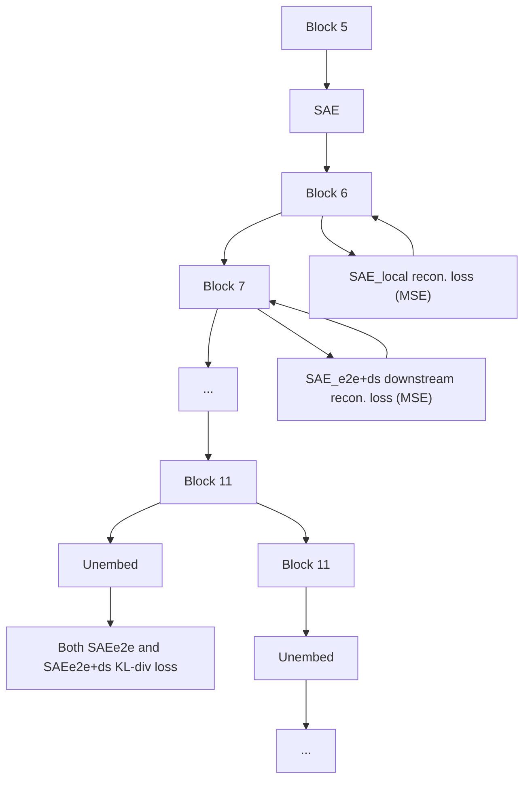

# Identifying Functionally Important Features with End-to-End Sparse Dictionary Learning

Dan Braun∗ Jordan Taylor† Nicholas Goldowsky-Dill∗

Lee Sharkey∗

# Abstract

Identifying the features learned by neural networks is a core challenge in mechanistic interpretability. Sparse autoencoders (SAEs), which learn a sparse, overcomplete dictionary that reconstructs a network’s internal activations, have been used to identify these features. However, SAEs may learn more about the structure of the dataset than the computational structure of the network. There is therefore only indirect reason to believe that the directions found in these dictionaries are functionally important to the network. We propose end-to-end (e2e) sparse dictionary learning, a method for training SAEs that ensures the features learned are functionally important by minimizing the KL divergence between the output distributions of the original model and the model with SAE activations inserted. Compared to standard SAEs, e2e SAEs offer a Pareto improvement: They explain more network performance, require fewer total features, and require fewer simultaneously active features per datapoint, all with no cost to interpretability. We explore geometric and qualitative differences between e2e SAE features and standard SAE features. E2e dictionary learning brings us closer to methods that can explain network behavior concisely and accurately. We release our library for training e2e SAEs and reproducing our analysis at https://github.com/ApolloResearch/e2e\_sae.

# 1 Introduction

Sparse Autoencoders (SAEs) are a popular method in mechanistic interpretability [Sharkey et al., 2022, Cunningham et al., 2023, Bricken et al., 2023]. They have been proposed as a solution to the problem of superposition, the phenomenon by which networks represent more ‘features’ than they have neurons. ‘Features’ are directions in neural activation space that are considered to be the basic units of computation in neural networks. SAE dictionary elements (or ‘SAE features’) are thought to approximate the features used by the network. SAEs are typically trained to reconstruct the activations of an individual layer of a neural network using a sparsely activating, overcomplete set of dictionary elements (directions). It has been shown that this procedure identifies ground truth features in toy models [Sharkey et al., 2022].

However, current SAEs focus on the wrong goal: They are trained to minimize mean squared reconstruction error (MSE) of activations (in addition to minimizing their sparsity penalty). The issue is that the importance of a feature as measured by its effect on MSE may not strongly correlate with how important the feature is for explaining the network’s performance. This would not be a problem if the network’s activations used a small, finite set of ground truth features – the SAE would simply identify those features, and thus optimizing MSE would have led the SAE to learn the functionally important features. In practice, however, Bricken et al. [2023] observed the phenomenon of feature splitting, where increasing dictionary size while increasing sparsity allows SAEs to split a feature into multiple, more specific features, representing smaller and smaller portions of the dataset. In the limit of large dictionary size, it would be possible to represent each individual datapoint as its own dictionary element. Since minimizing MSE does not explicitly prioritize learning features based on how important they are for explaining the network’s performance, an SAE may waste much of its fixed capacity on learning less important features. This is perhaps responsible for the observation that, when measuring the causal effects of circuits made from SAE features on network performance, a significant amount is mediated by the reconstruction residual errors (i.e. everything not explained by the SAE) and not mediated by SAE features [Marks et al., 2024].

flowchart

line

| L0   | local  | e2e    | e2e+ds |
| ---- | ------ | ------ | ------ |
| 0    | 0.35   | 0.35   | 0.15   |
| 50   | 0.27   | 0.10   | 0.15   |
| 100  | 0.15   | 0.05   | 0.05   |
| 150  | 0.10   | 0.06   | 0.06   |
| 200  | 0.13   | 0.06   | 0.06   |
| 400  | 0.15   | 0.08   | 0.07   |
| 500  | 0.16   | 0.09   | 0.08   |
| 550  | 0.17   | 0.10   | 0.09   |

line

| Alive Dictionary Elements | Better (Blue Line) | Better (Green Line) | Better (Orange Line) |
| -------------------------- | ------------------ | ------------------- | -------------------- |
| 10k                        | 0.15               | -                   | -                    |
| 20k                        | 0.25               | 0.15                | 0.20                 |
| 30k                        | 0.35               | 0.25                | 0.30                 |
| 40k                        | 0.40               | 0.35                | 0.40                 |

Figure 1: Top: Diagram comparing the loss terms used to train each type of SAE. Each arrow is a loss term which compares the activations represented by circles. $\mathrm { S A E } _ { \mathrm { l o c a l } }$ uses MSE reconstruction loss between the SAE input and the SAE output. $\mathrm { S A E _ { \mathrm { e 2 e } } }$ uses KL-divergence on the logits. $\mathrm { S A E } _ { \mathrm { e 2 e + d s } }$ (end-to-end + downstream reconstruction) uses KL-divergence in addition to the sum of the MSE reconstruction losses at all future layers. All three are additionally trained with a $L _ { 1 }$ sparsity penalty (not pictured).   
Bottom: Pareto curves for three different types of GPT2-small layer 6 SAEs as the sparsity coefficient is varied. E2e-SAEs require fewer features per datapoint (i.e. have a lower $L _ { 0 } )$ and fewer features over the entire dataset (i.e. have a low number of alive dictionary elements). GPT2-small has a CE loss of 3.139 over our evaluation set.

Given these issues, it is therefore natural to ask how we can identify the functionally important features used by the network. We say a feature is functionally important if it is important for explaining the network’s behavior on the training distribution. If we prioritize learning functionally important features, we should be able to maintain strong performance with fewer features used by the SAE per datapoint as well as fewer overall features.

To optimize SAEs for these properties, we introduce a new training method. We still train SAEs using a sparsity penalty on the feature activations (to reduce the number of features used on each datapoint), but we no longer optimize activation reconstruction. Instead, we replace the original activations with the SAE output (Figure 1) and optimize the KL divergence between the original output logits and the output logits when passing the SAE output through the rest of the network, thus training the SAE end-to-end (e2e). We use $\mathrm { S A E _ { e 2 e } }$ to denote an SAE trained with KL divergence and a sparsity penalty.

By contrast, we use $\mathrm { S A E } _ { \mathrm { l o c a l } }$ to denote our baseline SAEs, trained only to reconstruct the activations at the current layer with a sparsity penalty.

One risk with this method is that it may be possible for the outputs of ${ \mathrm { S A E } } _ { \mathrm { e 2 e } }$ to take a different computational pathway through subsequent layers of the network (compared with the original activations) while nevertheless producing a similar output distribution. For example, it might learn a new feature that exploits a particular transformation in a downstream layer that is unused by the regular network or that is used for other purposes. To reduce this likelihood, we also add terms to the loss for the reconstruction error between the original model and the model with the SAE at downstream layers in the network (Figure 1). We use $\mathrm { S A E } _ { \mathrm { e 2 e + d s } }$ to denote SAEs trained with KL divergence, a sparsity penalty, and downstream reconstruction loss. We use e2e SAEs to refer to the family of methods introduced in this work, including both $\mathrm { S A E _ { e 2 e } }$ and $\mathrm { S A E } _ { \mathrm { e 2 e + d s } }$ .

Previous work has used the performance explained – measured by cross-entropy loss difference when replacing the original activations with SAE outputs – as a measure of SAE quality [Cunningham et al., 2023, Bricken et al., 2023, Bloom, 2024]. It’s reasonable to ask whether our approach runs afoul of Goodhart’s law (“When a measure becomes a target, it ceases to be a good measure”). We contend that mechanistic interpretability should prefer explanations of networks (and the components of those explanations, such as features) that explain more network performance over other explanations. Therefore, optimizing directly for quantitative proxies of performance explained (such as CE loss difference, KL divergence, and downstream reconstruction error) is preferred.

We train each SAE type on language models (GPT2-small [Radford et al., 2019] and Tinystories-1M [Eldan and Li, 2023]), and present three key findings:

1. For the same level of performance explained, $\mathrm { S A E } _ { \mathrm { l o c a l } }$ requires activating more than twice as many features per datapoint compared to $\mathrm { S A E } _ { \mathrm { e 2 e + d s } }$ and ${ \mathrm { S A E } } _ { \mathrm { e 2 e } }$ (Section 3.1).   
2. $\mathrm { S A E } _ { \mathrm { e 2 e + d s } }$ performs equally well as $\mathrm { S A E _ { e 2 \epsilon } }$ in terms of the number of features activated per datapoint (Section 3.1), yet its activations take pathways through the network that are much more similar to $\mathrm { S A E } _ { \mathrm { l o c a l } }$ (Sections 3.2, 3.3).   
3. $\mathrm { S A E } _ { \mathrm { l o c a l } }$ requires more features in total over the dataset to explain the same amount of network performance compared with $\mathrm { S A E _ { e 2 e } }$ and $\mathrm { S A E } _ { \mathrm { e 2 e + d s } }$ (Section 3.1).

These findings suggest that e2e SAEs are more efficient in capturing the essential features that contribute to the network’s performance. Moreover, our automated-interpretability and qualitative analyses reveal that $\mathrm { S A E } _ { \mathrm { e 2 e + d s } }$ s features are at least as interpretable as $\mathrm { S A E } _ { \mathrm { l o c a l } }$ features, demonstrating that the improvements in efficiency do not come at the cost of interpretability (Section 3.4). These gains nevertheless come at the cost of longer wall-clock time to train (Appendix H).

As a supplementary investigation, we tested e2e SAEs on a set of subject-verb agreement tasks from Finlayson et al. [2021]. These tests had inconclusive results (Appendix I), indicating that further work is needed to identify which downstream tasks would benefit most from e2e SAEs.

In addition to this article, we also provide: A library for training all SAE types presented in this article (https://github.com/ApolloResearch/e2e\_sae); a Weights and Biases [Biewald, 2020] report that links to training metrics for all runs (https://api.wandb.ai/links/sparsify/ evnqx8t6); a Neuronpedia [Lin and Bloom, 2023] page for interacting with the features in a subset of SAEs (those presented in Tables 2 and 3) (https://www.neuronpedia.org/gpt2sm-apollojt) as well as a repository for downloading these SAEs directly (https://huggingface.co/ apollo-research/e2e-saes-gpt2).

# 2 Training end-to-end SAEs

Our experiments train SAEs using three kinds of loss function (Figure 1), which we evaluate according to several metrics (Section 2.5):

1. $L _ { \mathrm { l o c a l } }$ trains SAEs to reconstruct activations at a particular layer (Section 2.2);   
2. $L _ { \mathrm { e 2 e } }$ trains SAEs to learn functionally important features (Section 2.3);   
3. $L _ { \mathrm { e 2 e + d o w n s t r e a m } }$ trains SAEs to learn functionally important features that optimize for faithfulness to the activations of the original network at subsequent layers (Section 2.4).

# 2.1 Formulation

Suppose we have a feedforward neural network (such as a decoder-only Transformer [Radford et al., 2018]) with L layers and vectors of hidden activations $a ^ { ( l ) }$ :

$$
a ^ {(0)} (x) = x
$$

$$
a ^ {(l)} (x) = f ^ {(l)} \left(a ^ {(l - 1)} (x)\right), \text {   for   } l = 1, \dots , L - 1
$$

$$
y = \operatorname{softmax} \left(f ^ {(L)} (a ^ {(L - 1)} (x))\right).
$$

We use SAEs that consist of an encoder network (an affine transformation followed by a ReLU activation function) and a dictionary of unit norm features, represented as a matrix D, with associated bias vector $b _ { d }$ . The encoder takes as input network activations from a particular layer l. The architecture we use is:

$$
\operatorname{Enc} \left(a ^ {(l)} (x)\right) = \operatorname{ReLU} \left(W _ {e} a ^ {(l)} (x) + b _ {e}\right)
$$

$$
\operatorname{SAE} \left(a ^ {(l)} (x)\right) = D ^ {\top} \operatorname{Enc} \left(a ^ {(l)} (x)\right) + b _ {d},
$$

where the dictionary D and encoder weights $W _ { e }$ are both (N\_dict\_elements × d\_hidden) matrices, $b _ { e }$ is a $\mathtt { N \_ d i c t _ { - } }$ elements-dimensional vector, while $b _ { d }$ and $a ^ { ( l ) } ( x )$ are d\_hidden-dimensional vectors.

# 2.2 Baseline: Local SAE training loss $( L _ { \mathrm { l o c a l } } )$

The standard, baseline method for training SAEs is $\mathrm { S A E } _ { \mathrm { l o c a l } }$ training, where the output of the SAE is trained to reconstruct its input using a mean squared error loss with a sparsity penalty on the encoder activations (here an L1 loss):

$$
L _ {\text { local }} = L _ {\text { reconstruction }} + L _ {\text { sparsity }} = | | a ^ {(l)} (x) - \mathrm{SAE} _ {\text { local }} (a ^ {(l)} (x)) | | _ {2} ^ {2} + \phi | | \mathrm{Enc} (a ^ {(l)} (x)) | | _ {1}.
$$

ϕ = λdim(a(l)) $\begin{array} { r } { \phi = \frac { \lambda } { \dim ( a ^ { ( l ) } ) } } \end{array}$ is a sparsity coefficient λ scaled by the size of the input to the SAE (see Appendix D for details on hyperparameters).

# 2.3 Method 1: End-to-end SAE training loss $\left( L _ { \mathbf { e } 2 \mathbf { e } } \right)$

For ${ \mathrm { S A E } } _ { \mathrm { e 2 e } }$ , we do not train the SAE to reconstruct activations. Instead, we replace the model activations with the output of the SAE and pass them forward through the rest of the network:

$$
\hat {a} ^ {(l)} (x) = \mathrm{SAE} _ {\mathrm{e2e}} (a ^ {(l)} (x))
$$

$$
\hat {a} ^ {(k)} (x) = f ^ {(k)} (\hat {a} ^ {(l)} (x)) \text {   for   } k = l, \dots , L - 1
$$

$$
\hat {y} = \mathrm{softmax} \left(f ^ {(L)} (\hat {a} ^ {(L - 1)} (x))\right)
$$

We train the SAE by penalizing the KL divergence between the logits produced by the model with the SAE activations and the original model:

$$
L _ {\mathrm{e2e}} = L _ {\mathrm{KL}} + L _ {\text {sparsity}} = K L (\hat {y}, y) + \phi | | \operatorname{Enc} (a ^ {(l)} (x)) | | _ {1}
$$

Importantly, we freeze the parameters of the model, so that only the SAE is trained. This contrasts with Tamkin et al. [2023], who train the model parameters in addition to training a ‘codebook’ (which is similar to a dictionary).

# 2.4 Method 2: End-to-end with downstream layer reconstruction SAE training loss

$$
(L _ {\mathrm{e2e+downstream}})
$$

A reasonable concern with the $L _ { \mathrm { e 2 e } }$ is that the model with the SAE inserted may compute the output using an importantly different pathway through the network, even though we’ve frozen the original model’s parameters and trained the SAE to replicate the original model’s output distribution. To counteract this possibility, we also compare an additional loss: The end-to-end with downstream reconstruction training loss $( L _ { \mathrm { e 2 e + d o w n s t r e a m } } )$ additionally minimizes the mean squared error between the activations of the new model at downstream layers and the activations of the original model:

$$
\begin{array}{l} L _ {\mathrm{e2e+downstream}} = L _ {\mathrm{KL}} + L _ {\text { sparsity }} + L _ {\text { downstream }} \\ = K L (\hat {y}, y) + \phi | | \operatorname{Enc} (a ^ {(l)}) | | _ {1} + \frac {\beta_ {l}}{L - l} \sum_ {k = l + 1} ^ {L - 1} | | \hat {a} ^ {(k)} (x) - a ^ {(k)} (x) | | _ {2} ^ {2} \tag {1} \\ \end{array}
$$

where $\beta _ { l }$ is a hyperparameter that controls the downstream reconstruction loss term (Appendix D).

$L _ { \mathrm { e 2 e + d o w n s t r e a m } }$ thus has the desirable properties of 1) incentivizing the SAE outputs to lead to similar computations in downstream layers in the model and 2) allowing the SAE to “clear out" some of the non-functional features by not training on a reconstruction error at the layer with the SAE. Note, however, the inclusion of the intermediate reconstruction terms means that $L _ { \mathrm { e 2 e + d o w n s t r e a m } }$ may encourage the SAE to learn features that are less functionally important.

# 2.5 Experimental metrics

We record several key metrics for each trained SAE:

1. Cross-entropy loss increase between the original model and the model with SAE: We measure the increase in cross-entropy (CE) loss caused by using activations from the inserted SAE rather than the original model activations on an evaluation set. We sometimes refer to this as ‘amount of performance explained’, where a low CE loss increase means more performance explained. All other things being equal, a better SAE recovers more of the original model’s performance.   
2. $\mathbf { L _ { 0 } } \mathrm { : }$ How many SAE features activate on average for each datapoint. All other things being equal, a better SAE needs fewer features to explain the performance of the model on a given datapoint.   
3. Number of alive dictionary elements: The number of features in training that have not ‘died’ (which we define to mean that they have not activated over a set of 500k tokens of data). All other things being equal, a better SAE needs a smaller number of alive features to explain the performance of model over the dataset.

We also record the reconstruction loss at downstream layers. This is the mean squared error between the activations of the original model and the model with the SAE at all layers following the insertion of the SAE (i.e. downstream layers). If reconstruction loss at downstream layers is low, then the activations take a similar pathway through the network as in the original model. This minimizes the risk that the SAEs are learning features that take different computational pathways through the downstream layers compared to the original model. Finally, following Bills et al. [2023], we perform automated-interpretability scoring and qualitative analysis on a subset of the SAEs, to verify that improved quantitative metrics does not sacrifice the interpretability of the learned features.

We show results for experiments performed on GPT2-small’s residual stream before attention layer $6 . ^ { 3 }$ Results for layers 2, 6, and 10 of GPT2-small and some runs on a model trained on the TinyStories dataset [Eldan and Li, 2023] can be found in Appendices A.1 and A.2, respectively. They are qualitatively similar to those presented in the main text. For our GPT2-small experiments, we train SAEs with each type of loss function on 400k samples of context size 1024 from the Open Web Text dataset [Gokaslan and Cohen, 2019] over a range of sparsity coefficients λ. Our dictionary is fixed at 60 times the size of the residual stream (i.e. $6 0 \times 7 6 8 = 4 6 0 8 0$ initial dictionary elements). Hyperparameters, along with sweeps over dictionary size and number of training examples, are shown in Appendices D and E, respectively.

# 3 Results

# 3.1 End-to-end SAEs are a Pareto improvement over local SAEs

We compare the trained SAEs according to CE loss increase, $L _ { 0 } .$ , and number of alive dictionary elements. The learning rates for each SAE type were selected to be Pareto-optimal according to their

$L _ { 0 }$ vs CE loss increase curves.4 Each experiment uses a range of sparsity coefficients λ. In Figure 1, we see that both ${ \mathrm { S A E } } _ { \mathrm { e 2 e } }$ and $\mathrm { S A E } _ { \mathrm { e 2 e + d s } }$ achieve better CE loss increase for a given $L _ { 0 }$ or for a given number of alive dictionary elements. This means they need fewer features to explain the same amount of network performance for a given datapoint or for the dataset as a whole, respectively. For similar results at other layers see Appendix A.1.

This difference is large: For a given $L _ { 0 } ,$ both $\mathrm { S A E _ { e 2 \epsilon } }$ and $\mathrm { S A E } _ { \mathrm { e 2 e + d s } }$ have a CE loss increase that is less than 45% of the CE loss increase of $\mathrm { S A E _ { l o c a l } . ^ { 5 } \ S A E _ { l o c a l } }$ must therefore be learning features that are not maximally important for explaining network performance.

This improved performance comes at the expense of increased compute costs $( 2 \mathrm { - } 3 . 5 $ times longer runtime, see Appendix H). We test to see if additional compute improves our $\mathrm { S A E } _ { \mathrm { l o c a l } }$ baseline in Appendix E. We find neither increasing dictionary size from $6 0 * 7 6 8$ to 100 ∗ 768 nor increasing training samples from 400k to 800k noticeably improves the Pareto frontier, implying that our e2e SAEs maintain their advantage even when compared against $\mathrm { S A E } _ { \mathrm { l o c a l } }$ dictionaries trained with more compute.

For comparability, our subsequent analyses focus on 3 particular SAEs that have approximately equivalent CE loss increases (Table 1).

Table 1: Three SAEs from layer 6 with similar CE loss increases are analyzed in detail. 

<table><tr><td>SAE Type</td><td> $\lambda$  (Sparsity Coeff)</td><td> $L_0$ </td><td>Alive Elements</td><td>CE Loss Increase</td></tr><tr><td>Local</td><td>4.0</td><td>69.4</td><td>26k</td><td>0.145</td></tr><tr><td>End-to-end</td><td>3.0</td><td>27.5</td><td>22k</td><td>0.144</td></tr><tr><td>E2e + Downstream</td><td>50.0</td><td>36.8</td><td>15k</td><td>0.125</td></tr></table>

# 3.2 End-to-end SAEs have worse reconstruction loss at each layer despite similar output distributions

Even though ${ \mathrm { S A E } } _ { \mathrm { e 2 e } } { \mathrm { s } }$ explain more performance per feature than $\mathrm { S A E } _ { \mathrm { l o c a l } } \mathrm { s } ,$ , they have much worse reconstruction error of the original activations at each subsequent layer (Figure 2). This indicates that the activations following the insertion of ${ \mathrm { S A E } } _ { \mathrm { e 2 e } }$ take a different path through the network than in the original model, and therefore potentially permit the model to achieve its performance using different computations from the original model. This possibility motivated the training of $\mathrm { S A E } _ { \mathrm { e 2 e + d s } } \mathrm { s }$ .

In later layers, the reconstruction errors of $\mathrm { S A E } _ { \mathrm { l o c a l } }$ and $\mathrm { S A E } _ { \mathrm { e 2 e + d s } }$ are extremely similar (Figure 2). $\mathrm { S A E } _ { \mathrm { e 2 e + d s } }$ therefore has the desirable properties of both learning features that explain approximately as much network performance as ${ \mathrm { S A E } } _ { \mathrm { e 2 e } }$ (Figure 1) while having reconstruction errors that are much closer to $\mathrm { S A E } _ { \mathrm { l o c a l } }$ . There remains a difference in reconstruction at layer 6 between $\mathrm { S A E } _ { \mathrm { e 2 e + d s } }$ and $\mathrm { S A E } _ { \mathrm { l o c a l } }$ . This is not surprising given that $\mathrm { S A E } _ { \mathrm { e 2 e + d s } }$ is not trained with a reconstruction loss at this layer. In Appendix B, we examine how much of this difference is explained by feature scaling. In Appendix G.3, we find a specific example of a direction with low functional importance that is faithfully represented in $\mathrm { S A E } _ { \mathrm { l o c a l } }$ but not $\mathrm { S A E } _ { \mathrm { e 2 e + d s } }$ .

# 3.3 Differences in feature geometries between SAE types

# 3.3.1 End-to-end SAEs have more orthogonal features than $\mathbf { S A E _ { l o c a l } }$

Bricken et al. [2023] observed ‘feature splitting’, where a locally trained SAEs learns a cluster of features which represent similar categories of inputs and have dictionary elements pointing in similar directions. A key question is to what extent these subtle distinctions are functionally important for the network’s predictions, or if they are only helpful for reconstructing functionally unimportant patterns in the data.

line

| Model Layer | local | e2e  | e2e+ds |
| ----------- | ----- | ---- | ------ |
| 6           | 0.5   | 14.5 | 3.5    |
| 7           | 0.6   | 14.0 | 1.5    |
| 8           | 0.7   | 14.5 | 1.5    |
| 9           | 0.8   | 15.5 | 1.5    |
| 10          | 1.0   | 17.5 | 1.8    |
| 11          | 2.0   | 22.0 | 2.5    |

Figure 2: Reconstruction mean squared error (MSE) at later layers for our set of GPT2-small layer 6 SAEs with similar CE loss increases (Table 1). $\mathrm { S A E _ { l o c a l } }$ is trained to minimize MSE at layer $6 , \mathrm { S A E _ { \mathrm { e 2 e } } }$ was trained to match the output probability distribution, $\mathrm { S A E _ { e 2 e + d s } }$ was trained to match the output probability distribution and minimize MSE in all downstream layers.

We have already seen that ${ \mathrm { S A E } } _ { \mathrm { e 2 e } }$ and $\mathrm { S A E } _ { \mathrm { e 2 e + d s } }$ learn smaller dictionaries compared with $\mathrm { S A E } _ { \mathrm { l o c a l } }$ for a given level of performance explained (Figure 1). In this section, we explore if this is due to less feature splitting. We measure the cosine similarities between each SAE dictionary feature and nextclosest feature in the same dictionary. While this does not account for potential semantic differences between directions with high cosine similarities, it serves as a useful proxy for feature splitting, since split features tend to be highly similar directions [Bricken et al., 2023]. We find that $\mathrm { S A E } _ { \mathrm { l o c a l } }$ has features that are more tightly clustered, suggesting higher feature splitting (Figure 3a). Compared to $\mathrm { S A E } _ { \mathrm { e } 2 \mathrm { e } + \mathrm { d } \mathrm { s } }$ s the mean cosine similarity is 0.04 higher (bootstrapped 95% CI [0.037−0.043]); compared to ${ \mathrm { S A E } } _ { \mathrm { e 2 e } }$ the difference is 0.166 (95% CI [0.163 − 0.168]). We measure this for all runs in our Pareto frontiers and find that this difference is not explained by $\mathrm { S A E } _ { \mathrm { l o c a l } }$ having more alive dictionary elements than e2e SAEs (Appendix A.5).

# 3.3.2 SAEe2e features are not robust across random seeds, but $\mathbf { S A E _ { e 2 e + d s } }$ and $\mathbf { S A E _ { l o c a l } }$ are

We find that $\mathrm { S A E } _ { \mathrm { l o c a l } } \mathrm { s }$ trained with one seed learn similar features as $\mathrm { S A E } _ { \mathrm { l o c a l } } \mathrm { s }$ trained with a different seed (Figure 3b). The same is true for two $\mathrm { S A E _ { e 2 e + d s } S }$ . However, features learned by $\mathrm { S A E _ { e 2 e } }$ are quite different for different seeds. This suggests there are many different sets of $\mathrm { S A E _ { e 2 e } }$ features that achieve the same output distribution, despite taking different paths through the network.

# 3.3.3 $\mathbf { S A E _ { e 2 e } }$ and $\mathbf { S A E _ { e 2 e + d s } }$ features do not always align with $\mathbf { S A E _ { l o c a l } }$ features

The cosine similarity plots between $\mathrm { S A E _ { e 2 e } }$ and $\mathrm { S A E } _ { \mathrm { l o c a l } }$ (Figure 3c top) reveal that the average similarity between the most similar features is low, and includes a group of features that are very dissimilar. $\mathrm { S A E } _ { \mathrm { e 2 e + d s } }$ learns features that are much more similar to $\mathrm { S A E } _ { \mathrm { l o c a l } }$ , although the cosine similarity plot is bimodal, suggesting that $\mathrm { S A E } _ { \mathrm { e 2 e + d s } }$ learns a set of directions that very different to those identified by $\mathrm { S A E } _ { \mathrm { l o c a l } }$ (Figure 3c bottom).

It is encouraging that $\mathrm { S A E } _ { \mathrm { l o c a l } }$ and $\mathrm { S A E } _ { \mathrm { e 2 e + d s } }$ features are somewhat similar, since this indicates that $\mathrm { S A E } _ { \mathrm { l o c a l } } \mathrm { s }$ may serve as good initializations for training $\mathrm { S A E } _ { \mathrm { e 2 e + d s } } \mathrm { s }$ , reducing training time.

# 3.4 Interpretability of learned directions

Using the automated-interpretability library [Lin, 2024] (an adaptation of Bills et al. [2023]), we generate automated explanations of our SAE features by prompting gpt-4-turbo-2024-04- 09 [OpenAI et al., 2024] with five max-activating examples for each feature, before generating “interpretability scores” by tasking gpt-3.5-turbo to use that explanation to predict the SAE feature’s true activations on a random sample of 20 max-activating examples. For each SAE we generate automated-interpretabilty scores for a random sample of features $( n = 1 9 8$ to 201 per SAE). We then measure the difference between average interpretability scores. This interpretability score is an imperfect metric of interpretability, but it serves as an unbiased verification and is therefore useful for ensuring that we are not trading better training losses for significantly less interpretable features.

histogram

| Category   | Cosine Similarity |
| ---------- | ----------------- |
| local      | ~0.5              |
| e2e        | ~0.4              |
| e2e+ds     | ~0.6              |

(a) Within-SAE cosine similarity

histogram

| Cosine Similarity Range | local | e2e | e2e+ds |
| ----------------------- | ----- | --- | ------ |
| 0.0 - 0.1               | 0     | 1   | 0      |
| 0.1 - 0.2               | 0     | 3   | 0      |
| 0.2 - 0.3               | 0     | 2   | 0      |
| 0.3 - 0.4               | 0     | 2   | 0      |
| 0.4 - 0.5               | 0     | 2   | 0      |
| 0.5 - 0.6               | 0     | 2   | 0      |
| 0.6 - 0.7               | 0     | 2   | 0      |
| 0.7 - 0.8               | 0     | 2   | 1      |
| 0.8 - 0.9               | 1     | 1   | 2      |
| 0.9 - 1.0               | 1     | 1   | 3      |

(b) Cross-seed cosine similarity

histogram

| Cosine Similarity Range | e2e Count | e2e+ds Count |
| ----------------------- | --------- | ------------ |
| 0.0 - 0.1               | High      | Low          |
| 0.1 - 0.2               | Medium    | Very Low     |
| 0.2 - 0.3               | Medium    | Low          |
| 0.3 - 0.4               | Medium    | Low          |
| 0.4 - 0.5               | Medium    | Low          |
| 0.5 - 0.6               | Medium    | Low          |
| 0.6 - 0.7               | Medium    | Medium       |
| 0.7 - 0.8               | Medium    | Medium       |
| 0.8 - 0.9               | Medium    | High         |
| 0.9 - 1.0               | Low       | High         |

(c) Cross-SAE-type cosine similarity   
Figure 3: Geometric comparisons for our set of GPT2-small layer 6 SAEs with similar CE loss increases (Table 1). For each dictionary element, we find the max cosine similarity between itself and all other dictionary elements. In 3a we compare to others directions in the same SAE, in 3b to directions in an SAE of the same type trained with a different random seed, in 3c to directions in the $\mathrm { S A E _ { l o c a l } }$ with similar CE loss increase.

For pairs of SAEs with similar $L _ { 0 }$ (listed in Table 3), we find no difference between the average interpretability scores of $\mathrm { S A E } _ { \mathrm { l o c a l } }$ and $\mathrm { S A E } _ { \mathrm { e 2 e + d s } }$ . If we repeat the analysis for pairs with similar CE loss increases, we find the $\mathrm { S A E } _ { \mathrm { e 2 e + d s } }$ features to be more interpretable than $\mathrm { S A E } _ { \mathrm { l o c a l } }$ features in Layers $2 \left( p = 0 . 0 0 5 3 \right)$ and $6 \left( p = 0 . 0 0 0 5 \right)$ but no significant difference in layer 10. For additional automated-interpretability analysis, see Appendix A.7.

We also provide some qualitative, human-generated interpretations of some groups of features for different SAE types in Appendix G. Features from the SAEs in Table 2 and Table 3 can be viewed interactively at https://www.neuronpedia.org/gpt2sm-apollojt.

# 4 Related work

# 4.1 Using sparse autoencoders and sparse coding in mechanistic interpretability

When Elhage et al. [2022] identified superposition as a key bottleneck to progress in mechanistic interpretability, the field found a promising scalable solution in SAEs [Sharkey et al., 2022]. SAEs have since been used to interpret language models [Cunningham et al., 2023, Bricken et al., 2023, Bloom, 2024] and have been used to improve performance of classifiers on downstream tasks [Marks et al., 2024]. Earlier work by Yun et al. [2021] concatenated together the residual stream of a language model and used sparse coding to identify an undercomplete set of sparse ‘factors’ that spanned multiple layers. This echoes even earlier work that applied sparse coding to word embeddings and found sparse linear structure [Faruqui et al., 2015, Subramanian et al., 2017, Arora et al., 2018]. Similar to our work is Tamkin et al. [2023], who trained sparse feature codebooks, which are similar to SAEs, and trained them end-to-end. However, to achieve adequate performance, they needed to train the model parameters alongside the sparse codebooks. Here, we only trained the SAEs and left the interpreted model unchanged.

# 4.2 Identifying problems with and improving sparse autoencoders

Although useful for mechanistic interpretability, current SAE approaches have several shortcomings. One issue is the functional importance of features, which we have aimed to address here. Some work has noted problems with SAEs, including Anders and Bloom [2024], who found that SAE features trained on a language model with a given context length failed to generalize to activations collected from activations in longer contexts. Other work has addressed ‘feature suppression’ [Wright and Sharkey, 2024], also known as ‘shrinkage’ [Jermyn et al., 2024], where SAE feature activations systematically undershoot the ‘true’ activation value because of the sparsity penalty. While Wright and Sharkey [2024] approached this problem using finetuning after SAE training, Jermyn et al. [2024] and Riggs and Brinkmann [2024] explored alternative sparsity penalties during training that aimed to reduce feature suppression (with mixed success). Farrell [2024], taking an approach similar to Jermyn et al. [2024], has explored different sparsity penalties, though here not to address shrinkage, but instead to optimize for other metrics of SAE quality. Rajamanoharan et al. [2024] introduce Gated SAEs, an architectural variation for the encoder which both addresses shrinkage and improves on the Pareto frontier of $L _ { 0 }$ vs CE loss increase.

# 4.3 Methods for evaluating the quality of trained SAEs

One of the main challenges in using SAEs for mechanistic interpretability is that there is no known ‘ground truth’ against which to benchmark the features learned by SAEs. Prior to our work, several metrics have been used, including: Comparison with ground truth features in toy data; activation reconstruction loss; $L _ { 1 }$ loss; number of alive dictionary elements; similarity of SAE features across different seeds and dictionary sizes [Sharkey et al., 2022]; $L _ { 0 } ;$ KL divergence (between the output distributions of the original model and the model with SAE activations) upon causal interventions on the SAE features [Cunningham et al., 2023]; reconstructed negative log likelihood of the model with SAE activations inserted [Cunningham et al., 2023, Bricken et al., 2023]; feature interpretability Cunningham et al. [2023] (as measured by automatic interpretability methods [Bills et al., 2023]); and task-specific comparisons [Makelov et al., 2024]. In our work, we use (1) $L _ { 0 } ,$ , (2) number of alive dictionary elements, (3) the average KL divergence between the output distribution of the original model and the model with SAE activations, and (4) the reconstruction error of activations in layers that follow the layer where we replace the original model’s activations with the SAE activations.

# 4.4 Methods for identifying the functional importance of sparse features

In our work, we optimize for functional importance directly, but previous work measured functional importance post hoc using different approaches. Cunningham et al. [2023] used activation patching [Vig et al., 2020], a form of causal mediation analysis, where they intervened on feature activations and found the output distribution was more sensitive (had higher KL divergence with the original model’s distribution) in the direction of SAE features than other directions, such as PCA directions. With the same motivation, Marks et al. [2024] use a similar, approximate, but more efficient, method of causal mediation analysis [Nanda, 2022, Sundararajan et al., 2017]. Unlike our work, these works use the measures of functional importance to construct circuits of sparse features. Bricken et al. [2023] used logit attribution, measuring the effect the feature has on the output logits.

# 5 Conclusion

In this work, we introduce end-to-end dictionary learning as a method for training SAEs to identify functionally important features in neural networks. By optimizing SAEs to minimize the KL divergence between the output distributions of the original model and the model with SAE activations inserted, we demonstrate that e2e SAEs learn features that better explain network performance compared to the standard locally trained SAEs.

Our experiments on GPT2-small and Tinystories-1M reveal several key findings. First, for a given level of performance explained, e2e SAEs require activating significantly fewer features per datapoint and fewer total features over the entire dataset. Second, $\bar { \mathrm { S A E _ { \mathrm { e 2 e + d s } } } }$ , which has additional loss terms for the reconstruction errors at downstream layers in the model, achieves a similar performance explained to ${ \mathrm { S A E } } _ { \mathrm { e 2 e } }$ while maintaining activations that follow similar pathways through later layers compared to the original model. Third, the improved efficiency of e2e SAEs does not come at the cost of interpretability, as measured by automated-interpretability scores and qualitative analysis.

These results suggest that standard, locally trained SAEs are capturing information about dataset structure that is not maximally useful for explaining the algorithm implemented by the network. By directly optimizing for functional importance, e2e SAEs offer a more targeted approach to identifying the essential features that contribute to a network’s performance.

# 6 Impact statement

This article proposes an improvement to methods used in mechanistic interpretability. Mechanistic interpretability, and interpretability broadly, promises to let us understand the inner workings of neural networks. This may be useful for debugging and improving issues with neural networks. For instance, it may enable the evaluation of a model’s fairness or bias. Interpretability may relatedly be useful for improving the trust-worthiness of AI systems, potentially enabling AI’s use in certain high stakes settings, such as healthcare, finance, and justice. However, increasing the trust-worthiness of AI systems may be dual use in that may also enable its use in settings such as military applications.

# References

Evan Anders and Joseph Bloom. Examining language model performance with reconstructed activations using sparse autoencoders. https://www.lesswrong.com/posts/ 8QRH8wKcnKGhpAu2o/examining-language-model-performance-with-reconstructed, 2024.   
Sanjeev Arora, Yuanzhi Li, Yingyu Liang, Tengyu Ma, and Andrej Risteski. Linear algebraic structure of word senses, with applications to polysemy. 2018. URL https://arxiv.org/abs/1601. 03764.   
Lukas Biewald. Experiment tracking with weights and biases, 2020. URL https://www.wandb. com/. Software available from wandb.com.   
Steven Bills, Nick Cammarata, Dan Mossing, Henk Tillman, Leo Gao, Gabriel Goh, Ilya Sutskever, Jan Leike, Jeff Wu, and William Saunders. Language models can explain neurons in language models. https://openaipublic.blob.core.windows.net/neuron-explainer/paper/ index.html, 2023.   
Joseph Bloom. Open source sparse autoencoders for all residual stream layers of gpt2 small. https://www.alignmentforum.org/posts/f9EgfLSurAiqRJySD/ open-source-sparse-autoencoders-for-all-residual-stream, 2024.   
Trenton Bricken, Adly Templeton, Joshua Batson, Brian Chen, Adam Jermyn, Tom Conerly, Nick Turner, Cem Anil, Carson Denison, Amanda Askell, Robert Lasenby, Yifan Wu, Shauna Kravec, Nicholas Schiefer, Tim Maxwell, Nicholas Joseph, Zac Hatfield-Dodds, Alex Tamkin, Karina Nguyen, Brayden McLean, Josiah E Burke, Tristan Hume, Shan Carter, Tom Henighan, and Christopher Olah. Towards monosemanticity: Decomposing language models with dictionary learning. Transformer Circuits Thread, 2023. URL https://transformer-circuits.pub/ 2023/monosemantic-features/index.html.   
Hoagy Cunningham, Aidan Ewart, Logan Riggs, Robert Huben, and Lee Sharkey. Sparse autoencoders find highly interpretable features in language models. arXiv preprint arXiv:2309.08600, 2023. URL https://arxiv.org/abs/2309.08600.   
Ronen Eldan and Yuanzhi Li. Tinystories: How small can language models be and still speak coherent english? arXiv preprint arXiv:2305.07759, 2023.   
Nelson Elhage, Tristan Hume, Catherine Olsson, Nicholas Schiefer, Tom Henighan, Shauna Kravec, Zac Hatfield-Dodds, Robert Lasenby, Dawn Drain, Carol Chen, Roger Grosse, Sam McCandlish, Jared Kaplan, Dario Amodei, Martin Wattenberg, and Christopher Olah. Toy models of superposition, 2022.   
Eoin Farrell. Experiments with an alternative method to promote sparsity in sparse autoencoders. https://www.lesswrong.com/posts/cYA3ePxy8JQ8ajo8B/ experiments-with-an-alternative-method-to-promote-sparsity, 2024.   
Manaal Faruqui, Yulia Tsvetkov, Dani Yogatama, Chris Dyer, and Noah Smith. Sparse overcomplete word vector representations, 2015.   
Matthew Finlayson, Aaron Mueller, Sebastian Gehrmann, Stuart Shieber, Tal Linzen, and Yonatan Belinkov. Causal analysis of syntactic agreement mechanisms in neural language models. In Chengqing Zong, Fei Xia, Wenjie Li, and Roberto Navigli, editors, Proceedings of the 59th Annual Meeting of the Association for Computational Linguistics and the 11th International Joint Conference on Natural Language Processing (Volume 1: Long Papers), pages 1828–1843, Online, August 2021. Association for Computational Linguistics. doi: 10.18653/v1/2021.acl-long.144. URL https://aclanthology.org/2021.acl-long.144.

Aaron Gokaslan and Vanya Cohen. Openwebtext corpus. http://Skylion007.github.io/ OpenWebTextCorpus, 2019.   
Adam Jermyn, Adly Templeton, Joshua Batson, and Trenton Bricken. Tanh penalty in dictionary learning. https://transformer-circuits.pub/2024/feb-update/index.html#: \~:text=handle%20dying%20neurons.-,Tanh%20Penalty%20in%20Dictionary% 20Learning,-Adam%20Jermyn%2C%20Adly, 2024.   
Diederik P. Kingma and Jimmy Ba. Adam: A method for stochastic optimization, 2017.   
Johnny Lin. Automatic interpretability. https://github.com/hijohnnylin/ automated-interpretability, 2024.   
Johnny Lin and Joseph Bloom. Analyzing neural networks with dictionary learning, 2023. URL https://www.neuronpedia.org. Software available from neuronpedia.org.   
Aleksandar Makelov, George Lange, and Neel Nanda. Towards principled evaluations of sparse autoencoders for interpretability and control. https://openreview.net/forum?id= MHIX9H8aYF, 2024.   
Samuel Marks, Can Rager, Eric J Michaud, Yonatan Belinkov, David Bau, and Aaron Mueller. Sparse feature circuits: Discovering and editing interpretable causal graphs in language models. arXiv preprint arXiv:2403.19647, 2024.   
Leland McInnes, John Healy, Nathaniel Saul, and Lukas Großberger. Umap: Uniform manifold approximation and projection. Journal of Open Source Software, 3(29):861, 2018. doi: 10.21105/joss.00861. URL https://doi.org/10.21105/joss.00861.   
Neel Nanda. Attribution patching: Activation patching at industrial scale. https://www. neelnanda.io/mechanistic-interpretability/attribution-patching, 2022.   
Neel Nanda and Joseph Bloom. Transformerlens. https://github.com/TransformerLensOrg/ TransformerLens, 2022.   
OpenAI, Josh Achiam, Steven Adler, Sandhini Agarwal, et al. Gpt-4 technical report, 2024.   
Alec Radford, Karthik Narasimhan, Tim Salimans, Ilya Sutskever, et al. Improving language understanding by generative pre-training. 2018.   
Alec Radford, Jeffrey Wu, Rewon Child, David Luan, Dario Amodei, Ilya Sutskever, et al. Language models are unsupervised multitask learners. OpenAI blog, 1(8):9, 2019.   
Senthooran Rajamanoharan, Arthur Conmy, Lewis Smith, Tom Lieberum, Vikrant Varma, János Kramár, Rohin Shah, and Neel Nanda. Improving dictionary learning with gated sparse autoencoders, 2024.   
Logan Riggs and Jannik Brinkmann. Improving sae’s by sqrt()-ing l1 and removing lowest activating features. https://www.lesswrong.com/posts/YiGs8qJ8aNBgwt2YN/ improving-sae-s-by-sqrt-ing-l1-and-removing-lowest, 2024.   
Lee Sharkey, Dan Braun, and Beren Millidge. Taking features out of superposition with sparse autoencoders, Dec 2022. URL https://www.alignmentforum.org/posts/z6QQJbtpkEAX3Aojj/ interim-research-report-taking-features-out-of-superposition.   
Anant Subramanian, Danish Pruthi, Harsh Jhamtani, Taylor Berg-Kirkpatrick, and Eduard Hovy. Spine: Sparse interpretable neural embeddings, 2017.   
Mukund Sundararajan, Ankur Taly, and Qiqi Yan. Axiomatic attribution for deep networks, 2017.   
Alex Tamkin, Mohammad Taufeeque, and Noah D. Goodman. Codebook features: Sparse and discrete interpretability for neural networks. 2023.   
Jesse Vig, Sebastian Gehrmann, Yonatan Belinkov, Sharon Qian, Daniel Nevo, Simas Sakenis, Jason Huang, Yaron Singer, and Stuart Shieber. Causal mediation analysis for interpreting neural nlp: The case of gender bias, 2020.

Thomas Wolf, Lysandre Debut, Victor Sanh, Julien Chaumond, Clement Delangue, Anthony Moi, et al. Huggingface’s transformers: State-of-the-art natural language processing, 2020.   
Benjamin Wright and Lee Sharkey. Addressing feature suppression in saes, Feb 2024. URL https://www.alignmentforum.org/posts/3JuSjTZyMzaSeTxKk/ addressing-feature-suppression-in-saes.   
Zeyu Yun, Yubei Chen, Bruno A Olshausen, and Yann LeCun. Transformer visualization via dictionary learning: contextualized embedding as a linear superposition of transformer factors, 2021. URL https://arxiv.org/abs/2103.15949.

# A Additional results on other layers and models

# A.1 Pareto curves for SAEs at other layers

Layer 2   

line

| Living Dictionary Elements | L0 - Better | L0 - Better | Alive Dictionary Elements - Better | Alive Dictionary Elements - Better |
| --------------------------- | ----------- | ----------- | ----------------------------------- | ----------------------------------- |
| 0                           | 0.175       | 0.150       | 10k                                 | 0.150                               |
| 20k                         | 0.025       | 0.025       | 20k                                 | 0.025                               |
| 40k                         | 0.025       | 0.025       | 30k                                 | 0.025                               |
| 60k                         | 0.025       | 0.025       | 40k                                 | 0.025                               |
| 80k                         | 0.025       | 0.025       |                             |                                     |
| 100k                        | 0.025       | 0.025       |                             |                                     |
| 120k                        | 0.025       | 0.025       |                             |                                     |
| 140k                        | 0.025       | 0.025       |                             |                                     |
| 160k                        | 0.025       | 0.025       |                             |                                     |
| 180k                        | 0.025       | 0.025       |                             |                                     |
| 200k                        | 0.025       | 0.025       |                             |                                     |
| 220k                        | 0.025       | 0.025       |                             |                                     |
| 240k                        | 0.025       | 0.025       |                             |                                     |
| 260k                        | 0.025       | 0.025       |                             |                                     |
| 280k                        | 0.025       | 0.025       |                             |                                     |
| 300k                        | 0.025       | 0.025       |                             |                                     |
| 320k                        | 0.025       | 0.025       |                             |                                     |
| 340k                        | 0.025       | 0.025       |                             |                                     |
| 360k                        | 0.025       | 0.025       |                             |                                     |
| 380k                        | 0.025       | 0.025       |                             |                                     |
| 400k                        | 0.025       | 0.025       |                             |                                     |
| 420k                        | 0.025       | 0.025       |                             |                                     |
| 440k                        | 0.025       | 0.025       |                             |                                     |
| 460k                        | 0.025       | 0.025       |                             |                                     |
| 480k                        | 0.025       | 0.025       |                             |                                     |
| 500k                        | 0.025       | 0.025       |                             |                                     |
| 520k                        | 0.025       | 0.025       |                             |                                     |
| 540k                        | 0.025       | 0.025       |                             |                                     |
| 560k                        | 0.025       | 0.025       |                             |                                     |
| 580k                        | 0.025       | 0.025       |                             |                                     |
| 600k                        | 0.025       | 0.025       |                             |                                     |
| 620k                        | 0.025       | 0.025       |                             |                                     |
| 640k                        | 0.025       | 0.025       |                             |                                     |
| 660k                        | 0.025       | 0.025       |                             |                                     |
| 680k                        | 0.025       | 0.025       |                             |                                     |
| 700k                        | 0.025       | 0.025       |                             |                                     |
| 720k                        | 0.025       | 0.025       |                             |                                     |
| 740k                        | 0.025       | 0.025       |                             |                                     |
| 760k                        | 0.025       | 0.025       |                             |                                     |
| 780k                        | 0.025       | 0.025       |                             |                                     |
| 800k                        | 0.025       | 0.025       |                             |                                     |
| 820k                        | 0.025       | 0.025       |                             |                                     |
| 840k                        | 0.025       | 0.025       |                             |                                     |
| 860k                        | 0.025       | 0.025       |                             |                                     |
| 880k                        | 0.025       | 0.025       |                             |                                     |
| 900k                        | 0.175       |         |                               |                                     |
| Other                       |             |             |                               |                                       |
| Left Panel                  | L1          | L1          |                               |                                       |
| Right Panel                 | L1          | L1          |                               |                                       |
| Left Panel                  | L3          | L3          |                               |                                       |
| Right Panel                 | L3          | L3          |                               |                                       |
| Left Panel                  | L1          (Blue)    | L1          (Blue)    |                               |                                       |
| Right Panel                 | L1          (Blue)    | L1          (Blue)    |                               |                                       |
| Left Panel                  | L3          (Green)    | L3          (Green)    |                               |                                       |
| Right Panel                 | L3          (Green)    | L3          (Green)    |                               |                                       |
| Left Panel                  | L1          (Orange)   | L1          (Orange)   |                               |                                       |
| Right Panel                 | L1          (Orange)   | L1          (Orange)   |                               |                                       |
| Left Panel                  | L3          (Red)     | L3          (Red)     |                               |                                       |
| Right Panel                 | L3          (Red)     | L3          (Red)     |                               |                                       |
| Left Panel                  | L1          (Blue)     | L1          (Blue)     |                               |                                       |
| Right Panel                 | L1          (Blue)     | L1          (Blue)     |                               |                                       |
| Left Panel                  | L3          (Green)    | L3          (Green)    |                               |                                       |
| Right Panel                 | L3          (Green)    | L3          (Green)    |                               |                                       |
| Left Panel                  | L1          (Orange)    | L1          (Orange)    |                               |                                       |
| Right Panel                 | L1          (Orange)    | L1          (Orange)    |                               |                                       |
| Left Panel                  | L3          (Red)     | L3          (Red)     |                               |                                       |
| Right Panel                 | L3          (Red)     | L3          (Red)     |                               |                                       |
| Left Panel                  | L1          (Blue)     | L1          (Blue)     |                               [Blue]                          \| Difference\text{Better} \text{Better} \text{Better} \text{Better} \text{Better} \text{Better} \text{Better} \text{Better} \text{Better} \text{Better} \text{Better} \text{Better} \text{Better} \text{Better} \text{Better} \text{Better} \text{Better} \text{Better} \text{Better} \text{Better} \text{Better} < P_{P} > P_{Q}

Layer 6   

line

| L0   | CE Loss Increase (Blue Circle) | CE Loss Increase (Orange Triangle) | CE Loss Increase (Green Circle) | CE Loss Increase (Green Triangle) | CE Loss Increase (Blue Cross) | CE Loss Increase (Orange Star) |
|------|----------------------------------|-------------------------------------|----------------------------------|------------------------------------|-------------------------------|---------------------------------|
| 0    | 0.35                             | 0.35                                | 0.35                             | 0.35                               | 0.15                          | 0.15                            |
| 50   | 0.15                             | 0.28                                | 0.15                             | 0.22                               | 0.18                          | 0.18                            |
| 100  | 0.06                             | 0.10                                | 0.06                             | 0.15                               | 0.25                          | 0.25                            |
| 200  | 0.07                             | 0.13                                | 0.07                             | 0.20                               | 0.35                          | 0.35                            |
| 400  | 0.08                             | 0.15                                | 0.08                             | 0.25                               | 0.45                          | 0.45                            |
| 500  | 0.09                             | 0.16                                | 0.09                             | 0.30                               | 0.50                          | 0.50                            |
| 10k  | -                                | -                                   | -                                | -                                  | -                             | -                               |
| 20k  | -                                | -                                   | -                                | -                                  | -                             | -                               |
| 30k  | -                                | -                                   | -                                | -                                  | -                             | -                               |
| 40k  | -                                | -                                   | -                                | -                                  | -                             | -                               |

Layer 10   
  
Figure 4: Performance of all SAE types on GPT2-small’s residual stream at layers 2, 6 and 10. GPT2-small has a CE loss of 3.139 over our evaluation set.

# A.2 Pareto curves for TinyStories-1M

We also tested our methods on Tinystories-1M, a 1M parameter model trained on short, simple stories [Eldan and $\mathrm { L i } ,$ 2023]. Figure 5 shows our key results generalising to the residual stream halfway through the model (before the $5 ^ { \mathrm { t h } }$ of 8 layers).

Note that most of our Tinystories-1M runs were for $\mathrm { S A E } _ { \mathrm { l o c a l } }$ and $\mathrm { S A E _ { e 2 e } }$ , and we did not perform several of the analyses that we performed for GPT2-small elsewhere in this report. But the clear improvement in $L _ { 0 }$ and alive\_dict\_elements vs CE loss increase was apparent for $\bar { \mathbf { S } } \mathbf { A } \mathbf { E } _ { \mathrm { e 2 e } }$ vs $\mathrm { S A E } _ { \mathrm { l o c a l } }$ . More results can be found at https: $/ / { \tt a p i }$ .wandb.ai/links/sparsify/yk5etolk. Future work would test that these results hold on more models of different sizes and architectures, as well as on SAEs trained not just on the residual stream.

  
Figure 5: Tinystories-1M runs comparing $\mathrm { S A E _ { l o c a l } , S A E _ { e 2 e } }$ and $\mathrm { S A E _ { e 2 e + d s } }$ on the residual stream before the $5 ^ { \mathrm { t h } }$ of 8 layers. Tinystories-1M has a CE loss of 2.306 over our evaluation set.

# A.3 Comparison of runs with similar $L _ { 0 } ,$ CE loss increase, or number of alive dictionary elements

Table 2: Comparison of runs with similar CE loss increase for each layer. λ represents the sparsity coefficient and GradNorm is the mean norm of all SAE weight gradients measured from 10k training samples onwards. 

<table><tr><td>Layer</td><td>SAE Type</td><td> $\lambda$ </td><td> $L_0$ </td><td>AliveElements</td><td>GradNorm</td><td>CEIncrease</td></tr><tr><td rowspan="3">2</td><td>local</td><td>0.8</td><td>73.5</td><td>41k</td><td>0.04</td><td>0.016</td></tr><tr><td>e2e</td><td>0.5</td><td>33.4</td><td>22k</td><td>0.24</td><td>0.020</td></tr><tr><td>e2e+ds</td><td>10</td><td>36.2</td><td>18k</td><td>1.55</td><td>0.015</td></tr><tr><td rowspan="3">6</td><td>local</td><td>4</td><td>69.4</td><td>26k</td><td>0.12</td><td>0.144</td></tr><tr><td>e2e</td><td>3</td><td>27.5</td><td>22k</td><td>0.59</td><td>0.145</td></tr><tr><td>e2e+ds</td><td>50</td><td>36.8</td><td>15k</td><td>3.27</td><td>0.124</td></tr><tr><td rowspan="3">10</td><td>local</td><td>6</td><td>162.7</td><td>33k</td><td>0.40</td><td>0.122</td></tr><tr><td>e2e</td><td>1.5</td><td>62.3</td><td>25k</td><td>0.64</td><td>0.131</td></tr><tr><td>e2e+ds</td><td>1.75</td><td>70.2</td><td>25k</td><td>0.24</td><td>0.144</td></tr></table>

Table 3: Comparison of runs with similar $L _ { 0 }$ for each layer. λ represents the sparsity coefficient and GradNorm is the mean norm of all SAE weight gradients measured from 10k training samples onwards. 

<table><tr><td>Layer</td><td>SAE Type</td><td> $\lambda$ </td><td> $L_0$ </td><td>Alive Elements</td><td>Grad Norm</td><td>CE Loss Increase</td></tr><tr><td rowspan="3">2</td><td>local</td><td>4</td><td>18.4</td><td>18k</td><td>0.04</td><td>0.101</td></tr><tr><td>e2e</td><td>1.5</td><td>18.6</td><td>20k</td><td>0.31</td><td>0.043</td></tr><tr><td>e2e+ds</td><td>35</td><td>17.9</td><td>15k</td><td>2.24</td><td>0.039</td></tr><tr><td rowspan="3">6</td><td>local</td><td>6</td><td>42.8</td><td>21k</td><td>0.13</td><td>0.228</td></tr><tr><td>e2e</td><td>1.5</td><td>39.7</td><td>25k</td><td>0.42</td><td>0.099</td></tr><tr><td>e2e+ds</td><td>50</td><td>36.8</td><td>15k</td><td>3.27</td><td>0.124</td></tr><tr><td rowspan="3">10</td><td>local</td><td>10</td><td>74.9</td><td>28k</td><td>0.37</td><td>0.202</td></tr><tr><td>e2e</td><td>1.5</td><td>62.3</td><td>25k</td><td>0.64</td><td>0.131</td></tr><tr><td>e2e+ds</td><td>1.75</td><td>70.2</td><td>25k</td><td>0.24</td><td>0.144</td></tr></table>

line

| Model Layer | local | e2e   | e2e+ds |
| ----------- | ----- | ----- | ------ |
| 2           | 0.05  | 2.00  | 1.70   |
| 3           | 0.08  | 0.30  | 0.10   |
| 4           | 0.09  | 0.28  | 0.10   |
| 5           | 0.10  | 0.27  | 0.10   |
| 6           | 0.11  | 0.27  | 0.10   |
| 7           | 0.12  | 0.28  | 0.10   |
| 8           | 0.13  | 0.30  | 0.12   |
| 9           | 0.15  | 0.35  | 0.15   |
| 10          | 0.18  | 0.50  | 0.20   |
| 11          | 0.35  | 0.80  | 0.35   |

line

| Model Layer | Green Line | Blue Line | Orange Line |
|-------------|------------|-----------|-------------|
| 6           | 14.5       | 3.5       | 0.5         |
| 7           | 14.0       | 1.5       | 0.5         |
| 8           | 14.5       | 1.5       | 0.5         |
| 9           | 15.5       | 1.5       | 0.5         |
| 10          | 17.5       | 2.0       | 1.0         |
| 11          | 22.0       | 2.5       | 2.0         |

line

| Model Layer | Value |
| ----------- | ----- |
| 10          | 35    |
| 11          | 55    |

Figure 6: Reconstruction mean squared error (MSE) at later layers for our three SAEs with similar CE loss increase for layers 2, 6, and 10.

# A.4 Downstream MSE for all layers

Figure 6 shows that layers 2 and 10 also have the property that $\mathrm { S A E } _ { \mathrm { e 2 e + d s } }$ has a very similar reconstruction loss to $\mathrm { S A E } _ { \mathrm { l o c a l } }$ at downstreams layers, and $\mathrm { S A E _ { e 2 e } }$ has a much higher reconstruction loss.

# A.5 Feature splitting geometry

In Section 3.3.1 we showed that at layer $6 , \mathrm { S A E _ { \mathrm { l o c a l } } }$ is less orthogonal than ${ \mathrm { S A E } } _ { \mathrm { e 2 e } }$ and $\mathrm { S A E } _ { \mathrm { e 2 e + d s } }$ , indicating a higher level of feature splitting. In Figure 7 we extend the analysis to runs on other layers.

In almost all cases we find that ${ \mathrm { S A E } } _ { \mathrm { e 2 e } }$ contains the most orthogonal dictionaries, followed by $\mathrm { S A E } _ { \mathrm { e 2 e + d s } }$ and then $\mathrm { S A E } _ { \mathrm { l o c a l } }$ . Perhaps surprisingly, as the number of alive dictionary elements decrease for each SAE type, we see an increase in the mean of the within-SAE similarities, indicating less feature splitting. One hypothesis for this result is that the the orthogonality of the dictionary depends much more on the output performance (as measured by CE loss difference) or sparsity (as measured by $L _ { 0 } )$ of the model with the SAE than on the number of alive dictionary elements, though further analysis is needed.

# A.6 Cross-type similarity at other layers

In Section 3.3.2 we show that downstream and local SAEs have more similar decoder directions than e2e and local SAEs. In Figure 8 we show this is true for layers 2, 6, and 10.

Figure 7: Mean over all SAE dictionary elements of the cosine similarity to the next-closest element in the same dictionary. Plotted against $L _ { 0 } ,$ CE loss increase, and number of alive dictionary elements for all SAE types on runs with a variety of sparsity coefficients for GPT2-small   
  
Figure 8: For runs with similar CE loss increase in layers 2, 6, 10, for each ${ \mathrm { S A E } } _ { \mathrm { e 2 e } }$ and $\mathrm { S A E _ { e 2 e + d s } }$ dictionary direction, we take the max cosine similarity over all $\mathrm { S A E } _ { \mathrm { l o c a l } }$ directions.

# A.7 Auto-interpretability

In Section 3.4 we claim that when comparing auto-interpretability scores we find no difference between pairs of similar $L _ { 0 } ,$ , but do find $\bar { \mathbf { S A E _ { \mathrm { e 2 e + d s } } } }$ is more interpretable than $\mathrm { S A E } _ { \mathrm { l o c a l } }$ in layers 2 and 6. These results are presented in more detail in Figure 9 and Table 4.

violin

| Group     | Median Score |
| --------- | ------------ |
| Local     | 0.6          |
| Downstream| 0.55         |

violin

| Group      | Median |
| ---------- | ------ |
| Local      | 0.5    |
| Downstream| 0.5    |

violin

| Group      | Median Value |
| ---------- | ------------ |
| Local      | 0.5          |
| Downstream | 0.6          |

(a) Similar L0

violin

| Category   | Auto-interpretability score |
| ---------- | ---------------------------- |
| Local      | 0.5                          |
| Downstream | 0.6                          |

violin

| Group      | Median | Q1   | Q3   | Min  | Max  |
| ---------- | ------ | ---- | ---- | ---- | ---- |
| Local      | 0.5    | 0.4  | 0.6  | 0.3  | 0.8  |
| Downstream | 0.6    | 0.5  | 0.7  | 0.4  | 0.9  |

violin

| Group      | Median |
| ---------- | ------ |
| Local      | 0.5    |
| Downstream| 0.5    |

(b) Similar CE Loss increase   
Figure 9: Comparison of auto-interpretability scores between $\mathrm { S A E _ { e 2 e + d s } }$ and $\mathrm { S A E } _ { \mathrm { l o c a l } }$ for runs with similar $L _ { 0 }$ (see Table 3) and similar CE loss increases (see Table 2). Error bars are a bootstraped 95% confidence interval for the true mean auto-interpretability scores. Measured on approximately 200(±2) randomly selected features per dictionary.

Table 4: Estimates of the difference between the mean auto-interpretability scores for $\mathrm { S A E } _ { \mathrm { e 2 e + d s } }$ and $\mathrm { S A E _ { l o c a l } }$ (Figure 9). A positive difference indicates $\mathrm { S A E } _ { \mathrm { e 2 e + d s } }$ is more interpretable. For each comparison we use bootstrapping to compute a 95% confidence interval and a two-tailed p-value that the means are equal. 

<table><tr><td></td><td>Layer</td><td>Mean diff.</td><td>95% CI</td><td>p-value</td></tr><tr><td rowspan="3">Similar  $L_0$ </td><td>2</td><td>-0.01</td><td>[-0.07, 0.04]</td><td>0.61</td></tr><tr><td>6</td><td>-0.01</td><td>[-0.07, 0.05]</td><td>0.71</td></tr><tr><td>10</td><td>0.03</td><td>[-0.03, 0.08]</td><td>0.33</td></tr><tr><td rowspan="3">Similar CE</td><td>2</td><td>0.08</td><td>[0.02, 0.13]</td><td>0.0057</td></tr><tr><td>6</td><td>0.10</td><td>[0.05, 0.16]</td><td>0.00044</td></tr><tr><td>10</td><td>0.02</td><td>[-0.03, 0.08]</td><td>0.41</td></tr></table>

# B Analysis of reconstructed activations

We saw in Appendix A.4 that our e2e-trained SAEs are much worse at reconstructing the exact activation compared to locally-trained SAEs. We performed some initial analysis of why this is.

# B.1 Scale

A common problem with SAEs is “feature-supression”, where the SAE output has considerably smaller norm than the input [Wright and Sharkey, 2024, Rajamanoharan et al., 2024]. We observe this as well, as shown in Figure 10 for an $\mathrm { S A E } _ { \mathrm { e 2 e + d s } }$ in layer 6. Note the cluster of activations with original norm around 3000; these are the activations at position 0.

  
Figure 10: A scatterplot showing the $L _ { 2 }$ -norm of the input and output activations for out $\mathrm { S A E _ { e 2 e + d s } }$ in layer 6.

Table 5: $L _ { 2 }$ Ratio for the SAEs of similar CE loss increase, as in Table 2. 

<table><tr><td rowspan="2">Layer</td><td colspan="3">Position 0</td><td colspan="3">Position &gt;0</td></tr><tr><td>2</td><td>6</td><td>10</td><td>2</td><td>6</td><td>10</td></tr><tr><td>local</td><td>1.00</td><td>1.00</td><td>1.00</td><td>0.98</td><td>0.92</td><td>0.91</td></tr><tr><td>e2e</td><td>0.16</td><td>0.11</td><td>0.08</td><td>0.67</td><td>0.31</td><td>0.15</td></tr><tr><td>downstream</td><td>0.14</td><td>0.99</td><td>0.99</td><td>0.74</td><td>0.56</td><td>0.32</td></tr></table>

We can measure suppression with the metric:

$$
L _ {2} \text {   Ratio   } = \mathbb {E} _ {x \in \mathcal {D}} \frac {| | \hat {a} (x) | |}{| | a (x) | |}
$$

which is presented in Table 5 for all of the similar CE loss increase SAEs in Table 2. Generally, $\mathrm { S A E _ { e 2 e } }$ has the most feature-suppression. This is as layer-norm is applied to the residual stream before the activations are used, which can allow the network to re-normalize the downscaled activations and keep similar outputs. The downscaled activations will still disrupt the normal ratio between the residual stream before the SAE is applied and the outputs of future layers that are added to the residual stream.

# B.2 Direction

Both ${ \mathrm { S A E } } _ { \mathrm { e 2 e } }$ and $\mathrm { S A E } _ { \mathrm { e 2 e + d s } }$ do significantly worse at reconstructing the directions of the original activations than $\mathrm { S A E } _ { \mathrm { l o c a l } }$ (Figure 11). Note, however, that we are comparing runs with similar CE loss increases. $\mathrm { S A E } _ { \mathrm { l o c a l } }$ is the only one of the three that is trained directly on reconstructing these activations, and achieves this reconstruction with significantly higher average $L _ { 0 }$ .

Overall, $\mathrm { S A E } _ { \mathrm { e 2 e + d s } }$ and ${ \mathrm { S A E } } _ { \mathrm { e 2 e } }$ reconstruct the activation direction in the current layer similarly well, with $\mathrm { S A E } _ { \mathrm { e 2 e + d s } }$ doing better at layer 6 and but worse at layer 10.

  
Figure 11: Distribution of cosine similarities between the original and reconstructed activations, for our SAEs with similar CE loss increases (Table 2). We measure 100 sequences of length 1024.

# B.3 Explained variance

How much of the reconstruction error seen earlier (Section 3.2) is due to feature shrinkage? One way to investigate this is to normalize the activations of the SAE output before comparing them to the original activation.6 In Figure 12, we compare the explained variance for the reconstructed activations of each type of SAE in layer 6, both with and without normalizing the activations first. Normalizing the activations greatly improves the explained variance of our e2e SAEs. Despite this, the overall story and relative shapes of the curves are similar.

line

| Model Layer | local | e2e   | e2e+ds |
| ----------- | ----- | ----- | ------ |
| 6           | 0.0   | -15.0 | -2.0   |
| 7           | 0.0   | 0.0   | 0.0    |
| 8           | 0.0   | 0.0   | 0.0    |
| 9           | 0.0   | 0.0   | 0.0    |
| 10          | 0.0   | 0.0   | 0.0    |
| 11          | 0.0   | 0.0   | 0.0    |

(a) Unmodified activations

line

| Model Layer | local | e2e   | e2e+ds |
| ----------- | ----- | ----- | ------ |
| 6           | 0.9   | -0.2  | 0.4    |
| 7           | 0.9   | 0.4   | 0.8    |
| 8           | 0.9   | 0.55  | 0.85   |
| 9           | 0.9   | 0.6   | 0.88   |
| 10          | 0.9   | 0.68  | 0.9    |
| 11          | 0.9   | 0.72  | 0.9    |

(b) Normalized activations   
Figure 12: Explained variance between activations from the model with and without the SAE inserted. Measured at all later layers for our set of SAEs with similar CE loss increase in layer 6 (Table 1). In (b) we apply Layer Normalization to the activations before comparison.

# C Effect of gradient norms on the number of alive dictionary elements

One of our goals is to reduce the total number of features needed over a dataset (i.e. the alive dictionary elements), thereby reducing the computational overhead of any method that makes use of these features. We showed in Figure 4 that ${ \mathrm { S A E } } _ { \mathrm { e 2 e } }$ and $\mathrm { S A E } _ { \mathrm { e 2 e + d s } }$ consistently use fewer dictionary elements for the same amount of performance when compared with $\mathrm { S A E } _ { \mathrm { l o c a l } }$ . We also see that $\mathrm { S A E } _ { \mathrm { e 2 e + d s } }$ uses fewer elements than $\mathrm { S A E _ { e 2 e } }$ for layers 2 and 6 but not layer 10.

Notice in Table 2, however, that the number of alive dictionary elements is negatively correlated with the norm of the gradients during training. This begs the question: If we increase the learning rate, is it possible to maintain performance in $L _ { 0 }$ vs CE loss increase while also decreasing the number of alive dictionary elements?

line

| Alive Dictionary Elements | CELossIncrease (Red) | CELossIncrease (Green) | CELossIncrease (Orange) |
| -------------------------- | -------------------- | ---------------------- | ----------------------- |
| 0                          | 0.125                | 0.200                  | 0.200                   |
| 10k                        | 0.175                | 0.200                  | 0.200                   |
| 20k                        | 0.200                | 0.200                  | 0.200                   |
| 30k                        | 0.250                | 0.250                  | 0.250                   |
| 40k                        | 0.275                | 0.275                  | 0.275                   |
| 50k                        | 0.300                | 0.300                  | 0.300                   |
| 60k                        | 0.325                | 0.325                  | 0.325                   |
| 70k                        | 0.350                | 0.350                  | 0.350                   |
| 80k                        | 0.375                | 0.375                  | 0.375                   |
| 90k                        | 0.400                | 0.400                  | 0.400                   |
| 100k                       | 0.425                | 0.425                  | 0.425                   |
| 110k                       | 0.450                | 0.450                  | 0.450                   |
| 120k                       | 0.475                | 0.475                  | 0.475                   |
| 130k                       | 0.500                | 0.500                  | 0.500                   |
| 140k                       | 0.525                | 0.525                  | 0.525                   |
| 150k                       | 0.550                | 0.550                  | 0.550                   |
| 160k                       | 0.575                | 0.575                  | 0.575                   |
| 170k                       | 0.600                | 0.600                  | 0.600                   |
| 180k                       | 0.625                | 0.625                  | 0.625                   |
| 190k                       | 0.650                | 0.650                  | 0.650                   |
| 200k                       | 0.675                | 0.675                  | 0.675                   |
| 210k                       | 0.700                | 0.700                  | 0.700                   |
| 220k                       | 0.725                | 0.725                  | 0.725                   |
| 230k                       | 0.750                | 0.750                  | 0.750                   |
| 240k                       | 0.775                | 0.775                  | 0.775                   |
| 250k                       | 0.800                | 0.800                  | 0.800                   |
| 260k                       | 0.825                | 0.825                  | 0.825                   |
| 270k                       | 0.850                | 0.850                  | 0.850                   |
| 280k                       | 0.875                | 0.875                  | 0.875                   |
| 290k                       | 0.900                | 0.900                  | 0.900                   |
| 30k                        | 0.925                | 0.925                  | 0.925                   |
| 31k                        | 0.950                | 0.950                  | 0.950                   |
| 32k                        | 0.975                | 0.975                  | 0.975                   |
| 33k                        | 1.000                | 1.000                  | 1.000                   |
| 34k                        | 1.125                | 1.125                  | 1.125                   |
| 35k                        | 1.250                | 1.250                  | 1.250                   |
| 36k                        | 1.375                | 1.375                  | 1.375                   |
| 37k                        | 1.500                | 1.500                  | 1.500                   |
| 38k                        | 1.625                | 1.625                  | 1.625                   |
| 39k                        | 1.750                | 1.750                  | 1.750                   |
| 40k                        | 1.875                | 1.875                  | 1.875                   |
| 41k                        | 2.125                | 2.125                  | 2.125                   |
| 42k                        | 2.375                | 2.375                  | 2.375                   |
| 43k                        | 2.625                | 2.625                  | 2.625                   |
| 44k                        | 2.875                | 2.875                  | 2.875                   |
| Note: The CELossIncrease values are not explicitly labeled in the code snippet as they are calculated based on the code number 'L' and 'e'. The code number 'e' is also indicated in the top left corner of the chart.

line

| L0   | Left Panel Value | Right Panel Value |
|------|------------------|-------------------|
| 25   | 0.35             | 0.40              |
| 50   | 0.25             | 0.35              |
| 75   | 0.20             | 0.30              |
| 100  | 0.18             | 0.25              |
| 125  | 0.17             | 0.22              |
| 150  | 0.16             | 0.20              |
| 175  | 0.15             | 0.18              |
| 200  | 0.14             | 0.16              |
| 225  | 0.13             | 0.14              |
| 250  | 0.12             | 0.12              |
| 275  | 0.11             | 0.10              |
| 300  | 0.10             | 0.08              |
| 325  | 0.09             | 0.06              |
| 350  | 0.08             | 0.04              |
| 375  | 0.07             | 0.02              |
| 400  | 0.06             | 0.00              |

line

| Ir     | L0   | CE Loss Increase |
|--------|------|------------------|
| 0.0001 | 50   | 0.24             |
| 0.0001 | 100  | 0.28             |
| 0.0001 | 200  | 0.32             |
| 0.0001 | 300  | 0.36             |
| 0.0005 | 50   | 0.29             |
| 0.0005 | 100  | 0.34             |
| 0.0005 | 200  | 0.38             |
| 0.0005 | 300  | 0.42             |
| 0.001  | 50   | 0.23             |
| 0.001  | 100  | 0.27             |
| 0.001  | 200  | 0.31             |
| 0.001  | 300  | 0.35             |
| 0.005  | 50   | 0.27             |
| 0.005  | 100  | 0.31             |
| 0.005  | 200  | 0.35             |
| 0.005  | 300  | 0.39             |
| 0.01   | 50   | 0.24             |
| 0.01   | 100  | 0.28             |
| 0.01   | 200  | 0.32             |
| 0.01   | 300  | 0.36             |
| Right Y-axis | -    | -                |
| Left Y-axis (Left) | -    | -            |
| Right Y-axis (Right) | -    | -            |

Figure 13: Varying the learning rate for $\mathrm { S A E _ { l o c a l } }$ on layers 2, 6 and 10. All other parameters are the same as the local runs listed in the similar CE loss increase Table 2.

In Figures 13, 14, 15, we show the effect that varying the learning rate has on performance for $\mathrm { S A E _ { l o c a l } , S A E _ { e 2 e } , }$ , and ${ \mathrm { S A E } } _ { \mathrm { e } 2 \mathrm { e } + \mathrm { d } \mathrm { s } } .$ , respectively. In all cases, we see that learning rates higher than our default of 0.0005 require fewer dictionary elements for the same level of performance on CE loss increase. We also see that these runs with higher learning rates (up to a limit) can have a better $L _ { 0 }$ vs CE loss increase frontier at high sparsity levels and is similar or worse at low sparsity levels.

line

| L0   | CELossIncrease |
| ---- | ------------- |
| 0    | 0.175         |
| 10k  | 0.075         |
| 20k  | 0.050         |
| 30k  | 0.060         |
| 40k  | 0.070         |
| 50k  | 0.080         |
| 60k  | 0.090         |
| 70k  | 0.095         |
| 80k  | 0.098         |
| 90k  | 0.100         |
| 100k | 0.105         |
| 110k | 0.110         |
| 120k | 0.115         |
| 130k | 0.120         |
| 140k | 0.125         |
| 150k | 0.130         |
| 160k | 0.135         |
| 170k | 0.140         |
| 180k | 0.145         |
| 190k | 0.150         |
| 200k | 0.155         |
| 210k | 0.160         |
| 220k | 0.165         |
| 230k | 0.170         |
| 240k | 0.175         |
| 250k | 0.180         |
| 260k | 0.185         |
| 270k | 0.190         |
| 280k | 0.195         |
| 290k | 0.200         |
| 300k | 0.205         |
| 310k | 0.210         |
| 320k | 0.215         |
| 330k | 0.220         |
| 340k | 0.225         |
| 350k | 0.230         |
| 360k | 0.235         |
| 370k | 0.240         |
| 380k | 0.245         |
| 390k | 0.250         |
| 400k | 0.255         |
| 410k | 0.260         |
| 420k | 0.265         |
| 430k | 0.270         |
| 440k | 0.275         |
| 450k | 0.280         |
| 460k | 0.285         |
| 470k | 0.290         |
| 480k | 0.295         |
| 490k | 0.300         |
| 500k | 0.305         |
| 510k | 0.310         |
| 520k | 0.315         |
| 530k | 0.320         |
| 540k | 0.325         |
| 550k | 0.330         |
| 560k | 0.335         |
| 570k | 0.340         |
| 580k | 0.345         |
| 590k | 0.350         |
| 600k | 0.355         |
| 610k | 0.360         |
| 620k | 0.365         |
| 630k | 0.370         |
| 640k | 0.375         |
| 650k | 0.380         |
| 660k | 0.385         |
| 670k | 0.390         |
| 680k | 0.395         |
| 690k | 0.400         |
| 700k | 0.405         |
| 710k | 0.410         |
| 720k | 0.415         |
| 730k | 0.420         |
| 740k | 0.425         |
| 750k | 0.430         |
| 760k | 0.435         |
| 770k | 0.440         |
| 780k | 0.445         |
| 790k | 0.450         |
| 800k | 0.455         |
| 810k | 0.460         |
| 820k | 0.465         |
| 830k | 0.470         |
| 840k | 0.475         |
| 850k | 0.480         |
| 860k | 0.485         |
| 870k | 0.490         |
| 880k | 0.495         |
| 890k | 0.500         |
| 900k | 0.515         |
| 910k | 0.525         |
| 920k | 0.535         |
| 930k | 0.545         |
| 940k | 0.555         |
| 950k | 0.565         |
| 960k | 0.575         |
| 970k | 0.585         |
| 980k | 0.595         |
| 990k | 0.615         |
| 1,2x+X+X=Z=-Z=-Z=-Z=-Z=-Z=-Z=-Z=-Z=-Z=-Z=-Z=-Z=-Z=-Z=-Z=-Z=-Z=-Z=-Z=-Z=-Z=-Z=-Z=-Z=-Z=-Z=-Z=-Z=-Z=-Z=-Z=-Z=-Z=-Z=-Z=-Z=-Z=-Z=-Z=-Z=-Z=-Z=-Z=-Z=-Z=-Z=-Z=-Z=-Z=-Z=Z=-Z=-Z=-Z=-Z=-Z=-Z=-Z=-Z=-Z=-Z=-Z=-Z=-Z=-Z=-Z=-Z=-Z=-Z=-Z=-Z=-Z=-Z=-Z=-Z=-Z=-Z=-Z=-Z=-Z=-Z=-Z=-Z=-Z=-Z=-Z=-Z=-Z=-Z=-Z=-Z=-Z=-Z= Z=-Z=-Z=-Z= Z=-Z=-Z= Z=-Z= Z=-Z= Z= Z= Z= Z= Z= Z= Z= Z= Z= Z= Z= Z= Z= Z= Z= Z= Z= Z= Z= Z= Z= Z= Z= Z= Z= Z= Z= Z= Z= Z= Z= Z= Z= Z= Z= Z= Z= Z= Z= Z= Z= Z= Z= Z= Z= Z= Z= Z= Z= Z= B<nl>

line

| L0   | CELossIncrease (Left) | Alive Dictionary Elements | CELossIncrease (Right) |
|------|------------------------|----------------------------|-------------------------|
| 0    | 0.40                   | 10k                        | 0.20                    |
| 25   | 0.35                   | 15k                        | 0.35                    |
| 50   | 0.15                   | 20k                        | 0.15                    |
| 75   | 0.10                   | 25k                        | 0.25                    |
| 100  | 0.05                   | 30k                        | 0.35                    |
| 125  | 0.05                   | 35k                        | 0.40                    |
| 150  | 0.05                   | 40k                        | 0.45                    |
| 175  | 0.05                   |                          |                         |
| 200  |                          |                          |                         |

line

| L0   | CeLossIncrease (Ir=0.0001) | CeLossIncrease (Ir=0.0005) | CeLossIncrease (Ir=0.001) | CeLossIncrease (Ir=0.005) | CeLossIncrease (Ir=0.01) | Alive Dictionary Elements | CELossIncrease (Ir=0.01) | CELossIncrease (Ir=0.02) |
|------|-----------------------------|-----------------------------|-----------------------------|-----------------------------|---------------------------|----------------------------|--------------------------|--------------------------|
| 50   | 0.24                        | 0.32                        | 0.15                        | 0.17                        | 0.14                      | 10k                        | 0.24                     | 0.29                     |
| 100  | 0.12                        | 0.13                        | 0.11                        | 0.12                        | 0.11                      | 20k                        | 0.12                     | 0.16                     |
| 150  | 0.13                        | 0.14                        | 0.13                        | 0.14                        | 0.13                      | 25k                        | 0.13                     | 0.18                     |
| 200  | 0.14                        | 0.15                        | 0.14                        | 0.15                        | 0.14                      | 30k                        | 0.14                     | 0.22                     |
| 250  | 0.15                        | 0.16                        | 0.15                        | 0.16                        | 0.15                      |                            |                          |                          |
| 300  | 0.16                        | 0.17                        | 0.16                        | 0.17                        | 0.16                      |                            |                          |                          |

Figure 14: Varying the learning rate for ${ \mathrm { S A E } } _ { \mathrm { e 2 e } }$ on layers 2, 6 and 10. All other parameters are the same as the local runs listed in the similar CE loss increase Table 2.

This effect appears to be more pronounced for ${ \mathrm { S A E } } _ { \mathrm { e 2 e } }$ and $\mathrm { S A E } _ { \mathrm { e 2 e + d s } }$ than $\mathrm { S A E } _ { \mathrm { l o c a l } }$ , indicating that e2e SAEs may require even fewer alive dictionary elements compared to $\mathrm { S A E } _ { \mathrm { l o c a l } } \mathrm { s }$ than what is presented in the figures in the main text.

While not shown in these figures, a downside of using learning rates larger than 0.0005 is that it can cause the $L _ { 0 }$ metric to steadily increase during training after an initial period of decreasing. This occurred for all of our SAE types, and was especially apparent in later layers. Due to this instability, we persisted with a learning rate of 0.0005 for our main experiments. We expect that training tweaks such as using a sparsity schedule could help remedy this issue and allow for using higher learning rates.

line

| Alive Dictionary Elements | CELossIncrease (Left Plot) | CELossIncrease (Right Plot) |
| ------------------------- | -------------------------- | --------------------------- |
| 0                         | 0.150                      | 0.150                       |
| 10k                       | 0.050                      | 0.050                       |
| 20k                       | 0.075                      | 0.075                       |
| 30k                       | 0.050                      | 0.050                       |
| 40k                       | 0.025                      | 0.025                       |

line

| Alive Dictionary Elements | CELossIncrease (Left Panel) | CELossIncrease (Right Panel) |
| -------------------------- | --------------------------- | ---------------------------- |
| 20                         | 0.19                        | 0.23                         |
| 40                         | 0.17                        | 0.14                         |
| 50                         | 0.18                        | 0.15                         |
| 60                         | 0.19                        | 0.16                         |
| 80                         | 0.20                        | 0.17                         |
| 100                        | 0.21                        | 0.18                         |
| 120                        | 0.22                        | 0.19                         |
| 140                        | 0.23                        | 0.20                         |
| 160                        | 0.24                        | 0.21                         |
| 180                        | 0.25                        | 0.22                         |
| 200                        | 0.26                        | 0.23                         |
| 40                         | -                           | 0.24                         |
| 60                         | -                           | 0.25                         |
| 80                         | -                           | 0.26                         |
| 100                        | -                           | 0.27                         |
| 120                        | -                           | 0.28                         |
| 140                        | -                           | 0.29                         |
| 160                        | -                           | 0.30                         |
| 180                        | -                           | 0.31                         |
| 200                        | -                           | 0.32                         |
| 40                         | -                           | 0.33                         |
| 60                         | -                           | 0.34                         |
| 80                         | -                           | 0.35                         |
| 100                        | -                           | 0.36                         |
| 120                        | -                           | 0.37                         |
| 140                        | -                           | 0.38                         |
| 160                        | -                           | 0.39                         |
| 180                        | -                           | 0.40                         |
| 200                        | -                           | 0.41                         |
| 40                         | -                           | 0.42                         |
| 60                         | -                           | 0.43                         |
| 80                         | -                           | 0.44                         |
| 100                        | -                           | 0.45                         |
| 120                        | -                           | 0.46                         |
| 140                        | -                           | 0.47                         |
| 160                        | -                           | 0.48                         |
| 180                        | -                           | 0.49                         |
| 200                        | -                           | 0.50                         |
| 40                         | -                           | 0.51                         |
| 60                         | -                           | 0.52                         |
| 80                         | -                           | 0.53                         |
| 100                        | -                           | 0.54                         |
| 120                        | -                           | 0.55                         |
| 140                        | -                           | 0.56                         |
| 160                        | -                           | 0.57                         |
| 180                        | -                           | 0.58                         |
| 200                        | -                           | 0.59                         |
| 40                         | -                           | 0.60                         |
| 60                         | -                           | 0.61                         |
| 80                         | -                           | 0.62                         |
| 100                        | -                           | 0.63                         |
| 120                        | -                           | 0.64                         |
| 140                        | -                           | 0.65                         |
| 160                        | -                           | 0.66                         |
| 180                        | -                           | 0.67                         |
| 200                        | -                           | 0.68                         |
| 40                         | -                           | 0.69                         |
| 60                         | -                           | 0.70                         |
| 80                         | -                           | 0.71                         |
| 100                        | -                           | 0.72                         |
| 120                        | -                           | 0.73                         |
| 140                        | -                           | 0.74                         |
| 160                        | -                           | 0.75                         |
| 180                        | -                           | 0.76                         |
| 200                        | -                           | 0.77                         |
| 40                         | -                           | 0.78                         |
| 60                         | -                           | 0.79                         |
| 80                         | -                           | 0.80                         |
| 100                        | -                           | 0.81                         |
| 120                        | -                           | 0.82                         |
| 140                        | -                           | 0.83                         |
| 160                        | -                           | 0.84                         |
| 180                        | -                           | 0.85                         |
| 200                        | -                           | 0.86                         |
| 40                         | -                           | 0.87                         |
| 60                         | -                           | 0.88                         |
| 80                         | -                           | 0.89                         |
| 100                        | -                           | 0.90                         |
| 120                        | -                           | 0.91                         |
| 140                        | -                           | 0.92                         |
| 160                        | -                           | 0.93                         |
| 180                        | -                           | 0.94                         |
| 200                        | -                           | 0.95                         |
| 40                         | -                           | 0.96                         |
| 60                         | -                           | 0.97                         |
| 80                         | -                           | 0.98                         |
| 100                        | -                           | 0.99                         |
| 120                        | -                           | 1.00                         |
| 140                        | -                           | 1.01                         |
| 160                        | -                           | 1.02                         |
| 180                        | -                           | 1.03                         |
| 200                        | -                           | 1.04                         |
| 40                         | -                           | 1.05                         |
| 60                         | -                           | 1.06                         |
| 80                         | -                           | 1.07                         |
| 100                        | -                           | 1.08                         |
| 120                        | -                           | 1.09                         |
| 140                        | -                           | 1.10                         |
| 160                        | -                           | 1.11                         |
| 180                        | -                           | 1.12                         |
| 200                        | -                           | 1.13                         |
| >45                        | ~-                          | ~-                          |
The chart displays two panels: 'Layer' and 'Better'. The left panel contains data for LO values from ~3 to ~25, and the right panel contains data for Alive Dictionary Elements from ~3 to ~45, with a separate column for 'Better'. The values for each panel are labeled on the chart.

  
Figure 15: Varying the learning rate for $\mathrm { S A E } _ { \mathrm { e 2 e + d s } }$ on layers 2, 6 and 10. All other parameters are the same as the local runs listed in the similar CE loss increase Table 2.

# D Experimental details and hyperparameters

Our architectural and training design choices were selected with the goal of maximizing $L _ { 0 }$ vs CE loss increase Pareto frontier of $\mathrm { S A E } _ { \mathrm { l o c a l } }$ . We then used the same design choices for ${ \mathrm { S A E } } _ { \mathrm { e 2 e } }$ and $\mathrm { S A E } _ { \mathrm { e 2 e + d s } }$ . Much of our design choice iteration took place on the smaller Tinystories-1m due to time and cost constraints.

Our SAE encoder and decoder both have a regular, trainable bias, and use Kaiming initialization. To form our dictionary elements, we transform our decoder to have unit norm on every forward pass. We do not employ any resampling techniques [Bricken et al., 2023] as it is unclear how these methods affect the types of features that are found, especially when aiming to find functional features with e2e training. We clip the gradients norms of our parameters to a fixed value (10 for GPT2-small). This only affects the very large grad norms at the start of training and the occasional spike later in training. We do not have strong evidence that this is worthwhile to do on GPT2-small, and it does comes at a computational cost.

We train for 400k samples of context size 1024 on Open Web Text with an effective batch size of 16. We use a learning rate of $5 e - 4 .$ , with a warmup of 20k samples, a cosine schedule decaying to 10% of the max learning rate, and the Adam optimizer [Kingma and Ba, 2017] with default hyperparameters.

For $\mathrm { S A E } _ { \mathrm { e 2 e + d s } }$ , we multiply our KL loss term by a value of 0.5 in our implementation. Note that if we instead fixed this value to 1 and varied the other loss coefficients, we would also need to vary other coefficients such as learning rate and effective batch size accordingly, which may have been difficult. This said, fixing this parameter to 1 and having fewer overall hyperparemeters may be a better option going forward, as it turns out to be difficult to tune the other coefficients in this setting anyway. We set the total\_coeff (i.e., the coefficient that multiplies the downstream reconstruction MSE, denoted β in Equation 1) to 2.5 for layers 2 and $6 ,$ and to 0.05 for layer 10. Note from Equation 1 that this coefficient gets split evenly among all downstream layers. It’s likely that a different weighting of these parameters is more desirable, but we did not explore this for this report.

It’s worth noting that we did not iterate heavily on loss function design for $\mathrm { S A E } _ { \mathrm { e 2 e + d s } }$ , so it’s likely that other configurations have better performance (e.g. having different downstream reconstruction loss coefficients depending on the layer, and/or including the reconstruction loss at the layer containing the SAE).

Note that in our loss formulation (Section 2), we divide our sparsity coefficient λ by the size of the residual stream dim $( a ^ { ( l ) } ( x ) )$ . This is done in an attempt to make our sparsity coefficient robust to changes in model size. The idea is that the $L _ { 1 }$ score for an optimal SAE will be a function of the size of the residual stream. However, we did not explore this relationship in detail and expect that other functions of residual stream size (and perhaps dictionary size) are more suitable for scaling the sparsity coefficient.

For GPT2-small we stream the dataset https://huggingface.co/datasets/ apollo-research/Skylion007-openwebtext-tokenizer-gpt2 which is a tokenized version of OpenWebText ([Gokaslan and Cohen, 2019]) (released under the license CC0-1.0). The tokenization process is the same as was used in GPT2 training, with a ‘BOS’ token between documents.

We evaluate our models on 500 samples of the Open Web Text dataset (a different seed to that used for training). We consider a dictionary element alive if it activates at all on 500k training tokens.

Note that information from all of our runs are accessible in this Weights and Biases ([Biewald, 2020]) report, including the weights, configs and numerous metrics tracked throughout training. The SAEs from these runs can be loaded and further analysed in our library https://github.com/ ApolloResearch/e2e\_sae/.

We used NVIDIA A100 GPUs with 80GB VRAM (although the GPU was saturated when using smaller batch sizes that used 40GB VRAM or less).

Our library imports from the TransformerLens library [Nanda and Bloom, 2022] (released under the MIT License), which is used to download models via HuggingFace’s Transformers library [Wolf et al., 2020] (released under the Apache License 2.0). GPT2-small is released under the MIT license. The Tinystories-1M model is released under the Apache License 2.0 and it’s accompanying dataset is released under CDLA-Sharing-1.0.

# E Varying initial dictionary size and number of training samples

# E.1 Varying initial dictionary size

In Figure 16 we show the effect of varying the initial dictionary size for our layer 6 similar CE loss increase SAEs in Table 2. For all SAE types, we see $L _ { 0 }$ vs CE loss increase improve with diminishing returns as the dictionary size is scaled up, capping out at a dictionary size of roughly 60. This comes at the cost of having more alive dictionary elements with increasing dictionary size.

It’s worth mentioning that, after preliminary investigation on Tinystories-1M, it’s possible to reduce the dictionary ratio to 5 times the residual stream and still achieve a good $L _ { 0 }$ vs CE loss increase tradeoff, as well as reducing the number of alive dictionary elements. See this Weights and Biases report for details https://wandb.ai/sparsify/tinystories-1m-ratio/ reports/Scaling-dict-size-tinystories-blocks-4-layerwise--Vmlldzo3MzMzOTcw.

line

| Alive Dictionary Elements | local - Better | local - Orange | local - Blue | better - Red |
| ------------------------- | -------------- | -------------- | ------------ | ------------ |
| 50k                       | 0.28           | 0.40           | 0.33         |              |
| 10k                       |                | 0.23           |              | 0.28         |
| 25k                       |                |                |              | 0.07         |
| 30k                       |                |                |              | 0.07         |

line

| L0   | CE Loss Increase |
| ---- | ---------------- |
| 30   | 0.06             |
| 50   | 0.07             |
| 140  | 0.08             |
| 180  | 0.09             |
| 30   | 0.15             |
| 10   | 0.23             |
| 15   | 0.07             |
| 22   | 0.06             |
| 30   | 0.07             |
| 40   | 0.08             |

line

| Alive Dictionary Elements | Ratio 5.0 | Ratio 20.0 | Ratio 60.0 | Ratio 100.0 |
| -------------------------- | --------- | ---------- | ---------- | ----------- |
| L0                         | 0.2       | 0.08       | 0.09       | 0.1         |
| 10k                        | 0.2       | 0.1        | 0.1        | 0.1         |
| 30k                        | -         | -          | -          | -           |

Figure 16: Sweep over the SAE dictionary size for layer 6 (where ‘ratio’ is the size of the initial dictionary divided by the residual stream size of 768). All other parameters are the same as in the similar CE loss increase runs in Table 2.

# E.2 Varying number of training samples

In Figure 17 we analyse the effect of varying the number of training samples for each SAE type on layer 6 of our similar CE loss increase SAEs. For $\mathrm { S A E } _ { \mathrm { l o c a l } } .$ training for 50k samples is clearly insufficient. The difference between training on 200k, 400k, and 800k samples is quite minimal for both $L _ { 0 }$ vs CE loss increase and alive\_dict\_elements vs CE loss increase.

For $\mathrm { S A E _ { e 2 e } }$ , we see improvements to $L _ { 0 }$ vs CE loss increase when increasing from 50k to 800k samples but with diminishing returns. In contrast to $\mathrm { S A E } _ { \mathrm { l o c a l } }$ , we see a steady improvement in alive\_dict\_elements vs CE loss increase as we increase the number of samples. Note that training ${ \mathrm { S A E } } _ { \mathrm { e 2 e } }$ or $\mathrm { S A E } _ { \mathrm { e 2 e + d s } }$ for 800k samples takes approximately 23 hours on a single A100.

For $\mathrm { S A E } _ { \mathrm { e 2 e + d s } } ,$ , the $L _ { 0 }$ vs CE loss increase and alive\_dict\_elements vs CE loss increase improves up until 400k samples where performance maxes out.

line

| Alive Dictionary Elements | CE Loss Increase |
| ------------------------- | ---------------- |
| 50k                       | 0.2              |
| 100k                      | 0.1              |
| 30k                       | 0.1              |
| 45k                       | 0.1              |

line

| L0   | CE Loss Increase |
| ---- | ---------------- |
| 30k  | 0.06             |
| 50k  | 0.07             |
| 150k | 0.08             |
| 200k | 0.09             |

line

| Alive Dictionary Elements | n_samples = 20000 | n_samples = 50000 | n_samples = 200000 | n_samples = 400000 | n_samples = 800000 |
| ------------------------- | ----------------- | ----------------- | ------------------ | ------------------ | ------------------ |
| 50k                       | 0.3               | 0.2               | 0.1                | 0.1                | 0.1                |
| 100k                      | 0.6               | 0.1               | 0.1                | 0.1                | 0.1                |
| 25k                       | -                 | -                 | -                  | -                  | -                  |
| 45k                       | 0.3               | -                 | -                  | -                  | -                  |

Figure 17: Sweep over number of samples trained on layer 6. All other parameters are the same as in the similar CE loss increase runs in Table 2.

# F Robustness of features to different seeds

We show in Figure 18 that, for a variety of sparsity coefficients and layers, our training runs are robust to the random seed. Note that the seed is responsible for both SAE weight initialization as well as the dataset samples used in training and evaluation.

scatter

| L0   | CE Loss Increase | SAE Type |
| ---- | ---------------- | -------- |
| 35   | 0.02             | e2e      |
| 35   | 0.02             | e2e      |
| 38   | 0.10             | e2e      |
| 38   | 0.10             | e2e      |
| 38   | 0.12             | e2e+ds   |
| 38   | 0.12             | e2e+ds   |
| 70   | 0.14             | local    |
| 75   | 0.01             | local    |
| 110  | 0.08             | e2e      |
| 110  | 0.08             | e2e      |
| 165  | 0.12             | local    |
| 165  | 0.12             | local    |

Figure 18: A sample of SAEs for layers 2, 6 and 10 for all run types showing the robustness of SAE training to two different seeds.

# G Analysis of UMAP plots

To explore the qualitative differences between the features learned by $\mathrm { S A E } _ { \mathrm { l o c a l } }$ and $\mathrm { S A E } _ { \mathrm { e 2 e + d s } }$ , we first visualize the SAE features using UMAP [McInnes et al., 2018] (Figures 19, 20).

# G.1 UMAP of layer 6 SAEs

Although there is substantial overlap between the features from both types of SAE in the plot, there are some distinct regions that are dense with $\mathrm { S A E } _ { \mathrm { e 2 e + d s } }$ features but void of $\mathrm { S A E } _ { \mathrm { l o c a l } }$ , and vice versa. We look at the features in these regions along with features in other identified regions of interest such as small mixed clusters in layer 6 of GPT2-small in more detail. We label the regions of interest from A to G in Figure 19, and provide human-generated overview of these features below. Features from this UMAP plot can be explored interactively at https://www.neuronpedia.org/gpt2sm-apollojt. For each region, we also share links to lists of features in that region which go to an interactive dashboards on Neuronpedia.

scatter

| Label | Type     |
|-------|----------|
| A     | e2e+ds   |
| B     | local    |
| C     | e2e+ds   |
| D     | local    |
| E     | local    |
| F     | local    |
| G     | local    |

Figure 19: UMAP plot of $\mathrm { S A E _ { e 2 e + d s } }$ and $\mathrm { S A E _ { l o c a l } }$ features for layer 6 on runs with similar CE loss increase in GPT2-small.

# Region A $( \mathbf { S A E _ { e 2 e + d s } }$ features (18). $\mathbf { S A E _ { l o c a l } }$ features (91))

Many of these features appear to be late-context positional features, or miscellaneous tokens that only activate in particularly late context positions. It may be the case that $\mathrm { S A E } _ { \mathrm { e 2 e + d s } }$ has fewer positional features than local, as indicated by the $1 8 \mathrm { { S A E _ { e 2 e + d s } } }$ vs 91 $\mathrm { S A E } _ { \mathrm { l o c a l } }$ local features in this region (and similar in surrounding reasons). This said, we have not ruled out whether positional features for $\mathrm { S A E } _ { \mathrm { e 2 e + d s } }$ are found elsewhere in the UMAP plot.

# Region B $( \mathbf { S A E _ { e 2 e + d s } }$ features (48). $\mathbf { S A E _ { l o c a l } }$ features (2))

This region mostly contains features which activate on <|endoftext|> tokens, in addition to some newline and double newline. These are tokens that mark the beginning of a new context. Seemingly $\mathrm { S A E } _ { \mathrm { e 2 e + d s } }$ contains many more distinct features for <|endoftext|> than $\mathrm { S A E } _ { \mathrm { l o c a l } }$ .

# Region C $( \mathbf { S A E _ { e 2 e + d s } }$ features (20). $\mathbf { S A E _ { l o c a l } }$ features (31))

Region C potentially suggests more feature splitting happening in $\mathrm { S A E } _ { \mathrm { l o c a l } }$ than $\mathrm { S A E } _ { \mathrm { e 2 e + d s } }$ . For $\mathrm { S A E } _ { \mathrm { e 2 e + d s } } ,$ , each feature activates most strongly on tokens “by” or “from” in a broad range of contexts. For $\mathrm { S A E } _ { \mathrm { l o c a l } } .$ , each feature activates most strongly in fine-grained contexts, such as “goes by” vs “led by” vs “. By” vs “stop by” vs “<media>, by author” vs “despised by” vs “overtaken by” vs “issued by” vs “step-by-step / case-by-case / frame-by-frame” vs “Posted by” vs “Directed by” vs “killed by” vs “by”.

# Region D $( \mathbf { S A E _ { e 2 e + d s } }$ features (11). $\mathbf { S A E _ { l o c a l } }$ features (19))

These features all activate on $\mathbf { \ddot { a } t } ^ { \prime }$ in various contexts. As in Region C, the $\mathrm { S A E } _ { \mathrm { e 2 e + d s } }$ features appear less fine-grained. Examples of $\mathrm { S A E } _ { \mathrm { l o c a l } }$ features not present in $\mathrm { S A E } _ { \mathrm { e 2 e + d s } } \mathrm { ; }$ : “Announced at” or “presented at” or “revealed at” feature (https://www.neuronpedia.org/gpt2-small/6-res\_ scl-ajt/40197). “At” in technical contexts (https://www.neuronpedia.org/gpt2-small/ 6-res\_scl-ajt/34541).

# Region E $( \mathbf { S A E _ { e 2 e + d s } }$ features (3). $\mathbf { S A E _ { l o c a l } }$ features (67))

All features appear to boost starting words which would come after a paragraph or a full stop to start a new idea, such as “Finally”, “Moreover”, “Similarly”, “Furthermore”, “Regardless”, “However” and so on. They seem to be differentiated by perhaps activating in different contexts. For example https://www.neuronpedia.org/gpt2-small/6-res\_scl-ajt/4284 activates on full stops and newlines in technical contexts so it can predict things like “Additionally”, “However”, and “Specifically”. On the other hand, https://www.neuronpedia.org/gpt2-small/6-res scl-ajt/13519 activates on full stops in baking recipes so it can predict things like “Then”, “Afterwards”, “Alternatively”, “Depending” and so on.

# Region F $\bf { \sigma } ( S A E _ { e 2 e + d s }$ features (19). $\mathbf { S A E _ { l o c a l } }$ features (8))

These seem mostly similar to Region E. It’s not clear what distinguishes the regions looking at the feature dashboards alone.

# Region G $( \mathbf { S A E _ { e 2 e + d s } }$ features (41). $\mathbf { S A E _ { l o c a l } }$ features (71))

The features in both SAEs seem to activate on fairly specific different words or phrases. There is no obvious distinguishing features. It’s possible that $\mathrm { S A E } _ { \mathrm { e 2 e + d s } }$ features tend to activate more specifically and on fewer tokens than the corresponding $\mathrm { S A E } _ { \mathrm { l o c a l } }$ features. An example of this can be seen when comparing https://www.neuronpedia.org/gpt2-small/6-res\_ scefr-ajt/13910 (a $\mathrm { S A E } _ { \mathrm { e 2 e + d s } }$ feature), with https://www.neuronpedia.org/gpt2-small/ 6-res\_scl-ajt/45568 $( \mathrm { a } \ S \mathrm { A E _ { l o c a l } }$ feature).

# G.2 UMAP of layer 2 and layer 10 SAEs

In Figure 20, we show UMAP plots for layers 2 and 10. We interpret a single region from layer 10 in the next section.

  
Figure 20: UMAP of $\mathrm { S A E _ { e 2 e + d s } }$ and $\mathrm { S A E _ { l o c a l } }$ features for layers 2 and 10 on runs with similar CE loss increase in GPT2-small.

# G.3 Region H in layer 10 $( \mathbf { S A E _ { e 2 e + d s } }$ features (2). $\mathbf { S A E _ { l o c a l } }$ features (593))

While some individual features in this region are interpretable, there is no obvious uniting theme semantically. There is, however, a geometric connection. In particular, these are features that point away from the 0th PCA direction in the original model’s activations (Figure 21).

  
Figure 21: The UMAP plot for $\mathrm { S A E _ { e 2 e + d s } }$ and $\mathrm { S A E _ { l o c a l } }$ directions, with points colored by their cosine similarity to the 0th PCA direction.

The 0th PCA direction is nearly exactly the direction of the outlier activations at position 0 (see also Appendix B). Activations in this direction are tri-modal, with large outliers at position 0 and smaller outliers at end-of-text tokens (Figure 22).

We can measure how well an SAE preserves a particular direction by measuring the correlation between the input and output components in that direction. Our $\mathrm { S A E } _ { \mathrm { e 2 e + d s } }$ faithfully reconstructs the activations in this direction at position $0 \left( r = 0 . 9 9 6 \right)$ , but not at other positions $( r = 0 . 2 6 2 )$ . This is a particularly poor reconstruction compared to $\mathrm { S A E } _ { \mathrm { l o c a l } }$ or other PCA directions (Figure 23a).

histogram

| Activation in PCA direction 0 | position 0 | end-of-text | other |
| ----------------------------- | ---------- | ----------- | ----- |
| 0-50                          | 0          | 0           | 1     |
| 50-100                        | 0          | 0           | 1     |
| 100-150                       | 0          | 0           | 0     |
| 150-200                       | 0          | 1           | 0     |
| 200-250                       | 0          | 0           | 0     |
| 250-300                       | 0          | 0           | 0     |
| 300-350                       | 0          | 0           | 0     |
| 350-400                       | 0          | 0           | 0     |
| 400-450                       | 0          | 0           | 0     |
| 450-500                       | 0          | 0           | 1     |
| 500-550                       | 0          | 0           | 1     |
| 550-600                       | 0          | 0           | 1     |
| 600-650                       | 0          | 0           | 1     |
| 650-700                       | 0          | 0           | 1     |
| 700-750                       | 0          | 0           | 1     |
| 750-800                       | 0          | 0           | 1     |
| 800-850                       | 0          | 0           | 1     |
| 850-900                       | 0          | 0           | 1     |
| 900-950                       | 0          | 0           | 1     |
| 950-1000                      | 0          | 0           | 1     |
| 1000-1500                     | 0          | 1           | 1     |
| 150-200                       | 0          | 2           | 1     |
| 200-250                       | 0          | 3           | 1     |
| 250-300                       | 0          | 4           | 1     |
| 300-350                       | 0          | 5           | 1     |
| 350-400                       | 1          | 6           | 1     |
| 400-450                       | 2          | 7           | 1     |
| 450-500                       | 3          | 8           | 1     |
| 500-550                       | 4          | 9           | 1     |
| 550-600                       | 5          | 10          | 1     |
| 600-650                       | 6          | 11          | 1     |
| 650-700                       | 7          | 12          | 1     |
| 700-750                       | 8          | 13          | 1     |
| 750-800                       | 9          | 14          | 1     |
| 800-850                       | 10         | 15          | 1     |
| 850-900                       | 11         | 16          | 1     |
| 900-950                       | 12         | 17          | 1     |
| 950-1000                      | 13         | 18          | 1     |
| >1,250                        | ~2         | ~2          | ~2    |
| >2,50                         | ~3         | ~3          | ~3    |
| >3,75                         | ~4         | ~4          | ~4    |
| >4,9                         | ~5         | ~5          | ~5    |
| >6,12                         | ~6         | ~6          | ~6    |
| >7,3                         | ~7         | ~7          | ~7    |
| >8,5                          | ~8         | ~8          | ~8    |
| >9,7                          | ~9         | ~9          | ~9    |
| >1,1                         | ~10        | ~10         | ~10   |
| >1,3                         | ~11        | ~11         | ~11   |
| >1,5                         | ~12        | ~12         | ~12   |
| >1,7                         | ~13        | ~13         | ~13   |
| >2,9                         | ~14        | ~14         | ~14   |
| >3,9                         | ~15        | ~15         | ~15   |
| >4,9                         | ~16        | ~16         | ~16   |
| >6,9                         | ~17        | ~17         | ~17   |
| >7,9                         | ~18        | ~18         | ~18   |
| >9,9                         | ~19        | ~19         | ~19   |
| >1,2                         | ~2         | ~2          | ~2    |
| >2,2                         | ~3         | ~3          | ~3    |
| >3,2                         | ~4         | ~4          | ~4    |
| >4,2                         | ~5         | ~5          | ~5    |
| >5,2                         | ~6         | ~6          | ~6    |
| >6,2                         | ~7         | ~7          | ~7    |
| >7,2                         | ~8         | ~8          | ~8    |
| >8,2                         | ~9         | ~9          | ~9    |
| >9,2                         | ~10        | ~10         | ~10   |
| >1,2                         | ~11        | ~11         | ~11   |
| >2,2                         | ~12        | ~12         | ~12   |
| >3,2                         | ~13        | ~13         | ~13   |
| >4,2                         | ~14        | ~14         | ~14   |
| >5,2                         | ~15        | ~15         | ~15   |
| >6,2                         | ~16        | ~16         | ~16   |
| >7,2                         | ~17        | ~17         | ~17   |
| >8,2                         | ~18        | ~18         | ~18   |
| >9,2                         | ~19        | ~19         | ~19   |
| >1,2                         | ~2         | ~2          | ~2    |
| >2,2                         | ~3         | ~3          | ~3    |
| >3,2                         | ~4         | ~4          | ~4    |
| >4,2                         | ~5         | ~5          | ~5    |
| >5,2                         ]<fcel>~6         [not labeled]<lcel><lcel><nl>
<fcel>>6,9                         [not labeled]       [not labeled]      [not labeled]      [not labeled]      [not labeled]      [not labeled]      [not labeled]      [not labeled]      [not labeled]      [not labeled]      [not labeled]      [not labeled]      [not labeled]      [not labeled]      [not labeled]      [not labeled]      [not labeled]      [not labeled]      [not labeled]      [not labeled]      [not labeled]      [not labeled]<ucel><xcel><xcel><xcel><nl>
<fcel>>7,9                         [not labeled]       [not labeled]      [not labeled]      [not labeled]      [not labeled]      [not labeled]      [not labeled]      [not labeled]      [not labeled]      [not labeled]      [not labeled]      [not labeled]      [not labeled]      [not labeled]      [not labeled]      [not labeled]      [not labeled]      [not labeled]      [not labeled]      [no label]<ucel><xcel><xcel><xcel><nl>
<fcel>>8,9                         [not labeled]       [no label]       [no label]      [no label]      [no label]      [no label]      [no label]      [no label]      [no label]      [no label]      [no label]      [no label]      [no label]      [no label]      [no label]      [no label]      [no label]      [no label]      [no label]      [no label]      [no label]<ucel><xcel><xcel><xcel><nl>
<fcel>>9,9                         [no label]       [no label]       [no label]      [no label]      [no label]      [no label]      [no label]      [no label]      [no label]      [no label]      [no label]      [no label]      [no label]      [no label]      [no label]      [no label]      [no label]      [no label]<ucel><xcel><xcel><xcel><nl>
<fcel>>9,9                         [no label]       [no label]|       {no label}|       {no label}|       {no label}|       {no label}|       {no label}|       {no label}|       {no label}|       {no label}|       {no label}|       {no label}|       {no label}|       {no label}|       {no label}|       {no label}|       {no label}|       {no label}|       {no label}|       {no label}|       {no label}|       {no label}|       {no label}|

Figure 22: A histogram of the 0th PCA component of the activations before layer 10.

line

| PCA direction | local | e2e+ds |
| ------------- | ----- | ------ |
| 0             | 1.0   | 0.25   |
| 1             | 1.0   | 0.65   |
| 2             | 1.0   | 0.95   |
| 3             | 1.0   | 0.95   |
| 4             | 1.0   | 0.9    |
| 5             | 1.0   | 0.95   |
| 6             | 1.0   | 1.0    |
| 7             | 1.0   | 0.95   |
| 8             | 1.0   | 0.9    |
| 9             | 1.0   | 0.9    |
| 10            | 1.0   | 0.9    |
| 11            | 1.0   | 0.9    |
| 12            | 1.0   | 0.9    |
| 13            | 1.0   | 0.9    |
| 14            | 1.0   | 0.85   |
| 15            | 1.0   | 0.8    |
| 16            | 1.0   | 0.8    |
| 17            | 1.0   | 0.85   |
| 18            | 1.0   | 0.9    |
| 19            | 1.0   | 0.9    |
| 20            | 1.0   | 0.9    |
| 21            | 1.0   | 0.85   |
| 22            | 1.0   | 0.85   |
| 23            | 1.0   | 0.85   |
| 24            | 1.0   | 0.85   |
| 25            | 1.0   | 0.85   |

(a) Reconstruction faithfulness

line

| PCA direction | KL divergence |
| ------------- | ------------- |
| 0             | 0.01          |
| 1             | 0.21          |
| 2             | 0.20          |
| 3             | 0.22          |
| 4             | 0.16          |
| 5             | 0.09          |
| 6             | 0.04          |
| 7             | 0.04          |
| 8             | 0.08          |
| 9             | 0.17          |
| 10            | 0.03          |
| 11            | 0.03          |
| 12            | 0.03          |
| 13            | 0.03          |
| 14            | 0.03          |
| 15            | 0.03          |
| 16            | 0.03          |
| 17            | 0.03          |
| 18            | 0.03          |
| 19            | 0.03          |
| 20            | 0.02          |
| 21            | 0.02          |
| 22            | 0.02          |
| 23            | 0.02          |
| 24            | 0.02          |

(b) Output sensitivity to resample ablating   
Figure 23: For each PCA direction before layer 10 we measure two qualities. The first is how faithfully $\mathrm { S A E _ { l o c a l } }$ and $\mathrm { S A E } _ { \mathrm { e 2 e + d s } }$ reconstruct that direction by measuring correlation coefficient. The second is how functionallyimportant the direction is, as measured by how much the output of the model changes when resample ablating the direction.

$\mathrm { S A E _ { e 2 e + d s } } ^ { \prime } \mathrm { s }$ poor reconstruction of the activations in this direction implies that the differences may not be functionally relevant. We can measure this by resample ablating the activation in this direction at all non-zero positions. This means we perform the following intervention in a forward hook:

$$
a (x) _ {i} \leftarrow a (x) _ {i} - P a (x) _ {i} + P a (x ^ {\prime}) _ {j}
$$

Where $a ( x ) _ { i }$ i is the activation at position $i > 0 , a ( x ^ { \prime } ) _ { j }$ is the resampled activation for a different input $x ^ { \prime }$ and position $j > 0$ , and $P$ is a projection matrix onto the 0th PCA direction.

After performing this ablation, the kl-divergence from the original activations is only 0.01. This difference is smaller than repeating the experiment for any other direction in the first 30 PCA directions (Figure 23b).

This means that the exact value of this component of the activation (at positions $> 0 )$ is mostly functionally irrelevant for the model. $\mathrm { S A E } _ { \mathrm { l o c a l } }$ still captures the direction faithfully, as it is purely trained to minimize MSE. While $\mathrm { S A E } _ { \mathrm { e 2 e + d s } }$ fails to preserve this direction accurately, this seems to allow it to have a cleaner dictionary, avoiding $\mathrm { S A E _ { l o c a l } } ^ { \prime } \mathrm { s }$ s cluster of features that point partially away from this direction.

# H Training time

The training time for each type of SAE in GPT2-small is shown in Table 6. We see that e2e SAEs are 2-3.5x slower than $\mathrm { S A E } _ { \mathrm { l o c a l } }$ . Note that one can reduce training time with little performance cost by training on fewer that 400k samples (Figure 17) and/or using an initial dictionary ratio of less than 60x the residual stream size (Figure 16). Using locally trained SAEs as initialization for e2e SAEs or training multiple SAEs at different layers concurrently are also possible solutions.

Table 6: Training times for different layers and SAE training methods using a single NVIDIA A100 GPU on the residual stream of GPT2-small at layer 6. All SAEs are trained on 400k samples of context length 1024, with a dictionary size of 60x the residual stream size of 768. 

<table><tr><td>Layer</td><td>SAElocal</td><td>SAEe2e</td><td>SAEe2e+ds</td></tr><tr><td>2</td><td>3h 45m</td><td>12h 24m</td><td>12h 30m</td></tr><tr><td>6</td><td>4h 45m</td><td>11h 20m</td><td>11h 24m</td></tr><tr><td>10</td><td>5h 19m</td><td>10h 12m</td><td>10h 20m</td></tr></table>

Table 7: Faithfulness on subject-verb agreement when replacing the activations with SAE outputs.   
(a) Similar CE 

<table><tr><td>Layer</td><td>Type</td><td>Simple</td><td>Across PP</td><td>Across RC</td><td>Within RC</td></tr><tr><td rowspan="3">2</td><td>local</td><td>101.0%</td><td>103.1%</td><td>102.4%</td><td>100.6%</td></tr><tr><td>e2e</td><td>104.1%</td><td>100.5%</td><td>98.8%</td><td>102.1%</td></tr><tr><td>e2e+ds</td><td>105.6%</td><td>101.9%</td><td>99.1%</td><td>102.2%</td></tr><tr><td rowspan="3">6</td><td>local</td><td>100.6%</td><td>96.0%</td><td>79.0%</td><td>102.8%</td></tr><tr><td>e2e</td><td>96.8%</td><td>94.5%</td><td>104.7%</td><td>94.4%</td></tr><tr><td>e2e+ds</td><td>95.2%</td><td>79.2%</td><td>95.5%</td><td>98.7%</td></tr><tr><td rowspan="3">10</td><td>local</td><td>97.2%</td><td>79.3%</td><td>85.2%</td><td>106.0%</td></tr><tr><td>e2e</td><td>92.5%</td><td>90.5%</td><td>89.1%</td><td>100.0%</td></tr><tr><td>e2e+ds</td><td>104.7%</td><td>107.4%</td><td>84.2%</td><td>107.4%</td></tr></table>

(b) Similar $L _ { 0 }$ 

<table><tr><td>Layer</td><td>Type</td><td>Simple</td><td>Across PP</td><td>Across RC</td><td>Within RC</td></tr><tr><td rowspan="3">2</td><td>local</td><td>103.4%</td><td>107.7%</td><td>105.7%</td><td>101.0%</td></tr><tr><td>e2e</td><td>100.8%</td><td>101.0%</td><td>101.6%</td><td>98.9%</td></tr><tr><td>e2e+ds</td><td>104.8%</td><td>109.3%</td><td>97.9%</td><td>98.8%</td></tr><tr><td rowspan="3">6</td><td>local</td><td>99.6%</td><td>93.2%</td><td>89.1%</td><td>99.1%</td></tr><tr><td>e2e</td><td>101.2%</td><td>101.3%</td><td>107.0%</td><td>101.1%</td></tr><tr><td>e2e+ds</td><td>95.2%</td><td>79.2%</td><td>95.5%</td><td>98.7%</td></tr><tr><td rowspan="3">10</td><td>local</td><td>95.1%</td><td>77.8%</td><td>68.6%</td><td>106.9%</td></tr><tr><td>e2e</td><td>92.5%</td><td>90.5%</td><td>89.1%</td><td>100.0%</td></tr><tr><td>e2e+ds</td><td>104.7%</td><td>107.4%</td><td>84.2%</td><td>107.4%</td></tr></table>

# I Faithfulness of SAEs on subject verb agreement task

Our main evaluation metrics presented in Section 3 measure the functional importance of the features learned by the SAEs on the next-token language modeling task used to train the model. We also experimented with evaluating the SAEs on a downstream task: how faithfully the dictionaries represent the information the model uses to perform subject-verb agreement. This task is directly inspired by the analysis in Marks et al. [2024].

# I.1 Methodology

We use datasets from Finlayson et al. [2021] with 4 variations of a subject-verb agreement task:

• Simple: The parent/s is/are   
• Across participle phrase (PP): The secretary/secretaries near the cars has/have   
• Within relative clause (RC): The athlete that the manager/managers likes/like   
• Across RC: The athlete/athletes that the managers like do/does

For each template, we use 1000 datapoints with different subjects and verbs. For each input, we can compute the logit difference that the model assigns to the correct and incorrect forms of the verb.

Following Marks et al. [2024] we compute the faithfulness of this logit difference when intervening on the network’s activations. Let m represent the mean logit difference between the correct and incorrect verb forms across the dataset. Let M be the original model and M˜ be the model under some intervention. We measure the faithfulness of the intervention as $\frac { m ( \tilde { M } ) - m ( \emptyset ) } { m ( M ) - m ( \emptyset ) }$ where ∅ represents ablating the entire residual stream.

A faithfulness of 0% thus means $\tilde { M }$ performs no better than random, while a faithfulness of 100% means the intervention does not change performance. Faithfulness numbers greater than 100% mean the model is, on average, more confident in the correct verb with the intervention than without.

# I.2 Faithfulness with complete SAEs

We first test the faithfulness of the models with the SAEs inserted (Table 7). An SAE which preserves functionally relevant features in the activations would have faithfulness close to 100% on all tasks the model is trained to perform.

While all SAEs preserve most of the logit-difference, there is significant variation across SAE types, layers, and tasks. The local SAEs in layer 10 have the worst faithfulness, although $\mathrm { S A E } _ { \mathrm { e 2 e + d s } }$ in layer 6 also has poor faithfulness across participial phrases.

# I.3 Faithfulness with a small number of features

We are also interested in if end-to-end training helps concentrate the functional relevance into a few specific SAE features. We thus ranked SAE features in Layer 6 Similar $L _ { 0 }$ SAEs by their indirect effect, measured by the change in faithfulness score when mean ablating that feature.7 We then mean ablate all SAE features except the k with largest indirect effect (Figure 24). We see ${ \mathrm { S A E } } _ { \mathrm { e 2 e } }$ needs comparatively few features to achieve high faithfulness scores, but $\mathrm { S A E } _ { \mathrm { l o c a l } }$ and $\mathrm { S A E } _ { \mathrm { e 2 e + d s } }$ have roughly similar curves.

  
Figure 24: Faithfulness when mean-ablating all SAE features except the top k with largest indirect effect. Experiments done with the similar L0 SAEs on layer 6.

# I.4 Discussion

Despite certain (SAE type, layer) combinations showing superior performance, there are no clear patterns between SAE types across tasks. These results indicate that e2e SAEs do not provide an obvious benefit on the selected downstream tasks. While e2e SAEs demonstrate benefits for the language modeling task on the full OpenWebText distribution, further work would be needed to find specific tasks and sub-distributions in which they provide the most benefit. Or, perhaps these sort of task-specific results are very noisy and it would be necessary to aggregate across many tasks and templates to differentiate between SAE training methodologies.

# NeurIPS Paper Checklist

# 1. Claims

Question: Do the main claims made in the abstract and introduction accurately reflect the paper’s contributions and scope?

Answer: [Yes]

Justification: All claims made are supported in the main text with additional support in the Appendices.

Guidelines:

• The answer NA means that the abstract and introduction do not include the claims made in the paper.   
• The abstract and/or introduction should clearly state the claims made, including the contributions made in the paper and important assumptions and limitations. A No or NA answer to this question will not be perceived well by the reviewers.   
• The claims made should match theoretical and experimental results, and reflect how much the results can be expected to generalize to other settings.   
• It is fine to include aspirational goals as motivation as long as it is clear that these goals are not attained by the paper.

# 2. Limitations

Question: Does the paper discuss the limitations of the work performed by the authors?

Answer: [Yes]

Justification: The main limitation, longer training times, is discussed in the results (Section 3) and Appendix H. We also mention in Appendix A.2 how the results may be strengthened if trained on a wider variety of model sizes and architectures.

Guidelines:

• The answer NA means that the paper has no limitation while the answer No means that the paper has limitations, but those are not discussed in the paper.   
• The authors are encouraged to create a separate "Limitations" section in their paper.   
• The paper should point out any strong assumptions and how robust the results are to violations of these assumptions (e.g., independence assumptions, noiseless settings, model well-specification, asymptotic approximations only holding locally). The authors should reflect on how these assumptions might be violated in practice and what the implications would be.   
• The authors should reflect on the scope of the claims made, e.g., if the approach was only tested on a few datasets or with a few runs. In general, empirical results often depend on implicit assumptions, which should be articulated.   
• The authors should reflect on the factors that influence the performance of the approach. For example, a facial recognition algorithm may perform poorly when image resolution is low or images are taken in low lighting. Or a speech-to-text system might not be used reliably to provide closed captions for online lectures because it fails to handle technical jargon.   
• The authors should discuss the computational efficiency of the proposed algorithms and how they scale with dataset size.   
• If applicable, the authors should discuss possible limitations of their approach to address problems of privacy and fairness.   
• While the authors might fear that complete honesty about limitations might be used by reviewers as grounds for rejection, a worse outcome might be that reviewers discover limitations that aren’t acknowledged in the paper. The authors should use their best judgment and recognize that individual actions in favor of transparency play an important role in developing norms that preserve the integrity of the community. Reviewers will be specifically instructed to not penalize honesty concerning limitations.

# 3. Theory Assumptions and Proofs

Question: For each theoretical result, does the paper provide the full set of assumptions and a complete (and correct) proof?

# Answer: [NA]

Justification: No theoretical results.

# Guidelines:

• The answer NA means that the paper does not include theoretical results.   
• All the theorems, formulas, and proofs in the paper should be numbered and crossreferenced.   
• All assumptions should be clearly stated or referenced in the statement of any theorems.   
• The proofs can either appear in the main paper or the supplemental material, but if they appear in the supplemental material, the authors are encouraged to provide a short proof sketch to provide intuition.   
• Inversely, any informal proof provided in the core of the paper should be complemented by formal proofs provided in appendix or supplemental material.   
• Theorems and Lemmas that the proof relies upon should be properly referenced.

# 4. Experimental Result Reproducibility

Question: Does the paper fully disclose all the information needed to reproduce the main experimental results of the paper to the extent that it affects the main claims and/or conclusions of the paper (regardless of whether the code and data are provided or not)?

# Answer: [Yes]

Justification: The core methods are laid out in Section 2.1, and detailed hyperparameters and design details are given in Appendix D.

# Guidelines:

• The answer NA means that the paper does not include experiments.   
• If the paper includes experiments, a No answer to this question will not be perceived well by the reviewers: Making the paper reproducible is important, regardless of whether the code and data are provided or not.   
• If the contribution is a dataset and/or model, the authors should describe the steps taken to make their results reproducible or verifiable.   
• Depending on the contribution, reproducibility can be accomplished in various ways. For example, if the contribution is a novel architecture, describing the architecture fully might suffice, or if the contribution is a specific model and empirical evaluation, it may be necessary to either make it possible for others to replicate the model with the same dataset, or provide access to the model. In general. releasing code and data is often one good way to accomplish this, but reproducibility can also be provided via detailed instructions for how to replicate the results, access to a hosted model (e.g., in the case of a large language model), releasing of a model checkpoint, or other means that are appropriate to the research performed.   
• While NeurIPS does not require releasing code, the conference does require all submissions to provide some reasonable avenue for reproducibility, which may depend on the nature of the contribution. For example   
(a) If the contribution is primarily a new algorithm, the paper should make it clear how to reproduce that algorithm.   
(b) If the contribution is primarily a new model architecture, the paper should describe the architecture clearly and fully.   
(c) If the contribution is a new model (e.g., a large language model), then there should either be a way to access this model for reproducing the results or a way to reproduce the model (e.g., with an open-source dataset or instructions for how to construct the dataset).   
(d) We recognize that reproducibility may be tricky in some cases, in which case authors are welcome to describe the particular way they provide for reproducibility. In the case of closed-source models, it may be that access to the model is limited in some way (e.g., to registered users), but it should be possible for other researchers to have some path to reproducing or verifying the results.

# 5. Open access to data and code

Question: Does the paper provide open access to the data and code, with sufficient instructions to faithfully reproduce the main experimental results, as described in supplemental material?

Answer: [Yes]

Justification: Repository attached to the submission (https://github.com/ ApolloResearch/e2e\_sae)

Guidelines:

• The answer NA means that paper does not include experiments requiring code.   
• Please see the NeurIPS code and data submission guidelines (https://nips.cc/ public/guides/CodeSubmissionPolicy) for more details.   
• While we encourage the release of code and data, we understand that this might not be possible, so “No” is an acceptable answer. Papers cannot be rejected simply for not including code, unless this is central to the contribution (e.g., for a new open-source benchmark).   
• The instructions should contain the exact command and environment needed to run to reproduce the results. See the NeurIPS code and data submission guidelines (https://nips.cc/public/guides/CodeSubmissionPolicy) for more details.   
• The authors should provide instructions on data access and preparation, including how to access the raw data, preprocessed data, intermediate data, and generated data, etc.   
• The authors should provide scripts to reproduce all experimental results for the new proposed method and baselines. If only a subset of experiments are reproducible, they should state which ones are omitted from the script and why.   
• At submission time, to preserve anonymity, the authors should release anonymized versions (if applicable).   
• Providing as much information as possible in supplemental material (appended to the paper) is recommended, but including URLs to data and code is permitted.

# 6. Experimental Setting/Details

Question: Does the paper specify all the training and test details (e.g., data splits, hyperparameters, how they were chosen, type of optimizer, etc.) necessary to understand the results?

Answer: [Yes]

Justification: All details are presented in Appendix D

Guidelines:

• The answer NA means that the paper does not include experiments.   
• The experimental setting should be presented in the core of the paper to a level of detail that is necessary to appreciate the results and make sense of them.   
• The full details can be provided either with the code, in appendix, or as supplemental material.

# 7. Experiment Statistical Significance

Question: Does the paper report error bars suitably and correctly defined or other appropriate information about the statistical significance of the experiments?

Answer: [Yes]

Justification: We provide statistical significance testing and report confidence intervals across our geometrics comparisons and auto-interpretability. We also provide some results showing the robustness to seeds (Appendix F), though we do not run statistical significance testing on pareto differences between our methods over various seeds due to computational feasibility.

Guidelines:

• The answer NA means that the paper does not include experiments.   
• The authors should answer "Yes" if the results are accompanied by error bars, confidence intervals, or statistical significance tests, at least for the experiments that support the main claims of the paper.

• The factors of variability that the error bars are capturing should be clearly stated (for example, train/test split, initialization, random drawing of some parameter, or overall run with given experimental conditions).   
• The method for calculating the error bars should be explained (closed form formula, call to a library function, bootstrap, etc.)   
• The assumptions made should be given (e.g., Normally distributed errors).   
• It should be clear whether the error bar is the standard deviation or the standard error of the mean.   
• It is OK to report 1-sigma error bars, but one should state it. The authors should preferably report a 2-sigma error bar than state that they have a 96% CI, if the hypothesis of Normality of errors is not verified.   
• For asymmetric distributions, the authors should be careful not to show in tables or figures symmetric error bars that would yield results that are out of range (e.g. negative error rates).   
• If error bars are reported in tables or plots, The authors should explain in the text how they were calculated and reference the corresponding figures or tables in the text.

# 8. Experiments Compute Resources

Question: For each experiment, does the paper provide sufficient information on the computer resources (type of compute workers, memory, time of execution) needed to reproduce the experiments?

Answer: [Yes]

Justification: Details on compute resources given at the end of Appendix D and in Appendix H.

Guidelines:

• The answer NA means that the paper does not include experiments.   
• The paper should indicate the type of compute workers CPU or GPU, internal cluster, or cloud provider, including relevant memory and storage.   
• The paper should provide the amount of compute required for each of the individual experimental runs as well as estimate the total compute.   
• The paper should disclose whether the full research project required more compute than the experiments reported in the paper (e.g., preliminary or failed experiments that didn’t make it into the paper).

# 9. Code Of Ethics

Question: Does the research conducted in the paper conform, in every respect, with the NeurIPS Code of Ethics https://neurips.cc/public/EthicsGuidelines?

Answer: [Yes]

Justification: We conform to all aspects of the NeurIPS Code of Ethics.

Guidelines:

• The answer NA means that the authors have not reviewed the NeurIPS Code of Ethics.   
• If the authors answer No, they should explain the special circumstances that require a deviation from the Code of Ethics.   
• The authors should make sure to preserve anonymity (e.g., if there is a special consideration due to laws or regulations in their jurisdiction).

# 10. Broader Impacts

Question: Does the paper discuss both potential positive societal impacts and negative societal impacts of the work performed?

Answer: [Yes]

Justification: See our impact statement (Section 6).

Guidelines:

• The answer NA means that there is no societal impact of the work performed.

• If the authors answer NA or No, they should explain why their work has no societal impact or why the paper does not address societal impact.   
• Examples of negative societal impacts include potential malicious or unintended uses (e.g., disinformation, generating fake profiles, surveillance), fairness considerations (e.g., deployment of technologies that could make decisions that unfairly impact specific groups), privacy considerations, and security considerations.   
• The conference expects that many papers will be foundational research and not tied to particular applications, let alone deployments. However, if there is a direct path to any negative applications, the authors should point it out. For example, it is legitimate to point out that an improvement in the quality of generative models could be used to generate deepfakes for disinformation. On the other hand, it is not needed to point out that a generic algorithm for optimizing neural networks could enable people to train models that generate Deepfakes faster.   
• The authors should consider possible harms that could arise when the technology is being used as intended and functioning correctly, harms that could arise when the technology is being used as intended but gives incorrect results, and harms following from (intentional or unintentional) misuse of the technology.   
• If there are negative societal impacts, the authors could also discuss possible mitigation strategies (e.g., gated release of models, providing defenses in addition to attacks, mechanisms for monitoring misuse, mechanisms to monitor how a system learns from feedback over time, improving the efficiency and accessibility of ML).

# 11. Safeguards

Question: Does the paper describe safeguards that have been put in place for responsible release of data or models that have a high risk for misuse (e.g., pretrained language models, image generators, or scraped datasets)?

Answer: [NA]

Justification: We do not release data or models that have a high risk of misuse.

Guidelines:

• The answer NA means that the paper poses no such risks.   
• Released models that have a high risk for misuse or dual-use should be released with necessary safeguards to allow for controlled use of the model, for example by requiring that users adhere to usage guidelines or restrictions to access the model or implementing safety filters.   
• Datasets that have been scraped from the Internet could pose safety risks. The authors should describe how they avoided releasing unsafe images.   
• We recognize that providing effective safeguards is challenging, and many papers do not require this, but we encourage authors to take this into account and make a best faith effort.

# 12. Licenses for existing assets

Question: Are the creators or original owners of assets (e.g., code, data, models), used in the paper, properly credited and are the license and terms of use explicitly mentioned and properly respected?

Answer: [Yes]

Justification: The sources and licenses of all dataset, model and core libraries used are given in Appendix D.

Guidelines:

• The answer NA means that the paper does not use existing assets.   
• The authors should cite the original paper that produced the code package or dataset.   
• The authors should state which version of the asset is used and, if possible, include a URL.   
• The name of the license (e.g., CC-BY 4.0) should be included for each asset.   
• For scraped data from a particular source (e.g., website), the copyright and terms of service of that source should be provided.

• If assets are released, the license, copyright information, and terms of use in the package should be provided. For popular datasets, paperswithcode.com/datasets has curated licenses for some datasets. Their licensing guide can help determine the license of a dataset.   
• For existing datasets that are re-packaged, both the original license and the license of the derived asset (if it has changed) should be provided.   
• If this information is not available online, the authors are encouraged to reach out to the asset’s creators.

# 13. New Assets

Question: Are new assets introduced in the paper well documented and is the documentation provided alongside the assets?

Answer: [Yes]

Justification: Codebase for reproducing results provided alongside this submission. No other assets provided.

Guidelines:

• The answer NA means that the paper does not release new assets.   
• Researchers should communicate the details of the dataset/code/model as part of their submissions via structured templates. This includes details about training, license, limitations, etc.   
• The paper should discuss whether and how consent was obtained from people whose asset is used.   
• At submission time, remember to anonymize your assets (if applicable). You can either create an anonymized URL or include an anonymized zip file.

# 14. Crowdsourcing and Research with Human Subjects

Question: For crowdsourcing experiments and research with human subjects, does the paper include the full text of instructions given to participants and screenshots, if applicable, as well as details about compensation (if any)?

Answer: [NA]

Justification: No crowdsourcing nor experiments with human subjects were undertaken.

Guidelines:

• The answer NA means that the paper does not involve crowdsourcing nor research with human subjects.   
• Including this information in the supplemental material is fine, but if the main contribution of the paper involves human subjects, then as much detail as possible should be included in the main paper.   
• According to the NeurIPS Code of Ethics, workers involved in data collection, curation, or other labor should be paid at least the minimum wage in the country of the data collector.

# 15. Institutional Review Board (IRB) Approvals or Equivalent for Research with Human Subjects

Question: Does the paper describe potential risks incurred by study participants, whether such risks were disclosed to the subjects, and whether Institutional Review Board (IRB) approvals (or an equivalent approval/review based on the requirements of your country or institution) were obtained?

Answer: [NA]

Justification: N/A

Guidelines:

• The answer NA means that the paper does not involve crowdsourcing nor research with human subjects.   
• Depending on the country in which research is conducted, IRB approval (or equivalent) may be required for any human subjects research. If you obtained IRB approval, you should clearly state this in the paper.

• We recognize that the procedures for this may vary significantly between institutions and locations, and we expect authors to adhere to the NeurIPS Code of Ethics and the guidelines for their institution.

• For initial submissions, do not include any information that would break anonymity (if applicable), such as the institution conducting the review.