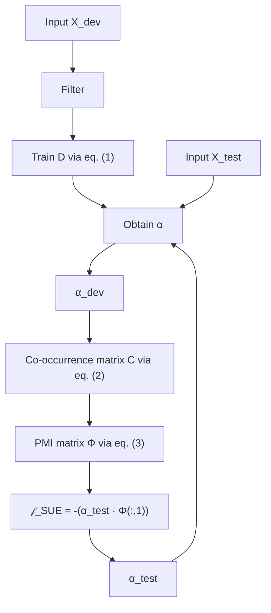

# SUE: Sparsity-based Uncertainty Estimation via Sparse Dictionary Learning

Tamás Ficsor and Gábor Berend

University of Szeged, Hungary

{ficsort,berendg}@inf.u-szeged.hu

# Abstract

The growing deployment of deep learning models in real-world applications necessitates not only high predictive accuracy, but also mechanism to identify unreliable predictions, especially in high-stakes scenarios where decision risk must be minimized. Existing methods estimate uncertainty by leveraging predictive confidence (e.g., Softmax Response), structural characteristics of representation space (e.g., Mahalanobis distance), or stochastic variation in model outputs (e.g., Bayesian inference techniques such as Monte Carlo Dropout). In this work, we propose a novel uncertainty estimation (UE) framework based on sparse dictionary learning by identifying dictionary atoms associated with misclassified samples. We leverage pointwise mutual information (PMI) to quantify the association between sparse features and predictive failure. Our method – Sparsity-based Uncertainty Estimation (SUE) – is computationally efficient, offers interpretability via atom-level analysis of the dictionary, has no assumption about the class distribution (unlike Mahalanobis distance). We evaluated SUE on several NLU benchmarks (GLUE and ANLI tasks) and sentiment analysis benchmarks (Twitter, ParaDetox, and Jigsaw). In general, SUE outperforms or matches the performance of other methods. SUE performs particularly well when there is considerable uncertainty in the model, i.e., when the model lacks high precision.

# 1 Introduction

The application of language models (LMs) in real-world applications is growing rapidly across many domains, including but not limited to healthcare (Razzak et al., 2018), finance (Akoglu et al., 2024), law (Siino et al., 2025), and education (Xiao et al., 2023). Although these models achieve strong performance on various NLP tasks, they are inherently prone to errors (Nguyen and O’Connor, 2015). These errors can be caused by several factors, such as biased or noisy training data (Mukhoti et al., 2023), ambiguity in the task (such as opinions or sentiments), or limitations in the model’s training process (Geiping et al., 2022).

A clear example of this is sentiment analysis, where the subjective nature of language can introduce high levels of uncertainty. To address this, it is crucial to identify uncertain instances and handle them differently, such as flagging them for human review, rather than treating all predictions as equally reliable (Geifman and El-Yaniv, 2017; Roberts, 2019).

Further examples of applications where UE plays an important role include clinical decision support, where incorrect predictions can harm patients; legal document analysis, where misinterpretations can lead to legal or compliance risks; content moderation, where errors can suppress valid speech or overlook harmful content; automated customer service, where wrong answers may cause user frustration or financial mistakes; and educational feedback systems, where misleading feedback can negatively impact student learning.

In such scenarios, selective classification (Geifman and El-Yaniv, 2017) can be applied, which allows models to refrain from making predictions when their confidence (or certainty) in a particular instance is insufficient. The option to refrain from predicting can consequently reduce the ratio of misclassified instances. This is typically achieved by associating a confidence (or uncertainty) score with each prediction and introducing a user-defined risk threshold that determines the subset of inputs for which the model’s decisions are considered reliable.

By doing so, the system effectively balances coverage – the proportion of samples on which predictions are made – with the overall decision risk. Thus, we can defer the high-risk samples to an expert or inform the user about potential consequences. We demonstrate such a scenario within the context of selective classification in Figure 1, where the task is to identify and categorize user issues.

<table><tr><td>Input</td><td>Technical</td><td>Billing</td><td>Spam</td><td>Uncertainty</td></tr><tr><td>I was charged twice and now I can’t log in.</td><td>48.4%</td><td>51.2%</td><td>0.4%</td><td>High</td></tr><tr><td>I am unable to log in to my account.</td><td>92.5%</td><td>5.7%</td><td>1.8%</td><td>Low</td></tr><tr><td>I cannot enter.</td><td>47.5%</td><td>0.7%</td><td>51.8%</td><td>High</td></tr><tr><td>Do you want to lose weight? Download this app now!</td><td>1.2%</td><td>0.1%</td><td>98.7%</td><td>Low</td></tr></table>

line

| Coverage (%) | Risk (%) |
| ------------ | -------- |
| Low Uncertainty | Predict |
| High Uncertainty | Abstain |

Figure 1: An example of selective classification where the task is to identify and categorize user issues. Selective classification enables a model to assess uncertainty of each sample and abstain from predictions it deems unreliable, allowing those cases to be handled by human reviewers.

Several classical machine learning models, such as Gaussian processes and Bayesian models, inherently provide uncertainty estimates as part of their framework (Liu et al., 2020). In contrast, deep learning models lack this intrinsic capability, necessitating the development of auxiliary metrics to quantify predictive uncertainty. One of the simplest and most widely adopted method is the Softmax Response (SR; Geifman and El-Yaniv (2017)), which derives confidence scores directly from the output probabilities of the softmax layer.

However, it has been well documented that softmax probabilities are often poorly calibrated and tend to be overconfident (Guo et al., 2017). To address this limitation, alternative approaches have been proposed, such as leveraging the Mahalanobis Distance (MD; Lee et al. (2018a)) computed over the hidden representations of the network to provide an uncertainty estimate. Recently, several other methods based on Bayesian inference (BI; Shen et al. (2021)) have also been introduced, and further methods that rely on auxiliary models (Mukhoti et al., 2023) to obtain the desired estimates.

Nevertheless, each of the aforementioned methods presents specific limitations: SR tends to produce overconfident predictions; MD relies on the assumption of a predefined mean and covariance structure for each class; and BI methods require considerable computational overhead, which may be impractical for large-scale deep models.

In this work, we propose a novel framework for uncertainty estimation (UE), based on sparse dictionary learning. Our method imposes no assumptions regarding the spatial distribution of class-specific representations (such as mean or variance) and offers good scalability. Furthermore, the risk of overestimation can be mitigated through the application of stronger regularization or by reducing the number of dictionary atoms used during factorization. Our code is available on our GitHub repository1.

# 2 Related Work

Uncertainty estimates in deep neural networks can be derived from the variance in their predictive responses. A natural way to capture this variability is through model ensembles, where each model or head provides an independent prediction for the same input sample (Lakshminarayanan et al., 2017). While ensemble methods are known for their uncertainty estimation capabilities, they introduce significant computational overhead due to the need for training and storing multiple models.

An alternative is to employ Bayesian inference techniques within a single model. A widely adopted method in this context is Monte Carlo Dropout (MC), where stochasticity is introduced during inference by enabling dropout within layers at evaluation time. By performing T stochastic forward passes on the same input, one can approximate the posterior predictive distribution and compute uncertainty estimates from the aggregated outputs. Common aggregation metrics include sampled maximum probability, predictive variance (Gal et al., 2017; Smith and Gal, 2018), and Bayesian Active Learning by Disagreement (Houlsby et al., 2011). Despite its practical appeal, MC Dropout remains computationally demanding at inference time, as it requires multiple forward passes per instance to obtain reliable uncertainty estimates.

A less computationally demanding alternative to ensemble or Bayesian approaches is to derive uncertainty metrics from already computed internal representations or to train a lightweight auxiliary model on top of the model output. To extract meaningful information from the internal model states, one can utilize the Mahalanobis distance as a proxy for uncertainty, as it effectively captures the structure of hidden representations. This method has been successfully applied in various recent works (Lee et al., 2018b; Podolskiy et al., 2021; Vazhentsev et al., 2022, 2023), demonstrating its ability to identify out-of-distribution or lowconfidence samples.

Alternatively, auxiliary models trained on the hidden states or prediction outputs offer a flexible and generalizable means of modeling uncertainty. These models can be calibrated to estimate uncertainty (Kendall and Gal, 2017; Kail et al., 2022).

# 3 Background

In this section, we provide a detailed overview of the UE methods evaluated in this study. Given our focus on sequence classification tasks, all methods operate exclusively on the representation of the [CLS] token or the corresponding output logits produced by the model.

# 3.1 Softmax Response (SR)

Softmax Response (Geifman and El-Yaniv, 2017) relies on the class probabilities generated by the softmax layer in the final classification head. It serves as a simple, yet effective UE baseline. The underlying intuition is that lower maximum softmax probabilities correspond to higher uncertainty in the model prediction. The uncertainty estimate is formally defined as

$$
\mathcal {U} _ {\mathrm{SR}} = 1 - \max _ {c \in C} p (y = c \mid x),
$$

where C denotes the set of all possible classes and $p \left( y = c \mid x \right)$ represents the softmax probability assigned to class c given input x.

# 3.2 Shannon Entropy (SE)

Shannon Entropy provides a natural and wellestablished measure of uncertainty, reflecting the amount of unpredictability in a probability distribution. In the context of classification, predictive entropy quantifies the spread of the model’s output distribution over the class labels. A high-entropy output indicates greater uncertainty, whereas low entropy reflects confident predictions concentrated on a single class (Malinin and Gales, 2018). SE is formally defined as

$$
\mathcal {U} _ {\mathrm{SE}} = - \sum_ {c \in C} p (y = c \mid x) \log p (y = c \mid x)
$$

# 3.3 Mahalanobis Distance (MD)

Mahalanobis distance (MD) is a specialized metric for measuring the distance between points in Euclidean space. In contrast to the Euclidean distance, MD considers the structure of the feature space. Hence, it is a suitable metric for UE that has been used in several studies already (Lee et al., 2018b; Podolskiy et al., 2021; Vazhentsev et al., 2022, 2023). MD can be formalized as

$$
\mathcal {U} _ {\mathrm{MD}} = \min _ {c \in C} (h - \mu_ {c}) \Sigma^ {- 1} (h - \mu_ {c}),
$$

where h is the hidden state corresponding to the [CLS] token of the input sequence, $\mu _ { c }$ is the mean of all vectors associated with class c, and $\Sigma ^ { - 1 }$ is the inverse of the covariance matrix of the train set. Mahalanobis++ (MD++; Müller and Hein, 2025) is such a recent extension of the vanilla MD, which applies unit normalization to the input vectors before calculating the Mahalanobis distance.

# 3.4 Monte Carlo Dropout (MC)

In recent years, approaches based on Bayesian Inference become widely used for uncertainty estimation. During MC, we perform inference with dropout enabled for T steps. Similar to Vazhentsev et al. (2022), we are going to conduct experiments with the following estimation methods:

# Sampled Maximum Probability (SMP):

$$
\mathcal {U} _ {\mathrm{SMP}} = 1 - \max _ {c \in C} \frac {1}{T} \sum_ {t = 1} ^ {T} p (y = c \mid x _ {t}),
$$

where $p \left( \boldsymbol { y } = \boldsymbol { c } \mid \boldsymbol { x } _ { t } \right)$ denotes the probability of class c given input x at stochastic step t.

Probability Variance (PV; Gal et al. (2017); Smith and Gal (2018)):

$$
\mathcal {U} _ {\mathrm{PV}} = \frac {1}{C} \sum_ {c = 1} ^ {C} \left(\frac {1}{T} \sum_ {t = 1} ^ {T} \left(p (y = c \mid x _ {t}) - \overline {{p ^ {c}}}\right)\right)
$$

where $\begin{array} { r } { \overline { { p ^ { c } } } = \frac { 1 } { T } \sum _ { t } p \left( y = c \mid x _ { t } \right) } \end{array}$ .

Bayesian Active Learning by Disagreement (BALD; Houlsby et al., 2011):

$$
\begin{array}{l} \mathcal {U} _ {\text { BALD }} = - \sum_ {c = 1} ^ {C} \overline {{p ^ {c}}} \log \overline {{p ^ {c}}} \\ + \frac {1}{T} \sum_ {c, t} p (y = c \mid x _ {t}) \log p (y = c \mid x _ {t}). \\ \end{array}
$$

# 4 Sparsity-based Uncertainty Estimation (SUE)

In this section, we introduce our approach for obtaining UE scores. SUE consists of the following key steps: (1) constructing sparse representations, (2) measuring co-occurrence with pointwise mutual information, and (3) quantifying uncertainty estimate. We summarize the key steps of SUE in Figure 2. SUE is inspired by (Berend, 2020), which demonstrated the utility of relying on PMI statistics of sparse coding-derived features for the task of word sense disambiguation.

# 4.1 Determining Sparse Representation

A key component of our approach is the use of dictionary learning to represent hidden states in a compact and interpretable manner. Instead of working directly with the dense [CLS] embeddings, we decompose them into a sparse linear combination of learned dictionary atoms. Intuitively, the dictionary atoms are fundamental building blocks that capture the most salient and recurring structures in the representation space.

Formally, given the input matrix $X \in \mathbb { R } ^ { N \times d }$ , where each row corresponds to the [CLS] token embedding of a sample, we learn the dictionary matrix $D ~ \in ~ \mathbb { R } ^ { K \times d }$ and the sparse coefficients $\alpha \in \mathbb { R } ^ { N \times K }$ by solving the following optimization problem (Mairal et al., 2009):

$$
\min _ {\alpha , D} \frac {1}{2} \| X - \alpha D \| _ {F} ^ {2} + \lambda \| \alpha \| _ {1}, \tag {1}
$$

where K is the number of dictionary atoms, and λ is the regularization coefficient of the sparsityinducing regularization term $\| \alpha \| _ { 1 }$ . Due to the regularization, only a small fraction of the values in $\alpha$ is positive, making the sparse representations more interpretable. To improve stability, we apply ℓ1-normalization to each row of X prior to factorization, following a common practice during dictionary learning. We train D on a validation split disjoint from the model’s training data. At test time, the dictionary D remains fixed, and we infer only the coefficients $\alpha _ { \mathrm { t e s t } }$ . This separation yields dictionary atoms in D with improved ability to generalize.

An important design choice is which samples to use for training the dictionary matrix. Using all inputs might introduce noise from ambiguous samples, while class-specific dictionaries may underrepresent minority classes. To balance these issues, we only use the correctly classified samples for constructing D, encouraging the dictionary atoms to reflect reliable patterns. We only rely on the set of filtered samples during dictionary learning, and we rely on all samples – regardless of the prediction’s correctness – once the dictionary is fixed.

# 4.2 Identifying Dictionary Atoms Correlated with Prediction Uncertainty

The central idea of our method is to link sparse representations with the reliability of model predictions. Specifically, we aim to identify dictionary atoms that frequently co-occur with misclassified instances. These “uncertain atoms” serve as indicators of prediction failures, and by quantifying their contribution we can derive an uncertainty score.

We measure this association using Pointwise Mutual Information (PMI), which captures how strongly the activation of a given atom correlates with a correct or incorrect classification. Intuitively, PMI highlights atoms that appear disproportionately often in failures compared to what would be expected by chance.

Formally, we construct a co-occurrence matrix $C \in \overset { \cdot } { \mathbb { R } } ^ { K \times 2 }$ between the activation of each dictionary atom and the binary correctness label $L \in \{ 0 , \dot { 1 } \} ^ { N }$ (with 0 and 1 denoting incorrect and correct classification, respectively):

$$
C _ {k, l} = \sum_ {n = 1} ^ {N} \mathbb {I} \big [ \alpha^ {(n, k)} \neq 0 \land L ^ {(n)} = l \big ], \tag {2}
$$

where $\mathbb { I } [ \cdot ]$ is the indicator function, $\alpha ^ { ( n , k ) }$ denotes the coefficient of the dictionary atom k in the sparse decomposition for sample n, and $L ^ { ( n ) }$ indicates the correctness of the prediction for sample n. From $C ,$ , we calculate the maximum likelihood estimates of the joint probability $P ( k , l )$ and the marginals $P ( k )$ and $P ( l )$ . The PMI between the coefficient for the dictionary atom k being non-zero and the correctness label l is then defined as:

flowchart

Figure 2: An overview of our approach. X denotes the collection of [CLS] tokens, α and D refers to the matrix of sparse representations and the dictionary matrix, respectively. The matrix C includes the co-occurrence statistics between the active (non-zero) elements from α and the correctness of the model predictions. Φ denotes the Pointwise Mutual Information (PMI) matrix, and $\boldsymbol { \mathcal { U } } _ { \mathrm { S U E } }$ is the final uncertainty estimation metric. In the figure, Filter refers to a special operation that selects from X only those samples that were correctly classified by the model.

$$
\Phi_ {k, l} = \log \frac {P (k , l)}{P (k) P (l)}. \tag {3}
$$

To estimate the uncertainty of a test instance i, we aggregate the PMI scores of its active atoms using the corresponding sparse representation $\alpha _ { \mathrm { t e s t } } ^ { ( i ) }$ :

$$
U _ {\mathrm{SUE}} ^ {(i)} = - \left(\alpha_ {\text { test }} ^ {(i)} \cdot \Phi_ {(:, 1)}\right), \tag {4}
$$

where $\Phi _ { ( : , 1 ) }$ denotes the PMI values associated with correctly classified samples. The negative sign ensures that lower scores correspond to higher classification confidence, or alternatively, higher values of (4) indicate higher prediction uncertainty.

This formulation yields an interpretable uncertainty estimate: the contribution of each dictionary atom to USUE can be directly inspected, allowing us to trace uncertainty back to specific building blocks of the representation space.

# 5 Experimental Setup

Models: We evaluated each method using finetuned BERT-Base and Large (Devlin et al., 2019), and RoBERTa-Base (Liu et al., 2019) models across a range of natural language understanding and sentiment classification tasks. We link the finetuned model checkpoints on our Github repository1 alongside with our source code. The classification performance of these checkpoints is presented in Table 1. While ANLI may look weak in terms of accuracy, it is important to remember that it was intentionally designed to be challenging. All of the checkpoints perform above the majority and random baseline of 0.33 for each task. However, these results are not directly comparable to the official metrics, since we are using a reduced set of data points, a detail we are going to discuss in the following paragraphs. We provide the fine-tuning hyperparameters in Appendix A.

<table><tr><td></td><td>BERT-Base</td><td>BERT-Large</td><td>RoBERTa-Base</td></tr><tr><td>ParaDetox</td><td>0.97(±0.00)</td><td>0.97(±0.00)</td><td>0.98(±0.00)</td></tr><tr><td>Twitter</td><td>0.90(±0.00)</td><td>0.88(±0.05)</td><td>0.90(±0.00)</td></tr><tr><td>Jigsaw</td><td>0.93(±0.00)</td><td>0.92(±0.01)</td><td>0.92(±0.01)</td></tr><tr><td>ANLI-R1</td><td>0.39(±0.01)</td><td>0.39(±0.01)</td><td>0.37(±0.04)</td></tr><tr><td>ANLI-R2</td><td>0.40(±0.01)</td><td>0.36(±0.02)</td><td>0.36(±0.03)</td></tr><tr><td>ANLI-R3</td><td>0.38(±0.02)</td><td>0.38(±0.02)</td><td>0.35(±0.02)</td></tr></table>

Table 1: The performance of models on the test split.

Datasets: We evaluated our UE approaches on three datasets: ParaDetox (Logacheva et al., 2022), Twitter Sentiment (Davidson et al., 2017), and the Jigsaw Toxic Comment Classification Challenge dataset (cjadams et al., 2017), all binarized for consistency, following (Vazhentsev et al., 2023).

To further assess our method on harder tasks, we also include experiments on Adversarial NLI (ANLI; Nie et al. 2020; Williams et al. 2022). Additionally, we conducted experiments using BERT-Large using the following datasets from the GLUE benchmark (Wang et al., 2018): the Corpus of Linguistic Acceptability (CoLA; Warstadt et al. 2019), the Microsoft Research Paraphrase Corpus (MRPC; Dolan and Brockett 2005), the Question Natural Language Inference (QNLI; Rajpurkar et al. 2016), the Stanford Sentiment Treebank (SST-2; Socher et al. 2013), and the Quora Question Pairs (QQP; Iyer et al. 2017) dataset. We provide further information on the datasets in Appendix A.

Metrics: To evaluate the performance of different UE methods, we adopt the Excess Area Under the Risk-Coverage Curve (eAU-RCC; Geifman et al., 2019). eAU-RCC is based on the Risk-Coverage Curve (RCC; El-Yaniv and Wiener, 2010), which is meant to assess the quality of a selective classifier, where the model is allowed to abstain from predictions considered as uncertain.

RCC measures the extent to which the risk accumulates as more samples – ranked by decreasing confidence – are included in the prediction set. eAU-RCC extends RRC by quantifying the additional risk that incurs due to suboptimal uncertainty ranking compared to an oracle

$$
\mathrm{eAU-RC} = \int_ {0} ^ {1} (R (c) - R ^ {*} (c)) d c,
$$

where $R ( c )$ is the empirical risk at coverage level $c \in [ 0 , 1 ]$ , and $R ^ { * } ( c )$ is the oracle (optimal) risk at coverage level c. Lower eAU-RCC values indicate better uncertainty estimation, as they reflect lower excess risk across different coverage levels.

While some tasks are typically evaluated using specialized metrics (e.g., Matthew’s Correlation Coefficient for CoLA), we report accuracy across all datasets to maintain consistency with our uncertainty estimation framework. This is because the empirical risk metric used in Risk-Coverage Curves is based on the zero-one loss.

Hyperparameters: We selected the final hyperparameters based on a validation set performance specific to each task.

As for the MC Dropout-related hyperparameters, we chose $T \in \{ 1 0 , 2 5 , 5 0 \}$ stochastic steps. Following the findings of Shelmanov et al. (2021), we enabled dropout in all layers of our transformer model during inference time.

Related to the dictionary learning component of SUE, we experimented with the regularization coefficient $\lambda \in \{ 0 . 0 1 , 0 . 0 2 , 0 . 0 4 , 0 . 0 6 , 0 . 0 8 , 0 . 1 \}$ and the number of dictionary atoms K 256, 512, 768 . Additionally, for non-GLUE tasks, we selected 8,000 samples as a calibration set that we further split into two disjoint parts with a split ratio of $s r \in \{ 0 . 2 , 0 . 4 , 0 . 6 , 0 . 8 \}$ . For a certain split ratio, we selected the given fraction of calibration set samples for performing dictionary learning, and used the remaining samples of the calibration set for calculating the co-occurrence matrix and the PMI statistics.

# 6 Results

# 6.1 Analyzing the Effects of Hyperparameters

We next analyze the effect of our hyperparameters, that is, the fraction of calibration set used for dictionary learning, the choice of regularization strength λ, and the number of dictionary atoms K.

  
Figure 3: The effect of the percentage of samples used from the calibration set during dictionary learning on BERT-Base model with respect to the regularization coefficient (λ) and the number of dictionary atoms (K).

First, we illustrate the joint effect of choosing our hyperparameters in Figure 3, evaluated on ANLI-R1 with fine-tuned BERT-Base models. While the proportion of calibration set used for dictionary learning did not influence the eAU-RCC scores substantially, the choice of λ and K had a more pronounced effect.

To better understand the joint effects of λ and K, we provide further results for their different combinations in Figure 4, where we fixed the fraction of calibration set samples used for dictionary learning to 20%, and allocated the remaining 80% of the calibration set for calculating the matrix of PMI values in Φ. We observe that on simpler tasks (ParaDetox, Twitter, Jigsaw), the effect of regularization differs compared to harder tasks (ANLI). In the case of simpler tasks, recurring atoms may overfit to the number of samples – that is, fewer atoms are sufficient – while for harder tasks, we can extract more unique atoms.

<table><tr><td></td><td>ParaDetox</td><td>Twitter</td><td>Jigsaw</td><td>ANLI-R1</td><td>ANLI-R2</td><td>ANLI-R3</td></tr><tr><td colspan="7">BERT-Base</td></tr><tr><td>SE</td><td>0.37(±0.04)</td><td>1.84(±0.15)</td><td>0.65(±0.02)</td><td>37.06(±1.28)</td><td>39.85(±1.10)</td><td>36.88(±0.71)</td></tr><tr><td>SR</td><td>0.37(±0.04)</td><td>1.85(±0.15)</td><td>0.65(±0.02)</td><td>37.00(±1.32)</td><td>39.98(±1.03)</td><td>37.06(±0.84)</td></tr><tr><td>MD</td><td>0.52(±0.11)</td><td>4.00(±0.18)</td><td>5.91(±4.24)</td><td>46.62(±3.24)</td><td>43.68(±1.23)</td><td>44.64(±1.92)</td></tr><tr><td>MD++</td><td>0.54(±0.08)</td><td>3.88(±0.16)</td><td>4.87(±3.05)</td><td>46.51(±2.79)</td><td>43.79(±1.24)</td><td>43.85(±1.17)</td></tr><tr><td>MC-SMP</td><td>0.30(±0.06)</td><td>1.73(±0.12)</td><td>0.55(±0.02)</td><td>36.70(±1.57)</td><td>39.41(±1.10)</td><td>36.91(±0.61)</td></tr><tr><td>MC-PV</td><td>0.27(±0.04)</td><td>1.88(±0.09)</td><td>0.58(±0.03)</td><td>38.52(±1.40)</td><td>40.11(±0.97)</td><td>38.88(±0.91)</td></tr><tr><td>MC-BALD</td><td>0.29(±0.04)</td><td>2.06(±0.06)</td><td>0.67(±0.04)</td><td>38.91(±1.38)</td><td>40.39(±1.14)</td><td>39.51(±0.93)</td></tr><tr><td>SUE</td><td>0.46(±0.14)</td><td>1.95(±0.23)</td><td>0.40(±0.05)</td><td>29.55(±2.11)</td><td>31.65(±0.96)</td><td>32.76(±1.13)</td></tr><tr><td colspan="7">BERT-Large</td></tr><tr><td>SE</td><td>0.45(±0.24)</td><td>2.18(±0.89)</td><td>0.67(±0.05)</td><td>38.81(±1.98)</td><td>41.70(±2.18)</td><td>39.19(±1.89)</td></tr><tr><td>SR</td><td>0.45(±0.24)</td><td>2.17(±0.90)</td><td>0.67(±0.05)</td><td>38.72(±1.92)</td><td>41.73(±2.40)</td><td>39.24(±2.10)</td></tr><tr><td>MD</td><td>0.85(±0.34)</td><td>9.82(±11.83)</td><td>5.08(±4.67)</td><td>47.20(±3.95)</td><td>44.41(±1.97)</td><td>43.26(±2.50)</td></tr><tr><td>MD++</td><td>0.75(±0.30)</td><td>9.71(±12.00)</td><td>5.56(±5.62)</td><td>45.26(±4.62)</td><td>43.91(±2.60)</td><td>43.07(±2.51)</td></tr><tr><td>MC-SMP</td><td>0.33(±0.14)</td><td>2.24(±1.11)</td><td>0.55(±0.06)</td><td>38.84(±1.81)</td><td>40.75(±1.30)</td><td>38.99(±1.90)</td></tr><tr><td>MC-PV</td><td>0.31(±0.12)</td><td>3.05(±2.33)</td><td>0.69(±0.13)</td><td>42.24(±1.28)</td><td>41.32(±1.06)</td><td>41.01(±2.74)</td></tr><tr><td>MC-BALD</td><td>0.34(±0.12)</td><td>4.34(±4.48)</td><td>0.89(±0.20)</td><td>43.13(±1.50)</td><td>41.85(±1.14)</td><td>41.12(±2.81)</td></tr><tr><td>SUE</td><td>0.67(±0.21)</td><td>2.50(±1.11)</td><td>0.44(±0.10)</td><td>30.65(±2.27)</td><td>37.75(±3.86)</td><td>32.15(±2.08)</td></tr><tr><td colspan="7">RoBERTa-Base</td></tr><tr><td>SE</td><td>0.17(±0.03)</td><td>2.03(±0.21)</td><td>0.64(±0.09)</td><td>40.21(±4.64)</td><td>40.75(±1.82)</td><td>39.79(±3.07)</td></tr><tr><td>SR</td><td>0.17(±0.03)</td><td>2.04(±0.21)</td><td>0.64(±0.09)</td><td>39.67(±4.01)</td><td>40.51(±1.52)</td><td>40.61(±2.42)</td></tr><tr><td>MD</td><td>0.49(±0.12)</td><td>3.76(±0.50)</td><td>6.45(±3.36)</td><td>45.47(±1.40)</td><td>43.53(±1.65)</td><td>44.50(±2.25)</td></tr><tr><td>MD++</td><td>0.28(±0.06)</td><td>3.48(±0.25)</td><td>3.91(±1.83)</td><td>45.24(±1.98)</td><td>42.96(±1.64)</td><td>43.89(±2.85)</td></tr><tr><td>MC-SMP</td><td>0.12(±0.01)</td><td>1.92(±0.15)</td><td>0.51(±0.06)</td><td>40.35(±4.65)</td><td>41.76(±2.05)</td><td>41.24(±3.10)</td></tr><tr><td>MC-PV</td><td>0.14(±0.02)</td><td>2.27(±0.25)</td><td>0.64(±0.09)</td><td>41.13(±2.17)</td><td>42.66(±1.60)</td><td>42.13(±3.76)</td></tr><tr><td>MC-BALD</td><td>0.17(±0.02)</td><td>2.55(±0.38)</td><td>0.84(±0.17)</td><td>41.74(±2.02)</td><td>42.94(±1.55)</td><td>42.21(±3.68)</td></tr><tr><td>SUE</td><td>0.38(±0.29)</td><td>2.18(±0.17)</td><td>0.38(±0.03)</td><td>35.73(±10.84)</td><td>39.33(±4.77)</td><td>40.02(±5.50)</td></tr></table>

Table 2: eAU-RCC scores (multiplied by 100) for each task-method pair, with lower scores indicating better UE performance. The best results are in bold and the second best results are underlined. For the individual MC-\* approaches, we report the best result that we obtained over the different choices of T . We include the detailed MC-\* results that we obtained for the different values of T in Table 7.

Compared to the theoretical recommendation $\lambda = 1 . 2 / \sqrt { d } .$ , which is approximately 0.0433 for BERT-Base (d = 768), we observe only minor differences in outcomes. This makes it a reasonable initial value for λ. However, selecting the number of atoms requires further investigation, and care should be taken to avoid overfitting. As a general rule, we suggest fixing λ to the theoretical value and choosing the number of atoms according to the number of available samples and the difficulty of the task at hand. Results for other model–task pairs are presented in Appendix A, showing similar trends.

We relied on the validation set performance when selecting hyperparameters. In order to as-

sess the sensitivity to hyperparameter choice, we provide the paired validation and test set performances for all tested hyperparameter combinations for BERT-Base in Figure 5. We can see that for the individual tasks, there is low variability in the performances along both axes and that the hyperparameters that perform well on the validation set also perform well on the test set, indicating the robustness of SUE to hyperparameter choices. We report similar plots indicating the robustness of SUE to hyperparameter choices when used in conjunction with other models in Appendix B.

heatmap

ParaDetox
| | 256 | 0.33 | 0.30 | 0.31 | 0.41 | 0.44 | 0.44 |
|---|---|---|---|---|---|---|---|
| X | 256 | 0.36 | 0.31 | 0.45 | 0.39 | 0.43 | 0.44 |
| Y | 256 | 0.36 | 0.31 | 0.41 | 0.44 | 0.45 | 0.43 |
The image displays a matrix of correlation coefficients between two variables, with each cell representing a value and its corresponding row or column indices. Values are estimated based on the color intensity of the matrix.

heatmap

Jigsaw
| | 256 | 0.41 | 0.39 | 0.38 | 0.41 | 0.38 | 0.38 |
|---|---|---|---|---|---|---|---|
| × 512 | 256 | 0.39 | 0.40 | 0.39 | 0.39 | 0.39 | 0.39 |
| × 768 | 256 | 0.39 | 0.39 | 0.40 | 0.40 | 0.42 | 0.41 |
| | 512 | 0.39 | 0.40 | 0.40 | 0.40 | 0.42 | 0.41 |
| | 768 | 0.39 | 0.39 | 0.40 | 0.40 | 0.42 | 0.41 |
| λ | 256 | 0.41 | 0.39 | 0.38 | 0.41 | 0.38 | 0.38 |
| λ = 0.01, λ = 0.02, λ = 0.04, λ = 0.06, λ = 0.08, λ = 0.1 | 256 | 0.41 | 0.39 | 0.38 | 0.41 | 0.38 | 0.38 |
| λ = 0.06, λ = 0.08, λ = 0.1 | 256 | 0.41 | 0.39 | 0.38 | 0.41 | 0.38 | 0.38 |
| λ = 0.1, λ = 0.1 | 256 | 0.41 | 0.39 | 0.38 | 0.41 | 0.38 | 0.38 |
The data is a matrix of decimal numbers (e.g., 'λ') representing the correlation coefficients between adjacent variables.

heatmap

ANLI-R1
| | 256 | 512 | 768 |
|---|---|---|---|
| 256 | 33.20 | 32.30 | 31.66 |
| 512 | 32.87 | 31.84 | 30.78 |
| 768 | 31.79 | 30.76 | 29.97 |
| | 31.00 | 30.31 | 29.69 |
| | 30.58 | 29.93 | 29.74 |
| | 29.94 | 30.14 | 29.19 |
| λ | 0.01 | 0.02 | 0.04 |
| | 0.06 | 0.08 | 0.1 |
The values in the table represent the absolute scores of the ANLI-R1 metric at each data point. The color intensity reflects the magnitude of the score.

heatmap

ANLI-R2
| | 256 | 36.31 | 35.61 | 34.25 | 33.42 | 32.70 | 32.93 |
|---|---|---|---|---|---|---|---|
| × 512 | 256 | 35.26 | 34.18 | 32.47 | 32.28 | 31.81 | 32.42 |
| | 768 | 34.35 | 33.31 | 32.26 | 31.70 | 31.72 | 31.44 |
| | | 0.01 | 0.02 | 0.04 | 0.06 | 0.08 | 0.1 |
The values in the matrix represent the correlation coefficients between the two variables.

heatmap

ANLI-R3
| | 256 | 512 | 768 |
|---|---|---|---|
| 0.01 | 36.51 | 36.01 | 35.33 |
| 0.02 | 35.98 | 35.47 | 34.69 |
| 0.04 | 35.02 | 33.91 | 33.48 |
| 0.06 | 34.35 | 33.15 | 33.05 |
| 0.08 | 33.34 | 33.11 | 32.86 |
| 0.1 | 33.33 | 32.56 | 32.83 |

Figure 4: The effect of sparse factorization on BERT-Base model with respect to the regularization coefficient (λ) and the number of dictionary atoms (K) on every task.

# 6.2 Quantitative Results

In this section, we compare the performance of various UE methods across a range of sequence classification tasks. Table 2 presents the eAU-RCC scores, where lower values indicate better uncertainty estimation (i.e., lower risk at increasing coverage levels).

In general, we observe that baseline methods such as SE, SR, and MD(++) perform consistently worse than more advanced approaches. MC based methods achieve competitive results on simpler tasks like ParaDetox and Twitter, but their effectiveness diminishes on more challenging reasoning benchmarks such as ANLI.

scatter

| Validation | Test | Tasks     |
| ---------- | ---- | --------- |
| 0          | 0    | Twitter   |
| 0          | 0    | Jigsaw    |
| 0          | 0    | ParaDetox |
| 0          | 0    | ANLI-R1   |
| 0          | 0    | ANLI-R2   |
| 0          | 0    | ANLI-R3   |
| 20         | 30   | Twitter   |
| 20         | 30   | Jigsaw    |
| 20         | 30   | ParaDetox |
| 20         | 30   | ANLI-R1   |
| 20         | 30   | ANLI-R2   |
| 20         | 30   | ANLI-R3   |
| 25         | 35   | Twitter   |
| 25         | 35   | Jigsaw    |
| 25         | 35   | ParaDetox |
| 25         | 35   | ANLI-R1   |
| 25         | 35   | ANLI-R2   |
| 25         | 35   | ANLI-R3   |
| 30         | 38   | Twitter   |
| 30         | 38   | Jigsaw    |
| 30         | 38   | ParaDetox |
| 30         | 38   | ANLI-R1   |
| 30         | 38   | ANLI-R2   |
| 30         | 38   | ANLI-R3   |
| 35         | 40   | Twitter   |
| 35         | 40   | Jigsaw    |
| 35         | 40   | ParaDetox |
| 35         | 40   | ANLI-R1   |
| 35         | 40   | ANLI-R2   |
| 35         | 40   | ANLI-R3   |
| 40         | 45   | Twitter   |
| 40         | 45   | Jigsaw    |
| 40         | 45   | ParaDetox |
| 40         | 45   | ANLI-R1   |
| 40         | 45   | ANLI-R2   |
| 40         | 45   | ANLI-R3   |
| 45         | 50   | Twitter   |
| 45         | 50   | Jigsaw    |
| 45         | 50   | ParaDetox |
| 45         | 50   | ANLI-R1   |
| 45         | 50   | ANLI-R2   |
| 45         | 50   | ANLI-R3   |
| 50         | 55   | Twitter   |
| 50         | 55   | Jigsaw    |
| 50         | 55   | ParaDetox |
| 50         | 55   | ANLI-R1   |
| 50         | 55   | ANLI-R2   |
| 50         | 55   | ANLI-R3   |

Figure 5: Relationship of development and test set eAU-RCC scores when applying SUE with different hyperparameter choices for fine-tuned BERT-base models.

<table><tr><td></td><td>CoLA</td><td>MRPC</td><td>QNLI</td><td>SST-2</td><td>QQP</td></tr><tr><td>SR</td><td>4.04</td><td>17.04</td><td>11.80</td><td>1.04</td><td>7.39</td></tr><tr><td>SE</td><td>4.17</td><td>17.04</td><td>11.80</td><td>1.04</td><td>7.39</td></tr><tr><td>MD</td><td>8.25</td><td>28.85</td><td>13.73</td><td>9.05</td><td>10.27</td></tr><tr><td>MD++</td><td>21.27</td><td>35.64</td><td>13.51</td><td>5.55</td><td>9.79</td></tr><tr><td>MC-SMP</td><td>4.51</td><td>29.59</td><td>8.10</td><td>0.97</td><td>7.81</td></tr><tr><td>MC-PV</td><td>4.17</td><td>30.47</td><td>8.11</td><td>0.90</td><td>6.26</td></tr><tr><td>MC-BALD</td><td>4.38</td><td>31.01</td><td>8.14</td><td>0.90</td><td>7.73</td></tr><tr><td>SUE</td><td>4.00</td><td>11.64</td><td>7.66</td><td>1.24</td><td>5.59</td></tr></table>

Table 3: eAU-RCC scores (multiplied by 100) for each GLUE task on BERT-large models. Each MC method were evaluated with T = 25 steps.

By contrast, our proposed SUE demonstrates robust performance across all tasks and models, often achieving the best or second-best scores. Notably, SUE substantially outperforms alternative methods on Jigsaw and ANLI, indicating its strength in handling harder tasks. These results highlight SUE’s stability and efficiency as a reliable alternative to sampling-heavy approaches, particularly in scenarios where traditional MC methods become computationally expensive.

Similar trends can be seen on GLUE as well which can be seen in Table 3. These results are limited to BERT-large models only. The corresponding model performances can be seen in the Appendix (Table 5), which shows that SUE only performs worse on SST-2.

These results suggest that SUE is particularly well-suited for tasks with higher overall uncertainty, i.e., tasks where the model has lower precision. In general, the harder the task, the more likely SUE is to outperform other methods – a trend consistently observed across GLUE, ANLI, and sentiment classification benchmarks.

# 6.3 Interpretability of SUE

To better understand the behavior of SUE, we inspected the distribution of the uncertainty scores of ParaDetox. During that inspection, we had a look at the most confident test samples according to their SUE score. We further filtered these instances to keep only those for which have been misclassified. These samples can be seen in Table 4.

Some errors can be easily traced back to simple mistakes in the dataset, such as the second example in Table 4, where a similar sentence appears twice, with the only difference being that the word "generation" was replaced with "gen" which – according to the annotation – changes the label to toxic. There are several other examples where no or unsubstantial modifications were made to the sentence. Additionally, other samples exhibit simple ambiguities, which may stem from a lack of context or differences in personal tolerance.

We can further explore why SUE assigns high confidence to certain misclassified samples. Figure 6 visualizes the contribution of each atom contribute towards the final uncertainty estimate. These visualizations correspond to the same samples listed in Table 4, shown in the same order.

In the plot, each bar represents the influence of a dictionary atom. Red indicates a contribution towards confidence, while blue indicates a contribution towards uncertainty. This visualization can be interpreted as a force plot: red bars push the estimate towards higher confidence (left), and blue bars push towards greater uncertainty (right). The final SUE score is determined by the point at which these opposing forces meet.

By observing Figure 6, we can make a few remarks about the samples. The first six samples were chosen because they contain no uncertain atoms, while the remaining samples have only one or two atoms that push them toward uncertainty.

# 7 Conclusions

In this work, we introduced SUE, a sparse codingbased uncertainty estimation method and evalu-Text

<table><tr><td>but screw everything else they do, especially canadian content. i had the new generation rondo as a rental and i agree, its crap. damn straight!! dd when you said it to me on saturday night i lost my mind lol rt when bored all the stupid things come to your head we are not totally stupid, we know she works for cnn. oh shit eddie izzard this night i forget vice just went full - retard. sometimes, i just sit here on twitter, thinking i am not stupid. eh! whoresnops for life! thanks for the warning.</td></tr></table>

Table 4: Misclassified instances of ParaDetox with high confidence according to the SUE scores. All instances have a neutral ground truth label.

bar

| Contribution of dictionary atoms | Uncertainty | Confidence |
| --------------------------------- | ----------- | ---------- |
| 0.000                             | 0.000       | 0.000      |
| 0.005                             | 0.000       | 0.000      |
| 0.010                             | 0.000       | 0.000      |
| 0.015                             | 0.000       | 0.000      |
| 0.020                             | 0.000       | 0.000      |
| 0.025                             | 0.000       | 0.000      |
| 0.030                             | 0.000       | 0.000      |
| 0.035                             | 0.000       | 0.000      |
| 0.040                             | 0.000       | 0.000      |
| 0.045                             | 0.000       | 0.000      |
| 0.050                             | 0.000       | 0.000      |

Figure 6: We present the contribution of each atom towards the final SUE score. Each row in the plot corresponds to one of the samples listed in Table 4, presented in the same order.

ated it on sequence classification tasks. By leveraging sparse representations of the final hidden states of transformer models, our approach effectively captures meaningful patterns aligned with the model’s confidence. Through extensive experiments on GLUE, ANLI and Sentiment benchmarks, we demonstrated that SUE consistently outperforms classical confidence-based methods such as Softmax Response and Shannon Entropy, as well as MC dropout variants. This is particularly the case in scenarios where model precision is low and uncertainty estimation becomes critical. Our method yields the best overall performance in terms of eAU-RCC, and offers more stable and interpretable risk-coverage behavior.

We complemented our quantitative evaluation with qualitative analyzes, revealing how atoms contribute toward the final uncertainty scores, helping the identification of those cases where high or low model prediction confidence is unwarranted. Additionally, we linked the structure of the learned PMI matrix to downstream estimation quality, offering insight into potential failure cases. Overall, our results suggest that sparse representations provide a powerful and interpretable foundation for uncertainty estimation.

# Limitations

Our approach relies on sparse dictionary learning, which requires setting the hyperparameters related to the number of dictionary atoms (K) and the sparsity-inducing regularization coefficient (λ). However, our ablation study on the choice of these hyperparameters showed little variability in performance, and selecting theoretical values was sufficient to achieve the expected outcomes. We also note that alternative uncertainty estimators likewise involve hyperparameters in one form or another.

# Acknowledgments

This paper was supported by the János Bolyai Research Scholarship of the Hungarian Academy of Sciences. The research received additional support from the European Union project RRF-2.3.1-21- 2022-00004 within the framework of the Artificial Intelligence National Laboratory and project no. 2024-1.2.3-HU-RIZONT-2024-00017, which has been implemented with the support provided by the Ministry of Culture and Innovation of Hungary from the National Research, Development and Innovation Fund, financed under the 2024-1.2.3- HU-RIZONT funding scheme. Additionally, we are grateful for the possibility to use ELKH Cloud (see Héder et al., 2022; https://science-cloud.hu/) which helped us achieve the results published in this paper.

# References

Leman Akoglu, Nitesh V. Chawla, Josep Domingo-Ferrer, Eren Kurshan, Senthil Kumar, Vidyut M. Naware, José A. Rodríguez-Serrano, Isha Chaturvedi, Saurabh Nagrecha, Mahashweta Das, and Tanveer A. Faruquie. 2024. Machine learning in finance. In KDD, page 6703. ACM.   
Gábor Berend. 2020. Sparsity makes sense: Word sense disambiguation using sparse contextualized word representations. In Proceedings of the 2020 Conference on Empirical Methods in Natural Language Processing (EMNLP), pages 8498–8508, Online. Association for Computational Linguistics.   
cjadams, Jeffrey Sorensen, Julia Elliott, Lucas Dixon, Mark McDonald, nithum, and Will Cukierski. 2017. Toxic comment classification challenge. https://kaggle.com/competitions/ jigsaw-toxic-comment-classification-challenge. e. Kaggle.   
Thomas Davidson, Dana Warmsley, Michael Macy, and Ingmar Weber. 2017. Automated hate speech detection and the problem of offensive language. Proceed-

ings of the International AAAI Conference on Web and Social Media, 11(1):512–515.   
Jacob Devlin, Ming-Wei Chang, Kenton Lee, and Kristina Toutanova. 2019. BERT: Pre-training of deep bidirectional transformers for language understanding. In Proceedings of the 2019 Conference of the North American Chapter of the Association for Computational Linguistics: Human Language Technologies, Volume 1 (Long and Short Papers), pages 4171–4186, Minneapolis, Minnesota. Association for Computational Linguistics.   
William B. Dolan and Chris Brockett. 2005. Automatically constructing a corpus of sentential paraphrases. In Proceedings of the Third International Workshop on Paraphrasing (IWP2005).   
Ran El-Yaniv and Yair Wiener. 2010. On the foundations of noise-free selective classification. J. Mach. Learn. Res., 11:1605–1641.   
Yarin Gal, Riashat Islam, and Zoubin Ghahramani. 2017. Deep Bayesian active learning with image data. In Proceedings of the 34th International Conference on Machine Learning, volume 70 of Proceedings of Machine Learning Research, pages 1183–1192. PMLR.   
Yonatan Geifman and Ran El-Yaniv. 2017. Selective classification for deep neural networks. In Advances in Neural Information Processing Systems, volume 30. Curran Associates, Inc.   
Yonatan Geifman, Guy Uziel, and Ran El-Yaniv. 2019. Bias-reduced uncertainty estimation for deep neural classifiers. In ICLR (Poster). OpenReview.net.   
Jonas Geiping, Micah Goldblum, Phillip Pope, Michael Moeller, and Tom Goldstein. 2022. Stochastic training is not necessary for generalization. In ICLR. OpenReview.net.   
Chuan Guo, Geoff Pleiss, Yu Sun, and Kilian Q. Weinberger. 2017. On calibration of modern neural networks. In roceedings of the 34th International Conference on Machine Learning, volume 70, pages 1321–1330. PMLR.   
Mihály Héder, Erno Rigó, Dorottya Medgyesi, Róbert˝ Lovas, Szabolcs Tenczer, Ferenc Török, Attila Farkas, Márk Emodi, József Kadlecsik, György Mez˝ o, Ádám˝ Pintér, and Péter Kacsuk. 2022. The past, present and future of the ELKH cloud. Információs Társadalom, 22(2):128.   
Neil Houlsby, Ferenc Huszar, Zoubin Ghahramani, and Máté Lengyel. 2011. Bayesian active learning for classification and preference learning. CoRR, abs/1112.5745.   
Shankar Iyer, Nikhil Dandekar, and Kornél Csernai. 2017. First quora dataset release: Question pairs.

Roman Kail, Kirill Fedyanin, Nikita Muravev, Alexey Zaytsev, and Maxim Panov. 2022. Scaleface: Uncertainty-aware deep metric learning. CoRR, abs/2209.01880.   
Alex Kendall and Yarin Gal. 2017. What uncertainties do we need in bayesian deep learning for computer vision? In NIPS, pages 5574–5584.   
Balaji Lakshminarayanan, Alexander Pritzel, and Charles Blundell. 2017. Simple and scalable predictive uncertainty estimation using deep ensembles. In NIPS, pages 6402–6413.   
Kimin Lee, Kibok Lee, Honglak Lee, and Jinwoo Shin. 2018a. A simple unified framework for detecting outof-distribution samples and adversarial attacks. In Advances in Neural Information Processing Systems, volume 31. Curran Associates, Inc.   
Kimin Lee, Kibok Lee, Honglak Lee, and Jinwoo Shin. 2018b. A simple unified framework for detecting out-of-distribution samples and adversarial attacks. In NeurIPS, pages 7167–7177.   
Jeremiah Liu, Zi Lin, Shreyas Padhy, Dustin Tran, Tania Bedrax Weiss, and Balaji Lakshminarayanan. 2020. Simple and principled uncertainty estimation with deterministic deep learning via distance awareness. In Advances in Neural Information Processing Systems, volume 33, pages 7498–7512. Curran Associates, Inc.   
Yinhan Liu, Myle Ott, Naman Goyal, Jingfei Du, Mandar Joshi, Danqi Chen, Omer Levy, Mike Lewis, Luke Zettlemoyer, and Veselin Stoyanov. 2019. Roberta: A robustly optimized bert pretraining approach. Cite arxiv:1907.11692.   
Varvara Logacheva, Daryna Dementieva, Sergey Ustyantsev, Daniil Moskovskiy, David Dale, Irina Krotova, Nikita Semenov, and Alexander Panchenko. 2022. ParaDetox: Detoxification with parallel data. In Proceedings of the 60th Annual Meeting of the Association for Computational Linguistics (Volume 1: Long Papers), pages 6804–6818, Dublin, Ireland. Association for Computational Linguistics.   
Julien Mairal, Francis R. Bach, Jean Ponce, and Guillermo Sapiro. 2009. Online dictionary learning for sparse coding. In ICML, volume 382 of ACM International Conference Proceeding Series, pages 689–696. ACM.   
Andrey Malinin and Mark Gales. 2018. Predictive uncertainty estimation via prior networks. In Advances in Neural Information Processing Systems, volume 31. Curran Associates, Inc.   
Jishnu Mukhoti, Andreas Kirsch, Joost van Amersfoort, Philip H. S. Torr, and Yarin Gal. 2023. Deep deterministic uncertainty: A new simple baseline. In CVPR, pages 24384–24394. IEEE.

Maximilian Müller and Matthias Hein. 2025. Mahalanobis++: Improving OOD detection via feature normalization. In Forty-second International Conference on Machine Learning.   
Khanh Nguyen and Brendan O’Connor. 2015. Posterior calibration and exploratory analysis for natural language processing models. In EMNLP, pages 1587– 1598. The Association for Computational Linguistics.   
Yixin Nie, Adina Williams, Emily Dinan, Mohit Bansal, Jason Weston, and Douwe Kiela. 2020. Adversarial NLI: A new benchmark for natural language understanding. In Proceedings of the 58th Annual Meeting of the Association for Computational Linguistics. Association for Computational Linguistics.   
Alexander Podolskiy, Dmitry Lipin, Andrey Bout, Ekaterina Artemova, and Irina Piontkovskaya. 2021. Revisiting mahalanobis distance for transformer-based out-of-domain detection. Proceedings of the AAAI Conference on Artificial Intelligence, 35(15):13675– 13682.   
Pranav Rajpurkar, Jian Zhang, Konstantin Lopyrev, and Percy Liang. 2016. SQuAD: 100,000+ questions for machine comprehension of text. In Proceedings of EMNLP, pages 2383–2392. Association for Computational Linguistics.   
Muhammad Imran Razzak, Saeeda Naz, and Ahmad Zaib. 2018. Deep Learning for Medical Image Processing: Overview, Challenges and the Future, pages 323–350. Springer International Publishing, Cham.   
Sarah T. Roberts. 2019. Behind the Screen: Content Moderation in the Shadows of Social Media. Yale University Press.   
Artem Shelmanov, Evgenii Tsymbalov, Dmitri Puzyrev, Kirill Fedyanin, Alexander Panchenko, and Maxim Panov. 2021. How certain is your Transformer? In Proceedings of the 16th Conference of the European Chapter of the Association for Computational Linguistics: Main Volume, pages 1833–1840, Online. Association for Computational Linguistics.   
Yilin Shen, Yen-Chang Hsu, Avik Ray, and Hongxia Jin. 2021. Enhancing the generalization for intent classification and out-of-domain detection in SLU. In Proceedings of the 59th Annual Meeting of the Association for Computational Linguistics and the 11th International Joint Conference on Natural Language Processing (Volume 1: Long Papers), pages 2443–2453, Online. Association for Computational Linguistics.   
Marco Siino, Mariana Falco, Daniele Croce, and Paolo Rosso. 2025. Exploring llms applications in law: A literature review on current legal nlp approaches. IEEE Access, 13:18253–18276.   
Lewis Smith and Yarin Gal. 2018. Understanding measures of uncertainty for adversarial example detection. In UAI, pages 560–569. AUAI Press.

Richard Socher, Alex Perelygin, Jean Wu, Jason Chuang, Christopher D Manning, Andrew Ng, and Christopher Potts. 2013. Recursive deep models for semantic compositionality over a sentiment treebank. In Proceedings of EMNLP, pages 1631–1642.

Artem Vazhentsev, Gleb Kuzmin, Artem Shelmanov, Akim Tsvigun, Evgenii Tsymbalov, Kirill Fedyanin, Maxim Panov, Alexander Panchenko, Gleb Gusev, Mikhail Burtsev, Manvel Avetisian, and Leonid Zhukov. 2022. Uncertainty estimation of transformer predictions for misclassification detection. In Proceedings of the 60th Annual Meeting of the Association for Computational Linguistics (Volume 1: Long Papers), pages 8237–8252, Dublin, Ireland. Association for Computational Linguistics.

Artem Vazhentsev, Gleb Kuzmin, Akim Tsvigun, Alexander Panchenko, Maxim Panov, Mikhail Burtsev, and Artem Shelmanov. 2023. Hybrid uncertainty quantification for selective text classification in ambiguous tasks. In Proceedings of the 61st Annual Meeting of the Association for Computational Linguistics (Volume 1: Long Papers), pages 11659– 11681, Toronto, Canada. Association for Computational Linguistics.

Alex Wang, Amanpreet Singh, Julian Michael, Felix Hill, Omer Levy, and Samuel Bowman. 2018. GLUE: A multi-task benchmark and analysis platform for natural language understanding. In Proceedings of the 2018 EMNLP Workshop BlackboxNLP: Analyzing and Interpreting Neural Networks for NLP, pages 353–355, Brussels, Belgium. Association for Computational Linguistics.

Alex Warstadt, Amanpreet Singh, and Samuel R. Bowman. 2019. Neural network acceptability judgments. Transactions of the Association for Computational Linguistics, 7:625–641.

Adina Williams, Tristan Thrush, and Douwe Kiela. 2022. Anlizing the adversarial natural language inference dataset.

Changrong Xiao, Sean Xin Xu, Kunpeng Zhang, Yufang Wang, and Lei Xia. 2023. Evaluating reading comprehension exercises generated by LLMs: A showcase of ChatGPT in education applications. In Proceedings of the 18th Workshop on Innovative Use of NLP for Building Educational Applications (BEA 2023), pages 610–625, Toronto, Canada. Association for Computational Linguistics.

# A Models and Datasets

For our ANLI and sentiment classification models, we considered the following hyperparamters:

• Learning rate: {1e − 5, 2e − 5, 5e − 5, 1e − 6, 2e − 6, 5e − 6},   
• Batch size: 8, 16, 32 ,   
• Weight decay: 0, 0.1, 0.01 .

<table><tr><td></td><td>|Dev|</td><td>|Test|</td><td>Test Accuracy</td></tr><tr><td>CoLA</td><td>417</td><td>626</td><td>84.85</td></tr><tr><td>MRPC</td><td>163</td><td>245</td><td>87.99</td></tr><tr><td>QNLI</td><td>2,185</td><td>3,278</td><td>92.23</td></tr><tr><td>SST-2</td><td>348</td><td>524</td><td>93.46</td></tr><tr><td>QQP</td><td>16,172</td><td>24,258</td><td>91.07</td></tr></table>

Table 5: Basic statistics of the datasets and model performance. The test accuracy is the classification accuracy of the model that we evaluate from an UE perspective.

The optimal hyperparameters are saved along the checkpoints and can be seen on their corresponding repository on Huggingface. In case of GLUE, we rely on well established, publicly available checkpoints2 where we opted to use BERT-Large models.

Each model relies on a subset of the samples, which varies on a task-by-task bases:

ANLI: For each subset (R1, R2, R3), we take 8,000 samples for training and 8,000 for calibration from the official training set. The development and test sets stay the same.

ParaDetox: This dataset has about 19.7K samples in a single split. We use 8,000 for training, 8,000 for calibration, 1,000 for development, and the rest for testing.

Twitter: Following the same setup as ParaDetox, we use 8,000 for training, 8,000 for calibration, 1,000 for development, and the rest for testing.

Jigsaw: From the official training set, we use 8,000 samples for training and 8,000 for calibration. From the official test set, we take 1,000 for development and 3,000 for testing.

We use the train set to fine-tune the models, the calibration set to make further experiments on the hyperparameter space of UE methods, validation set for model selection, and test for final evaluation.

For the GLUE tasks, we use more constrained splits, since some of the GLUE tasks include much fewer samples compared to the sentiment analysis tasks that we experimented with. We left the train split intact and made our development and test splits from the official development split in a 40%- 60% ratio. The statistics and model performances are provided in Table 5.

# B Sparse Hyperparameter Choice

We present all hyperparameter combinations (Model, Task, Number of samples, Number of atoms, Regularization strength) in three figures: Figure 7 for BERT-Base, Figure 8 for BERT-Large, and Figure 9 for RoBERTa-Base.

Across models, we observe similar behavior, suggesting that the task has a stronger influence on our UE score than the choice of model. We also confirm our earlier finding that the number of dictionary atoms has little effect, and that the theoretical choice of λ tends to be a consistently good option.

# C Interpretability

In Figure 11a, we observe that traditional confidence-based approaches such as Softmax Response (SR) and Shannon Entropy (SE) show significant risk variance at low coverage, especially when abstaining only from the most confident samples. These early fluctuations suggest that a few misclassified instances are mistakenly considered high-confidence, although their absolute number remains small. We can observer this same phenomenon where SUE exhibits this behavior on MRPC (see Figure 11b).

To better understand this behavior on MRPC, we inspected the distribution of the uncertainty scores. During that inspection, we had a look at the top-25% most confident test samples according to their SUE score. We further filtered these instances to keep only those for which the predicted label did not match the expected ground truth label. We provide these instances in Table 6, ordered by decreasing confidence under SUE. Manual inspection confirms that several of these were mislabeled or ambiguous, further explaining the early rise in risk under SUE in MRPC.

Figure 7: Effect of parameters on the final score with BERT-Base. 

<table><tr><td>Sentence</td><td>Expected label</td></tr><tr><td>But I would rather be talking about high standards than low standards . &quot; &quot; I would rather be talking about positive numbers rather than negative .</td><td>Equivalent</td></tr><tr><td>&quot; Overwhelmingly the Windows brand really resonated with them . &quot; &quot; Windows was the part of the experience that really resonated with people . &quot;</td><td>Equivalent</td></tr><tr><td>&quot; They&#x27;ve been in the stores for over six weeks , &quot; says Carney . The quarterlies usually stay in stores for between six to eight weeks , &quot; Carney added .</td><td>Equivalent</td></tr><tr><td>Its closest living relatives are a family frogs called sooglossidae that are found only in the Seychelles in the Indian Ocean . Its closest relative is found in the Seychelles Archipelago , near Madagascar in the Indian Ocean .</td><td>Equivalent</td></tr><tr><td>About 10 percent of high school and 16 percent of elementary students must be proficient at math . In math , 16 percent of elementary and middle school students and 9.6 percent of high school students must be proficient .</td><td>Equivalent</td></tr><tr><td>The additional contribution brings total U.S. food aid to North Korea this year to 100,000 tonnes . The donation of 60,000 tons brings the total of U.S. contributions for the year to 100,000 .</td><td>Equivalent</td></tr></table>

Table 6: Misclassified instances of MRPC with high confidence by SUE scores.

  
Figure 8: Effect of parameters on the final score with BERT-Large.

  
Figure 9: Effect of parameters on the final score with RoBERTa-Base.

<table><tr><td></td><td>ParaDetox</td><td>Twitter</td><td>Jigsaw</td><td>ANLI-R1</td><td>ANLI-R2</td><td>ANLI-R3</td></tr><tr><td colspan="7">BERT-Base</td></tr><tr><td>SE</td><td>0.37(±0.04)</td><td>1.84(±0.15)</td><td>0.65(±0.02)</td><td>37.06(±1.28)</td><td>39.85(±1.10)</td><td>36.88(±0.71)</td></tr><tr><td>SR</td><td>0.37(±0.04)</td><td>1.85(±0.15)</td><td>0.65(±0.02)</td><td>37.00(±1.32)</td><td>39.98(±1.03)</td><td>37.06(±0.84)</td></tr><tr><td>MD</td><td>0.52(±0.11)</td><td>4.00(±0.18)</td><td>5.91(±4.24)</td><td>46.62(±3.24)</td><td>43.68(±1.23)</td><td>44.64(±1.92)</td></tr><tr><td>MD++</td><td>0.54(±0.08)</td><td>3.88(±0.16)</td><td>4.87(±3.05)</td><td>46.51(±2.79)</td><td>43.79(±1.24)</td><td>43.85(±1.17)</td></tr><tr><td>MC-SMP (T=10)</td><td>0.31(±0.04)</td><td>1.73(±0.12)</td><td>0.56(±0.02)</td><td>36.74(±1.59)</td><td>39.55(±1.19)</td><td>36.94(±0.71)</td></tr><tr><td>MC-SMP (T=25)</td><td>0.31(±0.06)</td><td>1.74(±0.12)</td><td>0.56(±0.02)</td><td>36.70(±1.57)</td><td>39.41(±1.10)</td><td>37.00(±0.59)</td></tr><tr><td>MC-SMP (T=50)</td><td>0.30(±0.06)</td><td>1.75(±0.13)</td><td>0.55(±0.02)</td><td>36.71(±1.53)</td><td>39.44(±1.07)</td><td>36.91(±0.61)</td></tr><tr><td>MC-PV (T=10)</td><td>0.30(±0.04)</td><td>1.95(±0.10)</td><td>0.61(±0.03)</td><td>39.45(±1.23)</td><td>40.11(±0.97)</td><td>39.42(±0.94)</td></tr><tr><td>MC-PV (T=25)</td><td>0.28(±0.04)</td><td>1.91(±0.12)</td><td>0.59(±0.02)</td><td>38.81(±1.09)</td><td>40.25(±0.94)</td><td>39.18(±0.65)</td></tr><tr><td>MC-VP (T=50)</td><td>0.27(±0.04)</td><td>1.88(±0.09)</td><td>0.58(±0.03)</td><td>38.52(±1.40)</td><td>40.33(±0.66)</td><td>38.88(±0.91)</td></tr><tr><td>MC-BALD (T=10)</td><td>0.32(±0.04)</td><td>2.22(±0.13)</td><td>0.73(±0.04)</td><td>39.90(±1.10)</td><td>40.39(±1.14)</td><td>40.15(±0.93)</td></tr><tr><td>MC-BALD (T=25)</td><td>0.29(±0.04)</td><td>2.12(±0.11)</td><td>0.69(±0.04)</td><td>39.29(±1.01)</td><td>40.40(±1.12)</td><td>39.82(±0.73)</td></tr><tr><td>MC-BALD (T=50)</td><td>0.29(±0.04)</td><td>2.06(±0.06)</td><td>0.67(±0.04)</td><td>38.91(±1.38)</td><td>40.44(±0.83)</td><td>39.51(±0.93)</td></tr><tr><td>SUE</td><td>0.46(±0.14)</td><td>1.95(±0.23)</td><td>0.40(±0.05)</td><td>29.55(±2.11)</td><td>31.65(±0.96)</td><td>32.76(±1.13)</td></tr><tr><td colspan="7">BERT-Large</td></tr><tr><td>SE</td><td>0.45(±0.24)</td><td>2.18(±0.89)</td><td>0.67(±0.05)</td><td>38.81(±1.98)</td><td>41.70(±2.18)</td><td>39.19(±1.89)</td></tr><tr><td>SR</td><td>0.45(±0.24)</td><td>2.17(±0.90)</td><td>0.67(±0.05)</td><td>38.72(±1.92)</td><td>41.73(±2.40)</td><td>39.24(±2.10)</td></tr><tr><td>MD</td><td>0.85(±0.34)</td><td>9.82(±11.83)</td><td>5.08(±4.67)</td><td>47.20(±3.95)</td><td>44.41(±1.97)</td><td>43.26(±2.50)</td></tr><tr><td>MD++</td><td>0.75(±0.30)</td><td>9.71(±12.00)</td><td>5.56(±5.62)</td><td>45.26(±4.62)</td><td>43.91(±2.60)</td><td>43.07(±2.51)</td></tr><tr><td>MC-SMP (T=10)</td><td>0.35(±0.17)</td><td>2.33(±1.25)</td><td>0.56(±0.05)</td><td>38.84(±1.81)</td><td>40.75(±1.30)</td><td>39.03(±1.95)</td></tr><tr><td>MC-SMP (T=25)</td><td>0.34(±0.16)</td><td>2.29(±1.19)</td><td>0.55(±0.06)</td><td>38.91(±1.75)</td><td>41.02(±1.51)</td><td>39.05(±1.88)</td></tr><tr><td>MC-SMP (T=50)</td><td>0.33(±0.14)</td><td>2.24(±1.11)</td><td>0.55(±0.06)</td><td>38.94(±1.74)</td><td>40.81(±1.35)</td><td>38.99(±1.90)</td></tr><tr><td>MC-PV (T=10)</td><td>0.34(±0.15)</td><td>3.19(±2.49)</td><td>0.71(±0.13)</td><td>42.24(±1.28)</td><td>41.86(±1.45)</td><td>41.01(±2.74)</td></tr><tr><td>MC-PV (T=25)</td><td>0.34(±0.15)</td><td>3.09(±2.40)</td><td>0.69(±0.13)</td><td>42.26(±1.12)</td><td>41.37(±1.14)</td><td>41.11(±2.70)</td></tr><tr><td>MC-VP (T=50)</td><td>0.31(±0.12)</td><td>3.05(±2.33)</td><td>0.69(±0.13)</td><td>42.25(±1.08)</td><td>41.32(±1.06)</td><td>41.03(±2.63)</td></tr><tr><td>MC-BALD (T=10)</td><td>0.40(±0.17)</td><td>5.34(±6.21)</td><td>0.92(±0.21)</td><td>43.13(±1.50)</td><td>42.37(±1.58)</td><td>41.12(±2.81)</td></tr><tr><td>MC-BALD (T=25)</td><td>0.38(±0.16)</td><td>4.95(±5.64)</td><td>0.89(±0.20)</td><td>43.20(±1.36)</td><td>42.00(±1.30)</td><td>41.25(±2.85)</td></tr><tr><td>MC-BALD (T=50)</td><td>0.34(±0.12)</td><td>4.34(±4.48)</td><td>0.89(±0.20)</td><td>43.25(±1.42)</td><td>41.85(±1.14)</td><td>41.13(±2.73)</td></tr><tr><td>SUE</td><td>0.67(±0.21)</td><td>2.50(±1.11)</td><td>0.44(±0.10)</td><td>30.65(±2.27)</td><td>37.75(±3.86)</td><td>32.15(±2.08)</td></tr><tr><td colspan="7">RoBERTa-Base</td></tr><tr><td>SE</td><td>0.17(±0.03)</td><td>2.03(±0.21)</td><td>0.64(±0.09)</td><td>40.21(±4.64)</td><td>40.75(±1.82)</td><td>39.79(±3.07)</td></tr><tr><td>SR</td><td>0.17(±0.03)</td><td>2.04(±0.21)</td><td>0.64(±0.09)</td><td>39.67(±4.01)</td><td>40.51(±1.52)</td><td>40.61(±2.42)</td></tr><tr><td>MD</td><td>0.49(±0.12)</td><td>3.76(±0.50)</td><td>6.45(±3.36)</td><td>45.47(±1.40)</td><td>43.53(±1.65)</td><td>44.50(±2.25)</td></tr><tr><td>MD++</td><td>0.28(±0.06)</td><td>3.48(±0.25)</td><td>3.91(±1.83)</td><td>45.24(±1.98)</td><td>42.96(±1.64)</td><td>43.89(±2.85)</td></tr><tr><td>MC-SMP (T=10)</td><td>0.14(±0.02)</td><td>1.94(±0.15)</td><td>0.52(±0.06)</td><td>40.89(±5.51)</td><td>42.15(±2.49)</td><td>41.76(±3.59)</td></tr><tr><td>MC-SMP (T=25)</td><td>0.13(±0.03)</td><td>1.92(±0.16)</td><td>0.51(±0.06)</td><td>40.70(±5.02)</td><td>42.12(±2.62)</td><td>41.70(±3.51)</td></tr><tr><td>MC-SMP (T=50)</td><td>0.12(±0.01)</td><td>1.92(±0.15)</td><td>0.51(±0.06)</td><td>40.35(±4.65)</td><td>41.76(±2.05)</td><td>41.24(±3.10)</td></tr><tr><td>MC-PV (T=10)</td><td>0.17(±0.04)</td><td>2.37(±0.21)</td><td>0.68(±0.11)</td><td>41.13(±2.17)</td><td>42.66(±1.60)</td><td>42.99(±3.80)</td></tr><tr><td>MC-PV (T=25)</td><td>0.16(±0.04)</td><td>2.29(±0.23)</td><td>0.65(±0.10)</td><td>42.02(±2.94)</td><td>43.11(±2.56)</td><td>42.13(±3.76)</td></tr><tr><td>MC-VP (T=50)</td><td>0.14(±0.02)</td><td>2.27(±0.25)</td><td>0.64(±0.09)</td><td>42.05(±3.31)</td><td>43.14(±2.91)</td><td>42.58(±4.24)</td></tr><tr><td>MC-BALD (T=10)</td><td>0.21(±0.04)</td><td>2.72(±0.33)</td><td>0.95(±0.23)</td><td>41.74(±2.02)</td><td>42.94(±1.55)</td><td>43.23(±3.54)</td></tr><tr><td>MC-BALD (T=25)</td><td>0.19(±0.04)</td><td>2.58(±0.35)</td><td>0.86(±0.18)</td><td>42.58(±2.53)</td><td>43.50(±2.45)</td><td>42.21(±3.68)</td></tr><tr><td>MC-BALD (T=50)</td><td>0.17(±0.02)</td><td>2.55(±0.38)</td><td>0.84(±0.17)</td><td>42.64(±2.93)</td><td>43.50(±2.78)</td><td>42.67(±4.16)</td></tr><tr><td>SUE</td><td>0.38(±0.29)</td><td>2.18(±0.17)</td><td>0.38(±0.03)</td><td>35.73(±10.84)</td><td>39.33(±4.77)</td><td>40.02(±5.50)</td></tr></table>

Table 7: eAU-RCC scores (multiplied by 100) for each task-method pair, lower the score indicates better UE performance. We indicate the best performing approach with bold text and the second one with underline.

scatter

| x  | y  |
|----|----|
| 0  | 0  |
| 10 | 10 |
| 20 | 20 |
| 30 | 30 |
| 40 | 40 |
| 50 | 50 |

scatter

| Point | X | Y |
|-------|---|---|
| 1     | 0 | 2 |
| 2     | 1 | 3 |
| 3     | 2 | 4 |
| 4     | 3 | 5 |
| 5     | 4 | 6 |
| 6     | 5 | 7 |
| 7     | 6 | 8 |
| 8     | 7 | 9 |
| 9     | 8 | 10 |
| 10    | 9 | 11 |
| 11    | 10| 12 |
| 12    | 11| 13 |
| 13    | 12| 14 |
| 14    | 13| 15 |
| 15    | 14| 16 |
| 16    | 15| 17 |
| 17    | 16| 18 |
| 18    | 17| 19 |
| 19    | 18| 20 |
| 20    | 19| 21 |
| 21    | 20| 22 |
| 22    | 21| 23 |
| 23    | 22| 24 |
| 24    | 23| 25 |
| 25    | 24| 26 |
| 26    | 25| 27 |
| 27    | 26| 28 |
| 28    | 27| 29 |
| 29    | 28| 30 |
| 30    | 29| 31 |
| 31    | 30| 32 |
| 32    | 31| 33 |
| 33    | 32| 34 |
| 34    | 33| 35 |
| 35    | 34| 36 |
| 36    | 35| 37 |
| 37    | 36| 38 |
| 38    | 37| 39 |
| 39    | 38| 40 |
| 40    | 39| 41 |
| 41    | 40| 42 |
| 42    | 41| 43 |
| 43    | 42| 44 |
| 44    | 43| 45 |
| 45    | 44| 46 |
| 46    | 45| 47 |
| 47    | 46| 48 |
| 48    | 47| 49 |
| 49    | 48| 50 |
The chart displays a scatter plot with two distinct clusters of data points. The x-axis represents the variable 'X' and the y-axis represents 'Y'. The legend is not explicitly labeled but corresponds to the color-coded clusters. The data points are grouped into clusters by color: red for one cluster, purple for another, and orange for a third cluster. The chart includes a diagonal reference line and a zoomed-in inset highlighting the cluster's spatial distribution. The label 'BERT-Large' appears in the top-left corner.

scatter

| Validation | Test |
| ---------- | ---- |
| 0          | 0    |
| 10         | 10   |
| 20         | 20   |
| 30         | 30   |
| 40         | 40   |
| 50         | 50   |

  
Figure 10: Relationship of test and development eAU-RCC score when applying SUE.

line

| Coverage | SR    | SE    | MD    | MC SMP | MC PV | MC BALD | SUE   |
| -------- | ----- | ----- | ----- | ------ | ----- | ------- | ----- |
| 0.0      | 0.02  | 0.03  | 0.25  | 0.07   | 0.06  | 0.06    | 0.01  |
| 0.2      | 0.01  | 0.02  | 0.04  | 0.07   | 0.06  | 0.07    | 0.01  |
| 0.4      | 0.01  | 0.02  | 0.04  | 0.07   | 0.06  | 0.07    | 0.01  |
| 0.6      | 0.01  | 0.02  | 0.04  | 0.07   | 0.06  | 0.07    | 0.01  |
| 0.8      | 0.01  | 0.02  | 0.05  | 0.07   | 0.06  | 0.07    | 0.02  |
| 1.0      | 0.01  | 0.02  | 0.06  | 0.07   | 0.06  | 0.07    | 0.06  |

(a) Twitter

line

| Coverage | SR    | SE    | MD    | MC SMP | MC PV | MC BALD | SUE   |
| -------- | ----- | ----- | ----- | ------ | ----- | ------- | ----- |
| 0.0      | 0.4   | 0.4   | 0.4   | 0.4    | 0.4   | 0.4     | 0.4   |
| 0.2      | 0.35  | 0.3   | 0.35  | 0.35   | 0.35  | 0.35    | 0.1   |
| 0.4      | 0.4   | 0.35  | 0.4   | 0.4    | 0.4   | 0.4     | 0.2   |
| 0.6      | 0.45  | 0.35  | 0.4   | 0.45   | 0.45  | 0.45    | 0.3   |
| 0.8      | 0.5   | 0.4   | 0.45  | 0.5    | 0.5   | 0.5     | 0.4   |
| 1.0      | 0.45  | 0.45  | 0.45  | 0.45   | 0.45  | 0.45    | 0.45  |

(b) MRPC   
Figure 11: Risk-Coverage Curve of two tasks.