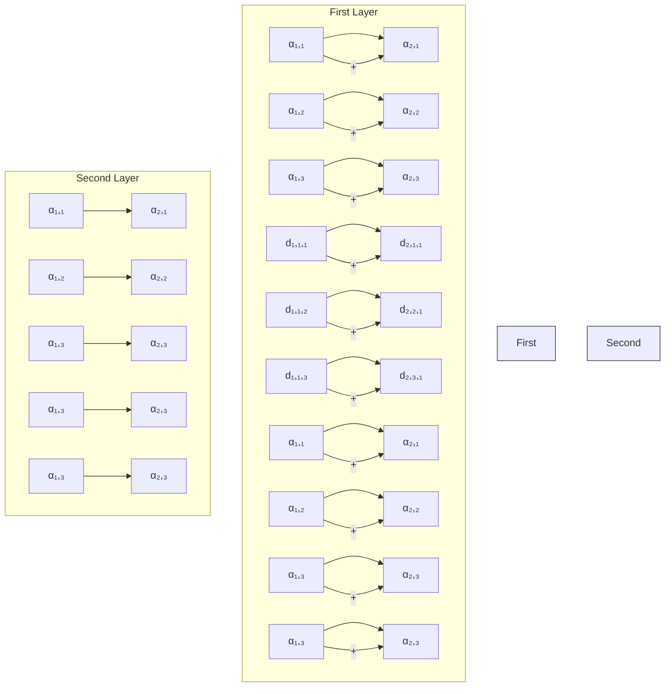

# Learning the sparse prior: Modern approaches

# Guan-Ju Peng

Institute of Data Science and Information Computing, National Chung Hsing University, Taichung, Taiwan

# Correspondence

Guan-Ju Peng, Institute of Data Science and Information Computing, National Chung Hsing University, Taichung, Taiwan.

Email: gjpeng@email.nchu.edu.tw

# Funding information

National Science and Technology Council, Grant/Award Numbers: 109-2115-M-005-007-MY2, 111-2115-M-005-005-MY2

Edited by: David Scott, Review Editor and Henry Lu, Commissioning Editor

# Abstract

The sparse prior has been widely adopted to establish data models for numerous applications. In this context, most of them are based on one of three foundational paradigms: the conventional sparse representation, the convolutional sparse representation, and the multi-layer convolutional sparse representation. When the data morphology has been adequately addressed, a sparse representation can be obtained by solving the sparse coding problem specified by the data model. This article presents a comprehensive overview of these three models and their corresponding sparse coding problems and demonstrates that they can be solved using convex and non-convex optimization approaches. When the data morphology is not known or cannot be analyzed, it must be learned from training data, thereby formulating dictionary learning problems. This article addresses two different dictionary learning paradigms. In an unsupervised scenario, dictionary learning involves the alternating or joint resolution of sparse coding and dictionary updating. Another option is to create a recurrent neural network by unrolling algorithms designed to solve sparse coding problems. These networks can then be used in a supervised learning setting to facilitate the training of dictionaries via forward-backward optimization. This article lists numerous applications in various domains and outlines several directions for future research related to the sparse prior.

This article is categorized under:

Statistical Learning and Exploratory Methods of the Data Sciences > Modeling Methods

Statistical and Graphical Methods of Data Analysis $>$ Modeling Methods and Algorithms

Statistical Models > Nonlinear Models

# KEYWORDS

algorithm unrolling, convex and non-convex optimization, convolutional sparse model, dictionary learning, multi-layer convolutional sparse model, recurrent neural network, sparse coding, sparse prior

# 1 | INTRODUCTION

The sparse prior has been widely adopted for the derivation of data representations when dealing with applications related to statistics, signal processing, and machine learning. Instances of these applications include image super-resolution (Deng & Dragotti, 2021; Dong et al., 2011; Gu et al., 2015; Yang et al., 2008), image de-noising (Aharon et al., 2006; Dabov et al., 2007; Donoho, 1995; Scetbon et al., 2021; Simon & Elad, 2019), image reconstruction (Bao et al., 2019; Liu et al., 2022; Yang, Li, et al., 2017), data classification (Chiou et al., 2023; He et al., 2011; Mei & Ling, 2011; Murdock et al., 2018; Sulam et al., 2020; Yang et al., 2011), visual tracking (Liu et al., 2011), financial trading (Deng et al., 2015), signal separation (Fadili et al., 2010; Peng, 2019; Peng & Hwang, 2014; Peyr'e et al., 2010; Starck et al., 2004; Starck et al., 2010), image in-painting (Gao et al., 2016; Peng, 2019; Xie et al., 2012; Zhang et al., 2023), data compression (Horev et al., 2012; Kalluri et al., 2019; Peng, 2020; Zhang et al., 2018), and more (Agarwal et al., 2016; Chang et al., 2018; Chen et al., 2023; Gao et al., 2013; Lee et al., 2009; Wang et al., 2015). The data modeling methods used in these applications are based on one of three fundamental paradigms: Conventional sparse representation, convolutional sparse representation, and multi-layer convolutional sparse representation. This article elucidates the derivation of these models and explains how they can be used to obtain adequate data representations for a variety of applications.

Any situation where the inherent structure of the target data can be dissected and cataloged within a designated dictionary can be cast as a sparse coding problem. These situations include the utilization of curvelets (Candes et al., 2006), wavelets (Mallat, 1998), or the basis of discrete cosine transform, which can be tailored to encapsulate specific morphological features, such as contours, point-wise smooth curves, or ripples. The coefficients that encapsulate this morphology are derived through the lens of sparse priors and the solutions are derived using either convex or non-convex optimization methods. In situations where the morphological characteristics of the data are too complex for conventional analysis, the dictionary must be learned from collected training data. This scenario involves a dictionary learning problem within an unsupervised learning framework. Recent advances in algorithm unrolling have been instrumental in adapting sparse coding to feed-forward recurrent neural networks (RNNs) to facilitate training of the network and corresponding dictionary via forward-backward optimization in the context of supervised learning.

The remainder of this article is organized as follows. Section 2 introduces the sparse coding problems related to the three types of sparse models. Section 3 reviews the convex and non-convex optimization methods used to solve these sparse coding problems. Section 4 provides experiments that evaluate the performances of sparse coding algorithms applied to the three sparse models. Section 5 outlines the dictionary learning methods used to derive the morphology of the signals from training data. Section 6 contains the experiments assessing the performances of dictionary learning algorithms. Section 7 outlines the use of algorithm unrolling for the transfer of sparse coding to a neural network to learn the data's morphology in situations conducive to supervised learning. Section 8 lists various applications adopting the sparse prior and gives a case study involving filling missing pixels to a corrupted image. Concluding remarks are drawn in Section 9.

# 2 | THE SPARSE CODING PROBLEMS

We first examine the intrinsic sparse coding derived from the Gaussian de-noising framework and the union of subspaces hypothesis. We then examine convolutional sparse coding, in which matrix multiplication operations are replaced with convolution operations. Finally, we examine multi-layer convolutional sparse coding, which is based on the idea that a dictionary can be decomposed into multiple layers analogous to the structure observed in convolutional neural networks.

# 2.1 | Conventional sparse coding

Given a perceived signal $\mathbf{y} \in \mathbb{R}^N$ , the derivation of de-noising paradigm is based on the assumption that the desired signal, $\mathbf{x}$ , can be derived by removing a portion of the noise $\varepsilon$ from $\mathbf{y}$ as follows:

$$
\mathbf {x} = \mathbf {y} - \epsilon , \tag {1}
$$

where $\epsilon$ presents a zero-mean Gaussian distribution, and the relationship between $\mathbf{x}$ and $\mathbf{y}$ can be described as follows:

$$
\operatorname{Prob} (\epsilon) = \operatorname{Prob} (\mathbf {y} - \mathbf {x}) \propto e ^ {- \frac {\| \mathbf {x} - \mathbf {y} \| ^ {2}}{\lambda}}, \tag {2}
$$

where $\| \cdot \|$ represents the $\ell_2$ norm of a vector or the Frobenius norm of a matrix. In this case, the most probable $\mathbf{x}$ suggests a trivial but useless solution $\mathbf{x} = \mathbf{y}$ , thereby necessitating an additional prior by which to model $\mathbf{x}$ . Given a matrix $\mathbf{D} \in \mathbb{R}^{N \times k}$ , the columns of which store the morphology we want to find in the desirable $\mathbf{x}$ , the intrinsic sparse prior assumes that $\mathbf{x}$ exists in a union of the subspaces derived from the column space of $\mathbf{D}$ . That is, the desired $\mathbf{x}$ belongs to the following set:

$$
\mathcal {U} = \{\mathbf {x} | \mathbf {x} = \mathbf {D} \alpha , \| \alpha \| _ {0} \leq c \}, \tag {3}
$$

where $\|\cdot\|_{0}$ counts the non-zero elements of the input vector/matrix. When the matrix D (hereafter referred to as a dictionary) is known and kept unaltered, the aim of the intrinsic sparse coding problem is to find the projection of received y on set U to be formulated as follows:

$$
\arg \min _ {\mathbf {x}} \| \mathbf {y} - \mathbf {x} \| ^ {2}, \tag {4}
$$

$$
\begin{array}{l l} \text { s   .   t   . } & \mathbf {x} \in \mathcal {U}. \end{array}
$$

Figure 1 is used to illustrate the concept of the above optimization problem. In the example, $c$ is set at 4 and $\mathbf{D}$ has 7 elements; therefore the objective is to derive a vector $\alpha$ in $\mathbb{R}^7$ with at most 4 non-zero such that the difference between $\mathbf{x} = \mathbf{D}\alpha$ and $\mathbf{y}$ is minimized. Note however that the computational complexity of this problem is NP-hard (Natarajan, 1995), which requires a greedy algorithm to derive an approximate solution (Chen & Wigger, 1995; Pati et al., 1993; Sturm & Christensen, 2012).

Since the probability model of $\mathbf{x}$ is not considered in the intrinsic sparse coding, it can be addressed using the following exponential distribution:

$$
\operatorname{Prob} (\mathbf {x}) = e ^ {- \| \alpha \| _ {0}}, \tag {5}
$$

Thus the principle of Maximum A Posteriori (MAP) is used to relate the de-noising settings and the sparse prior as follows:

$$
\operatorname{Prob} (\mathbf {x} | \mathbf {y}) \propto \operatorname{Prob} (\mathbf {y} | \mathbf {x}) \operatorname{Prob} (\mathbf {x})
$$

$$
\propto e ^ {- \frac {\| \mathbf {y} - \mathbf {x} \| ^ {2}}{\lambda}} e ^ {- \| \boldsymbol {\alpha} \| _ {0}} = e ^ {- \left[ \frac {\| \mathbf {y} - \mathbf {x} \| ^ {2}}{\lambda} + \| \boldsymbol {\alpha} \| _ {0} \right]}. \tag {6}
$$

text_image

y ~ x = {d₁ d₂ d₃ d₄ d₅ d₆ d₇} {α₁
0
α₃
0
0
α₆
α₇}
argmin_x ||y - x||, x ∈ U
u = {d₁ d₂ d₃ d₄ d₅ d₆ d₇} {α₁
α₂
α₃
α₄
0
0
0
0}
... {α₁
0
α₃
0
0
α₆
α₇} ... {0
0
0
α₅
α₅
α₆
α₇}

FIGURE 1 An example of intrinsic sparse coding problem with c=4 and $\alpha\inR^{7}$ .

Based on these hypotheses, given a perceived signal $\mathbf{y}$ , the most probable $\mathbf{x}$ can be obtained by solving the following non-convex sparse coding problem:

$$
\underset {\mathbf {x}} {\arg \max} \operatorname{Prob} (\mathbf {x} | \mathbf {y}) = \mathbf {D} \left\{\underset {\boldsymbol {\alpha}} {\arg \min} \| \mathbf {y} - \mathbf {D} \boldsymbol {\alpha} \| ^ {2} + \lambda \| \boldsymbol {\alpha} \| _ {0} \right\}. \tag {7}
$$

When the counting norm $\ell_0$ is relaxed with its convex surrogate (i.e., the $\ell_1$ norm), sparse coding becomes the classical LASSO problem (Tibshirani, 1996) as follows:

$$
\underset {\boldsymbol {\alpha}} {\arg \min} \| \mathbf {y} - \mathbf {D} \boldsymbol {\alpha} \| ^ {2} + \lambda \| \boldsymbol {\alpha} \| _ {1}. \tag {8}
$$

The $\ell_0$ norm counts the number of non-zero elements in $\alpha$ , while the $\ell_1$ norm calculates the sum of its magnitudes. Thus, minimizing any of them promotes the sparsity of $\alpha$ . An example illustrating the calculations of $\ell_0$ and $\ell_1$ is given in Figure 2.

Since both $\|y-D\alpha\|^{2}$ and $\|\alpha\|_{1}$ are convex with respect to $\alpha$ , the LASSO problem has a unique solution, which can be obtained via convex optimization. Considerable effort has gone into determining the conditions under which a derived solution could also be used to solve the non-convex problem in Equation (7). Essentially, the two problems result in the identical global optima only when the columns in D are of low similarity (i.e., low mutual coherence) and the number of non-zero elements in the global optima does not exceed a given threshold (Candès & Tao, 2005; Donoho & Elad, 2003). These conditions can be satisfied by adopting an orthogonal dictionary; however, in real-world applications, this is seldom possible even when the dictionary is learned from training data.

The primary advantage of using Equation (8) instead of (7) is the issue of convexity; however, the use of Equation (8) can result in non-sparse $\alpha$ , which can be considered the result of overfitting to the union of subspaces model. Evidence in Bao et al. (2016), Yang, Pong, and Chen (2017), Peng (2019), Peng (2020) indicates that in various applications, the adoption of non-convex constraints results in performance exceeding their convex relaxations.

# 2.2 | Convolutional sparse coding

The matrix multiplications of $\mathbf{y} \sim \mathbf{x} = \mathbf{D}\alpha$ utilized by the conventional sparse models in Equations (7) and (8) require the length of $\mathbf{y}$ matches the elements in $\mathbf{D}$ . As shown in Figure 1, the length of $\mathbf{y}$ must be the same as that of each $\mathbf{d}_i$ . However, when dealing with applications that involve multi-scale signals (e.g., images of varying sizes and audio clips of varying lengths), such limitation necessitates the resizing or partitioning of signals to ensure alignment with the dimensions of columns in $\mathbf{D}$ . Those operations can potentially disrupt the inherent structure of the signal, thereby undermining the benefits of employing sparse priors in the development of data models. Furthermore, maintaining the same morphology across diverse scales or positions within this context necessitates an increase in the number of column vectors in $\mathbf{D}$ , which imposes considerable computational overhead when using optimization methods to deal with the problem of sparse coding.

When considering these issues, convolutional sparse coding (CSC) appears to be an attractive alternative to conventional sparse coding (Bristow et al., 2013; Chalasani et al., 2013). This process replaces the matrix multiplication in Equations (7) and (8) with convolution, and $\mathbf{x}$ is modeled using a sum over a set of sub-signals. Let $\mathcal{D} = \{\mathbf{d}_1,\dots,\mathbf{d}_m\}$ be a

$$
\boldsymbol {\alpha} = \left( \begin{array}{c} \framebox {- 1} \\ \framebox {0} \\ \framebox {2} \\ \framebox {0} \\ \framebox {0} \\ \framebox {- 3} \\ \framebox {4} \end{array} \right) \quad \begin{array}{l} \longrightarrow \| \boldsymbol {\alpha} \| _ {\mathbf {0}} = \sum_ {i} 1 (\alpha_ {i} \neq 0) = 4 \\ \longrightarrow \| \boldsymbol {\alpha} \| _ {\mathbf {1}} = \sum_ {i} | \alpha_ {i} | = 1 0 \end{array}
$$

FIGURE 2 An example of calculating the $\ell_0$ and the $\ell_1$ norms of a vector.

set of m dictionary elements and use \* to denote the convolution operators, such that the CSC problem can be defined as follows:

$$
\underset {\{\alpha_ {m} \}} {\arg \min} \frac {1}{2} \| \sum_ {m} \mathbf {d} _ {m} ^ {*} \boldsymbol {\alpha} _ {m} - \mathbf {y} \| ^ {2} + \lambda \sum_ {m} \Omega (\boldsymbol {\alpha} _ {m}), \tag {9}
$$

where $\alpha_{m}$ is a coefficient map with respect to the $m$ -th dictionary element, and $\Omega$ denotes the $\ell_0$ or the $\ell_1$ function. The fact that the shapes of any given $\mathbf{d}_m$ and $\mathbf{y}$ are mutually exclusive makes the CSC an ideal model to represent the morphology of any data involving multi-scale signals (Chang et al., 2017; Liu et al., 2022).

As shown in Figure 3, the convolution operator can be converted to a matrix multiplication, where the dictionary elements in $\mathcal{D}$ are used to construct a concatenated Toeplitz matrix. One convolutional dictionary can be used to build different Toeplitz matrices to adapt to multi-scale signals. Furthermore, the elements in $\mathcal{D}$ can have variable lengths to fetch the signal's structures at different scales.

Ensuring algorithmic efficiency in solving Equation (9) requires that the convolution be calculated in the Fourier domain (Moreau & Gramfort, 2022; Peng, 2019; Peng, 2020; Wohlberg, 2016). Thus, we reformulate Equation (9) as follows:

$$
\underset {\{\alpha_ {m} \}} {\arg \min} \frac {1}{2} \| \widehat {\mathbf {y}} - \sum_ {m} \widehat {\mathbf {d}} _ {m} \bigodot \widehat {\boldsymbol {\alpha}} _ {m} \| _ {F} ^ {2} + \sum_ {m} (\Omega + \Gamma_ {\mathcal {C} _ {\alpha}}) \circ \Phi^ {- 1} (\widehat {\boldsymbol {\alpha}} _ {m}), \tag {10}
$$

where $\odot$ refers to the Hadamard product, $\Phi^{-1}$ refers to the inverse Fourier transform, and $\widehat{\mathbf{y}}_l$ , $\widehat{\mathbf{d}}_m$ , and $\widehat{\alpha}_{l,m}$ respectively denote the Fourier responses of $\mathbf{y}_l$ , $\mathbf{d}_m$ , and $\alpha_{l,m}$ . We assume that equivalence between the convolution in the Fourier domain and the convolution in the spatial domain can be ensured by inserting positions with padded zeros into $\mathbf{y}_l$ , $\mathbf{d}_m$ , and $\alpha_{l,m}$ . Using $\mathbf{P}_{\alpha}$ to perform zero-padding for the elements in $\{\alpha_{l,m}\}$ imposes an additional constraint $\Gamma_{\mathcal{C}_{\alpha}}$ , where $\mathcal{C}_{\alpha}$ is defined as follows:

$$
\mathcal {C} _ {\boldsymbol {\alpha}} = \left\{\boldsymbol {\alpha}: \left(\mathbf {I} - \mathbf {P} _ {\boldsymbol {\alpha}} \mathbf {P} _ {\boldsymbol {\alpha}} ^ {\top}\right) \boldsymbol {\alpha} = \mathbf {0} \right\}. \tag {11}
$$

Note that $\Gamma_{\mathcal{C}_{\alpha}}$ should be added to Equation (10) to preserve the positions of zero-padding throughout the optimization procedure.

The CSC model is adopted in a number of applications, such as piano transcription (Cogliati et al., 2017), rain streak removal (Zhang & Patel, 2017), music source separation (Jao et al., 2016), radar signal analysis (Liu & Chen, 2017;

$$
\left[ \begin{array}{c} \mathbf {y} \\ \mathbf {x} \\ \mathbf {d} _ {1} \\ \mathbf {d} _ {2} \\ \mathbf {d} _ {3} \\ \alpha_ {1} \\ \alpha_ {2} \\ \alpha_ {3} \\ \end{array} \right] = \sum_ {m} \mathbf {d} _ {m} * \alpha_ {m}
$$

FIGURE 3 Representing the convolution operator involving 3 dictionary elements using a matrix multiplication with a concatenated Toeplitz matrix.

Tivive et al., 2017), image classification (Chen et al., 2016), and image separation (Peng, 2019; Peng, 2020). The advantage of allowing the dictionary elements to have different shapes over using a single matrix dictionary is demonstrated in the improved performances of image reconstruction (Liu et al., 2022) and some biomedical applications (Chang et al., 2017).

# 2.3 | Multi-layer convolutional sparse coding

The multi-layer structures adopted for deep learning have inspired a number of researchers to expand the use of the sparse prior from single-layer CSCs to multi-layer settings (Aberdam et al., 2019; Murdock et al., 2018; Papyan, Romano, & Elad, 2017; Sulam et al., 2020). Briefly, let us consider a two-layer structure. In the first layer, input signal y is approximated as follows:

$$
\mathbf {y} \sim \sum_ {m _ {1}} \mathbf {d} _ {1, 1, m _ {1}} ^ {*} \boldsymbol {\alpha} _ {1, m _ {1}}, \tag {12}
$$

where each dictionary element and coefficient map is respectively indexed as follows:

$$
\mathbf {d} _ {\text { layer }, \text { chn\_out }, \text { chn\_in }} \text { and } \boldsymbol {\alpha} _ {\text { layer }, \text { chn\_in }}.
$$

Considering that target y comprises only 1 channel, the index of the output channel (denoted as chn\_out) is set at 1. The dictionary element and a coefficient with the value of chn\_in are convolved to derive the subcomponent of y. In the second layer, a similar derivation can be applied to approximate each coefficient in the first layer, as follows:

$$
\boldsymbol {\alpha} _ {1, m _ {1}} \sim \sum_ {m _ {2}} \mathbf {d} _ {2, m _ {1}, m _ {2}} ^ {*} \boldsymbol {\alpha} _ {2, m _ {2}}. \tag {13}
$$

Figure 4 demonstrates an example of a two-layer convolutional sparse representation. In the first layer, the sum of three convolutions is used to approximate the input signal, and each convolution is calculated with a dictionary element and its coefficient map. Then, in the second layer, a set of coefficient maps is convolved with different dictionary elements, and the resulting three sums of the convolutions are used to approximate the coefficient maps of the first layer.

flowchart

FIGURE 4 A two-layer example of multi-layer convolutional sparse representation.

To simplify the notation, we designate that set $\mathcal{D}_l$ includes all of the dictionary elements in the $l$ -th layer, while set $\alpha_l$ includes all of the coefficients in the $l$ -th layer. We use the operator to represent the calculation in Equations (12) and (13) as follows:

$$
\mathbf {y} \sim \sum_ {m _ {1}} \mathbf {d} _ {1, 1, m _ {1}} ^ {*} \boldsymbol {\alpha} _ {1, m _ {1}} = \mathcal {D} _ {1} \circledast \boldsymbol {\alpha} _ {l}, \tag {14}
$$

$$
\{\boldsymbol {\alpha} _ {1, m _ {1}} \} \sim \left\{\sum_ {m _ {2}} \mathbf {d} _ {2, m _ {1}, m _ {2}} ^ {*} \boldsymbol {\alpha} _ {2, m _ {2}} \right\} = \mathcal {D} _ {2} \circledast \boldsymbol {\alpha} _ {2}. \tag {15}
$$

This makes it possible to formulate a multi-layer convolutional sparse coding (ML-CSC) problem as follows:

$$
\underset {\{\alpha_ {l} \}, \{\alpha_ {2} \}} {\arg \min} \frac {1}{2} \| \mathcal {D} _ {1} * \boldsymbol {\alpha} _ {1} - \mathbf {y} \| ^ {2} + \lambda [ \Omega (\boldsymbol {\alpha} _ {1}) + \Omega (\boldsymbol {\alpha} _ {2}) ], \tag {16}
$$

$$
\text { s.t. } \quad \boldsymbol {\alpha} _ {1} = \mathcal {D} _ {2} \circledast \boldsymbol {\alpha} _ {2}.
$$

The ML-CSC model has been used in image denoising, restoration, and classification applications (Aberdam et al., 2019; Papyan, Romano, & Elad, 2017; Papyan, Sulam, & Elad, 2017; Sulam et al., 2020).

# 3 | OPTIMIZATION METHODS FOR SPARSE CODING

In this section, we examine the optimization methods used to solve sparse coding problems. We first examine a greedy algorithm referred to as matching pursuit, which can be used to resolve the intrinsic sparse coding in Equation (4). We then review several convex optimization algorithms used to address problems involving the $\ell_{1}$ constraint. We also discuss the conditions that are required for these algorithms to achieve convergence when dealing with a non-convex counting norm.

# 3.1 | Matching pursuit

The Matching Pursuit algorithm (see Algorithm 1) is representative of the greedy approach used to obtaining an approximate solution to NP-hard problems, such as that in Equation (4) (Chen & Wigger, 1995; Natarajan, 1995; Pati et al., 1993). As shown in Figure 5, each iteration involves three distinct steps: (1) Identify the dictionary element with the greatest similarity to the residual signal; (2) Calculate the coefficient associated with the selected dictionary element based on the degree of similarity to the residual signal; and (3) Update the residual signal.

Algorithm 1 Matching pursuit for intrinsic sparse coding   
Require: Initial dictionary, D; initial coefficients, $\alpha = \overrightarrow{0}$ ; signal, y; threshold, $\delta$ ;   
Ensure: Coefficients, $\alpha$ ;

1: $\mathbf{r} \leftarrow \mathbf{x}$ 2: for $t = 1$ to $c$ do

3: $i \leftarrow \arg \max_{i} |\mathbf{r}^{\top} \mathbf{D}[i]|$ , where $\mathbf{D}[i]$ denotes the $i$ -th column vector of matrix $\mathbf{D}$ .

4: $\alpha[i] \leftarrow \mathbf{r}^{\top} \mathbf{D}[i]$ , where $\alpha[i]$ is the $i$ -th coefficient in the vector $\alpha$ .

5: $\mathbf{r} \leftarrow \mathbf{r} - \alpha[i] \mathbf{D}[i]$ .

6: end for

7: return $\alpha$

The computational complexity of the matching pursuit algorithm is $\mathcal{O}(ckN)$ (i.e., $\mathbf{D} \in \mathbb{R}^{N \times k}$ and $\| \boldsymbol{\alpha} \|_0 \leq c$ ). A number of matching pursuit variations that take into account the time-space trade-off are discussed in Sturm and Christensen (2012). Other algorithms based on a strategy similar to that of matching pursuit have been developed to solve the CSC (Equation (9)) and ML-CSC (Equation (16)). Those methods are discussed in Szlam et al. (2010), Barthélemy et al. (2012), Plaut and Giryes (2018) and Aberdam et al. (2019).

# 3.2 | Proximal gradient methods

The objective in the proximal gradient methods is to solve an optimization problem in the following form:

$$
\underset {\mathbf {u}} {\arg \min} f (\mathbf {u}) + g (\mathbf {u}), \tag {17}
$$

where function $f$ is convex $C^1$ with global Lipschitz constant $L_f$ and a Lipschitz continuous gradient, whereas function $g$ is convex proper closed. To solve the problem in Equation (17), we consider sequence $\{\mathbf{u}^t\}$ generated using Algorithm 2, where the objective in selecting a descent parameter is to satisfy $\eta < \frac{1}{L_f}$ , and prox denotes the proximal mapping defined as follows:

$$
\operatorname{prox} _ {\eta g} (\mathbf {u}) = \arg \min _ {\mathbf {v}} \frac {1}{2} \| \mathbf {u} - \mathbf {v} \| ^ {2} + \eta g (\mathbf {v}). \tag {18}
$$

text_image

r ← r - (r · D[1])D[1]
Updating
r ← r - (r · D[1])D[1]
D[5]
D[4]
D[1]
D[2]
D[3]
D[5]
D[4]
D[2]

FIGURE 5 Residual updating of matching pursuit. In the example, the $\mathbf{D}[1]$ is the most similar dictionary element to the residual signal $\mathbf{r}$ . Therefore, $\alpha[1]$ is set to be $(\mathbf{r} \cdot \mathbf{D}[1])$ , and the composition of $\mathbf{D}[1]$ is removed from $\mathbf{r}$ by letting $\mathbf{r} \leftarrow \mathbf{r} - \alpha[1]\mathbf{D}[1]$ .

# Algorithm 2 Proximal gradient

Require: Initial variable, $\mathbf{u}^0$ ; descent parameter, $\eta < \frac{1}{L_f}$ ; smooth function, $f$ ; non-smooth function, $g$ ;

Ensure: Sequence, $\{u^{t}\}$ ;

1: for t = 1 to T do   
2: $\mathbf{u}^{t + 1}\gets \mathrm{prox}_{\eta g}(\mathbf{u}^t -\eta \nabla f(\mathbf{u}^t)).$   
3: end for   
4: return $\{\mathbf{u}^t\}$

The convergence rate of Algorithm 2 is $\mathcal{O}\left(\frac{1}{t}\right)$ , such that the distance between the $t$ -th intermediate $\mathbf{u}^t$ and the global optimal $\mathbf{u}^*$ is bounded by the following inequality:

$$
(f + g) (\mathbf {u} ^ {t}) - (f + g) (\mathbf {u} ^ {\star}) \leq \frac {\rho}{t}, \tag {19}
$$

where $\rho$ is the constant determined by the initial point $\mathbf{u}^0$ . The analysis in Beck and Teboulle (2009) demonstrates that the convergence of the fast proximal gradient method in Algorithm 3 can be reduced to $\mathcal{O}\left(\frac{1}{t^2}\right)$ without altering the computational complexity.

A large Lipschitz constant $L_{f}$ could lead to a situation where convergence depends on a small descent parameter $\eta$ , thereby reducing the speed to achieve the convergence. To deal with this situation, we consider the (fast) proximal gradient method with backtracking (Algorithms 4 and 5), where $\eta_{t}$ (referring to the descent parameter in the t-th iteration) can be larger than $\frac{1}{L_{f}}$ and reduced until the following descent lemma is satisfied:

$$
f \left(\mathbf {u} ^ {t + 1}\right) \leq f \left(\mathbf {u} ^ {t}\right) + \left\langle \nabla f \left(\mathbf {u} ^ {t}\right), \mathbf {u} ^ {t + 1} - \mathbf {u} ^ {t} \right\rangle + \frac {1}{2 \eta} \| \mathbf {u} ^ {t + 1} - \mathbf {u} ^ {t} \| ^ {2}. \tag {20}
$$

# 3.2.1 | Using proximal gradient methods to solve convex sparse coding problems

If the $\ell_1$ norm is used as the sparsity inducing function, then the lasso problem can be solved using any of these proximal gradient methods by letting $\mathbf{u} = \alpha$ and decomposing the objective Equation (8) into $f = \| \mathbf{y} - \mathbf{D}\alpha\|^2$ and $g = \lambda \| \alpha \|_1$ . In this case, the proximal mapping of $\eta g$ is calculated in accordance with soft-thresholding (Bach et al., 2012), as follows:

$$
\operatorname{prox} _ {\eta \lambda \| \cdot \| _ {1}} (\mathbf {u}) [ i ] = \left( \begin{array}{l l} \mathbf {u} [ i ] + \eta \lambda , & \text { if } \mathbf {u} [ i ] <   - \eta \lambda , \\ \mathbf {u} [ i ] - \eta \lambda , & \text { if } \mathbf {u} [ i ] > \eta \lambda , \\ 0, & \text { otherwise }. \end{array} \right.
$$

Similar decomposition can be applied to the objective in of the CSC in Equation (9). Let $\mathbf{u} = \{\alpha_{m}\}$ , $f = \frac{1}{2} \| \sum_{m} \mathbf{d}_{m}^{*} \boldsymbol{\alpha}_{m} - \mathbf{y} \|^{2}$ and $g = \lambda \sum_{m} \| \boldsymbol{\alpha}_{m} \|_{1}$ , such that the convex CSC problem can be solved using the proximal gradient method (Bristow et al., 2013; Bristow & Lucey, 2014; Chalasani et al., 2013; Chang et al., 2017). Peng (2020) solved the Fourier-domain CSC in Equation (10) using Algorithm 4 by respectively letting $\mathbf{u} = \{\widehat{\boldsymbol{\alpha}}_{m}\}$ , $f = \frac{1}{2} \| \widehat{\mathbf{y}} - \sum_{m} \widehat{\mathbf{d}}_{m} \odot \widehat{\boldsymbol{\alpha}}_{m} \|^{2}$ and $g = \sum_{m} (\Omega + \Gamma_{\mathcal{C}_{\alpha}}) \circ \Phi^{-1}(\widehat{\boldsymbol{\alpha}}_{m})$ . Specifically, the proximal mapping of $\Omega + \Gamma_{\mathcal{C}_{\alpha}}$ forcibly changes the values at the padded positions of $\Phi^{-1}(\widehat{\boldsymbol{\alpha}}_{m})$ into zeros and then performs soft-thresholding on the values in the remaining positions.

# Algorithm 3 Fast proximal gradient

Require: Initial variable, $\mathbf{u}^0$ ; descent parameter, $\eta < \frac{1}{L_f}$ ; smooth function, $f$ ; non-smooth function, $g$ ;

Ensure: Sequence, $\{\mathbf{u}^t\}$ ;

1: $v^{1} \leftarrow u^{0}$ .   
2: $q^{1} = 1$ .   
3: for $t = 1$ to $T$ do   
4: $\mathbf{u}^t \leftarrow \text{prox}_{\eta g} (\mathbf{v}^t - \eta \nabla f(\mathbf{v}^t)).$   
5: $q^{t+1} \leftarrow \frac{1 + \sqrt[n]{1 + 4(q^{t})^{2}}}{2}.$   
6: $\mathbf{v}^{t + 1}\gets \mathbf{u}^t +\frac{\tilde{q}^t - 1}{q^{t + 1}} (\mathbf{u}^t -\mathbf{u}^{t - 1}).$   
7: end for   
8: return $\{\mathbf{u}^t\}$

Algorithm 4 Proximal gradient with backtracking   
Require: Initial variable, $\mathbf{u}^0$ ; descent parameter, $\eta$ ; smooth function, $f$ ; non-smooth function, $g$ ;   
Ensure: Sequence, $\{u^{t}\}$ ;   
1: for t=1 to T do
2: $\eta_{t}\leftarrow\eta$ 3: repeat
4: $\mathbf{u}^{t+1}\leftarrow\operatorname{prox}_{\eta g}(\mathbf{u}^{t}-\eta\nabla f(\mathbf{u}^{t}))$ .
5: Reduce the value of $\eta_{t}$ .
6: until Equation (20) is satisfied.
7: end for
8: return $\{u^{t}\}$

Algorithm 5 Fast proximal gradient with backtracking   
Require: Initial variable, $\mathbf{u}^0$ ; descent parameter, $\eta$ ; smooth function, $f$ ; non-smooth function, $g$ ;   
Ensure: Sequence, $\{u^{t}\}$ ;
1: $v^{1} \leftarrow u^{0}$ .
2: $q^{1} = 1$ .
3: for t = 1 to T do
4: $\eta_{t} \leftarrow \eta$ .
5: repeat
6: $\mathbf{u}^{t} \leftarrow \text{prox}_{\eta g}(\mathbf{v}^{t} - \eta_{t} \nabla f(\mathbf{v}^{t}))$ .
7: $q^{t+1} \leftarrow \frac{1 + \sqrt{1 + 4(q^{t})^{2}}}{2}$ .
8: $\mathbf{v}^{t+1} \leftarrow \mathbf{u}^{t} + \frac{q^{t}-1}{q^{t+1}} (\mathbf{u}^{t} - \mathbf{u}^{t-1})$ .
9: Reduce the value of $\eta_{t}$ .
10: until Equation (20) is satisfied.

11: end for
12: return {u $^{t}$ }

Sulam et al. (2020) sought to enhance efficiency in solving the ML-CSC problem by substituting $\alpha_{1}$ with $D_{2} \otimes \alpha_{2}$ in Equation (16) to obtain the following:

$$
\underset {\{\alpha_ {2} \}} {\arg \min} \frac {1}{2} \| \mathcal {D} _ {1} \circledast \mathcal {D} _ {2} \circledast \boldsymbol {\alpha} _ {2} - \mathbf {y} \| ^ {2} + \lambda [ \| \mathcal {D} _ {2} \circledast \boldsymbol {\alpha} _ {2} \| _ {1} + \| \boldsymbol {\alpha} _ {2} \| _ {1} ]. \tag {21}
$$

In that study, they assumed that $f = \frac{1}{2} \| \mathcal{D}_1 \otimes \mathcal{D}_2 \otimes \boldsymbol{\alpha}_2 - \mathbf{y} \|^2$ and $g = \lambda [\Omega(\mathcal{D}_2 \otimes \boldsymbol{\alpha}_2) + \Omega(\boldsymbol{\alpha}_2)]$ and elaborated updating step $\boldsymbol{\alpha}_2^{t+1} \leftarrow \text{prox}_{\eta g} (\boldsymbol{\alpha}_2^t - \eta_t \nabla f(\boldsymbol{\alpha}_2^t))$ as follows:

$$
\boldsymbol {\alpha} _ {1} ^ {t} \leftarrow \mathcal {D} _ {2} \circledast \boldsymbol {\alpha} _ {2} ^ {t},
$$

$$
\boldsymbol {\alpha} _ {1} ^ {t + 1} \leftarrow \operatorname{prox} _ {\eta \lambda \| \cdot \| _ {1}} \left(\boldsymbol {\alpha} _ {1} ^ {t} - \frac {\partial f}{\partial \boldsymbol {\alpha} _ {1}} \left(\boldsymbol {\alpha} _ {1} ^ {t}\right)\right), \tag {22}
$$

$$
\boldsymbol {\alpha} _ {2} ^ {t + 1} \leftarrow \operatorname{prox} _ {\eta \lambda \| \cdot \| _ {1}} \left(\boldsymbol {\alpha} _ {2} ^ {t} - \eta \nabla f \left(\boldsymbol {\alpha} _ {2} ^ {t}\right)\right),
$$

where $\alpha_{1}=D_{2}\circledast\alpha_{2}$ is an auxiliary variable.

# 3.2.2 | Using proximal gradient methods to solve non-convex sparse coding problems

When the non-convex $\ell_0$ norm is adopted as the sparsity inducing function, the resulting proximal mapping of $\eta \lambda \| \cdot \|_0$ involves hard-thresholding, as follows:

$$
\operatorname{prox} _ {\eta \lambda \| \cdot \| _ {0}} (\mathbf {u}) [ i ] = \left( \begin{array}{l l} \mathbf {u} [ i ] & \text { if } | \mathbf {u} [ i ] | > \sqrt {2 \eta \lambda} \\ \{\mathbf {u} [ i ], 0 \} & \text { if } | \mathbf {u} [ i ] | = \sqrt {2 \eta \lambda} \\ 0 & \text { otherwise. } \end{array} \right)
$$

Note however that because $g = \lambda \| \cdot \|_0$ is not convex, there is no guarantee that sequence $u^t$ generated using the proximal gradient approach will achieve convergence to the global optima. By contrast, when $\mathbf{u}^t$ is generated using Algorithm 2 or 4, convergence and optimality can be achieved using the methods outlined in Attouch et al. (2013), as follows:

1. $\{u^{t}\}$ converges to a critical point of $f + g$ ,   
2. $\{u^{t}\}$ is of a finite length; that is,

$$
\sum_ {t = 1} ^ {\infty} \left\| \mathbf {u} ^ {t + 1} - \mathbf {u} ^ {t} \right\| <   \infty . \tag {23}
$$

Further details pertaining to the application of proximal gradient methods to sparse coding and convolutional sparse coding within the $\ell_0$ constraint can be found in Bao et al. (2016) and Peng (2020), respectively.

# 3.3 | Alternating direction method of multiplier

The Alternating Direction Method of Multiplier (ADMM) scheme in Algorithm 6 is meant to resolve the following problem:

$$
\arg \min _ {\mathbf {u} \in \mathbb {N}} f (\mathbf {u}) + g (\mathbf {v})
$$

$$
\begin{array}{l} \mathbf {u}, \mathbf {v} \\ \text {s.t.} \quad \mathbf {v} = \mathbf {T u}, \end{array} \tag {24}
$$

where $\mathbf{T}$ is a linear mapping from the domain of $\mathbf{u}$ to that of $\mathbf{v}$ . The algorithm converges to the global optima at the rate $\mathcal{O}\left(\frac{1}{k}\right)$ when functions $f$ and $g$ are proper closed convex, which makes it possible to solve the LASSO problem by respectively designating the following: $\mathbf{T} = \mathbf{I}, \mathbf{v} = \mathbf{u} = \boldsymbol{\alpha}, f(\mathbf{u}) = \| \mathbf{y} - \mathbf{D}\mathbf{u} \|^2$ , and $g(\mathbf{v}) = \lambda \| \mathbf{v} \|_1$ (Parikh et al., 2014).

Algorithm 6 Alternating Direction Method of Multiplier for convex objective

Require: Initial variable, $u^{0}$ ; initial auxiliary variable, $c^{0}$ ; parameter, $\rho$ ; smooth function, f; non-smooth function, g;

Ensure: Sequence, $\{\mathbf{v}^t\}$ ;

1: $t \gets 0$ .   
2: repeat   
3: $\mathbf{u}^{t + 1}\gets \arg \min_{\mathbf{u}}f(\mathbf{u}) + \frac{\rho}{2}\| \mathbf{T}\mathbf{u} - \mathbf{v}^t +\mathbf{c}^t\| ^2.$   
4: $\mathbf{v}^{t + 1}\gets \arg \min_{\mathbf{v}}g(\mathbf{v}) + \frac{\rho}{2}\| \mathbf{T}\mathbf{u}^{t + 1} + \mathbf{c}^t -\mathbf{v}\| ^2.$   
5: $c^{t+1}=Tu^{t+1}-v^{t+1}+c^{t}.$   
6: until $\mathbf{v}^t = \mathbf{T}\mathbf{u}^t$   
7: return $\{\mathbf{v}^t\}$

In Wohlberg (2016) and Veshki and Vorobyov (2022), ADMM is used to solve the convolutional sparse coding in Equation (10) in its distributed form, by designating the following: $\{\mathbf{u}_m\} = \{\mathbf{v}_m\} = \{\widehat{\alpha}_m\}, f = \frac{1}{2}\| \widehat{\mathbf{y}} -\sum_m\widehat{\mathbf{d}}_m\odot \mathbf{u}_m\|^2$ and $g = \sum_{m}\| \Phi^{-1}(\mathbf{v}_{m})\|_{1} + \sum_{m}\Gamma_{\mathcal{C}_{\alpha}}\circ \Phi^{-1}(\mathbf{v}_{m})$ . In the ADMM process, we know that $\mathbf{u}^{t + 1}$ can be updated via gradient descent because $f$ is differentiable, and updating $\mathbf{v}^{t + 1}$ can be rewritten as the proximal mapping of $\ell_1$ function, which can be calculated via soft-thresholding.

When the non-convex $\ell_0$ norm is used to induce sparsity, it is important to select a suitable initial variable and adjust $\rho$ in each iteration to ensure the stability and convergence that are made possible by the use of ADMM to solve sparse coding problems (Li & Pong, 2015; Peng, 2019). The initial variable should be the solution to $f + \widetilde{g}$ , where $\widetilde{g}$ is the convex surrogate of $g$ . In sparse coding, $g$ and $\widetilde{g}$ respectively indicate the $\ell_0$ and $\ell_1$ function. In the $t$ -th iteration of ADMM, parameter $\rho_t$ should be adjusted to adapt the local curvature of $f$ to the following equation:

$$
\min \left\{2 \frac {\sqrt {\| \nabla f (\mathbf {u} ^ {t}) - \nabla f (\mathbf {u} ^ {t - 1}) \| _ {F} ^ {2}}}{\sqrt {\| \mathbf {u} ^ {t} - \mathbf {u} ^ {t - 1} \| _ {F} ^ {2}}}, 2 \| \nabla^ {2} f \| _ {F} \right\}. \tag {25}
$$

Algorithm 7 shows the adaptive ADMM (AADMM) used to solve Equation (24) involving non-convex $f$ and $g$ under the assumption that $\mathbf{T} = \mathbf{I}$ (Peng, 2019). Sequence $\{\mathbf{u}^t, \mathbf{v}^t, \mathbf{c}^t\}$ generated using AADMM has the following convergence properties:

1. (Global convergence of $\{(\mathbf{u}^t, \mathbf{v}^t, \mathbf{c}^t)\}$ ) Sequence $\{(\mathbf{u}^t, \mathbf{v}^t, \mathbf{c}^t)\}$ is of finite length and converges to a cluster point $(\mathbf{u}^*, \mathbf{v}^*, \mathbf{c}^*)$

$$
\sum_ {t = 1} ^ {\infty} \left\| \mathbf {u} ^ {t + 1} - \mathbf {u} ^ {t} \right\| <   \infty . \tag {26}
$$

2. (Strict improvement in objective values) The $\mathbf{u}^{*}$ of the cluster point satisfies $(f + g)(\mathbf{u}^{*}) < (f + g)(\mathbf{u}^{0})$ .

# Algorithm 7 Adaptive ADMM for the non-convex objective

Require: Initial variable, $\mathbf{u}^0$ ; initial auxiliary variable, $\mathbf{c}^0$ ; parameter, $\rho_0$ ; smooth function, $f$ ; non-smooth function, $g$ ;

Ensure: Sequence, $\{v^{t}\}$ ;

1: Derive $\mathbf{u}^1$ by solving the convex surrogate of the objective (i.e., replacing the $\ell_0$ with the $\ell_1$ function in the objective).   
2: $v^{1} \leftarrow u^{1}$ .   
3: $\mathbf{c}^{1} \leftarrow \nabla f(\mathbf{u}^{1})$ .   
4: $t \leftarrow 1$ .   
5: repeat   
6: if t < 2 then $\rho_{t} \leftarrow \rho_{0}$ .   
7: else $\rho_{t} \leftarrow$ Equation (25).   
8: end if   
9: $\mathbf{u}^{t+1} \leftarrow \operatorname{prox}_{\underline{f}}(\mathbf{v}^{t} - \mathbf{c}^{t})$ .   
10: $\mathbf{v}^{t+1}\leftarrow\operatorname{prox}_{\underline{\underline{g}}}^{\rho_{t}}(\mathbf{u}^{t+1}+\mathbf{c}^{t}).$   
11: $c^{t+1}=u^{t+1}-v^{t+1}+c^{t}.$   
12: $t \leftarrow t + 1.$   
13: until convergence.   
14: return $\{\mathbf{v}^t\}$ .

In Peng (2019), the AADMM is used to resolve the problems of non-convex convolutional sparse representation in Equation (10) by designating that $\{\mathbf{u}_m\} = \{\mathbf{v}_m\} = \{\widehat{\alpha}_m\}$ , $f = \frac{1}{2}\| \widehat{\mathbf{y}} -\sum_m\widehat{\mathbf{d}}_m\odot \mathbf{u}_m\|^2$ and $g = \sum_{m}\| \Phi^{-1}(\mathbf{v}_{m})\|_{0} + \sum_{m}\Gamma_{\mathcal{C}_{\alpha}}\circ \Phi^{-1}(\mathbf{v}_{m})$ . Specifically, proximal mapping is used to update the representation $\mathbf{v}^{t + 1}$ in the AADMM steps by performing the hard-thresholding.

# 4 | PERFORMANCE EVALUATION OF SPARSE CODING ALGORITHMS

In this section, the optimization algorithms elaborated in Section 3 are implemented for solving various sparse coding problems, and their performances are evaluated in terms of (1) the final functional value, and (2) for the iterative algorithms, the number of iterations to achieve the convergence. The Python implementation used to derive the results and the figures in this article can be obtained in https://shorturl.at/oqxL9.

# 4.1 | Convention sparse coding with fixed sparsity

We examine the algorithms solving the intrinsic sparse coding problem in Equation (4). The objective is to determine the optimal $\alpha$ such that $D\alpha$ closely approximates y, and the number of non-zero elements in $\alpha$ is constrained to be less than a constant c. In this experimental setup, we decompose 5120 blocks, each of size $8 \times 8$ , from natural images, utilizing them as pursuit targets y. The parameter c, representing the number of non-zero elements in $\alpha$ , varies from 2 to 15. The dictionary elements are generated using the discrete cosine transform and wavelets. Three algorithms are employed to solve the problem:

- MP (Algorithm 1),   
- PG (Algorithm 2),   
- APG (Algorithm 4).

In PG and FPG, the number of iterations is set to 300, and the proximal mapping enforces $\alpha$ to retain the most significant $c$ absolute values. The experimental results, depicted in Figure 6, use $\mathbf{y}^{(i)}$ and $\alpha^{(i)}$ in the objective function to denote the $i$ -th signal and its sparse coefficients. These results demonstrate that APG achieves the lowest final functional values compared to the other methods.

# 4.2 | Convention sparse coding with Lagrangian sparsity

In this experiment, we consider the problems in Equations (7) and (8). The former involves the $\ell_0$ constraint with $\lambda$ set to 0.05, while the latter incorporates the $\ell_1$ constraint with $\lambda$ set to 0.1. The following optimization algorithms are employed:

- PG (Algorithm 2),   
- FPG (Algorithm 3),   
- APG (Algorithm 4),   
- AFPG (Algorithm 5),   
• ADMM (Algorithm 6),   
• AADMM (Algorithm 7).

The same data y and initial dictionary D as in Section 4.1 are utilized. The number of iterations is fixed at 80. Initial parameters, such as $\eta$ for PG, FPG, and APG; $\rho$ for ADMM and AADMM, are set to 0.01. In each iteration, $\eta$ is estimated using the method proposed in Peng (2020) for APG and AFPG. On the other hand, $\rho$ is estimated using the method from Peng (2019) for AADMM. The experimental results n Figure 7 show that APG and AFPG outperform other methods in terms of the functional value at each iteration and the speed of achieving convergence. In addition, in the left sub-figure of Figure 7, the conventional ADMM fails to optimize the problem with a non-convex $\ell_0$ constraint when the adaptive parameter scheme proposed in AADMM (Peng, 2019) is not adopted.

line

| c   | MP     | PG     | APG    |
| --- | ------ | ------ | ------ |
| 2   | 8500   | 9500   | 6700   |
| 4   | 5500   | 6500   | 5500   |
| 6   | 4000   | 5000   | 3800   |
| 8   | 3200   | 4000   | 2800   |
| 10  | 2500   | 3000   | 2200   |
| 12  | 2200   | 2500   | 1800   |
| 14  | 2000   | 2000   | 1500   |

FIGURE 6 Comparison of the final functional values achieved by MP, PG, and APG in solving Equation (4) with different values of c.

line

| number of iterations | PG    | APG   | FPG   | AFPG  | ADMM  | AADMM |
| -------------------- | ----- | ----- | ----- | ----- | ----- | ----- |
| 5                    | 10.0  | 10.0  | 10.0  | 9.0   | 10.0  | 9.8   |
| 10                   | 9.9   | 9.9   | 9.9   | 9.0   | 10.4  | 9.6   |
| 20                   | 9.9   | 9.9   | 9.9   | 9.0   | 11.5  | 9.3   |
| 30                   | 9.9   | 9.9   | 9.9   | 9.0   | 11.8  | 9.2   |
| 40                   | 9.9   | 9.9   | 9.9   | 9.0   | 12.2  | 9.2   |
| 50                   | 9.9   | 9.9   | 9.9   | 9.0   | 12.1  | 9.2   |
| 60                   | 9.9   | 9.9   | 9.9   | 9.0   | 11.6  | 9.2   |
| 70                   | 9.9   | 9.9   | 9.9   | 9.0   | 11.8  | 9.2   |
| 80                   | 9.9   | 9.9   | 9.9   | 9.0   | 12.4  | 9.2   |

line

| number of iterations | PG    | APG   | FPG   | AFPG  | ADMM  | AADMM |
| -------------------- | ----- | ----- | ----- | ----- | ----- | ----- |
| 5                    | 9.8   | 9.4   | 9.7   | 7.8   | 10.0  | 9.4   |
| 10                   | 9.6   | 9.3   | 9.3   | 7.8   | 9.7   | 8.8   |
| 20                   | 9.3   | 8.1   | 8.0   | 7.8   | 8.9   | 8.1   |
| 30                   | 9.0   | 7.8   | 7.8   | 7.8   | 8.3   | 7.9   |
| 40                   | 8.8   | 7.8   | 7.8   | 7.8   | 8.1   | 7.8   |
| 50                   | 8.6   | 7.8   | 7.8   | 7.8   | 7.9   | 7.8   |
| 60                   | 8.4   | 7.8   | 7.8   | 7.8   | 7.8   | 7.8   |
| 70                   | 8.2   | 7.8   | 7.8   | 7.8   | 7.8   | 7.8   |
| 80                   | 8.0   | 7.8   | 7.8   | 7.8   | 7.8   | 7.8   |

FIGURE 7 The log functional values of PG, APG, FPG, AFPG, ADMM, and AADMM in solving Equations (7) with the $\ell_0$ constraint (the left figure) and (8) with the $\ell_1$ constraint (the right figure).

# 4.3 | Convolutional sparse coding

The methods of PG, APG, FPG, AFPG, ADMM, and AADMM are applied to solve Equation (9) with the constraint $\Omega$ taking the form of the $\ell_0$ or the $\ell_1$ function. Each target y represents a normalized $256 \times 256$ grayscale natural image, and a set of 5 images is employed in the experiment. The dictionary encompasses 35 elements, each sized at $4 \times 4$ and derived from the discrete cosine transform and wavelets. The value of $\lambda$ is set to 0.01 and 0.05, respectively, for the problems involving the $\ell_0$ and the $\ell_1$ constraints. The number of iterations is fixed at 80, and the initial parameters, $\eta$ for PG, FPG, and APG; $\rho$ for ADMM and AADMM, are set to 0.001 and 0.1, respectively. In each iteration, $\eta$ is estimated using the method proposed in Peng (2020) for APG and AFPG, while $\rho$ is estimated using the method introduced in Peng (2019) for AADMM. In Figure 8, $\mathbf{y}^{(i)}$ and $\alpha^{(i)}$ in the objective function represent the $i$ -th signal and its sparse coefficients. The results show that APG and AFPG outperform other methods regarding the functional value at each iteration and the speed of achieving convergence.

# 4.4 | Multi-layer convolutional sparse coding

We examine a two-layer structure for multi-layer convolutional sparse coding, where the first and second layers have 4 and 16 channels. The resulting ML-CSC problem, as formulated in Equation (21), can be solved using PG and FPG. In each iteration, the coefficients $\alpha_{2}$ are updated according to the rules outlined in Equation (22). The target y remains the same as in Section 4.3. Each $4 \times 4$ dictionary element is generated from the discrete cosine transform or the wavelets. Both PG and FPG perform 80 iterations, with the descent parameter $\eta$ set to 0.01. The results in Figure 9 illustrate that FPG outperforms PG in terms of both functional values and the speed of achieving convergence. However, due to the complexity introduced by the multi-layer structure, applying APG and AFPG to the ML-CSC problem requires further analysis to derive an effective parameter adaptation scheme, and the issue remains unresolved at the current time.

# 5 | UNSUPERVISED DICTIONARY LEARNING

Embedding a specified morphology within a dictionary of sparse coding can be helpful in many applications, such as dictionaries derived from the discrete Fourier transform, discrete cosine transform, wavelets (Mallat, 1998), curvelets (Candes et al., 2006), and shearlets (Kittipoom et al., 2012). However, when dealing with complex signals that are difficult to analyze, the dictionary storing the morphology can only be learned from collected training data, which imposes various problems related to dictionary learning for sparse representation. In this section, we examine various approaches to solving the problem of dictionary learning for sparse models discussed in Section 2.

line

| number of iterations | PG    | APG   | FPG   | AFPG  | ADMM  | AADMM |
| -------------------- | ----- | ----- | ----- | ----- | ----- | ----- |
| 5                    | 8.95  | 8.85  | 8.90  | 8.75  | 9.95  | 9.60  |
| 10                   | 8.90  | 8.70  | 8.85  | 8.60  | 11.30 | 9.40  |
| 15                   | 8.85  | 8.60  | 8.80  | 8.50  | 10.30 | 9.30  |
| 20                   | 8.80  | 8.50  | 8.75  | 8.40  | 10.75 | 9.20  |
| 25                   | 8.75  | 8.40  | 8.70  | 8.30  | 9.50  | 9.10  |
| 30                   | 8.70  | 8.30  | 8.65  | 8.20  | 11.20 | 9.00  |
| 35                   | 8.65  | 8.20  | 8.60  | 8.10  | 10.50 | 8.90  |
| 40                   | 8.60  | 8.10  | 8.55  | 8.05  | 10.65 | 8.85  |
| 45                   | 8.55  | 8.05  | 8.50  | 8.00  | 9.60  | 8.80  |
| 50                   | 8.50  | 8.00  | 8.45  | 7.95  | 9.90  | 8.75  |
| 55                   | 8.45  | 7.95  | 8.40  | 7.90  | 11.20 | 8.70  |
| 60                   | 8.40  | 7.90  | 8.35  | 7.85  | -     | -     |
| 65                   | -     | -     | -     | -     | -     | -     |
| 70                   | -     | -     | -     | -     | -     | -     |
| 75                   | -     | -     | -     | -     | -     | -     |
| 80                   | -     | -     | -     | -     | -     | -     |

line

| number of iterations | PG    | APG   | FPG   | AFPG  | ADMM  | AADMM |
| -------------------- | ----- | ----- | ----- | ----- | ----- | ----- |
| 5                    | 8.8   | 7.0   | 8.2   | 6.9   | 9.7   | 12.3  |
| 10                   | 8.0   | 6.9   | 7.4   | 6.8   | 9.7   | 10.3  |
| 20                   | 7.5   | 6.8   | 6.9   | 6.7   | 9.5   | 7.8   |
| 30                   | 7.3   | 6.7   | 6.8   | 6.7   | 9.2   | 7.4   |
| 40                   | 7.2   | 6.7   | 6.8   | 6.7   | 8.8   | 7.2   |
| 50                   | 7.1   | 6.7   | 6.8   | 6.7   | 8.5   | 7.1   |
| 60                   | 7.0   | 6.7   | 6.8   | 6.7   | 8.2   | 7.0   |
| 70                   | 6.9   | 6.7   | 6.8   | 6.7   | 7.9   | 6.9   |
| 80                   | 6.8   | 6.7   | 6.8   | 6.7   | 7.5   | 6.8   |

FIGURE 8 The log functional values of PG, APG, FPG, AFPG, ADMM, and AADMM in solving Equation (9) with the constraint $\Omega$ being the $\ell_0$ (the left figure) and the $\ell_1$ (the right figure) functions.

line

| number of iterations | PG    | FPG   |
| -------------------- | ----- | ----- |
| 5                    | 9.5   | 9.45  |
| 10                   | 9.3   | 8.9   |
| 15                   | 9.1   | 8.3   |
| 20                   | 8.9   | 7.7   |
| 25                   | 8.7   | 7.3   |
| 30                   | 8.6   | 7.15  |
| 35                   | 8.5   | 7.1   |
| 40                   | 8.4   | 7.1   |
| 45                   | 8.3   | 7.15  |
| 50                   | 8.2   | 7.2   |
| 55                   | 8.1   | 7.2   |
| 60                   | 8.0   | 7.2   |
| 65                   | 7.95  | 7.15  |
| 70                   | 7.9   | 7.15  |
| 75                   | 7.85  | 7.15  |
| 80                   | 7.8   | 7.15  |

FIGURE 9 The log functional values of PG and FPG in solving Equation (21).

# 5.1 | Dictionary learning for conventional sparse models

The following optimization problem is meant to learn a dictionary for a conventional sparse model:

$$
\underset {\mathbf {D}, \mathbf {A}} {\arg \min} \frac {1}{2} \| \mathbf {Y} - \mathbf {D A} \| ^ {2} + \lambda \Omega (\mathbf {A}) + \sum_ {m} \Gamma_ {\mathcal {C}} (\mathbf {d} _ {m}), \tag {27}
$$

where the collected training signals are stored as column vectors in matrix $\mathbf{Y}$ , $\mathbf{d}_m$ is the $m$ -th element ( $m$ -th column vector) in dictionary $\mathbf{D}$ , and $\Omega(\mathbf{A})$ corresponds to the $\ell_0$ or the $\ell_1$ sparse constraint. Note that $\Gamma_{\mathcal{C}}$ assumes the form of an indicator function, which is defined as follows:

$$
\Gamma_ {\mathcal {C}} (\mathbf {u}) = \left( \begin{array}{l l} 0 & \text { if   } \mathbf {u} \in \mathcal {C}, \\ \infty & \text { otherwise. } \end{array} \right) \tag {28}
$$

In a dictionary learning problem, we set C as a convex unit-norm ball ( $\|d_{m}\|_{2}^{2}\leq1$ ) or a unit-norm sphere ( $\|d_{m}\|_{2}^{2}=1$ ) in order to restrict the lengths of the dictionary elements and thereby avoid biasing the learning procedure.

Most existing approaches to solving Equation (27) follow the scheme in Algorithm 8, where the coefficients and dictionary are alternately updated in each iteration.

In Algorithm 8, sparse coding is resolved by updating the coefficients using the algorithms introduced in Section 3. The methods used in dictionary updating are listed below:

\- Method of Optimal Directions (MOD): When coefficients $\mathbf{A}^{t + 1}$ , which are updated via sparse coding in the $(t + 1)$ -th iteration remain unaltered during dictionary updating, then the optimization problem is as follows:

$$
\underset {\mathbf {D}} {\arg \min} \| \mathbf {Y} - \mathbf {D A} ^ {t + 1} \| ^ {2} + \sum_ {m} \Gamma_ {\mathcal {C}} (\mathbf {d} _ {m}). \tag {29}
$$

The MOD method can be used to resolve the task of dictionary updating by implementing the following procedure:

$$
\mathbf {D} ^ {\prime} \leftarrow \left(\mathbf {A} ^ {t + 1}\right) ^ {\dagger} \mathbf {Y},
$$

$$
\mathbf {d} _ {m} ^ {t + 1} \leftarrow \operatorname{prox} _ {\Gamma_ {\mathcal {C}}} \left(\mathbf {d} _ {m} ^ {\prime}\right),
$$

where $(\mathbf{A}^{t+1})^{\dagger}$ is the pseudo inverse of $A^{t+1}$ , and the calculation of $prox_{\Gamma_{c}}$ is elaborated as follows:

$$
\operatorname{prox} _ {\Gamma_ {\mathcal {C}}} (\mathbf {u}) = \left( \begin{array}{l l} \frac {\mathbf {u}}{\sqrt {\| \mathbf {u} \| ^ {2}}} & \text { if   } \| \mathbf {u} \| ^ {2} > 1 \text {   or   } \mathcal {C} \text {   is   a   unit - norm   sphere }, \\ \mathbf {u} & \text { otherwise }. \end{array} \right. \tag {30}
$$

# Algorithm 8 Alternating optimization for dictionary learning

Require: Initial dictionary; initial coefficients; training signals;

Ensure: Learned dictionary;

1: for t=0 to Max\_Iteration do   
2: sparse coding: update coefficients with unaltered dictionary.   
3: dictionary updating: update dictionary with unaltered coefficients.   
4: end for   
5: return learned dictionary

However, the computational complexity involved in calculating the pseudo inverse grows rapidly with the dimensions and number of training data Y, which prevents the use of MOD in applications involving signals of high dimensionality.

- Proximal gradient methods: We decompose the objective in Equation (29) by designating that $f = \| \mathbf{Y} - \mathbf{DA} \|^2$ and $g = \sum_{m} \Gamma_{\mathcal{C}}(\mathbf{d}_m)$ , such that the proximal gradient methods in Section 3.2 can be used to update the dictionary D (Engan et al., 2007). Note that when $\mathcal{C}$ is a unit-norm ball, the proximal gradient approach can be used to solve the convex objective in Equation (29) and derive the global optimal solution.   
- K-SVD: If we update one dictionary element at a time and keep the others unaltered, then the objective in updating the $m$ -th dictionary element can be formulated as follows:

$$
\begin{array}{l} \left\| \mathbf {Y} - \mathbf {D A} ^ {t + 1} \right\| ^ {2} + \Gamma_ {\mathcal {C}} (\mathbf {d} _ {m}) = \left\| \mathbf {Y} - \mathbf {D} _ {- m} \mathbf {A} _ {- m} ^ {t + 1} - \mathbf {d} _ {m} \alpha_ {m} ^ {t + 1} \right\| ^ {2} + \Gamma_ {\mathcal {C}} (\mathbf {d} _ {m}) \\ \left\| \mathbf {D} ^ {t + 1} - \mathbf {D} _ {- m} T _ {- m} (t + 1) \right\| ^ {2} + \Gamma_ {\mathcal {C}} (\mathbf {d} _ {m}) \end{array} \tag {31}
$$

$$
= \left\| \mathbf {E} _ {m} ^ {t + 1} - \mathbf {d} _ {m} T _ {m} \left(\alpha_ {m} ^ {t + 1}\right) \right\| ^ {2} + \Gamma_ {\mathcal {C}} (\mathbf {d} _ {m}),
$$

where $\alpha_{m}^{t + 1}$ containing the non-zero values of the $m$ -th row in $\mathbf{A}^{t + 1}$ ; $\mathbf{D}_{-m}$ and $\mathbf{A}_{-m}^{t + 1}$ are obtained by removing the $m$ -th column in $\mathbf{D}$ and the $m$ -th row in $\mathbf{A}^{t + 1}$ . $T_{m}$ removes the columns corresponding to the zero values in $\alpha_{m}^{t + 1}$ , such that $\mathbf{E}_m^{t + 1} := T_m\left(\mathbf{Y} - \mathbf{D}_{-m}\mathbf{A}_{-m}^{t + 1}\right)$ denotes the distortion related directly to $\mathbf{d}_m$ . The K-SVD method in Aharon et al. (2006) was used to simultaneously update $\mathbf{d}_m$ and the non-zero coefficients in $\alpha_{m}^{t + 1}$ through the rank-1 approximation of $\mathbf{E}_k^{t + 1}$ , which can be derived by applying the singular value decomposition to $\mathbf{E}_k^{t + 1}$ .

The advantage of K-SVD is the fact that it updates the dictionary and the coefficients simultaneously, thereby reducing the number of iterations required for Algorithm 8 to achieve convergence. Note however that it performs singular value decomposition k times (the number of columns in D) for each dictionary update iteration, with the result that each iteration can take more time than would be required using the proximal gradient approach. Furthermore, the computational efficiency of K-SVD depends on a very sparse coefficient matrix A, such that sparse coding is usually performed using a matching pursuit algorithm (see Section 3.1) to limit the number of non-zero elements in A. In Peng and Hwang (2015), a proximal method was used to simultaneously implement proximal gradient and K-SVD methods in order to improve the speed of convergence in dictionary learning.

The joint direct optimization algorithm in Rakotomamonjy (2013) is based on the framework proposed by Sra (Sra, 2012), which uses the proximal gradient method with back-tracking (see Algorithm 4) by designating $\mathbf{u} = \{\mathbf{D},\mathbf{A}\}$ , $f = \frac{1}{2}\| \mathbf{Y} - \mathbf{D}\mathbf{A}\|^2$ , $g = \| \mathbf{A}\| _1 + \sum_{m}\Gamma_{C}(\mathbf{d}_{m})$ , and $\nabla_{\mathbf{D},\mathbf{A}}f = (\nabla_{\mathbf{D}}f,\nabla_{\mathbf{A}}f)$ to simultaneously update the dictionary and coefficients in each iteration.

# 5.2 | Convolutional dictionary learning

When multiple known signals $\{\mathbf{y}_l\}$ are used to train the dictionary $\{\mathbf{d}_m\}$ for convolutional sparse representation, the convolutional dictionary learning (CDL) problem takes the following form:

$$
\underset {\{\alpha_ {l, m} \}, \{\mathbf {d} _ {m} \}} {\arg \min} \frac {1}{2} \sum_ {l} \| \sum_ {m} \mathbf {d} _ {m} ^ {*} \boldsymbol {\alpha} _ {l, m} - \mathbf {y} _ {l} \| ^ {2} + \lambda_ {1} \sum_ {l} \sum_ {m} \Omega (\boldsymbol {\alpha} _ {l, m}) + \lambda_ {2} \sum_ {m} \Gamma_ {\mathcal {C}} (\mathbf {d} _ {m}), \tag {32}
$$

where the definitions of $\Omega$ and $\Gamma_{\mathcal{C}}$ are the same as those in Equation (27). When the convolution is performed in the Fourier domain to enhance the computational efficiency, an alternative form of the CDL can be written as follows:

$$
\underset {\{\widehat {\alpha} _ {l, m} \}, \{\widehat {\mathbf {d}} _ {m} \}} {\arg \min} \frac {1}{2} \sum_ {l} \| \sum_ {m} \widehat {\mathbf {d}} _ {m} \bigodot \widehat {\boldsymbol {\alpha}} _ {l, m} - \mathbf {y} _ {l} \| ^ {2} + \lambda_ {1} \sum_ {l} \sum_ {m} (\Omega + \Gamma_ {\mathcal {C} _ {\alpha}}) \left(\Psi^ {- 1} \widehat {\boldsymbol {\alpha}} _ {l, m}\right) + \tag {33}
$$

$$
\lambda_ {2} \sum_ {m} \left(\Gamma_ {\mathcal {C}} + \Gamma_ {\mathcal {C} _ {\mathbf {d}}}\right) \left(\Psi^ {- 1} \widehat {\mathbf {d}} _ {m}\right),
$$

where $\widehat{\alpha}_{l,m} := \Psi \alpha_{l,m}$ and $\widehat{\mathbf{d}}_m := \Psi \mathbf{d}_m$ respectively denote the Fourier responses of $\alpha_{l,m}$ and $\mathbf{d}_m$ . Note that $\Gamma_{\mathcal{C}_{\mathbf{d}}}$ is used to maintain the positions of zero-padding in each $\mathbf{d}_m$ . If $\mathbf{P}_{\mathbf{d}}$ is the operator used to perform zero padding for the elements in $\{\mathbf{d}_m\}$ , then set $\mathcal{C}_{\mathbf{d}}$ is defined as follows:

$$
\mathcal {C} _ {\mathbf {d}} = \left\{\mathbf {u}: \left(\mathbf {I} - \mathbf {P} _ {\mathbf {d}} \mathbf {P} _ {\mathbf {d}} ^ {\top}\right) \mathbf {u} = \mathbf {0} \right\}. \tag {34}
$$

The methods that adhere to the scheme underlying Algorithm 8 to solve the CDL problems posed in Equations (32) or (33) differ in terms of sparse coding and/or dictionary updating (Bristow et al., 2013; Bristow & Lucey, 2014; Chalasani et al., 2013; Chun & Fessler, 2018; Heide et al., 2015; Moreau & Gramfort, 2022; Wohlberg, 2016). However, alternating optimization is prone to redundant iterations, due to the fact that the parameters for sparse coding and dictionary updating are initially optimized with respect to random initials. Although convergence can be achieved in the respective steps, these methods cannot be used to achieve convergence of the entire algorithm. The approach outlined in Chang et al. (2017) is based on the assumption that the scales of dictionary elements can be different, and both the coefficients and dictionary are updated using the ADMM in Algorithm 6.

The methods that adhere to the scheme underlying Algorithm 9 can be used to solve CDL in Equation (33) without generating these artifacts. Consider the following setting:

$$
\mathbf {u} = \left(\{\widehat {\boldsymbol {\alpha}} _ {l, m} \}, \left\{\widehat {\mathbf {d}} _ {m} \right\}\right),
$$

$$
f = \frac {1}{2} \sum_ {l} \| \sum_ {m} \widehat {\mathbf {d}} _ {m} (\cdot) \widehat {\boldsymbol {\alpha}} _ {l, m} - \mathbf {y} _ {l} \| ^ {2},
$$

$$
\mathbf {g} = \lambda_ {1} \sum_ {l} \sum_ {m} (\Omega + \Gamma_ {\mathcal {C} _ {\alpha}}) (\Psi^ {- 1} \widehat {\boldsymbol {\alpha}} _ {l, m}) + \lambda_ {2} \sum_ {m} (\Gamma_ {\mathcal {C}} + \Gamma_ {\mathcal {C} _ {\mathbf {d}}}) (\Psi^ {- 1} \widehat {\mathbf {d}} _ {m}), \tag {35}
$$

$$
\nabla_ {f} (\mathbf {u}) = \left(\nabla_ {\{\widehat {\boldsymbol {\alpha}} _ {l, m} \}} f, \nabla_ {\{\widehat {\mathbf {d}} _ {m} \}} f\right),
$$

such that the proximal gradient method in Algorithm 4 (Peng, 2020) or the AADMM in Algorithm 7 (Peng, 2019) can be used to solve Equation (33) with convergence ensured.

# 5.3 | Multi-layer convolutional dictionary learning

Learning the dictionary for the ML-CSC in Equation (16) involves formulating the multi-layer convolutional dictionary learning (ML-CDL) problem as follows:

$$
\begin{array}{l} \underset {\left\{\boldsymbol {\alpha} _ {1} ^ {(k)} \right\}, \left\{\boldsymbol {\alpha} _ {2} ^ {(k)} \right\}, \mathcal {D} _ {1}, \mathcal {D} _ {2}} {\arg \min} \frac {1}{2} \sum_ {k} \| \mathcal {D} _ {1} * \boldsymbol {\alpha} _ {k, 1} - \mathbf {y} ^ {(k)} \| ^ {2} \\ + \lambda_ {\alpha} \sum_ {k} \left[ \Omega \Big (\boldsymbol {\alpha} _ {1} ^ {(k)} \Big) + \Omega \Big (\boldsymbol {\alpha} _ {2} ^ {(k)} \Big) \right] + \Gamma_ {\mathcal {C}} (\mathcal {D} _ {1}) + \Gamma_ {\mathcal {C}} (\mathcal {D} _ {2}), (36) \\ \forall k, \boldsymbol {\alpha} _ {1} ^ {(k)} = \mathcal {D} _ {2} * \boldsymbol {\alpha} _ {k, 2}. (s.t.) \\ \end{array}
$$

# Algorithm 9 Joint optimization for dictionary learning

Require: Initial dictionary; initial coefficients; training signals;

Ensure: Learned dictionary;

1: for t = 0 to Max\_Iteration do   
2: parameter adaptation: adjust learning parameters for obtaining convergence properties.   
3: joint optimization: update dictionary and coefficients simultaneously.   
4: end for   
5: return learned dictionary

Lagrangian linearization can be applied to Equation (36) to decompose the multi-layer structure into multiple single-layer problems (Aberdam et al., 2019; Papyan, Sulam, & Elad, 2017). Nevertheless, linearization treats $\| \pmb{\alpha}_1^{(k)} - \mathcal{D}_2\otimes \pmb{\alpha}_2^{(k)}\| ^2$ as a soft penalty function, which means that the disagreement between $\pmb{\alpha}_1^{(k)}$ and $\mathcal{D}_2\otimes \pmb{\alpha}_2^{(k)}$ undermines the efficacy of the sparse constraint imposed on $\pmb{\alpha}_1^{(k)}$ . This issue was dealt with in Sulam et al. (2018) by approximating the sparsity imposed on the coefficients related to intermediate layers based on the sparsity applied to dictionary elements, thereby making it possible to obtain an approximate solution to Equation (36) as follows:

$$
\begin{array}{l} \underset {\left\{\boldsymbol {\alpha} _ {1} ^ {(k)} \right\}, \left\{\boldsymbol {\alpha} _ {2} ^ {(k)} \right\}, \mathcal {D} _ {1}, \mathcal {D} _ {2}} {\arg \min} \frac {1}{2} \sum_ {k} \left\| \mathcal {D} _ {1} * \mathcal {D} _ {2} * \boldsymbol {\alpha} _ {k, 2} - \mathbf {y} ^ {(k)} \right\| ^ {2} \tag {37} \\ + \lambda_ {\alpha} \sum_ {k} \left[ \Omega \left(\boldsymbol {\alpha} _ {2} ^ {(k)}\right) \right] + \lambda_ {\mathcal {D}} \| \mathcal {D} _ {1} \| _ {0} + \Gamma_ {\mathcal {C}} (\mathcal {D} _ {1}) + \Gamma_ {\mathcal {C}} (\mathcal {D} _ {2}). \\ \end{array}
$$

The method proposed in Sulam et al. (2018) adheres to the alternating optimization scheme in Algorithm 8 to solve Equation (37). The fast proximal gradient method in Algorithm 3 and back propagation, both of which are widely adopted in deep learning (Goodfellow et al., 2016), can be used to update the coefficients and dictionary, respectively.

# 6 | PERFORMANCE EVALUATION OF DICTIONARY LEARNING ALGORITHMS

The previously reviewed dictionary learning algorithms are evaluated in this section, and their performance metrics are (1) the final functional value, and (2) the number of iterations to achieve the convergence.

# 6.1 | Convention dictionary learning with fixed sparsity

We take into account the dictionary learning problem in Equation (27), incorporating the constraint $\Omega$ as an indicator function to ensure that the number of non-zero elements in each column vector of $\mathbf{A}$ is less than a constant $c$ . In this experiment, we set $c$ to be 3. Two optimization methods used for dictionary learning are compared:

- MP + K-SVD: Sparse coding and dictionary updating are respectively performed using MP (Algorithm 1) and K-SVD.   
- MP + PG: Sparse coding and dictionary updating are respectively carried out using MP (Algorithm 1) and PG (Algorithm 2).

The training data is obtained by decomposing natural images into blocks, resulting in 5120 instances with a dimension of 64. The dictionary comprises 96 elements, making $\mathbf{D} \in \mathbb{R}^{64 \times 96}$ . Each algorithm performs 100 iterations. The results presented in Figure 10 illustrate that $\mathbf{MP} + \mathbf{K}$ -SVD attains lower functional values than $\mathbf{MP} + \mathbf{PG}$ in the early iterations. The results also show that the learned dictionary elements in $\mathbf{MP} + \mathbf{K}$ -SVD contain structured fragments from the training data.

# 6.2 | Convention dictionary learning with Lagrangian sparsity

This section considers algorithms solving the dictionary learning problem in Equation (27), where $\Omega$ represents the $\ell_{0}$ or the $\ell_{1}$ function. The values assigned to $\lambda$ are set to 0.1 and 1 for objectives involving $\ell_{0}$ and $\ell_{1}$ constraints, respectively. The training data Y and the initial dictionary D are consistent with those in Section 6.1. Two algorithms are evaluated:

• AO: the alternate optimization method, utilizing AFPG for both sparse coding and dictionary updating.   
• Joint: the joint optimization method, simultaneously updating A and D using APG.

line

| number of iterations | MP+KSVD | MP+PG |
| -------------------- | ------- | ----- |
| 0                    | 8.30    | 8.19  |
| 10                   | 8.18    | 8.15  |
| 20                   | 8.12    | 8.11  |
| 30                   | 8.10    | 8.10  |
| 40                   | 8.09    | 8.09  |
| 50                   | 8.08    | 8.08  |
| 60                   | 8.08    | 8.08  |
| 70                   | 8.08    | 8.07  |
| 80                   | 8.08    | 8.07  |
| 90                   | 8.08    | 8.07  |
| 100                  | 8.08    | 8.07  |

natural_image

Grid of grayscale square tiles with no text or symbols

FIGURE 10 Left: comparison of log functional values obtained using two methods: (1) MP for sparse coding and K-SVD for dictionary updating, and (2) MP for sparse coding and PG for dictionary updating. Right: the dictionary elements learned by alternately performing MP and K-SVD in each iteration.

Each iteration of AO consists of 10 internal iterations performed for both steps, resulting in 100 iterations. In contrast, Joint performed 1000 iterations. The results of optimizing objectives with $\ell_0$ and $\ell_1$ constraints are shown in Figures 11 and 12. They indicate that Joint outperforms AO in achieving convergence with fewer iterations. Furthermore, the dictionary learned by optimizing the $\ell_0$ constraint exhibits sharper content than that learned by optimizing the $\ell_1$ constraint. Note that the number of iterations for AO is displayed in the figures, and for Joint, it should be 10 times the displayed number. Despite the difference in the number of iterations, the computational times for these two methods are similar due to AO requiring 10 internal iterations per iteration.

# 6.3 | Convolutional dictionary learning

We evaluate algorithms solving the convolutional dictionary learning problem in Equation (32). The parameters $\lambda$ are configured to be 0.1 and 1 for objectives incorporating $\ell_0$ and $\ell_1$ constraints, respectively. The training dataset $\mathbf{y}_l$ comprises 5 images sized at $256 \times 256$ , while the dictionary $\mathbf{d}_m$ consists of 64 elements, each measuring $6 \times 6$ . Employing distinct objectives, we utilize the AO and Joint algorithms discussed in Section 6.2 under similar settings to tackle Equation (32). The outcomes of optimizing the objectives with $\ell_0$ and $\ell_1$ constraints are depicted in Figures 13 and 14. These figures demonstrate that Joint outperforms AO in achieving convergence with fewer iterations.

# 6.4 | Multi-layer convolutional dictionary learning

This section assesses two alternative optimization algorithms for solving the ML-CDL in Equation (37). Specifically, we examine a two-layer structure where the first and second layers are 4 and 16 channels, respectively. The values assigned to $\lambda_{\mathcal{D}}$ and $\lambda_{\alpha}$ are 0.01 and 0.1, respectively. Both of the compared methods employ back-propagation for dictionary updating. In the sparse coding stage, the first and second methods utilize PG and FPG with $\eta$ set to 0.00001 to solve the ML-CSC. The size of each dictionary element is $4 \times 4$ , and both algorithms undergo a total of 300 iterations. The results presented in Figure 15 illustrate that FPG outperforms PG in terms of the functional value at each iteration. However, both algorithms demand more iterations to achieve convergence. While adopting joint optimization algorithms and a parameter adaption scheme may enhance dictionary learning efficiency, applying them to the complicated multi-layer structure requires further analysis.

line

| number of iterations | AO    | Joint |
| -------------------- | ----- | ----- |
| 0                    | 8.84  | 8.79  |
| 10                   | 8.73  | 8.67  |
| 20                   | 8.69  | 8.62  |
| 30                   | 8.68  | 8.60  |
| 40                   | 8.67  | 8.59  |
| 50                   | 8.66  | 8.58  |
| 60                   | 8.62  | 8.57  |
| 70                   | 8.60  | 8.56  |
| 80                   | 8.59  | 8.56  |
| 90                   | 8.58  | 8.55  |
| 100                  | 8.58  | 8.55  |

natural_image

Grid of grayscale square icons with no text or symbols

FIGURE 11 The results of optimizing Equation (27) with $\Omega$ being the $\ell_0$ function. Left: comparison of log functional values obtained using AO and Joint. Right: the dictionary elements learned using Joint.

line

| number of iterations | AO     | Joint  |
| -------------------- | ------ | ------ |
| 0                    | 9.45   | 9.438  |
| 10                   | 9.43   | 9.418  |
| 20                   | 9.417  | 9.412  |
| 30                   | 9.413  | 9.41   |
| 40                   | 9.411  | 9.409  |
| 50                   | 9.41   | 9.408  |
| 60                   | 9.409  | 9.407  |
| 70                   | 9.408  | 9.407  |
| 80                   | 9.407  | 9.406  |
| 90                   | 9.406  | 9.406  |
| 100                  | 9.405  | 9.405  |

natural_image

Grid of grayscale square icons with no text or symbols

FIGURE 12 The results of optimizing Equation (27) with $\Omega$ being the $\ell_1$ function. Left: comparison of log functional values obtained using AO and Joint. Right: the dictionary elements learned using Joint.

# 7 | UNROLLING SPARSE CODING ALGORITHMS FOR SUPERVISED LEARNING

A technique referred to as algorithm unrolling has recently been developed to enable the implementation of a constrained optimization algorithm within a feed-forward recurrent neural network (Monga et al., 2021). Without a loss of generality, we assume that function $\mathcal{F}$ is used to perform iterative updating in the optimization algorithm, thereby making it possible to use a random initial $\mathbf{z}^0$ to generate sequence $\{\mathbf{z}^t\}$ using the following recurrent relation:

$$
\mathbf {z} ^ {t + 1} = \mathcal {F} _ {\mathbf {w} _ {\mathcal {F}}} (\mathbf {z} ^ {t}; \mathbf {y}), \tag {38}
$$

where $\mathbf{w}_{\mathcal{F}}$ refers to the parameters to be learned, and $\mathbf{y}$ is the input data. By cascading the update steps, the final state $\mathbf{z}^{\star}$ can be derived as follows:

$$
\mathbf {z} ^ {\star} = \mathcal {F} _ {\mathbf {w} _ {\mathcal {F}}} \circ \dots \circ \mathcal {F} _ {\mathbf {w} _ {\mathcal {F}}} (\mathbf {z} ^ {0}; \mathbf {y}). \tag {39}
$$

The recurrent feed-forward neural network established by breaking down the operations in Equation (39) can be applied to any supervised learning problem. To elucidate this, let us consider the use of the proximal gradient method in Algorithm 2 to solve the LASSO problem in Equation (8). Let $\mathbf{w}_{\mathcal{F}} = \mathbf{D}$ , $\mathbf{z}^t = \alpha^t$ , such that function $\mathcal{F}$ can be elaborated as follows:

line

| number of iterations | AO    | Joint |
| -------------------- | ----- | ----- |
| 0                    | 9.58  | 9.47  |
| 10                   | 9.37  | 9.30  |
| 20                   | 9.29  | 9.18  |
| 30                   | 9.26  | 9.12  |
| 40                   | 9.24  | 9.09  |
| 50                   | 9.23  | 9.08  |
| 60                   | 9.22  | 9.08  |
| 70                   | 9.21  | 9.08  |
| 80                   | 9.20  | 9.08  |
| 90                   | 9.19  | 9.08  |
| 100                  | 9.19  | 9.08  |

FIGURE 13 The results of optimizing Equation (32) with $\Omega$ being the $\ell_0$ function. Left: comparison of log functional values obtained using AO and Joint. Right: the dictionary elements learned using Joint.

line

| number of iterations | AO     | Joint  |
| -------------------- | ------ | ------ |
| 0                    | 9.46   | 9.43   |
| 10                   | 9.425  | 9.40   |
| 20                   | 9.40   | 9.385  |
| 30                   | 9.39   | 9.375  |
| 40                   | 9.385  | 9.37   |
| 50                   | 9.38   | 9.365  |
| 60                   | 9.375  | 9.36   |
| 70                   | 9.37   | 9.36   |
| 80                   | 9.365  | 9.36   |
| 90                   | 9.365  | 9.36   |
| 100                  | 9.365  | 9.36   |

FIGURE 14 The results of optimizing Equation (32) with $\Omega$ being the $\ell_1$ function. Left: comparison of log functional values obtained using AO and Joint. Right: the dictionary elements learned using Joint.

$$
\mathcal {F} _ {\mathbf {D}} \left(\boldsymbol {\alpha} ^ {t}; \mathbf {y}\right) = \operatorname{prox} _ {\eta \| \cdot \| _ {1}} \left(\boldsymbol {\alpha} ^ {t} - \eta \nabla f \left(\boldsymbol {\alpha} ^ {t}\right)\right) = \operatorname{prox} _ {\eta \| \cdot \| _ {1}} \left(\left(\mathbf {I} - \eta \mathbf {D} ^ {\top} \mathbf {D}\right) \boldsymbol {\alpha} ^ {t} + \eta \mathbf {D} ^ {\top} \mathbf {y}\right). \tag {40}
$$

If we assume that $\{\mathbf{y}^{(i)}\}$ and $\{\mathbf{o}^{(i)}\}$ respectively denote the noisy images and their ground truth clean images, then the subsequent supervised learning problem can be used as a model for image de-noising:

$$
\underset {\mathbf {D}} {\arg \min} \sum_ {i} \| \mathbf {o} ^ {(i)} - \mathbf {D} \mathcal {F} _ {\mathbf {D}} \circ \dots \mathcal {F} _ {\mathbf {D}} \left(\left(\boldsymbol {\alpha} ^ {0}\right) ^ {(i)}; \mathbf {y} ^ {(i)}\right) \| ^ {2}, \tag {41}
$$

which can be solved via back-propagation (Goodfellow et al., 2016). The network described in Equation (40) can be used to enhance the performances of other structures, such as the U-Net (Jin et al., 2017; Ronneberger et al., 2015).

Another problem commonly addressed in algorithm unrolling is the sparse analysis model for compressive sensing:

line

| number of iterations | PG    | FPG   |
| --------------------- | ----- | ----- |
| 0                     | 7.65  | 7.62  |
| 50                    | 7.48  | 7.45  |
| 100                   | 7.35  | 7.30  |
| 150                   | 7.20  | 7.15  |
| 200                   | 7.05  | 7.00  |
| 250                   | 6.95  | 6.85  |
| 300                   | 6.80  | 6.70  |

natural_image

Grid of grayscale square tiles with no text or symbols, arranged in vertical columns (no readable content)

FIGURE 15 The results of optimizing Equation (37) with $\Omega$ being the $\ell_1$ function. Left: comparison of log functional values obtained using PG and FPG. Right: the dictionary elements learned using FPG. The dictionary elements of the first layer are listed in the first row, and those of the second layers are depicted in the rest rows.

$$
\left\| \Psi \mathbf {x} - \mathbf {y} \right\| ^ {2} + \lambda \left\| \mathbf {W x} \right\| _ {1}, \tag {42}
$$

where $\mathbf{W}$ is the analysis dictionary used to sparsify the desired $\mathbf{x}$ . The process of applying a proximal gradient to solve Equation (42) can be used to form a network, wherein the objective in training $\mathbf{W}$ is similar to that in Equation (41) (Zhang & Ghanem, 2018). Let $\mathbf{u} = \mathbf{x}$ , $\mathbf{v} = \mathbf{T}\mathbf{u}$ , $f(\mathbf{u}) = \| \Psi \mathbf{u} - \mathbf{y} \|^{2}$ , and $g(\mathbf{v}) = \lambda \| \mathbf{v} \|_{1}$ to elaborate the steps in ADMM to solving Equation (42), as follows:

$$
\mathbf {v} ^ {t + 1} \leftarrow \underset {\mathbf {v}} {\arg \min} g (\mathbf {v}) + \frac {\rho}{2} \| \mathbf {T u} ^ {t} + \mathbf {c} ^ {t} - \mathbf {v} \| ^ {2} = \operatorname{prox} _ {\frac {\| \cdot \| _ {1}}{\rho}} (\mathbf {T u} ^ {t} + \mathbf {c} ^ {t}),
$$

$$
\mathbf {u} ^ {t + 1} \leftarrow \arg \min _ {\mathbf {u}} f (\mathbf {u}) + \frac {\rho}{2} \| \mathbf {T u} - \mathbf {v} ^ {t + 1} + \mathbf {c} ^ {t} \| ^ {2} = \left(\Psi^ {H} \Psi + \rho \mathbf {W} ^ {\top} \mathbf {W}\right) ^ {- 1} \left[ \Phi^ {H} \mathbf {y} + \rho \mathbf {W} ^ {\top} \left(\mathbf {v} ^ {t + 1} - \mathbf {c} ^ {t}\right) \right],
$$

$$
\mathbf {c} ^ {t + 1} \leftarrow \mathbf {T u} ^ {t + 1} - \mathbf {v} ^ {t + 1} + \mathbf {c} ^ {t},
$$

where $\Phi^H$ is the conjugate transpose of $\Psi$ . For an initial $\mathbf{z}^0 = (\mathbf{u}^0, \mathbf{v}^0, \mathbf{c}^0)$ , by designating $\mathbf{W}_{\mathcal{F}} = (\mathbf{T}, \mathbf{W})$ , it is possible to use function $\mathcal{F}_{(\mathbf{T}, \mathbf{W})}$ (used to model the ADMM process) to establish a recurrent neural network. The method outlined in Yang et al. (2016) is based on the assumption that $\{\mathbf{y}^{(i)}\}$ and $\{\mathbf{o}^{(i)}\}$ respectively denote the sensed signal and the corresponding ideal MRI image, thereby making it possible to train the network for MRI reconstruction based on the following objective function:

$$
\underset {\mathbf {T}, \mathbf {W}} {\arg \min} \sum_ {i} \| \mathbf {o} ^ {(i)} - \mathcal {F} _ {\mathbf {T}, \mathbf {W}} \circ \dots \mathcal {F} _ {\mathbf {T}, \mathbf {W}} \left(\left(\mathbf {u} ^ {0}, \mathbf {v} ^ {0}, \mathbf {c} ^ {0}\right)\right) ^ {(i)}; \mathbf {y} ^ {(i)}) \| ^ {2}. \tag {43}
$$

Networks derived from the ADMM process to solve the conventional sparse coding problem have been adopted to applications involving one-class classification (Chiou et al., 2023) and multi-frequency electrical impedance tomography (Chen et al., 2022).

The algorithms used to solve the CSC in Equation (9) can also be unrolled to establish neural networks. In Simon and Elad (2019), the proximal gradient method used in Algorithm 2 to solve the CSC was used to create a neural network for image de-noising. If the dictionary elements are scalable, then the derived network could be further expanded to resolve the problem of general image reconstruction (Liu et al., 2022). Algorithm 2 has been used to solve a multi-model CSC in which two sets of dictionary elements (sharing the same coefficients) respectively store the morphologies of high-resolution and low-resolution images (Deng & Dragotti, 2021). The corresponding unrolled network was then used to solve image super-resolution in a supervised setting.

As for multi-layer convolution sparse representation, Murdock et al. (2018) and Sulam et al. (2020) respectively proposed networks based on the ADMM in Algorithm 6 and the fast proximal gradient method in Algorithm 3 for supervised image classification.

# 8 | APPLICATIONS OF SPARSE MODELS

This section provides a brief list of applications that employ sparse models. In addition, a case study focusing on filling missing pixels is explained in detail.

# 8.1 | Review of applications using sparse models

The application of sparse coding has found success in various fields, and some of them are listed with references as follows:

• Image Super-Resolution (Deng & Dragotti, 2021; Dong et al., 2011; Gu et al., 2015; Yang et al., 2008),   
- Image De-noising (Aberdam et al., 2019; Aharon et al., 2006; Dabov et al., 2007; Donoho, 1995; Papyan, Sulam, & Elad, 2017; Scetbon et al., 2021; Simon & Elad, 2019),   
• Image Reconstruction (Bao et al., 2019; Liu et al., 2022; Papyan, Romano, & Elad, 2017; Yang, Li, et al., 2017),   
- Data Classification (Chen et al., 2016; Chiou et al., 2023; He et al., 2011; Mei & Ling, 2011; Murdock et al., 2018; Sulam et al., 2020; Yang et al., 2011),   
• Visual Tracking (Liu et al., 2011),   
• High-Frequency Trading (Deng et al., 2015),   
- Signal Separation (Fadili et al., 2010; Jao et al., 2016; Peng, 2019; Peng, 2020; Peng & Hwang, 2014; Peyr'e et al., 2010; Starck et al., 2004; Starck et al., 2010),   
• Image In-painting (Gao et al., 2016; Peng, 2019; Xie et al., 2012; Zhang et al., 2023),   
• Data Compression (Horev et al., 2012; Kalluri et al., 2019; Peng, 2020; Zhang et al., 2018),   
- Piano Transcription (Cogliati et al., 2017),   
• Rain Streak Removal (Zhang & Patel, 2017),   
- Radar Signal Analysis (Liu & Chen, 2017; Tivive et al., 2017),   
• Biomedical Signal Analysis (Chang et al., 2017),   
- Others (Agarwal et al., 2016; Chang et al., 2017; Chen et al., 2022; Gao et al., 2013; Lee et al., 2009; Wang et al., 2015).

The diversity of these applications across various domains and tasks presents the versatility and efficacy of sparse models.

# 8.2 | Case study: Filling missing pixels

The problem of filling missing pixels falls in the domain of image de-noising. The application aims to restore the values of missing pixels using the sparse model and the learned dictionary. Let $\mathbf{y}$ represent the image and matrix $M$ specify the positions of the non-corrupted pixels in $\mathbf{y}$ . The product $My$ is a vector that includes only the non-corrupted coefficients in $\mathbf{y}$ . Therefore, $M(\mathcal{D}(\boldsymbol{\alpha}))$ , where $\boldsymbol{\alpha}$ denotes the sparse coefficients concerning the model implemented by $\mathcal{D}$ , represents the vector containing the non-corrupted coefficients of the recovered image. To restore the original image $\mathbf{y}$ from the corrupted image $My$ using the dictionary $\mathcal{D}$ learned from the training data, the following optimization problem can be solved using Algorithm 3:

$$
\{\boldsymbol {\alpha} ^ {*} \} = \min _ {\{\boldsymbol {\alpha} \}} \| M \mathbf {y} - M (\mathcal {D} (\boldsymbol {\alpha})) \| ^ {2} + \lambda \Omega (\boldsymbol {\alpha}), \tag {44}
$$

where $\Omega$ is the function used to induce the sparsity. Subsequently, the reconstructed image $\mathbf{y}^*$ can be obtained as follows:

$$
\mathbf {y} ^ {*} = \mathcal {D} (\boldsymbol {\alpha} ^ {*}). \tag {45}
$$

The performance of filling missing pixels using the sparse model and the learned dictionary is measured by the distortion in terms of the Peak Signal-to-Noise Ratio (PSNR) between the original and the reconstructed images. In the experiment, we intentionally remove a fraction of each image's pixels (ranging from 0.1 to 0.5) by setting their values to zero. The pixels to be removed are randomly selected. The convolutional sparse model and the dictionary learned from a set of natural images are applied to fill the missing pixels. Figure 16 presents the experimental results. When specifying $M$ with various percentages of missing pixels (10%, 20%, 30%, 40%, and 50%), the PSNR values for the resulting corrupted images are 16.980322, 13.946712, 12.206574, 10.957933, and 9.97438. The PSNR values for the images recovered using the convolutional sparse model are 34.75298, 31.394602, 29.293776, 27.589384, and 26.095974. These results demonstrate that, with the assistance of dictionary learning algorithms, the sparse model effectively captures structures from the training signal, and these learned structures can be applied further to practical applications.

# 9 | CONCLUSION

This article presents a review of contemporary sparse models and corresponding sparse coding problems. We then present the convex and non-convex optimization algorithms developed to tackle them. In situations where the morphology of the data is unknown, it must be learned from training data collected in a supervised or unsupervised setting. The algorithms used to solve unsupervised dictionary learning problems are based on an alternating or joint optimization schemes, and the recurrent neural networks derived from these methods via algorithm unrolling can be applied to any supervised learning problem posed by real-world applications. Despite considerable research on sparse priors, there remain numerous research possibilities in the following areas:

- Pioneering Data Models with Sparse Priors: There are numerous opportunities for the development of novel data models that incorporate sparse priors.   
- Advanced Non-Convex Optimization Techniques: Further work is required in the refinement of optimization methods for non-convex objectives associated with sparse coding and dictionary learning.   
- Broadening the Application of Algorithm Unrolling: Numerous opportunities exist for the expansion of algorithm unrolling techniques to deal with optimization and supervised learning in a wide range of applications.   
- Unleashing Algorithm Unrolling in Unsupervised Learning: It should also be possible to apply algorithm unrolling in unsupervised learning applications.   
- Theoretical Foundations: Research on the theoretical underpinnings of unrolled networks is crucial to their on-going development for supervised and unsupervised learning problems.

This research is expected to have fundamental effects on the modeling, optimization, and development of algorithms involving the sparse prior, thereby expanding our ability to analyze increasingly complex data in an expanding field of domains.

# AUTHOR CONTRIBUTIONS

Guan-Ju Peng: Conceptualization (equal); formal analysis (equal); funding acquisition (equal); investigation (equal); methodology (equal); project administration (equal); resources (equal); visualization (equal); writing – original draft (equal); writing – review and editing (equal).

# FUNDING INFORMATION

This work was supported by the National Science and Technology Council, Taiwan, ROC (grant numbers 111-2115-M-005-005-MY2 and 109-2115-M-005-007-MY2).

# CONFLICT OF INTEREST STATEMENT

The author declares no conflicts of interest.

natural_image

Black-and-white photo of a person in traditional attire holding a large bowl (no visible text or symbols)

natural_image

Monochrome close-up of a seated figure wearing a cap and robe (no visible text or symbols)

natural_image

Grainy black-and-white photo of a person in profile, no visible text or symbols

natural_image

Grainy black-and-white image with no discernible text, symbols, or structured content.

natural_image

Grainy black-and-white image with no discernible text, symbols, or structured content.

natural_image

Grainy black-and-white image with no discernible text, symbols, or structured content.

natural_image

Black-and-white photo of a person in traditional attire holding a large fruit (no visible text or symbols)

natural_image

Black-and-white photo of a woman in traditional attire holding a large round object (no visible text or symbols)

natural_image

Black-and-white photo of a person in traditional attire holding a large bowl (no visible text or symbols)

natural_image

Black-and-white photograph of a person wearing a traditional headscarf, holding an object (no visible text or symbols)

natural_image

Black-and-white photograph of a woman in traditional attire holding an object, no visible text or symbols

FIGURE 16 First row: the original image. Second row: the images containing $10\%$ , $20\%$ , $30\%$ , $40\%$ , and $50\%$ missing pixels (from left to right). Third row: the images recovered using the convolutional sparse coding and the dictionary learned from natural images.

# DATA AVAILABILITY STATEMENT

Data sharing is not applicable to this article as no new data were created or analyzed in this study.

# RELATED WIREs ARTICLES

Inverse problems: From regularization to Bayesian inference

A survey of numerical algorithms that can solve the Lasso problems

# ORCID

Guan-Ju Peng https://orcid.org/0000-0001-5508-9485

# REFERENCES

Aberdam, A., Sulam, J., & Elad, M. (2019). Multi-layer sparse coding: The holistic way. SIAM Journal on Mathematics of Data Science, 1(1), 46–77.   
Agarwal, S., Quach, T.-T., Parekh, O., Hsia, A. H., DeBenedictis, E. P., James, C. D., Marinella, M. J., & Aimone, J. B. (2016). Energy scaling advantages of resistive memory crossbar based computation and its application to sparse coding. Frontiers in Neuroscience, 9, 484.   
Aharon, M., Elad, M., & Bruckstein, A. (2006). K-SVD: An algorithm for designing overcomplete dictionaries for sparse representation. IEEE Transactions on Signal Processing, 54(11), 4311–4322.   
Attouch, H., Bolte, J., & Svaiter, B. F. (2013). Convergence of descent methods for semi-algebraic and tame problems: Proximal algorithms, forward-backward splitting, and regularized Gauss-Seidel methods. Mathematical Programming, 137(1-2), 91-129.   
Bach, F., Jenatton, R., Mairal, J., & Obozinski, G. (2012). Optimization with sparsity-inducing penalties. Foundations and Trends in Machine Learning, 4(1), 1–106.   
Bao, C., Ji, H., Quan, Y., & Shen, Z. (2016). Dictionary learning for sparse coding: Algorithms and convergence analysis. IEEE Transactions on Pattern Analysis and Machine Intelligence, 38(7), 1356–1369.   
Bao, P., Xia, W., Yang, K., Chen, W., Chen, M., Xi, Y., Niu, S., Zhou, J., Zhang, H., Sun, H., Wang, Z., & Zhang, Y. (2019). Convolutional sparse coding for compressed sensing CT reconstruction. IEEE Transactions on Medical Imaging, 38(11), 2607–2619.   
Barthélemy, Q., Larue, A., Mayoue, A., Mercier, D., & Mars, J. I. (2012). Shift & 2D rotation invariant sparse coding for multivariate signals. IEEE Transactions on Signal Processing, 60(4), 1597–1611.

Beck, A., & Teboulle, M. (2009). A fast iterative shrinkage-thresholding algorithm for linear inverse problems. SIAM Journal on Imaging Sciences, 2(1), 183–202.   
Bristow, H., Eriksson, A., & Lucey, S. (2013). Fast convolutional sparse coding. In 2013 IEEE Conference on Computer Vision and Pattern Recognition (pp. 391–398). IEEE.   
Bristow, H., & Lucey, S. (2014). Optimization methods for convolutional sparse coding. arXiv preprint arXiv:1406.2407.   
Candes, E., Demanet, L., Donoho, D., & Ying, L. (2006). Fast discrete curvelet transforms. Multiscale Modeling & Simulation, 5(3), 861–899.   
Candès, E. J., & Tao, T. (2005). Decoding by linear programming. IEEE Transactions on Information Theory, 51(12), 4203-4215.   
Chalasani, R., Principe, J. C., & Ramakrishnan, N. (2013). A fast proximal method for convolutional sparse coding. In The 2013 International Joint Conference on Neural Networks (IJCNN) (pp. 1–5). IEEE.   
Chang, H., Han, J., Zhong, C., Snijders, A. M., & Mao, J.-H. (2018). Unsupervised transfer learning via multi-scale convolutional sparse coding for biomedical applications. IEEE Transactions on Pattern Analysis and Machine Intelligence, 40(5), 1182–1194.   
Chen, B., Li, J., Ma, B., & Wei, G. (2016). Convolutional sparse coding classification model for image classification. In 2016 IEEE International Conference on Image Processing (ICIP) (pp. 1918–1922). IEEE.   
Chen, S., & Wigger, J. (1995). Fast orthogonal least squares algorithm for efficient subset model selection. IEEE Transactions on Signal Processing, 43(7), 1713–1715.   
Chen, Z., Xiang, J., Bagnaninchi, P.-O., & Yang, Y. (2023). MMV-NET: A multiple measurement vector network for multifrequency electrical impedance tomography. IEEE Transactions on Neural Networks and Learning Systems, 34(11), 8928–8949.   
Chiou, C.-Y., Lee, K.-T., Huang, C.-R., & Chung, P.-C. (2023). ADMMSRNET: Alternating direction method of multipliers based sparse representation network for one-class classification. IEEE Transactions on Image Processing, 32, 2843–2856.   
Chun, I. Y., & Fessler, J. A. (2018). Convolutional dictionary learning: Acceleration and convergence. IEEE Transactions on Image Processing, 27(4), 1697–1712.   
Cogliati, A., Duan, Z., & Wohlberg, B. (2017). Piano transcription with convolutional sparse lateral inhibition. IEEE Signal Processing Letters, 24(4), 392–396.   
Dabov, K., Foi, A., Katkovnik, V., & Egiazarian, K. (2007). Image denoising by sparse 3-D transform-domain collaborative filtering. IEEE Transactions on Image Processing, 16(8), 2080–2095.   
Deng, X., & Dragotti, P. L. (2021). Deep convolutional neural network for multi-modal image restoration and fusion. IEEE Transactions on Pattern Analysis and Machine Intelligence, 43(10), 3333–3348.   
Deng, Y., Kong, Y., Bao, F., & Dai, Q. (2015). Sparse coding-inspired optimal trading system for HFT industry. IEEE Transactions on Industrial Informatics, 11(2), 467–475.   
Dong, W., Zhang, L., Shi, G., & Wu, X. (2011). Image deblurring and super-resolution by adaptive sparse domain selection and adaptive regularization. IEEE Transactions on Image Processing, 20(7), 1838–1857.   
Donoho, D. (1995). De-noising by soft-thresholding. IEEE Transactions on Information Theory, 41(3), 613–627.   
Donoho, D. L., & Elad, M. (2003). Optimally sparse representation in general (nonorthogonal) dictionaries via $\ell^{1}$ minimization. Proceedings of the National Academy of Sciences, 100(5), 2197–2202.   
Engan, K., Skretting, K., & Husøy, J. H. (2007). Family of iterative LS-based dictionary learning algorithms, ILS-DLA, for sparse signal representation. Digital Signal Processing, 17(1), 32–49.   
Fadili, M.-J., Starck, J.-L., Elad, M., & Donoho, D. L. (2010). MCALAB: Reproducible research in signal and image decomposition and inpainting. Computing in Science and Engineering, 12(1), 44–63.   
Gao, S., Tsang, I. W.-H., & Chia, L.-T. (2013). Laplacian sparse coding, hypergraph Laplacian sparse coding, and applications. IEEE Transactions on Pattern Analysis and Machine Intelligence, 35(1), 92–104.   
Gao, Z., Li, Q., Zhai, R., Shan, M., & Lin, F. (2016). Adaptive and robust sparse coding for laser range data denoising and inpainting. IEEE Transactions on Circuits and Systems for Video Technology, 26(12), 2165–2175.   
Goodfellow, I., Bengio, Y., & Courville, A. (2016). Deep learning. MIT Press.   
Gu, S., Zuo, W., Xie, Q., Meng, D., Feng, X., & Zhang, L. (2015). Convolutional sparse coding for image super-resolution. In 2015 IEEE International Conference on Computer Vision (ICCV) (pp.1823–1831). IEEE.   
He, R., Zheng, W.-S., & Hu, B.-G. (2011). Maximum correntropy criterion for robust face recognition. IEEE Transactions on Pattern Analysis and Machine Intelligence, 33(8), 1561–1576.   
Heide, F., Heidrich, W., & Wetzstein, G. (2015). Fast and flexible convolutional sparse coding. In 2015 IEEE Conference on Computer Vision and Pattern Recognition (CVPR) (pp. 5135–5143).   
Horev, I., Bryt, O., & Rubinstein, R. (2012). Adaptive image compression using sparse dictionaries. In 2012 19th International Conference on Systems, Signals and Image Processing (IWSSIP) (pp. 592–595).   
Jao, P.-K., Su, L., Yang, Y.-H., & Wohlberg, B. (2016). Monaural music source separation using convolutional sparse coding. IEEE/ACM Transactions on Audio, Speech, and Language Processing, 24(11), 2158–2170.   
Jin, K. H., McCann, M. T., Froustey, E., & Unser, M. (2017). Deep convolutional neural network for inverse problems in imaging. IEEE Transactions on Image Processing, 26(9), 4509–4522.   
Kalluri, M., Jiang, M., Ling, N., Zheng, J., & Zhang, P. (2019). Adaptive rd optimal sparse coding with quantization for image compression. IEEE Transactions on Multimedia, 21(1), 39–50.   
Kittipoom, P., Kutyniok, G., & Lim, W.-Q. (2012). Construction of compactly supported shearlet frames. Constructive Approximation, 35(1), 21–72.

Lee, H., Raina, R., Teichman, A., & Ng, A. Y. (2009). Exponential family sparse coding with application to self-taught learning. IJCAI, 9, 1113–1119.   
Li, G., & Pong, T. K. (2015). Global convergence of splitting methods for nonconvex composite optimization. SIAM Journal on Optimization, 25(4), 2434–2460.   
Liu, B., Huang, J., Yang, L., & Kulikowsk, C. (2011). Robust tracking using local sparse appearance model and k-selection. CVPR, 2011, 1313–1320.   
Liu, M., & Chen, S. (2017). Label-dependent sparse representation for synthetic aperture radar target configuration recognition. International Journal of Remote Sensing, 38(17), 4868–4887.   
Liu, T., Chaman, A., Belius, D., & Dokmani, I. (2022). Learning multiscale convolutional dictionaries for image reconstruction. IEEE Transactions on Computational Imaging, 8, 425–437.   
Mallat, S. (1998). A wavelet tour of signal processing. Academic Press.   
Mei, X., & Ling, H. (2011). Robust visual tracking and vehicle classification via sparse representation. IEEE Transactions on Pattern Analysis and Machine Intelligence, 33(11), 2259–2272.   
Monga, V., Li, Y., & Eldar, Y. C. (2021). Algorithm unrolling: Interpretable, efficient deep learning for signal and image processing. IEEE Signal Processing Magazine, 38(2), 18–44.   
Moreau, T., & Gramfort, A. (2022). Dicodile: Distributed convolutional dictionary learning. IEEE Transactions on Pattern Analysis and Machine Intelligence, 44(5), 2426–2437.   
Murdock, C., Chang, M., & Lucey, S. (2018). Deep component analysis via alternating direction neural networks. In Proceedings of the European Conference on Computer Vision (ECCV) (pp. 820–836). Springer International Publishing.   
Natarajan, B. K. (1995). Sparse approximate solutions to linear systems. SIAM Journal on Computing, 24(2), 227–234.   
Papyan, V., Romano, Y., & Elad, M. (2017). Convolutional neural networks analyzed via convolutional sparse coding. Journal of Machine Learning Research, 18(1), 2887–2938.   
Papyan, V., Sulam, J., & Elad, M. (2017). Working locally thinking globally: Theoretical guarantees for convolutional sparse coding. IEEE Transactions on Signal Processing, 65(21), 5687–5701.   
Parikh, N., Boyd, S. (2014). Proximal algorithms. Foundations and Trends in Optimization, 1(3), 127–239.   
Pati, Y. C., Rezaiifar, R., Rezaiifar, Y. C. P. R., & Krishnaprasad, P. S. (1993). Orthogonal matching pursuit: Recursive function approximation with applications to wavelet decomposition. In 1993 Proceedings of the 27th Annual Asilomar Conference on Signals, Systems, and Computers (pp. 40–44).   
Peng, G.-J. (2019). Adaptive ADMM for dictionary learning in convolutional sparse representation. IEEE Transactions on Image Processing, 28(7), 3408–3422.   
Peng, G.-J. (2020). Joint and direct optimization for dictionary learning in convolutional sparse representation. IEEE Transactions on Neural Networks and Learning Systems, 31(2), 559–573.   
Peng, G.-J., & Hwang, W.-L. (2014). Reweighted and adaptive morphology separation. SIAM Journal on Imaging Sciences, 7(4), 2078–2104.   
Peng, G.-J., & Hwang, W.-L. (2015). A proximal method for dictionary updating in sparse representations. IEEE Transactions on Signal Processing, 63(15), 3946–3958.   
Peyr'e, G., Fadili, J., & Starck, J.-L. (2010). Learning the morphological diversity. SIAM Journal on Imaging Sciences, 3(3), 646–669.   
Plaut, E., & Giryes, R. (2018). Matching pursuit based convolutional sparse coding. In 2018 IEEE International Conference on Acoustics, Speech and Signal Processing (ICASSP) (pp. 6847–6851). IEEE.   
Rakotomamonjy, A. (2013). Direct optimization of the dictionary learning problem. IEEE Transactions on Signal Processing, 61(22), 5495-5506.   
Ronneberger, O., Fischer, P., & Brox, T. (2015). U-NET: Convolutional networks for biomedical image segmentation. In N. Navab, J. Hornegger, W. M. Wells, & A. F. Frangi (Eds.), Medical Image Computing and Computer-Assisted Intervention—MICCAI 2015 (pp. 234–241). Springer International Publishing.   
Scetbon, M., Elad, M., & Milanfar, P. (2021). Deep K-SVD denoising. IEEE Transactions on Image Processing, 30, 5944–5955.   
Simon, D., & Elad, M. (2019). Rethinking the CSC model for natural images. In H. Wallach, H. Larochelle, A. Beygelzimer, F. Alché-Buc, E. Fox, & R. Garnett (Eds.), Advances in neural Information processing systems (Vol. 32). Curran Associates.   
Sra, S. (2012). Scalable nonconvex inexact proximal splitting. In F. Pereira, C. J. C. Burges, L. Bottou, & K. Q. Weinberger (Eds.), Advances in neural Information processing systems 25 (pp. 530–538). Curran Associates.   
Starck, J.-L., Elad, M., & Donoho, D. (2004). Redundant multiscale transforms and their application for morphological component separation. Advances in Imaging and Electron Physics, 132, 287–348.   
Starck, J.-L., Murtagh, F., & Fadili, J. M. (2010). Sparse image and signal processing: Wavelets, curvelets, morphological diversity. Cambridge University Press.   
Sturm, B. L., & Christensen, M. G. (2012). Comparison of orthogonal matching pursuit implementations. In 2012 Proceedings of the 20th European Signal Processing Conference (EUSIPCO) (pp. 220–224). IEEE.   
Sulam, J., Aberdam, A., Beck, A., & Elad, M. (2020). On multi-layer basis pursuit, efficient algorithms and convolutional neural networks. IEEE Transactions on Pattern Analysis and Machine Intelligence, 42(8), 1968–1980.   
Sulam, J., Papyan, V., Romano, Y., & Elad, M. (2018). Multilayer convolutional sparse modeling: Pursuit and dictionary learning. IEEE Transactions on Signal Processing, 66(15), 4090–4104.

Szlam, A., Kavukcuoglu, K., & LeCun, Y. (2010). Convolutional matching pursuit and dictionary training. Computer Research Repository (arXiv).   
Tibshirani, R. (1996). Regression shrinkage and selection via the lasso. Journal of the Royal Statistical Society Series B: Statistical Methodology, 58(1), 267–288.   
Tivive, F. H. C., Bouzerdoum, A., & Abeynayake, C. (2017). GPR signal classification with low-rank and convolutional sparse coding representation. In 2017 IEEE Radar Conference (RadarConf) (pp. 1352–1356). IEEE.   
Veshki, F. G., & Vorobyov, S. A. (2022). Efficient ADMM-based algorithms for convolutional sparse coding. IEEE Signal Processing Letters, 29, 389–393.   
Wang, Z., Yang, J., Zhang, H., Wang, Z., Huang, T. S., Liu, D., & Yang, Y. (2015). Sparse coding and its applications in computer vision. World Scientific.   
Wohlberg, B. (2016). Efficient algorithms for convolutional sparse representations. IEEE Transactions on Image Processing, 25(1), 301–315.   
Xie, J., Xu, L., & Chen, E. (2012). Image denoising and inpainting with deep neural networks. In F. Pereira, C. Burges, L. Bottou, & K. Weinberger (Eds.), Advances in neural Information processing systems (Vol. 25). Curran Associates.   
Yang, J., Wright, J., Huang, T., & Ma, Y. (2008). Image super-resolution as sparse representation of raw image patches. In 2008 IEEE Conference on Computer Vision and Pattern Recognition (pp. 1–8). IEEE.   
Yang, L., Li, C., Han, J., Chen, C., Ye, Q., Zhang, B., Cao, X., & Liu, W. (2017). Image reconstruction via manifold constrained convolutional sparse coding for image sets. IEEE Journal of Selected Topics in Signal Processing, 11(7), 1072–1081.   
Yang, L., Pong, T. K., & Chen, X. (2017). Alternating direction method of multipliers for a class of nonconvex and nonsmooth problems with applications to background/foreground extraction. SIAM Journal on Imaging Sciences, 10(1), 74–110.   
Yang, M., Zhang, L., Yang, J., & Zhang, D. (2011). Robust sparse coding for face recognition. CVPR, 2011, 625–632.   
Yang, Y., Sun, J., Li, H., & Xu, Z. (2016). Deep ADMM-NET for compressive sensing MRI. In D. Lee, M. Sugiyama, U. Luxburg, I. Guyon, & R. Garnett (Eds.), Advances in neural information processing systems (Vol. 29). Curran Associates.   
Zhang, H., & Patel, V. M. (2017). Convolutional sparse and low-rank coding-based rain streak removal. In 2017 IEEE Winter Conference on Applications of Computer Vision (WACV) (pp. 1259–1267). IEEE.   
Zhang, J., & Ghanem, B. (2018). ISTA-NET: Interpretable optimization-inspired deep network for image compressive sensing. In 2018 IEEE Conference on Computer Vision and Pattern Recognition (CVPR) (pp. 1828–1837). IEEE.   
Zhang, L., Chang, M., & Chen, R. (2023). Image inpainting based on sparse representation using self-similar joint sparse coding. Multimedia Tools and Applications, 82(13), 20215–20231.   
Zhang, X., Lin, W., Zhang, Y., Wang, S., Ma, S., Duan, L., & Gao, W. (2018). Rate-distortion optimized sparse coding with ordered dictionary for image set compression. IEEE Transactions on Circuits and Systems for Video Technology, 28(12), 3387–3397.

How to cite this article: Peng, G.-J. (2024). Learning the sparse prior: Modern approaches. WIREs Computational Statistics, 16(1), e1646. https://doi.org/10.1002/wics.1646