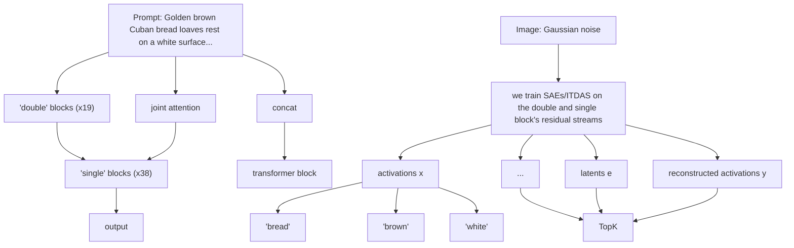

# Interpreting Large Text-to-Image Diffusion Models with Dictionary Learning

Stepan Shabalin Georgia Institute of Technology sshabalin3@gatech.edu

Ayush Panda Georgia Institute of Technology

Dmitrii Kharlapenko ETH Zurich

Abdur Raheem Ali Trajectory Labs

Yixiong Hao Georgia Institute of Technology yhao96@gatech.edu

Arthur Conmy \*

# Abstract

Sparse autoencoders are a promising new approach for decomposing language model activations for interpretation and control. They have been applied successfully to vision transformer image encoders and to small-scale diffusion models. Inference-Time Decomposition of Activations (ITDA) is a recently proposed variant of dictionary learning that takes the dictionary to be a set of data points from the activation distribution and reconstructs them with gradient pursuit. We apply Sparse Autoencoders (SAEs) and ITDA to a large text-to-image diffusion model, Flux 1, and consider the interpretability of embeddings of both by introducing a visual automated interpretation pipeline. We find that SAEs accurately reconstruct residual stream embeddings and beat MLP neurons on interpretability. We are able to use SAE features to steer image generation through activation addition. We find that ITDA has comparable interpretability to SAEs.

# 1. Introduction

In recent years, text-to-image model capabilities have rapidly improved [5]. These models develop internal representations of the physical structure of the world [8, 51]. However, ongoing debates persist regarding the extent to which text-to-image models memorize training data [44] and how precisely their outputs can be controlled. A deeper understanding of the feature compositions of these models and the ability to intervene in their generation process would enhance artistic expression and improve transparency in how these models operate.

In this work, we explore the interpretability of hidden representations by learning sparse decompositions of model activations, evaluating the feasibility and scalability of this approach for large text-to-image diffusion models.

Our work makes the following contributions:

  
Figure 1. Maximum activating examples and steering effects of some interpretable features from our FLUX SAE. See Appendix B for more features.

1. We evaluate and scale sparse autoencoders (SAEs; Bricken et al. [3], Cunningham et al. [9], Ng [35]) for text-to-image diffusion models, implementing several training efficiency improvements on very large models (Appendix C).   
2. We assess Inference Time Decomposition of Activations (ITDA; Leask et al. [31]), a new dictionary learning technique, and compare its interpretability to sparse autoencoders.   
3. We demonstrate general-purpose steering of image representations using sparse autoencoder latents.

# 2. Related work

Sparse autoencoders (SAEs, [3, 21, 45]) are a method for training small neural networks to resolve feature superposition [13] in larger networks. They work by learning a large, overcomplete decoder basis for the latent space, as well as an encoder that outputs a sparse set of linear coefficients for approximately reconstructing vectors in the latent space. One common SAE variant is TopK, which takes the top-K matching decoder features after a linear encoder projection [17].

[1] found that LLMs can find explanations for MLP neurons in smaller networks and accurately predict (simulate) their activations based on the explanations. SAE features can similarly be automatically explained and simulated [3, 21], with scores exceeding those of MLP neuron features and other sparse decomposition techniques. [23] replaces the expensive per-token simulation step with classification of images into ones matching the explanation or not.

Denoising diffusion [19, 47] is a generative modelling method that learns a score function of the original distribution mixed with varying amounts of noise. Flow matching and rectified flows [33, 34] are similar but simpler formulations that learn the expected velocity of a particle in an SDE at any given timestep. Models trained in this formulation are what we will consider in this paper because they comprise most of the state-of-the-art text-to-image generators. Transformers have been adapted for image diffusion with adaptations to the architecture [39], including text-to-image generation [14] with the multimodal diffusion transformer (MMDiT) architecture. FLUX.1 is a recent MMDiT transformer with 12 billion parameters that achieves state-of-theart performance. It has a step-distilled variant, FLUX.1 Schnell, that can generate images in one timestep.

SAEs have been applied to vision transformers previously, with activations similarly being taken from the residual stream: [11, 15]. Some have been trained on classconditioned and text-to-image diffusion models [10, 22, 25]. Some are trained on the innermost bottleneck of a diffusion U-Net [22] (see [28] for evidence that this site is especially interpretable), others are spaced through the network; they are trained either on a single timestep or all of them distributed equally. A priori, we may expect that features activate specifically on some timesteps or spatial positions, and that different types of features are more or less frequent at earlier or later layers. With MMDiT, we can apply the same dictionary learning technique to different layers with similar results.

While we’re not aware of any work applying autointerpretation to diffusion models, [43] is an example of advanced automated interpretability for vision models. The agent presented in the work has many functions, explanation and scoring being just a small subset of its capabilities.

[49] introduces the technique of adding vectors to the residual stream for manipulating transformer internals – though there is a rich history of applying the same technique for GANs and diffusion models mentioned in the paper. There are many works on steering diffusion models with feature-like disentangled representations, discovered through training or unsupervised methods [16, 28, 38].

Steering with SAE features is a natural application of results from dictionary learning. [7, 11, 37] explore it in various contexts like steering language models for various behaviors or controlling CLIP-conditioned image generators with a global latent addition.

[48] trains SAEs on various hidden layers of the Stable Diffusion XL Turbo UNet [41, 42]. It thoroughly evaluates steering and even shows image generation from pure feature guidance. We scale up a similar approach, identify unique challenges arising for the MMDiT architecture of FLUX.1(normalization) and show successful examples of steering. [24] trains SAEs on both SDXL-Turbo and FLUX.1 Dev, showing controllability comparable to or exceeding non-steering-based baselines in real-world scenarios under adversarial attacks. Unlike our work, they train SAEs on the text encoder of the model, thus affecting the conditioning instead of the generation process. This site for inserting SAEs is less likely to show concepts used by the vision transformer or enable circuits-based mechanistic interpretability [4].

Inference-time decomposition of activations (ITDA) [31] has been proposed as a modification to SAEs. It removes the learnable encoder and replaces it with ITO [46], also known as gradient pursuit [2]. Instead of being trained with gradient descent, decoder rows are selected from training input batches according to a reconstruction loss criterion with an additional pruning step. ITDA promises significant efficiency gains, being able to train models in several minutes – orders of magnitude faster than SAEs. It also offers more straightforward interpretability of latents, as each one corresponds to a token which may be traced to the SAE training dataset.

# 3. Methodology

We train SAEs and ITDAs on various layers and timesteps of the FLUX.1[29] model with varying amounts of inference-time and training time resources granted to the SAEs/ITDA. In this section, we discuss the algorithms we use and the modifications we made to them for training. We give a full discussion of background research such as SAEs, diffusion and steering in the related work section (Section 2).

# 3.1. SAE formulation

We build on TopK SAEs [17] due to their simplicity. The TopK SAE encodes input vectors $x \in \mathbb { R } ^ { n }$ into sparse vectors $e \in \mathbb { R } ^ { d } : L _ { 0 } ( e ) \leq k$ , where k is the SAE’s sparsity constant. The encoding process is usually affine. In our implementation, it is $e = \mathrm { T o p } _ { k } ( W _ { e n c } ( x - b _ { p o s t } + b _ { p r e } ) )$ , where $W _ { e n c } \in \mathbb { R } ^ { d \times n }$ and the biases $b _ { p o s t } , b _ { p r e } \in \mathbb { R } ^ { n }$ . k is a hyperparameter that controls the complexity of the problem, with higher k allowing better reconstruction, but also potentially decreasing interpretability. The vector e is then decoded into $y \in \mathbb { R } ^ { d } , y \approx x ,$ through an affine decoder: $y = W _ { d e c } e + b _ { d e c }$ . This SAE is trained with MSE reconstruction loss against the original activations $\begin{array} { r l } { \mathbf { M S E } ( x , y ) = } & { { } } \end{array}$ $\textstyle \sum _ { i = 1 } ^ { n } { \frac { 1 } { n } } ( y _ { i } - x _ { i } ) ^ { 2 }$ with no additional penalties like AuxK.1

flowchart

Figure 2. Residual SAEs for FLUX.1

# 3.2. ITDA formulation

Smith [46]’s Inference-Time Optimization (ITO) is the algorithm behind ITDA. Originally, ITO was proposed as a way of replacing the SAE encoder – finding sparse encoded vectors e without learning the encoder. Using an efficient implementation of gradient pursuit [2], ITO can encode signals without encoder weights: $e = I T O ( x , W _ { d e c } )$ . For further details, see [46].

ITDA builds on ITO by providing a simple algorithm for learning a dictionary without training an SAE. In short, it adds elements directly from the training dataset. It keeps the dictionary size low by prioritizing data points which are reconstructed poorly by the current version of the ITDA autoencoder. Taken together: $W _ { d e c , t + 1 } = W _ { d e c , t } \cup$ $\{ x | x \in \mathrm { d a t a } \land \mathbf { M S E } ( x , I T O ( x , W _ { d e c , t } ) ) >$ threshold}, where threshold is a hyperparameter we find using sweeps.

# 3.3. SAE training

For training SAEs and ITDAs, there are a few input parameters that determine the learning problem and its complexity. These include the input distribution – determined by the site at which activations are taken, the resolution, the time step, as well as the distribution of input text – and the SAE’s capacity – the k and d/n parameters.2

We train most of our SAEs on single-step generations from FLUX.1 Schnell3 at 256x256 resolution given resource constraints. We focus on layer 18 of the double blocks for many of the sweeps, as it is halfway through the model’s parameter count. We also train on layers 9 (double and single) and layer 18 (single) (Figure 2). We train all SAEs for 30k steps, or 30M tokens.

The variance of FLUX.1 residual streams is largely concentrated in the first few dozen eigenvalues (Section 4.2). We found that standard training SAEs on residual stream data produces many dead features (> 99%), regardless of whether we use AuxK or not. While these autoencoders can have high proportions of variance explained (> 60%), the features will be concentrated in one low-dimensional subspace, similarly to the training data.

We propose a solution: normalizing the spectral components of the inputs before the SAE through PCA whitening in input space (see Section 3.4). We compare outputs for training in the whitened space, but for inference we transform reconstructions back to the original residual stream: $y ^ { * } = W ^ { T } ( y \odot \vec { \sigma } ( x _ { 1 } ) + \vec { \mu } ( x _ { 2 } ) ) .$ 4

Training with this normalization produces manageable amounts of dead latents (< 30%). In other experiments, we found that normalizing by the mean and standard deviation without PCA has similar performance, but all our SAE work here also does the PCA transformation.

We repeat that normalization is necessary for training Flux SAEs without the majority of neurons being dead due high anisotropy of the residual stream (Section 4.2).

# 3.4. PCA normalization

Based on the first few batches of the training data, we compute the orthonormal projection matrix of the PCA decomposition $W ~ \in ~ O ( n )$ . We use it to transform the data $( \vec { x _ { 1 } } = W \vec { x _ { 0 } } )$ into a space where the components have zero covariance, anisotropic variance, and an unknown, potentially large mean. We further remove the mean and variance through standardization $( \vec { x _ { 2 } } ~ = ~ \vec { x _ { 1 } } \odot \frac { 1 } { \vec { \sigma } ( x _ { 1 } ) } , ~ \vec { x _ { 3 } } ~ =$ 1⃗σ(x ) , ⃗x3 = $\vec { x _ { 2 } } - \vec { \mu } ( x _ { 2 } ) )$ . In sum, we perform whitening of the input data.

# 3.5. ITDA training

We similarly normalize training inputs to ITDA without PCA. We tried several modifications to ITDA: restricting feature growth early on by taking the top-k feature additions; adding the residual reconstruction error instead of the datapoint to the dictionary; pruning the ITDA after training with K-Means clustering. None of them significantly improved on the dictionary size to reconstruction accuracy tradeoff.

We use the FVU (fraction of variance unexplained) metric as the loss function: $\begin{array} { r l } { \mathrm { F V U } ( y , y ^ { * } ) } & { { } = } \end{array}$ $\mathbf { M S E } ( y , y ^ { \ast } ) / \mathbf { M S E } ( y ^ { \ast } , \mu _ { y ^ { \ast } } )$ , where $y ^ { * }$ is the ground truth. This metric can go above 1, but typically takes values from 0.1 to 0.5.

# 4. Basic Flux interpretability

While FLUX.1 uses the Transformer architecture, there are differences that could cause techniques applicable to Transformers to not work with it. For example: Flux uses AdaLN layers [20], and Layernorm layers are commonly known to hamper interpretability because they are nonlinear and can cause anomalies like [26]; a more complex version of LN could cause more issues because of the timestep and prompt dependence. Similarly, the gradients induced by the architecture and data distribution can render some optimizers less effective and potentially cause artifacts [52].

# 4.1. Across layers and timesteps

We start by comparing the norms of the residual stream throughout the layers. At the last layer of the double blocks (Figure 3), the norm of the text component jumps up rapidly. This may correspond to a distinct stage of inference [30].

The residual stream norms generally increase through timesteps, but they only rise by an order of magnitude.

  
Figure 3. Residual stream norms for double blocks

  
Figure 4. Residual stream norms for single blocks

# 4.2. Latent space spectrum

When we trained SAEs without any normalization (Section 3.3), we found adequate reconstruction quality with many dead features. The alive features seemed interpretable, but there were less than 1000 of them. This suggests that there may be a small subspace in the residual stream that contains most of the variance for the SAE to explain.

We measure the variances of each PCA component (Figure 5) and residual stream element, and find that they are anisotropic to an extent that would be unusual for a text model. That these dimensions containing most of the variance are basis-aligned is perplexing, and may be related to outlier dimensions [26]. It’s possible they encode CLIP image embeddings, the model’s encoding for noise in the VAE space,5 or positional embeddings.

Explained Variance Ratio of Image PCA Components   

pie

| Layer | Percentage (%) |
|---|---|
| Layer 1 | 58.4 |
| Layer 2 | 37 |
| Layer 3 | 36 |
| Layer 4 | 35 |
| Layer 5 | 34 |
| Layer 6 | 33 |
| Layer 7 | 32 |
| Layer 8 | 31 |
| Layer 9 | 30 |
| Layer 10 | 29 |
| Layer 11 | 28 |
| Layer 12 | 27 |
| Layer 13 | 26 |
| Layer 14 | 25 |
| Layer 15 | 24 |
| Layer 16 | 23 |
| Layer 17 | 22 |
| Layer 18 | 21 |
| Layer 19 | 57.7 |

Figure 5. Variances explained by principal components

line

| Autoencoder sparsity (k) | ITDA (d=16.0k) | ITDA (d=24.0k) | ITDA (d=32.0k) | ITDA (d=40.0k) | ITDA (d=48.0k) | ITDA (d=56.0k) | ITDA (d=64.0k) | SAE (d=59.0k) |
| ------------------------ | -------------- | -------------- | -------------- | -------------- | -------------- | -------------- | -------------- | ------------- |
| 15                       | 0.49           | 0.57           | 0.57           | 0.57           | 0.57           | 0.57           | 0.57           | 0.57          |
| 25                       | 0.53           | 0.62           | 0.62           | 0.62           | 0.62           | 0.62           | 0.62           | 0.62          |
| 35                       | 0.57           | 0.65           | 0.65           | 0.65           | 0.65           | 0.65           | 0.65           | 0.65          |
| 45                       | 0.61           | 0.68           | 0.68           | 0.68           | 0.68           | 0.68           | 0.68           | 0.68          |
| 55                       | 0.64           | 0.70           | 0.70           | 0.70           | 0.70           | 0.70           | 0.70           | 0.70          |
| 65                       | 0.65           | 0.71           | 0.71           | 0.71           | 0.71           | 0.71           | 0.71           | 0.71          |

Figure 6. Reconstruction quality of FLUX.1 double block 18 residual SAEs and ITDAs.

# 5. Evaluations

# 5.1. Reconstruction

The primary objective of SAEs is reconstructing activations. We evaluate ITDAs and SAEs on using the variance explained metric: $\begin{array} { r l } { \mathrm { V E } ( y , y ^ { * } ) } & { { } = } \end{array}$ $\begin{array} { r } { \sum _ { i = 0 } ^ { n } \frac { 1 } { \sigma _ { u } ^ { 2 } \sigma _ { , * } ^ { 2 } } \left( \frac { 1 } { | y | } \sum _ { j = 0 } ^ { | y | } ( y - \mu _ { y } ) _ { j , i } ( y ^ { * } - \mu _ { y ^ { * } } ) _ { j , i } \right) ^ { 2 } } \end{array}$ P i=0 y σy ∗ .

As mentioned above, we compare SAEs and ITDAs in two settings: comparing various settings of k and $d / n$ on layer 18, and testing the performance on various layers in the network. Figure 6 demonstrates the former, showing that ITDA is generally superior in terms of reconstruction performance at similar dictionary sizes.

We compare FVU scores across different layers in Appendix A.

# 5.2. Automated interpretability

Bills et al. [1] introduced automated interpretability for feedforward block (MLP, [50]) neurons: a pipeline that uses a language model to generate explanations for maximum activating examples of neurons, and then predicts the strength of the neuron’s activations on a test set. Detection scoring [23] replaces the regression task of predicting how strongly a neuron activates on each token with the classification task of detecting whether the neuron was correctly labeled, reducing the token usage of the autointerpretation pipeline.

Since we are not working with raw language models, unlike this prior work, we need to adapt these autointerpretability methods. We introduce a visual autointerpretation pipeline with two components: the explainer and the classifier. The explainer looks at images with activations painted in blue on top of them and generates a shared explanation. The scorer looks at a single image and decides if it belongs to the chosen explanation. Both the explainer and the scorer use google/gemini-2.0-flash-001 as the backend. Their prompts are included in Appendix D.

We run autointerp on layer 18, k = 64, d = 64000. We compare SAEs and ITDAs to an MLP neuron baseline, similarly to [21]. We use max-activating examples and only consider activating features from each method. We see that SAEs and ITDA have comparable performance and that MLP neurons are generally less interpretable, although they contain several features with exceedingly high autointerp scores. From visual inspection (Appendix B), highly interpretable MLP neurons activate on contiguous areas of the image with fixed semantic meaning and are likely causally relevant to the image generation process.

# 5.3. Steering

As mentioned in Section 2, steering has a rich history in diffusion models, and steering with SAE features is a common technique. We explore steering FLUX.1 with our trained SAEs at the intended layers through simple activation addition at areas of the image: $y [ a ; b , c ; d ] \mathrel { + } = W _ { d e c } [ f ]$ .

We primarily study Layer 18. We found that steering with features often leads to an effect associated with their max activating patterns. However, the effects are constrained, in a sense that the initial prompt should be related to the feature: for example the anime style feature from Figure 1 had effect only on the ”A cartoon” prompt (but not on a prompt like ”A person”). This suggests that images may have a localized feature space, and steering may work only inside them.

  
Figure 7. Histograms of autointerp accuracy scores for three methods.

We steered only on a fraction of the steps. In the examples (Figure 1), we applied steering only to the first 5 steps out of 7. Steering on all steps introduced noticeable artifacts. Negative steering was also successful in some cases, although it could remove only small details of the image and required much more complex prompts than positive steering.

# 6. Future Work

We evaluated our SAEs and ITDAs on simple metrics like autointerp. In vision, there are many tasks, like classification, segmentation and depth estimation, that SAEs could be used to perform [8]; this would be analogous to sparse probing [17].

In this work, we apply the SAE architecture as used in large language models (LLMs) without modifications. However, it is reasonable to expect some changes to be necessary: in images, latent activations of nearby spatial positions are more similar than those of random patches.6 We could adapt the encoder architecture to add spatial inductive bias, like by making it convolutional. We could improve steering by making the process more similar to finetuning [28, 53] or otherwise aware of the effects of the steering. We only consider SAEs on image activations in this work. It is likely that the multimodal DiT architecture shares features between text and image streams, which is something that could be the cosine similarity of SAEs. This paper also does not consider variable image resolution and timesteps other than pure noise. Carter et al. [6]’s Activation Atlas could be a useful technique for dealing with intermediate timesteps.

Another promising avenue for future work is comparing FLUX.1’s two variants, Dev and Schnell. We only considered the latter, but crosscoders [32] may let us find corresponding pairs of features and features unique to stepdistilled models.

It is also important to investigate biases specific to our autointerp pipeline. Similarly to Heap et al. [18], it is possible that our pipeline may pick up on simple characteristics of the image like color. We leave detailed investigation to future work.

# 7. Conclusion

In this work, we have demonstrated the successful application of Sparse Autoencoders (SAEs) and Inference-Time Decomposition of Activations (ITDA) to large textto-image diffusion models. Our experiments with FLUX.1 show that these methods can effectively decompose complex residual stream activations into interpretable features that enable targeted steering of image generation. We find that both SAEs and ITDAs outperform MLP neurons on interpretability metrics, while maintaining high reconstruction quality across various model layers and configurations.

Our manual examination revealed important distinctions between SAEs and ITDAs not captured by automated metrics. Despite similar autointerp scores, ITDA features typically encoded general attributes (colors, textures, regions) while SAE features captured more concrete objects (hats, faces). This qualitative difference highlights a limitation of autointerp metrics - they don’t distinguish between abstract visual properties and manipulable semantic concepts. SAE features also demonstrated superior pixel-wise coverage compared to the sparser activation patterns of ITDA features (Appendix B).

When exploring steering capabilities, we observed that SAE feature steering was effective but constrained, requiring initial prompts to align with steered features. This suggests a localized nature of feature representation in diffusion models, where later layer features have low effect if they are not directly related to the image representation generated by earlier layers.

# References

[1] Steven Bills, Nick Cammarata, Dan Mossing, Henk Tillman, Leo Gao, Gabriel Goh, Ilya Sutskever, Jan

Leike, Jeff Wu, and William Saunders. Language models can explain neurons in language models. URL https://openaipublic. blob. core. windows. net/neuronexplainer/paper/index. html.(Date accessed: 14.05. 2023), 2, 2023. 2, 5   
[2] Thomas Blumensath and Mike E. Davies. Gradient pursuits. IEEE Transactions on Signal Processing, 56(6):2370–2382, 2008. 2, 3   
[3] Trenton Bricken, Adly Templeton, Joshua Batson, Brian Chen, Adam Jermyn, Tom Conerly, Nick Turner, Cem Anil, Carson Denison, Amanda Askell, Robert Lasenby, Yifan Wu, Shauna Kravec, Nicholas Schiefer, Tim Maxwell, Nicholas Joseph, Zac Hatfield-Dodds, Alex Tamkin, Karina Nguyen, Brayden McLean, Josiah E Burke, Tristan Hume, Shan Carter, Tom Henighan, and Christopher Olah. Towards monosemanticity: Decomposing language models with dictionary learning. Transformer Circuits Thread, 2023. https://transformer-circuits.pub/2023/monosemanticfeatures/index.html. 1, 2   
[4] Nick Cammarata, Shan Carter, Gabriel Goh, Chris Olah, Michael Petrov, Ludwig Schubert, Chelsea Voss, Ben Egan, and Swee Kiat Lim. Thread: Circuits. Distill, 2020. https://distill.pub/2020/circuits. 2   
[5] Nicholas Carlini, Jamie Hayes, Milad Nasr, Matthew Jagielski, Vikash Sehwag, Florian Tramer, Borja Balle, Daphne \` Ippolito, and Eric Wallace. Extracting Training Data from Diffusion Models. UseNix Security, 2023. arXiv:2301.13188 [cs]. 1   
[6] Shan Carter, Zan Armstrong, Ludwig Schubert, Ian Johnson, and Chris Olah. Activation atlas. Distill, 2019. https://distill.pub/2019/activation-atlas. 6   
[7] Sviatoslav Chalnev, Matthew Siu, and Arthur Conmy. Improving Steering Vectors by Targeting Sparse Autoencoder Features, 2024. arXiv:2411.02193 [cs]. 2   
[8] Yida Chen, Fernanda Viegas, and Martin Wattenberg. Be- ´ yond surface statistics: Scene representations in a latent diffusion model, 2023. 1, 6   
[9] Hoagy Cunningham, Aidan Ewart, Logan Riggs, Robert Huben, and Lee Sharkey. Sparse autoencoders find highly interpretable features in language models. arXiv preprint arXiv:2401.01345, 2024. 1   
[10] Bartosz Cywinski and Kamil Deja. Saeuron: Interpretable ´ concept unlearning in diffusion models with sparse autoencoders, 2025. 2   
[11] Gytis Daujotas. Interpreting and steering features in images. LessWrong, 2024. 2   
[12] Tim Dettmers, Artidoro Pagnoni, Ari Holtzman, and Luke Zettlemoyer. Qlora: Efficient finetuning of quantized llms, 2023. 1   
[13] Nelson Elhage, Tristan Hume, Catherine Olsson, Nicholas Schiefer, Tom Henighan, Shauna Kravec, Zac Hatfield-Dodds, Robert Lasenby, Dawn Drain, Carol Chen, Roger Grosse, Sam McCandlish, Jared Kaplan, Dario Amodei, Martin Wattenberg, and Christopher Olah. Toy models of superposition. Transformer Circuits Thread, 2022. https://transformer-circuits.pub/2022/toy model/index.html.

[14] Patrick Esser, Sumith Kulal, Andreas Blattmann, Rahim Entezari, Jonas Muller, Harry Saini, Yam Levi, Dominik ¨ Lorenz, Axel Sauer, Frederic Boesel, Dustin Podell, Tim Dockhorn, Zion English, Kyle Lacey, Alex Goodwin, Yannik Marek, and Robin Rombach. Scaling rectified flow transformers for high-resolution image synthesis, 2024. 2   
[15] Hugo Fry. Towards multimodal interpretability: Learning sparse interpretable features in vision transformers. Less-Wrong, 2024. 2   
[16] Rohit Gandikota, Joanna Materzynska, Tingrui Zhou, Antonio Torralba, and David Bau. Concept sliders: Lora adaptors for precise control in diffusion models, 2023. 2   
[17] Leo Gao, Tom Dupre la Tour, Henk Tillman, Gabriel Goh, ´ Rajan Troll, Alec Radford, Ilya Sutskever, Jan Leike, and Jeffrey Wu. Scaling and evaluating sparse autoencoders. arXiv preprint arXiv:2406.04093, 2024. 2, 3, 6, 1   
[18] Thomas Heap, Tim Lawson, Lucy Farnik, and Laurence Aitchison. Sparse autoencoders can interpret randomly initialized transformers, 2025. 6   
[19] Jonathan Ho, Ajay Jain, and Pieter Abbeel. Denoising diffusion probabilistic models. CoRR, abs/2006.11239, 2020. 2   
[20] Xun Huang and Serge Belongie. Arbitrary style transfer in real-time with adaptive instance normalization, 2017. 4   
[21] Robert Huben, Hoagy Cunningham, Logan Riggs Smith, Aidan Ewart, and Lee Sharkey. Sparse autoencoders find highly interpretable features in language models. In The Twelfth International Conference on Learning Representations, 2024. 1, 2, 5   
[22] Ayodeji Ijishakin, Ming Liang Ang, Levente Baljer, Daniel Chee Hian Tan, Hugo Laurence Fry, Ahmed Abdulaal, Aengus Lynch, and James H. Cole. H-space sparse autoencoders. In Neurips Safe Generative AI Workshop 2024, 2024. 2   
[23] Caden Juang, Gonc¸alo Paulo, Jacob Drori, and Belrosem Nora. Understanding and steering Llama 3, 2024. 2, 5   
[24] Dahye Kim and Deepti Ghadiyaram. Concept steerers: Leveraging k-sparse autoencoders for controllable generations, 2025. 2   
[25] Dahye Kim, Xavier Thomas, and Deepti Ghadiyaram. Revelio: Interpreting and leveraging semantic information in diffusion models, 2024. 2   
[26] Olga Kovaleva, Saurabh Kulshreshtha, Anna Rogers, and Anna Rumshisky. Bert busters: Outlier dimensions that disrupt transformers, 2021. 4, 5   
[27] Janos Kram ´ ar. Instrumenting llm model internals in jax, ´ 2024. 1   
[28] Mingi Kwon, Jaeseok Jeong, and Youngjung Uh. Diffusion models already have a semantic latent space, 2023. 2, 6   
[29] Black Forest Labs. Flux. https://github.com/ black-forest-labs/flux, 2024. 2   
[30] Vedang Lad, Wes Gurnee, and Max Tegmark. The remarkable robustness of llms: Stages of inference?, 2024. 4   
[31] Patrick Leask, Neel Nanda, and Noura Al Moubayed. Inference-Time Decomposition of Activations (ITDA): A Scalable Approach to Interpreting Large Language Models. ICML 2025, 2025. arXiv:2505.17769 [cs] version: 1. 1, 2

[32] Jack Lindsey\*, Adly Templeton\*, Jonathan Marcus\*, Thomas Conerly\*, Joshua Batson, and Christopher Olah. Sparse crosscoders for cross-layer features and model diffing. Transformer Circuits, 2024. 6   
[33] Yaron Lipman, Ricky T. Q. Chen, Heli Ben-Hamu, Maximilian Nickel, and Matt Le. Flow matching for generative modeling, 2023. 2   
[34] Xingchao Liu, Chengyue Gong, and Qiang Liu. Flow straight and fast: Learning to generate and transfer data with rectified flow, 2022. 2   
[35] Andrew Ng. Sparse autoencoder. CS294A Lecture Notes, 2011. Unpublished lecture notes. 1   
[36] nostalgebraist. Shortform comment on sae locality. Less-Wrong, 2024. 6   
[37] Kyle O’Brien, David Majercak, Xavier Fernandes, Richard Edgar, Jingya Chen, Harsha Nori, Dean Carignan, Eric Horvitz, and Forough Poursabzi-Sangde. Steering Language Model Refusal with Sparse Autoencoders. 2024. Publisher: arXiv Version Number: 1. 2   
[38] Yong-Hyun Park, Mingi Kwon, Junghyo Jo, and Youngjung Uh. Unsupervised discovery of semantic latent directions in diffusion models, 2023. 2   
[39] William Peebles and Saining Xie. Scalable diffusion models with transformers, 2023. 2   
[40] Senthooran Rajamanoharan, Tom Lieberum, Nicolas Sonnerat, Arthur Conmy, Vikrant Varma, Janos Kram ´ ar, and ´ Neel Nanda. Jumping ahead: Improving reconstruction fidelity with jumprelu sparse autoencoders, 2024. 3   
[41] Olaf Ronneberger, Philipp Fischer, and Thomas Brox. U-net: Convolutional networks for biomedical image segmentation, 2015. 2   
[42] Axel Sauer, Dominik Lorenz, Andreas Blattmann, and Robin Rombach. Adversarial diffusion distillation, 2023. 2   
[43] Tamar Rott Shaham, Sarah Schwettmann, Franklin Wang, Achyuta Rajaram, Evan Hernandez, Jacob Andreas, and Antonio Torralba. A multimodal automated interpretability agent, 2025. 2   
[44] Shawn Shan, Wenxin Ding, Josephine Passananti, Stanley Wu, Haitao Zheng, and Ben Y. Zhao. Nightshade: Prompt-Specific Poisoning Attacks on Text-to-Image Generative Models. 2024. arXiv:2310.13828 [cs]. 1   
[45] Lee Sharkey, Dan Braun, and Beren Millidge. Taking features out of superposition with sparse autoencoders. AI Alignment Forum, 2022. 1   
[46] Lewis Smith. Replacing sae encoders with inference-time optimisation, 2024. 2, 3   
[47] Jiaming Song, Chenlin Meng, and Stefano Ermon. Denoising diffusion implicit models. In 9th International Conference on Learning Representations, ICLR 2021, Virtual Event, Austria, May 3-7, 2021. OpenReview.net, 2021. 2   
[48] Viacheslav Surkov, Chris Wendler, Mikhail Terekhov, Justin Deschenaux, Robert West, and Caglar Gulcehre. Unpacking sdxl turbo: Interpreting text-to-image models with sparse autoencoders, 2024. 2   
[49] Alexander Matt Turner, Lisa Thiergart, Gavin Leech, David Udell, Juan J. Vazquez, Ulisse Mini, and Monte MacDiarmid. Steering Language Models With Activation Engineering, 2024. arXiv:2308.10248 [cs]. 2

[50] Ashish Vaswani, Noam Shazeer, Niki Parmar, Jakob Uszkoreit, Llion Jones, Aidan N. Gomez, Lukasz Kaiser, and Illia Polosukhin. Attention is all you need, 2023. 5   
[51] Guanqi Zhan, Chuanxia Zheng, Weidi Xie, and Andrew Zisserman. A general protocol to probe large vision models for 3d physical understanding, 2024. 1   
[52] Jingzhao Zhang, Sai Praneeth Karimireddy, Andreas Veit, Seungyeon Kim, Sashank J Reddi, Sanjiv Kumar, and Suvrit Sra. Why are adaptive methods good for attention models?, 2020. 4   
[53] Lvmin Zhang, Anyi Rao, and Maneesh Agrawala. Adding conditional control to text-to-image diffusion models, 2023. 6

# Interpreting Large Text-to-Image Diffusion Models with Dictionary Learning Supplementary Material

line

| Layer | SAE (d=64k, k=64) | ITDA (d=64k, k=64) |
|-------|-------------------|--------------------|
| 0     | 0.58              | 0.88               |
| 10    | 0.65              | 0.85               |
| 20    | 0.67              | 0.75               |
| 30    | 0.65              | 0.65               |
| 35    | 0.50              | 0.60               |

Figure 8. Reconstruction quality for ITDAs and SAEs across layers.

# A. Detailed evaluation statistics

In Figure 8, we compare ITDAs and SAEs across multiple layers.

# B. Additional example feature activations

Figure 9 contains max activating examples for 5 different SAE features. Figure 10 contains max activating examples for 5 different ITDA features. We can notice a difference in pixel coverage with these two types of features.

# C. Specifics of the SAE training codebase

We implemented our SAE training code in Jax for Google TPUs. To our knowledge, we produced the first Jax implementation of FLUX.1. The diffusion transformer and the T5 text encoder take 48GB of memory combined at bfloat16 precision. We used v4-8 TPUs, which have 128GB of HBM combined. We implemented 4-bit NormalFloat quantization [12] together with inference kernels to avoid materializing the dequantized weight matrices in memory. We implemented FSDP across the output axis for partitioning the weights across devices.

We used Oryx and jax.lax.cond clobber to gather activations through multiple timesteps as outlined in [27]. We had previously sent activations into CPU memory and found that the throughput was not reduced. It is possible that caching activations with the diffusion model is a bottleneck that overshadows a CPU-TPU transfer, or that we missed where the transfer occurs.

  
Figure 9. Maximum activating examples of some interpretable features from our FLUX.1 SAE.

Finally, we sped up the TopK SAE decoder similarly to [17]. We did not write a sparse matrix multiplication kernel for TPUs due to a lack of time, but we came up with a batched implementation that, while using up HBM, doesn’t need to store all pre-activation values.

The overall most important practical improvements are running the decoder in vmap and collecting activations with layer-scanned Oryx. We share our TPU training code in github.com/neverix/fae.

natural_image

Four basketball players in action during a game, each wearing team uniforms and holding their respective head positions (no visible text or symbols)

Jerseys on players

natural_image

Four-panel collage showing interior scenes: a wooden building with a person, a large room with a bed, a modern living room with patterned walls, and a digital display (no visible text or symbols)

Ceilings

natural_image

Four-panel collage showing a woven basket of eggs, vegetables, tomatoes, and sunflowers in a rustic setting (no text or symbols visible)

Baskets

natural_image

Four decorative vases: a colorful vase with textured glaze, a hanging ornament with a gold sphere, a green vase with a mosaic, and a blue vase (no text or symbols visible)

Glass/ceramic

natural_image

Three separate images showing a pizza with cheese, tomato slices, and a slice of cheese (no text or symbols visible)

Pizza crust   
Figure 10. Maximum activating examples of some interpretable features from ITDA.

# D. Autointerpretation prompts

# Autointepretation prompt

You will be given a list of images. Each image will have activations for a specific neuron highlighted in blue. You should describe a common pattern or feature that the neuron is capturing. First, write for each image, which parts are higlighted by the neuron. Then, write a common pattern or feature that the neuron is capturing.

# Judge prompt

You will be given an image. And a neuron’s activations description. The image will have activations for the neuron highlighted in blue. You should judge whether the description of the neuron’s pattern is accurate or not. Return a score between 0 and 1, where 1 means

the description is accurate and 0 means it is not. Be very critical. The pattern should be literal and specific, and vague or general descriptions should be rated low. The activation pattern is {pattern}.

Our autointerpretation code is public at github.com/kisate/flux-saes-gpu.