# Share Your Attention: Transformer Weight Sharing via Matrix-based Dictionary Learning

Magauiya Zhussip1, Dmitriy Shopkhoev1, 2, Ammar Ali1, Stamatios Lefkimmiatis1

1MWS AI

2ITMO University

# Abstract

Large language models (LLMs) have revolutionized AI applications, yet their high computational and memory demands hinder their widespread deployment. Existing compression techniques focus on intra-block optimizations (e.g., low-rank approximation or attention head pruning), while the repetitive layered structure of transformers implies signifcant inter-block redundancy—a dimension largely unexplored beyond key-value (KV) caching. Inspired by dictionary learning in convolutional networks, we propose a framework for structured weight sharing across transformer layers. Our approach decomposes attention projection matrices (Q, K, V, O) into shared dictionary atoms, reducing the attention module’s parameters by 66.7% (e.g., 226.5M → 75M in a 700Mparameter model) while achieving on-par performance. Unlike complex methods requiring distillation or architectural changes, MASA (Matrix Atom Sharing in Attention) operates as a drop-in replacement—trained with standard optimizers—and represents each layer’s weights as linear combinations of shared matrix atoms. Experiments across scales (100M–700M parameters) show that MASA achieves better benchmark accuracy and perplexity than grouped-query attention (GQA), low-rank baselines and recently proposed Repeat-all-over/Sequential sharing at comparable parameter budgets. Ablation studies confrm robustness to the dictionary size and the effcacy of shared representations in capturing cross-layer statistical regularities. Extending to Vision Transformers (ViT), MASA matches performance metrics on image classifcation tasks with 66.7% fewer attention parameters. By combining dictionary learning strategies with transformer effciency, MASA offers a scalable blueprint for parameter-effcient models without sacrifcing performance. Finally, we investigate the possibility of employing MASA on large pretrained models to reduce their number of parameters without experiencing any signifcant drop in their performance.

# Introduction

Large language models (LLMs) have achieved remarkable capabilities, yet their widespread deployment is hindered by the prohibitive computational and memory demands of transformer architectures. While existing compression techniques predominantly target intra-block redundancies Copyright © 2026, Association for the Advancement of Artifcial Intelligence (www.aaai.org). All rights reserved.

through low-rank approximations or attention head pruning (Yu et al. 2024; Ainslie et al. 2023), a critical dimension remains underexplored: the inter-block redundancy inherent in transformers’ repetitive layered structure. This overlooked opportunity represents a fundamental ineffciency, as L transformer layers with hidden dimension d require O(L· d2) parameters, with attention alone consuming up to half the parameters in foundational models like LLaMA (Touvron et al. 2023) and Mistral (Jiang et al. 2023).

Recently proposed methods like grouped-query attention (GQA) (Ainslie et al. 2023) and QK compression (e.g. LISA (Mu et al. 2024)) demonstrate the value of parameter reduction but operate within isolated layers or focus on particular projections inside attention module. Meanwhile, emerging approaches exploring cross-layer sharing—such as Repeat-all-over (Liu et al. 2024) and Sequential parameter (Takase and Kiyono 2021) assignment strategies—reveal promising directions but suffer from performance degradation in reasoning tasks (Liao and Vargas 2024). Crucially, these methods lack a principled framework for capturing the statistical regularities across transformer layers.

Inspired by dictionary learning principles in convolutional networks (Mairal et al. 2009), we propose Matrix Atom Sharing in Attention (MASA), a novel framework that systematically exploits inter-block redundancy through structured weight sharing across transformer layers. Unlike prior sharing strategies that either enforce rigid weight tying or require complex distillation procedures, MASA decomposes attention projection matrices (Q, K, V, O) into shared dictionary atoms, enabling each layer’s weights to be represented as linear combinations of these atoms. This approach reduces attention module parameters by 66.7% (e.g., 226.5M → 75M in a 700M-parameter model) while maintaining competitive performance—achieving what previous parameter-sharing methods like Sequential-sharing (Takase and Kiyono 2021) and Repeat-all-over Sharing could not: consistent accuracy across diverse benchmarks and on-par (or better) performance than the original Transformer.

In summary, the contributions of this work are:

1. Theoretical Foundation: By reframing attention compression as a dictionary learning problem, we establish a principled connection between classical signal processing and transformer effciency, revealing how shared matrix atoms capture cross-layer statistical regularities and effciently exploit inter-block redundancies.

```mermaid
graph TD
    A["Dictionaries, D"] --> B["Linear Coefficients, C_L"]
    B --> C["Transformer-based Network"]
    C --> D["1st block"]
    D --> E["Multi-Head Attention Norm"]
    E --> F["MLP Norm"]
    F --> G["W_1^Q"]
    G --> H["W_1^V"]
    H --> I["W_1^K"]
    I --> J["W_1^O"]
    J --> K["..."]
    K --> L["Linear Coefficients, C_1"]
    L --> M["1st block"]
    M --> N["Multi-Head Attention Norm"]
    N --> O["W_1^Q"]
    O --> P["W_1^V"]
    P --> Q["W_1^K"]
    Q --> R["W_1^O"]
    R --> S["..."]
    S --> T["Linear Coefficients, C_L"]
    T --> U["1st block"]
    U --> V["Multi-Head Attention Norm"]
    V --> W["W_1^Q"]
    W --> X["W_1^V"]
    X --> Y["W_1^K"]
    Y --> Z["W_1^O"]
    Z --> AA["..."]
    AA --> AB["Linear Coefficients, C_L"]
    AB --> AC["1st block"]
    AC --> AD["Multi-Head Attention Norm"]
    AD --> AE["W_1^Q"]
    AE --> AF["W_1^V"]
    AF --> AG["W_1^K"]
    AG --> AH["W_1^O"]
    AH --> AI["..."]
    AI --> AJ["Linear Coefficients, C_L"]
```

flowchart

Figure 1: MASA framework: (Left) Independent dictionary pools for Q, K, V, O projections. (Middle) Per-block projection matrices synthesized via weighted combinations of shared dictionaries. All blocks share dictionary pools while using unique linear coeffcients for each Transformer block.

2. Parameter Effciency with Performance Parity: MASA exceeds the performance of low-rank baselines, GQA, and recent Repeat-all-over/Sequential sharing approaches across language modeling (perplexity), reasoning, and knowledge benchmarks under the same (or higher) compression rate. Moreover, MASA with 66.7% less parameters in attention can match the performance of vanilla (uncompressed) Transformer for S, M, L sizes.

3. Architectural Simplicity: Unlike methods requiring distillation, regularization, or architectural modifcations (e.g., increasing hidden dimensions), MASA operates as a drop-in replacement trained with standard optimizers—preserving the original training pipeline while eliminating auxiliary components.

Beyond language models, we demonstrate the broad applicability of MASA by extending it to Vision Transformers (ViTs), where it achieves strong performance on image classifcation tasks while compressing attention modules by 66.7%. Given the dominance of pretrained models in modern deployment pipelines, we further investigate MASA in training-free adaptation scenarios. Our experiments show that MASA incurs only marginal performance degradation upon parameter pruning, highlighting its robustness and practicality in resource-constrained settings. By unifying dictionary learning with architectural design in Transformers, MASA provides a principled and scalable framework for constructing parameter-effcient models without compromising accuracy. The rest of the paper details our proposed method and presents comprehensive eval-

uations across model scales (100M–700M parameters) on language and vision tasks. Finally, we conclude with applications to training-free adaptation, highlighting MASA’s potential for plug-and-play effciency in pretrained models.

# Related Work

Our work intersects with three primary directions in effcient model design: structured attention, parameter sharing, and matrix factorization. We position the proposed MASA strategy as a unifying and principled advancement that overcomes some of the limitations faced by prior approaches.

Effcient Attention Mechanisms The quadratic complexity of self-attention has motivated researchers to discover numerous approximations. For instance, linear attention methods (You et al. 2024; Peng et al. 2023) approximate softmax with kernelizable features to achieve linear complexity w.r.t input sequence length. More alternative solutions based on state space models like Mamba (Gu and Dao 2023) replace attention with selective recurrence, offering longcontext modeling with linear inference. However, these approaches often require pretraining and may show inferior results on tasks requiring global context mixing.

In contrast, MASA preserves the standard attention formulation and instead targets parameter redundancy in projection matrices. This ensures compatibility with existing training recipes and pretrained models—a critical advantage for real-world deployment.

Cross-Layer Parameter Sharing To reduce inter-block redundancy, several works have explored reusing weight matrices. Weight tying between embedding and output layers is common (Press and Wolf 2017), and Universal Transformers (Dehghani et al. 2019) share parameters across time steps. More recently, Repeat-all-over (Liu et al. 2024) and Sequential-sharing apply deterministic patterns to share attention and FFN weights across layers.

However, such rigid sharing might limit representational fexibility leading to worse performance, particularly in deep models where early and late layers perform distinct functions (Liao and Vargas 2024). Basis Sharing (Wang et al. 2025) improves upon this by sharing singular vectors from SVD of concatenated weights, but lacks fne-grained control over layer-specifc adaptation.

MASA generalizes these ideas by introducing learned, adaptive sharing via dictionary atoms. Instead of copying or projecting onto fxed bases, MASA learns a compact set of matrix atoms that capture shared patterns across layers, with each layer reconstructing its weights via layer-specifc coeffcients. This provides a smooth spectrum between full sharing and full independence.

Structured Matrix Factorization and Dictionary Learning Our method is inspired by dictionary learning in signal processing (Mairal et al. 2009), where signals are represented as sparse linear combinations of learned basis elements. In deep learning, this idea has been applied to compress/optimize CNNs (Liu et al. 2018; Xiao, Yong, and Zhang 2020) and low-rank adaptations (Yu et al. 2024).

MASA extends this principle to Transformer weight matrices, treating each attention projection as a signal to be reconstructed from a shared dictionary. Unlike low-rank methods that enforce a uniform rank constraint across all layers and projection types, MASA learns separate dictionaries of shared matrix atoms for each attention projection and represents each layer’s weights as adaptive linear combinations of these atoms, allowing the effective rank to vary by layer and projection type. This fexible decomposition achieves higher compression ratios without sacrifcing performance.

Moreover, MASA integrates seamlessly into standard training—unlike methods requiring distillation (Sun et al. 2019) or auxiliary reconstruction losses. It also avoids architectural infation (e.g., widening layers to compensate for compression), making it a plug-and-play solution.

By unifying dictionary learning with Transformer architecture, MASA occupies a unique point in the design space: exploiting inter-block redundancy through a theoretically grounded, fexible, and practical framework. Thus, we provide a scalable solution without sacrifcing performance.

# Matrix Atom Sharing in Attention (MASA)

We consider a deep neural network architecture composed of L identical transformer blocks, each consisting of a multihead self-attention module followed by a position-wise feedforward network (FFN). Let $\mathbf { W } _ { \ell } \in \dot { \mathbb { R } ^ { d \times h } }$ denote any of the (Q, K, V, O) weight projection matrices of the attention component in the ℓ-th block, for $\ell = 1 , \ldots , L$ . The total number of parameters across all L blocks for this particular projection is thus $L \cdot d \cdot h$ , which can be prohibitively large for deep models.

Our objective is to exploit existing potential redundancies among the weight matrices $\{ \mathbf { W } _ { \ell } \} _ { \ell = 1 } ^ { L }$ by introducing a matrix weight-sharing mechanism between blocks. To accomplish this goal and motivated by dictionary learning methods, we propose a representation learning strategy that expresses the input model weights of different blocks in the form of a linear combination of shared basic components.

In the context of classical dictionary learning, the shared basic components are called atoms and they compose a dictionary, while the linear coeffcients indicate the contribution of each atom in the representation of a specifc input weight. This modeling (approximation) strategy can be expressed in matrix form as:

$$
\mathbf {W} \approx \mathbf {D C}, \tag {1}
$$

where in our case $\textbf { W } = \ [ \mathrm { v e c } ( \mathbf { W } _ { 1 } ) \quad \cdot \cdot \cdot \quad \mathrm { v e c } ( \mathbf { W } _ { L } ) ] \ \in$ $\mathbb { R } ^ { d \cdot h \times L }$ is composed by stacking horizontally the vectorized versions of the model weights for the L blocks in the network, $\mathbf { D } = [ \mathrm { v e c } ( \mathbf { D } _ { 1 } ) \mathrm { ~ \quad ~ } \cdot \cdot \mathrm { ~ \quad ~ } \mathrm { v e c } ( \mathbf { D } _ { S } ) ] \in \mathbb { R } ^ { d \cdot h \times S }$ is the dictionary, where vec $( \mathbf { D } _ { s } ) \in \mathbb { R } ^ { d \cdot h } , s = 1 , \ldots , S$ represents the s-th matrix atom, $\mathbf { \hat { D } } _ { s } \mathbf { \hat { \Pi } } \in \mathbb { R } ^ { d \times h }$ , in vectorized form and S is the total number of dictionary atoms, while $\mathbf { C } \in \mathbb { R } ^ { S \times L }$ represents the linear coeffcients of the representation.

By carefully examining Eq. (2), we can express each individual weight Wl as:

$$
\hat {\mathbf {W}} _ {l} = \sum_ {s = 1} ^ {S} c _ {l s} \mathbf {D} _ {s}, \text {   with   } \mathbf {D} _ {s} \in \mathbb {R} ^ {d \times h}, c _ {l s} \in \mathbb {R}, \tag {2}
$$

where $c _ { l s }$ is a scalar entry of the coeffcient matrix C. The above formulation describes our weight-sharing mechanism, where each individual weight matrix $\mathbf { W } _ { l }$ is defned by a collection of shared weights (dictionary D) and individual per block mixing coeffcients $( \mathbf { c } _ { l } = [ \boldsymbol { c } _ { l 1 } \ \cdot \cdot \cdot \ c _ { l S } ] ^ { \intercal } \in \mathbb { R } ^ { S } )$ . By employing this strategy in a transformer model, we can signifcantly reduce the network parameters, with the exact compression rate for a specifc type of weight projection matrix computed as $\begin{array} { r } { r = \dot { 1 } - \frac { S ( d \cdot \dot { h } + L ) } { L \cdot d \cdot h } \approx 1 - \frac { \dot { S } } { L } } \end{array}$ , with $S < L$ and $L < d \cdot h$ .

In dictionary learning, the optimal pair of the dictionary D and linear coeffcients C are usually estimated by minimizing the approximation error.

$$
\mathbf {D} ^ {*}, \mathbf {C} ^ {*} = \underset {\mathbf {D} \in \mathcal {D}, \mathbf {C} \in \mathcal {C}} {\arg \min} \| \mathbf {W} - \mathbf {D C} \| _ {F} ^ {2}, \tag {3}
$$

where both the dictionary and the coeffcients can be potentially further constrained. Typical constraints that are imposed on the atoms is that they maximize the mutual incoherence property (near-orthogonality condition) and be of unit-norm.

In our case, we propose to learn the shared matrix atoms and the linear coeffcients jointly via back-propagation on the network training loss. While it would be possible to enforce similar soft-constraints as those mentioned above by using additional terms in the training loss, we avoid doing so to allow for a more fexible learning process. Our proposed weight sharing-strategy is applied independently to Q, K, V and O projection matrices within attention blocks to promote a better expressivity of the model.

# Matrix Weight-Sharing for Pretrained Models

Here, we discuss how we can extend our proposed weightsharing strategy to existing pretrained transformer models. We begin by providing an overview of the Matrix Principal Component Analysis (Matrix PCA), which plays a key role in our framework. Subsequently, we present a transformerblock grouping method that enables the effective application of matrix PCA within groups of transformer blocks. Additionally, we propose a data-aware, layerwise local optimization criterion that dynamically refnes the low-rank residuals. This approach leverages activation statistics extracted from the pretrained model to optimize performance on downstream tasks. Overall, our approach seeks to reduce the number of parameters, while preserving essential performance of the pretrained model.

Matrix PCA Similarly to MASA’s approach, as described in Eq. (2), given a set of pretrained weights $\{ \mathbf { W } _ { l } \} _ { l = 1 } ^ { L }$ we aim to approximate each one as a linear combination of a collection of shared matrix components. However, unlike our training-from-scratch strategy, we don’t rely on the network loss and instead we aim for an analytical solution that minimizes the norm of the approximation error between the pretrained weights and the approximated ones. We further require that the shared matrix components are of unit-norm and orthogonal to each other, so it holds tr $\left( \mathbf { D } _ { i } ^ { \top } \mathbf { D } _ { j } \right) = \delta _ { i j }$ with δ the Kronecker delta function, while the linear coeffcients are computed as $c _ { l s } = \operatorname { t r } \left( \mathbf { D } _ { s } ^ { \top } \mathbf { W } _ { l } \right)$ . Thus, we are looking for a matrix basis of a subspace in $\dot { \mathbb { R } } ^ { d \times h }$ . The basis matrices, which constitute the basis, can be recovered as the minimizer of the following objective:

$$
\mathbf{D}_{1}^{*},..,\mathbf{D}_{S}^{*} = \underset { \begin{array}{c}\mathbf{D}_{s}\in \mathbb{R}^{d\times h}\\ \operatorname{tr}\left(\mathbf{D}_{i}^{\top}\mathbf{D}_{j}\right) = \delta_{ij}}{\arg \min}\sum_{l = 1}^{L}\left\| \mathbf{W}_{l} - \sum_{s = 1}^{S}\operatorname{tr}\left(\mathbf{D}_{s}^{\top}\mathbf{W}_{l}\right)\mathbf{D}_{s}\right\|_{F}^{2}, \tag{4}
$$

where $\operatorname { t r } ( \cdot )$ denotes the matrix trace. Fortunately, the above minimization problem admits a closed-form solution (we refer to the appendix for a detailed derivation) that involves the eigenvectors corresponding to the S largest eigenvalues of the matrix product WW⊤, with W defned as in Eq. (1).

Grouping Strategy. To apply MASA to pretrained large language models, we frst group transformer blocks into shared-weight segments, where each group of blocks has its own shared dictionary. The grouping is based on functional similarity of blocks. First, we calculate output for each transformer block using a small set of calibration data. Then, using the model’s fnal output projection as a semantic probe, we map each block’s averaged (over tokens) hidden state to the output vocabulary space, obtaining a sequence of probability distributions over layers. By computing the Kullback–Leibler divergence between consecutive distributions, we identify segments of blocks that induce minimal semantic change—indicating functional redundancy. We then form groups of consecutive blocks where intra-group distributional drift is small, ensuring that parameter sharing occurs among behaviorally similar layers. This data-driven, training-free strategy enables structured compression while preserving semantic coherence, and facilitates practical adaptation of pretrained LLMs without fnetuning. Step-by-step description provided in the Appendix.

Local Refnement. To enhance the fdelity of MASA in pretrained models without fne-tuning, we introduce a datainformed local refnement strategy that captures reconstruction residuals with compact, structured representations. After grouping blocks and computing shared dictionary atoms via Matrix PCA, we reconstruct each layer’s weights and compute the residual $\Delta \mathbf { W } _ { l } = \mathbf { W } _ { l } - \hat { \mathbf { W } } _ { l }$ . Instead of modeling ∆Wl directly, we apply a Cholesky whitening transform based on calibration data, and approximate $L _ { l } \Delta \mathbf W _ { l }$ with a low-rank matrix, where $L _ { l }$ is the Cholesky factor (Meyer 2023) of the input autocorrelation. This accounts for data geometry and improves approximation effciency.

We further propose an adaptive rank allocation scheme that distributes the residual budget according to the role of each weight matrix in the attention computation. Motivated by the rank inequality rank(AB) ≤ min{rank(A), rank(B)}, we allocate more residual capacity to matrices with higher intrinsic rank (e.g., $\mathbf { W } _ { q } , \ \hat { \mathbf { W } } _ { o } )$ and less to those with structural constraints (e.g., Wk, Wv in GQA/MQA). This asymmetric allocation ensures optimal use of the parameter budget under architectural imbalances. Detailed description of the proposed dynamic ranking algorithm is provided in the Appendix.

Our refnement is fully training-free and plug-and-play, signifcantly reducing approximation error while preserving compatibility with pretrained checkpoints.

# Experiments

# Experimental Setup

Model Architecture. We evaluate our approach within the standard Transformer architecture (Vaswani et al. 2017), which employs multi-head self-attention layers followed by GeLU-activated feed-forward networks (FFNs). As text tokenizer, we adopt a well-known Llama tokenizer (Touvron et al. 2023) and conduct experiments across three model scales: small (110M parameters, denoted Transformer-S), medium (335M, Transformer-M), and large (729M, Transformer-L). This scaling allows us to analyze how architectural modifcations interact with model capacity.

We focus on structured parameter sharing in the attention module, particularly in the query (Q), key (K), value (V), and output (O) projection matrices. We consider two compression regimes:

1. High compression: 66.7% reduction in attention parameters, achieved by employing $S = L / 3$ shared matrices separately across each of Q, K, V, and O projections (denoted MASA-QKVO).

2. Moderate compression: 50% reduction, where only Q, K, and V projections are defned using $S = L / 3$ shared weights, while the O projections for each transformer block are left untouched (denoted MASA-QKV).

This design enables a controlled study of the trade-off between representational expressiveness and computational effciency. In ablation studies, we further investigate: (i) how scaling model size interacts with compression, (ii) the impact of varying the number of shared weight matrices (S), and (iii) how the performance is affected if shared dictionary atoms are common for Q, K, V, and O projections.

Moreover, to enhance the stability and adaptability of the learned mixing factors $\mathbf { c } _ { l } ~ \in ~ \mathbb { R } ^ { S }$ for each block l, we introduce a block-specifc embedding-based parameterization. Each block is assigned a unique trainable embedding vector, which serves as input to a 3-layer MLP that predicts the corresponding coeffcients $\mathbf { c } _ { l } .$ . This parameterized formulation decouples the optimization dynamics of the mixing coeffcients from direct, potentially unstable, updates, thereby reducing gradient fuctuations during training and promoting smoother convergence. Importantly, this design acts as an implicit regularization mechanism, guiding the model toward more stable confgurations. After training, both MLP and embeddings are discarded, and only the fnal coeffcient matrix C is retained for inference. This ensures no additional computational overhead at test time while preserving the benefts of smooth and more effcient training.

Training Protocol. All models are trained on the Refned-Web dataset (Penedo et al. 2023), a high-quality web corpus fltered for linguistic and factual coherence. We follow the Chinchilla-optimal training regime (Hoffmann et al. 2022), allocating 20× the number of model parameters in training tokens (e.g., 2.2B tokens for Transformer-S).

We follow the established scaling laws (Zhang et al. 2022; Hoffmann et al. 2022) and set up hyperparameters, such as learning rate, batch size, and learning rate warmup schedule accordingly. Training is performed on A100 40GB GPUs using mixed-precision and optimized attention kernels via

FlashAttention (Dao et al. 2022) to handle long sequences effciently. For reproducibility, all training hyperparameters are listed in the Appendix.

Evaluation Protocol We assess zero-shot performance across two benchmark families: multiple-choice reasoning and language modeling. We compute the average accuracy across 8 test sets, including PIQA (Bisk et al. 2019), HellaSwag (Zellers et al. 2019), and ARC Challenge (Clark et al. 2018). Also, we estimate perplexity for LAMBADA (Paperno et al. 2016) and WikiText (Merity et al. 2016). Detailed description for each benchmark can be found in the Appendix.

# Results

We evaluate MASA against a suite of state-of-the-art attention compression techniques, including Grouped Query Attention (GQA) (Ainslie et al. 2023), Sequential-Sharing (Takase and Kiyono 2021), Repeat-all-over (Liu et al. 2024), and Low-Rank Attention inspired by LoRA (Denil et al. 2013; Wei et al. 2024). While LoRA was originally proposed for CNNs (Denil et al. 2013) and later adapted to compress FFN blocks in Transformers (Wei et al. 2024), we apply low-rank decomposition exclusively to the attention projections (Q, K, V, O), constraining each to rank $r = d / 3$ to achieve a 66.7% parameter reduction in the attention module. For GQA (Ainslie et al. 2023), we use 8 groups in Transformer-M and 6 groups in Transformer-S and Transformer-L, yielding moderate compression (43.8% and 41.7%, respectively), which is known to preserve performance well. The rest of the methods are confgured to achieve exactly 66.7% compression in the attention block for a fair comparison.

As shown in Table 1, MASA outperforms all competing methods across both reasoning accuracy and language modeling perplexity, despite matching or exceeding their compression rates. Notably, MASA-QKV, which compresses only Q, K, and V projections (50% reduction), achieves an average accuracy of 34.43%, surpassing the full Transformer-S by +1.0%, while reducing perplexity by 4.03 on WikiText and 55.16 on LAMBADA. This demonstrates that representative weight sharing across all blocks can act as an effective compression approach, improving generalization even under parameter reduction.

Meanwhile, MASA-QKVO, which compresses all four projections (66.7% reduction), achieves slightly higher performance (+0.26%) than full model in accuracy and significantly outperforms all compressed baselines in perplexity. This confrms our sharing mechanism preserves critical representational capacity while drastically reducing parameters.

Model Scaling Analysis. We further investigate how MASA behaves across model scales (S: 110M, M: 335M, L: 729M). As shown in Table 1, MASA consistently outperforms existing compression methods across all sizes.

For the small model (Transformer-S), MASA-QKVO exhibits the largest relative gains: it outperforms the secondbest method (Repeat-all-over Sharing) by 6.15 lower perplexity on WikiText and 28.53 on LAMBADA, along with a +0.5% improvement in average accuracy. This suggests that in low-capacity regimes, the inductive bias introduced by MASA-QKVO is particularly benefcial, compensating for limited model expressiveness.

As model size increases, the absolute perplexity gap between MASA-QKVO and baselines narrows — for example, Repeat-all-over Sharing lags by 6.46 on LAMBADA at the large scale — but remains substantial. In contrast, accuracy gap slightly increases with scale: at the large model level, MASA-QKVO exceeds the second-best method by +0.7% in average accuracy. This indicates our method better leverages increased model capacity under parameter constraints.

When compared to the uncompressed Transformer baseline, MASA-QKVO performs exceptionally well at smaller scales but shows a small performance gap at larger ones. Specifcally, MASA-QKV (50% compression) achieves 0.05 lower perplexity on WikiText and 0.38% lower average accuracy than the vanilla Transformer-L. Under higher compression (66.7%), the gap widens to 0.46 in perplexity and 0.82% in accuracy. This trend suggests that larger models beneft more from layer-wise diversity — a fnding consistent with scaling laws (Kaplan et al. 2020). Even so, the fact that a two-thirds compressed attention module (MASA-QKVO) remains within 1% of a full 729M-parameter model and superior results over SOTA approaches, demonstrates the effciency and consistent scaling abilities of our method.

Impact of Number of Weight Sharing Matrices We evaluate MASA with varying numbers of shared matrices (S = 2, 4, 6, 8) to analyze the trade-off between compression and performance. As mentioned before, we consider two confgurations: MASA-QKV and MASA-QKVO. Compression rate (CR) decreases as S, total number of dictionary atoms, increases. All models are trained under the same Chinchilla-optimal regime. The results in Table 2 show that:

\- Larger the dictionary size, better the performance For MASA-QKVO, increasing S (i.e., reducing compression) consistently improves perplexity and average accuracy over multiple-choice reasoning benchmarks. This confrms that richer representational capacity in the dictionary enhances long-range modeling and reasoning.

\- Accuracy is robust to compression: Average accuracy remains stable across all settings, varying by less than 0.5%. Notably, MASA-QKVO with S = 8 achieves the highest average accuracy (33.94%), suggesting that moderate sharing with suffcient dictionary diversity might act as a regularizer.

\- The output (O) projection matters: Comparing the two setups, MASA-QKV (unshared O) outperforms MASA-QKVO at similar compression rates. For example, at S = 4, MASA-QKV achieves 121.4 perplexity on LAMBADA vs. 133.6 for MASA-QKVO. Thus, compressing the output projection (O) introduces a bottleneck that harms language modeling more than compressing Q, K, V.

\- QKV projections are more compressible: Even with high compression (e.g., S = 2, 62.5% reduction), MASA-QKV maintains performance similar (or better) to the vanilla (uncompressed) model. In contrast, compressing O—even with more shared matrices—fails to recover the same level of performance. This supports the idea that Q, K, V are more redundant across layers, while O plays a more specialized role in information transformation.

<table><tr><td>Model</td><td>Attn CR</td><td>PIQA↑</td><td>Hella Swag↑</td><td>LAMBADA acc.↑</td><td>ARC easy↑</td><td>ARC chall.↑</td><td>SciQ↑</td><td>Race↑</td><td>MMLU↑</td><td>Wiki Text↓</td><td>LAMBADA ppl↓.</td><td>AVG, %↑</td></tr><tr><td>Transformer-S (110M)</td><td>0%</td><td>0.593</td><td>0.279</td><td>0.195</td><td>0.340</td><td>0.202</td><td>0.585</td><td>0.254</td><td>0.229</td><td>76.11</td><td>167.39</td><td>33.48</td></tr><tr><td>GQA</td><td>41.7%</td><td>0.600</td><td>0.282</td><td>0.193</td><td>0.329</td><td>0.217</td><td>0.571</td><td>0.243</td><td>0.229</td><td>78.41</td><td>187.71</td><td>33.34</td></tr><tr><td>MASA-QKV (ours)</td><td>50.0%</td><td>0.589</td><td>0.282</td><td>0.231</td><td>0.355</td><td>0.213</td><td>0.590</td><td>0.264</td><td>0.229</td><td>72.08</td><td>112.23</td><td>34.43</td></tr><tr><td>Low-Rank</td><td rowspan="4">66.7%</td><td>0.579</td><td>0.275</td><td>0.163</td><td>0.327</td><td>0.231</td><td>0.536</td><td>0.241</td><td>0.227</td><td>83.25</td><td>264.52</td><td>32.27</td></tr><tr><td>Seq-Sharing</td><td>0.589</td><td>0.279</td><td>0.204</td><td>0.332</td><td>0.214</td><td>0.571</td><td>0.260</td><td>0.228</td><td>80.35</td><td>171.52</td><td>33.50</td></tr><tr><td>Repeat-all-over</td><td>0.583</td><td>0.279</td><td>0.209</td><td>0.334</td><td>0.209</td><td>0.561</td><td>0.251</td><td>0.229</td><td>78.97</td><td>162.15</td><td>33.24</td></tr><tr><td>MASA-QKVO (ours)</td><td>0.602</td><td>0.278</td><td>0.214</td><td>0.332</td><td>0.214</td><td>0.572</td><td>0.256</td><td>0.229</td><td>72.82</td><td>133.62</td><td>33.74</td></tr><tr><td>Transformer-M (335M)</td><td>0%</td><td>0.631</td><td>0.323</td><td>0.289</td><td>0.372</td><td>0.221</td><td>0.636</td><td>0.272</td><td>0.238</td><td>44.49</td><td>48.76</td><td>37.31</td></tr><tr><td>GQA</td><td>43.8%</td><td>0.650</td><td>0.316</td><td>0.316</td><td>0.370</td><td>0.226</td><td>0.598</td><td>0.270</td><td>0.241</td><td>46.21</td><td>53.55</td><td>37.39</td></tr><tr><td>MASA-QKV (ours)</td><td>50.0%</td><td>0.632</td><td>0.330</td><td>0.295</td><td>0.382</td><td>0.224</td><td>0.638</td><td>0.282</td><td>0.245</td><td>42.31</td><td>45.27</td><td>37.86</td></tr><tr><td>Low-Rank</td><td rowspan="4">66.7%</td><td>0.629</td><td>0.315</td><td>0.271</td><td>0.380</td><td>0.229</td><td>0.592</td><td>0.284</td><td>0.244</td><td>47.48</td><td>59.34</td><td>36.84</td></tr><tr><td>Seq-Sharing</td><td>0.634</td><td>0.315</td><td>0.284</td><td>0.371</td><td>0.228</td><td>0.602</td><td>0.275</td><td>0.231</td><td>47.36</td><td>55.50</td><td>36.80</td></tr><tr><td>Repeat-all-over</td><td>0.640</td><td>0.316</td><td>0.274</td><td>0.368</td><td>0.228</td><td>0.612</td><td>0.271</td><td>0.234</td><td>47.63</td><td>60.57</td><td>36.83</td></tr><tr><td>MASA-QKVO (ours)</td><td>0.636</td><td>0.322</td><td>0.290</td><td>0.375</td><td>0.219</td><td>0.626</td><td>0.288</td><td>0.231</td><td>45.00</td><td>50.26</td><td>37.37</td></tr><tr><td>Transformer-L (729M)</td><td>0%</td><td>0.675</td><td>0.397</td><td>0.397</td><td>0.422</td><td>0.240</td><td>0.696</td><td>0.296</td><td>0.243</td><td>30.88</td><td>20.73</td><td>42.12</td></tr><tr><td>GQA</td><td>41.7%</td><td>0.675</td><td>0.394</td><td>0.374</td><td>0.422</td><td>0.239</td><td>0.674</td><td>0.290</td><td>0.232</td><td>31.74</td><td>24.10</td><td>41.29</td></tr><tr><td>MASA-QKV (ours)</td><td>50.0%</td><td>0.684</td><td>0.399</td><td>0.391</td><td>0.415</td><td>0.235</td><td>0.688</td><td>0.295</td><td>0.230</td><td>30.83</td><td>22.08</td><td>41.74</td></tr><tr><td>Low-Rank</td><td rowspan="4">66.7%</td><td>0.666</td><td>0.379</td><td>0.324</td><td>0.414</td><td>0.246</td><td>0.646</td><td>0.289</td><td>0.238</td><td>33.28</td><td>31.74</td><td>40.07</td></tr><tr><td>Seq-Sharing</td><td>0.674</td><td>0.387</td><td>0.363</td><td>0.406</td><td>0.230</td><td>0.645</td><td>0.287</td><td>0.245</td><td>32.43</td><td>25.64</td><td>40.51</td></tr><tr><td>Repeat-all-over</td><td>0.681</td><td>0.387</td><td>0.341</td><td>0.410</td><td>0.242</td><td>0.651</td><td>0.287</td><td>0.241</td><td>32.27</td><td>27.67</td><td>40.54</td></tr><tr><td>MASA-QKVO (ours)</td><td>0.684</td><td>0.398</td><td>0.387</td><td>0.413</td><td>0.232</td><td>0.675</td><td>0.283</td><td>0.228</td><td>31.34</td><td>21.21</td><td>41.30</td></tr></table>

Table 1: Performance of existing attention-block compression techniques on downstream tasks for different sizes of the transformer under the zero-shot setting. We report accuracy (↑ is better) results frst and then the perplexity (↓ is better) performance on WikiText (Merity et al. 2016) validation set and on LAMBADA (Paperno et al. 2016). We report the proposed MASA in two setups: MASA-QKV applies only for Q, K, V projections and MASA-QKVO for all projections in the attention module. 

<table><tr><td>Model</td><td>Attn CR</td><td>Num. Weights</td><td>PIQA↑</td><td>Hella Swag↑</td><td>LAMBADA acc.↑</td><td>ARC easy↑</td><td>ARC chall.↑</td><td>SciQ↑</td><td>Race↑</td><td>MMLU↑</td><td>Wiki Text↓</td><td>LAMBADA ppl↓.</td><td>AVG, %↑</td></tr><tr><td>Transformer-S</td><td>0%</td><td>N/A</td><td>0.593</td><td>0.279</td><td>0.195</td><td>0.340</td><td>0.202</td><td>0.585</td><td>0.254</td><td>0.229</td><td>76.11</td><td>167.39</td><td>33.48</td></tr><tr><td>MASA-QKV (ours)</td><td>62.5%</td><td>2</td><td>0.594</td><td>0.276</td><td>0.217</td><td>0.337</td><td>0.208</td><td>0.585</td><td>0.253</td><td>0.229</td><td>73.40</td><td>133.03</td><td>33.77</td></tr><tr><td>MASA-QKV (ours)</td><td>50.0%</td><td>4</td><td>0.590</td><td>0.282</td><td>0.231</td><td>0.355</td><td>0.213</td><td>0.590</td><td>0.264</td><td>0.228</td><td>72.08</td><td>112.23</td><td>34.43</td></tr><tr><td>MASA-QKV (ours)</td><td>37.5%</td><td>6</td><td>0.595</td><td>0.282</td><td>0.228</td><td>0.337</td><td>0.205</td><td>0.569</td><td>0.259</td><td>0.229</td><td>71.32</td><td>121.43</td><td>33.81</td></tr><tr><td>MASA-QKV (ours)</td><td>25.0%</td><td>8</td><td>0.608</td><td>0.277</td><td>0.228</td><td>0.343</td><td>0.212</td><td>0.561</td><td>0.248</td><td>0.228</td><td>70.77</td><td>114.19</td><td>33.84</td></tr><tr><td>MASA-QKVO (ours)</td><td>83.3%</td><td>2</td><td>0.594</td><td>0.276</td><td>0.219</td><td>0.332</td><td>0.224</td><td>0.573</td><td>0.257</td><td>0.230</td><td>74.79</td><td>139.44</td><td>33.82</td></tr><tr><td>MASA-QKVO (ours)</td><td>66.7%</td><td>4</td><td>0.602</td><td>0.278</td><td>0.214</td><td>0.332</td><td>0.214</td><td>0.572</td><td>0.256</td><td>0.229</td><td>72.82</td><td>133.62</td><td>33.74</td></tr><tr><td>MASA-QKVO (ours)</td><td>50.0%</td><td>6</td><td>0.585</td><td>0.280</td><td>0.229</td><td>0.341</td><td>0.212</td><td>0.568</td><td>0.264</td><td>0.229</td><td>71.70</td><td>120.86</td><td>33.86</td></tr><tr><td>MASA-QKVO (ours)</td><td>33.3%</td><td>8</td><td>0.602</td><td>0.284</td><td>0.225</td><td>0.345</td><td>0.224</td><td>0.552</td><td>0.255</td><td>0.230</td><td>70.66</td><td>123.80</td><td>33.94</td></tr></table>

Table 2: The results for various number of representative weights that are shared over all blocks on the downstream tasks. MASA is evaluated under two setups: shared matrices for each Q, K, V (denoted as MASA-QKV) and shared matrices for each Q, K, V, and O separately (QKVO)

Thus, these fndings suggest a practical design principle: prioritize compression on Q, K, V projections and preserve parameter independence in the output projection. In the Appendix we further explore how utilizing a common dictionary across Q, K, V, and O affects model performance.

\- Computational Overhead: MASA-QKVO achieves 1240 tokens/sec vs. 1352 tokens/sec for Transformer-S (sequence length $n { = } 2 5 6 ,$ batch 16, A100-40GB), a ∼8.3% drop due to atom-based weighting. FLOPs increase from $4 n ^ { 2 } d + 8 d ^ { 2 } n$ to $4 n ^ { 2 } d + 8 d ^ { 2 } ( n + k )$ , where, d is hidden

dimension, Given that $k \ll n$ is the number of atoms, the additional computational cost remains negligible.

Extension to Vision Transformers. To ensure the scalability of the proposed method, we trained different versions of vision transformers on CIFAR10 (Krizhevsky 2012), CI-FAR100 (Krizhevsky, Nair, and Hinton 2009) and TinyImageNet (Deng et al. 2009) datasets.

As illustrated in Fig. 2, our proposed method consistently surpasses vanilla attention across all scales. In particular, we investigated three experimental confgurations: a compact architecture with L=12 layers and reduced width (both hidden and MLP dimensions); a fxed-depth model with (L=12) with 4 times larger width in both hidden and MLP dimensions; and an increased-depth variant with (L=24 layers) layers while preserving the original width.

<table><tr><td>Model</td><td>Attn CR</td><td>PIQA↑</td><td>Hella Swag↑</td><td>LAMBADA acc.↑</td><td>ARC easy↑</td><td>ARC chall.↑</td><td>SciQ↑</td><td>Race↑</td><td>MMLU↑</td><td>Wiki Text↓</td><td>LAMBADA ppl↓.</td><td>AVG, %↑</td></tr><tr><td>Llama 3.2 1B</td><td>N/A</td><td>0.745</td><td>0.637</td><td>0.629</td><td>0.605</td><td>0.362</td><td>0.883</td><td>0.378</td><td>0.370</td><td>11.57</td><td>5.73</td><td>57.61</td></tr><tr><td>SVD-LLM</td><td>20%</td><td>0.733</td><td>0.597</td><td>0.554</td><td>0.533</td><td>0.337</td><td>0.827</td><td>0.373</td><td>0.295</td><td>15.08</td><td>9.55</td><td>53.11</td></tr><tr><td>Matrix PCA(ours)</td><td>20%</td><td>0.742</td><td>0.610</td><td>0.599</td><td>0.573</td><td>0.344</td><td>0.873</td><td>0.356</td><td>0.330</td><td>12.61</td><td>6.65</td><td>55.34</td></tr><tr><td>SVD-LLM</td><td>30%</td><td>0.712</td><td>0.551</td><td>0.482</td><td>0.505</td><td>0.296</td><td>0.808</td><td>0.365</td><td>0.276</td><td>17.89</td><td>14.20</td><td>49.94</td></tr><tr><td>Matrix PCA(ours)</td><td>30%</td><td>0.732</td><td>0.561</td><td>0.545</td><td>0.537</td><td>0.324</td><td>0.830</td><td>0.342</td><td>0.288</td><td>14.91</td><td>8.79</td><td>52.00</td></tr><tr><td>Llama 3.2 3B</td><td>N/A</td><td>0.775</td><td>0.736</td><td>0.705</td><td>0.716</td><td>0.460</td><td>0.927</td><td>0.400</td><td>0.543</td><td>9.26</td><td>3.94</td><td>65.78</td></tr><tr><td>SVD-LLM</td><td>20%</td><td>0.768</td><td>0.705</td><td>0.651</td><td>0.668</td><td>0.436</td><td>0.906</td><td>0.386</td><td>0.509</td><td>11.50</td><td>5.57</td><td>62.86</td></tr><tr><td>Matrix PCA(ours)</td><td>20%</td><td>0.771</td><td>0.713</td><td>0.690</td><td>0.703</td><td>0.438</td><td>0.926</td><td>0.393</td><td>0.506</td><td>10.08</td><td>4.39</td><td>64.25</td></tr><tr><td>Llama 3.1 8B</td><td>N/A</td><td>0.812</td><td>0.791</td><td>0.754</td><td>0.813</td><td>0.538</td><td>0.944</td><td>0.393</td><td>0.629</td><td>7.33</td><td>3.13</td><td>70.93</td></tr><tr><td>SVD-LLM</td><td>20%</td><td>0.797</td><td>0.775</td><td>0.705</td><td>0.763</td><td>0.508</td><td>0.939</td><td>0.396</td><td>0.590</td><td>9.05</td><td>4.63</td><td>68.41</td></tr><tr><td>Matrix PCA(ours)</td><td>20%</td><td>0.811</td><td>0.780</td><td>0.739</td><td>0.800</td><td>0.529</td><td>0.943</td><td>0.400</td><td>0.605</td><td>7.84</td><td>3.35</td><td>70.09</td></tr></table>

Table 3: Comparison of our method against SVD-LLM on different compression ratios and different model sizes.

line

| Hidden Dimension & Depth | Vanilla 12 layers Accuracy (%) | MASA-QKVO (S=4) Accuracy (%) | Vanilla 12 layers Number of Parameters (M) | MASA-QKVO (S=4) Number of Parameters (M) |
| ------------------------ | -------------------------------- | ---------------------------- | ------------------------------------------ | ---------------------------------------- |
| 64_(12 vs MASA)         | 39.40                            | 41.75                        | 0.600                                      | 0.328                                    |
| 256_(12 vs MASA)        | 44.63                            | 46.35                        | 4.770                                      | 4.304                                    |
| 256_(24 vs MASA)        | 46.75                            | 48.73                        | 9.520                                      | 7.476                                    |

Figure 2: Evaluation results of different ViT models trained on CIFAR100 trainset, the blue and green solid plots represent the Top1-Accuracy of the vanilla attention models and MASA respectively. The dotted lines represent the parameter count of the full models respectively.

In all confgurations, proposed MASA-QKVO with S=4 maintains a signifcant performance advantage over vanilla attention on both CIFAR-100, CIFAR-10, and TinyImageNet datasets. The training details as well as results for CIFAR-10 and TinyImageNet can be found in the Appendix.

# Pretrained LLMs

In this section, we evaluate the proposed method across large language models with varying architectural scales, conducting a comparative analysis against SVD-LLM as the primary baseline. To reiterate the methodology: for a predefned number of groups and a fxed number of basis matrices per group, we frst apply Matrix Principal Component Analysis (Matrix PCA) to achieve a global low-rank approximation of the weight matrices within each group. This is followed by a local, data-aware refnement stage that operates on the residual components—defned as the difference between the original and reconstructed weights—leveraging calibration data to enhance reconstruction accuracy.

In Table 3, our method demonstrates consistent superiority over SVD-LLM across different model scales and compression ratios, achieving higher average accuracy across diverse downstream benchmarks while maintaining better language modeling performance as measured by perplexity. For larger architectures such as LLama 3.1 8B, our approach enables up to 20% compression of the attention weight matrices while preserving approximately 99% of the original model’s accuracy, indicating minimal degradation in semantic and reasoning capabilities despite parameter reduction.

# Conclusion

To conclude, we introduce a novel strategy, named MASA, that leverages dictionary learning to reduce redundancy in attention projections of the Transformer-based networks. By decomposing weight matrices into shared matrix atoms and reconstructing them via linear combinations, MASA achieves 66.7% parameter reduction in attention modules without sacrifcing performance. Unlike prior works constrained by rigid sharing schemes or complex retraining, MASA operates as a plug-and-play solution within standard optimization frameworks, maintaining training effciency and signifcantly improving model compactness.

Our extensive empirical results demonstrate that MASA surpasses existing techniques—including GQA, low-rank approximations, and layer-wise sharing across language, reasoning, and vision tasks. Notably, MASA’s compatibility with pretrained models enables training-free compression with minimal accuracy degradation, offering a practical pathway for real-world deployment.

By bridging classical signal processing principles with modern neural architecture design, MASA establishes a scalable, theoretically grounded paradigm for building parameter-effcient Transformers. We believe this work will serve as an indication of how powerful inter-layer matrix decomposition is and foster the research community to explore more inter-layer compression methods.

# References

Ainslie, J.; Lee-Thorp, J.; de Jong, M.; Zemlyanskiy, Y.; Lebrón, F.; and Sanghai, S. 2023. GQA: Training Generalized Multi-Query Transformer Models from Multi-Head Checkpoints. In Bouamor, H.; Pino, J.; and Bali, K., eds., Proceedings of the 2023 Conference on Empirical Methods in Natural Language Processing, EMNLP 2023, Singapore, December 6-10, 2023, 4895–4901. Association for Computational Linguistics.

Bisk, Y.; Zellers, R.; Bras, R. L.; Gao, J.; and Choi, Y. 2019. PIQA: Reasoning about Physical Commonsense in Natural Language. arXiv preprint arXiv: 1911.11641.

Clark, P.; Cowhey, I.; Etzioni, O.; Khot, T.; Sabharwal, A.; Schoenick, C.; and Tafjord, O. 2018. Think you have Solved Question Answering? Try ARC, the AI2 Reasoning Challenge. arXiv preprint arXiv: 1803.05457.

Dao, T.; Fu, D.; Ermon, S.; Rudra, A.; and Ré, C. 2022. Flashattention: Fast and memory-effcient exact attention with io-awareness. Advances in neural information processing systems, 35: 16344–16359.

Dehghani, M.; Gouws, S.; Vinyals, O.; Uszkoreit, J.; and Kaiser, L. 2019. Universal Transformers. In International Conference on Learning Representations.

Deng, J.; Dong, W.; Socher, R.; Li, L.-J.; Li, K.; and Fei-Fei, L. 2009. ImageNet: A large-scale hierarchical image database. In 2009 IEEE Conference on Computer Vision and Pattern Recognition, 248–255.

Denil, M.; Shakibi, B.; Dinh, L.; Ranzato, M.; and De Freitas, N. 2013. Predicting parameters in deep learning. Advances in neural information processing systems, 26.

Gu, A.; and Dao, T. 2023. Mamba: Linear-Time Sequence Modeling with Selective State Spaces. arXiv preprint arXiv:2312.00752.

Hoffmann, J.; Borgeaud, S.; Mensch, A.; Buchatskaya, E.; Cai, T.; Rutherford, E.; de Las Casas, D.; Hendricks, L. A.; Welbl, J.; Clark, A.; et al. 2022. An empirical analysis of compute-optimal large language model training. Advances in neural information processing systems, 35: 30016–30030.

Jiang, A. Q.; Sablayrolles, A.; Mensch, A.; Bamford, C.; Chaplot, D. S.; de las Casas, D.; Bressand, F.; Lengyel, G.; Lample, G.; Saulnier, L.; Lavaud, L. R.; Lachaux, M.- A.; Stock, P.; Scao, T. L.; Lavril, T.; Wang, T.; Lacroix, T.; and Sayed, W. E. 2023. Mistral 7B. arXiv preprint arXiv: 2310.06825.

Kaplan, J.; McCandlish, S.; Henighan, T.; Brown, T. B.; Chess, B.; Child, R.; Gray, S.; Radford, A.; Wu, J.; and Amodei, D. 2020. Scaling Laws for Neural Language Models. arXiv preprint arXiv:2001.08361.

Krizhevsky, A. 2012. Learning Multiple Layers of Features from Tiny Images. University of Toronto.

Krizhevsky, A.; Nair, V.; and Hinton, G. 2009. CIFAR-100 (Canadian Institute for Advanced Research).

Liao, B.; and Vargas, D. V. 2024. Beyond kv caching: Shared attention for effcient llms. arXiv preprint arXiv:2407.12866.

Liu, Y.; Chen, Q.; Chen, W.; and Wassell, I. 2018. Dictionary learning inspired deep network for scene recognition. In Proceedings of the AAAI conference on artifcial intelligence, volume 32.   
Liu, Z.; Zhao, C.; Iandola, F.; Lai, C.; Tian, Y.; Fedorov, I.; Xiong, Y.; Chang, E.; Shi, Y.; Krishnamoorthi, R.; Lai, L.; and Chandra, V. 2024. MobileLLM: optimizing sub-billion parameter language models for on-device use cases. In Proceedings of the 41st International Conference on Machine Learning, ICML’24. JMLR.org.   
Mairal, J.; Bach, F.; Ponce, J.; and Sapiro, G. 2009. Online dictionary learning for sparse coding. In Proceedings of the 26th annual international conference on machine learning, 689–696.   
Merity, S.; Xiong, C.; Bradbury, J.; and Socher, R. 2016. Pointer sentinel mixture models. arXiv preprint arXiv:1609.07843.   
Meyer, C. D. 2023. Matrix analysis and applied linear algebra. SIAM.   
Mu, Y.; Wu, Y.; Fan, Y.; Wang, C.; Li, H.; He, Q.; Yang, M.; Xiao, T.; and Zhu, J. 2024. Cross-layer attention sharing for large language models. arXiv preprint arXiv:2408.01890.   
Paperno, D.; Kruszewski, G.; Lazaridou, A.; Pham, Q. N.; Bernardi, R.; Pezzelle, S.; Baroni, M.; Boleda, G.; and Fernández, R. 2016. The LAMBADA dataset: Word prediction requiring a broad discourse context. arXiv preprint arXiv: 1606.06031.   
Penedo, G.; Malartic, Q.; Hesslow, D.; Cojocaru, R.; Cappelli, A.; Alobeidli, H.; Pannier, B.; Almazrouei, E.; and Launay, J. 2023. The RefnedWeb dataset for Falcon LLM: outperforming curated corpora with web data, and web data only. arXiv preprint arXiv:2306.01116.   
Peng, B.; Alcaide, E.; Anthony, Q.; Albalak, A.; Arcadinho, S.; Biderman, S.; Cao, H.; Cheng, X.; Chung, M.; Derczynski, L.; Du, X.; Grella, M.; Gv, K.; He, X.; Hou, H.; Kazienko, P.; Kocon, J.; Kong, J.; Koptyra, B.; Lau, H.; Lin, J.; Mantri, K. S. I.; Mom, F.; Saito, A.; Song, G.; Tang, X.; Wind, J.; Wo´zniak, S.; Zhang, Z.; Zhou, Q.; Zhu, J.; and Zhu, R.-J. 2023. RWKV: Reinventing RNNs for the Transformer Era. In Bouamor, H.; Pino, J.; and Bali, K., eds., Findings of the Association for Computational Linguistics: EMNLP 2023, 14048–14077. Singapore: Association for Computational Linguistics.   
Press, O.; and Wolf, L. 2017. Using the Output Embedding to Improve Language Models. In Proceedings of the 15th Conference of the European Chapter of the Association for Computational Linguistics: Volume 2, Short Papers, 157– 163.   
Sun, S.; Cheng, Y.; Gan, Z.; and Liu, J. 2019. Patient Knowledge Distillation for BERT Model Compression. In Proceedings of the 2019 Conference on Empirical Methods in Natural Language Processing and the 9th International Joint Conference on Natural Language Processing (EMNLP-IJCNLP), 4323–4332.   
Takase, S.; and Kiyono, S. 2021. Lessons on parameter sharing across layers in transformers. arXiv preprint arXiv:2104.06022.

Touvron, H.; Lavril, T.; Izacard, G.; Martinet, X.; Lachaux, M.-A.; Lacroix, T.; Rozière, B.; Goyal, N.; Hambro, E.; Azhar, F.; Rodriguez, A.; Joulin, A.; Grave, E.; and Lample, G. 2023. LLaMA: Open and Effcient Foundation Language Models. ARXIV.   
Vaswani, A.; Shazeer, N.; Parmar, N.; Uszkoreit, J.; Jones, L.; Gomez, A. N.; Kaiser, L. u.; and Polosukhin, I. 2017. Attention is All you Need. In Guyon, I.; Luxburg, U. V.; Bengio, S.; Wallach, H.; Fergus, R.; Vishwanathan, S.; and Garnett, R., eds., Advances in Neural Information Processing Systems, volume 30. Curran Associates, Inc.   
Wang, J.; Chen, Y.; Lin, I.; Li, B.; and Zhang, G. L. 2025. Basis Sharing: Cross-Layer Parameter Sharing for Large Language Model Compression. In The Thirteenth International Conference on Learning Representations, ICLR 2025, Singapore, April 24-28, 2025. OpenReview.net.   
Wei, X.; Moalla, S.; Pascanu, R.; and Gulcehre, C. 2024. Building on Effcient Foundations: Effective Training of LLMs with Structured Feedforward Layers. In Globerson, A.; Mackey, L.; Belgrave, D.; Fan, A.; Paquet, U.; Tomczak, J.; and Zhang, C., eds., Advances in Neural Information Processing Systems, volume 37, 4689–4717. Curran Associates, Inc.   
Xiao, J.; Yong, H.; and Zhang, L. 2020. Degradation model learning for real-world single image super-resolution. In Proceedings of the Asian Conference on Computer Vision.   
You, H.; Fu, Y.; Wang, Z.; Yazdanbakhsh, A.; and Lin, Y. C. 2024. When linear attention meets autoregressive decoding: towards more effective and effcient linearized large language models. In Proceedings of the 41st International Conference on Machine Learning, ICML’24. JMLR.org.   
Yu, H.; Yang, Z.; Li, S.; Li, Y.; and Wu, J. 2024. Effectively compress kv heads for llm. arXiv preprint arXiv:2406.07056.   
Zellers, R.; Holtzman, A.; Bisk, Y.; Farhadi, A.; and Choi, Y. 2019. Hellaswag: Can a machine really fnish your sentence? arXiv preprint arXiv:1905.07830.   
Zhang, S.; Roller, S.; Goyal, N.; Artetxe, M.; Chen, M.; Chen, S.; Dewan, C.; Diab, M.; Li, X.; Lin, X. V.; et al. 2022. Opt: Open pre-trained transformer language models. arXiv preprint arXiv:2205.01068.